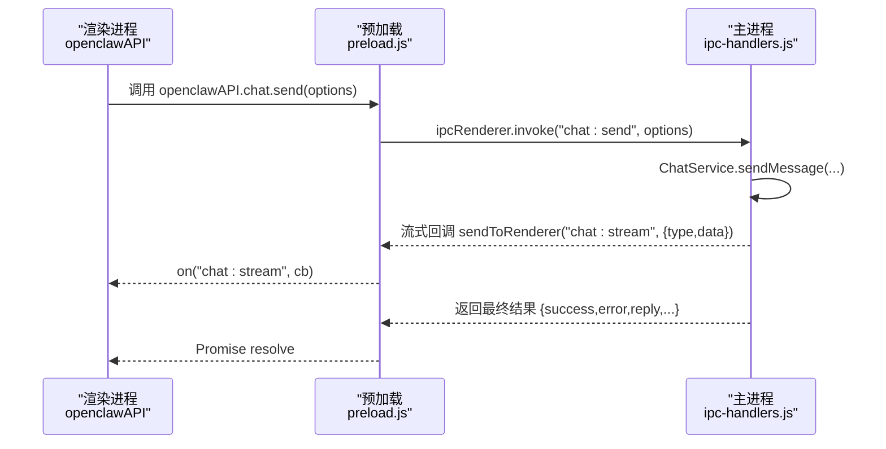
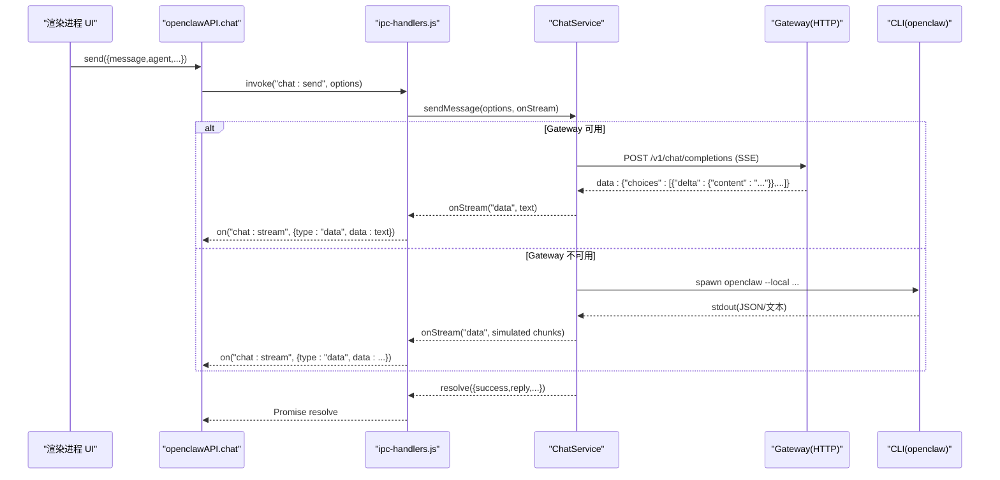
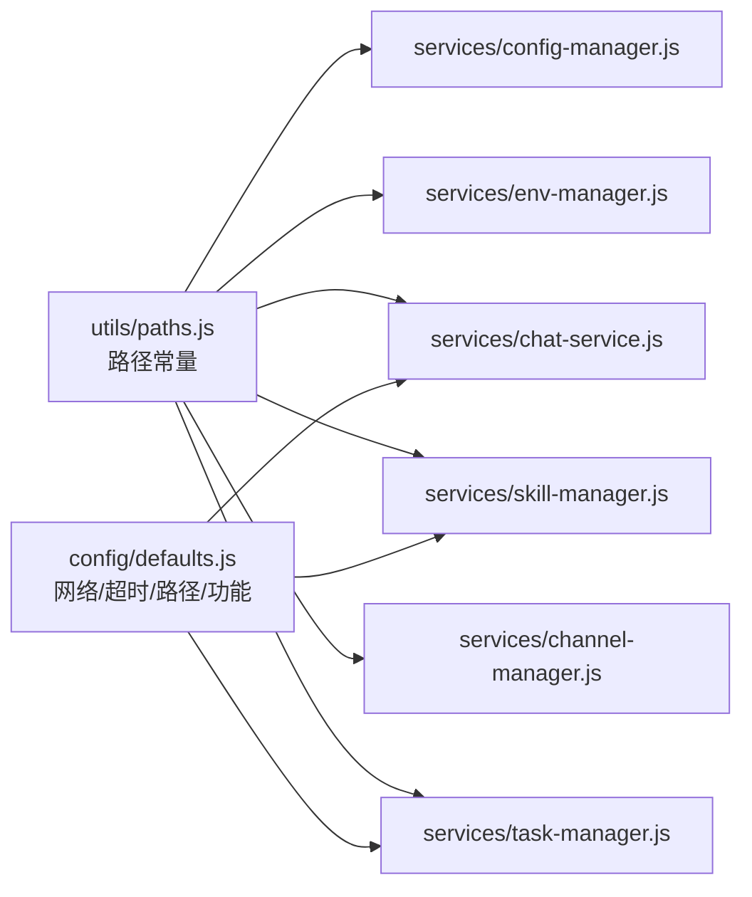

# API 参考

<cite>
**本文引用的文件**
- [src/main/preload.js](file://src/main/preload.js)
- [src/main/ipc-handlers.js](file://src/main/ipc-handlers.js)
- [src/main/services/chat-service.js](file://src/main/services/chat-service.js)
- [src/main/services/chat-storage.js](file://src/main/services/chat-storage.js)
- [src/main/services/skill-manager.js](file://src/main/services/skill-manager.js)
- [src/main/services/config-manager.js](file://src/main/services/config-manager.js)
- [src/main/services/env-manager.js](file://src/main/services/env-manager.js)
- [src/main/services/mcp-manager.js](file://src/main/services/mcp-manager.js)
- [src/main/services/channel-manager.js](file://src/main/services/channel-manager.js)
- [src/main/services/task-manager.js](file://src/main/services/task-manager.js)
- [src/main/utils/paths.js](file://src/main/utils/paths.js)
- [src/main/config/defaults.js](file://src/main/config/defaults.js)
- [src/renderer/js/app.js](file://src/renderer/js/app.js)
- [package.json](file://package.json)
- [README.md](file://README.md)
</cite>

## 目录
1. [简介](#简介)
2. [项目结构](#项目结构)
3. [核心组件](#核心组件)
4. [架构总览](#架构总览)
5. [详细组件分析](#详细组件分析)
6. [依赖关系分析](#依赖关系分析)
7. [性能考量](#性能考量)
8. [故障排查指南](#故障排查指南)
9. [结论](#结论)
10. [附录](#附录)

## 简介
本文件为 OpenClaw 安装管理器的完整 API 参考，覆盖主进程与渲染进程之间的 IPC 通信接口、消息格式与回调机制，并系统化文档化以下能力：
- 技能管理 API：安装、卸载、启用/禁用、查询、导入内置技能、自定义技能创建等
- 聊天服务 API：消息发送（含本地模式）、会话管理、流式响应、附件处理、IM 渠道消息监听
- 配置管理 API：openclaw.json 读写、环境变量管理、MCP 服务器配置、认证与模型配置
- 其他：服务控制、日志、诊断、任务计划、渠道管理、依赖检测与安装等

本参考面向第三方开发者，提供请求/响应格式、参数说明、返回值定义与错误处理机制，配合实际代码路径与使用场景，便于快速集成与扩展。

## 项目结构
- 主进程负责系统级能力与 IPC 注册，渲染进程通过安全桥接调用 API
- 关键路径：
  - 渲染进程桥接：src/renderer/js/app.js 与 preload.js 暴露 openclawAPI
  - IPC 注册：src/main/ipc-handlers.js 统一注册所有通道
  - 业务服务：src/main/services/*.js 提供具体功能实现
  - 默认配置与路径：src/main/config/defaults.js、src/main/utils/paths.js

```mermaid
graph TB
subgraph "渲染进程"
APP["app.js<br/>应用入口"]
BRIDGE["preload.js<br/>openclawAPI 桥接"]
end
subgraph "主进程"
IPC["ipc-handlers.js<br/>IPC 通道注册"]
SVC_CHAT["chat-service.js<br/>聊天服务"]
SVC_STORAGE["chat-storage.js<br/>会话存储"]
SVC_SKILLS["skill-manager.js<br/>技能管理"]
SVC_CFG["config-manager.js<br/>配置管理"]
SVC_ENV["env-manager.js<br/>环境变量"]
SVC_MCP["mcp-manager.js<br/>MCP 管理"]
SVC_CHANNELS["channel-manager.js<br/>渠道管理"]
SVC_TASKS["task-manager.js<br/>任务管理"]
end
APP --> BRIDGE
BRIDGE <- --> IPC
IPC --> SVC_CHAT
IPC --> SVC_STORAGE
IPC --> SVC_SKILLS
IPC --> SVC_CFG
IPC --> SVC_ENV
IPC --> SVC_MCP
IPC --> SVC_CHANNELS
IPC --> SVC_TASKS
```

**图表来源**
- [src/renderer/js/app.js:1-72](file://src/renderer/js/app.js#L1-L72)
- [src/main/preload.js:1-239](file://src/main/preload.js#L1-L239)
- [src/main/ipc-handlers.js:1-816](file://src/main/ipc-handlers.js#L1-L816)

**章节来源**
- [README.md:36-90](file://README.md#L36-L90)
- [package.json:1-75](file://package.json#L1-L75)

## 核心组件
- openclawAPI：在渲染进程中通过 preload 暴露的统一 API 命名空间，按功能域分组（deps、install、config、env、service、doctor、logs、profiles、dialog、mcp、skills、channels、tasks、chat、utils）
- IPC 通道：主进程通过 ipcMain.handle/ipcMain.on 注册异步调用与事件推送；渲染进程通过 ipcRenderer.invoke/send 与 on 监听
- 服务层：各功能域由独立服务类封装，统一处理配置读写、命令执行、网络请求与文件系统操作

**章节来源**
- [src/main/preload.js:3-238](file://src/main/preload.js#L3-L238)
- [src/main/ipc-handlers.js:26-816](file://src/main/ipc-handlers.js#L26-L816)

## 架构总览
- IPC 调用模式
  - invoke：请求-响应，返回 Promise，适用于一次性操作（如读取配置、安装、测试连接）
  - send/on：事件推送，适用于持续流式或进度回调（如安装进度、日志行、聊天流、服务状态变化）



**图表来源**
- [src/main/preload.js:197-226](file://src/main/preload.js#L197-L226)
- [src/main/ipc-handlers.js:709-755](file://src/main/ipc-handlers.js#L709-L755)
- [src/main/services/chat-service.js:347-536](file://src/main/services/chat-service.js#L347-L536)

**章节来源**
- [src/main/preload.js:3-238](file://src/main/preload.js#L3-L238)
- [src/main/ipc-handlers.js:26-816](file://src/main/ipc-handlers.js#L26-L816)

## 详细组件分析

### 依赖检测与安装（deps）
- 通道
  - deps:check-all → 返回依赖检测结果
  - deps:check-for-mode → 按模式检测依赖
  - deps:check-wsl → 检测 WSL
  - deps:install-node / deps:install-git / deps:install-wsl / deps:install-node-wsl → 安装流程（invoke 返回结果，同时推送进度事件）
  - deps:set-execution-mode / deps:get-execution-mode → 模式管理
- 进度事件
  - deps:progress / deps:wsl-progress → 事件推送，包含 step、message、percent 等字段
- 请求/响应
  - invoke：返回 Promise，安装成功/失败取决于底层执行结果
  - on：订阅进度事件，用于 UI 进度条与状态提示

**章节来源**
- [src/main/ipc-handlers.js:54-161](file://src/main/ipc-handlers.js#L54-L161)
- [src/main/preload.js:4-31](file://src/main/preload.js#L4-L31)

### 安装与卸载（install/uninstall）
- 通道
  - install:get-version → 获取已安装版本
  - install:run / install:update → 安装/更新（send，事件推送进度）
  - uninstall:run → 卸载（send，事件推送进度）
- 进度事件
  - install:progress / uninstall:progress → 包含 step、message、percent
- 使用场景
  - 启动时检测版本决定向导/仪表盘
  - 安装过程中显示镜像切换、依赖准备、下载与安装阶段

**章节来源**
- [src/main/ipc-handlers.js:163-195](file://src/main/ipc-handlers.js#L163-L195)
- [src/main/ipc-handlers.js:626-635](file://src/main/ipc-handlers.js#L626-L635)
- [src/main/preload.js:33-48](file://src/main/preload.js#L33-L48)
- [src/renderer/js/app.js:12-26](file://src/renderer/js/app.js#L12-L26)

### 配置管理（config）
- 通道
  - config:read / config:write / config:get-path → openclaw.json 读写与路径
  - config:read-auth-profiles / config:write-auth-profiles → 认证档案读写
  - config:set-provider-apikey / config:remove-provider-apikey → 单个提供商 API Key 管理
  - config:read-models / config:write-models / config:set-provider-models → 模型配置
  - config:write-onboard → 写入引导配置（替代 CLI onboard）
  - config:install-daemon → 安装守护进程（send，事件推送）
  - config:test-connection → 测试 AI 供应商连接
- 进度事件
  - config:daemon-progress → 守护进程安装进度
- 使用场景
  - 可视化编辑 openclaw.json
  - 管理多提供商 API Key 与模型映射
  - 测试连接可用性

**章节来源**
- [src/main/ipc-handlers.js:207-264](file://src/main/ipc-handlers.js#L207-L264)
- [src/main/services/config-manager.js:1-264](file://src/main/services/config-manager.js#L1-L264)
- [src/main/services/env-manager.js:1-116](file://src/main/services/env-manager.js#L1-L116)

### 环境变量（env）
- 通道
  - env:read / env:write → 读写 .env（覆盖写）
  - env:set-api-key / env:remove-api-key → 单个 API Key 管理（合并写，不覆盖其他条目）
- 使用场景
  - 为聊天服务注入 API Key 与模型参数

**章节来源**
- [src/main/ipc-handlers.js:322-339](file://src/main/ipc-handlers.js#L322-L339)
- [src/main/services/env-manager.js:1-116](file://src/main/services/env-manager.js#L1-L116)

### 服务控制（service）
- 通道
  - service:start / service:stop / service:restart → 启动/停止/重启
  - service:get-status / service:get-autostart / service:set-autostart / service:install-autostart → 状态与开机自启
  - 事件：service:progress、service:status-change
- 使用场景
  - 仪表盘服务管理标签页

**章节来源**
- [src/main/ipc-handlers.js:350-387](file://src/main/ipc-handlers.js#L350-L387)
- [src/main/preload.js:85-104](file://src/main/preload.js#L85-L104)

### 诊断与日志（doctor/logs）
- 通道
  - doctor:run / doctor:validate-and-fix → 诊断与修复
  - logs:read / logs:getInfo → 读取日志与信息
  - logs:watch-start / logs:watch-stop → 实时监控日志
  - 事件：logs:line → 新日志行
- 使用场景
  - 故障排查与日志导出

**章节来源**
- [src/main/ipc-handlers.js:389-416](file://src/main/ipc-handlers.js#L389-L416)
- [src/main/preload.js:112-123](file://src/main/preload.js#L112-L123)

### 配置档案（profiles）
- 通道
  - profiles:list / profiles:switch / profiles:create / profiles:delete → 列表、切换、创建、删除
  - profiles:export / profiles:import → 导出/导入
- 使用场景
  - 多环境配置切换与备份

**章节来源**
- [src/main/ipc-handlers.js:418-457](file://src/main/ipc-handlers.js#L418-L457)
- [src/main/services/profile-manager.js:1-180](file://src/main/services/profile-manager.js#L1-L180)

### 对话与会话（chat）
- 通道
  - chat:send / chat:send-local → 发送消息（Gateway SSE 真流式；本地模式模拟流）
  - chat:agents / chat:skills → 列举可用代理与技能
  - chat:clear-session → 清理会话
  - 会话存储：chat:save-session / chat:load-session / chat:load-session-messages / chat:list-sessions / chat:delete-session / chat:save-summary / chat:get-knowledge / chat:session-stats
  - 事件：chat:stream → 流式数据（type: data/thinking_end；data: 文本片段）
  - IM 监听：chat:im-watch-start / chat:im-watch-stop → on("chat:im-message")
- 流式响应机制
  - Gateway 模式：HTTP SSE，逐块推送 choices[].delta.content
  - CLI 降级：模拟打字机效果，按分片与延时推送
- 附件处理
  - 通过对话框选择文件，限制大小与类型，Office/PDF 提示转换为文本格式后上传



**图表来源**
- [src/main/ipc-handlers.js:709-755](file://src/main/ipc-handlers.js#L709-L755)
- [src/main/services/chat-service.js:347-536](file://src/main/services/chat-service.js#L347-L536)
- [src/main/services/chat-service.js:542-588](file://src/main/services/chat-service.js#L542-L588)

**章节来源**
- [src/main/ipc-handlers.js:709-796](file://src/main/ipc-handlers.js#L709-L796)
- [src/main/services/chat-service.js:1-800](file://src/main/services/chat-service.js#L1-L800)
- [src/main/services/chat-storage.js:1-333](file://src/main/services/chat-storage.js#L1-L333)

### 技能管理（skills）
- 通道
  - skills:list / skills:install / skills:remove / skills:enable / skills:disable → 列表、安装、卸载、启用、禁用
  - skills:search / skills:explore / skills:listInstalled / skills:inspect / skills:info → 市场搜索、浏览、已安装列表、详情、信息
  - skills:import-bundled / skills:get-bundled-list / skills:create-custom → 导入内置、获取列表、创建自定义
  - 事件：skills:import-progress → 导入进度
- 依赖 Gateway API 与 openclaw CLI
  - 优先使用 Gateway /tools/invoke；失败时回退文件系统操作
  - 列表缓存（60 秒）减少 CLI 调用频率

**章节来源**
- [src/main/ipc-handlers.js:542-591](file://src/main/ipc-handlers.js#L542-L591)
- [src/main/services/skill-manager.js:1-1096](file://src/main/services/skill-manager.js#L1-L1096)

### 渠道管理（channels）
- 通道
  - channels:list / channels:get / channels:update / channels:set-enabled → 列表、获取、更新、启用/禁用
  - channels:test → 测试连接（自动保存配置并测试）
  - channels:verify-pairing → 飞书配对码验证
  - channels:definitions → 获取渠道定义（字段、图标、是否多账号、是否需要配对）
- 插件安装
  - 自动检测并安装对应 openclaw 插件（内置 extension）
- 使用场景
  - 飞书/钉钉/企业微信/QQ 等 IM 渠道接入

**章节来源**
- [src/main/ipc-handlers.js:597-624](file://src/main/ipc-handlers.js#L597-L624)
- [src/main/services/channel-manager.js:1-747](file://src/main/services/channel-manager.js#L1-L747)

### 任务管理（tasks）
- 通道
  - tasks:list / tasks:create / tasks:edit / tasks:enable / tasks:disable / tasks:delete / tasks:run → 列表、创建、编辑、启用、禁用、删除、运行
  - tasks:history / tasks:status → 历史与调度器状态
- 执行方式
  - 通过 openclaw cron 命令与 Gateway 交互
  - 对 stderr 进行解析与错误提取，支持缓存与“瞬时错误”降级（如 Gateway 重启中）

**章节来源**
- [src/main/ipc-handlers.js:672-707](file://src/main/ipc-handlers.js#L672-L707)
- [src/main/services/task-manager.js:1-735](file://src/main/services/task-manager.js#L1-L735)

### MCP 管理（mcp）
- 通道
  - mcp:list / mcp:add / mcp:remove / mcp:update → 列表、添加、删除、更新
- 使用场景
  - 管理 Model Context Protocol 服务器配置（命令、参数、环境变量、启用状态）

**章节来源**
- [src/main/ipc-handlers.js:525-541](file://src/main/ipc-handlers.js#L525-L541)
- [src/main/services/mcp-manager.js:1-102](file://src/main/services/mcp-manager.js#L1-L102)

### 工具与实用（utils）
- 通道
  - utils:open-external → 打开外部链接
  - utils:get-app-version → 获取应用版本
  - utils:get-platform-info → 获取平台信息（系统 Node 版本、OS 发行版、用户目录）
  - path:check / path:add → PATH 检查与添加
  - diagnostics:run / diagnostics:save-report → 诊断与报告保存
- 使用场景
  - 版本与平台信息展示、外部链接跳转、PATH 修复、诊断报告

**章节来源**
- [src/main/ipc-handlers.js:637-670](file://src/main/ipc-handlers.js#L637-L670)
- [src/main/preload.js:228-238](file://src/main/preload.js#L228-L238)

## 依赖关系分析
- 路径与配置
  - OPENCLAW_HOME、CONFIG_PATH、ENV_PATH、PROFILES_DIR、LOGS_DIR 由 utils/paths.js 统一管理
  - 默认网络与超时参数由 config/defaults.js 提供
- 服务间耦合
  - ChatService 依赖 openclaw.json 与 .env，支持 Gateway 与 CLI 双通道
  - SkillManager 依赖 Gateway API 与 openclaw CLI，具备缓存与错误降级
  - ChannelManager 依赖 openclaw 插件安装与 channels status 命令
  - TaskManager 通过 openclaw cron 与 Gateway 交互，具备“瞬时错误”降级逻辑



**图表来源**
- [src/main/utils/paths.js:1-124](file://src/main/utils/paths.js#L1-L124)
- [src/main/config/defaults.js:1-180](file://src/main/config/defaults.js#L1-L180)

**章节来源**
- [src/main/utils/paths.js:1-124](file://src/main/utils/paths.js#L1-L124)
- [src/main/config/defaults.js:1-180](file://src/main/config/defaults.js#L1-L180)

## 性能考量
- 缓存策略
  - 技能列表缓存（60 秒）、任务列表缓存（30 秒）、Gateway 可用性缓存（30 秒）、404 缓存（5 分钟）
- 超时与降级
  - Gateway 探测 1.5 秒超时；HTTP 请求默认 2 分钟；CLI 聊天默认 5 分钟；瞬时错误（如 Gateway 重启）返回缓存数据
- 流式优化
  - Gateway 使用 SSE 真流式；CLI 采用模拟打字机流，按分片与延时推送
- I/O 与并发
  - 会话存储采用 JSON 文件分页加载；日志监控使用 chokidar；文件选择限制单次附件大小（500KB）

**章节来源**
- [src/main/services/chat-service.js:92-116](file://src/main/services/chat-service.js#L92-L116)
- [src/main/services/skill-manager.js:9-23](file://src/main/services/skill-manager.js#L9-L23)
- [src/main/services/task-manager.js:262-271](file://src/main/services/task-manager.js#L262-L271)
- [src/main/config/defaults.js:34-70](file://src/main/config/defaults.js#L34-L70)

## 故障排查指南
- 常见错误与处理
  - Gateway 404/401/403/5xx：触发 CLI 降级（--local 模式），或返回错误信息
  - Gateway 临时不可用（重启中）：返回缓存数据，避免阻塞 UI
  - 安装/卸载/更新失败：事件推送错误信息，UI 展示具体原因
  - 日志监控：logs:watch-start/stop 与 logs:line 事件配合使用
- 建议流程
  - 先 doctor:run / doctor:validate-and-fix
  - 检查 config:test-connection 与 channels:test
  - 查看 logs:read / logs:getInfo 与实时 logs:line
  - 使用 utils:runDiagnostics / utils:saveDiagnosticReport 生成报告

**章节来源**
- [src/main/ipc-handlers.js:389-416](file://src/main/ipc-handlers.js#L389-L416)
- [src/main/ipc-handlers.js:266-320](file://src/main/ipc-handlers.js#L266-L320)
- [src/main/services/task-manager.js:262-326](file://src/main/services/task-manager.js#L262-L326)

## 结论
本 API 参考系统化梳理了主进程与渲染进程之间的 IPC 通信、消息格式与回调机制，覆盖技能管理、聊天服务、配置管理、渠道与任务等核心能力。通过统一的 openclawAPI 命名空间与明确的请求/响应与事件约定，第三方开发者可快速集成并扩展功能。建议在生产环境中充分利用缓存与降级策略，结合诊断与日志能力，提升稳定性与可观测性。

## 附录

### IPC 通道一览（按功能域）
- 依赖检测：deps:check-all, deps:check-for-mode, deps:check-wsl, deps:install-node, deps:install-git, deps:install-wsl, deps:install-node-wsl, deps:set-execution-mode, deps:get-execution-mode
- 安装/卸载：install:get-version, install:run, install:update, uninstall:run
- 配置：config:read, config:write, config:get-path, config:read-auth-profiles, config:write-auth-profiles, config:set-provider-apikey, config:remove-provider-apikey, config:read-models, config:write-models, config:set-provider-models, config:write-onboard, config:install-daemon, config:test-connection
- 环境变量：env:read, env:write, env:set-api-key, env:remove-api-key
- 服务：service:start, service:stop, service:restart, service:get-status, service:get-autostart, service:set-autostart, service:install-autostart
- 诊断与日志：doctor:run, doctor:validate-and-fix, logs:read, logs:getInfo, logs:watch-start, logs:watch-stop
- 配置档案：profiles:list, profiles:switch, profiles:create, profiles:delete, profiles:export, profiles:import
- 对话与会话：chat:send, chat:send-local, chat:agents, chat:skills, chat:clear-session, chat:save-session, chat:load-session, chat:load-session-messages, chat:list-sessions, chat:delete-session, chat:save-summary, chat:get-knowledge, chat:session-stats, chat:im-watch-start, chat:im-watch-stop
- 技能：skills:list, skills:install, skills:remove, skills:enable, skills:disable, skills:search, skills:explore, skills:list-installed, skills:inspect, skills:info, skills:import-bundled, skills:get-bundled-list, skills:create-custom
- 渠道：channels:list, channels:get, channels:update, channels:set-enabled, channels:test, channels:verify-pairing, channels:definitions
- 任务：tasks:list, tasks:create, tasks:edit, tasks:enable, tasks:disable, tasks:delete, tasks:run, tasks:history, tasks:status
- MCP：mcp:list, mcp:add, mcp:remove, mcp:update
- 工具：utils:open-external, utils:get-app-version, utils:get-platform-info, path:check, path:add, diagnostics:run, diagnostics:save-report

**章节来源**
- [src/main/preload.js:3-238](file://src/main/preload.js#L3-L238)
- [src/main/ipc-handlers.js:26-816](file://src/main/ipc-handlers.js#L26-L816)