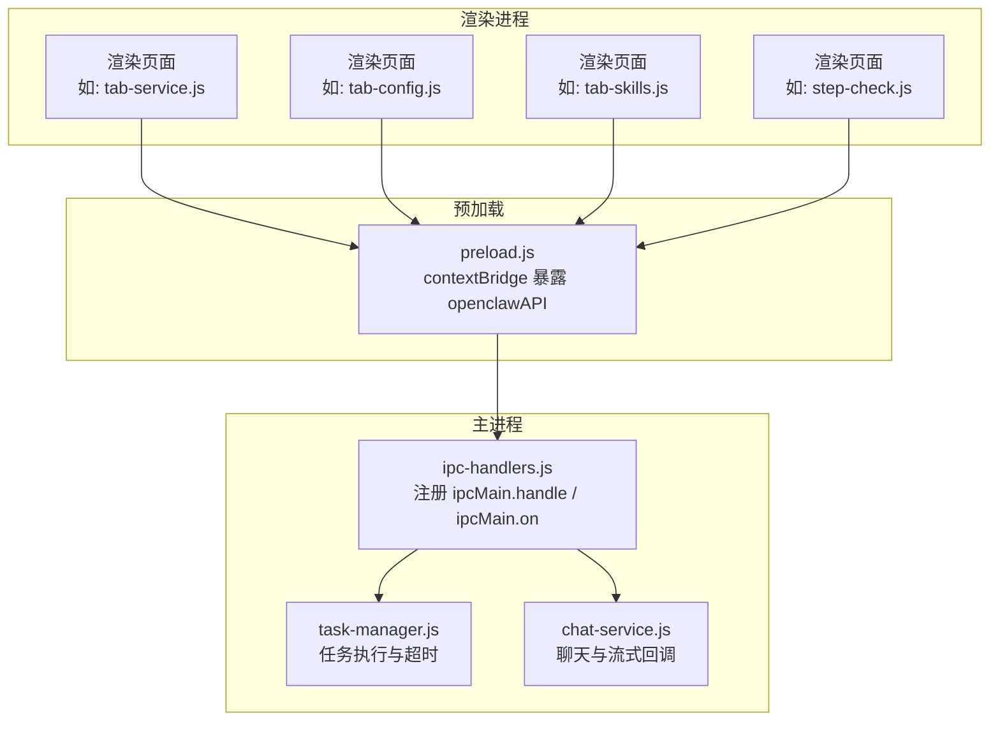
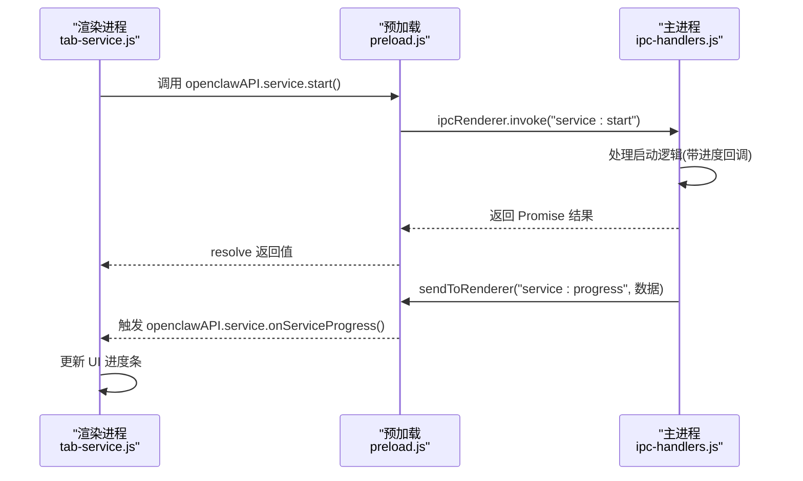
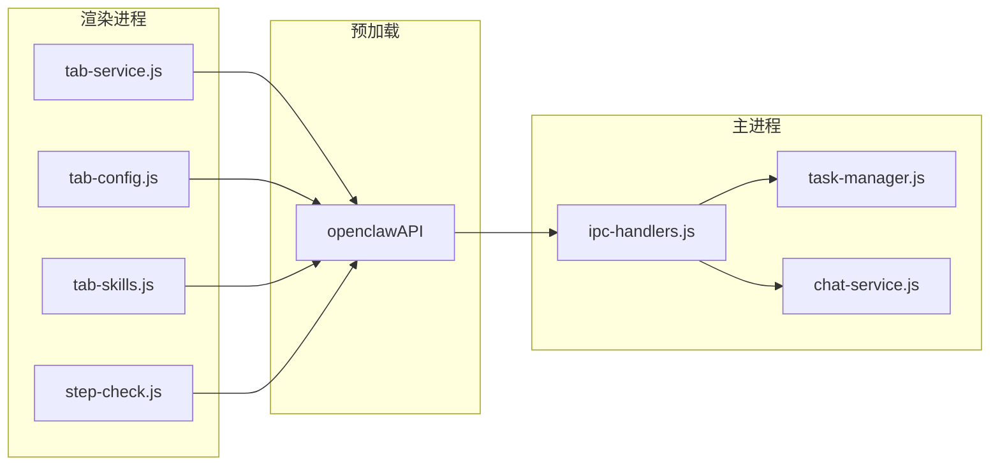

# IPC 通信接口

<cite>
**本文档引用的文件**
- [src/main/ipc-handlers.js](file://src/main/ipc-handlers.js)
- [src/main/preload.js](file://src/main/preload.js)
- [src/renderer/js/app.js](file://src/renderer/js/app.js)
- [src/renderer/js/dashboard/tab-service.js](file://src/renderer/js/dashboard/tab-service.js)
- [src/renderer/js/dashboard/tab-config.js](file://src/renderer/js/dashboard/tab-config.js)
- [src/renderer/js/dashboard/tab-skills.js](file://src/renderer/js/dashboard/tab-skills.js)
- [src/renderer/js/wizard/step-check.js](file://src/renderer/js/wizard/step-check.js)
- [src/main/services/task-manager.js](file://src/main/services/task-manager.js)
- [src/main/services/chat-service.js](file://src/main/services/chat-service.js)
</cite>

## 目录
1. [简介](#简介)
2. [项目结构](#项目结构)
3. [核心组件](#核心组件)
4. [架构总览](#架构总览)
5. [详细组件分析](#详细组件分析)
6. [依赖关系分析](#依赖关系分析)
7. [性能考量](#性能考量)
8. [故障排查指南](#故障排查指南)
9. [结论](#结论)
10. [附录](#附录)

## 简介
本文件系统性梳理了 Electron 应用中的 IPC 通信接口，重点覆盖主进程与渲染进程之间的通信机制，包括 ipcMain.handle 与 ipcRenderer.invoke 的使用模式；统一的 IPC 通道命名规范、消息格式与数据传递方式；进度回调机制、错误处理策略与超时管理；每个 IPC 接口的调用示例、参数说明与返回值定义；以及预加载脚本中的安全考虑与权限控制。文档同时提供实际的代码示例路径，帮助开发者在渲染进程中正确调用主进程接口，并处理异步响应与流式数据传输。

## 项目结构
Electron 应用采用标准的主进程-预加载-渲染进程三层结构：
- 主进程负责业务逻辑与系统交互，注册所有 IPC 处理器。
- 预加载脚本通过 contextBridge 暴露受控 API 至渲染进程。
- 渲染进程通过暴露的 API 调用主进程能力并接收事件回调。

图表来源
- [src/main/preload.js:1-239](file://src/main/preload.js#L1-L239)
- [src/main/ipc-handlers.js:1-816](file://src/main/ipc-handlers.js#L1-L816)
- [src/main/services/task-manager.js:201-249](file://src/main/services/task-manager.js#L201-L249)
- [src/main/services/chat-service.js:883-905](file://src/main/services/chat-service.js#L883-L905)

章节来源
- [src/main/preload.js:1-239](file://src/main/preload.js#L1-L239)
- [src/main/ipc-handlers.js:1-816](file://src/main/ipc-handlers.js#L1-L816)

## 核心组件
- 预加载 API 暴露层：通过 contextBridge.exposeInMainWorld 在渲染进程全局暴露 openclawAPI，按功能域划分模块（deps、install、config、env、service、doctor、logs、profiles、dialog、mcp、skills、channels、tasks、chat、utils），每个模块提供 invoke/send 方法与事件监听器。
- 主进程处理器：集中于 registerAllHandlers，使用 ipcMain.handle 提供同步/异步查询接口，使用 ipcMain.on 提供事件驱动的长耗时任务与流式回调。
- 事件桥接：主进程通过 sendToRenderer 将进度与流式数据转发至渲染进程，渲染侧通过 onXxx 回调订阅。

章节来源
- [src/main/preload.js:3-238](file://src/main/preload.js#L3-L238)
- [src/main/ipc-handlers.js:26-816](file://src/main/ipc-handlers.js#L26-L816)

## 架构总览
主进程与渲染进程的通信遵循“请求-响应/事件”双模式：
- 请求-响应：渲染进程调用 openclawAPI.xxx.invoke(...)，主进程以 ipcMain.handle(...) 处理并返回 Promise 结果。
- 事件驱动：渲染进程调用 openclawAPI.xxx.send(...)，主进程以 ipcMain.on(...) 处理；同时主进程通过 webContents.send(...) 向渲染进程推送进度/流式数据，渲染进程通过 openclawAPI.xxx.onXxx(...) 订阅。

图表来源
- [src/renderer/js/dashboard/tab-service.js:142-144](file://src/renderer/js/dashboard/tab-service.js#L142-L144)
- [src/main/preload.js:86-104](file://src/main/preload.js#L86-L104)
- [src/main/ipc-handlers.js:351-375](file://src/main/ipc-handlers.js#L351-L375)

## 详细组件分析

### 1) 预加载 API 设计与安全
- 仅暴露必要接口，避免直接访问 Node.js/Electron API。
- 每个功能域提供 invoke/send 与 onXxx 事件监听器，统一命名与参数约定。
- 事件监听器返回解绑函数，便于组件销毁时清理。

章节来源
- [src/main/preload.js:3-238](file://src/main/preload.js#L3-L238)

### 2) 依赖检查与安装（deps）
- 通道命名：deps:check-all、deps:check-for-mode、deps:check-wsl、deps:install-node、deps:install-git、deps:install-wsl、deps:install-node-wsl、deps:set-execution-mode、deps:get-execution-mode。
- 调用模式：
  - invoke：deps:check-all、deps:check-for-mode、deps:check-wsl、deps:set-execution-mode、deps:get-execution-mode。
  - invoke：deps:install-node/git/wsl/node-wsl（返回安装结果）。
  - on：deps:progress、deps:wsl-progress（进度回调）。
- 进度回调：主进程在安装过程中通过 sendToRenderer 推送进度对象，渲染侧通过 openclawAPI.deps.onDepsProgress/onWslProgress 订阅。

章节来源
- [src/main/ipc-handlers.js:55-161](file://src/main/ipc-handlers.js#L55-L161)
- [src/main/preload.js:4-31](file://src/main/preload.js#L4-L31)

### 3) 安装与卸载（install/uninstall）
- 通道命名：install:run、install:update、install:get-version、uninstall:run、install:progress、uninstall:progress。
- 调用模式：
  - invoke：install:get-version。
  - send：install:run/install:update/uninstall:run（长耗时任务，无返回值，通过进度事件推进）。
  - on：install:progress、uninstall:progress。
- 错误处理：异常通过进度事件携带 step:error 与 message 字段，渲染侧统一提示。

章节来源
- [src/main/ipc-handlers.js:164-195](file://src/main/ipc-handlers.js#L164-L195)
- [src/main/ipc-handlers.js:627-635](file://src/main/ipc-handlers.js#L627-L635)
- [src/main/preload.js:34-49](file://src/main/preload.js#L34-L49)

### 4) 配置管理（config）
- 通道命名：config:read、config:write、config:get-path、config:read-auth-profiles、config:write-auth-profiles、config:set-provider-apikey、config:remove-provider-apikey、config:read-models、config:write-models、config:set-provider-models、config:write-onboard、config:install-daemon、config:daemon-progress、config:test-connection。
- 调用模式：
  - invoke：读写配置、获取路径、测试连接、安装守护进程（send）。
  - on：config:daemon-progress。
- 参数与返回：
  - config:test-connection 接收 { apiKey, baseUrl, model }，返回 { success, message }。
  - config:write-onboard 接收表单数据，返回写入结果。

章节来源
- [src/main/ipc-handlers.js:208-253](file://src/main/ipc-handlers.js#L208-L253)
- [src/main/ipc-handlers.js:256-264](file://src/main/ipc-handlers.js#L256-L264)
- [src/main/ipc-handlers.js:267-320](file://src/main/ipc-handlers.js#L267-L320)
- [src/main/preload.js:52-73](file://src/main/preload.js#L52-L73)

### 5) 环境变量（env）
- 通道命名：env:read、env:write、env:set-api-key、env:remove-api-key。
- 调用模式：invoke，支持单个 API Key 的增删改查。

章节来源
- [src/main/ipc-handlers.js:323-339](file://src/main/ipc-handlers.js#L323-L339)
- [src/main/preload.js:76-83](file://src/main/preload.js#L76-L83)

### 6) 服务控制（service）
- 通道命名：service:start、service:stop、service:restart、service:get-status、service:get-autostart、service:set-autostart、service:install-autostart、service:status-change、service:progress。
- 调用模式：
  - invoke：启动/停止/重启/状态查询/自启设置。
  - on：service:progress（进度）、service:status-change（状态变更）。
- UI 协同：渲染侧通过 openclawAPI.service.onServiceProgress 更新进度条，tab-service.js 展示服务状态与自启开关。

章节来源
- [src/main/ipc-handlers.js:351-387](file://src/main/ipc-handlers.js#L351-L387)
- [src/main/preload.js:86-104](file://src/main/preload.js#L86-L104)
- [src/renderer/js/dashboard/tab-service.js:142-149](file://src/renderer/js/dashboard/tab-service.js#L142-L149)

### 7) 诊断（doctor）
- 通道命名：doctor:run、doctor:validate-and-fix。
- 调用模式：invoke，返回诊断结果或修复结果。

章节来源
- [src/main/ipc-handlers.js:390-397](file://src/main/ipc-handlers.js#L390-L397)
- [src/main/preload.js:107-110](file://src/main/preload.js#L107-L110)

### 8) 日志（logs）
- 通道命名：logs:read、logs:getInfo、logs:watch-start、logs:watch-stop、logs:line。
- 调用模式：
  - invoke：读取日志与日志信息。
  - send：watch-start/watch-stop。
  - on：logs:line（实时日志行）。

章节来源
- [src/main/ipc-handlers.js:400-416](file://src/main/ipc-handlers.js#L400-L416)
- [src/main/preload.js:112-123](file://src/main/preload.js#L112-L123)

### 9) 配置档案（profiles）
- 通道命名：profiles:list、profiles:switch、profiles:create、profiles:delete、profiles:export、profiles:import。
- 调用模式：invoke，部分涉及文件对话框选择。

章节来源
- [src/main/ipc-handlers.js:419-457](file://src/main/ipc-handlers.js#L419-L457)
- [src/main/preload.js:125-135](file://src/main/preload.js#L125-L135)

### 10) 对话框与文件选择（dialog）
- 通道命名：dialog:selectDirectory、dialog:selectFiles。
- 调用模式：invoke，返回用户选择结果或错误信息。

章节来源
- [src/main/ipc-handlers.js:460-522](file://src/main/ipc-handlers.js#L460-L522)
- [src/main/preload.js:138-141](file://src/main/preload.js#L138-L141)

### 11) MCP 管理（mcp）
- 通道命名：mcp:list、mcp:add、mcp:remove、mcp:update。
- 调用模式：invoke。

章节来源
- [src/main/ipc-handlers.js:526-536](file://src/main/ipc-handlers.js#L526-L536)
- [src/main/preload.js:144-149](file://src/main/preload.js#L144-L149)

### 12) 技能管理（skills）
- 通道命名：skills:list、skills:install、skills:remove、skills:enable、skills:disable、skills:search、skills:explore、skills:list-installed、skills:inspect、skills:info、skills:import-bundled、skills:get-bundled-list、skills:create-custom、skills:import-progress。
- 调用模式：
  - invoke：技能 CRUD、搜索、探索、导入内置技能、创建自定义技能。
  - on：skills:import-progress（导入进度）。
- 导入进度：主进程通过 event.sender.send('skills:import-progress', ...) 推送，渲染侧通过 openclawAPI.skills.onImportProgress 订阅。

章节来源
- [src/main/ipc-handlers.js:543-595](file://src/main/ipc-handlers.js#L543-L595)
- [src/main/preload.js:152-171](file://src/main/preload.js#L152-L171)

### 13) 通道管理（channels）
- 通道命名：channels:list、channels:get、channels:update、channels:set-enabled、channels:test、channels:verify-pairing、channels:definitions。
- 调用模式：invoke。

章节来源
- [src/main/ipc-handlers.js:598-624](file://src/main/ipc-handlers.js#L598-L624)
- [src/main/preload.js:174-182](file://src/main/preload.js#L174-L182)

### 14) 任务调度（tasks）
- 通道命名：tasks:list、tasks:create、tasks:edit、tasks:enable、tasks:disable、tasks:delete、tasks:run、tasks:history、tasks:status。
- 调用模式：invoke。
- 超时管理：任务执行内部使用定时器与子进程超时控制，返回 { success, error, stdout, stderr, data }。

章节来源
- [src/main/ipc-handlers.js:673-707](file://src/main/ipc-handlers.js#L673-L707)
- [src/main/preload.js:185-195](file://src/main/preload.js#L185-L195)
- [src/main/services/task-manager.js:201-249](file://src/main/services/task-manager.js#L201-L249)

### 15) 聊天（chat）
- 通道命名：chat:send、chat:send-local、chat:agents、chat:skills、chat:clear-session、chat:save-session、chat:load-session、chat:load-session-messages、chat:list-sessions、chat:delete-session、chat:save-summary、chat:get-knowledge、chat:session-stats、chat:stream、chat:im-watch-start、chat:im-watch-stop、chat:im-message。
- 调用模式：
  - invoke：消息发送、代理/技能列表、会话管理、知识库与统计。
  - on：chat:stream（流式回调）、chat:im-message（IM 消息）。
- 流式回调：主进程在聊天服务中使用回调推送增量数据，渲染侧通过 openclawAPI.chat.onStream 订阅。

章节来源
- [src/main/ipc-handlers.js:712-796](file://src/main/ipc-handlers.js#L712-L796)
- [src/main/preload.js:198-226](file://src/main/preload.js#L198-L226)
- [src/main/services/chat-service.js:883-905](file://src/main/services/chat-service.js#L883-L905)

### 16) 工具与实用（utils）
- 通道命名：utils:open-external、utils:get-app-version、utils:get-platform-info、path:check、path:add、diagnostics:run、diagnostics:save-report。
- 调用模式：invoke/send。

章节来源
- [src/main/ipc-handlers.js:638-661](file://src/main/ipc-handlers.js#L638-L661)
- [src/main/preload.js:229-237](file://src/main/preload.js#L229-L237)

## 依赖关系分析
- 预加载 API 是渲染进程与主进程的唯一桥梁，所有调用均通过 openclawAPI.xxx.invoke/send 进行。
- 主进程处理器集中注册，按功能域拆分，便于维护与扩展。
- 事件驱动与请求-响应并存，满足不同场景需求（长耗时任务与即时查询）。

图表来源
- [src/renderer/js/dashboard/tab-service.js:142-144](file://src/renderer/js/dashboard/tab-service.js#L142-L144)
- [src/renderer/js/dashboard/tab-config.js:38-38](file://src/renderer/js/dashboard/tab-config.js#L38-L38)
- [src/renderer/js/dashboard/tab-skills.js:117-117](file://src/renderer/js/dashboard/tab-skills.js#L117-L117)
- [src/renderer/js/wizard/step-check.js:59-59](file://src/renderer/js/wizard/step-check.js#L59-L59)
- [src/main/preload.js:3-238](file://src/main/preload.js#L3-L238)
- [src/main/ipc-handlers.js:26-816](file://src/main/ipc-handlers.js#L26-L816)

## 性能考量
- 异步与流式：大量长耗时任务通过进度事件与流式回调推送，避免阻塞 UI。
- 超时控制：任务执行内部设置超时，及时释放资源并返回错误信息。
- 进度聚合：UI 侧对多次进度事件进行节流/合并，提升用户体验。

章节来源
- [src/main/services/task-manager.js:201-249](file://src/main/services/task-manager.js#L201-L249)

## 故障排查指南
- 依赖安装失败：检查 deps:progress/deps:wsl-progress 中的 step:error 与 message 字段，确认具体阶段与原因。
- 安装/卸载异常：查看 install:progress/uninstall:progress 中的错误信息，定位网络或权限问题。
- 服务启动卡顿：关注 service:progress 与 service:status-change，确认启动阶段与最终状态。
- 聊天无响应：确认 chat:stream 是否被订阅，检查 chat:send/chat:send-local 的参数与返回值。
- 任务执行超时：查看任务返回的 { success, error }，必要时调整超时阈值或优化子进程行为。

章节来源
- [src/main/ipc-handlers.js:76-84](file://src/main/ipc-handlers.js#L76-L84)
- [src/main/ipc-handlers.js:98-100](file://src/main/ipc-handlers.js#L98-L100)
- [src/main/ipc-handlers.js:117-119](file://src/main/ipc-handlers.js#L117-L119)
- [src/main/ipc-handlers.js:193-194](file://src/main/ipc-handlers.js#L193-L194)
- [src/main/ipc-handlers.js:262-263](file://src/main/ipc-handlers.js#L262-L263)
- [src/main/ipc-handlers.js:352-357](file://src/main/ipc-handlers.js#L352-L357)
- [src/main/ipc-handlers.js:716-718](file://src/main/ipc-handlers.js#L716-L718)

## 结论
该 IPC 设计以预加载 API 为核心，统一了通道命名与调用模式，兼顾请求-响应与事件驱动两种范式，有效支撑了复杂业务场景下的异步与流式数据处理。通过明确的错误与进度回调机制，渲染侧能够稳定地反馈状态并引导用户操作。建议后续持续完善通道文档与类型定义，进一步提升可维护性与可扩展性。

## 附录

### A. 通道命名规范与调用模式
- 命名规范：功能域:动作（如 deps:check-all、service:start）。
- 调用模式：
  - invoke：返回 Promise 的查询/操作（如 config:read、service:start、chat:send）。
  - send：无返回值的事件触发（如 install:run、logs:watch-start）。
  - on：事件监听（如 install:progress、service:progress、chat:stream）。

章节来源
- [src/main/ipc-handlers.js:55-161](file://src/main/ipc-handlers.js#L55-L161)
- [src/main/ipc-handlers.js:177-195](file://src/main/ipc-handlers.js#L177-L195)
- [src/main/preload.js:34-49](file://src/main/preload.js#L34-L49)

### B. 进度回调机制
- 主进程在长耗时任务中定期推送进度对象，渲染侧通过 onXxx 回调订阅并更新 UI。
- 常见进度通道：deps:progress、deps:wsl-progress、install:progress、uninstall:progress、service:progress、skills:import-progress、config:daemon-progress。

章节来源
- [src/main/ipc-handlers.js:75-77](file://src/main/ipc-handlers.js#L75-L77)
- [src/main/ipc-handlers.js:112-114](file://src/main/ipc-handlers.js#L112-L114)
- [src/main/ipc-handlers.js:189-191](file://src/main/ipc-handlers.js#L189-L191)
- [src/main/ipc-handlers.js:258-260](file://src/main/ipc-handlers.js#L258-L260)
- [src/main/ipc-handlers.js:352-354](file://src/main/ipc-handlers.js#L352-L354)
- [src/main/ipc-handlers.js:584-586](file://src/main/ipc-handlers.js#L584-L586)

### C. 错误处理策略
- 统一错误上报：异常通过进度事件携带 step:error 与 message，渲染侧统一提示。
- 返回值约定：多数 invoke 接口返回 { success, message } 或 { success, error }，便于前端判断。

章节来源
- [src/main/ipc-handlers.js:82-84](file://src/main/ipc-handlers.js#L82-L84)
- [src/main/ipc-handlers.js:98-100](file://src/main/ipc-handlers.js#L98-L100)
- [src/main/ipc-handlers.js:117-119](file://src/main/ipc-handlers.js#L117-L119)
- [src/main/ipc-handlers.js:193-194](file://src/main/ipc-handlers.js#L193-L194)
- [src/main/ipc-handlers.js:262-263](file://src/main/ipc-handlers.js#L262-L263)

### D. 超时管理
- 任务执行内部设置超时，超时后返回 { success: false, error: 'Timeout' }，避免长时间阻塞。
- 建议：根据任务复杂度合理设置超时阈值，并在 UI 上提供取消操作。

章节来源
- [src/main/services/task-manager.js:201-249](file://src/main/services/task-manager.js#L201-L249)

### E. 预加载脚本的安全考虑与权限控制
- contextBridge 暴露受限 API，避免直接暴露 Node.js/Electron 全部能力。
- 事件监听器返回解绑函数，防止内存泄漏。
- 建议：后续引入类型定义与静态检查，减少运行时错误。

章节来源
- [src/main/preload.js:1-239](file://src/main/preload.js#L1-L239)

### F. 实际调用示例（代码示例路径）
- 渲染进程初始化与版本检测
  - 示例路径：[src/renderer/js/app.js:14-14](file://src/renderer/js/app.js#L14-L14)
- 服务启动与进度监听
  - 示例路径：[src/renderer/js/dashboard/tab-service.js:142-144](file://src/renderer/js/dashboard/tab-service.js#L142-L144)
- 配置读取与自动补全
  - 示例路径：[src/renderer/js/dashboard/tab-config.js:38-48](file://src/renderer/js/dashboard/tab-config.js#L38-L48)
- 技能列表加载与导入进度
  - 示例路径：[src/renderer/js/dashboard/tab-skills.js:117-127](file://src/renderer/js/dashboard/tab-skills.js#L117-L127)
- 安装向导依赖检测
  - 示例路径：[src/renderer/js/wizard/step-check.js:59-62](file://src/renderer/js/wizard/step-check.js#L59-L62)