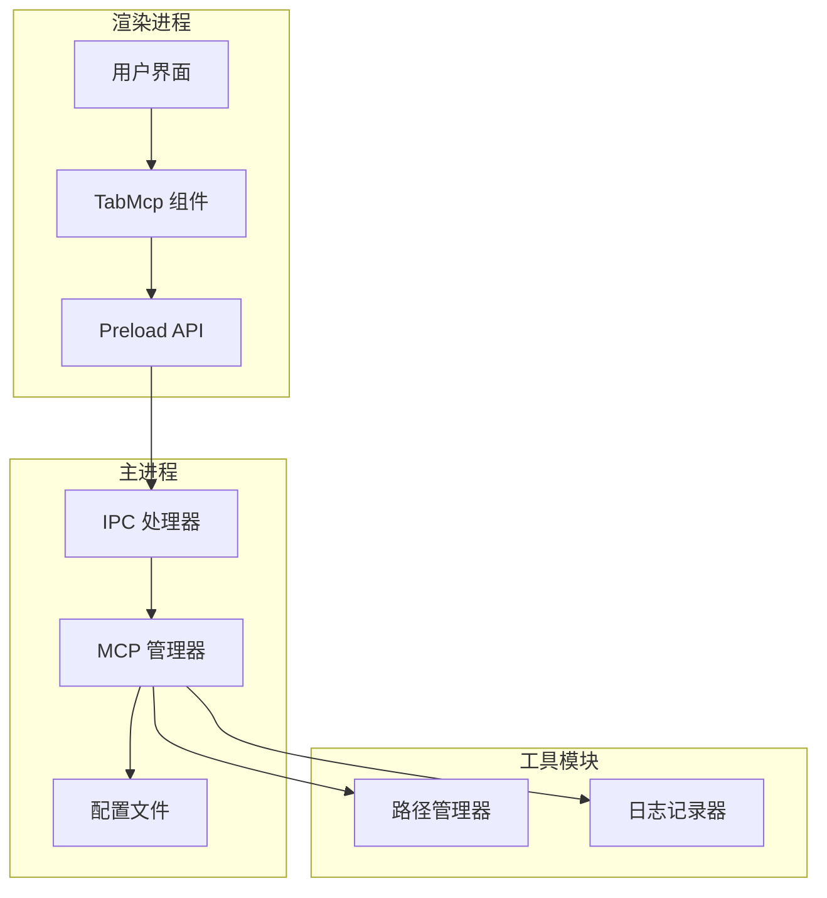
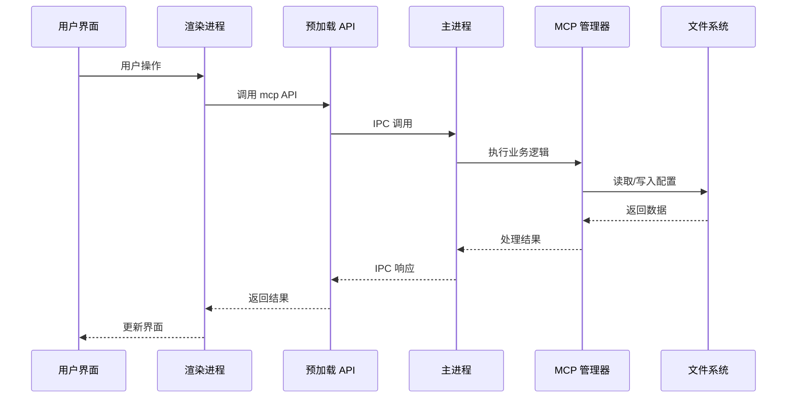
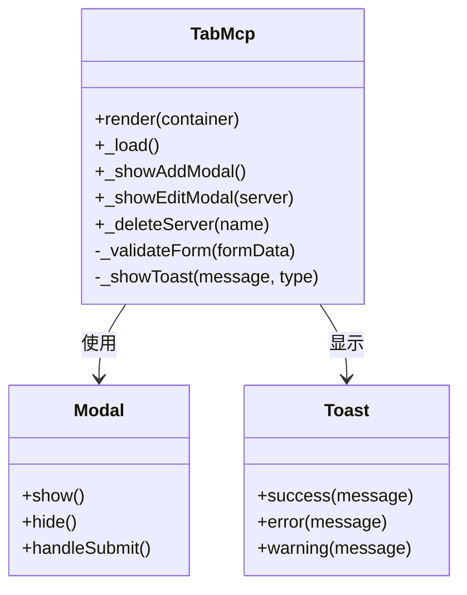
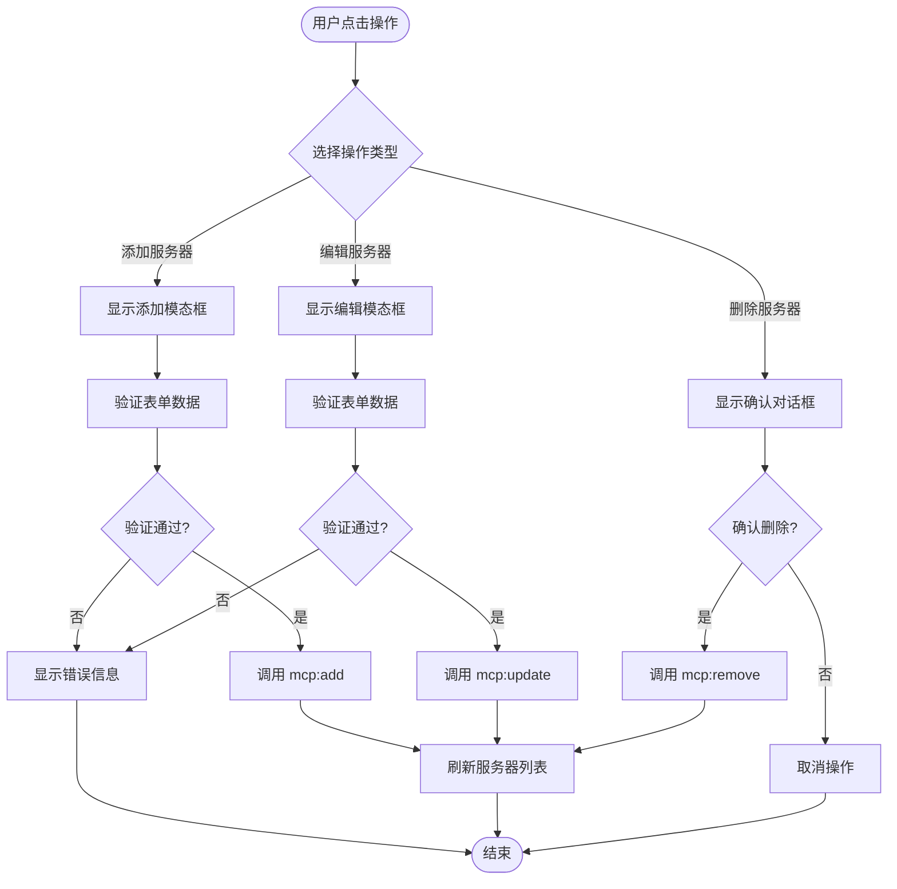
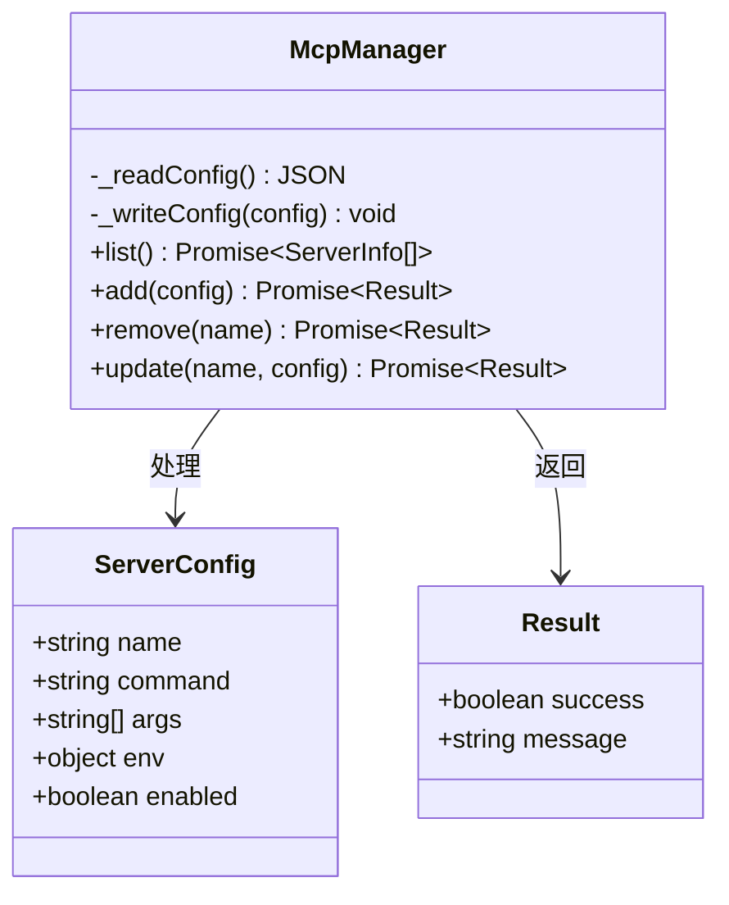
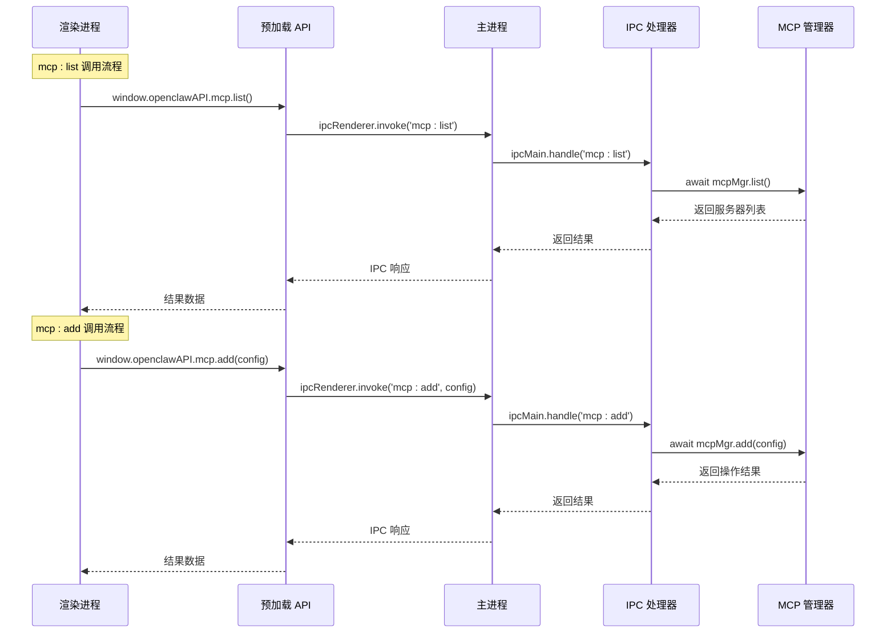
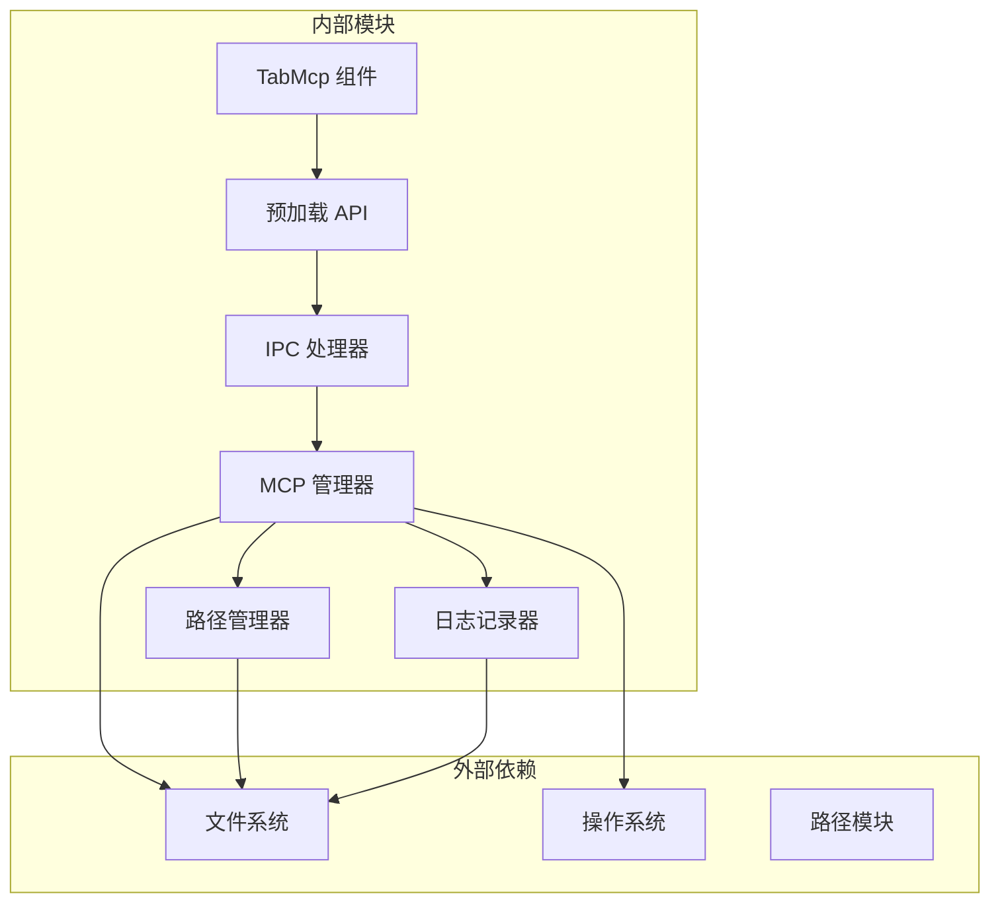
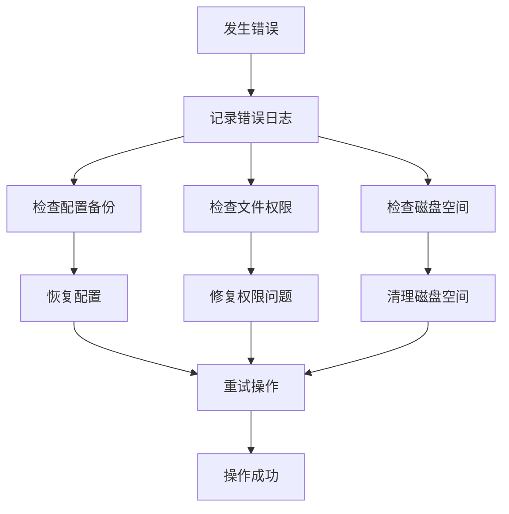

# MCP 管理接口

<cite>
**本文档引用的文件**
- [tab-mcp.js](file://src/renderer/js/dashboard/tab-mcp.js)
- [mcp-manager.js](file://src/main/services/mcp-manager.js)
- [ipc-handlers.js](file://src/main/ipc-handlers.js)
- [preload.js](file://src/main/preload.js)
- [paths.js](file://src/main/utils/paths.js)
- [logger.js](file://src/main/utils/logger.js)
- [service-controller.js](file://src/main/services/service-controller.js)
</cite>

## 目录
1. [简介](#简介)
2. [项目结构](#项目结构)
3. [核心组件](#核心组件)
4. [架构概览](#架构概览)
5. [详细组件分析](#详细组件分析)
6. [依赖关系分析](#依赖关系分析)
7. [性能考虑](#性能考虑)
8. [故障排除指南](#故障排除指南)
9. [结论](#结论)

## 简介

本文档详细介绍了 Lobster-Claw 项目中的 MCP（Model Context Protocol）管理 IPC 接口。MCP 是一个用于管理模型上下文协议服务器的系统，允许用户通过图形界面添加、删除、更新和列出 MCP 服务器配置。

该系统提供了完整的 MCP 服务器生命周期管理功能，包括配置存储、验证、以及与主进程的通信机制。系统采用 Electron 架构，通过 IPC 通道实现渲染进程与主进程之间的安全通信。

## 项目结构

MCP 管理功能分布在以下关键文件中：

**图表来源**
- [tab-mcp.js:1-199](file://src/renderer/js/dashboard/tab-mcp.js#L1-L199)
- [ipc-handlers.js:525-540](file://src/main/ipc-handlers.js#L525-L540)
- [mcp-manager.js:1-101](file://src/main/services/mcp-manager.js#L1-L101)

**章节来源**
- [tab-mcp.js:1-199](file://src/renderer/js/dashboard/tab-mcp.js#L1-L199)
- [mcp-manager.js:1-101](file://src/main/services/mcp-manager.js#L1-L101)
- [ipc-handlers.js:525-540](file://src/main/ipc-handlers.js#L525-L540)

## 核心组件

### MCP 管理器 (McpManager)

MCP 管理器是系统的核心组件，负责处理所有 MCP 服务器配置的 CRUD 操作。它使用 JSON 文件作为持久化存储，确保配置数据的安全性和可靠性。

主要功能包括：
- **配置读取**：从 JSON 文件中读取 MCP 服务器配置
- **配置写入**：将配置数据安全地写入文件系统
- **配置验证**：验证输入数据的有效性
- **备份机制**：自动创建配置文件备份

### IPC 处理器

IPC 处理器负责建立渲染进程与主进程之间的通信桥梁。它暴露了四个核心接口：
- `mcp:list`：列出所有 MCP 服务器
- `mcp:add`：添加新的 MCP 服务器配置
- `mcp:remove`：删除指定的 MCP 服务器
- `mcp:update`：更新现有 MCP 服务器配置

### 预加载 API

预加载 API 为渲染进程提供了安全的 IPC 访问接口。它封装了所有 MCP 相关的操作，确保只有授权的调用才能访问底层系统资源。

**章节来源**
- [mcp-manager.js:5-101](file://src/main/services/mcp-manager.js#L5-L101)
- [ipc-handlers.js:525-540](file://src/main/ipc-handlers.js#L525-L540)
- [preload.js:144-149](file://src/main/preload.js#L144-L149)

## 架构概览

MCP 管理系统的整体架构采用分层设计，确保了良好的可维护性和安全性：

**图表来源**
- [ipc-handlers.js:525-540](file://src/main/ipc-handlers.js#L525-L540)
- [preload.js:144-149](file://src/main/preload.js#L144-L149)
- [mcp-manager.js:27-98](file://src/main/services/mcp-manager.js#L27-L98)

## 详细组件分析

### 用户界面组件 (TabMcp)

TabMcp 组件提供了直观的用户界面来管理 MCP 服务器配置。它包含了完整的 CRUD 操作界面：

**图表来源**
- [tab-mcp.js:2-198](file://src/renderer/js/dashboard/tab-mcp.js#L2-L198)

#### 表单验证机制

TabMcp 组件实现了多层次的表单验证：

1. **必填字段验证**：确保服务器名称和命令字段不为空
2. **JSON 格式验证**：验证环境变量的 JSON 格式有效性
3. **参数格式验证**：确保参数列表的正确格式

#### 界面交互流程

**图表来源**
- [tab-mcp.js:76-198](file://src/renderer/js/dashboard/tab-mcp.js#L76-L198)

**章节来源**
- [tab-mcp.js:1-199](file://src/renderer/js/dashboard/tab-mcp.js#L1-L199)

### MCP 管理器 (McpManager)

McpManager 类提供了完整的 MCP 服务器配置管理功能：

**图表来源**
- [mcp-manager.js:5-99](file://src/main/services/mcp-manager.js#L5-L99)

#### 配置存储机制

McpManager 使用 JSON 文件作为配置存储，具有以下特点：

1. **原子性写入**：使用临时文件和原子重命名确保配置写入的完整性
2. **自动备份**：每次配置更新都会创建备份文件
3. **容错处理**：文件读写异常会被捕获并记录日志

#### 数据验证规则

系统对 MCP 服务器配置实施严格的数据验证：

- **名称验证**：必须是非空字符串
- **命令验证**：必须是非空字符串，表示可执行文件路径
- **参数验证**：必须是字符串数组，每个元素去除空白字符
- **环境变量验证**：必须是有效的 JSON 对象

**章节来源**
- [mcp-manager.js:1-101](file://src/main/services/mcp-manager.js#L1-L101)

### IPC 通信机制

IPC 通信机制确保了渲染进程与主进程之间的安全交互：

**图表来源**
- [ipc-handlers.js:525-540](file://src/main/ipc-handlers.js#L525-L540)
- [preload.js:144-149](file://src/main/preload.js#L144-L149)

#### 错误处理策略

IPC 通信机制采用了多层次的错误处理策略：

1. **参数验证**：在 IPC 层验证传入参数的有效性
2. **业务逻辑异常**：捕获并处理业务逻辑中的异常
3. **系统级异常**：处理文件系统访问等系统级异常
4. **统一响应格式**：所有操作都返回标准化的结果对象

**章节来源**
- [ipc-handlers.js:525-540](file://src/main/ipc-handlers.js#L525-L540)
- [preload.js:144-149](file://src/main/preload.js#L144-L149)

## 依赖关系分析

MCP 管理系统的依赖关系清晰明确，遵循单一职责原则：

**图表来源**
- [tab-mcp.js:1-199](file://src/renderer/js/dashboard/tab-mcp.js#L1-L199)
- [mcp-manager.js:1-101](file://src/main/services/mcp-manager.js#L1-L101)
- [paths.js:1-124](file://src/main/utils/paths.js#L1-L124)

### 模块间耦合度

系统设计具有较低的模块间耦合度：

- **TabMcp** 仅依赖预加载 API，不直接访问主进程逻辑
- **预加载 API** 提供抽象层，隐藏 IPC 实现细节
- **IPC 处理器** 专注于通信协议，不涉及业务逻辑
- **MCP 管理器** 独立处理业务逻辑，可单独测试

**章节来源**
- [paths.js:1-124](file://src/main/utils/paths.js#L1-L124)
- [logger.js:1-75](file://src/main/utils/logger.js#L1-L75)

## 性能考虑

### 文件 I/O 优化

系统采用了多种文件 I/O 优化策略：

1. **异步操作**：所有文件操作都是异步的，避免阻塞主线程
2. **缓存机制**：配置文件内容会被缓存，减少重复读取
3. **批量写入**：配置更新采用批量写入，提高效率

### 内存管理

系统在内存管理方面采取了以下措施：

1. **及时释放**：不再使用的对象及时释放内存
2. **循环引用防护**：避免创建循环引用导致的内存泄漏
3. **大对象处理**：对于大型配置对象采用流式处理

### 并发控制

系统通过以下方式控制并发：

1. **队列机制**：多个并发请求按顺序处理
2. **锁机制**：关键资源访问时使用互斥锁
3. **超时控制**：所有长时间操作都有超时保护

## 故障排除指南

### 常见问题及解决方案

#### 配置文件损坏

**症状**：MCP 服务器列表无法加载，出现 JSON 解析错误

**解决方案**：
1. 检查配置文件格式是否正确
2. 查看备份文件 `.bak` 是否存在
3. 从备份文件恢复配置

#### 权限问题

**症状**：无法写入配置文件，出现权限错误

**解决方案**：
1. 检查用户对配置文件目录的写权限
2. 以管理员身份运行应用程序
3. 更改配置文件存储位置

#### IPC 通信失败

**症状**：MCP 操作无响应或报错

**解决方案**：
1. 检查主进程是否正常运行
2. 查看应用日志获取详细错误信息
3. 重启应用程序

### 日志分析

系统提供了详细的日志记录功能，有助于问题诊断：

**图表来源**
- [logger.js:57-71](file://src/main/utils/logger.js#L57-L71)

**章节来源**
- [logger.js:1-75](file://src/main/utils/logger.js#L1-L75)

## 结论

Lobster-Claw 项目的 MCP 管理 IPC 接口设计合理，实现了以下目标：

1. **安全性**：通过预加载 API 和 IPC 通道确保了安全的跨进程通信
2. **可靠性**：采用文件备份、异常处理和超时控制保证系统稳定性
3. **易用性**：提供直观的用户界面和完整的 CRUD 操作
4. **可维护性**：模块化设计和清晰的依赖关系便于后续维护

该系统为 MCP 服务器管理提供了完整的技术解决方案，既满足了功能需求，又保证了系统的稳定性和安全性。通过合理的架构设计和完善的错误处理机制，用户可以安全可靠地管理各种 MCP 服务器配置。