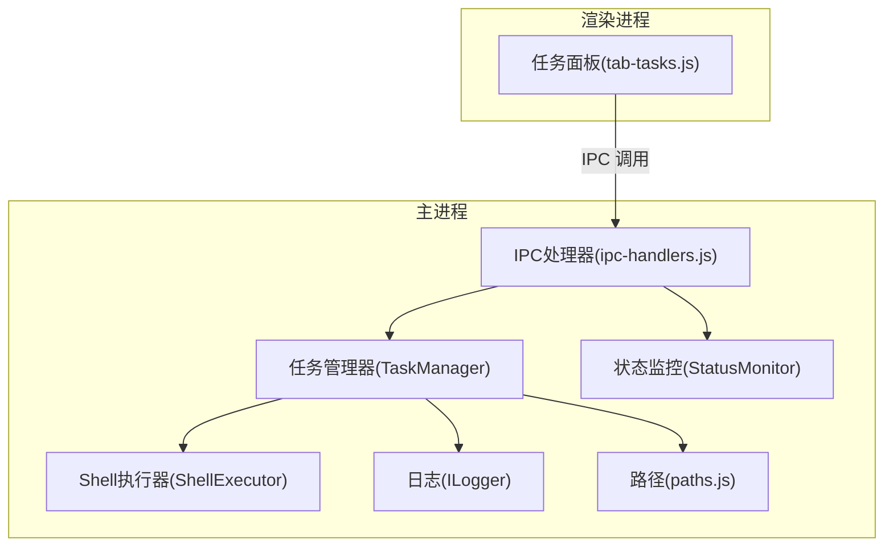
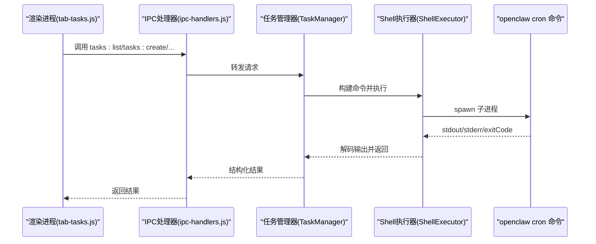
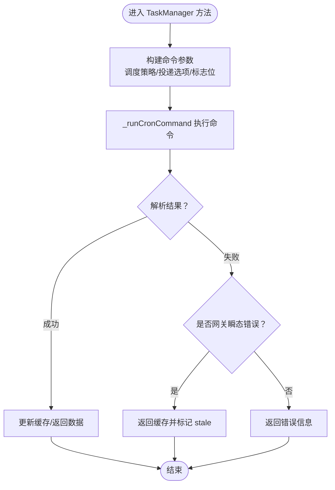
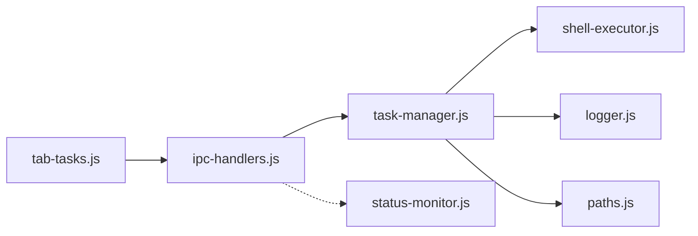

# 任务管理接口

<cite>
**本文档引用的文件**
- [src/main/services/task-manager.js](file://src/main/services/task-manager.js)
- [src/main/ipc-handlers.js](file://src/main/ipc-handlers.js)
- [src/renderer/js/dashboard/tab-tasks.js](file://src/renderer/js/dashboard/tab-tasks.js)
- [src/main/utils/shell-executor.js](file://src/main/utils/shell-executor.js)
- [src/main/utils/logger.js](file://src/main/utils/logger.js)
- [src/main/utils/paths.js](file://src/main/utils/paths.js)
- [src/main/services/status-monitor.js](file://src/main/services/status-monitor.js)
</cite>

## 目录
1. [简介](#简介)
2. [项目结构](#项目结构)
3. [核心组件](#核心组件)
4. [架构总览](#架构总览)
5. [详细组件分析](#详细组件分析)
6. [依赖关系分析](#依赖关系分析)
7. [性能考虑](#性能考虑)
8. [故障排查指南](#故障排查指南)
9. [结论](#结论)

## 简介
本文件面向任务管理 IPC 接口，系统性说明定时任务与计划任务的管理能力，涵盖任务生命周期（创建、修改、启用/禁用、删除）、执行触发（立即运行）、历史查询与分析、调度器状态监控，以及 Cron 表达式、执行参数与调度策略的使用规范。接口基于 Electron IPC 通道实现，前端通过渲染进程调用，后端通过 TaskManager 与 openclaw cron 命令交互。

## 项目结构
任务管理相关模块分布于主进程服务层与渲染进程界面层：
- 主进程服务层
  - 任务管理服务：负责与 openclaw cron 命令交互、参数构建、结果解析与缓存
  - IPC 注册：将任务管理接口暴露为 Electron IPC 处理器
  - Shell 执行器：封装跨平台命令执行、编码解码与超时控制
  - 日志与路径工具：统一日志格式与路径解析
  - 状态监控：辅助诊断与状态查询
- 渲染进程界面层
  - 任务面板：提供任务列表、创建/编辑表单、历史查看与错误提示

**图表来源**
- [src/renderer/js/dashboard/tab-tasks.js](file://src/renderer/js/dashboard/tab-tasks.js)
- [src/main/ipc-handlers.js](file://src/main/ipc-handlers.js)
- [src/main/services/task-manager.js](file://src/main/services/task-manager.js)
- [src/main/utils/shell-executor.js](file://src/main/utils/shell-executor.js)
- [src/main/utils/logger.js](file://src/main/utils/logger.js)
- [src/main/utils/paths.js](file://src/main/utils/paths.js)
- [src/main/services/status-monitor.js](file://src/main/services/status-monitor.js)

**章节来源**
- [src/main/services/task-manager.js](file://src/main/services/task-manager.js)
- [src/main/ipc-handlers.js](file://src/main/ipc-handlers.js)
- [src/renderer/js/dashboard/tab-tasks.js](file://src/renderer/js/dashboard/tab-tasks.js)

## 核心组件
- 任务管理器（TaskManager）
  - 通过 openclaw cron 子命令与 Gateway 交互，提供任务列表、创建、编辑、启用/禁用、删除、立即运行、执行历史与调度器状态查询
  - 内置缓存与网关瞬态错误降级策略，提升用户体验
- IPC 处理器（ipc-handlers.js）
  - 将 TaskManager 的方法注册为 Electron IPC 处理器，统一返回结构
- Shell 执行器（ShellExecutor）
  - 跨平台命令执行、编码解码、WSL 模式适配、超时控制
- 日志与路径工具（Logger、paths）
  - 统一日志格式与路径解析，便于定位问题
- 状态监控（StatusMonitor）
  - 辅助诊断 openclaw 状态与 Gateway 启动情况

**章节来源**
- [src/main/services/task-manager.js](file://src/main/services/task-manager.js)
- [src/main/ipc-handlers.js](file://src/main/ipc-handlers.js)
- [src/main/utils/shell-executor.js](file://src/main/utils/shell-executor.js)
- [src/main/utils/logger.js](file://src/main/utils/logger.js)
- [src/main/utils/paths.js](file://src/main/utils/paths.js)
- [src/main/services/status-monitor.js](file://src/main/services/status-monitor.js)

## 架构总览
任务管理 IPC 的典型调用链如下：

**图表来源**
- [src/renderer/js/dashboard/tab-tasks.js](file://src/renderer/js/dashboard/tab-tasks.js)
- [src/main/ipc-handlers.js](file://src/main/ipc-handlers.js)
- [src/main/services/task-manager.js](file://src/main/services/task-manager.js)
- [src/main/utils/shell-executor.js](file://src/main/utils/shell-executor.js)

## 详细组件分析

### IPC 接口定义与行为
- tasks:list
  - 功能：获取任务列表，支持包含禁用任务与缓存控制
  - 参数：includeDisabled（布尔，默认包含）
  - 返回：success、jobs、total、hasMore；异常时可返回 fromCache/stale（来自缓存且数据陈旧）
- tasks:create
  - 功能：创建新任务
  - 参数：name、message、cron/every/at、tz、model、session、description、timeout、disabled、announce、channel、to 等
  - 返回：success、job
- tasks:edit
  - 功能：编辑现有任务
  - 参数：taskId、可选字段（name/message/cron/every/tz/model/description/timeout/announce/channel/to）
  - 返回：success
- tasks:enable / tasks:disable
  - 功能：启用/禁用任务
  - 参数：taskId
  - 返回：success
- tasks:delete
  - 功能：删除任务
  - 参数：taskId
  - 返回：success；内部验证删除结果
- tasks:run
  - 功能：立即运行任务
  - 参数：taskId
  - 返回：success、output
- tasks:history
  - 功能：查询任务执行历史
  - 参数：taskId（必填）、limit（默认 50）
  - 返回：success、runs、total
- tasks:status
  - 功能：获取调度器状态
  - 返回：success、status

上述接口均在主进程注册为 ipcMain.handle，渲染进程通过 window.openclawAPI.tasks.<method> 调用。

**章节来源**
- [src/main/ipc-handlers.js](file://src/main/ipc-handlers.js)

### 任务管理器（TaskManager）实现要点
- 命令执行与参数构建
  - 通过 _runCronCommand 统一封装 openclaw cron 子命令执行，支持超时、stdout/stderr 解码与 JSON 提取
  - 参数构建遵循 openclaw cron 命令行约定，使用“=”分隔键值以规避 Windows CMD 解析问题
- 缓存与降级
  - listTasks 支持 TTL 缓存（默认 30 秒），创建/编辑/启用/禁用/删除后主动失效
  - 对 Gateway 瞬态错误（如重启中）进行识别，优先返回缓存数据并标记 stale
- 错误提取与清理
  - 从 stderr 中提取可读错误信息，过滤 ANSI 颜色与无关日志
- 任务历史解析
  - 从 stdout 中尝试解析 JSON 数组或对象，兼容不同输出格式
- 调度器状态
  - 通过 status --json 获取结构化状态

**图表来源**
- [src/main/services/task-manager.js](file://src/main/services/task-manager.js)

**章节来源**
- [src/main/services/task-manager.js](file://src/main/services/task-manager.js)

### Shell 执行器（ShellExecutor）与跨平台适配
- Windows 原生模式
  - 使用完整 cmd.exe 路径，避免打包后 PATH 不完整导致 ENOENT
  - 统一输出解码，处理 GBK/UTF-8 混合乱码
- WSL 模式
  - 通过 wsl --exec 包装命令，避免 PATH 中空格导致的标识符错误
  - 强制 UTF-8 编码，清理 PATH 以避免空格问题
- 超时与流式输出
  - 统一超时控制与流式输出回调，支持长时间任务的进度反馈

**章节来源**
- [src/main/utils/shell-executor.js](file://src/main/utils/shell-executor.js)

### 渲染进程任务面板（tab-tasks.js）
- 视图与交互
  - 列表视图：展示任务名称、描述、调度策略、下次/上次执行时间、启用状态与错误提示
  - 表单视图：支持多种调度类型（每天/每周/每月/执行一次/间隔执行/自定义 Cron），高级选项（时区、模型、禁用创建等）
  - 历史视图：弹窗展示执行历史，包含时间、耗时与状态
- 数据流
  - 通过 window.openclawAPI.tasks.<method> 调用主进程 IPC
  - 列表加载采用缓存优先策略，刷新按钮显示加载状态
  - 错误弹窗展示任务连续错误次数与最后一次错误详情

**章节来源**
- [src/renderer/js/dashboard/tab-tasks.js](file://src/renderer/js/dashboard/tab-tasks.js)

## 依赖关系分析
- 组件耦合
  - IPC 处理器仅作为薄层转发，核心逻辑集中在 TaskManager
  - TaskManager 依赖 ShellExecutor 进行命令执行，依赖 Logger 记录日志，依赖 paths 解析安装路径
- 外部依赖
  - openclaw cron 命令：任务管理的实际执行者
  - Electron IPC：前后端通信桥梁
- 潜在循环依赖
  - 未发现循环依赖，模块职责清晰

**图表来源**
- [src/main/ipc-handlers.js](file://src/main/ipc-handlers.js)
- [src/main/services/task-manager.js](file://src/main/services/task-manager.js)
- [src/main/utils/shell-executor.js](file://src/main/utils/shell-executor.js)
- [src/main/utils/logger.js](file://src/main/utils/logger.js)
- [src/main/utils/paths.js](file://src/main/utils/paths.js)
- [src/renderer/js/dashboard/tab-tasks.js](file://src/renderer/js/dashboard/tab-tasks.js)
- [src/main/services/status-monitor.js](file://src/main/services/status-monitor.js)

**章节来源**
- [src/main/ipc-handlers.js](file://src/main/ipc-handlers.js)
- [src/main/services/task-manager.js](file://src/main/services/task-manager.js)

## 性能考虑
- 缓存策略
  - 任务列表缓存（TTL 30 秒）显著降低频繁刷新的开销；在变更操作后主动失效，保证一致性
- 超时控制
  - 各命令执行设置合理超时（如 list 30s、run 60s、status 15s），避免阻塞 UI
- 输出解析
  - 仅在必要时解析 stdout/stderr，对历史查询限制 limit，减少内存占用
- 跨平台稳定性
  - ShellExecutor 统一处理编码与路径问题，减少因平台差异导致的重试与失败

[本节为通用指导，无需特定文件引用]

## 故障排查指南
- 常见问题与定位
  - 网关瞬态错误：当 Gateway 正在重启或连接异常时，任务列表可能返回 fromCache/stale，属于预期行为
  - 命令执行失败：检查 stderr 中的错误信息，TaskManager 会提取并返回可读错误
  - Cron 表达式无效：确认表达式格式正确，或使用可视化调度器生成
  - 超时：适当延长超时时间或检查系统资源占用
- 日志与诊断
  - 使用 Logger 记录关键路径与错误堆栈
  - 通过 StatusMonitor 的增强诊断流程（config validate → status → doctor --fix）快速定位问题
- 建议操作
  - 首次排查使用 tasks:status 获取调度器状态
  - 若历史为空，确认 taskId 是否正确且 limit 是否足够
  - 对于频繁失败的任务，查看任务卡片上的连续错误次数与最后一次错误详情

**章节来源**
- [src/main/services/task-manager.js](file://src/main/services/task-manager.js)
- [src/main/services/status-monitor.js](file://src/main/services/status-monitor.js)
- [src/main/utils/logger.js](file://src/main/utils/logger.js)

## 结论
本任务管理 IPC 接口以 TaskManager 为核心，结合 ShellExecutor 的跨平台能力与 IPC 的稳定通信，提供了完整的定时任务生命周期管理。通过缓存与错误降级策略，兼顾了性能与用户体验；通过结构化的返回与日志体系，便于问题定位与持续优化。建议在生产环境中配合定期的任务健康检查与状态监控，确保调度器稳定运行。