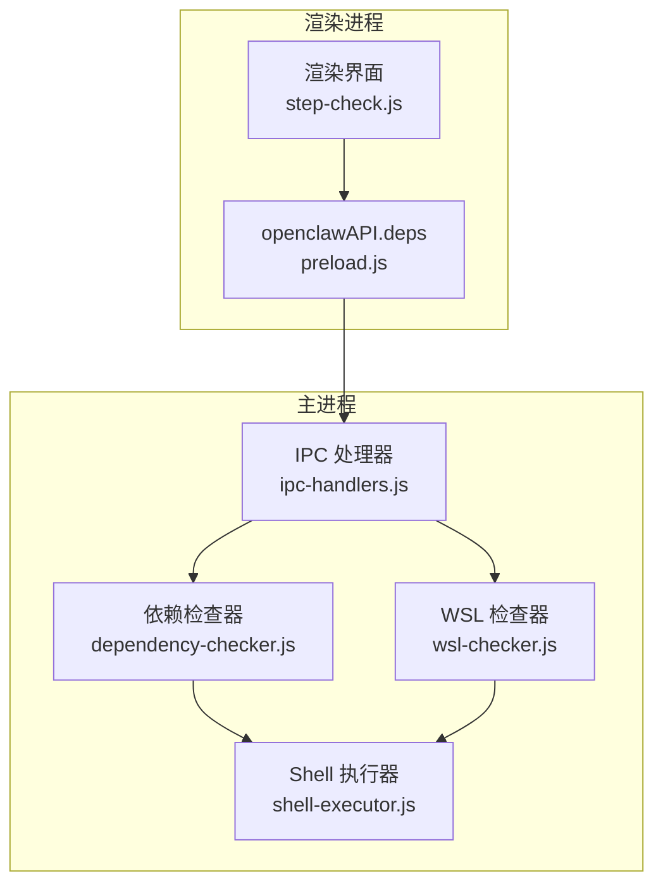
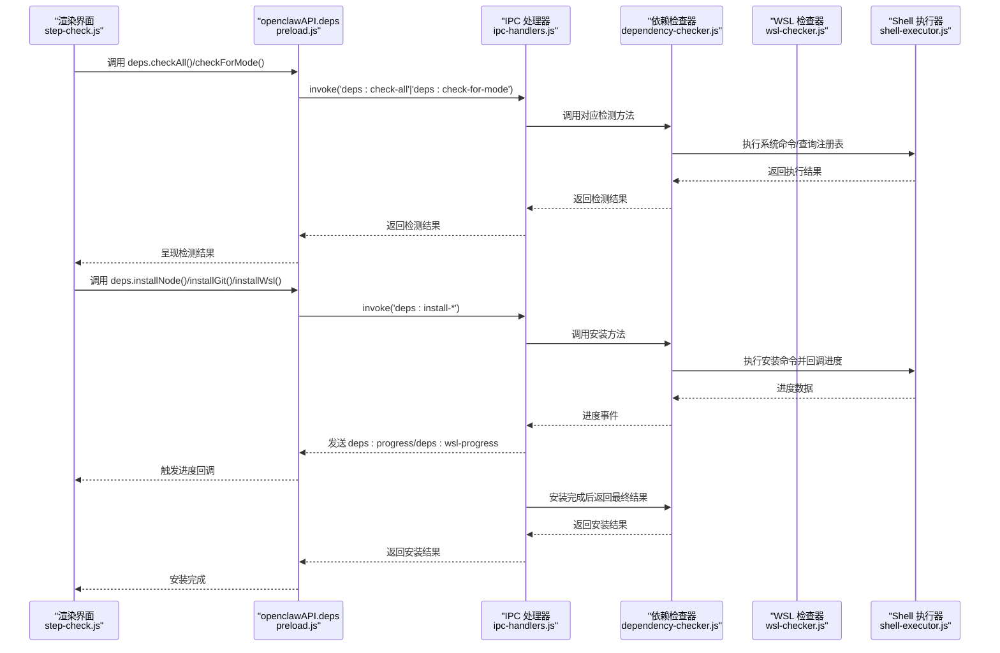
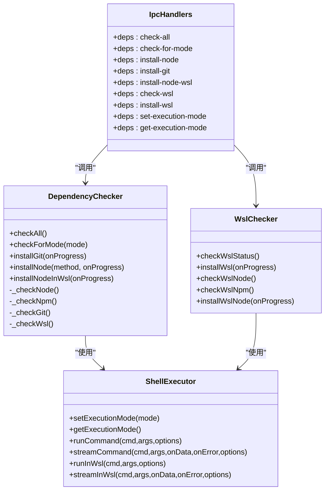

# 依赖管理接口

<cite>
**本文档引用的文件**
- [ipc-handlers.js](file://src/main/ipc-handlers.js)
- [dependency-checker.js](file://src/main/services/dependency-checker.js)
- [wsl-checker.js](file://src/main/services/wsl-checker.js)
- [shell-executor.js](file://src/main/utils/shell-executor.js)
- [preload.js](file://src/main/preload.js)
- [step-check.js](file://src/renderer/js/wizard/step-check.js)
</cite>

## 目录
1. [简介](#简介)
2. [项目结构](#项目结构)
3. [核心组件](#核心组件)
4. [架构总览](#架构总览)
5. [详细组件分析](#详细组件分析)
6. [依赖关系分析](#依赖关系分析)
7. [性能考量](#性能考量)
8. [故障排查指南](#故障排查指南)
9. [结论](#结论)
10. [附录](#附录)

## 简介
本文件系统性梳理并文档化了依赖管理 IPC 接口，涵盖依赖检测与安装的完整流程，包括：
- 通用依赖检测：deps:check-all、deps:check-for-mode
- 依赖安装：deps:install-node、deps:install-git、deps:install-node-wsl
- WSL 相关：deps:check-wsl、deps:install-wsl
- 执行模式：deps:set-execution-mode、deps:get-execution-mode
- 进度回调：deps:progress、deps:wsl-progress

文档详细说明各接口的调用方式、参数格式、返回值结构、错误处理机制，并提供渲染进程中的实际调用示例与 WSL 模式下的特殊处理及执行模式切换实现细节。

## 项目结构
依赖管理相关代码主要分布在主进程服务层与渲染进程桥接层：
- 主进程服务层：依赖检测与安装逻辑集中在依赖检查器与 WSL 检查器中
- 主进程 IPC 层：集中注册并转发依赖相关 IPC 通道
- 渲染进程桥接层：通过 preload 暴露 openclawAPI.deps.* 供前端调用
- 渲染进程使用示例：安装向导步骤中演示了依赖检测与安装流程

图表来源
- [ipc-handlers.js:26-161](file://src/main/ipc-handlers.js#L26-L161)
- [dependency-checker.js:133-191](file://src/main/services/dependency-checker.js#L133-L191)
- [wsl-checker.js:4-98](file://src/main/services/wsl-checker.js#L4-L98)
- [shell-executor.js:62-197](file://src/main/utils/shell-executor.js#L62-L197)
- [preload.js:3-31](file://src/main/preload.js#L3-L31)

章节来源
- [ipc-handlers.js:26-161](file://src/main/ipc-handlers.js#L26-L161)
- [preload.js:3-31](file://src/main/preload.js#L3-L31)

## 核心组件
- 依赖检查器（DependencyChecker）
  - 负责检测 Node.js、npm、Git、WSL 状态
  - 支持并行检测与缓存，提升性能
  - 提供 installGit、installNode、installNodeInWsl 等安装方法
- WSL 检查器（WslChecker）
  - 检测 WSL 安装状态与发行版列表
  - 提供 installWsl、checkWslNode、checkWslNpm 等方法
- Shell 执行器（ShellExecutor）
  - 统一封装命令执行，支持原生与 WSL 模式
  - 提供执行模式切换与适配逻辑
- IPC 处理器（ipc-handlers.js）
  - 注册依赖管理相关 IPC 通道
  - 负责进度回调转发与错误处理
- 预加载桥接（preload.js）
  - 暴露 openclawAPI.deps.* 给渲染进程
  - 提供进度监听器注册与移除

章节来源
- [dependency-checker.js:133-191](file://src/main/services/dependency-checker.js#L133-L191)
- [wsl-checker.js:4-98](file://src/main/services/wsl-checker.js#L4-L98)
- [shell-executor.js:62-197](file://src/main/utils/shell-executor.js#L62-L197)
- [ipc-handlers.js:26-161](file://src/main/ipc-handlers.js#L26-L161)
- [preload.js:3-31](file://src/main/preload.js#L3-L31)

## 架构总览
依赖管理 IPC 流程由“渲染进程调用 -> 预加载桥接 -> 主进程处理器 -> 服务层执行 -> 进度回调”构成。WSL 模式通过 ShellExecutor 的执行模式适配实现无缝切换。

图表来源
- [ipc-handlers.js:54-161](file://src/main/ipc-handlers.js#L54-L161)
- [dependency-checker.js:149-191](file://src/main/services/dependency-checker.js#L149-L191)
- [wsl-checker.js:113-212](file://src/main/services/wsl-checker.js#L113-L212)
- [shell-executor.js:136-197](file://src/main/utils/shell-executor.js#L136-L197)
- [preload.js:3-31](file://src/main/preload.js#L3-L31)

## 详细组件分析

### IPC 接口定义与行为

- deps:check-all
  - 调用方式：渲染进程通过 openclawAPI.deps.checkAll() 调用
  - 参数：无
  - 返回值：包含 node、npm、git、packageManagers、wsl 的检测结果对象
  - 错误处理：捕获异常并记录日志，抛出给渲染进程
  - 性能：并行检测 npm、git、wsl，减少总耗时
  - 章节来源
    - [ipc-handlers.js:54-69](file://src/main/ipc-handlers.js#L54-L69)
    - [dependency-checker.js:149-191](file://src/main/services/dependency-checker.js#L149-L191)

- deps:check-for-mode(mode)
  - 调用方式：openclawAPI.deps.checkForMode(mode)
  - 参数：mode（'native' 或 'wsl'）
  - 返回值：按模式定制的检测结果（WSL 模式返回 WSL 内部 Node/npm 状态）
  - 错误处理：异常记录并抛出
  - 章节来源
    - [ipc-handlers.js:133-147](file://src/main/ipc-handlers.js#L133-L147)
    - [dependency-checker.js:196-229](file://src/main/services/dependency-checker.js#L196-L229)

- deps:install-node(method)
  - 调用方式：openclawAPI.deps.installNode(method)
  - 参数：method（安装方法标识，如 'builtin'）
  - 返回值：{ success: boolean, version?: string, needsRestart?: boolean }
  - 进度回调：deps:progress（包含 step、message、percent）
  - 错误处理：发送 error 步骤并抛出
  - 章节来源
    - [ipc-handlers.js:72-85](file://src/main/ipc-handlers.js#L72-L85)
    - [dependency-checker.js:786-800](file://src/main/services/dependency-checker.js#L786-L800)

- deps:install-git()
  - 调用方式：openclawAPI.deps.installGit()
  - 参数：无
  - 返回值：{ success: boolean, version?: string, needsRestart?: boolean }
  - 进度回调：deps:progress
  - 错误处理：发送 error 步骤并抛出
  - 章节来源
    - [ipc-handlers.js:88-101](file://src/main/ipc-handlers.js#L88-L101)
    - [dependency-checker.js:702-781](file://src/main/services/dependency-checker.js#L702-L781)

- deps:install-node-wsl()
  - 调用方式：openclawAPI.deps.installNodeWsl()
  - 参数：无
  - 返回值：安装结果对象
  - 进度回调：deps:progress
  - 错误处理：发送 error 步骤并抛出
  - 章节来源
    - [ipc-handlers.js:150-161](file://src/main/ipc-handlers.js#L150-L161)
    - [wsl-checker.js:258-307](file://src/main/services/wsl-checker.js#L258-L307)

- deps:check-wsl()
  - 调用方式：openclawAPI.deps.checkWsl()
  - 参数：无
  - 返回值：{ installed: boolean, version: string|null, distros: Array }
  - 错误处理：异常捕获并返回默认值
  - 章节来源
    - [ipc-handlers.js:104-106](file://src/main/ipc-handlers.js#L104-L106)
    - [wsl-checker.js:9-98](file://src/main/services/wsl-checker.js#L9-L98)

- deps:install-wsl()
  - 调用方式：openclawAPI.deps.installWsl()
  - 参数：无
  - 返回值：安装结果对象
  - 进度回调：deps:wsl-progress（包含 step、message、percent、needsReboot?）
  - 错误处理：发送 error 步骤并抛出
  - 章节来源
    - [ipc-handlers.js:109-120](file://src/main/ipc-handlers.js#L109-L120)
    - [wsl-checker.js:113-212](file://src/main/services/wsl-checker.js#L113-L212)

- deps:set-execution-mode(mode)
  - 调用方式：openclawAPI.deps.setExecutionMode(mode)
  - 参数：mode（'native' 或 'wsl'）
  - 返回值：{ success: true, mode }
  - 章节来源
    - [ipc-handlers.js:123-126](file://src/main/ipc-handlers.js#L123-L126)
    - [shell-executor.js:96-101](file://src/main/utils/shell-executor.js#L96-L101)

- deps:get-execution-mode()
  - 调用方式：openclawAPI.deps.getExecutionMode()
  - 参数：无
  - 返回值：当前执行模式（'native' 或 'wsl'）
  - 章节来源
    - [ipc-handlers.js:128-130](file://src/main/ipc-handlers.js#L128-L130)
    - [shell-executor.js:103-107](file://src/main/utils/shell-executor.js#L103-L107)

### 进度回调与事件使用

- deps:progress
  - 用途：通用依赖安装进度回调
  - 结构：{ step, message, percent }
  - 触发时机：安装过程中多次回调，最后一次为 done
  - 章节来源
    - [ipc-handlers.js:75-82](file://src/main/ipc-handlers.js#L75-L82)
    - [ipc-handlers.js:91-98](file://src/main/ipc-handlers.js#L91-L98)
    - [ipc-handlers.js:153-158](file://src/main/ipc-handlers.js#L153-L158)

- deps:wsl-progress
  - 用途：WSL 安装进度回调
  - 结构：{ step, message, percent, needsReboot? }
  - 触发时机：安装过程中多次回调，最后包含 needsReboot 标识
  - 章节来源
    - [ipc-handlers.js:112-118](file://src/main/ipc-handlers.js#L112-L118)
    - [wsl-checker.js:185-207](file://src/main/services/wsl-checker.js#L185-L207)

- 渲染进程监听器
  - 注册：openclawAPI.deps.onDepsProgress(cb) / onWslProgress(cb)
  - 移除：返回的函数用于注销监听
  - 章节来源
    - [preload.js:21-30](file://src/main/preload.js#L21-L30)

### 渲染进程调用示例

- 安装向导中的依赖检测与安装
  - 全量检测：调用 deps.checkAll() 显示当前系统依赖状态
  - 模式检测：调用 deps.checkForMode(mode) 切换模式并检测
  - 安装流程：根据模式选择安装 Git/Node 或直接安装 WSL Node
  - 进度监听：注册 deps:progress/deps:wsl-progress 实时更新 UI
  - 章节来源
    - [step-check.js:58-77](file://src/renderer/js/wizard/step-check.js#L58-L77)
    - [step-check.js:213-229](file://src/renderer/js/wizard/step-check.js#L213-L229)
    - [step-check.js:444-464](file://src/renderer/js/wizard/step-check.js#L444-L464)
    - [step-check.js:383-402](file://src/renderer/js/wizard/step-check.js#L383-L402)

### WSL 模式特殊处理与执行模式切换

- 执行模式适配
  - ShellExecutor 维护执行模式（'native'/'wsl'），并在命令执行前进行适配
  - WSL 模式下通过 wsl --exec bash -c 包装命令，避免 PATH 空格问题
  - 章节来源
    - [shell-executor.js:115-127](file://src/main/utils/shell-executor.js#L115-L127)
    - [shell-executor.js:136-197](file://src/main/utils/shell-executor.js#L136-L197)

- WSL 安装与检测
  - installWsl：以管理员权限执行 wsl --install --no-launch，等待退出码并验证状态
  - checkWslStatus：通过 wsl --status、wsl -l -v 等命令检测 WSL 状态与发行版
  - 章节来源
    - [wsl-checker.js:113-212](file://src/main/services/wsl-checker.js#L113-L212)
    - [wsl-checker.js:9-98](file://src/main/services/wsl-checker.js#L9-L98)

- WSL 内 Node/npm 安装
  - installWslNode：在 WSL 中配置 NodeSource 仓库并安装 Node.js，随后配置 npm 镜像
  - checkWslNode/checkWslNpm：检测 WSL 内 Node/npm 状态
  - 章节来源
    - [wsl-checker.js:258-307](file://src/main/services/wsl-checker.js#L258-L307)
    - [wsl-checker.js:217-253](file://src/main/services/wsl-checker.js#L217-L253)

## 依赖关系分析

图表来源
- [dependency-checker.js:133-191](file://src/main/services/dependency-checker.js#L133-L191)
- [wsl-checker.js:4-98](file://src/main/services/wsl-checker.js#L4-L98)
- [shell-executor.js:62-197](file://src/main/utils/shell-executor.js#L62-L197)
- [ipc-handlers.js:26-161](file://src/main/ipc-handlers.js#L26-L161)

章节来源
- [dependency-checker.js:133-191](file://src/main/services/dependency-checker.js#L133-L191)
- [wsl-checker.js:4-98](file://src/main/services/wsl-checker.js#L4-L98)
- [shell-executor.js:62-197](file://src/main/utils/shell-executor.js#L62-L197)
- [ipc-handlers.js:26-161](file://src/main/ipc-handlers.js#L26-L161)

## 性能考量
- 并行检测：checkAll 与 checkForMode 对 npm、git、wsl 采用 Promise.all 并行执行，显著降低总耗时
- 结果缓存：DependencyChecker 内部缓存检测结果，避免重复检测
- 超时控制：ShellExecutor 对命令执行设置合理超时时间，防止阻塞
- 章节来源
  - [dependency-checker.js:171-176](file://src/main/services/dependency-checker.js#L171-L176)
  - [dependency-checker.js:200-201](file://src/main/services/dependency-checker.js#L200-L201)
  - [shell-executor.js:138](file://src/main/utils/shell-executor.js#L138)

## 故障排查指南
- 安装失败
  - 检查 deps:progress/deps:wsl-progress 中的 step 与 message 字段，定位具体阶段
  - 若出现 error 步骤，渲染进程应显示错误信息并允许重试
  - 章节来源
    - [ipc-handlers.js:82](file://src/main/ipc-handlers.js#L82)
    - [ipc-handlers.js:98](file://src/main/ipc-handlers.js#L98)
    - [ipc-handlers.js:117](file://src/main/ipc-handlers.js#L117)

- WSL 需要重启
  - deps:wsl-progress 的 needsReboot 标识指示是否需要重启
  - 章节来源
    - [wsl-checker.js:185-207](file://src/main/services/wsl-checker.js#L185-L207)

- 执行模式不生效
  - 确认已调用 deps:set-execution-mode 并在后续命令中生效
  - 章节来源
    - [shell-executor.js:115-127](file://src/main/utils/shell-executor.js#L115-L127)

- 进度回调未触发
  - 检查 openclawAPI.deps.onDepsProgress/onWslProgress 的注册与注销逻辑
  - 章节来源
    - [preload.js:21-30](file://src/main/preload.js#L21-L30)

## 结论
该依赖管理 IPC 接口体系通过清晰的职责划分与完善的进度回调机制，实现了跨平台依赖检测与安装的自动化。WSL 模式的无缝集成与执行模式切换进一步增强了跨环境兼容性。建议在渲染进程中统一使用 openclawAPI.deps.* 并结合进度回调优化用户体验。

## 附录

### 接口一览表

- deps:check-all
  - 调用：openclawAPI.deps.checkAll()
  - 返回：{ node, npm, git, packageManagers, wsl }
  - 章节来源
    - [ipc-handlers.js:54-69](file://src/main/ipc-handlers.js#L54-L69)

- deps:check-for-mode(mode)
  - 调用：openclawAPI.deps.checkForMode(mode)
  - 参数：mode ∈ {'native','wsl'}
  - 返回：按模式定制的检测结果
  - 章节来源
    - [ipc-handlers.js:133-147](file://src/main/ipc-handlers.js#L133-L147)

- deps:install-node(method)
  - 调用：openclawAPI.deps.installNode(method)
  - 参数：method（安装方法标识）
  - 返回：{ success, version?, needsRestart? }
  - 进度：deps:progress
  - 章节来源
    - [ipc-handlers.js:72-85](file://src/main/ipc-handlers.js#L72-L85)

- deps:install-git()
  - 调用：openclawAPI.deps.installGit()
  - 返回：{ success, version?, needsRestart? }
  - 进度：deps:progress
  - 章节来源
    - [ipc-handlers.js:88-101](file://src/main/ipc-handlers.js#L88-L101)

- deps:install-node-wsl()
  - 调用：openclawAPI.deps.installNodeWsl()
  - 返回：安装结果
  - 进度：deps:progress
  - 章节来源
    - [ipc-handlers.js:150-161](file://src/main/ipc-handlers.js#L150-L161)

- deps:check-wsl()
  - 调用：openclawAPI.deps.checkWsl()
  - 返回：{ installed, version?, distros }
  - 章节来源
    - [ipc-handlers.js:104-106](file://src/main/ipc-handlers.js#L104-L106)

- deps:install-wsl()
  - 调用：openclawAPI.deps.installWsl()
  - 返回：安装结果
  - 进度：deps:wsl-progress
  - 章节来源
    - [ipc-handlers.js:109-120](file://src/main/ipc-handlers.js#L109-L120)

- deps:set-execution-mode(mode)
  - 调用：openclawAPI.deps.setExecutionMode(mode)
  - 参数：mode ∈ {'native','wsl'}
  - 返回：{ success, mode }
  - 章节来源
    - [ipc-handlers.js:123-126](file://src/main/ipc-handlers.js#L123-L126)

- deps:get-execution-mode()
  - 调用：openclawAPI.deps.getExecutionMode()
  - 返回：当前执行模式
  - 章节来源
    - [ipc-handlers.js:128-130](file://src/main/ipc-handlers.js#L128-L130)

### 渲染进程调用示例路径
- 全量检测与渲染
  - [step-check.js:58-77](file://src/renderer/js/wizard/step-check.js#L58-L77)
- 模式检测与渲染
  - [step-check.js:213-229](file://src/renderer/js/wizard/step-check.js#L213-L229)
- 进度监听与 UI 更新
  - [step-check.js:444-464](file://src/renderer/js/wizard/step-check.js#L444-L464)
  - [step-check.js:383-402](file://src/renderer/js/wizard/step-check.js#L383-L402)