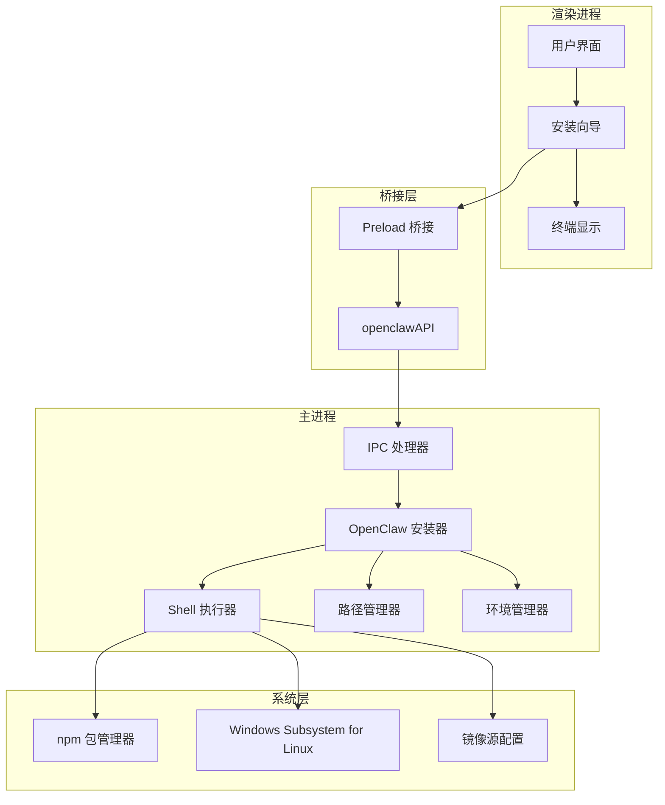
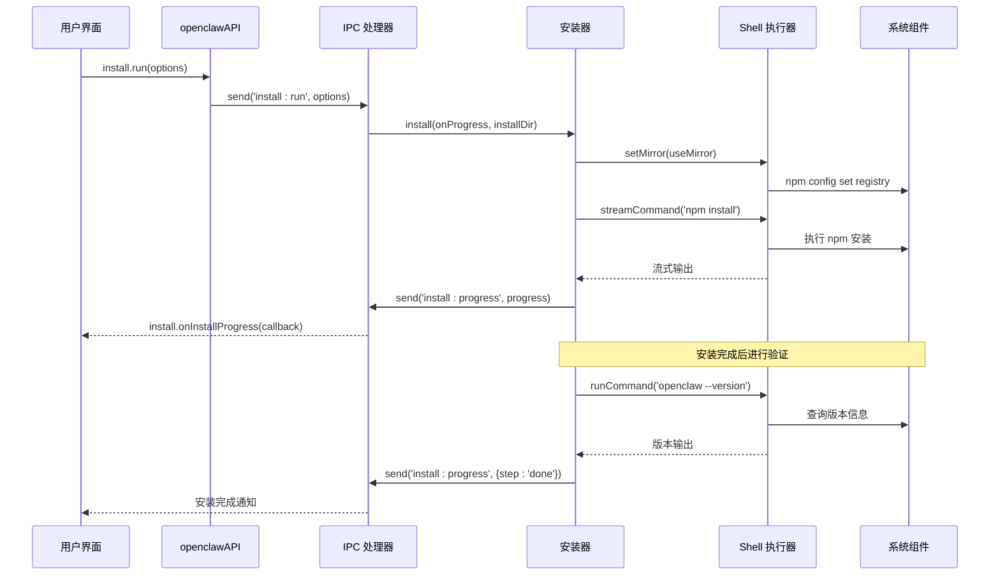
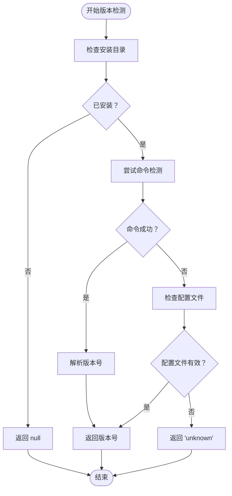
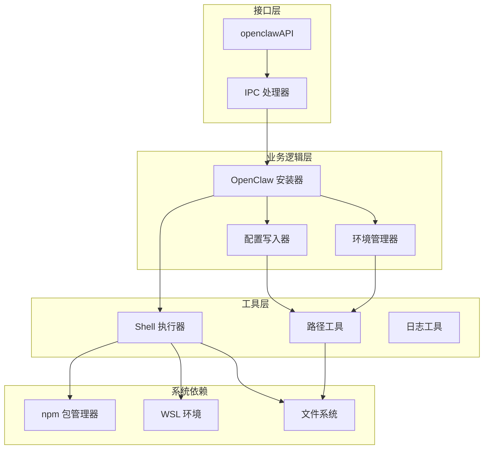
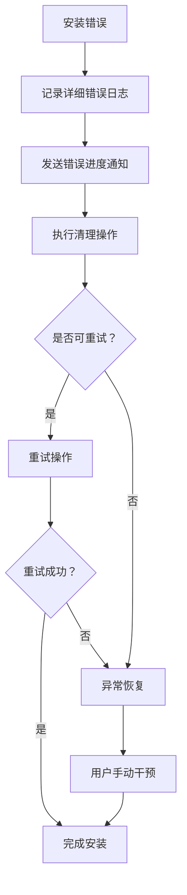

# 安装管理接口

<cite>
**本文档引用的文件**
- [openclaw-installer.js](file://src/main/services/openclaw-installer.js)
- [ipc-handlers.js](file://src/main/ipc-handlers.js)
- [preload.js](file://src/main/preload.js)
- [step-install.js](file://src/renderer/js/wizard/step-install.js)
- [shell-executor.js](file://src/main/utils/shell-executor.js)
- [env-manager.js](file://src/main/services/env-manager.js)
- [paths.js](file://src/main/utils/paths.js)
- [defaults.js](file://src/main/config/defaults.js)
</cite>

## 目录
1. [简介](#简介)
2. [项目结构](#项目结构)
3. [核心组件](#核心组件)
4. [架构概览](#架构概览)
5. [详细组件分析](#详细组件分析)
6. [依赖关系分析](#依赖关系分析)
7. [性能考虑](#性能考虑)
8. [故障排除指南](#故障排除指南)
9. [结论](#结论)

## 简介

OpenClaw 安装管理接口是一个基于 Electron IPC 的完整安装解决方案，提供了从版本检测、安装执行到更新管理的全流程支持。该系统通过三个主要层次实现了强大的安装管理功能：

- **IPC 层**：提供标准化的接口调用，支持同步和异步操作
- **服务层**：封装具体的安装逻辑，包括版本检测、依赖管理、配置写入等
- **工具层**：提供底层的系统操作能力，如命令执行、路径管理、环境配置等

该接口设计的核心目标是为用户提供无缝的安装体验，支持多种安装场景（WSL 和原生 Windows），并提供完善的进度反馈和错误处理机制。

## 项目结构

OpenClaw 安装管理系统采用分层架构设计，主要由以下组件构成：



**图表来源**
- [ipc-handlers.js:26-51](file://src/main/ipc-handlers.js#L26-L51)
- [preload.js:3-49](file://src/main/preload.js#L3-L49)

**章节来源**
- [ipc-handlers.js:163-207](file://src/main/ipc-handlers.js#L163-L207)
- [preload.js:33-49](file://src/main/preload.js#L33-L49)

## 核心组件

### IPC 处理器

IPC 处理器是安装管理接口的核心，负责注册和处理所有安装相关的 IPC 通信。主要功能包括：

- **版本检测**：`install:get-version` - 检测已安装的 OpenClaw 版本
- **安装执行**：`install:run` - 启动完整的安装流程
- **更新管理**：`install:update` - 执行 OpenClaw 更新操作
- **进度通知**：`install:progress` - 实时推送安装进度

### OpenClaw 安装器

安装器类封装了完整的安装逻辑，包括：

- **多模式支持**：同时支持 WSL 和原生 Windows 安装模式
- **智能检测**：自动检测现有安装状态和依赖环境
- **配置管理**：自动生成必要的配置文件和目录结构
- **错误恢复**：提供完善的错误处理和异常恢复机制

### Shell 执行器

Shell 执行器提供了跨平台的命令执行能力：

- **双模式支持**：统一处理 Windows 原生和 WSL 命令执行
- **编码处理**：自动处理不同编码格式的输出
- **超时控制**：为长时间运行的操作设置合理的超时机制
- **进度流式传输**：支持实时输出流的处理

**章节来源**
- [openclaw-installer.js:10-115](file://src/main/services/openclaw-installer.js#L10-L115)
- [shell-executor.js:62-108](file://src/main/utils/shell-executor.js#L62-L108)

## 架构概览

安装管理系统的整体架构采用事件驱动的设计模式，通过 IPC 通道实现主进程和渲染进程之间的通信：



**图表来源**
- [ipc-handlers.js:177-195](file://src/main/ipc-handlers.js#L177-L195)
- [step-install.js:105-147](file://src/renderer/js/wizard/step-install.js#L105-L147)

## 详细组件分析

### 安装接口实现

#### install:get-version 接口

`install:get-version` 接口用于检测系统中已安装的 OpenClaw 版本，采用多层检测策略：



**图表来源**
- [openclaw-installer.js:24-115](file://src/main/services/openclaw-installer.js#L24-L115)

#### install:run 接口

`install:run` 接口启动完整的安装流程，支持多种安装选项：

**安装选项参数**：
- `useMirror`：布尔值，是否使用国内镜像源
- `installDir`：字符串，自定义安装目录路径

**安装流程步骤**：
1. **镜像源设置**（可选）：根据 `useMirror` 参数设置 npm registry
2. **依赖清理**：清理可能存在的旧版本文件
3. **npm 安装**：执行 `npm install -g openclaw@latest`
4. **配置创建**：生成必要的配置文件和目录结构
5. **服务启动**：启动 OpenClaw Gateway 服务
6. **安装验证**：验证安装结果并返回最终状态

#### install:update 接口

`install:update` 接口提供 OpenClaw 的更新功能：

**更新流程**：
1. **版本检测**：获取当前已安装版本
2. **镜像源设置**（可选）：使用国内镜像源加速下载
3. **npm 更新**：执行 `npm install -g openclaw@latest`
4. **扩展验证**：补全缺失的扩展 README 文件
5. **结果报告**：比较新旧版本并报告更新结果

**章节来源**
- [ipc-handlers.js:164-205](file://src/main/ipc-handlers.js#L164-L205)
- [openclaw-installer.js:117-532](file://src/main/services/openclaw-installer.js#L117-L532)

### 进度回调机制

安装管理接口采用了完善的进度回调机制，通过 `install:progress` 事件向渲染进程实时推送安装状态：

**进度数据结构**：
```javascript
{
  step: 'npm-install',      // 当前步骤
  message: '正在安装...',    // 状态描述
  percent: 75               // 完成百分比
}
```

**进度步骤映射**：
- `start`：开始安装准备
- `mirror`：设置镜像源
- `npm-install`：执行 npm 安装
- `config-dir`：创建配置目录
- `gateway-start`：启动 Gateway 服务
- `verify`：验证安装结果
- `done`：安装完成
- `error`：安装失败

**章节来源**
- [ipc-handlers.js:189-194](file://src/main/ipc-handlers.js#L189-L194)
- [step-install.js:105-147](file://src/renderer/js/wizard/step-install.js#L105-L147)

### 镜像源设置

系统支持灵活的镜像源配置，主要针对 npm registry 的设置：

**镜像源选项**：
- 国内镜像源：`https://registry.npmmirror.com`
- 官方源：`https://registry.npmjs.org`

**设置流程**：
1. 检测当前执行模式（WSL 或原生 Windows）
2. 根据模式选择相应的设置方式
3. 执行 `npm config set registry` 命令
4. 验证设置结果并返回状态

**章节来源**
- [openclaw-installer.js:600-618](file://src/main/services/openclaw-installer.js#L600-L618)
- [ipc-handlers.js:180-187](file://src/main/ipc-handlers.js#L180-L187)

### 安装目录配置

系统支持自定义安装目录配置，主要通过 `installDir` 参数实现：

**目录优先级**：
1. 用户指定的安装目录（最高优先级）
2. `.env` 文件中的 `OPENCLAW_NPM_PREFIX` 配置
3. 默认的 `~/.npm-global` 目录

**路径管理机制**：
- 使用 `paths.js` 模块统一管理路径配置
- 支持 WSL 和原生 Windows 的路径转换
- 自动处理权限和目录创建

**章节来源**
- [openclaw-installer.js:374-387](file://src/main/services/openclaw-installer.js#L374-L387)
- [paths.js:26-55](file://src/main/utils/paths.js#L26-L55)

## 依赖关系分析

安装管理系统的依赖关系体现了清晰的分层架构：



**图表来源**
- [ipc-handlers.js:33-50](file://src/main/ipc-handlers.js#L33-L50)
- [openclaw-installer.js:1-13](file://src/main/services/openclaw-installer.js#L1-L13)

**章节来源**
- [openclaw-installer.js:1-13](file://src/main/services/openclaw-installer.js#L1-L13)
- [shell-executor.js:1-7](file://src/main/utils/shell-executor.js#L1-L7)

## 性能考虑

安装管理系统在性能方面采用了多项优化措施：

### 超时配置
- **安装超时**：30 分钟（`installTimeout: 1800000`）
- **npm 超时**：30 秒（`npmTimeout: 30000`）
- **命令超时**：30-120 秒（`cliTimeout: 30000-120000`）

### 流式处理
- 实时输出流处理，避免内存占用过高
- 分段进度计算，提供精确的进度反馈
- 异步操作处理，保持界面响应性

### 缓存机制
- 执行模式缓存（`executionMode`）
- 路径解析缓存
- 依赖检测结果缓存

## 故障排除指南

### 常见安装问题

**问题 1：npm 安装失败**
- 检查网络连接和代理设置
- 尝试使用国内镜像源
- 清理 npm 缓存：`npm cache clean --force`

**问题 2：WSL 环境问题**
- 确认 WSL 已正确安装和配置
- 检查 WSL 分发版本兼容性
- 验证 WSL 路径映射是否正确

**问题 3：权限问题**
- 确认用户具有管理员权限
- 检查防火墙设置
- 验证 Antivirus 软件配置

### 错误处理机制

系统提供了多层次的错误处理：



**章节来源**
- [openclaw-installer.js:434-437](file://src/main/services/openclaw-installer.js#L434-L437)
- [ipc-handlers.js:192-194](file://src/main/ipc-handlers.js#L192-L194)

## 结论

OpenClaw 安装管理接口通过精心设计的架构和完善的错误处理机制，为用户提供了稳定可靠的安装体验。系统的主要优势包括：

1. **多模式支持**：同时支持 WSL 和原生 Windows 安装
2. **智能检测**：自动检测现有安装状态和依赖环境
3. **实时反馈**：提供详细的进度信息和状态更新
4. **错误恢复**：具备完善的异常处理和恢复机制
5. **灵活配置**：支持镜像源设置和自定义安装目录

该接口设计充分考虑了生产环境的需求，通过合理的超时配置、流式处理和缓存机制，确保了安装过程的稳定性和性能表现。对于开发者而言，这套接口提供了清晰的扩展点和良好的可维护性。