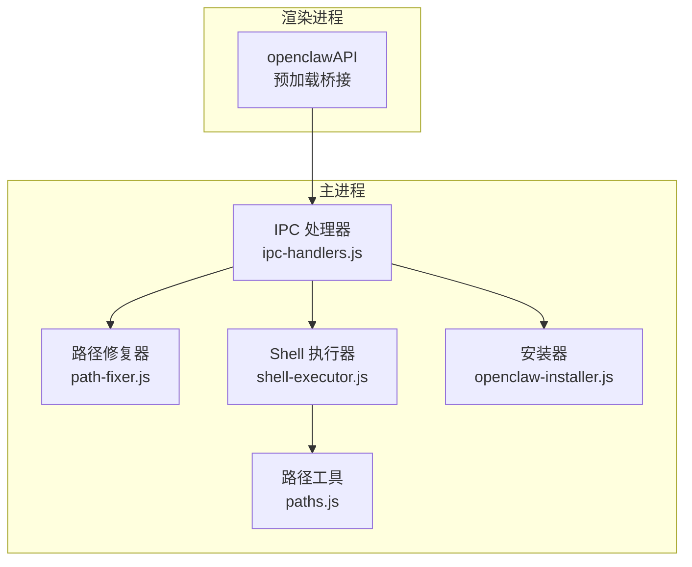
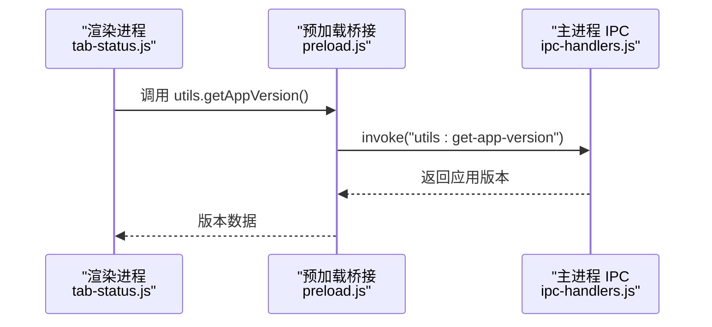
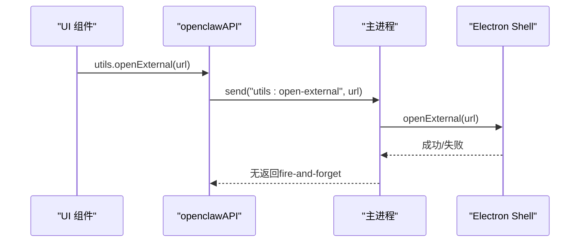
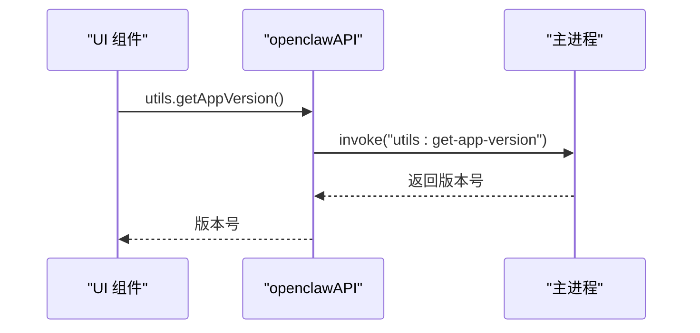
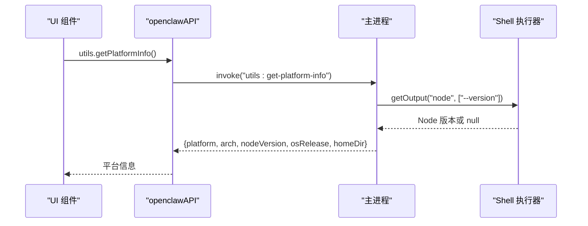
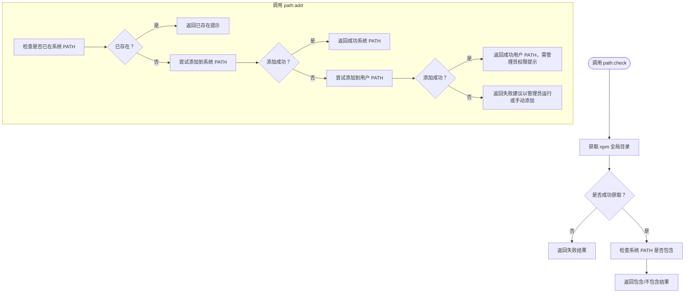
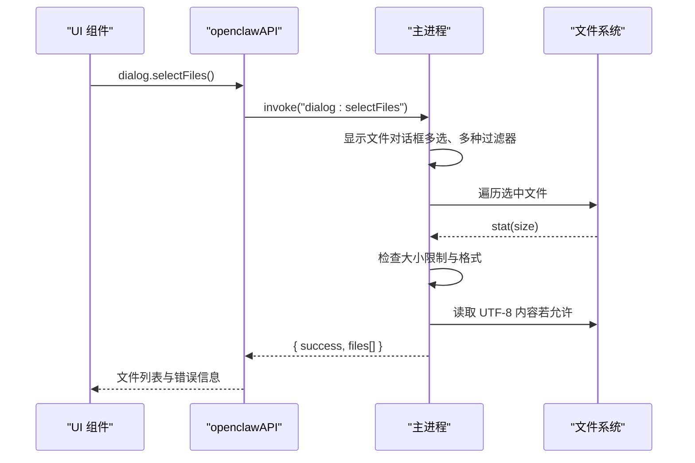
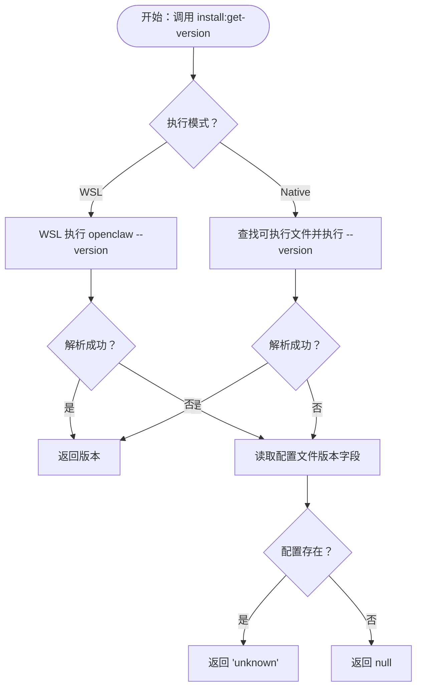
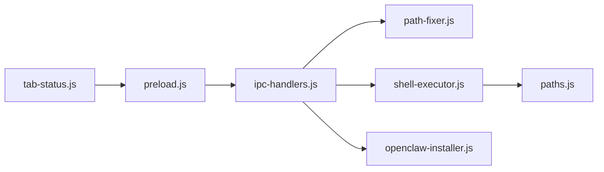

# 工具接口

<cite>
**本文档引用的文件**
- [src/main/ipc-handlers.js](file://src/main/ipc-handlers.js)
- [src/main/preload.js](file://src/main/preload.js)
- [src/main/services/path-fixer.js](file://src/main/services/path-fixer.js)
- [src/main/utils/shell-executor.js](file://src/main/utils/shell-executor.js)
- [src/main/utils/paths.js](file://src/main/utils/paths.js)
- [src/main/services/openclaw-installer.js](file://src/main/services/openclaw-installer.js)
- [src/renderer/js/dashboard/tab-status.js](file://src/renderer/js/dashboard/tab-status.js)
- [package.json](file://package.json)
</cite>

## 目录
1. [简介](#简介)
2. [项目结构](#项目结构)
3. [核心组件](#核心组件)
4. [架构总览](#架构总览)
5. [详细组件分析](#详细组件分析)
6. [依赖关系分析](#依赖关系分析)
7. [性能考虑](#性能考虑)
8. [故障排除指南](#故障排除指南)
9. [结论](#结论)
10. [附录](#附录)

## 简介
本文件系统性梳理并说明工具接口 IPC 相关能力，重点覆盖以下实用工具类接口：
- utils:open-external：外部链接打开
- utils:get-app-version：应用版本查询
- utils:get-platform-info：系统信息获取
- path:check、path:add：路径检查与修复
- dialog:selectDirectory、dialog:selectFiles：文件对话框与文件选择限制

同时解释路径检查与修复机制、文件对话框的使用方式、文件大小限制与格式验证策略，以及平台信息检测与系统兼容性判断方法，并提供错误处理与性能优化建议。

## 项目结构
工具接口位于主进程 IPC 处理器中，通过预加载桥接暴露给渲染进程。核心文件组织如下：
- 主进程 IPC 注册与处理：src/main/ipc-handlers.js
- 预加载桥接 API 暴露：src/main/preload.js
- 路径修复服务：src/main/services/path-fixer.js
- Shell 执行器与路径工具：src/main/utils/shell-executor.js、src/main/utils/paths.js
- 安装器（版本查询等）：src/main/services/openclaw-installer.js
- 渲染侧使用示例：src/renderer/js/dashboard/tab-status.js
- 构建与打包配置：package.json

图表来源
- [src/main/ipc-handlers.js:637-661](file://src/main/ipc-handlers.js#L637-L661)
- [src/main/preload.js:228-237](file://src/main/preload.js#L228-L237)
- [src/main/services/path-fixer.js:1-139](file://src/main/services/path-fixer.js#L1-L139)
- [src/main/utils/shell-executor.js:62-471](file://src/main/utils/shell-executor.js#L62-L471)
- [src/main/utils/paths.js:1-124](file://src/main/utils/paths.js#L1-L124)
- [src/main/services/openclaw-installer.js:43-121](file://src/main/services/openclaw-installer.js#L43-L121)

章节来源
- [src/main/ipc-handlers.js:637-661](file://src/main/ipc-handlers.js#L637-L661)
- [src/main/preload.js:228-237](file://src/main/preload.js#L228-L237)
- [src/main/services/path-fixer.js:1-139](file://src/main/services/path-fixer.js#L1-L139)
- [src/main/utils/shell-executor.js:62-471](file://src/main/utils/shell-executor.js#L62-L471)
- [src/main/utils/paths.js:1-124](file://src/main/utils/paths.js#L1-L124)
- [src/main/services/openclaw-installer.js:43-121](file://src/main/services/openclaw-installer.js#L43-L121)
- [package.json:1-75](file://package.json#L1-L75)

## 核心组件
- 工具接口集合（主进程）：提供外部链接打开、应用版本查询、平台信息获取、路径检查与添加、文件对话框等能力。
- 预加载桥接（渲染进程）：将 IPC 接口封装为 openclawAPI.utils 与 openclawAPI.dialog，统一暴露给前端调用。
- 路径修复器：负责检查 npm 全局目录是否在系统 PATH 中，并提供添加到用户 PATH 或系统 PATH 的能力。
- Shell 执行器：封装命令执行、输出解码、WSL 模式适配、执行模式切换等，支撑版本查询与路径检测。
- 路径工具：提供不同执行模式下的路径映射与转换（如 WSL 路径）。
- 安装器：提供版本查询能力，支持原生与 WSL 两种执行模式。

章节来源
- [src/main/ipc-handlers.js:637-661](file://src/main/ipc-handlers.js#L637-L661)
- [src/main/preload.js:228-237](file://src/main/preload.js#L228-L237)
- [src/main/services/path-fixer.js:1-139](file://src/main/services/path-fixer.js#L1-L139)
- [src/main/utils/shell-executor.js:62-471](file://src/main/utils/shell-executor.js#L62-L471)
- [src/main/utils/paths.js:1-124](file://src/main/utils/paths.js#L1-L124)
- [src/main/services/openclaw-installer.js:43-121](file://src/main/services/openclaw-installer.js#L43-L121)

## 架构总览
工具接口通过 IPC 在主进程与渲染进程之间通信，主进程负责实际系统操作，渲染进程通过 openclawAPI 调用。

图表来源
- [src/renderer/js/dashboard/tab-status.js:230-245](file://src/renderer/js/dashboard/tab-status.js#L230-L245)
- [src/main/preload.js:228-237](file://src/main/preload.js#L228-L237)
- [src/main/ipc-handlers.js:642-644](file://src/main/ipc-handlers.js#L642-L644)

## 详细组件分析

### 外部链接打开（utils:open-external）
- 功能：在系统默认浏览器中打开指定 URL。
- 实现：主进程使用 Electron shell.openExternal(url)。
- 调用方式：渲染进程通过 openclawAPI.utils.openExternal(url) 触发。
- 典型场景：帮助文档、官网跳转等。

图表来源
- [src/main/ipc-handlers.js:638-640](file://src/main/ipc-handlers.js#L638-L640)
- [src/main/preload.js:228-231](file://src/main/preload.js#L228-L231)

章节来源
- [src/main/ipc-handlers.js:638-640](file://src/main/ipc-handlers.js#L638-L640)
- [src/main/preload.js:228-231](file://src/main/preload.js#L228-L231)

### 应用版本查询（utils:get-app-version）
- 功能：返回当前应用版本号。
- 实现：主进程使用 app.getVersion()。
- 调用方式：openclawAPI.utils.getAppVersion()。
- 使用示例：仪表板状态页展示版本信息。

图表来源
- [src/main/ipc-handlers.js:642-644](file://src/main/ipc-handlers.js#L642-L644)
- [src/main/preload.js:228-232](file://src/main/preload.js#L228-L232)
- [src/renderer/js/dashboard/tab-status.js:230-237](file://src/renderer/js/dashboard/tab-status.js#L230-L237)

章节来源
- [src/main/ipc-handlers.js:642-644](file://src/main/ipc-handlers.js#L642-L644)
- [src/main/preload.js:228-232](file://src/main/preload.js#L228-L232)
- [src/renderer/js/dashboard/tab-status.js:230-237](file://src/renderer/js/dashboard/tab-status.js#L230-L237)

### 平台信息获取（utils:get-platform-info）
- 功能：返回系统平台、架构、Node.js 版本、OS 版本、用户目录等信息。
- 实现要点：
  - 优先通过 ShellExecutor 执行 node --version 获取系统 Node 版本。
  - 返回 process.platform/arch/os.release()/os.homedir()。
- 调用方式：openclawAPI.utils.getPlatformInfo()。
- 使用场景：诊断、兼容性判断、日志记录。

图表来源
- [src/main/ipc-handlers.js:646-661](file://src/main/ipc-handlers.js#L646-L661)
- [src/main/utils/shell-executor.js:286-296](file://src/main/utils/shell-executor.js#L286-L296)
- [src/main/preload.js:228-232](file://src/main/preload.js#L228-L232)

章节来源
- [src/main/ipc-handlers.js:646-661](file://src/main/ipc-handlers.js#L646-L661)
- [src/main/utils/shell-executor.js:286-296](file://src/main/utils/shell-executor.js#L286-L296)
- [src/main/preload.js:228-232](file://src/main/preload.js#L228-L232)

### 路径检查与修复（path:check、path:add）
- path:check
  - 功能：检查 npm 全局目录是否在系统 PATH 中，返回检查结果与建议。
  - 实现：通过 ShellExecutor 获取 npm config get prefix，再检查系统 PATH 与用户 PATH。
- path:add
  - 功能：将指定路径添加到系统 PATH（优先用户 PATH，必要时回退到系统 PATH）。
  - 实现：先检查是否存在，不存在则通过 PowerShell 添加；若系统 PATH 失败则尝试用户 PATH。

图表来源
- [src/main/ipc-handlers.js:342-348](file://src/main/ipc-handlers.js#L342-L348)
- [src/main/services/path-fixer.js:113-135](file://src/main/services/path-fixer.js#L113-L135)
- [src/main/services/path-fixer.js:69-108](file://src/main/services/path-fixer.js#L69-L108)

章节来源
- [src/main/ipc-handlers.js:342-348](file://src/main/ipc-handlers.js#L342-L348)
- [src/main/services/path-fixer.js:113-135](file://src/main/services/path-fixer.js#L113-L135)
- [src/main/services/path-fixer.js:69-108](file://src/main/services/path-fixer.js#L69-L108)

### 文件对话框与文件选择限制（dialog:selectDirectory、dialog:selectFiles）
- dialog:selectDirectory
  - 功能：打开目录选择对话框，允许创建新目录。
  - 结果：返回 { success, path } 或 { success: false, message }。
- dialog:selectFiles
  - 功能：打开多文件选择对话框，支持多种过滤器。
  - 文件大小限制：单文件最大 500KB，超过则记录错误信息。
  - 格式验证：Office/PDF 类型提示“暂不支持直接读取内容”，要求转存为文本格式。
  - 内容读取：对支持的文本类文件进行 UTF-8 读取，返回 { name, path, content, size }。
  - 错误处理：读取异常记录错误并继续处理其他文件。

图表来源
- [src/main/ipc-handlers.js:459-522](file://src/main/ipc-handlers.js#L459-L522)
- [src/main/preload.js:137-141](file://src/main/preload.js#L137-L141)

章节来源
- [src/main/ipc-handlers.js:459-522](file://src/main/ipc-handlers.js#L459-L522)
- [src/main/preload.js:137-141](file://src/main/preload.js#L137-L141)

### 版本查询与平台兼容性（结合安装器与 Shell 执行器）
- 版本查询流程：
  - 优先在当前执行模式下执行 openclaw --version。
  - 若失败，尝试在 WSL 模式下执行（export PATH 与语言环境）。
  - 若仍失败，回退到解析配置文件中的版本字段。
  - 若仍失败但检测到配置目录存在，则返回 "unknown"。
- 平台兼容性：
  - ShellExecutor 支持原生与 WSL 两种执行模式，自动适配命令包装与 PATH。
  - getPlatformInfo 提供系统 Node 版本与 OS 信息，辅助判断兼容性。

图表来源
- [src/main/services/openclaw-installer.js:43-121](file://src/main/services/openclaw-installer.js#L43-L121)
- [src/main/utils/shell-executor.js:448-467](file://src/main/utils/shell-executor.js#L448-L467)
- [src/main/ipc-handlers.js:164-175](file://src/main/ipc-handlers.js#L164-L175)

章节来源
- [src/main/services/openclaw-installer.js:43-121](file://src/main/services/openclaw-installer.js#L43-L121)
- [src/main/utils/shell-executor.js:448-467](file://src/main/utils/shell-executor.js#L448-L467)
- [src/main/ipc-handlers.js:164-175](file://src/main/ipc-handlers.js#L164-L175)

## 依赖关系分析
- openclawAPI 预加载桥接将 IPC 接口暴露给渲染进程，统一命名空间为 utils 与 dialog。
- 主进程 IPC 处理器集中注册工具接口，内部依赖路径修复器、Shell 执行器、安装器等服务。
- Shell 执行器依赖路径工具（paths.js）以适配不同执行模式（原生/WSL）。

图表来源
- [src/main/preload.js:228-237](file://src/main/preload.js#L228-L237)
- [src/main/ipc-handlers.js:342-348](file://src/main/ipc-handlers.js#L342-L348)
- [src/main/services/path-fixer.js:1-139](file://src/main/services/path-fixer.js#L1-L139)
- [src/main/utils/shell-executor.js:62-471](file://src/main/utils/shell-executor.js#L62-L471)
- [src/main/utils/paths.js:1-124](file://src/main/utils/paths.js#L1-L124)
- [src/main/services/openclaw-installer.js:43-121](file://src/main/services/openclaw-installer.js#L43-L121)
- [src/renderer/js/dashboard/tab-status.js:230-245](file://src/renderer/js/dashboard/tab-status.js#L230-L245)

章节来源
- [src/main/preload.js:228-237](file://src/main/preload.js#L228-L237)
- [src/main/ipc-handlers.js:342-348](file://src/main/ipc-handlers.js#L342-L348)
- [src/main/services/path-fixer.js:1-139](file://src/main/services/path-fixer.js#L1-L139)
- [src/main/utils/shell-executor.js:62-471](file://src/main/utils/shell-executor.js#L62-L471)
- [src/main/utils/paths.js:1-124](file://src/main/utils/paths.js#L1-L124)
- [src/main/services/openclaw-installer.js:43-121](file://src/main/services/openclaw-installer.js#L43-L121)
- [src/renderer/js/dashboard/tab-status.js:230-245](file://src/renderer/js/dashboard/tab-status.js#L230-L245)

## 性能考虑
- 文件读取限制：单文件 500KB 限制，避免大文件导致消息体过大，影响传输与处理效率。
- 过滤器分层：多级过滤器减少无效文件读取，提升用户体验与性能。
- Shell 执行超时：命令执行默认超时控制，防止长时间阻塞。
- WSL 模式：通过 export LANG/PATH 避免编码与 PATH 问题，减少重试与失败开销。

## 故障排除指南
- 外部链接无法打开
  - 检查系统默认浏览器配置。
  - 确认 URL 格式有效。
- 应用版本查询失败
  - 检查 app.getVersion() 是否可用（打包后 Electron 环境）。
  - 渲染侧使用 openclawAPI.utils.getAppVersion()，确认预加载桥接正常。
- 平台信息获取异常
  - ShellExecutor.getOutput("node", ["--version"]) 失败时回退到 process.version。
  - 确认系统 Node.js 安装与 PATH 配置。
- 路径修复失败
  - 系统 PATH 添加失败通常因权限不足，尝试用户 PATH 或以管理员身份运行。
  - 检查 PowerShell 命令执行权限与环境变量。
- 文件选择异常
  - Office/PDF 类型不支持直接读取内容，按提示转存为文本格式。
  - 文件过大（>500KB）会被标记错误，建议拆分或压缩。
  - 读取失败时记录具体错误信息，便于定位文件权限或损坏问题。

章节来源
- [src/main/ipc-handlers.js:638-640](file://src/main/ipc-handlers.js#L638-L640)
- [src/main/ipc-handlers.js:642-644](file://src/main/ipc-handlers.js#L642-L644)
- [src/main/ipc-handlers.js:646-661](file://src/main/ipc-handlers.js#L646-L661)
- [src/main/services/path-fixer.js:69-108](file://src/main/services/path-fixer.js#L69-L108)
- [src/main/ipc-handlers.js:472-522](file://src/main/ipc-handlers.js#L472-L522)

## 结论
工具接口 IPC 提供了外部链接打开、应用版本查询、平台信息获取、路径检查修复以及文件对话框与文件选择限制等核心能力。通过预加载桥接与主进程处理器的清晰分工，配合 Shell 执行器与路径工具的模式适配，实现了跨平台与多执行模式的稳定支持。建议在生产环境中结合错误处理与性能优化策略，确保用户体验与系统稳定性。

## 附录
- 构建与打包：package.json 定义了 Electron 应用的构建脚本与目标平台配置，确保工具接口在不同平台上的可用性。

章节来源
- [package.json:1-75](file://package.json#L1-L75)