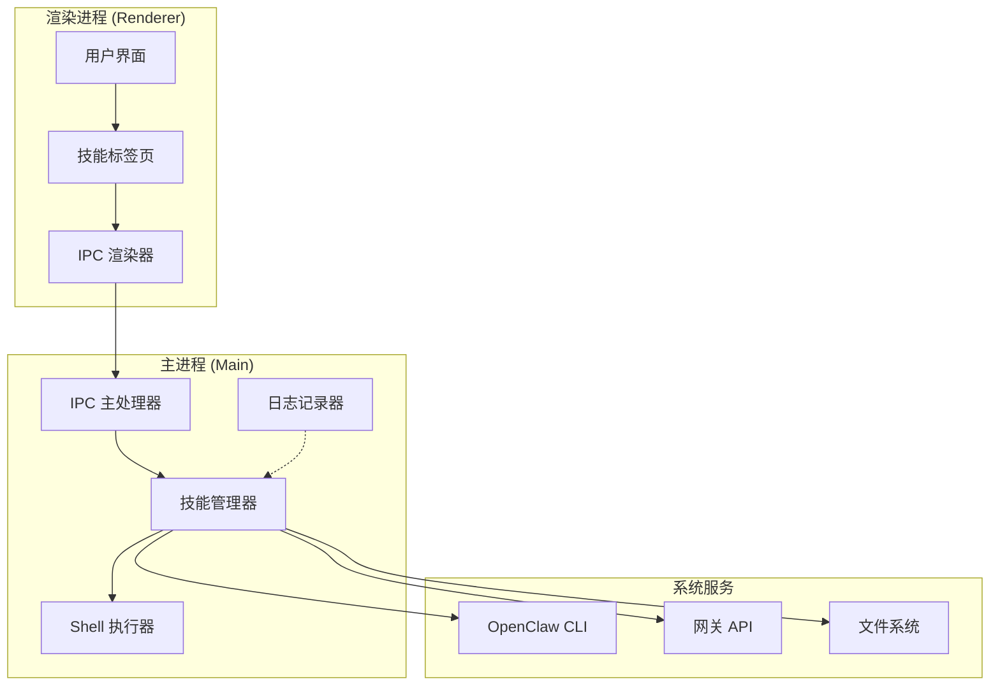
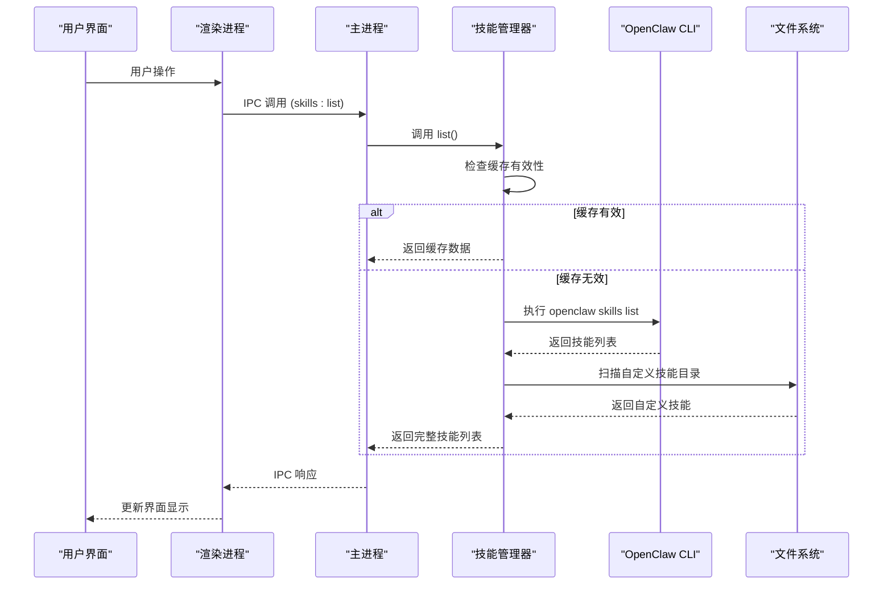
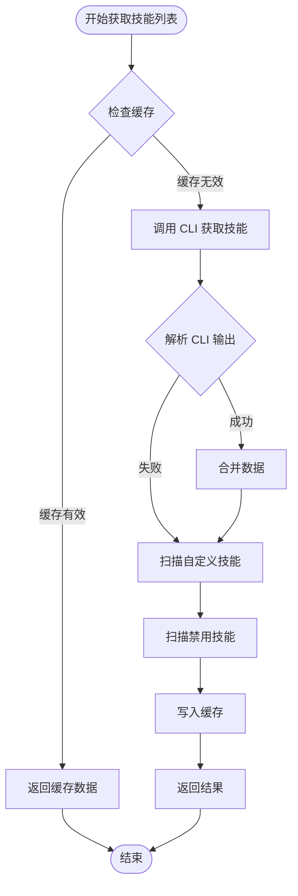
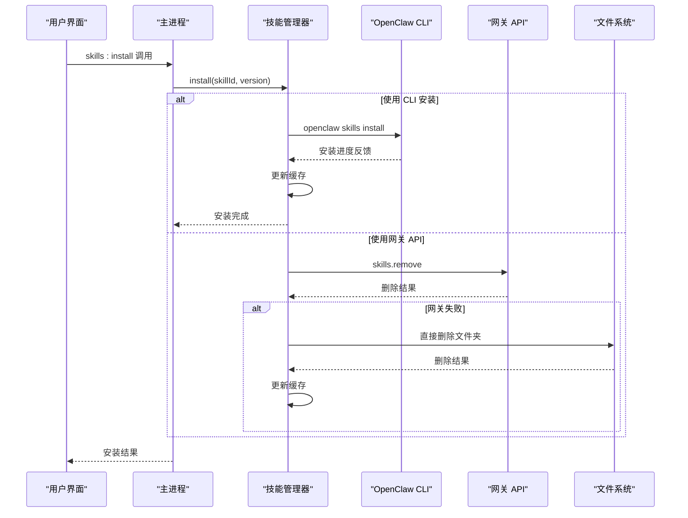
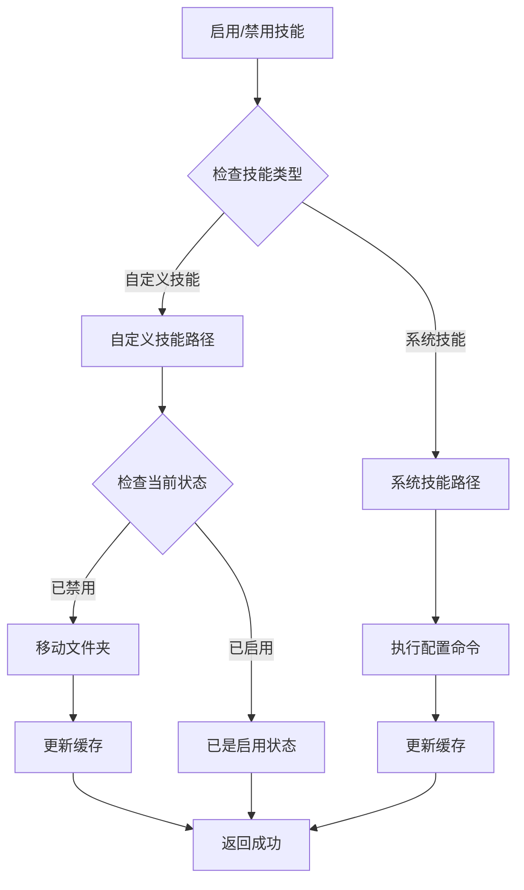
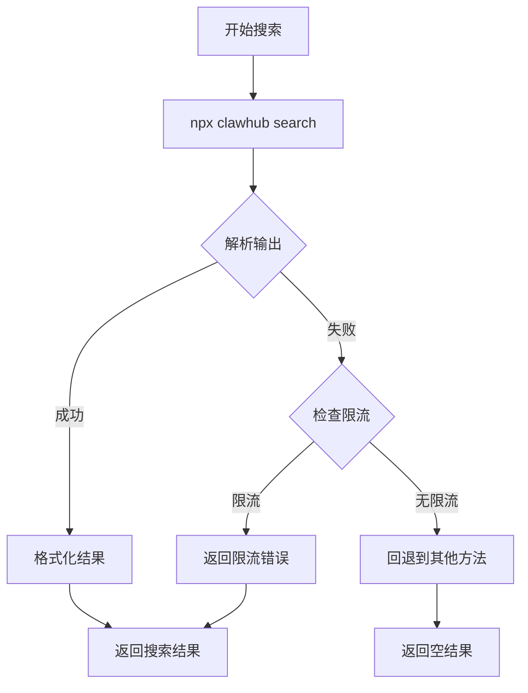
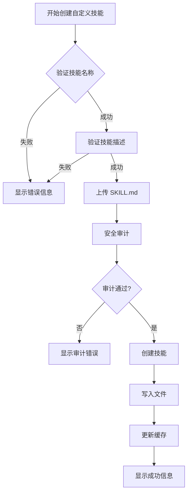
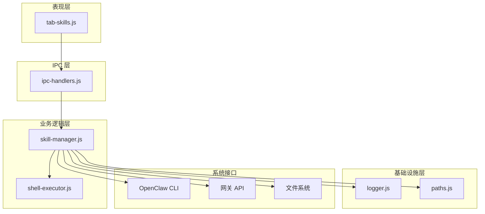

# 技能管理接口

<cite>
**本文档引用的文件**
- [skill-manager.js](file://src/main/services/skill-manager.js)
- [ipc-handlers.js](file://src/main/ipc-handlers.js)
- [shell-executor.js](file://src/main/utils/shell-executor.js)
- [logger.js](file://src/main/utils/logger.js)
- [paths.js](file://src/main/utils/paths.js)
- [tab-skills.js](file://src/renderer/js/dashboard/tab-skills.js)
- [SKILL.md](file://resources/skills/web-search/SKILL.md)
- [IMPLEMENTATION.md](file://resources/skills/web-search/IMPLEMENTATION.md)
- [package.json](file://resources/skills/web-search/package.json)
</cite>

## 目录
1. [简介](#简介)
2. [项目结构](#项目结构)
3. [核心组件](#核心组件)
4. [架构概览](#架构概览)
5. [详细组件分析](#详细组件分析)
6. [依赖关系分析](#依赖关系分析)
7. [性能考虑](#性能考虑)
8. [故障排除指南](#故障排除指南)
9. [结论](#结论)

## 简介

OpenClaw 技能管理系统是一个基于 Electron 的桌面应用程序，提供了完整的技能生命周期管理功能。该系统通过 IPC（Inter-Process Communication）通道实现了与主进程的通信，支持技能的安装、卸载、启用、禁用、搜索、探索、检查等功能。

技能管理接口的核心设计目标是：
- 提供统一的技能生态系统管理入口
- 支持内置技能和自定义技能的混合管理
- 实现技能状态的持久化和缓存优化
- 提供丰富的技能元数据和验证机制
- 支持技能市场的搜索和导入功能

## 项目结构

OpenClaw 技能管理系统的整体架构采用分层设计：

**图表来源**
- [ipc-handlers.js:525-595](file://src/main/ipc-handlers.js#L525-L595)
- [skill-manager.js:9-13](file://src/main/services/skill-manager.js#L9-L13)

**章节来源**
- [ipc-handlers.js:26-51](file://src/main/ipc-handlers.js#L26-L51)
- [skill-manager.js:1-25](file://src/main/services/skill-manager.js#L1-L25)

## 核心组件

### 技能管理器 (SkillManager)

技能管理器是整个技能系统的核心组件，负责协调各种技能操作。其主要职责包括：

- **技能列表管理**：获取已安装技能列表，支持缓存机制
- **技能安装/卸载**：通过 CLI 或文件系统操作技能
- **技能启用/禁用**：管理技能的激活状态
- **技能搜索**：集成技能市场搜索功能
- **自定义技能创建**：提供技能模板和验证机制

### IPC 处理器

IPC 处理器负责建立渲染进程和主进程之间的通信桥梁，定义了完整的技能管理 IPC 接口：

- `skills:list` - 获取技能列表
- `skills:install` - 安装技能
- `skills:remove` - 卸载技能
- `skills:enable` - 启用技能
- `skills:disable` - 禁用技能
- `skills:search` - 搜索技能
- `skills:explore` - 探索技能市场
- `skills:info` - 获取技能信息
- `skills:create-custom` - 创建自定义技能

### Shell 执行器

Shell 执行器封装了系统命令的执行逻辑，提供了跨平台的命令执行能力：

- **跨平台兼容**：支持 Windows、Linux、macOS
- **WSL 集成**：支持 Windows Subsystem for Linux
- **编码处理**：自动处理不同系统的编码问题
- **超时控制**：提供命令执行超时机制

**章节来源**
- [skill-manager.js:9-1096](file://src/main/services/skill-manager.js#L9-L1096)
- [ipc-handlers.js:542-595](file://src/main/ipc-handlers.js#L542-L595)
- [shell-executor.js:62-471](file://src/main/utils/shell-executor.js#L62-L471)

## 架构概览

技能管理系统的架构采用了典型的客户端-服务器模式，结合了 Electron 的双进程架构：

**图表来源**
- [ipc-handlers.js:542-545](file://src/main/ipc-handlers.js#L542-L545)
- [skill-manager.js:133-326](file://src/main/services/skill-manager.js#L133-L326)

## 详细组件分析

### 技能列表管理

技能列表管理是技能系统的基础功能，实现了智能缓存和多源数据合并：

**图表来源**
- [skill-manager.js:133-326](file://src/main/services/skill-manager.js#L133-L326)
- [skill-manager.js:219-316](file://src/main/services/skill-manager.js#L219-L316)

技能列表管理的关键特性：
- **缓存机制**：60秒缓存有效期，减少 CLI 调用频率
- **多源数据**：同时从 CLI 和文件系统获取技能信息
- **自定义技能识别**：自动识别和标记自定义技能
- **状态同步**：确保技能状态的一致性

**章节来源**
- [skill-manager.js:133-326](file://src/main/services/skill-manager.js#L133-L326)

### 技能安装流程

技能安装流程支持多种安装方式，并提供了完善的错误处理机制：

**图表来源**
- [ipc-handlers.js:547-549](file://src/main/ipc-handlers.js#L547-L549)
- [skill-manager.js:373-398](file://src/main/services/skill-manager.js#L373-L398)

安装流程的关键特性：
- **双路径支持**：优先使用 CLI，失败时回退到文件系统操作
- **进度反馈**：支持长时间安装任务的进度监控
- **自动缓存清理**：安装完成后自动清理缓存
- **错误恢复**：提供多层错误处理和恢复机制

**章节来源**
- [skill-manager.js:373-398](file://src/main/services/skill-manager.js#L373-L398)

### 技能启用/禁用机制

技能启用和禁用机制区分了系统技能和自定义技能的不同处理方式：

**图表来源**
- [skill-manager.js:487-593](file://src/main/services/skill-manager.js#L487-L593)

启用/禁用机制的关键特性：
- **智能路径检测**：自动识别技能存储位置
- **文件系统操作**：自定义技能通过文件夹移动实现状态切换
- **配置管理**：系统技能通过配置文件管理启用状态
- **状态一致性**：确保 UI 和实际状态保持一致

**章节来源**
- [skill-manager.js:487-593](file://src/main/services/skill-manager.js#L487-L593)

### 技能搜索和探索功能

技能搜索功能集成了多个搜索源，提供了灵活的搜索体验：

**图表来源**
- [skill-manager.js:599-648](file://src/main/services/skill-manager.js#L599-L648)

搜索功能的关键特性：
- **多源搜索**：支持 npm 包搜索和技能市场搜索
- **限流处理**：自动检测和处理 npm 速率限制
- **结果解析**：提供灵活的结果解析机制
- **错误恢复**：失败时提供优雅的降级处理

**章节来源**
- [skill-manager.js:599-648](file://src/main/services/skill-manager.js#L599-L648)

### 技能元数据结构和验证

技能元数据采用 YAML frontmatter 格式，提供了完整的技能描述信息：

| 字段 | 类型 | 必需 | 描述 | 示例 |
|------|------|------|------|------|
| name | string | 是 | 技能名称 | `web-search` |
| description | string | 是 | 技能描述 | `实时网络搜索技能` |
| version | string | 否 | 版本号 | `1.0.0` |
| official | boolean | 否 | 是否官方技能 | `true` |
| license | string | 否 | 许可证信息 | `MIT` |

技能元数据验证规则：
- **名称验证**：只允许小写字母、数字、连字符和下划线，必须以字母或数字开头
- **描述验证**：至少5个字符，建议10-100字符
- **内容验证**：SKILL.md 内容至少50字符，建议200字符以上
- **安全审计**：检测潜在的安全风险，如危险命令、敏感信息泄露等

**章节来源**
- [skill-manager.js:1023-1073](file://src/main/services/skill-manager.js#L1023-L1073)
- [tab-skills.js:569-657](file://src/renderer/js/dashboard/tab-skills.js#L569-L657)

### 自定义技能创建流程

自定义技能创建提供了完整的向导和安全审计功能：

**图表来源**
- [tab-skills.js:686-730](file://src/renderer/js/dashboard/tab-skills.js#L686-L730)
- [skill-manager.js:1023-1073](file://src/main/services/skill-manager.js#L1023-L1073)

创建流程的关键特性：
- **实时验证**：技能名称和描述的实时验证
- **安全审计**：自动检测潜在的安全风险
- **文件上传**：支持拖拽和点击两种文件上传方式
- **预览功能**：提供 Markdown 内容预览
- **错误处理**：完善的错误提示和恢复机制

**章节来源**
- [tab-skills.js:379-730](file://src/renderer/js/dashboard/tab-skills.js#L379-L730)

## 依赖关系分析

技能管理系统的依赖关系体现了清晰的分层架构：

**图表来源**
- [ipc-handlers.js:18-50](file://src/main/ipc-handlers.js#L18-L50)
- [skill-manager.js:1-8](file://src/main/services/skill-manager.js#L1-L8)

依赖关系的关键特点：
- **单向依赖**：从表现层到基础设施层的单向依赖
- **松耦合**：各层之间通过接口而非具体实现耦合
- **可测试性**：良好的依赖分离便于单元测试
- **可扩展性**：新的功能模块可以轻松添加到现有架构中

**章节来源**
- [ipc-handlers.js:18-50](file://src/main/ipc-handlers.js#L18-L50)
- [skill-manager.js:1-8](file://src/main/services/skill-manager.js#L1-L8)

## 性能考虑

技能管理系统的性能优化主要体现在以下几个方面：

### 缓存策略
- **技能列表缓存**：60秒缓存有效期，显著减少 CLI 调用频率
- **智能失效**：安装、卸载、启用、禁用操作后自动清理缓存
- **内存管理**：合理控制缓存大小，避免内存泄漏

### 异步处理
- **并发操作**：支持多个技能操作的并发执行
- **进度反馈**：长时间操作提供实时进度反馈
- **超时控制**：合理的超时设置避免阻塞

### 资源优化
- **文件系统访问**：最小化文件系统操作次数
- **网络请求**：技能搜索结果的本地缓存
- **内存使用**：合理控制技能元数据的内存占用

## 故障排除指南

### 常见问题及解决方案

**技能列表加载失败**
- 检查 OpenClaw CLI 是否正确安装
- 验证网络连接和权限设置
- 查看日志文件获取详细错误信息

**技能安装失败**
- 确认 npm 包的可用性和网络连接
- 检查磁盘空间和权限
- 验证技能名称的有效性

**技能启用/禁用异常**
- 检查技能文件夹的权限设置
- 验证配置文件的正确性
- 确认技能状态的一致性

**搜索功能异常**
- 检查 npm 服务的可用性
- 验证网络连接和代理设置
- 查看速率限制状态

**章节来源**
- [logger.js:45-72](file://src/main/utils/logger.js#L45-L72)
- [skill-manager.js:210-212](file://src/main/services/skill-manager.js#L210-L212)

## 结论

OpenClaw 技能管理系统通过精心设计的架构和完善的 IPC 接口，为用户提供了强大而易用的技能管理功能。系统的主要优势包括：

- **完整的功能覆盖**：从技能安装到生命周期管理的全流程支持
- **优秀的用户体验**：直观的界面设计和流畅的操作体验
- **强大的扩展性**：模块化的架构便于功能扩展和维护
- **完善的错误处理**：多层次的错误检测和恢复机制
- **安全的开发实践**：严格的输入验证和安全审计

该系统为 OpenClaw 生态系统的技能管理奠定了坚实的基础，为未来的功能扩展和技术演进提供了良好的平台支撑。