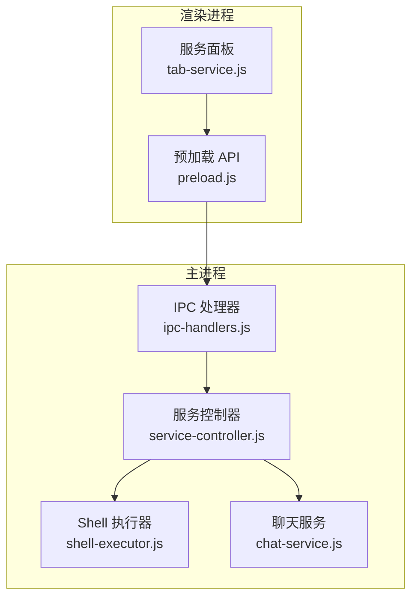
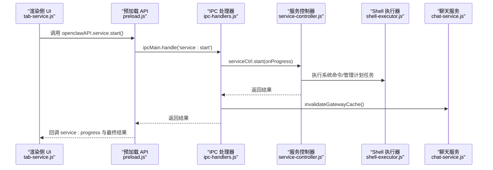
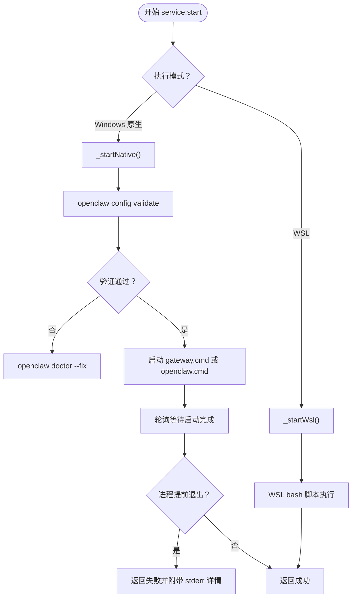
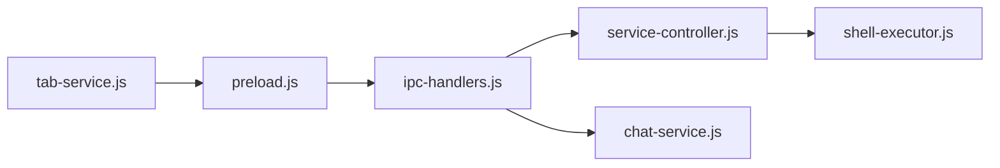

# 服务控制接口

<cite>
**本文档引用的文件**
- [service-controller.js](file://src/main/services/service-controller.js)
- [ipc-handlers.js](file://src/main/ipc-handlers.js)
- [preload.js](file://src/main/preload.js)
- [tab-service.js](file://src/renderer/js/dashboard/tab-service.js)
- [shell-executor.js](file://src/main/utils/shell-executor.js)
- [chat-service.js](file://src/main/services/chat-service.js)
- [defaults.js](file://src/main/config/defaults.js)
- [wsl-checker.js](file://src/main/services/wsl-checker.js)
</cite>

## 目录
1. [简介](#简介)
2. [项目结构](#项目结构)
3. [核心组件](#核心组件)
4. [架构总览](#架构总览)
5. [详细组件分析](#详细组件分析)
6. [依赖关系分析](#依赖关系分析)
7. [性能考量](#性能考量)
8. [故障排查指南](#故障排查指南)
9. [结论](#结论)

## 简介
本文件系统化梳理并文档化服务控制 IPC 接口，重点覆盖 Daemon 服务管理相关的 IPC 通道（service:start、service:stop、service:restart、service:get-status），以及服务自动启动配置、状态查询与进度监控机制。同时解释权限要求与安全考虑，提供启动失败的错误处理与重试建议，并阐述服务状态缓存失效与实时状态同步的实现细节。

## 项目结构
服务控制相关代码主要分布在以下模块：
- 主进程服务控制器：负责实际的启动/停止/重启/状态查询与自动启动任务管理
- IPC 处理器：注册并实现所有 IPC 通道，桥接渲染进程与主进程服务
- 预加载 API：在渲染进程中暴露统一的 openclawAPI.service.* 接口
- 渲染侧服务面板：提供 UI 操作入口、进度展示与状态轮询
- Shell 执行器：封装跨平台命令执行、模式切换与 PATH 处理
- 聊天服务：提供 Gateway 可用性缓存与失效机制，配合服务控制实现状态同步

图表来源
- [ipc-handlers.js:350-388](file://src/main/ipc-handlers.js#L350-L388)
- [service-controller.js:82-132](file://src/main/services/service-controller.js#L82-L132)
- [shell-executor.js:62-127](file://src/main/utils/shell-executor.js#L62-L127)
- [chat-service.js:184-190](file://src/main/services/chat-service.js#L184-L190)

章节来源
- [ipc-handlers.js:350-388](file://src/main/ipc-handlers.js#L350-L388)
- [service-controller.js:82-132](file://src/main/services/service-controller.js#L82-L132)
- [shell-executor.js:62-127](file://src/main/utils/shell-executor.js#L62-L127)
- [chat-service.js:184-190](file://src/main/services/chat-service.js#L184-L190)

## 核心组件
- 服务控制器（ServiceController）
  - 实现 service:start、service:stop、service:restart、service:get-status
  - 实现开机自启动任务管理（Windows 计划任务）
  - 提供状态查询、健康检查、命令执行与环境构建
- IPC 处理器（ipc-handlers.js）
  - 注册 service:* IPC 通道，转发到 ServiceController
  - 在启动/停止后主动失效聊天服务的 Gateway 缓存，确保状态同步
- 预加载 API（preload.js）
  - 暴露 openclawAPI.service.* 统一接口，供渲染侧调用
- 渲染侧服务面板（tab-service.js）
  - 提供 UI 操作按钮、进度条、状态轮询与日志记录
- Shell 执行器（shell-executor.js）
  - 统一封装命令执行、模式切换（native/WSL）、PATH 修复与编码解码
- 聊天服务（chat-service.js）
  - 提供 Gateway 可用性缓存与失效机制，配合服务控制实现状态同步

章节来源
- [service-controller.js:82-132](file://src/main/services/service-controller.js#L82-L132)
- [ipc-handlers.js:350-388](file://src/main/ipc-handlers.js#L350-L388)
- [preload.js:85-104](file://src/main/preload.js#L85-L104)
- [tab-service.js:1-150](file://src/renderer/js/dashboard/tab-service.js#L1-L150)
- [shell-executor.js:62-127](file://src/main/utils/shell-executor.js#L62-L127)
- [chat-service.js:184-190](file://src/main/services/chat-service.js#L184-L190)

## 架构总览
服务控制 IPC 的典型调用链如下：
- 渲染侧通过 openclawAPI.service.* 调用
- 预加载 API 将调用转发至 IPC 处理器
- IPC 处理器调用 ServiceController 执行具体操作
- ServiceController 通过 ShellExecutor 执行系统命令或管理计划任务
- 启动/停止后，IPC 处理器通知聊天服务失效缓存，确保 UI 实时反映真实状态

图表来源
- [ipc-handlers.js:350-375](file://src/main/ipc-handlers.js#L350-L375)
- [service-controller.js:123-132](file://src/main/services/service-controller.js#L123-L132)
- [shell-executor.js:136-197](file://src/main/utils/shell-executor.js#L136-L197)
- [chat-service.js:184-190](file://src/main/services/chat-service.js#L184-L190)

## 详细组件分析

### 服务控制器（ServiceController）
- 启动流程
  - 识别执行模式（native/WSL），分别调用 _startNative/_startWsl
  - Windows 原生模式优先使用 ~/.openclaw/gateway.cmd 直接启动，避免 UAC
  - 启动前执行 openclaw config validate，必要时执行 doctor --fix
  - 通过轮询等待启动完成，结合进程存活检查与端口监听判断
  - 提供进度回调（step、message、percent），支持中途失败早停
- 停止流程
  - Windows 原生模式使用 taskkill /T 按 PID 终止进程树，避免 UAC
  - 清理 PID 文件，二次校验端口是否关闭
- 重启流程
  - 先 stop，延时 2 秒，再 start，保证旧连接充分释放
- 状态查询
  - Windows 原生模式：通过 netstat 查找监听端口的 PID，读取 PID 文件
  - WSL 模式：通过 wsl bash 脚本查询状态
- 自动启动（Windows）
  - 使用 schtasks.exe 创建/删除计划任务，任务名为 OpenClawGateway
  - 任务在用户登录时以当前用户身份运行，无需管理员权限
  - 支持幂等：重复安装会先删除旧任务再创建
- 健康检查
  - 通过 openclaw gateway health 或 WSL 健康检查命令验证服务可用性

图表来源
- [service-controller.js:123-364](file://src/main/services/service-controller.js#L123-L364)
- [service-controller.js:528-552](file://src/main/services/service-controller.js#L528-L552)

章节来源
- [service-controller.js:123-364](file://src/main/services/service-controller.js#L123-L364)
- [service-controller.js:554-662](file://src/main/services/service-controller.js#L554-L662)
- [service-controller.js:642-652](file://src/main/services/service-controller.js#L642-L652)
- [service-controller.js:667-732](file://src/main/services/service-controller.js#L667-L732)
- [service-controller.js:852-1098](file://src/main/services/service-controller.js#L852-L1098)

### IPC 处理器（ipc-handlers.js）
- 注册 service:* IPC 通道
  - service:start、service:stop、service:restart、service:get-status
  - service:get-autostart、service:set-autostart、service:install-autostart
- 启动/停止后主动失效聊天服务的 Gateway 缓存，确保 UI 实时反映真实状态
- 将进度回调转发给渲染侧 service:progress

章节来源
- [ipc-handlers.js:350-388](file://src/main/ipc-handlers.js#L350-L388)
- [ipc-handlers.js:351-375](file://src/main/ipc-handlers.js#L351-L375)

### 预加载 API（preload.js）
- 暴露 openclawAPI.service.* 接口，包括：
  - start、stop、restart、getStatus
  - getAutostart、setAutostart、installAutostart
  - onStatusChange、onServiceProgress
- 渲染侧通过这些接口与主进程通信

章节来源
- [preload.js:85-104](file://src/main/preload.js#L85-L104)

### 渲染侧服务面板（tab-service.js）
- UI 操作入口：启动、停止、重启按钮
- 进度条与状态轮询：监听 service:progress 与定期轮询状态
- 开机自启：开关与一键安装自启任务
- 日志记录：记录每次操作的开始、结果与错误

章节来源
- [tab-service.js:1-150](file://src/renderer/js/dashboard/tab-service.js#L1-L150)
- [tab-service.js:183-205](file://src/renderer/js/dashboard/tab-service.js#L183-L205)
- [tab-service.js:240-279](file://src/renderer/js/dashboard/tab-service.js#L240-L279)
- [tab-service.js:337-401](file://src/renderer/js/dashboard/tab-service.js#L337-L401)

### Shell 执行器（shell-executor.js）
- 统一封装命令执行，支持：
  - 模式切换：native/WSL
  - PATH 修复：解决打包后 PATH 不完整导致的 ENOENT
  - 编码解码：处理 Windows GBK 输出
  - 超时控制与错误处理
- 为 ServiceController 提供稳定的命令执行基础

章节来源
- [shell-executor.js:62-127](file://src/main/utils/shell-executor.js#L62-L127)
- [shell-executor.js:136-197](file://src/main/utils/shell-executor.js#L136-L197)
- [shell-executor.js:301-350](file://src/main/utils/shell-executor.js#L301-L350)

### 聊天服务（chat-service.js）
- Gateway 可用性缓存：快速 TCP 探测，避免每次请求都探测
- 缓存失效：在服务启动/停止后主动失效缓存，确保 UI 实时反映真实状态
- 404 缓存：当 Gateway 不支持特定端点时缓存 404，避免重复探测

章节来源
- [chat-service.js:154-182](file://src/main/services/chat-service.js#L154-L182)
- [chat-service.js:184-190](file://src/main/services/chat-service.js#L184-L190)
- [chat-service.js:351-355](file://src/main/services/chat-service.js#L351-L355)

## 依赖关系分析
- ServiceController 依赖 ShellExecutor 执行系统命令与模式切换
- IPC 处理器依赖 ServiceController 执行业务逻辑
- 预加载 API 依赖 IPC 处理器提供服务
- 渲染侧服务面板依赖预加载 API
- IPC 处理器在启动/停止后依赖聊天服务失效缓存，确保状态同步

图表来源
- [ipc-handlers.js:350-388](file://src/main/ipc-handlers.js#L350-L388)
- [service-controller.js:82-132](file://src/main/services/service-controller.js#L82-L132)
- [shell-executor.js:62-127](file://src/main/utils/shell-executor.js#L62-L127)
- [chat-service.js:184-190](file://src/main/services/chat-service.js#L184-L190)

章节来源
- [ipc-handlers.js:350-388](file://src/main/ipc-handlers.js#L350-L388)
- [service-controller.js:82-132](file://src/main/services/service-controller.js#L82-L132)
- [shell-executor.js:62-127](file://src/main/utils/shell-executor.js#L62-L127)
- [chat-service.js:184-190](file://src/main/services/chat-service.js#L184-L190)

## 性能考量
- 启动超时与轮询
  - 启动超时默认 60 秒，轮询间隔 1 秒，避免长时间阻塞 UI
  - 进程提前退出时尽早失败，减少等待
- 状态轮询
  - 状态轮询间隔 5 秒，平衡实时性与性能
- Gateway 可用性缓存
  - TCP 探测缓存 30 秒，避免频繁探测
  - 404 缓存 5 分钟，避免重复探测不支持的端点
- WSL 模式
  - 使用 wsl --exec 避免 PATH 问题，减少潜在的 shell 解析开销

章节来源
- [defaults.js:47-51](file://src/main/config/defaults.js#L47-L51)
- [defaults.js:38-42](file://src/main/config/defaults.js#L38-L42)
- [service-controller.js:287-350](file://src/main/services/service-controller.js#L287-L350)
- [chat-service.js:154-182](file://src/main/services/chat-service.js#L154-L182)

## 故障排查指南
- 启动失败常见原因
  - openclaw.json 配置错误：先执行 openclaw config validate，必要时执行 doctor --fix
  - 端口被占用：检查端口 18789 是否被其他进程占用
  - openclaw 版本过旧：执行 npm install -g openclaw@latest 更新
  - PATH 不完整：使用 PATH 修复工具或手动添加 npm 全局目录
- 进程提前退出
  - 检查临时 stderr 日志（openclaw-gateway-stderr.log），定位具体错误
- 状态不同步
  - 启动/停止后 IPC 处理器会失效聊天服务缓存，若 UI 未更新，检查轮询间隔与网络状态
- Windows 自启动
  - 确认计划任务 OpenClawGateway 存在且启用
  - 若任务不存在，使用一键设置自启功能重新安装
- WSL 环境
  - 确认 WSL 已安装且可执行 wsl 命令
  - 检查 PATH 中是否包含 npm-global 目录

章节来源
- [service-controller.js:156-176](file://src/main/services/service-controller.js#L156-L176)
- [service-controller.js:314-338](file://src/main/services/service-controller.js#L314-L338)
- [ipc-handlers.js:355-364](file://src/main/ipc-handlers.js#L355-L364)
- [tab-service.js:240-279](file://src/renderer/js/dashboard/tab-service.js#L240-L279)
- [wsl-checker.js:67-98](file://src/main/services/wsl-checker.js#L67-L98)

## 结论
本服务控制 IPC 接口通过清晰的职责划分与完善的错误处理机制，实现了稳定的服务启动、停止、重启与状态查询能力。结合自动启动任务管理与缓存失效策略，确保了 UI 的实时性与用户体验。在权限方面，原生模式尽量避免 UAC 触发，WSL 模式通过明确的命令包装降低 PATH 问题风险。对于启动失败，提供了从配置校验到日志采集的完整排查路径。