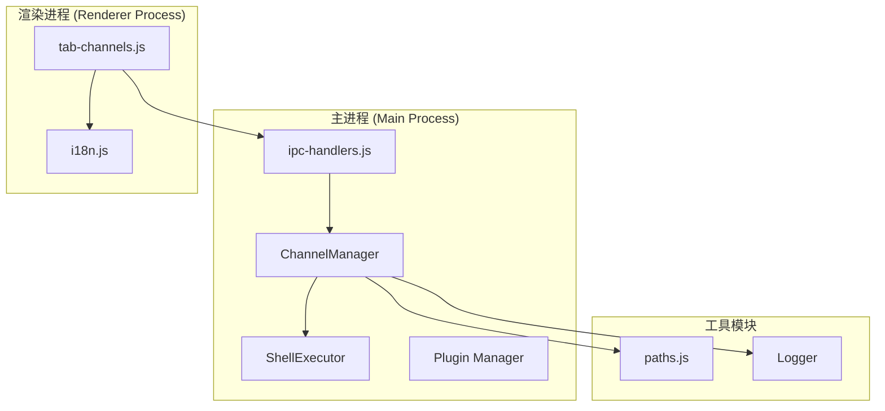
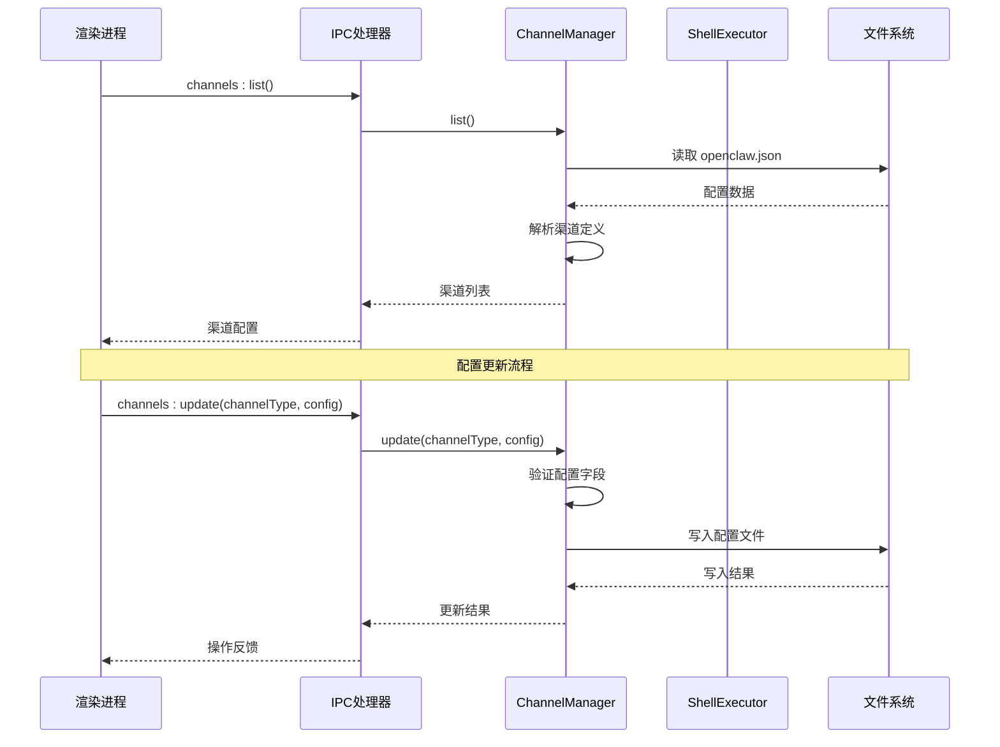
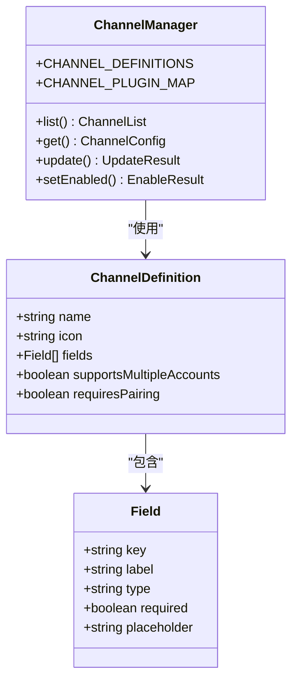
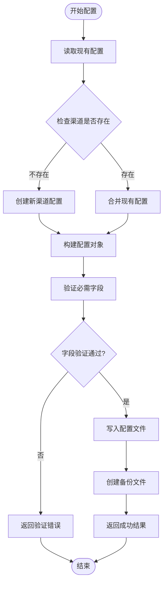
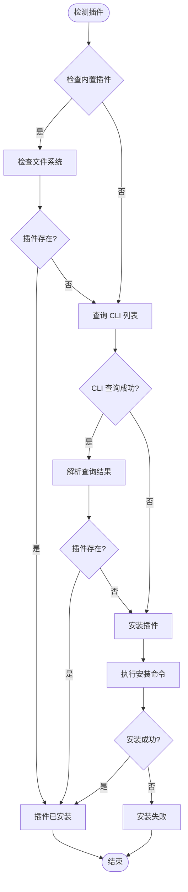
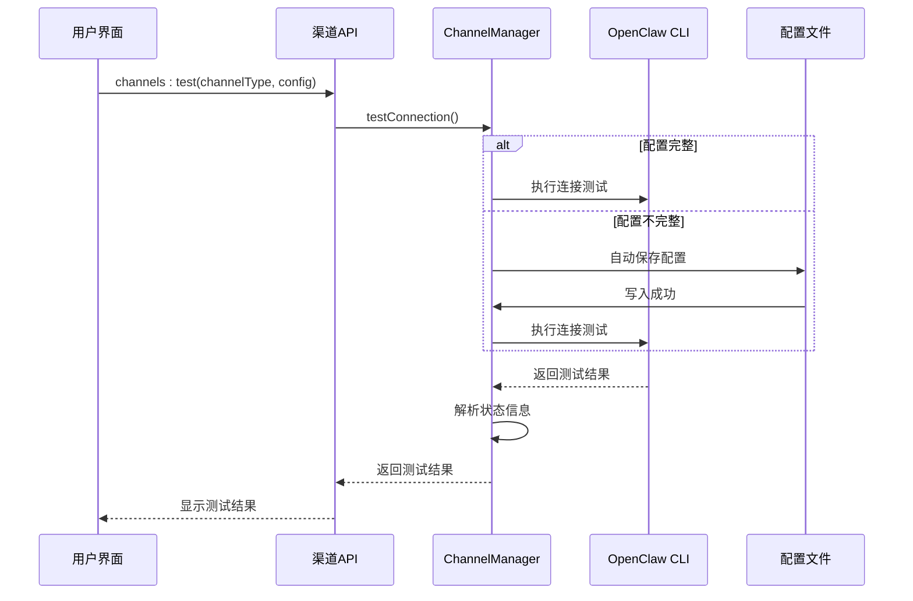
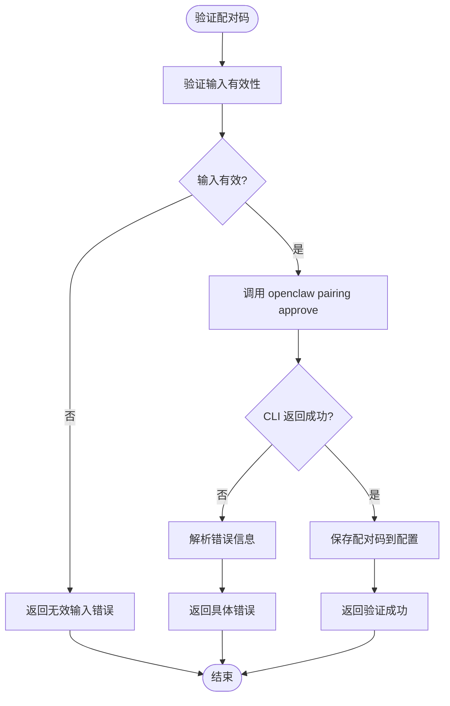
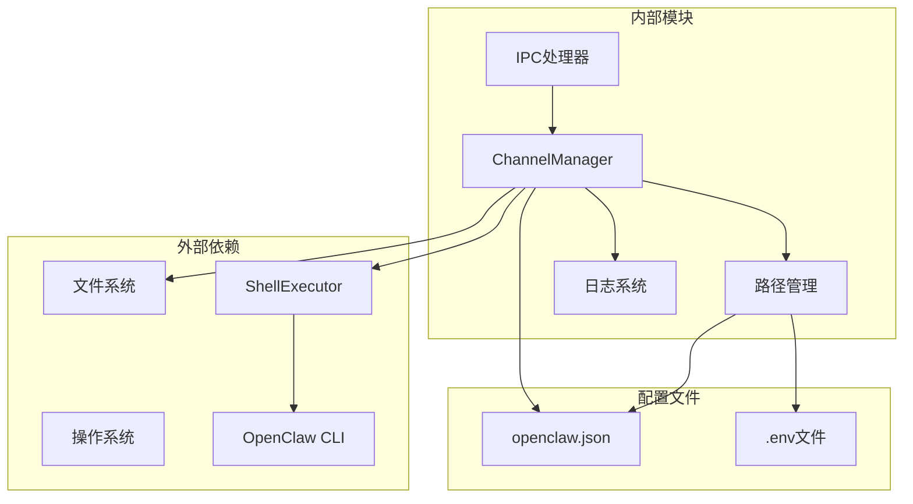

# 渠道管理接口

<cite>
**本文档引用的文件**
- [ipc-handlers.js](file://src/main/ipc-handlers.js)
- [channel-manager.js](file://src/main/services/channel-manager.js)
- [tab-channels.js](file://src/renderer/js/dashboard/tab-channels.js)
- [paths.js](file://src/main/utils/paths.js)
- [i18n.js](file://src/renderer/js/utils/i18n.js)
</cite>

## 目录
1. [简介](#简介)
2. [项目结构](#项目结构)
3. [核心组件](#核心组件)
4. [架构概览](#架构概览)
5. [详细组件分析](#详细组件分析)
6. [依赖关系分析](#依赖关系分析)
7. [性能考虑](#性能考虑)
8. [故障排除指南](#故障排除指南)
9. [结论](#结论)

## 简介

渠道管理 IPC 接口是 OpenClaw 项目中用于管理即时通讯渠道的核心组件。该接口提供了完整的渠道生命周期管理功能，包括渠道配置、连接测试、配对码验证、插件安装等操作。本文档详细说明了 channels:list、channels:get、channels:update、channels:set-enabled、channels:test、channels:verify-pairing、channels:definitions 等接口的实现细节和使用方法。

## 项目结构

渠道管理功能主要分布在以下文件中：

**图表来源**
- [ipc-handlers.js:597-624](file://src/main/ipc-handlers.js#L597-L624)
- [channel-manager.js:8-747](file://src/main/services/channel-manager.js#L8-L747)

**章节来源**
- [ipc-handlers.js:1-816](file://src/main/ipc-handlers.js#L1-L816)
- [channel-manager.js:1-747](file://src/main/services/channel-manager.js#L1-L747)

## 核心组件

### ChannelManager 类

ChannelManager 是渠道管理的核心类，负责所有渠道相关的操作。它包含了渠道定义、配置管理、插件安装等功能。

#### 主要特性
- **渠道定义管理**: 统一管理所有支持的渠道类型及其配置字段
- **配置持久化**: 自动读取和写入渠道配置到 openclaw.json 文件
- **插件生命周期**: 管理渠道插件的安装、检测和更新
- **连接测试**: 提供渠道连通性测试功能
- **配对码验证**: 支持飞书等需要配对码的渠道

**章节来源**
- [channel-manager.js:8-747](file://src/main/services/channel-manager.js#L8-L747)

### IPC 处理器

主进程中的 IPC 处理器提供了七个主要的渠道管理接口：

| 接口名称 | 功能描述 | 参数 |
|---------|----------|------|
| channels:list | 获取所有渠道配置 | 无 |
| channels:get | 获取单个渠道配置 | channelType |
| channels:update | 更新渠道配置 | channelType, config |
| channels:set-enabled | 设置渠道启用状态 | channelType, enabled |
| channels:test | 测试渠道连接 | channelType, config |
| channels:verify-pairing | 验证配对码 | channelType, pairingCode |
| channels:definitions | 获取渠道定义 | 无 |

**章节来源**
- [ipc-handlers.js:597-624](file://src/main/ipc-handlers.js#L597-L624)

## 架构概览

渠道管理系统的整体架构采用分层设计：

**图表来源**
- [ipc-handlers.js:597-624](file://src/main/ipc-handlers.js#L597-L624)
- [channel-manager.js:115-240](file://src/main/services/channel-manager.js#L115-L240)

## 详细组件分析

### 渠道定义系统

渠道定义系统提供了标准化的渠道配置模板，确保不同渠道具有一致的配置界面和验证逻辑。

#### 渠道类型定义

**图表来源**
- [channel-manager.js:12-72](file://src/main/services/channel-manager.js#L12-L72)

#### 支持的渠道类型

目前系统支持四种即时通讯渠道：

| 渠道类型 | 名称 | 多账户支持 | 配对码需求 | 必需字段 |
|---------|------|------------|------------|----------|
| feishu | 飞书 | ✅ | ✅ | appId, appSecret, pairingCode |
| dingtalk | 钉钉 | ❌ | ❌ | appKey, appSecret |
| qq | QQ | ❌ | ❌ | appId, token |
| wechat | 企业微信 | ❌ | ❌ | corpId, corpSecret |

**章节来源**
- [channel-manager.js:12-51](file://src/main/services/channel-manager.js#L12-L51)

### 配置管理机制

渠道配置采用 JSON 格式存储在 openclaw.json 文件中，具有以下特点：

#### 配置结构

**图表来源**
- [channel-manager.js:178-240](file://src/main/services/channel-manager.js#L178-L240)

**章节来源**
- [channel-manager.js:75-110](file://src/main/services/channel-manager.js#L75-L110)

### 插件管理系统

渠道插件系统实现了自动化的插件检测和安装功能：

#### 插件检测流程

**图表来源**
- [channel-manager.js:311-351](file://src/main/services/channel-manager.js#L311-L351)

**章节来源**
- [channel-manager.js:311-471](file://src/main/services/channel-manager.js#L311-L471)

### 连接测试机制

连接测试功能提供了自动化的渠道连通性验证：

#### 测试流程

**图表来源**
- [channel-manager.js:484-596](file://src/main/services/channel-manager.js#L484-L596)

**章节来源**
- [channel-manager.js:484-596](file://src/main/services/channel-manager.js#L484-L596)

### 配对码验证系统

飞书渠道支持配对码验证功能，确保机器人能够正常工作：

#### 验证流程

**图表来源**
- [channel-manager.js:603-653](file://src/main/services/channel-manager.js#L603-L653)

**章节来源**
- [channel-manager.js:603-653](file://src/main/services/channel-manager.js#L603-L653)

## 依赖关系分析

渠道管理系统的依赖关系如下：

**图表来源**
- [channel-manager.js:1-7](file://src/main/services/channel-manager.js#L1-L7)
- [paths.js:8-12](file://src/main/utils/paths.js#L8-L12)

**章节来源**
- [channel-manager.js:1-7](file://src/main/services/channel-manager.js#L1-L7)
- [paths.js:1-124](file://src/main/utils/paths.js#L1-L124)

## 性能考虑

### 异步操作优化

渠道管理接口采用了异步处理模式，避免阻塞主线程：

- **配置读写**: 使用异步文件操作，支持并发访问
- **插件安装**: 通过 ShellExecutor 异步执行命令
- **连接测试**: 设置超时机制，防止长时间阻塞

### 缓存策略

- **渠道定义缓存**: 渠道定义在内存中缓存，避免重复读取
- **插件状态缓存**: 插件安装状态进行短期缓存
- **配置备份**: 自动创建配置备份，支持快速回滚

### 错误处理机制

系统实现了多层次的错误处理：

- **输入验证**: 在处理前验证所有输入参数
- **异常捕获**: 使用 try-catch 捕获所有可能的异常
- **降级处理**: 在部分功能失败时提供降级方案
- **日志记录**: 详细的错误日志便于问题排查

## 故障排除指南

### 常见问题及解决方案

#### 渠道无法启用

**症状**: 启用渠道时报插件安装失败

**原因分析**:
1. 网络连接问题导致插件下载失败
2. npm 源配置问题
3. 权限不足无法写入系统目录

**解决步骤**:
1. 检查网络连接状态
2. 切换到稳定的 npm 镜像源
3. 以管理员权限运行应用
4. 手动执行 `openclaw skills install <plugin-id>`

#### 连接测试失败

**症状**: channels:test 接口返回连接失败

**排查步骤**:
1. 验证必需字段是否完整填写
2. 检查 API 密钥的有效性
3. 确认网络连接正常
4. 查看详细错误信息

#### 配对码验证失败

**症状**: 飞书配对码验证总是失败

**可能原因**:
1. 配对码已过期
2. 机器人未正确接收配对码
3. 系统时间不同步

**解决方法**:
1. 重新获取最新的配对码
2. 确保机器人在线状态
3. 同步系统时间

**章节来源**
- [channel-manager.js:503-510](file://src/main/services/channel-manager.js#L503-L510)
- [channel-manager.js:641-648](file://src/main/services/channel-manager.js#L641-L648)

### 调试技巧

#### 日志分析

系统提供了详细的日志记录功能：

- **调试模式**: 启用详细日志输出
- **错误追踪**: 记录完整的错误堆栈
- **性能监控**: 监控关键操作的执行时间

#### 配置验证

- **字段验证**: 实时验证配置字段的完整性
- **格式检查**: 检查配置格式的正确性
- **依赖检查**: 验证插件依赖关系

## 结论

渠道管理 IPC 接口提供了完整的即时通讯渠道管理解决方案。通过标准化的渠道定义、自动化的插件管理、可靠的连接测试和完善的错误处理机制，系统能够满足各种渠道管理需求。

### 主要优势

1. **标准化接口**: 统一的 IPC 接口设计，便于集成和扩展
2. **自动化程度高**: 插件安装、配置验证、连接测试等操作自动化
3. **错误处理完善**: 多层次的错误处理和降级机制
4. **用户体验友好**: 直观的配置界面和实时反馈

### 扩展建议

1. **支持更多渠道**: 可以轻松添加新的即时通讯渠道
2. **增强配置验证**: 添加更复杂的配置验证规则
3. **改进错误提示**: 提供更具体的错误信息和解决方案
4. **性能优化**: 进一步优化大配置文件的处理性能

该接口设计充分考虑了实际使用场景，为开发者提供了强大而易用的渠道管理能力。