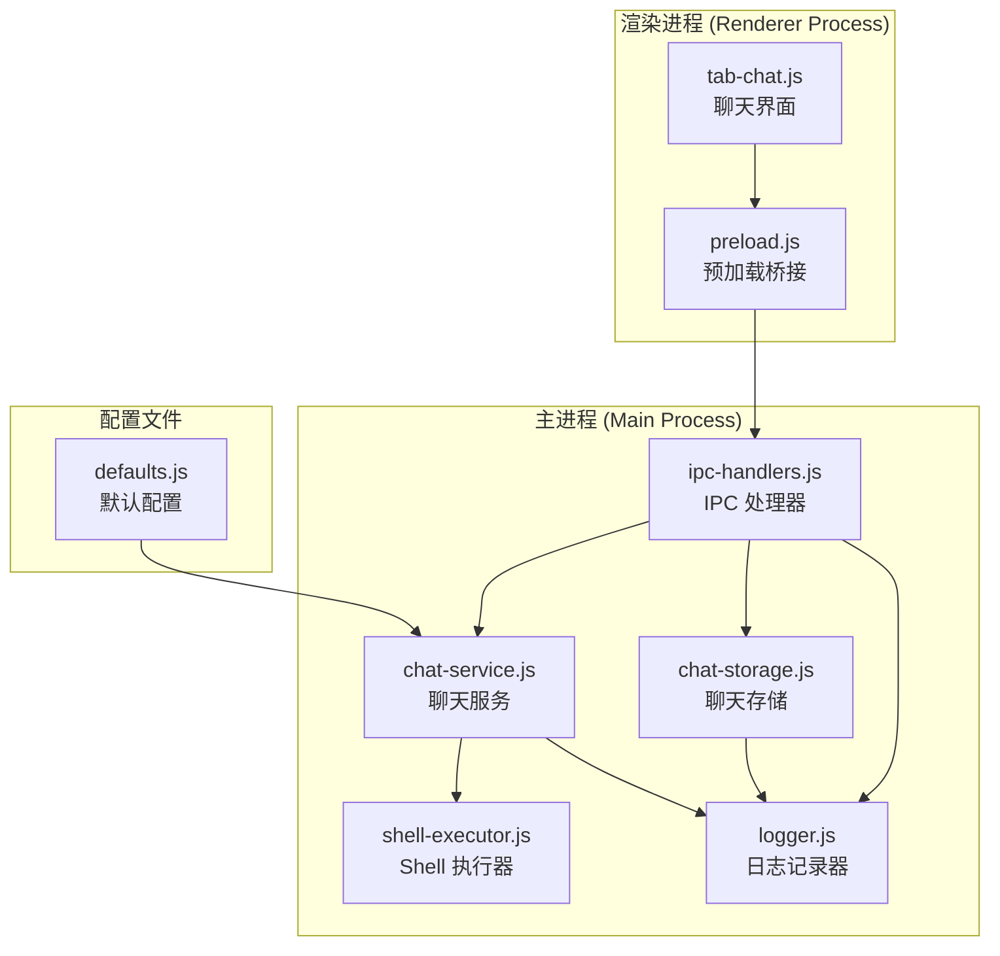
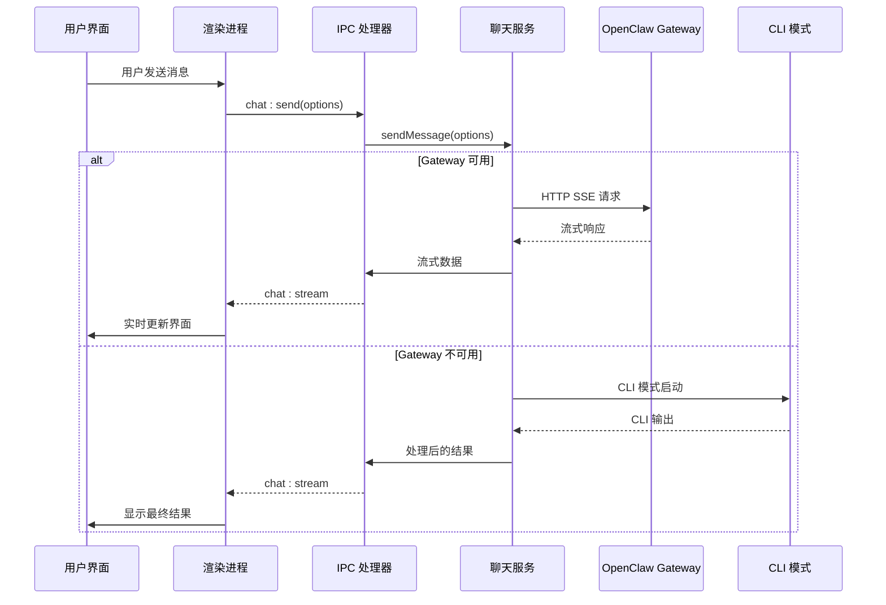
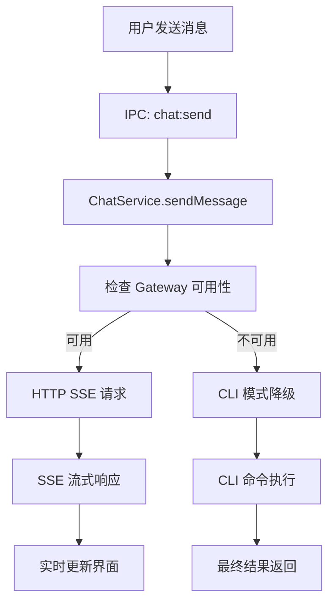
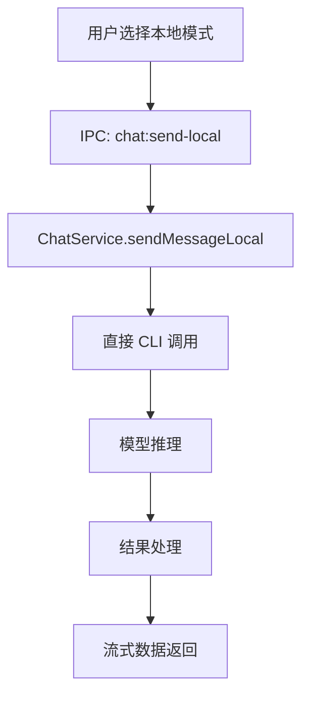
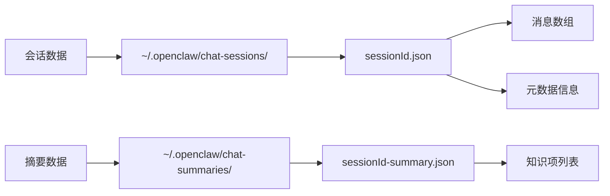
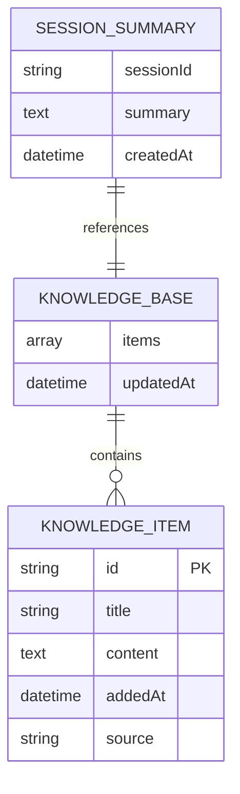
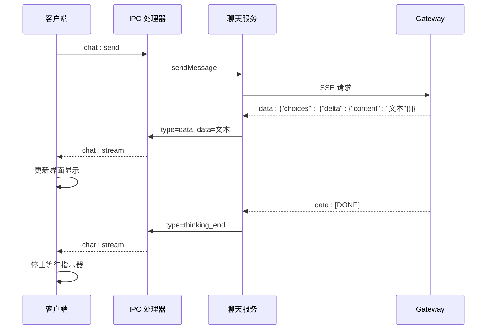
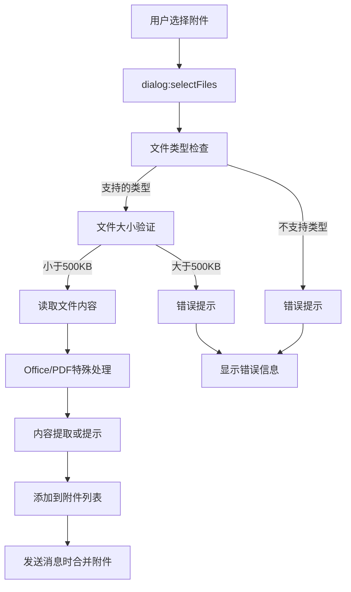
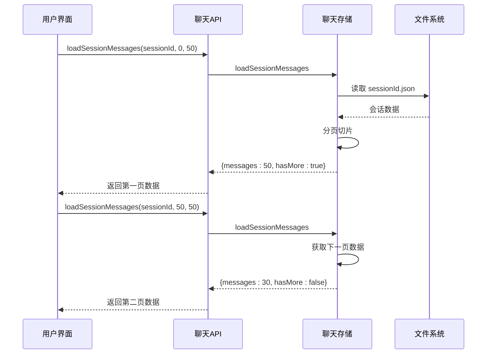
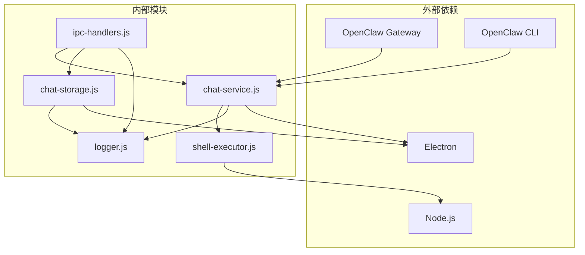

# 聊天通信接口

<cite>
**本文档引用的文件**
- [ipc-handlers.js](file://src/main/ipc-handlers.js)
- [chat-service.js](file://src/main/services/chat-service.js)
- [chat-storage.js](file://src/main/services/chat-storage.js)
- [preload.js](file://src/main/preload.js)
- [tab-chat.js](file://src/renderer/js/dashboard/tab-chat.js)
- [shell-executor.js](file://src/main/utils/shell-executor.js)
- [logger.js](file://src/main/utils/logger.js)
- [defaults.js](file://src/main/config/defaults.js)
</cite>

## 目录
1. [简介](#简介)
2. [项目结构](#项目结构)
3. [核心组件](#核心组件)
4. [架构概览](#架构概览)
5. [详细组件分析](#详细组件分析)
6. [依赖关系分析](#依赖关系分析)
7. [性能考虑](#性能考虑)
8. [故障排除指南](#故障排除指南)
9. [结论](#结论)

## 简介

本文档详细介绍了 OpenClaw 项目中的聊天通信 IPC 接口系统。该系统提供了完整的 AI 聊天功能，包括消息发送、会话管理、知识库功能等。系统采用 Electron IPC 机制，在主进程和渲染进程之间建立高效的通信通道。

主要特性包括：
- 真流式消息响应（SSE 兼容格式）
- 本地模式和远程模式的智能切换
- 会话历史的分页加载和持久化存储
- 知识库管理和自动总结功能
- 聊天附件处理和文件上传支持

## 项目结构

聊天通信接口系统主要分布在以下目录结构中：

**图表来源**
- [ipc-handlers.js:1-816](file://src/main/ipc-handlers.js#L1-L816)
- [chat-service.js:1-1345](file://src/main/services/chat-service.js#L1-L1345)
- [chat-storage.js:1-333](file://src/main/services/chat-storage.js#L1-L333)

**章节来源**
- [ipc-handlers.js:1-816](file://src/main/ipc-handlers.js#L1-L816)
- [chat-service.js:1-1345](file://src/main/services/chat-service.js#L1-L1345)
- [chat-storage.js:1-333](file://src/main/services/chat-storage.js#L1-L333)

## 核心组件

### IPC 处理器 (IPC Handlers)

IPC 处理器是整个聊天通信系统的核心，负责在主进程和渲染进程之间建立通信桥梁。主要功能包括：

- **聊天消息处理**：`chat:send` 和 `chat:send-local` 接口
- **会话管理**：`chat:save-session`、`chat:load-session`、`chat:list-sessions` 等
- **知识库功能**：`chat:save-summary`、`chat:get-knowledge`、`chat:session-stats`
- **IM 渠道监听**：`chat:im-watch-start`、`chat:im-watch-stop`

### 聊天服务 (Chat Service)

聊天服务实现了 AI 聊天的核心逻辑，支持两种运行模式：

- **远程模式**：通过 HTTP SSE API 与 OpenClaw Gateway 通信
- **本地模式**：通过 CLI 方式直接调用模型 API

### 聊天存储 (Chat Storage)

聊天存储负责会话历史的持久化管理，提供完整的 CRUD 操作和高级功能。

**章节来源**
- [ipc-handlers.js:709-796](file://src/main/ipc-handlers.js#L709-L796)
- [chat-service.js:92-1345](file://src/main/services/chat-service.js#L92-L1345)
- [chat-storage.js:15-333](file://src/main/services/chat-storage.js#L15-L333)

## 架构概览

系统采用分层架构设计，确保各组件职责清晰、耦合度低：

**图表来源**
- [ipc-handlers.js:712-739](file://src/main/ipc-handlers.js#L712-L739)
- [chat-service.js:968-1000](file://src/main/services/chat-service.js#L968-L1000)

**章节来源**
- [ipc-handlers.js:709-812](file://src/main/ipc-handlers.js#L709-L812)
- [chat-service.js:334-536](file://src/main/services/chat-service.js#L334-L536)

## 详细组件分析

### 聊天消息发送接口

#### 远程模式发送 (`chat:send`)

远程模式通过 OpenClaw Gateway 实现真正的流式响应：

**图表来源**
- [chat-service.js:968-984](file://src/main/services/chat-service.js#L968-L984)

#### 本地模式发送 (`chat:send-local`)

本地模式绕过 Gateway，直接调用模型 API：

**图表来源**
- [chat-service.js:989-1000](file://src/main/services/chat-service.js#L989-L1000)

**章节来源**
- [ipc-handlers.js:712-739](file://src/main/ipc-handlers.js#L712-L739)
- [chat-service.js:968-1000](file://src/main/services/chat-service.js#L968-L1000)

### 会话管理系统

#### 会话存储接口

会话管理提供了完整的生命周期管理：

| 接口名称 | 功能描述 | 参数 | 返回值 |
|---------|----------|------|--------|
| `chat:save-session` | 保存会话 | sessionId, messages, metadata | {success: boolean} |
| `chat:load-session` | 加载完整会话 | sessionId | {success: boolean, session: Session} |
| `chat:load-session-messages` | 分页加载消息 | sessionId, offset, limit | {success: boolean, session: Session, hasMore: boolean} |
| `chat:list-sessions` | 获取最近会话列表 | limit | {success: boolean, sessions: SessionInfo[]} |
| `chat:delete-session` | 删除会话 | sessionId | {success: boolean} |

#### 会话存储实现

会话数据采用 JSON 格式存储在用户主目录的 `.openclaw` 目录中：

**图表来源**
- [chat-storage.js:15-36](file://src/main/services/chat-storage.js#L15-L36)

**章节来源**
- [ipc-handlers.js:758-781](file://src/main/ipc-handlers.js#L758-L781)
- [chat-storage.js:51-128](file://src/main/services/chat-storage.js#L51-L128)

### 知识库功能

#### 知识库管理

知识库功能支持智能对话的知识沉淀和复用：

| 接口名称 | 功能描述 | 参数 | 返回值 |
|---------|----------|------|--------|
| `chat:save-summary` | 保存对话摘要 | sessionId, summary, knowledgeItems | {success: boolean} |
| `chat:get-knowledge` | 获取知识库 | 无 | {success: boolean, items: KnowledgeItem[]} |
| `chat:session-stats` | 获取会话统计 | sessionId | {success: boolean, stats: Stats} |

#### 知识库数据结构

**图表来源**
- [chat-storage.js:199-270](file://src/main/services/chat-storage.js#L199-L270)

**章节来源**
- [ipc-handlers.js:783-796](file://src/main/ipc-handlers.js#L783-L796)
- [chat-storage.js:199-300](file://src/main/services/chat-storage.js#L199-L300)

### 流式响应机制

系统实现了完整的流式响应机制，支持实时消息传输：

**图表来源**
- [ipc-handlers.js:716-718](file://src/main/ipc-handlers.js#L716-L718)
- [chat-service.js:458-492](file://src/main/services/chat-service.js#L458-L492)

**章节来源**
- [ipc-handlers.js:712-725](file://src/main/ipc-handlers.js#L712-L725)
- [chat-service.js:347-536](file://src/main/services/chat-service.js#L347-L536)

### 本地模式与远程模式对比

| 特性 | 远程模式 (Gateway) | 本地模式 (CLI) |
|------|-------------------|----------------|
| **响应速度** | 快速 (SSE 流式) | 较慢 (CLI 启动) |
| **稳定性** | 高 (网络优化) | 中等 (依赖本地环境) |
| **功能完整性** | 完整 (支持所有功能) | 基础 (核心聊天功能) |
| **部署复杂度** | 中等 (需要 Gateway) | 低 (直接运行) |
| **网络要求** | 需要网络连接 | 无网络要求 |
| **超时设置** | 2分钟 | 5分钟 |

**章节来源**
- [chat-service.js:14-116](file://src/main/services/chat-service.js#L14-L116)
- [defaults.js:34-70](file://src/main/config/defaults.js#L34-L70)

### 聊天附件处理

系统支持多种类型的文件附件，提供完整的文件处理流程：

**图表来源**
- [ipc-handlers.js:472-522](file://src/main/ipc-handlers.js#L472-L522)

**章节来源**
- [ipc-handlers.js:472-522](file://src/main/ipc-handlers.js#L472-L522)
- [tab-chat.js:1015-1030](file://src/renderer/js/dashboard/tab-chat.js#L1015-L1030)

### 会话历史分页加载

系统实现了高效的会话历史分页加载机制：

**图表来源**
- [chat-storage.js:98-128](file://src/main/services/chat-storage.js#L98-L128)
- [tab-chat.js:1098-1129](file://src/renderer/js/dashboard/tab-chat.js#L1098-L1129)

**章节来源**
- [chat-storage.js:92-128](file://src/main/services/chat-storage.js#L92-L128)
- [tab-chat.js:1074-1129](file://src/renderer/js/dashboard/tab-chat.js#L1074-L1129)

## 依赖关系分析

系统采用模块化设计，各组件之间的依赖关系如下：

**图表来源**
- [ipc-handlers.js:1-25](file://src/main/ipc-handlers.js#L1-L25)
- [chat-service.js:14-21](file://src/main/services/chat-service.js#L14-L21)

**章节来源**
- [ipc-handlers.js:1-50](file://src/main/ipc-handlers.js#L1-L50)
- [chat-service.js:14-21](file://src/main/services/chat-service.js#L14-L21)

## 性能考虑

### 超时配置

系统针对不同场景设置了合理的超时配置：

| 场景 | 超时设置 | 说明 |
|------|----------|------|
| 常规请求 | 120秒 | 标准 HTTP 请求超时 |
| Gateway 探测 | 1.5秒 | 快速连接性检查 |
| CLI 聊天 | 5分钟 | 允许模型推理完成 |
| CLI 命令 | 30秒 | 标准 CLI 操作超时 |
| 长时间运行命令 | 2分钟 | 复杂任务处理 |

### 缓存策略

系统实现了多层次的缓存机制：

1. **Gateway 可用性缓存**：30秒内缓存探测结果
2. **404 端点缓存**：5分钟内缓存端点不可用状态
3. **会话锁清理**：自动清理过期的会话锁定文件

### 内存管理

- **流式处理**：避免一次性加载大量数据
- **分页加载**：限制单次加载的消息数量
- **自动清理**：定期清理过期会话和临时文件

## 故障排除指南

### 常见问题及解决方案

#### Gateway 连接问题

**症状**：消息发送超时或显示连接失败

**诊断步骤**：
1. 检查 Gateway 服务状态
2. 验证网络连接
3. 查看日志文件

**解决方案**：
- 启动 Gateway 服务
- 检查防火墙设置
- 重启应用程序

#### CLI 模式问题

**症状**：本地模式下消息发送失败

**诊断步骤**：
1. 检查 Node.js 安装
2. 验证 openclaw 模块路径
3. 查看 CLI 输出

**解决方案**：
- 重新安装 Node.js
- 重新安装 openclaw
- 检查环境变量配置

#### 会话加载问题

**症状**：会话历史无法加载或显示异常

**诊断步骤**：
1. 检查存储目录权限
2. 验证 JSON 文件格式
3. 查看文件完整性

**解决方案**：
- 修复文件权限
- 手动修复 JSON 文件
- 重建会话数据

**章节来源**
- [logger.js:57-71](file://src/main/utils/logger.js#L57-L71)
- [chat-service.js:826-963](file://src/main/services/chat-service.js#L826-L963)

## 结论

OpenClaw 的聊天通信 IPC 接口系统提供了完整、高效、稳定的 AI 聊天功能。系统采用模块化设计，支持远程和本地两种运行模式，具备完善的流式响应机制和会话管理功能。

主要优势包括：
- **高性能**：流式响应机制确保实时交互体验
- **可靠性**：智能降级机制保证服务连续性
- **可扩展性**：模块化设计便于功能扩展
- **易用性**：简洁的 API 接口降低使用门槛

未来可以考虑的功能增强：
- 更丰富的附件类型支持
- 智能缓存优化
- 多语言支持
- 更详细的错误诊断信息