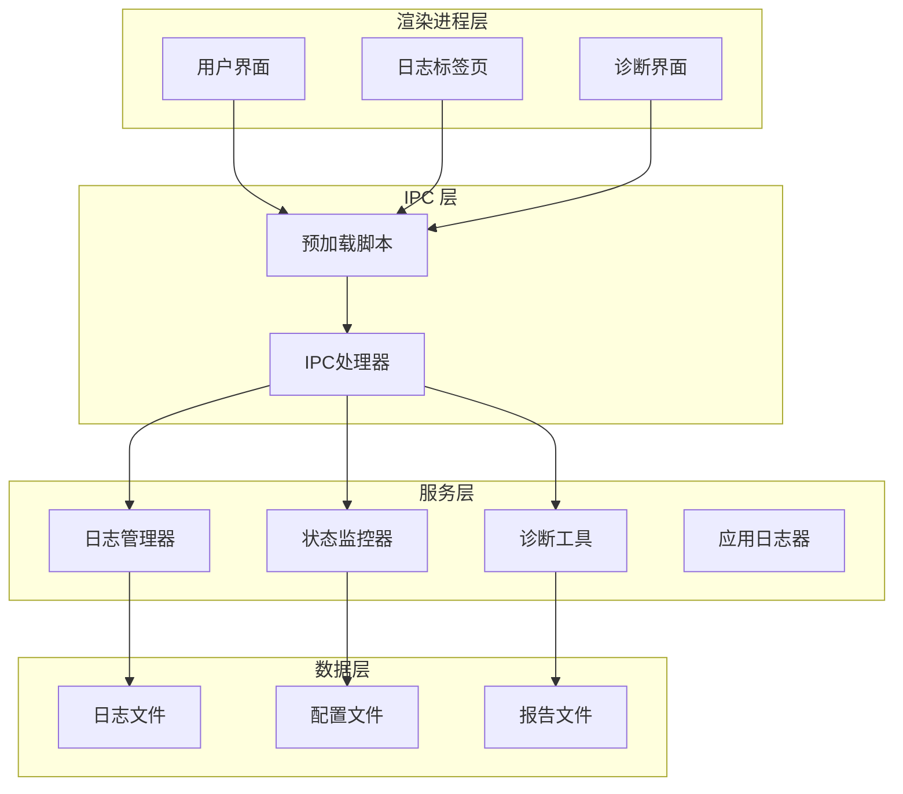
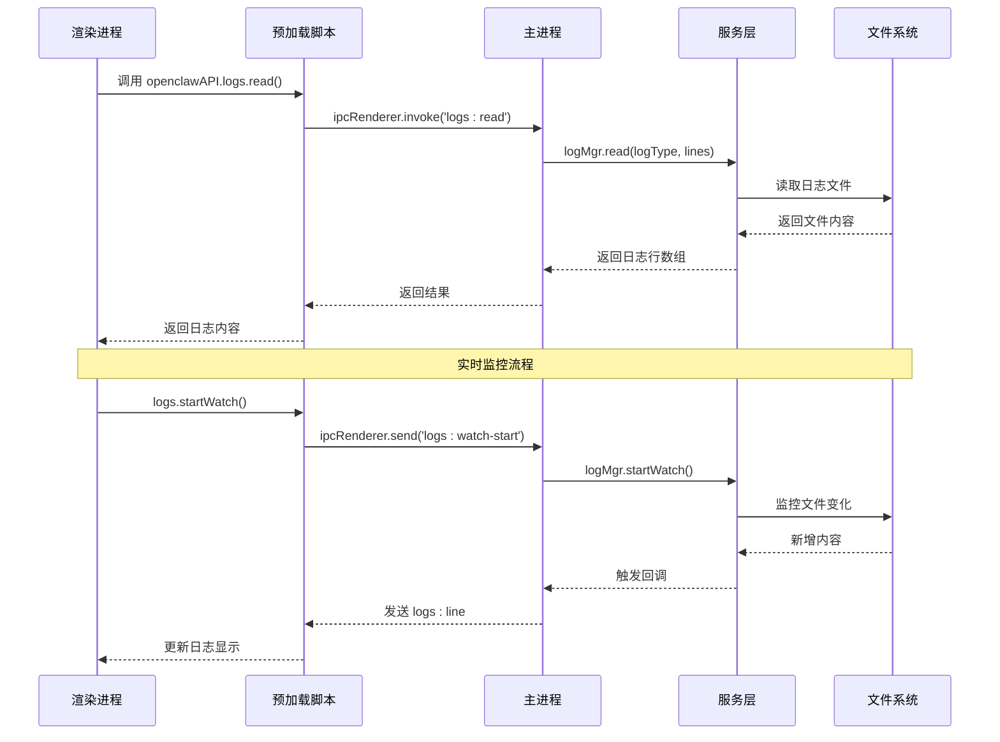
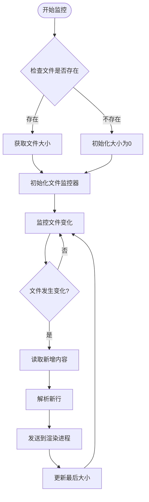
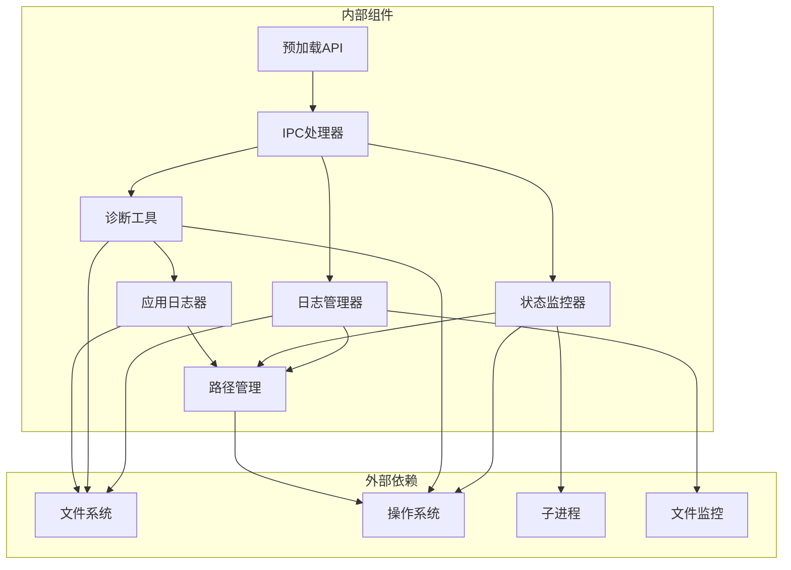

# 诊断与日志接口

<cite>
**本文档引用的文件**
- [ipc-handlers.js](file://src/main/ipc-handlers.js)
- [log-manager.js](file://src/main/services/log-manager.js)
- [diagnostics.js](file://src/main/utils/diagnostics.js)
- [status-monitor.js](file://src/main/services/status-monitor.js)
- [tab-logs.js](file://src/renderer/js/dashboard/tab-logs.js)
- [preload.js](file://src/main/preload.js)
- [logger.js](file://src/main/utils/logger.js)
- [paths.js](file://src/main/utils/paths.js)
</cite>

## 目录
1. [简介](#简介)
2. [项目结构](#项目结构)
3. [核心组件](#核心组件)
4. [架构概览](#架构概览)
5. [详细组件分析](#详细组件分析)
6. [依赖关系分析](#依赖关系分析)
7. [性能考虑](#性能考虑)
8. [故障排除指南](#故障排除指南)
9. [结论](#结论)

## 简介

本文档详细介绍了 OpenClaw 安装管理器中的诊断与日志 IPC 接口系统。该系统提供了完整的日志管理和诊断功能，包括日志读取、实时监控、诊断工具运行以及自动修复能力。

系统采用 Electron IPC 通信机制，在主进程中处理各种诊断和日志操作，在渲染进程中提供用户界面和交互功能。主要功能包括：
- 日志文件读取和实时监控
- 系统诊断和健康检查
- 自动修复功能
- 日志轮转和管理
- 诊断报告生成和保存

## 项目结构

系统采用模块化设计，主要分为以下几个层次：

**图表来源**
- [preload.js:1-239](file://src/main/preload.js#L1-L239)
- [ipc-handlers.js:1-816](file://src/main/ipc-handlers.js#L1-L816)

**章节来源**
- [preload.js:1-239](file://src/main/preload.js#L1-L239)
- [ipc-handlers.js:1-816](file://src/main/ipc-handlers.js#L1-L816)

## 核心组件

系统包含四个核心组件，每个组件负责特定的功能领域：

### 1. 日志管理系统 (LogManager)
负责日志文件的读取、监控和管理，支持多种日志类型的处理。

### 2. 诊断工具 (Diagnostics)
提供全面的系统健康检查功能，包括环境检测、资源检查和状态验证。

### 3. 状态监控器 (StatusMonitor)
监控 OpenClaw 服务状态，执行诊断命令和自动修复操作。

### 4. 应用日志器 (Logger)
记录安装管理器自身的运行日志，支持不同级别的日志输出。

**章节来源**
- [log-manager.js:14-169](file://src/main/services/log-manager.js#L14-L169)
- [diagnostics.js:10-196](file://src/main/utils/diagnostics.js#L10-L196)
- [status-monitor.js:9-274](file://src/main/services/status-monitor.js#L9-L274)
- [logger.js:7-75](file://src/main/utils/logger.js#L7-L75)

## 架构概览

系统采用分层架构设计，通过 IPC 通道实现进程间通信：

**图表来源**
- [preload.js:112-123](file://src/main/preload.js#L112-L123)
- [ipc-handlers.js:399-416](file://src/main/ipc-handlers.js#L399-L416)
- [log-manager.js:87-140](file://src/main/services/log-manager.js#L87-L140)

## 详细组件分析

### 日志管理器 (LogManager)

日志管理器是系统的核心组件之一，负责处理所有日志相关的操作：

#### 主要功能
- **日志读取**: 支持读取指定类型的日志文件，可限制读取的行数
- **实时监控**: 使用文件监控机制实现实时日志更新
- **日志信息查询**: 提供日志文件的基本信息，包括大小、修改时间等
- **可用日志枚举**: 自动发现和列出可用的日志文件

#### 日志类型支持
系统支持以下预定义的日志类型：
- `app`: OpenClaw 应用日志
- `gateway`: Gateway 服务日志  
- `installer`: 安装管理器日志

#### 实时监控机制

**图表来源**
- [log-manager.js:87-140](file://src/main/services/log-manager.js#L87-L140)

#### 日志读取实现
日志读取功能支持按需读取指定数量的日志行，采用高效的文件读取策略：

**章节来源**
- [log-manager.js:42-85](file://src/main/services/log-manager.js#L42-L85)
- [log-manager.js:87-140](file://src/main/services/log-manager.js#L87-L140)

### 诊断工具 (Diagnostics)

诊断工具提供全面的系统健康检查功能，包括环境检测、资源检查和状态验证：

#### 诊断范围
- **系统环境检查**: Node.js、npm、Git 版本和可用性检测
- **资源文件检查**: 安装包和资源文件的存在性验证
- **OpenClaw 状态检查**: 安装状态、版本信息和配置验证

#### 诊断报告生成
诊断工具能够生成详细的 HTML 报告，包含以下信息：
- 系统基本信息（操作系统、架构、用户目录）
- 工具链状态（Node.js、npm、Git）
- 资源文件状态（安装包、资源路径）
- OpenClaw 安装状态和配置信息
- 总结和建议

#### 报告保存机制
诊断报告自动保存到用户的主目录，文件名为 `openclaw-installer-diagnostic.txt`，便于后续分析和问题排查。

**章节来源**
- [diagnostics.js:14-44](file://src/main/utils/diagnostics.js#L14-L44)
- [diagnostics.js:151-192](file://src/main/utils/diagnostics.js#L151-L192)

### 状态监控器 (StatusMonitor)

状态监控器负责监控 OpenClaw 服务的运行状态，提供诊断和自动修复功能：

#### 诊断命令执行
状态监控器支持多种诊断命令的执行，包括：
- `openclaw doctor`: 基础诊断命令
- `openclaw config validate`: 配置验证
- `openclaw status`: 系统状态检查
- `openclaw doctor --fix`: 自动修复

#### 增强诊断流程
增强诊断功能按照特定顺序执行多个诊断步骤，并在发现问题时自动执行修复：
1. 配置验证 (`openclaw config validate`)
2. 系统状态检查 (`openclaw status`)
3. Gateway 前台运行测试
4. 自动修复 (`openclaw doctor --fix`，仅在前三个步骤失败时执行)

#### 执行模式支持
状态监控器支持两种执行模式：
- **Windows 原生模式**: 直接调用本地安装的 OpenClaw
- **WSL 模式**: 通过 WSL 环境执行命令，支持 Linux 系统

**章节来源**
- [status-monitor.js:48-130](file://src/main/services/status-monitor.js#L48-L130)
- [status-monitor.js:169-269](file://src/main/services/status-monitor.js#L169-L269)

### 应用日志器 (Logger)

应用日志器负责记录安装管理器自身的运行日志，提供统一的日志管理功能：

#### 日志级别
支持四种日志级别：
- **INFO**: 一般信息日志
- **WARN**: 警告信息日志  
- **ERROR**: 错误信息日志
- **DEBUG**: 调试信息日志

#### 日志格式
日志采用统一的时间戳格式：`YYYY-MM-DD HH:mm:ss`，并包含日志级别和消息内容。

#### 日志清理
日志器具备基本的文本清理功能，能够移除 ANSI 转义序列和控制字符，确保日志的可读性和兼容性。

**章节来源**
- [logger.js:45-71](file://src/main/utils/logger.js#L45-L71)

## 依赖关系分析

系统组件之间的依赖关系如下：

**图表来源**
- [log-manager.js:1-12](file://src/main/services/log-manager.js#L1-L12)
- [status-monitor.js:1-7](file://src/main/services/status-monitor.js#L1-L7)
- [diagnostics.js:1-5](file://src/main/utils/diagnostics.js#L1-L5)
- [logger.js:1-3](file://src/main/utils/logger.js#L1-L3)

### 组件耦合度分析

系统采用松耦合设计，各组件之间通过明确的接口进行通信：

- **日志管理器** 与 **文件系统** 的耦合度适中，通过路径管理器实现解耦
- **状态监控器** 与 **操作系统** 的耦合度较高，但通过执行模式抽象实现跨平台支持
- **诊断工具** 与 **应用日志器** 的耦合度较低，通过独立的日志文件实现分离

**章节来源**
- [paths.js:109-122](file://src/main/utils/paths.js#L109-L122)

## 性能考虑

### 日志读取优化
- **按需读取**: 支持限制读取的行数，避免大量日志数据传输
- **缓冲区管理**: 实时监控使用增量读取，只处理新增内容
- **内存管理**: 通过限制最大行数和自动清理机制防止内存泄漏

### 文件监控效率
- **轮询间隔**: 使用合理的轮询间隔平衡响应速度和 CPU 占用
- **增量更新**: 仅读取文件变化部分，避免全文件扫描
- **错误恢复**: 具备异常处理和自动恢复机制

### 诊断执行优化
- **超时控制**: 为每个诊断命令设置合理的超时时间
- **并行处理**: 支持异步执行，避免阻塞用户界面
- **资源限制**: 控制诊断过程中的资源消耗

## 故障排除指南

### 常见问题及解决方案

#### 日志文件无法读取
**症状**: 日志页面显示"文件不存在"或空白
**可能原因**:
- 日志文件尚未生成
- 权限不足
- 文件路径错误

**解决方法**:
1. 确认相关服务正在运行
2. 检查文件权限
3. 验证日志路径配置

#### 实时监控不工作
**症状**: 新的日志内容不显示
**可能原因**:
- 文件监控器异常
- 权限问题
- 文件被其他程序占用

**解决方法**:
1. 重启监控服务
2. 检查文件锁定情况
3. 重新启动应用程序

#### 诊断命令执行失败
**症状**: 诊断结果显示错误或超时
**可能原因**:
- OpenClaw 未正确安装
- 环境变量配置错误
- 权限不足

**解决方法**:
1. 检查 OpenClaw 安装状态
2. 验证环境变量设置
3. 以管理员权限运行

**章节来源**
- [log-manager.js:128-130](file://src/main/services/log-manager.js#L128-L130)
- [status-monitor.js:60-63](file://src/main/services/status-monitor.js#L60-L63)

## 结论

OpenClaw 安装管理器的诊断与日志 IPC 接口系统提供了完整、高效的问题排查和系统监控能力。系统采用模块化设计，具有良好的可维护性和扩展性。

### 主要优势
- **完整的诊断功能**: 覆盖系统环境、资源文件和 OpenClaw 状态的全面检查
- **实时日志监控**: 提供流畅的用户体验和及时的问题反馈
- **自动修复能力**: 能够自动识别和修复常见问题
- **跨平台支持**: 支持 Windows 原生和 WSL 两种执行模式
- **用户友好界面**: 提供直观的日志查看和诊断报告功能

### 技术特点
- **模块化架构**: 清晰的职责分离和接口设计
- **异步处理**: 避免阻塞用户界面，提升响应速度
- **错误处理**: 完善的异常处理和恢复机制
- **性能优化**: 针对大文件和高频更新场景的优化

该系统为 OpenClaw 安装管理器提供了强大的诊断和日志管理能力，有助于快速定位和解决问题，提升系统的稳定性和用户体验。