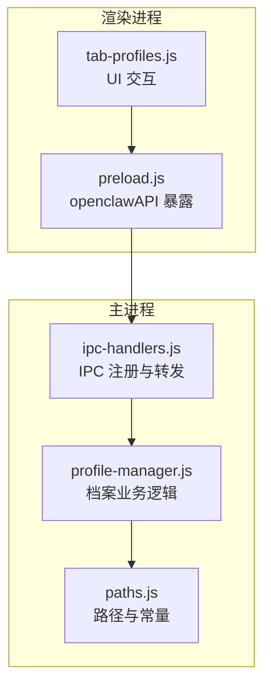
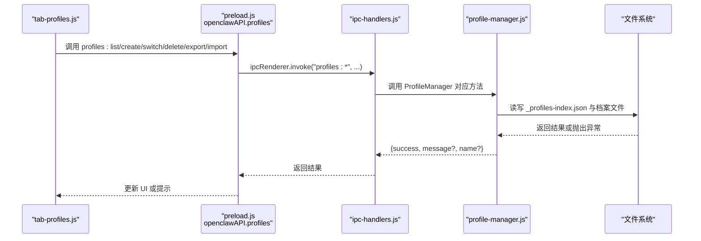
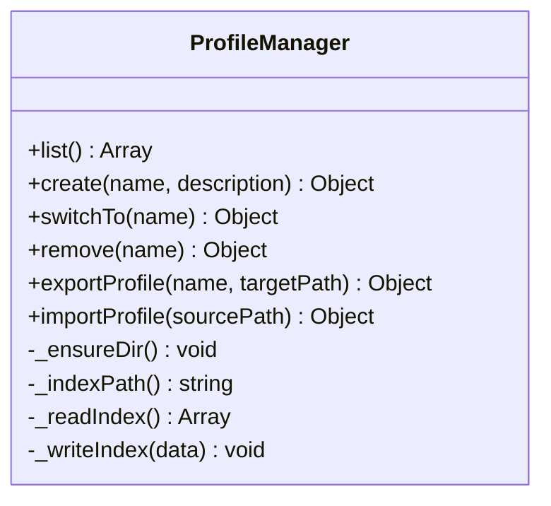
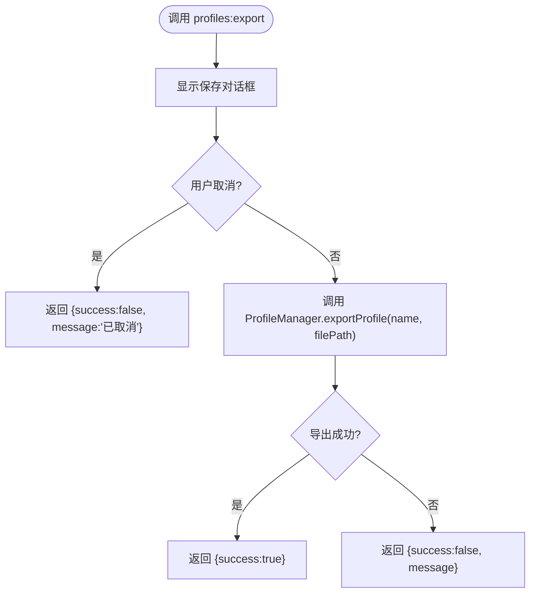
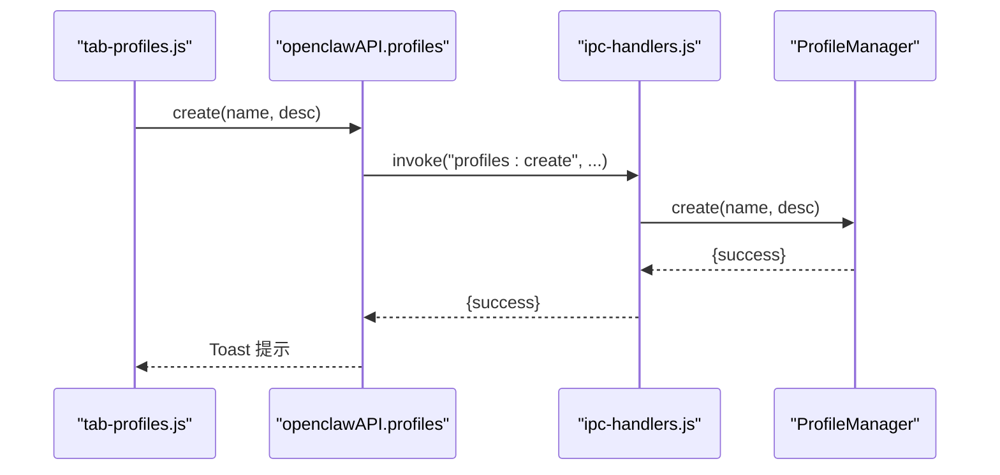
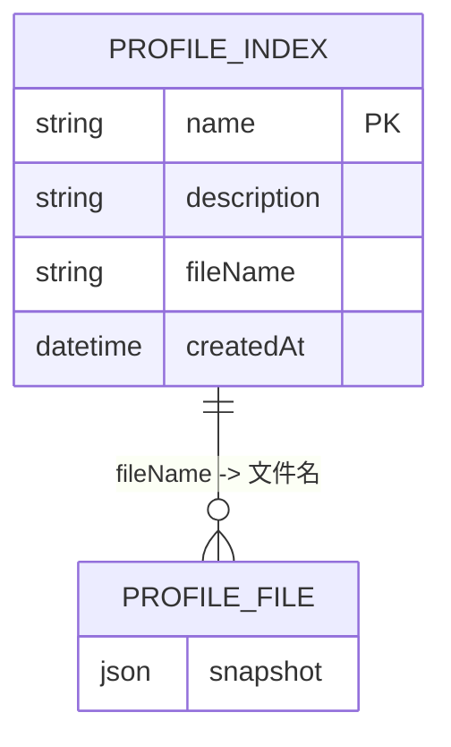
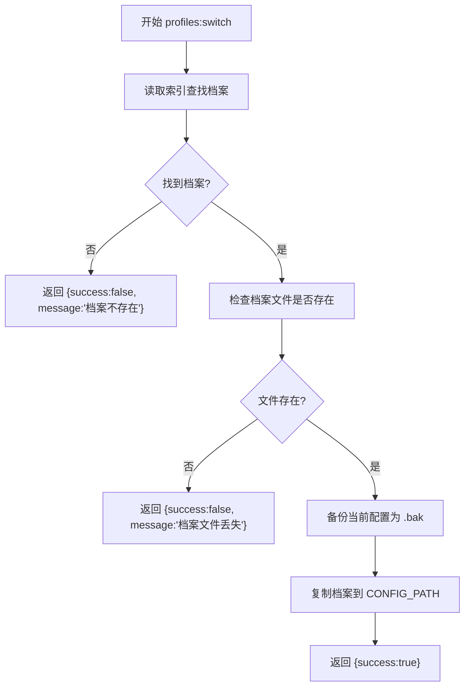
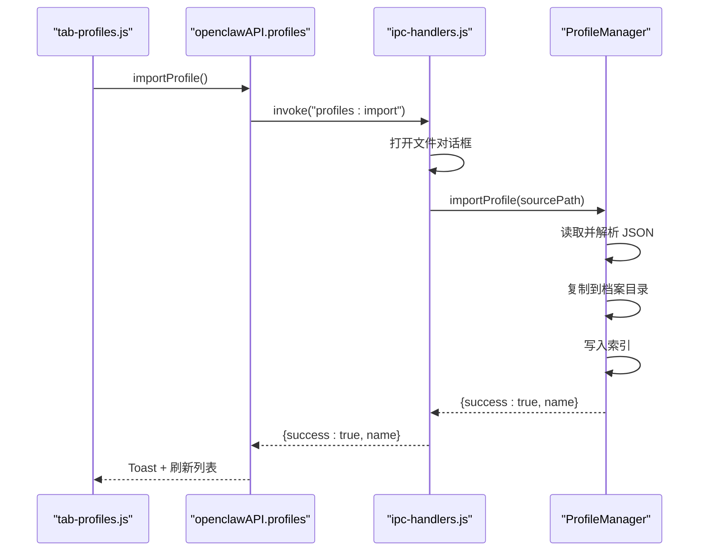

# 配置档案管理接口

<cite>
**本文档引用的文件**
- [src/main/ipc-handlers.js](file://src/main/ipc-handlers.js)
- [src/main/services/profile-manager.js](file://src/main/services/profile-manager.js)
- [src/main/utils/paths.js](file://src/main/utils/paths.js)
- [src/renderer/js/dashboard/tab-profiles.js](file://src/renderer/js/dashboard/tab-profiles.js)
- [src/main/preload.js](file://src/main/preload.js)
- [README.md](file://README.md)
</cite>

## 目录
1. [简介](#简介)
2. [项目结构](#项目结构)
3. [核心组件](#核心组件)
4. [架构总览](#架构总览)
5. [详细组件分析](#详细组件分析)
6. [依赖关系分析](#依赖关系分析)
7. [性能考虑](#性能考虑)
8. [故障排除指南](#故障排除指南)
9. [结论](#结论)
10. [附录](#附录)

## 简介
本文件面向配置档案管理的 IPC 接口，系统性说明 profiles:list、profiles:switch、profiles:create、profiles:delete、profiles:export、profiles:import 等接口的工作机制、数据结构、错误处理与最佳实践。重点涵盖：
- 档案文件的存储位置与索引结构
- 档案切换时的配置变更与状态同步
- 导入导出流程与文件格式校验
- 备份与恢复策略
- 冲突检测与解决策略

## 项目结构
配置档案管理涉及主进程服务层、IPC 注册层、渲染进程桥接层以及路径配置层，形成清晰的职责分离。

**图表来源**
- [src/renderer/js/dashboard/tab-profiles.js:1-158](file://src/renderer/js/dashboard/tab-profiles.js#L1-L158)
- [src/main/preload.js:1-239](file://src/main/preload.js#L1-L239)
- [src/main/ipc-handlers.js:418-458](file://src/main/ipc-handlers.js#L418-L458)
- [src/main/services/profile-manager.js:1-180](file://src/main/services/profile-manager.js#L1-L180)
- [src/main/utils/paths.js:1-124](file://src/main/utils/paths.js#L1-L124)

**章节来源**
- [README.md: 36-90:36-90](file://README.md#L36-L90)

## 核心组件
- ProfileManager：负责档案的创建、切换、删除、导出、导入与索引管理。
- IPC Handlers：注册 profiles:* 系列 IPC 通道，处理对话框交互与业务调用。
- Preload Bridge：在渲染进程安全暴露 openclawAPI.profiles.* 方法。
- Paths：提供配置文件路径、档案目录等常量与模式切换路径集。

**章节来源**
- [src/main/services/profile-manager.js: 6-179:6-179](file://src/main/services/profile-manager.js#L6-L179)
- [src/main/ipc-handlers.js: 418-458:418-458](file://src/main/ipc-handlers.js#L418-L458)
- [src/main/preload.js: 125-135:125-135](file://src/main/preload.js#L125-L135)
- [src/main/utils/paths.js: 8-11:8-11](file://src/main/utils/paths.js#L8-L11)

## 架构总览
profiles:* IPC 接口的调用链路如下：

**图表来源**
- [src/renderer/js/dashboard/tab-profiles.js: 30-L157:30-157](file://src/renderer/js/dashboard/tab-profiles.js#L30-L157)
- [src/main/preload.js: 125-L135:125-135](file://src/main/preload.js#L125-L135)
- [src/main/ipc-handlers.js: 418-L458:418-458](file://src/main/ipc-handlers.js#L418-L458)
- [src/main/services/profile-manager.js: 37-L176:37-176](file://src/main/services/profile-manager.js#L37-L176)

## 详细组件分析

### ProfileManager 业务逻辑
- 档案索引文件：_profiles-index.json，存放档案元数据数组。
- 档案文件：每个档案为独立 JSON 文件，命名包含安全名称与时间戳。
- 关键方法：
  - list：读取索引返回元数据数组。
  - create：复制当前配置文件为新档案，写入索引。
  - switchTo：备份当前配置，将目标档案复制回配置文件。
  - remove：删除档案文件与索引条目。
  - exportProfile：将指定档案复制到目标路径。
  - importProfile：校验 JSON 合法性，复制到档案目录并写入索引。

**图表来源**
- [src/main/services/profile-manager.js: 6-L179:6-179](file://src/main/services/profile-manager.js#L6-L179)

**章节来源**
- [src/main/services/profile-manager.js: 37-L176:37-176](file://src/main/services/profile-manager.js#L37-L176)

### IPC 注册与对话框交互
- profiles:list/switch/create/delete/export/import：通过 ipcMain.handle 注册，实现渲染进程调用。
- export：弹出保存对话框，获取目标路径后再调用导出。
- import：弹出打开对话框，选择 JSON 文件后调用导入。

**图表来源**
- [src/main/ipc-handlers.js: 435-L445:435-445](file://src/main/ipc-handlers.js#L435-L445)
- [src/main/services/profile-manager.js: 125-L145:125-145](file://src/main/services/profile-manager.js#L125-L145)

**章节来源**
- [src/main/ipc-handlers.js: 418-L458:418-458](file://src/main/ipc-handlers.js#L418-L458)

### 渲染进程桥接与 UI 行为
- openclawAPI.profiles.*：在 preload 中统一暴露，渲染进程通过 window.openclawAPI.profiles.* 调用。
- UI 行为：
  - 列表展示：调用 profiles.list，渲染卡片与操作按钮。
  - 创建：弹出模态框输入名称与描述，调用 profiles.create。
  - 切换：调用 profiles.switch，提示成功/失败。
  - 导出：调用 profiles.export，提示结果。
  - 导入：调用 profiles.import，提示结果并刷新列表。
  - 删除：确认后调用 profiles.remove，提示结果并刷新列表。

**图表来源**
- [src/renderer/js/dashboard/tab-profiles.js: 73-L97:73-97](file://src/renderer/js/dashboard/tab-profiles.js#L73-L97)
- [src/main/preload.js: 129-L132:129-132](file://src/main/preload.js#L129-L132)
- [src/main/ipc-handlers.js: 427-L429:427-429](file://src/main/ipc-handlers.js#L427-L429)
- [src/main/services/profile-manager.js: 41-L69:41-69](file://src/main/services/profile-manager.js#L41-L69)

**章节来源**
- [src/renderer/js/dashboard/tab-profiles.js: 1-L158:1-158](file://src/renderer/js/dashboard/tab-profiles.js#L1-L158)
- [src/main/preload.js: 125-L135:125-135](file://src/main/preload.js#L125-L135)

### 数据结构与文件格式规范
- 档案索引（_profiles-index.json）：数组，元素为对象，字段包括 name、description、fileName、createdAt。
- 档案文件（profile-*.json）：与当前配置文件格式一致的 JSON 结构，作为快照保存。
- 路径常量：
  - CONFIG_PATH：当前 openclaw.json 路径
  - PROFILES_DIR：档案目录（config-backups）

**图表来源**
- [src/main/services/profile-manager.js: 19-L35:19-35](file://src/main/services/profile-manager.js#L19-L35)
- [src/main/utils/paths.js: 8-L11:8-11](file://src/main/utils/paths.js#L8-L11)

**章节来源**
- [src/main/services/profile-manager.js: 54-L61:54-61](file://src/main/services/profile-manager.js#L54-L61)
- [src/main/utils/paths.js: 8-L11:8-11](file://src/main/utils/paths.js#L8-L11)

### 档案切换时的配置变更与状态同步
- 切换流程：
  - 备份当前配置：若存在配置文件，则复制为 .bak。
  - 读取目标档案文件并复制回 CONFIG_PATH。
  - 返回 {success:true}。
- 状态同步：
  - 切换成功后，应用应重新加载配置并刷新相关状态（例如服务状态、模型配置等）。
  - 若切换失败，返回 {success:false, message}，UI 展示错误提示。

**图表来源**
- [src/main/services/profile-manager.js: 71-L98:71-98](file://src/main/services/profile-manager.js#L71-L98)

**章节来源**
- [src/main/services/profile-manager.js: 71-L98:71-98](file://src/main/services/profile-manager.js#L71-L98)

### 导入导出流程与文件格式校验
- 导出：
  - 通过对话框选择保存路径，调用 ProfileManager.exportProfile(name, targetPath)。
  - 成功返回 {success:true}，失败返回 {success:false, message}。
- 导入：
  - 通过对话框选择 JSON 文件，先进行 JSON 语法校验，再复制到档案目录并写入索引。
  - 成功返回 {success:true, name}，失败返回 {success:false, message}。

**图表来源**
- [src/main/ipc-handlers.js: 447-L457:447-457](file://src/main/ipc-handlers.js#L447-L457)
- [src/main/services/profile-manager.js: 147-L176:147-176](file://src/main/services/profile-manager.js#L147-L176)

**章节来源**
- [src/main/ipc-handlers.js: 435-L457:435-457](file://src/main/ipc-handlers.js#L435-L457)
- [src/main/services/profile-manager.js: 147-L176:147-176](file://src/main/services/profile-manager.js#L147-L176)

### 备份与恢复最佳实践
- 切换前自动备份：
  - ProfileManager 在切换前自动将现有配置复制为 .bak，避免不可逆风险。
- 手动备份：
  - 通过 profiles:export 将当前档案导出为独立 JSON 文件，便于跨设备传输与版本管理。
- 恢复：
  - 使用 profiles:import 导入历史档案，随后 profiles:switch 切换至该档案。
  - 若切换失败，可从 .bak 文件恢复原始配置。

**章节来源**
- [src/main/services/profile-manager.js: 84-L90:84-90](file://src/main/services/profile-manager.js#L84-L90)

### 冲突检测与解决策略
- 名称冲突：
  - create 时对 name 进行安全字符清洗，避免非法字符导致的文件名冲突。
- 文件损坏：
  - import 前进行 JSON 语法校验；export 后由调用方确认文件存在。
- 索引不一致：
  - 若索引存在而档案文件缺失，switchTo 返回错误；可通过 profiles:list 检查并修复索引。
- 并发与并发写入：
  - 建议在 UI 层禁用重复提交，或在 ProfileManager 内部增加简单锁（当前实现未显式加锁）。

**章节来源**
- [src/main/services/profile-manager.js: 41-L69:41-69](file://src/main/services/profile-manager.js#L41-L69)
- [src/main/services/profile-manager.js: 71-L98:71-98](file://src/main/services/profile-manager.js#L71-L98)

## 依赖关系分析
- 组件耦合：
  - ipc-handlers.js 依赖 ProfileManager 与对话框 API。
  - ProfileManager 依赖 paths.js 提供的路径常量。
  - preload.js 依赖 ipcRenderer 暴露 openclawAPI。
  - tab-profiles.js 依赖 openclawAPI 与 UI 工具。
- 外部依赖：
  - Electron IPC（invoke/send）、对话框 API（dialog）。
  - Node.js fs/path 模块用于文件读写与路径拼接。

**图表来源**
- [src/renderer/js/dashboard/tab-profiles.js:1-158](file://src/renderer/js/dashboard/tab-profiles.js#L1-L158)
- [src/main/preload.js:1-239](file://src/main/preload.js#L1-L239)
- [src/main/ipc-handlers.js:418-458](file://src/main/ipc-handlers.js#L418-L458)
- [src/main/services/profile-manager.js:1-180](file://src/main/services/profile-manager.js#L1-L180)
- [src/main/utils/paths.js:1-124](file://src/main/utils/paths.js#L1-L124)

**章节来源**
- [src/main/ipc-handlers.js: 418-L458:418-458](file://src/main/ipc-handlers.js#L418-L458)
- [src/main/services/profile-manager.js: 1-L180:1-180](file://src/main/services/profile-manager.js#L1-L180)
- [src/main/utils/paths.js: 1-L124:1-124](file://src/main/utils/paths.js#L1-L124)

## 性能考虑
- I/O 模式：所有档案操作均为文件复制与 JSON 读写，I/O 成本主要取决于配置文件大小。
- 并发控制：当前实现未内置锁，建议在 UI 层避免同时发起多个 create/switch 操作。
- 大文件处理：profiles:export/import 未做分块或进度回调，建议在 UI 层提示“请稍候”。

## 故障排除指南
- “档案不存在”：检查 profiles:list 是否包含目标档案，确认索引未被手动删除。
- “档案文件丢失”：检查 PROFILES_DIR 下是否仍存在对应档案文件。
- “导入失败”：确认所选文件为合法 JSON，且与配置文件格式兼容。
- “切换失败”：查看 .bak 是否生成，必要时手动从 .bak 恢复。

**章节来源**
- [src/main/services/profile-manager.js: 75-L97:75-97](file://src/main/services/profile-manager.js#L75-L97)
- [src/main/services/profile-manager.js: 149-L175:149-175](file://src/main/services/profile-manager.js#L149-L175)

## 结论
配置档案管理接口通过清晰的 IPC 分层设计，实现了对 openclaw.json 的快照、切换、导入与导出能力。结合自动备份与严格的索引管理，能够在保证安全性的同时提供良好的用户体验。建议在生产环境中配合定期导出与 UI 并发控制，进一步提升稳定性与可靠性。

## 附录
- 接口清单与行为摘要：
  - profiles:list：返回档案元数据数组。
  - profiles:create：创建新档案并写入索引。
  - profiles:switch：备份当前配置并切换到目标档案。
  - profiles:delete：删除档案文件与索引条目。
  - profiles:export：弹出保存对话框并导出档案。
  - profiles:import：弹出打开对话框并导入档案。

**章节来源**
- [src/main/ipc-handlers.js: 418-L458:418-458](file://src/main/ipc-handlers.js#L418-L458)
- [src/main/services/profile-manager.js: 37-L176:37-176](file://src/main/services/profile-manager.js#L37-L176)