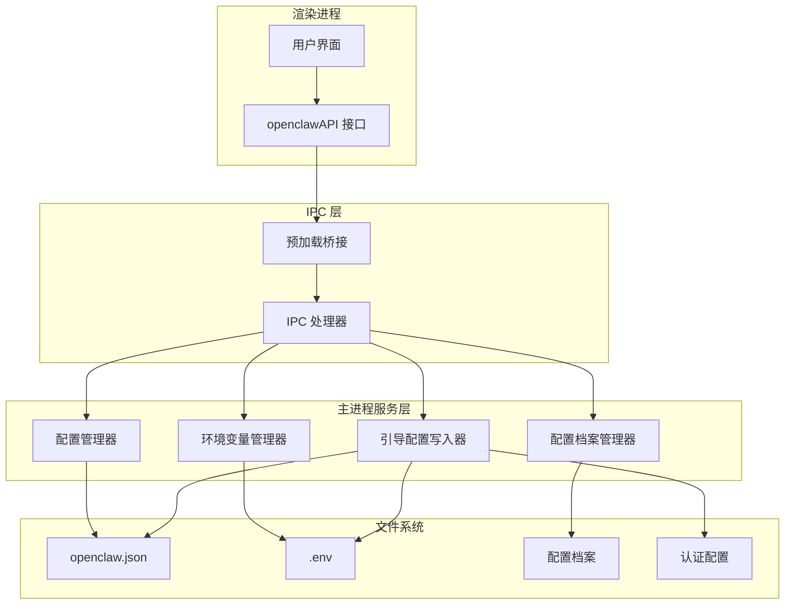
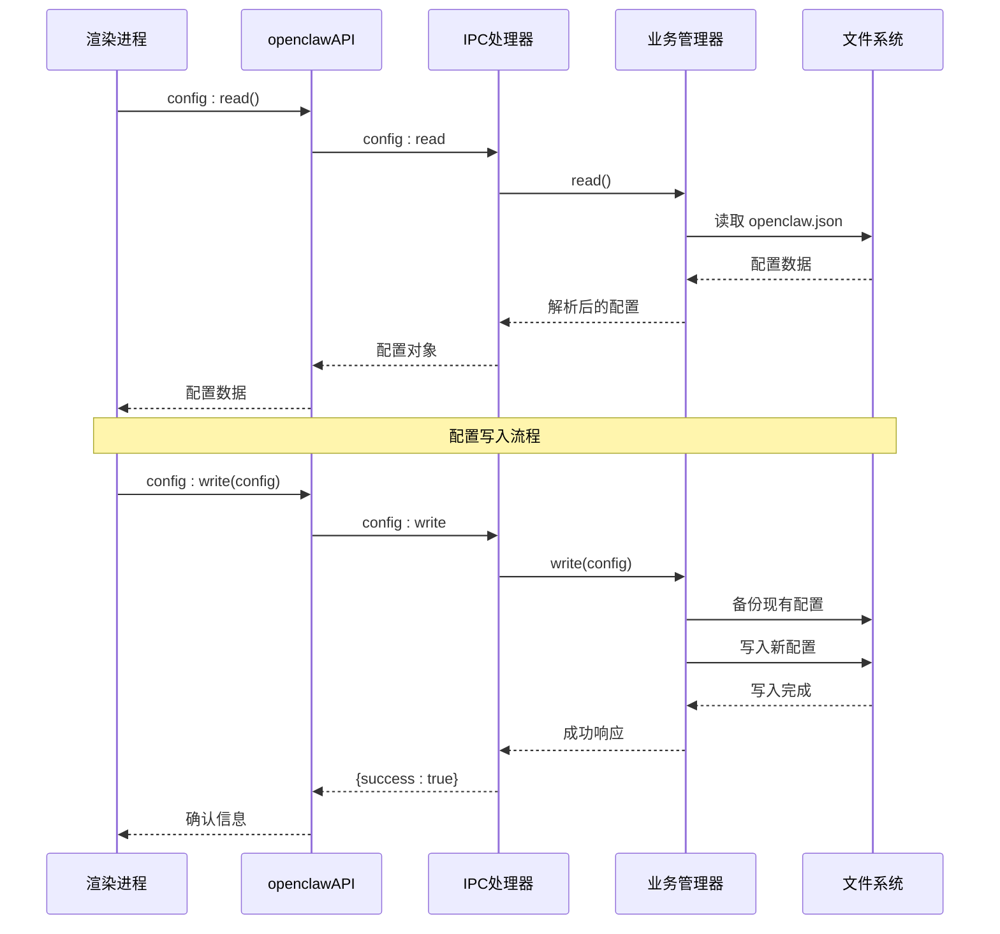
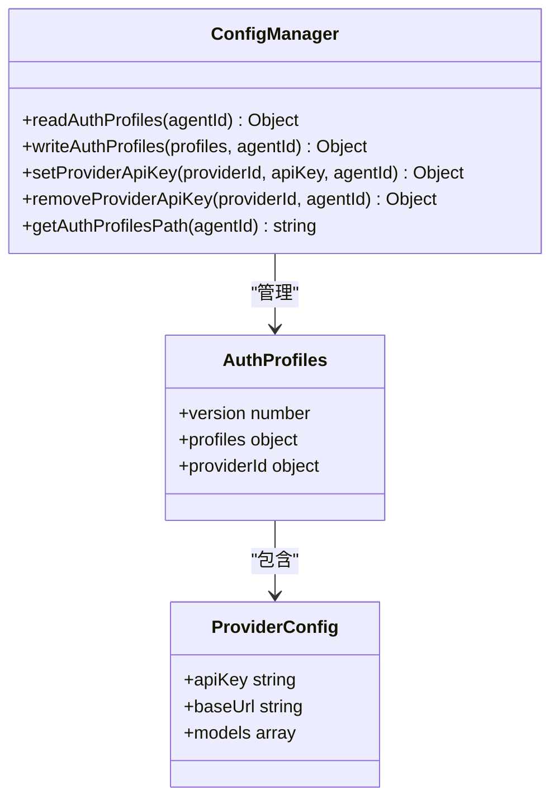
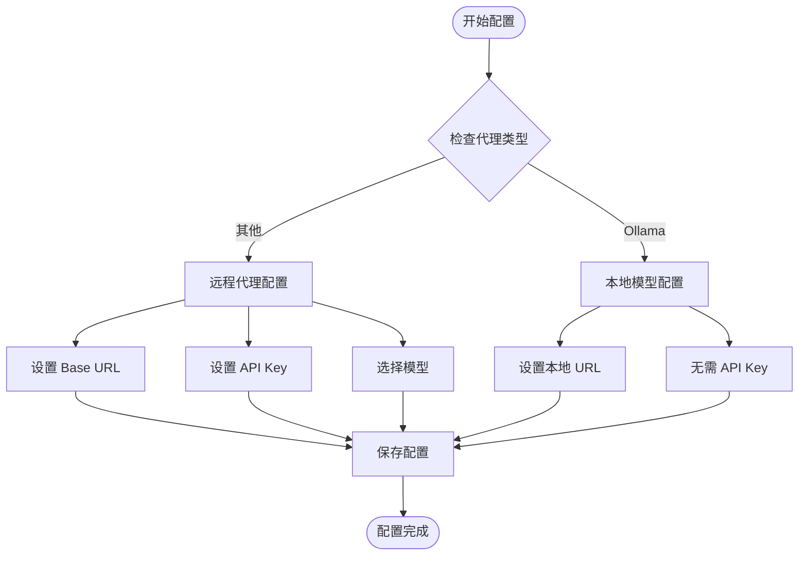
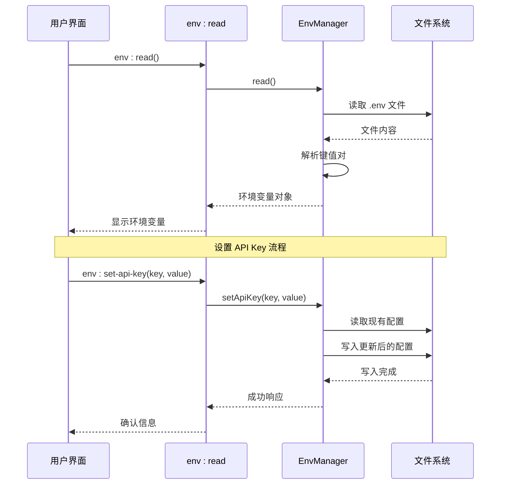
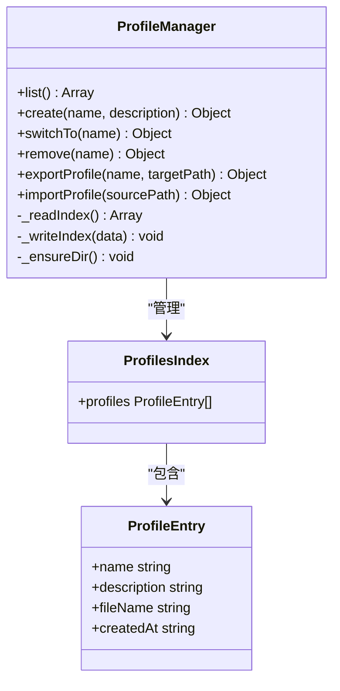
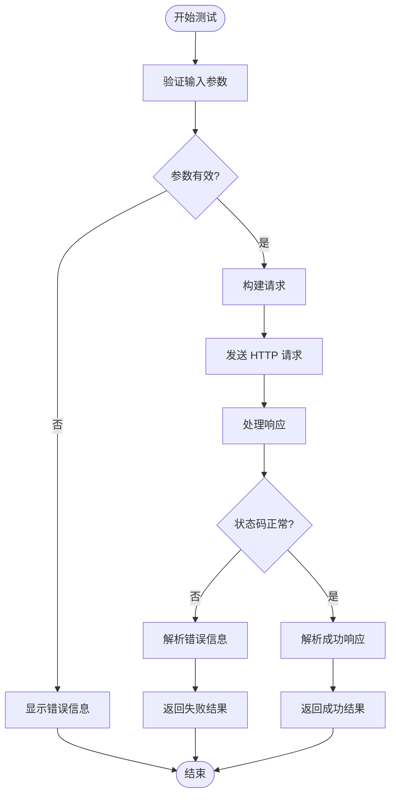
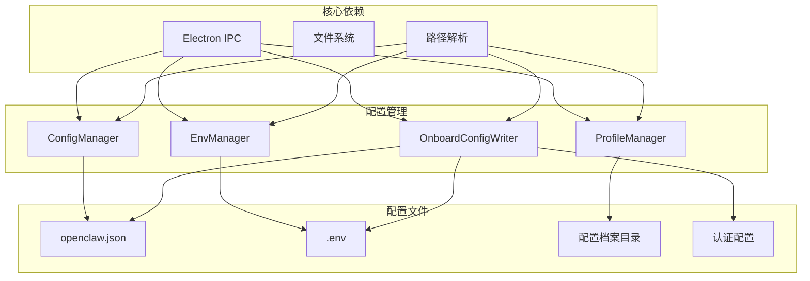
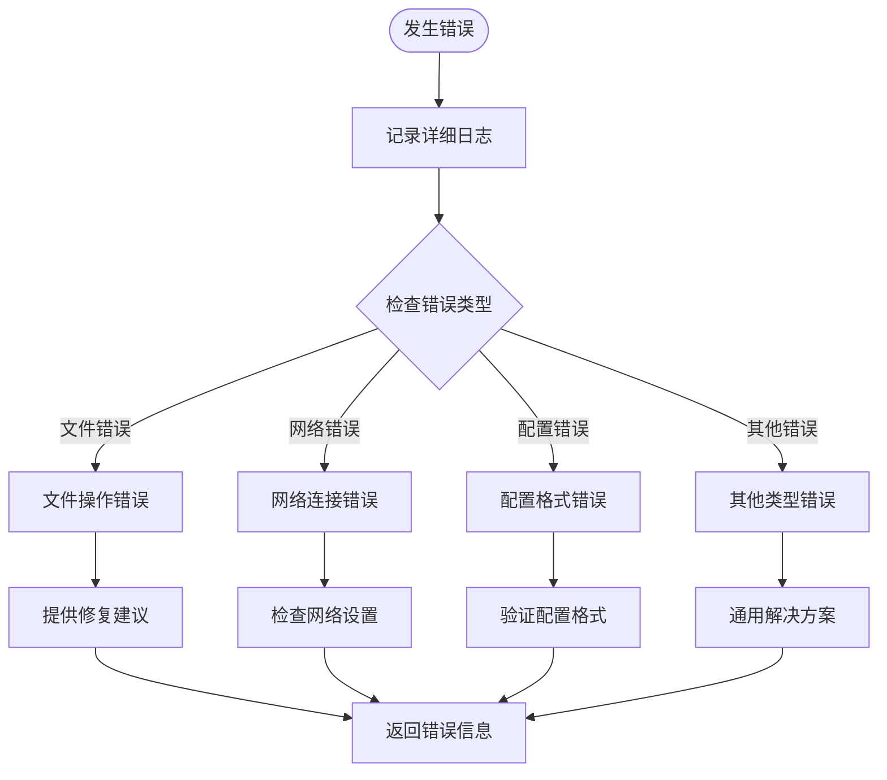

# 配置管理接口

<cite>
**本文档引用的文件**
- [ipc-handlers.js](file://src/main/ipc-handlers.js)
- [config-manager.js](file://src/main/services/config-manager.js)
- [env-manager.js](file://src/main/services/env-manager.js)
- [paths.js](file://src/main/utils/paths.js)
- [defaults.js](file://src/main/config/defaults.js)
- [preload.js](file://src/main/preload.js)
- [tab-config.js](file://src/renderer/js/dashboard/tab-config.js)
- [tab-env.js](file://src/renderer/js/dashboard/tab-env.js)
- [tab-apikeys.js](file://src/renderer/js/dashboard/tab-apikeys.js)
- [onboard-config-writer.js](file://src/main/services/onboard-config-writer.js)
- [profile-manager.js](file://src/main/services/profile-manager.js)
</cite>

## 目录
1. [简介](#简介)
2. [项目结构](#项目结构)
3. [核心组件](#核心组件)
4. [架构概览](#架构概览)
5. [详细组件分析](#详细组件分析)
6. [依赖关系分析](#依赖关系分析)
7. [性能考虑](#性能考虑)
8. [故障排除指南](#故障排除指南)
9. [结论](#结论)

## 简介

OpenClaw 配置管理 IPC 接口提供了完整的配置和环境变量管理功能，包括配置文件的读写操作、API 密钥管理、连接测试、认证配置、模型配置和代理配置管理。该接口通过 Electron 的 IPC 机制实现了主进程与渲染进程之间的安全通信。

## 项目结构

配置管理系统主要由以下层次组成：

**图表来源**
- [ipc-handlers.js:26-816](file://src/main/ipc-handlers.js#L26-L816)
- [preload.js:3-239](file://src/main/preload.js#L3-L239)

## 核心组件

### 配置管理器 (ConfigManager)

配置管理器负责处理主配置文件的读写操作，支持以下功能：

- **基础配置读写**：`config:read` 和 `config:write` 接口
- **配置路径获取**：`config:get-path` 接口
- **认证配置管理**：支持多代理的认证配置
- **模型配置管理**：支持多代理的模型配置
- **备份机制**：自动创建 .bak 备份文件

### 环境变量管理器 (EnvManager)

环境变量管理器专门处理 .env 文件的管理：

- **环境变量读取**：`env:read` 接口
- **环境变量写入**：`env:write` 接口
- **API 密钥管理**：支持单个 API Key 的设置和删除
- **解析功能**：支持注释和引号处理

### 配置档案管理器 (ProfileManager)

配置档案管理器提供配置快照和切换功能：

- **档案创建**：基于当前配置创建快照
- **档案切换**：在不同配置之间快速切换
- **档案导入导出**：支持 JSON 格式的配置传输
- **索引管理**：维护档案元数据索引

**章节来源**
- [config-manager.js:1-264](file://src/main/services/config-manager.js#L1-L264)
- [env-manager.js:1-116](file://src/main/services/env-manager.js#L1-L116)
- [profile-manager.js:1-180](file://src/main/services/profile-manager.js#L1-L180)

## 架构概览

配置管理系统的整体架构采用分层设计，确保了良好的模块化和可维护性：

**图表来源**
- [ipc-handlers.js:208-218](file://src/main/ipc-handlers.js#L208-L218)
- [config-manager.js:212-260](file://src/main/services/config-manager.js#L212-L260)

## 详细组件分析

### 配置读写接口

#### config:read 接口
- **功能**：读取完整的配置文件内容
- **返回值**：配置对象或空对象
- **错误处理**：文件不存在时返回空对象，备份文件损坏时记录错误

#### config:write 接口
- **功能**：写入配置数据到 openclaw.json
- **安全机制**：自动创建 .bak 备份文件
- **验证机制**：写入前进行 JSON 格式验证
- **目录创建**：自动创建必要的目录结构

#### config:get-path 接口
- **功能**：获取配置文件的完整路径
- **用途**：用于外部工具或脚本访问配置文件

**章节来源**
- [ipc-handlers.js:208-218](file://src/main/ipc-handlers.js#L208-L218)
- [config-manager.js:212-260](file://src/main/services/config-manager.js#L212-L260)

### 认证配置管理

认证配置管理支持多代理的 API Key 管理：

**图表来源**
- [config-manager.js:25-120](file://src/main/services/config-manager.js#L25-L120)

#### 支持的代理类型
- **Moonshot**：支持 Kimi 和 Kimi Coding
- **Qwen**：支持多种模型变体
- **DeepSeek**：支持 DeepSeek Chat
- **Minimax**：支持 MiniMax M2.1
- **GLM**：通过 Z.AI 平台访问
- **OpenAI**：标准 OpenAI API
- **Ollama**：本地模型运行

**章节来源**
- [config-manager.js:25-120](file://src/main/services/config-manager.js#L25-L120)

### 模型配置管理

模型配置管理提供了灵活的模型选择和配置功能：

**图表来源**
- [onboard-config-writer.js:13-328](file://src/main/services/onboard-config-writer.js#L13-L328)

#### 模型配置结构
- **基础信息**：模型标识符、显示名称
- **能力特性**：推理能力、输入类型、成本信息
- **技术规格**：上下文窗口大小、最大令牌数

**章节来源**
- [onboard-config-writer.js:13-328](file://src/main/services/onboard-config-writer.js#L13-L328)

### 环境变量管理

环境变量管理提供了安全的 API Key 存储和管理：

**图表来源**
- [ipc-handlers.js:322-339](file://src/main/ipc-handlers.js#L322-L339)
- [env-manager.js:10-88](file://src/main/services/env-manager.js#L10-L88)

#### 环境变量文件格式
- **键值对格式**：`KEY=VALUE`
- **注释支持**：以 `#` 开头的行作为注释
- **引号处理**：支持单引号和双引号包裹的值
- **安全性**：敏感信息以密码形式显示

**章节来源**
- [env-manager.js:10-112](file://src/main/services/env-manager.js#L10-L112)

### 配置档案管理

配置档案管理提供了完整的配置快照和切换功能：

**图表来源**
- [profile-manager.js:6-179](file://src/main/services/profile-manager.js#L6-L179)

#### 档案功能特性
- **自动备份**：切换配置时自动备份当前配置
- **索引管理**：维护档案元数据索引文件
- **导入导出**：支持 JSON 格式的配置传输
- **版本控制**：每个档案包含创建时间和描述信息

**章节来源**
- [profile-manager.js:41-179](file://src/main/services/profile-manager.js#L41-L179)

### 连接测试功能

连接测试功能允许用户验证 AI 代理的连接状态：

**图表来源**
- [ipc-handlers.js:267-320](file://src/main/ipc-handlers.js#L267-L320)

#### 测试参数
- **API Key**：代理认证密钥（可选）
- **Base URL**：代理 API 基础地址
- **模型标识符**：要测试的具体模型
- **超时设置**：30 秒请求超时

**章节来源**
- [ipc-handlers.js:267-320](file://src/main/ipc-handlers.js#L267-L320)

## 依赖关系分析

配置管理系统的关键依赖关系如下：

**图表来源**
- [paths.js:1-124](file://src/main/utils/paths.js#L1-L124)
- [defaults.js:1-180](file://src/main/config/defaults.js#L1-L180)

### 路径配置

系统支持多种执行模式的路径配置：

- **本地模式**：使用本地文件系统路径
- **WSL 模式**：使用 WSL 路径映射
- **环境变量优先**：支持通过环境变量自定义路径

**章节来源**
- [paths.js:1-124](file://src/main/utils/paths.js#L1-L124)
- [defaults.js:94-124](file://src/main/config/defaults.js#L94-L124)

## 性能考虑

配置管理系统在设计时充分考虑了性能和用户体验：

### 缓存策略
- **配置缓存**：配置文件变更后自动缓存
- **路径缓存**：路径解析结果缓存
- **代理缓存**：连接状态缓存

### 异步处理
- **非阻塞操作**：所有文件操作都是异步的
- **进度反馈**：长时间操作提供进度回调
- **超时控制**：网络请求设置合理超时

### 内存优化
- **增量更新**：只更新变更的部分
- **延迟加载**：按需加载配置文件
- **垃圾回收**：及时释放不再使用的资源

## 故障排除指南

### 常见问题及解决方案

#### 配置文件读取失败
**症状**：`config:read` 返回空对象
**原因**：
- 配置文件不存在
- 文件权限不足
- 文件格式损坏

**解决方法**：
1. 检查配置文件是否存在
2. 验证文件权限设置
3. 查看备份文件 `.bak`

#### 环境变量写入失败
**症状**：`env:write` 返回错误
**原因**：
- 目录权限不足
- 文件被其他进程占用
- 磁盘空间不足

**解决方法**：
1. 检查目标目录权限
2. 关闭可能占用文件的程序
3. 清理磁盘空间

#### 连接测试超时
**症状**：`config:test-connection` 超时
**原因**：
- 网络连接问题
- 代理服务器不可达
- API Key 无效

**解决方法**：
1. 检查网络连接状态
2. 验证代理服务器地址
3. 重新生成 API Key

### 错误处理机制

系统实现了多层次的错误处理：

**图表来源**
- [config-manager.js:34-74](file://src/main/services/config-manager.js#L34-L74)
- [env-manager.js:18-87](file://src/main/services/env-manager.js#L18-L87)

**章节来源**
- [config-manager.js:34-74](file://src/main/services/config-manager.js#L34-L74)
- [env-manager.js:18-87](file://src/main/services/env-manager.js#L18-L87)

## 结论

OpenClaw 配置管理 IPC 接口提供了完整而强大的配置管理功能，具有以下特点：

### 技术优势
- **模块化设计**：清晰的职责分离和接口定义
- **安全性保障**：自动备份、权限控制和错误处理
- **用户友好**：直观的 API 接口和错误提示
- **扩展性强**：支持新的代理类型和配置选项

### 功能完整性
- 覆盖了从基础配置到高级功能的完整配置管理需求
- 提供了完善的 API Key 管理和连接测试功能
- 支持配置快照和多环境管理
- 集成了引导配置和自动化部署功能

### 最佳实践建议
1. **定期备份**：利用自动备份功能保护重要配置
2. **验证配置**：使用连接测试功能验证配置有效性
3. **版本管理**：使用配置档案功能管理不同环境配置
4. **监控日志**：关注系统日志中的配置相关错误信息

该配置管理系统为 OpenClaw 提供了稳定可靠的配置管理基础，支持用户在不同场景下灵活地管理 AI 代理配置和相关环境变量。