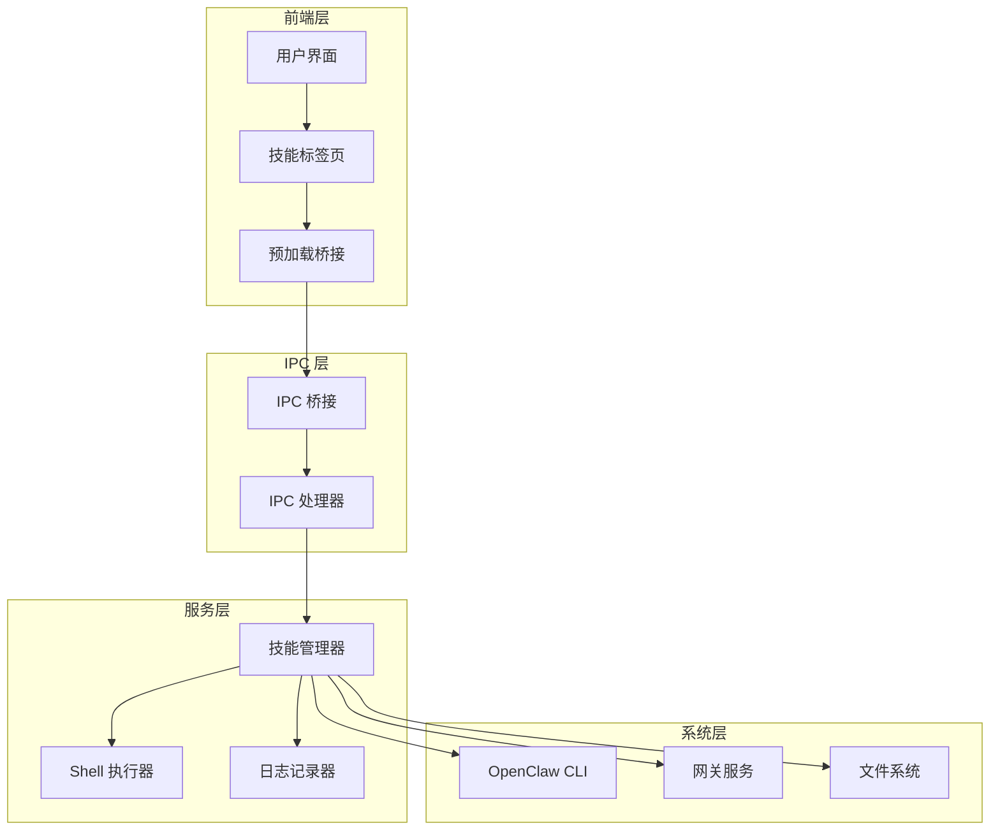
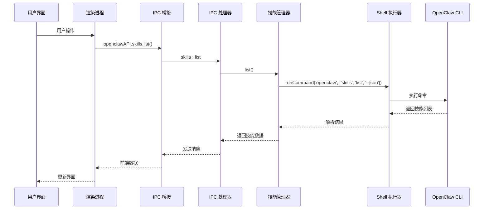
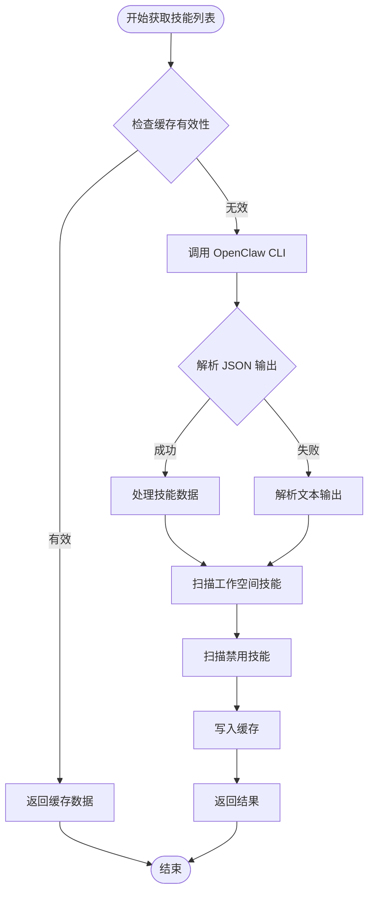
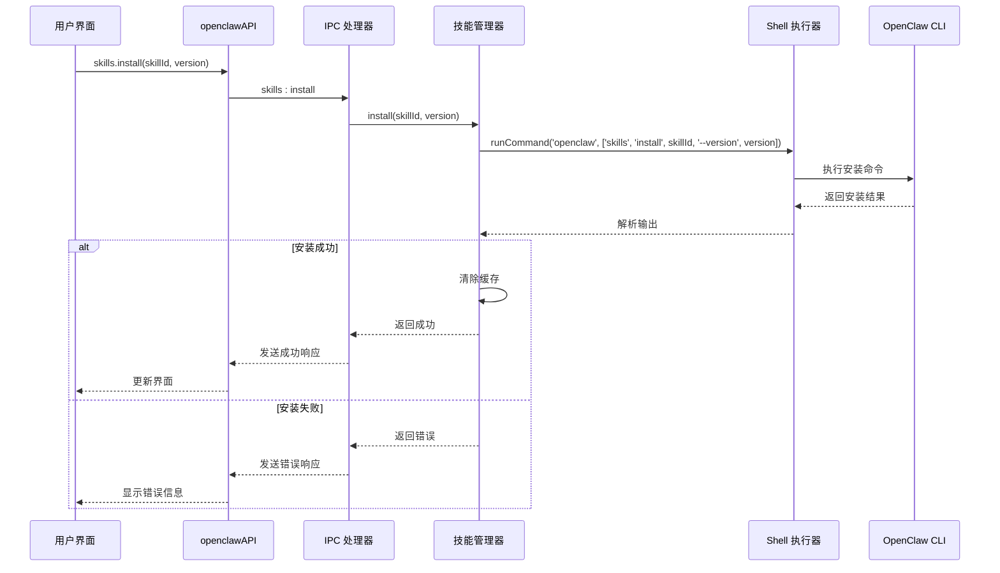
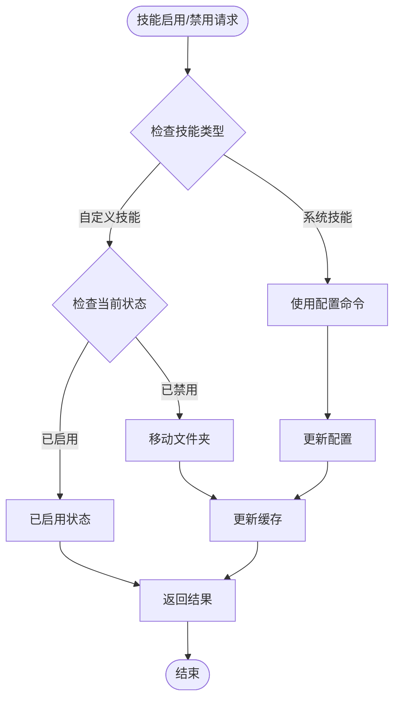
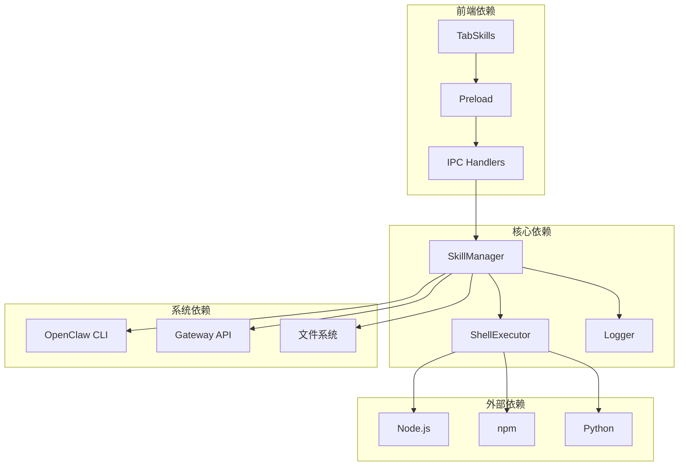

# 技能管理 API

<cite>
**本文档引用的文件**
- [skill-manager.js](file://src/main/services/skill-manager.js)
- [ipc-handlers.js](file://src/main/ipc-handlers.js)
- [preload.js](file://src/main/preload.js)
- [tab-skills.js](file://src/renderer/js/dashboard/tab-skills.js)
- [shell-executor.js](file://src/main/utils/shell-executor.js)
- [logger.js](file://src/main/utils/logger.js)
- [SKILL.md](file://resources/skills/agent-mail/SKILL.md)
</cite>

## 目录
1. [简介](#简介)
2. [项目结构](#项目结构)
3. [核心组件](#核心组件)
4. [架构概览](#架构概览)
5. [详细组件分析](#详细组件分析)
6. [依赖关系分析](#依赖关系分析)
7. [性能考虑](#性能考虑)
8. [故障排除指南](#故障排除指南)
9. [结论](#结论)
10. [附录](#附录)

## 简介

技能管理 API 是 Lobster Claw AI 工具的核心功能模块，负责管理 AI 代理使用的各种技能。该系统提供了完整的技能生命周期管理，包括安装、卸载、启用、禁用、搜索和探索功能。系统支持两种类型的技能：系统内置技能和用户自定义技能，并提供了丰富的元数据管理和验证功能。

该 API 采用 Electron 架构设计，通过 IPC 通信实现前后端分离，提供了直观的用户界面和强大的后台服务支持。系统还集成了进度回调机制和完善的错误处理策略，确保用户能够获得流畅的技能管理体验。

## 项目结构

技能管理功能分布在多个关键文件中，形成了清晰的分层架构：



**图表来源**
- [ipc-handlers.js:26-52](file://src/main/ipc-handlers.js#L26-L52)
- [preload.js:3-239](file://src/main/preload.js#L3-L239)
- [skill-manager.js:9-13](file://src/main/services/skill-manager.js#L9-L13)

**章节来源**
- [ipc-handlers.js:26-52](file://src/main/ipc-handlers.js#L26-L52)
- [preload.js:3-239](file://src/main/preload.js#L3-L239)
- [skill-manager.js:9-13](file://src/main/services/skill-manager.js#L9-L13)

## 核心组件

### 技能管理器 (SkillManager)

技能管理器是整个系统的核心组件，负责协调所有技能相关的操作。它实现了完整的技能生命周期管理，并提供了智能缓存机制来优化性能。

**主要特性：**
- 支持系统内置技能和自定义技能的统一管理
- 智能缓存机制，减少重复的 CLI 调用
- 支持多种技能来源的识别和标记
- 提供详细的错误处理和日志记录

**章节来源**
- [skill-manager.js:9-13](file://src/main/services/skill-manager.js#L9-L13)
- [skill-manager.js:15-23](file://src/main/services/skill-manager.js#L15-L23)

### IPC 处理器

IPC 处理器负责在渲染进程和主进程之间建立通信桥梁，提供标准化的 API 接口。

**主要职责：**
- 注册所有技能相关的 IPC 处理函数
- 管理进度回调和状态通知
- 提供类型安全的 API 调用

**章节来源**
- [ipc-handlers.js:542-595](file://src/main/ipc-handlers.js#L542-L595)

### 预加载桥接

预加载桥接在安全的环境中暴露 API 给渲染进程使用，确保了应用的安全性和稳定性。

**核心功能：**
- 暴露 openclawAPI 对象给前端使用
- 管理 IPC 通信和事件监听
- 提供类型安全的 API 调用包装

**章节来源**
- [preload.js:151-171](file://src/main/preload.js#L151-L171)

## 架构概览

技能管理系统的整体架构采用了分层设计，确保了各组件之间的松耦合和高内聚。



**图表来源**
- [ipc-handlers.js:542-545](file://src/main/ipc-handlers.js#L542-L545)
- [skill-manager.js:133-326](file://src/main/services/skill-manager.js#L133-L326)
- [shell-executor.js:136-197](file://src/main/utils/shell-executor.js#L136-L197)

**章节来源**
- [ipc-handlers.js:542-545](file://src/main/ipc-handlers.js#L542-L545)
- [skill-manager.js:133-326](file://src/main/services/skill-manager.js#L133-L326)
- [shell-executor.js:136-197](file://src/main/utils/shell-executor.js#L136-L197)

## 详细组件分析

### 技能列表管理

技能列表管理是技能系统的基础功能，支持从多个来源获取技能信息并进行统一展示。



**图表来源**
- [skill-manager.js:133-326](file://src/main/services/skill-manager.js#L133-L326)
- [skill-manager.js:219-317](file://src/main/services/skill-manager.js#L219-L317)

**章节来源**
- [skill-manager.js:133-326](file://src/main/services/skill-manager.js#L133-L326)
- [skill-manager.js:219-317](file://src/main/services/skill-manager.js#L219-L317)

### 技能安装流程

技能安装过程包含了多种安装方式和错误处理机制，确保安装过程的可靠性。



**图表来源**
- [ipc-handlers.js:547-549](file://src/main/ipc-handlers.js#L547-L549)
- [skill-manager.js:373-398](file://src/main/services/skill-manager.js#L373-L398)
- [shell-executor.js:136-197](file://src/main/utils/shell-executor.js#L136-L197)

**章节来源**
- [ipc-handlers.js:547-549](file://src/main/ipc-handlers.js#L547-L549)
- [skill-manager.js:373-398](file://src/main/services/skill-manager.js#L373-L398)
- [shell-executor.js:136-197](file://src/main/utils/shell-executor.js#L136-L197)

### 技能启用/禁用机制

系统支持对技能进行启用和禁用操作，区分了自定义技能和系统技能的不同处理方式。



**图表来源**
- [skill-manager.js:487-593](file://src/main/services/skill-manager.js#L487-L593)
- [skill-manager.js:495-515](file://src/main/services/skill-manager.js#L495-L515)

**章节来源**
- [skill-manager.js:487-593](file://src/main/services/skill-manager.js#L487-L593)
- [skill-manager.js:495-515](file://src/main/services/skill-manager.js#L495-L515)

### 自定义技能创建

自定义技能创建功能允许开发者快速创建符合规范的技能包。

**创建流程：**
1. 验证技能名称格式（仅允许小写字母、数字、连字符和下划线）
2. 检查技能描述长度（至少 5 个字符）
3. 验证 SKILL.md 内容完整性
4. 生成标准的 YAML frontmatter
5. 写入技能目录结构

**章节来源**
- [skill-manager.js:1023-1073](file://src/main/services/skill-manager.js#L1023-L1073)
- [tab-skills.js:500-522](file://src/renderer/js/dashboard/tab-skills.js#L500-L522)

### 技能搜索和探索

系统提供了强大的搜索和探索功能，帮助用户发现和管理技能。

**搜索功能特点：**
- 支持关键词搜索
- 集成 npm 仓库搜索
- 处理速率限制和错误情况
- 提供搜索结果解析

**章节来源**
- [skill-manager.js:599-648](file://src/main/services/skill-manager.js#L599-L648)
- [skill-manager.js:709-737](file://src/main/services/skill-manager.js#L709-L737)

## 依赖关系分析

技能管理系统与其他组件之间存在复杂的依赖关系，形成了一个完整的生态系统。



**图表来源**
- [skill-manager.js:1-7](file://src/main/services/skill-manager.js#L1-L7)
- [shell-executor.js:1-6](file://src/main/utils/shell-executor.js#L1-L6)
- [ipc-handlers.js:1-25](file://src/main/ipc-handlers.js#L1-L25)

**章节来源**
- [skill-manager.js:1-7](file://src/main/services/skill-manager.js#L1-L7)
- [shell-executor.js:1-6](file://src/main/utils/shell-executor.js#L1-L6)
- [ipc-handlers.js:1-25](file://src/main/ipc-handlers.js#L1-L25)

## 性能考虑

技能管理系统在设计时充分考虑了性能优化，采用了多种策略来提升用户体验。

### 缓存策略
- **智能缓存**：技能列表缓存 60 秒，减少重复的 CLI 调用
- **缓存失效**：在安装、卸载、启用、禁用操作后主动清除缓存
- **增量更新**：支持部分缓存更新，避免全量重新加载

### 异步处理
- **异步操作**：所有耗时操作都采用异步处理，避免阻塞主线程
- **进度回调**：提供实时进度反馈，改善用户体验
- **超时控制**：合理的超时设置，防止长时间无响应

### 资源管理
- **内存优化**：及时清理不再使用的资源和监听器
- **文件系统优化**：批量文件操作，减少磁盘 I/O 次数
- **网络优化**：合理的请求频率控制，避免过度请求

## 故障排除指南

### 常见问题及解决方案

**技能安装失败**
- 检查网络连接和 npm 仓库访问权限
- 验证技能名称和版本号的正确性
- 查看详细的错误日志信息

**技能启用/禁用异常**
- 确认技能类型（自定义技能 vs 系统技能）
- 检查文件系统权限
- 验证技能目录结构的完整性

**搜索功能异常**
- 检查 npm 仓库的访问状态
- 验证搜索关键词的有效性
- 处理可能的速率限制问题

**章节来源**
- [skill-manager.js:386-397](file://src/main/services/skill-manager.js#L386-L397)
- [skill-manager.js:532-535](file://src/main/services/skill-manager.js#L532-L535)
- [skill-manager.js:612-623](file://src/main/services/skill-manager.js#L612-L623)

### 日志记录和调试

系统提供了完善的日志记录机制，便于问题诊断和性能监控。

**日志级别：**
- **INFO**：一般性信息和操作记录
- **WARN**：警告信息和潜在问题
- **ERROR**：错误信息和异常情况
- **DEBUG**：详细的技术调试信息

**章节来源**
- [logger.js:57-71](file://src/main/utils/logger.js#L57-L71)
- [skill-manager.js:323-325](file://src/main/services/skill-manager.js#L323-L325)

## 结论

技能管理 API 提供了一个完整、强大且易于使用的技能生命周期管理解决方案。通过精心设计的架构和丰富的功能特性，该系统能够满足从个人开发者到企业用户的各种需求。

**主要优势：**
- **完整的功能覆盖**：涵盖技能管理的所有核心功能
- **良好的用户体验**：直观的界面和流畅的操作流程
- **强大的扩展性**：支持自定义技能和第三方集成
- **可靠的错误处理**：完善的错误处理和恢复机制

**未来发展方向：**
- 增强技能依赖解析和管理功能
- 优化性能和资源使用效率
- 扩展更多技能来源和分发渠道
- 提供更丰富的技能开发工具

## 附录

### API 接口参考

**技能管理接口：**
- `skills.list()` - 获取技能列表
- `skills.install(skillId, version)` - 安装技能
- `skills.remove(skillId)` - 卸载技能
- `skills.enable(skillId)` - 启用技能
- `skills.disable(skillId)` - 禁用技能
- `skills.search(query)` - 搜索技能
- `skills.explore()` - 探索新技能
- `skills.info(skillId)` - 获取技能信息
- `skills.createCustom(options)` - 创建自定义技能

**章节来源**
- [preload.js:152-171](file://src/main/preload.js#L152-L171)
- [ipc-handlers.js:542-595](file://src/main/ipc-handlers.js#L542-L595)

### 技能 ID 规范

**命名规则：**
- 仅允许小写字母、数字、连字符和下划线
- 必须以字母或数字开头
- 最大长度限制为 64 个字符

**版本管理：**
- 默认版本号为 1.0.0
- 支持语义化版本控制
- 版本号格式遵循标准规范

**章节来源**
- [tab-skills.js:500-522](file://src/renderer/js/dashboard/tab-skills.js#L500-L522)
- [skill-manager.js:1025-1027](file://src/main/services/skill-manager.js#L1025-L1027)

### 集成示例

**基本技能管理示例：**
```javascript
// 获取技能列表
const skills = await openclawAPI.skills.list();

// 安装技能
await openclawAPI.skills.install('web-search');

// 启用技能
await openclawAPI.skills.enable('web-search');

// 搜索技能
const results = await openclawAPI.skills.search('web');
```

**章节来源**
- [tab-skills.js:117-129](file://src/renderer/js/dashboard/tab-skills.js#L117-L129)
- [tab-skills.js:838-859](file://src/renderer/js/dashboard/tab-skills.js#L838-L859)