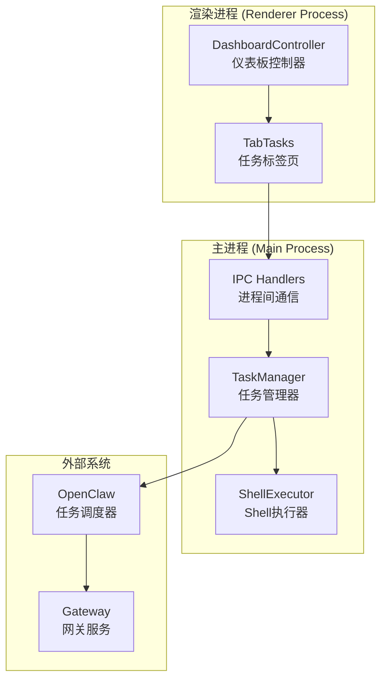
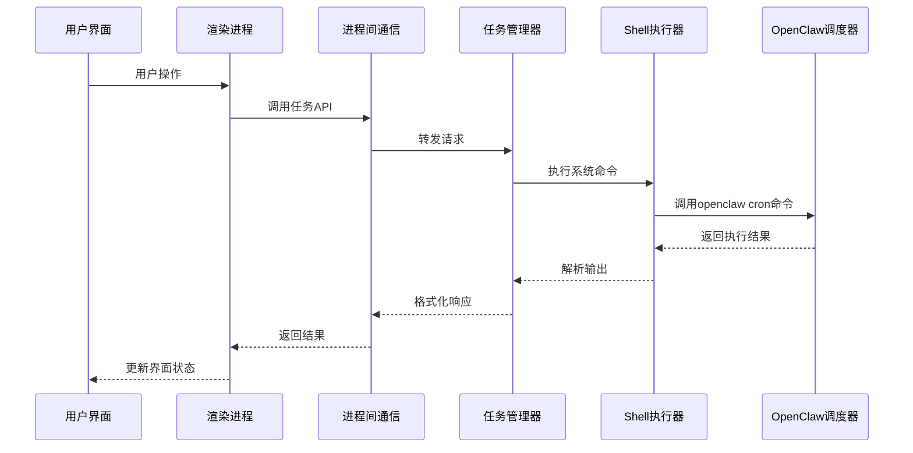
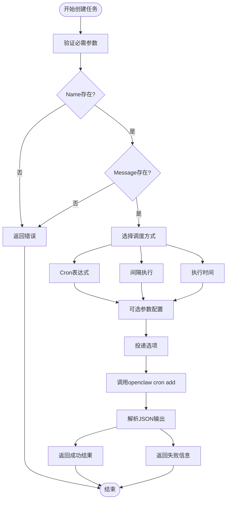
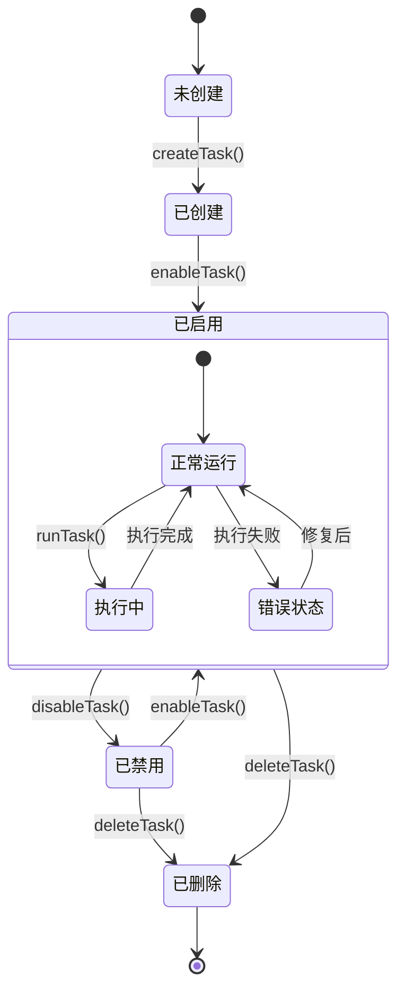
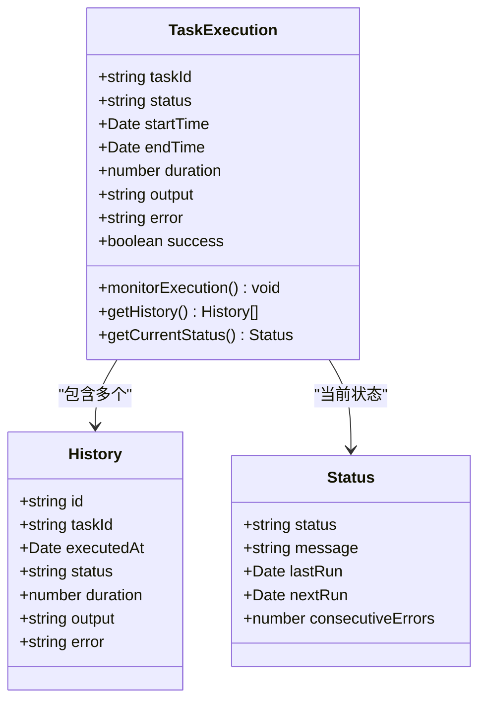
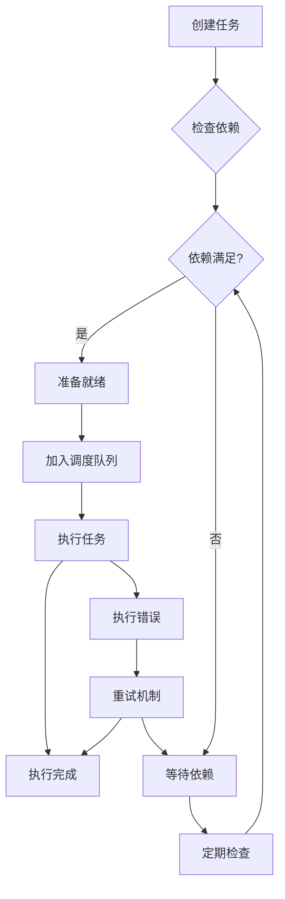
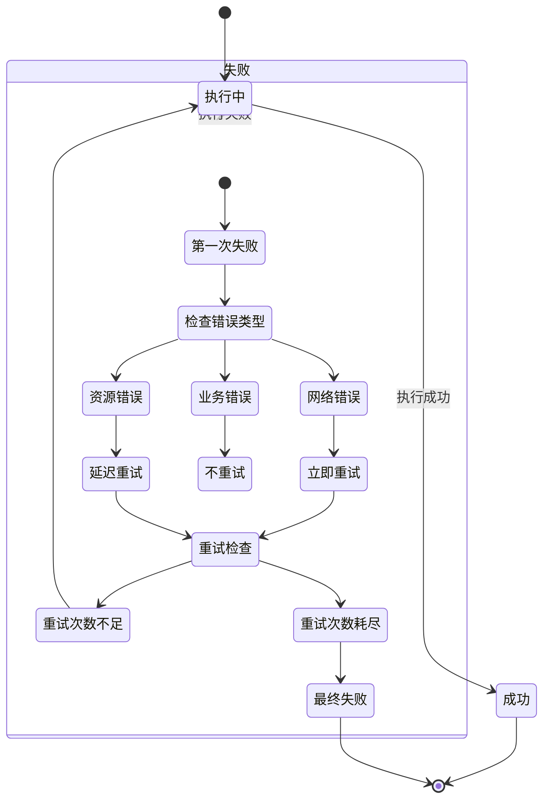
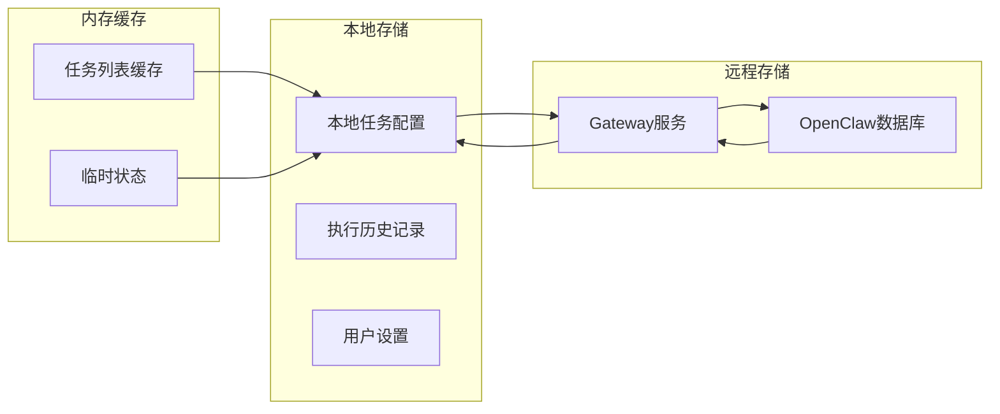
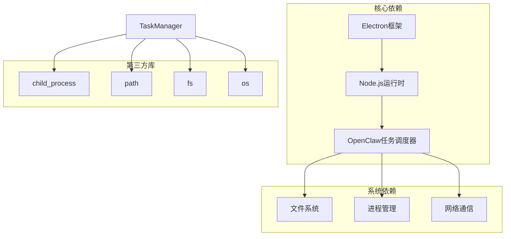

# 任务调度 API

<cite>
**本文档引用的文件**
- [task-manager.js](file://src/main/services/task-manager.js)
- [ipc-handlers.js](file://src/main/ipc-handlers.js)
- [tab-tasks.js](file://src/renderer/js/dashboard/tab-tasks.js)
- [shell-executor.js](file://src/main/utils/shell-executor.js)
- [dashboard-controller.js](file://src/renderer/js/dashboard/dashboard-controller.js)
</cite>

## 目录
1. [简介](#简介)
2. [项目结构](#项目结构)
3. [核心组件](#核心组件)
4. [架构概览](#架构概览)
5. [详细组件分析](#详细组件分析)
6. [依赖关系分析](#依赖关系分析)
7. [性能考虑](#性能考虑)
8. [故障排除指南](#故障排除指南)
9. [结论](#结论)

## 简介

任务调度 API 是一个基于 Electron 的定时任务管理系统，通过与 OpenClaw 任务调度器交互来实现任务的创建、管理和监控。该系统提供了完整的任务生命周期管理，包括任务创建、执行、监控和删除等核心功能。

## 项目结构

任务调度 API 采用典型的 Electron 应用架构，分为主进程和渲染进程两个主要部分：

**图表来源**
- [task-manager.js:57-734](file://src/main/services/task-manager.js#L57-734)
- [ipc-handlers.js:672-707](file://src/main/ipc-handlers.js#L672-707)
- [tab-tasks.js:1-800](file://src/renderer/js/dashboard/tab-tasks.js#L1-800)

**章节来源**
- [task-manager.js:1-735](file://src/main/services/task-manager.js#L1-735)
- [ipc-handlers.js:1-816](file://src/main/ipc-handlers.js#L1-816)
- [tab-tasks.js:1-800](file://src/renderer/js/dashboard/tab-tasks.js#L1-800)

## 核心组件

### 任务管理器 (TaskManager)

TaskManager 是整个任务调度系统的核心组件，负责与 OpenClaw 任务调度器进行交互。它提供了以下主要功能：

- **任务生命周期管理**：创建、编辑、启用、禁用、删除任务
- **任务执行监控**：获取任务执行历史和状态
- **缓存机制**：智能缓存任务列表以提高性能
- **错误处理**：优雅处理 Gateway 连接问题

### 进程间通信 (IPC Handlers)

IPC Handlers 提供了标准化的任务调度 API 接口，支持以下操作：

- `tasks:list` - 获取任务列表
- `tasks:create` - 创建新任务
- `tasks:edit` - 编辑现有任务
- `tasks:enable` - 启用任务
- `tasks:disable` - 禁用任务
- `tasks:delete` - 删除任务
- `tasks:run` - 立即运行任务
- `tasks:history` - 获取执行历史
- `tasks:status` - 获取调度器状态

### 任务界面 (TabTasks)

TabTasks 提供了用户友好的图形界面，包含以下功能：

- **任务列表视图**：显示所有定时任务的状态和信息
- **任务创建表单**：支持多种调度方式（每日、每周、每月、一次性、间隔执行、自定义 Cron）
- **任务操作**：启用/禁用、立即运行、查看历史、编辑、删除
- **错误处理**：显示任务错误信息和连续错误次数

**章节来源**
- [task-manager.js:57-734](file://src/main/services/task-manager.js#L57-734)
- [ipc-handlers.js:672-707](file://src/main/ipc-handlers.js#L672-707)
- [tab-tasks.js:1-800](file://src/renderer/js/dashboard/tab-tasks.js#L1-800)

## 架构概览

任务调度 API 采用分层架构设计，确保了良好的可维护性和扩展性：

**图表来源**
- [ipc-handlers.js:672-707](file://src/main/ipc-handlers.js#L672-707)
- [task-manager.js:161-256](file://src/main/services/task-manager.js#L161-256)
- [shell-executor.js:136-197](file://src/main/utils/shell-executor.js#L136-197)

## 详细组件分析

### 任务创建接口

任务创建接口支持多种调度方式和参数配置：

**图表来源**
- [task-manager.js:332-401](file://src/main/services/task-manager.js#L332-401)
- [tab-tasks.js:1235-1379](file://src/renderer/js/dashboard/tab-tasks.js#L1235-1379)

#### 调度方式支持

系统支持以下调度方式：

| 调度方式 | 参数 | 描述 | 示例 |
|---------|------|------|------|
| Cron | `--cron` | 标准Cron表达式 | `0 9 * * *` |
| 每日 | `--every` | 每天固定时间 | `daily@09:00` |
| 间隔 | `--every` | 间隔执行 | `30m` (30分钟) |
| 一次性 | `--at` | 指定执行时间 | `2024-12-31T23:59:59Z` |
| 自定义 | `--cron` | 自定义Cron表达式 | `*/5 * * * *` |

#### 可选参数配置

任务创建支持丰富的可选参数：

- **时区设置** (`--tz`)：支持 `Asia/Shanghai`、`UTC`、`America/New_York` 等
- **模型配置** (`--model`)：指定使用的AI模型
- **会话管理** (`--session`)：关联特定会话
- **描述信息** (`--description`)：任务描述
- **超时设置** (`--timeout`)：执行超时时间（秒）
- **禁用状态** (`--disabled`)：创建后立即禁用

**章节来源**
- [task-manager.js:332-401](file://src/main/services/task-manager.js#L332-401)
- [tab-tasks.js:1208-1233](file://src/renderer/js/dashboard/tab-tasks.js#L1208-1233)

### 任务生命周期管理

任务生命周期管理涵盖了从创建到删除的完整流程：

**图表来源**
- [task-manager.js:479-574](file://src/main/services/task-manager.js#L479-574)

#### 任务状态转换

每个任务都有明确的状态转换规则：

- **创建阶段**：任务刚创建时处于禁用状态，需要手动启用
- **启用阶段**：任务进入调度器管理，等待执行时机
- **执行阶段**：任务按计划或手动触发执行
- **错误阶段**：执行失败时进入错误状态，可自动或手动恢复

#### 缓存机制

系统实现了智能缓存机制来提高性能：

- **缓存有效期**：30秒
- **缓存失效**：任务创建、删除、启用、禁用后立即失效
- **透明缓存**：用户感知不到缓存的存在
- **降级处理**：Gateway连接问题时返回缓存数据

**章节来源**
- [task-manager.js:66-73](file://src/main/services/task-manager.js#L66-73)
- [task-manager.js:276-327](file://src/main/services/task-manager.js#L276-327)

### 任务执行监控

任务执行监控提供了全面的执行状态跟踪和历史记录：

**图表来源**
- [task-manager.js:643-707](file://src/main/services/task-manager.js#L643-707)

#### 执行历史记录

系统支持获取任务的执行历史记录：

- **历史记录查询**：支持按任务ID查询历史
- **记录数量限制**：默认返回最近50条记录
- **JSON解析**：自动解析openclaw返回的JSON数据
- **错误处理**：解析失败时记录警告信息

#### 实时状态监控

任务界面提供了实时的状态监控功能：

- **状态指示器**：显示任务的当前状态（启用/禁用/错误）
- **执行时间**：显示下次执行时间和上次执行时间
- **错误追踪**：显示连续错误次数和最后一次错误信息
- **进度反馈**：操作执行时显示加载状态

**章节来源**
- [task-manager.js:643-707](file://src/main/services/task-manager.js#L643-707)
- [tab-tasks.js:689-742](file://src/renderer/js/dashboard/tab-tasks.js#L689-742)

### 任务队列管理

虽然底层依赖于OpenClaw的调度器，但系统提供了以下队列管理特性：

#### 并发控制

- **串行执行**：每个任务按顺序执行，避免资源竞争
- **超时控制**：任务执行超时时间为60秒（run操作）
- **错误隔离**：单个任务失败不影响其他任务执行

#### 资源分配

- **内存管理**：自动清理执行过程中的临时数据
- **文件句柄**：确保所有打开的文件句柄正确关闭
- **进程管理**：合理管理子进程生命周期

### 任务依赖关系处理

系统支持基本的任务依赖关系处理：

**图表来源**
- [task-manager.js:161-256](file://src/main/services/task-manager.js#L161-256)

#### 前置条件检查

系统在执行任务前会进行必要的前置条件检查：

- **Gateway连接**：确保与OpenClaw服务的连接正常
- **任务有效性**：验证任务配置的完整性
- **资源可用性**：检查所需的外部资源是否可用

#### 循环依赖检测

系统具备基本的循环依赖检测能力：

- **依赖链跟踪**：记录任务间的依赖关系
- **环路检测**：防止创建循环依赖的任务链
- **警告提示**：发现潜在的循环依赖时给出警告

### 任务重试机制

系统实现了智能的重试机制：

**图表来源**
- [task-manager.js:262-271](file://src/main/services/task-manager.js#L262-271)

#### 错误分类处理

系统对不同类型的错误采用不同的处理策略：

- **网络错误**：立即重试，适用于临时性的网络问题
- **资源错误**：延迟重试，给系统恢复时间
- **业务错误**：不重试，这类错误通常表示配置问题

#### 重试策略

- **最大重试次数**：根据错误类型设定不同的重试上限
- **退避算法**：采用线性或指数退避策略
- **超时处理**：防止无限重试占用系统资源

### 任务持久化存储

系统实现了多层次的任务持久化存储：

**图表来源**
- [task-manager.js:58-73](file://src/main/services/task-manager.js#L58-73)
- [tab-tasks.js:11-29](file://src/renderer/js/dashboard/tab-tasks.js#L11-29)

#### 配置保存

- **任务配置**：保存在OpenClaw的配置存储中
- **用户偏好**：保存在本地localStorage中
- **临时状态**：保存在内存缓存中

#### 状态同步

- **实时同步**：任务状态变化时实时同步到所有组件
- **批量更新**：定期批量更新任务状态
- **冲突解决**：处理并发更新时的状态冲突

#### 系统重启恢复

- **自动恢复**：系统重启后自动恢复任务状态
- **一致性保证**：确保重启前后任务状态的一致性
- **错误恢复**：重启后自动处理异常状态的任务

**章节来源**
- [task-manager.js:58-73](file://src/main/services/task-manager.js#L58-73)
- [tab-tasks.js:11-29](file://src/renderer/js/dashboard/tab-tasks.js#L11-29)

## 依赖关系分析

任务调度 API 的依赖关系相对简洁，主要依赖于以下组件：

**图表来源**
- [task-manager.js:9-16](file://src/main/services/task-manager.js#L9-16)
- [shell-executor.js:1-7](file://src/main/utils/shell-executor.js#L1-7)

### 组件耦合度

- **低耦合设计**：各组件职责明确，相互独立
- **接口抽象**：通过IPC接口实现组件间通信
- **依赖注入**：通过构造函数注入依赖，便于测试

### 外部集成点

- **OpenClaw集成**：通过cron命令与OpenClaw交互
- **系统集成**：通过ShellExecutor与操作系统交互
- **用户界面集成**：通过Electron与用户界面交互

**章节来源**
- [task-manager.js:9-16](file://src/main/services/task-manager.js#L9-16)
- [shell-executor.js:1-471](file://src/main/utils/shell-executor.js#L1-471)

## 性能考虑

### 缓存策略

系统采用了多层次的缓存策略来优化性能：

- **任务列表缓存**：30秒有效期，减少频繁查询
- **环境变量缓存**：缓存PATH和环境变量，避免重复构建
- **执行结果缓存**：缓存最近的执行结果，支持快速响应

### 异步处理

- **非阻塞I/O**：所有文件操作和网络请求都是异步的
- **并发执行**：支持多个任务同时执行（受系统资源限制）
- **超时控制**：为所有长时间操作设置合理的超时时间

### 内存管理

- **及时释放**：及时释放不再使用的对象和资源
- **垃圾回收**：利用JavaScript的垃圾回收机制
- **内存监控**：定期监控内存使用情况

## 故障排除指南

### 常见问题及解决方案

#### Gateway连接问题

**问题症状**：
- 任务列表无法获取
- 操作超时
- 系统提示Gateway关闭

**解决方案**：
- 检查OpenClaw服务状态
- 重启Gateway服务
- 检查防火墙设置

#### 任务创建失败

**问题症状**：
- 任务创建返回错误
- Cron表达式无效
- 参数验证失败

**解决方案**：
- 验证Cron表达式的正确性
- 检查必需参数是否完整
- 查看详细的错误信息

#### 任务执行失败

**问题症状**：
- 任务执行返回错误
- 输出为空或异常
- 任务状态显示错误

**解决方案**：
- 检查任务配置的正确性
- 验证外部依赖的可用性
- 查看详细的错误日志

### 调试工具

系统提供了多种调试工具：

- **日志记录**：详细的日志记录帮助定位问题
- **状态监控**：实时监控任务状态变化
- **错误报告**：自动收集和报告错误信息

**章节来源**
- [task-manager.js:262-271](file://src/main/services/task-manager.js#L262-271)
- [task-manager.js:579-606](file://src/main/services/task-manager.js#L579-606)

## 结论

任务调度 API 提供了一个功能完整、易于使用的定时任务管理系统。通过与OpenClaw的深度集成，系统实现了：

- **完整的任务生命周期管理**：从创建到删除的全流程支持
- **灵活的调度方式**：支持多种调度策略和自定义配置
- **强大的监控功能**：实时状态跟踪和历史记录
- **可靠的错误处理**：智能的错误检测和恢复机制
- **高效的性能表现**：通过缓存和异步处理提升性能

该系统为用户提供了直观易用的图形界面，同时保持了强大的技术能力和扩展性，适合各种规模的定时任务管理需求。