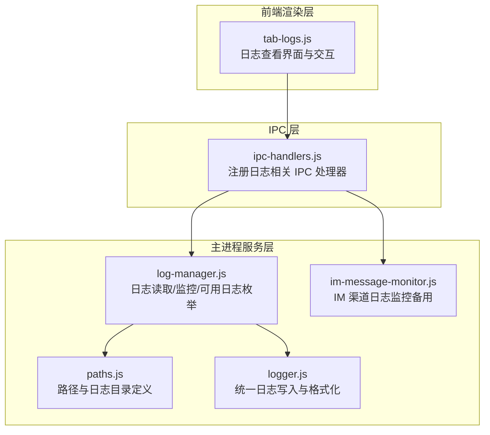
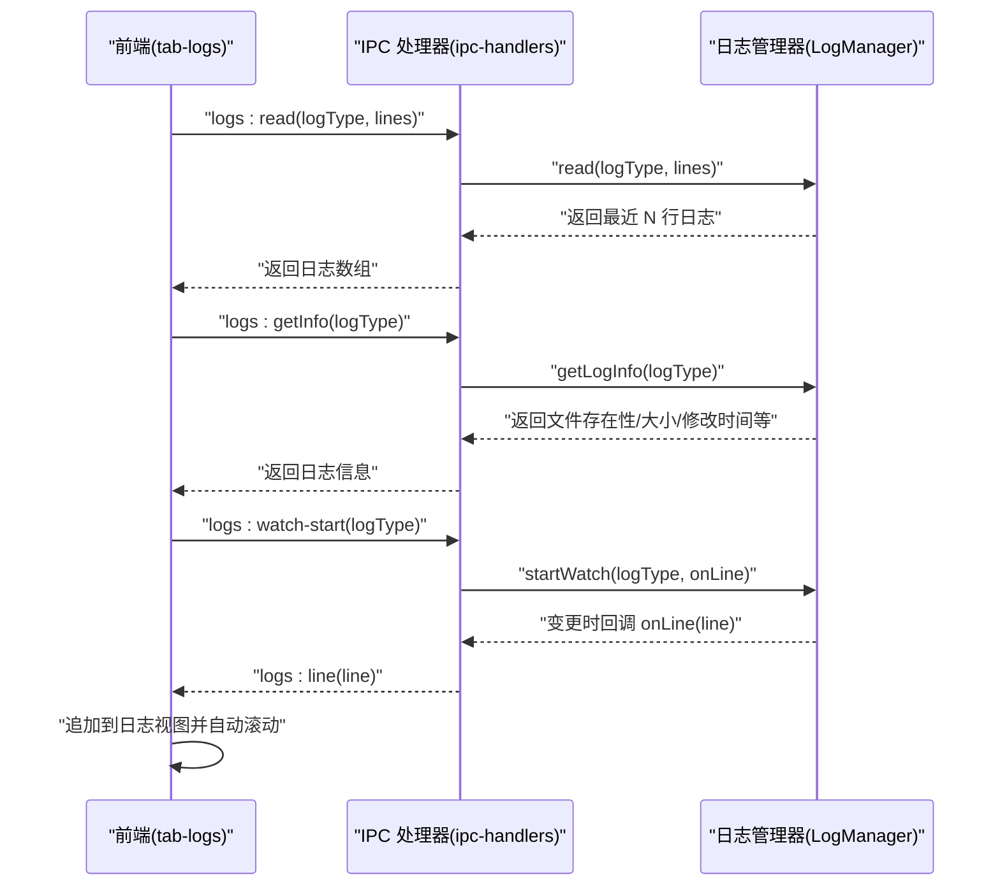
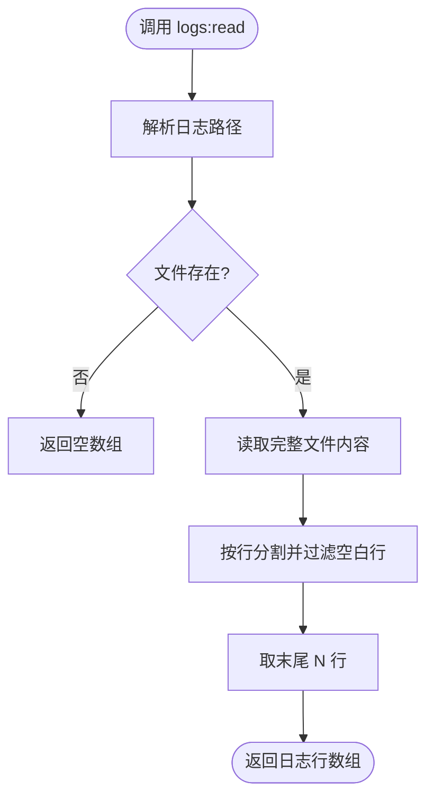
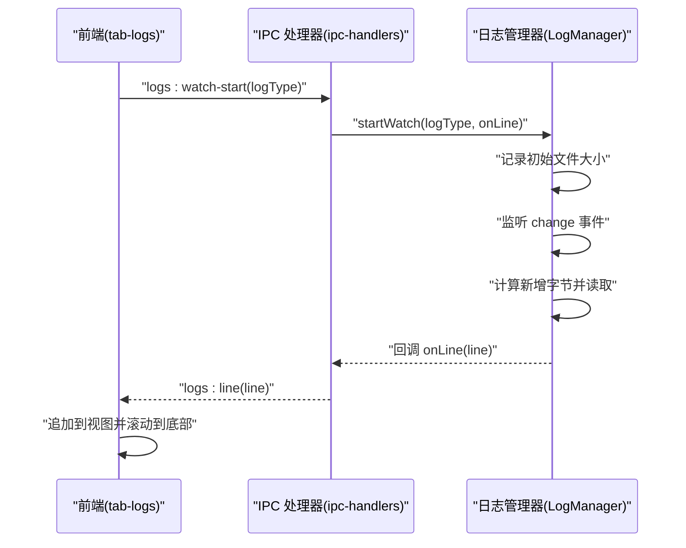
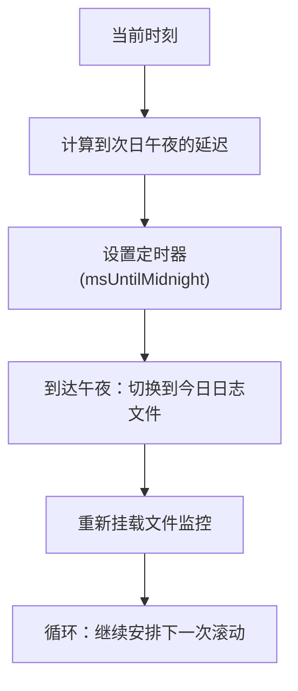
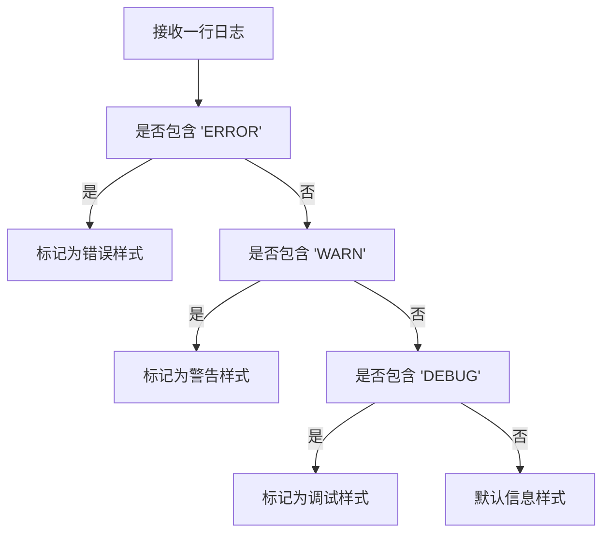
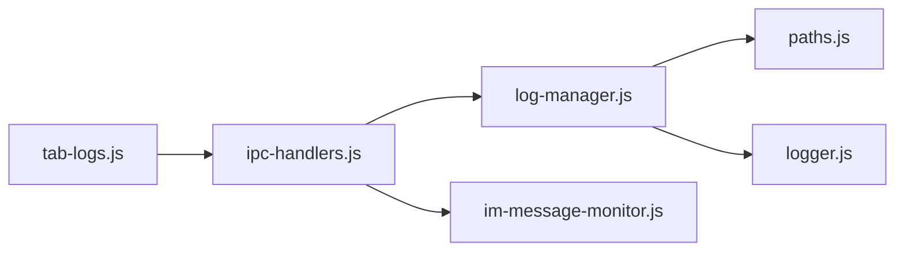

# 日志管理 API

<cite>
**本文档引用的文件**
- [src/main/services/log-manager.js](file://src/main/services/log-manager.js)
- [src/renderer/js/dashboard/tab-logs.js](file://src/renderer/js/dashboard/tab-logs.js)
- [src/main/ipc-handlers.js](file://src/main/ipc-handlers.js)
- [src/main/utils/logger.js](file://src/main/utils/logger.js)
- [src/main/utils/paths.js](file://src/main/utils/paths.js)
- [src/main/services/im-message-monitor.js](file://src/main/services/im-message-monitor.js)
</cite>

## 目录
1. [简介](#简介)
2. [项目结构](#项目结构)
3. [核心组件](#核心组件)
4. [架构总览](#架构总览)
5. [详细组件分析](#详细组件分析)
6. [依赖关系分析](#依赖关系分析)
7. [性能考量](#性能考量)
8. [故障排查指南](#故障排查指南)
9. [结论](#结论)
10. [附录](#附录)

## 简介
本文件面向“日志管理 API”的使用者与维护者，系统性梳理日志读取、实时监控、日志轮转、级别控制、搜索与分析、导出与备份以及配置管理等能力。文档基于仓库现有实现进行归纳，并明确各模块职责、数据流与交互方式。

## 项目结构
日志管理相关代码主要分布在以下位置：
- 主进程服务层：日志读取与监控、路径与日志格式化工具
- 前端渲染层：日志查看界面、右键菜单、自动滚动与复制
- IPC 层：前后端通信桥接，暴露日志相关 API

**图表来源**
- [src/renderer/js/dashboard/tab-logs.js:1-318](file://src/renderer/js/dashboard/tab-logs.js#L1-L318)
- [src/main/ipc-handlers.js:399-416](file://src/main/ipc-handlers.js#L399-L416)
- [src/main/services/log-manager.js:1-169](file://src/main/services/log-manager.js#L1-L169)
- [src/main/utils/paths.js:1-124](file://src/main/utils/paths.js#L1-L124)
- [src/main/utils/logger.js:1-75](file://src/main/utils/logger.js#L1-L75)
- [src/main/services/im-message-monitor.js:95-214](file://src/main/services/im-message-monitor.js#L95-L214)

**章节来源**
- [src/renderer/js/dashboard/tab-logs.js:1-318](file://src/renderer/js/dashboard/tab-logs.js#L1-L318)
- [src/main/ipc-handlers.js:399-416](file://src/main/ipc-handlers.js#L399-L416)
- [src/main/services/log-manager.js:1-169](file://src/main/services/log-manager.js#L1-L169)
- [src/main/utils/paths.js:1-124](file://src/main/utils/paths.js#L1-L124)
- [src/main/utils/logger.js:1-75](file://src/main/utils/logger.js#L1-L75)
- [src/main/services/im-message-monitor.js:95-214](file://src/main/services/im-message-monitor.js#L95-L214)

## 核心组件
- 日志管理器（LogManager）
  - 负责日志文件读取、实时监控、可用日志枚举与文件信息查询
- IPC 处理器（ipc-handlers.js）
  - 暴露日志读取、监控启停等 API，并将实时日志通过通道推送到前端
- 前端日志标签页（tab-logs.js）
  - 提供日志选择、刷新、自动滚动、复制、右键菜单等交互
- 路径与日志工具（paths.js、logger.js）
  - 定义日志输出路径、格式化与清理逻辑
- IM 消息监控（im-message-monitor.js）
  - 监控每日滚动的日志文件，作为 IM 渠道消息来源的补充

**章节来源**
- [src/main/services/log-manager.js:14-169](file://src/main/services/log-manager.js#L14-L169)
- [src/main/ipc-handlers.js:399-416](file://src/main/ipc-handlers.js#L399-L416)
- [src/renderer/js/dashboard/tab-logs.js:1-318](file://src/renderer/js/dashboard/tab-logs.js#L1-L318)
- [src/main/utils/paths.js:67-82](file://src/main/utils/paths.js#L67-L82)
- [src/main/utils/logger.js:7-75](file://src/main/utils/logger.js#L7-L75)
- [src/main/services/im-message-monitor.js:95-214](file://src/main/services/im-message-monitor.js#L95-L214)

## 架构总览
日志管理采用“前端渲染 + IPC 通信 + 主进程服务”的三层架构：
- 前端通过 openclawAPI 调用 IPC 接口
- IPC 将请求转发至 LogManager 或其他服务
- LogManager 基于文件系统读取或监控日志文件，必要时触发 UI 事件

**图表来源**
- [src/renderer/js/dashboard/tab-logs.js:196-244](file://src/renderer/js/dashboard/tab-logs.js#L196-L244)
- [src/main/ipc-handlers.js:399-416](file://src/main/ipc-handlers.js#L399-L416)
- [src/main/services/log-manager.js:42-85](file://src/main/services/log-manager.js#L42-L85)
- [src/main/services/log-manager.js:87-140](file://src/main/services/log-manager.js#L87-L140)

**章节来源**
- [src/renderer/js/dashboard/tab-logs.js:196-244](file://src/renderer/js/dashboard/tab-logs.js#L196-L244)
- [src/main/ipc-handlers.js:399-416](file://src/main/ipc-handlers.js#L399-L416)
- [src/main/services/log-manager.js:42-140](file://src/main/services/log-manager.js#L42-L140)

## 详细组件分析

### 日志读取接口
- 功能点
  - 指定日志类型与行数，读取最近若干行
  - 查询日志文件是否存在、大小、最后修改时间等元信息
- 关键实现
  - 读取：按行分割并过滤空白行，返回末尾若干行
  - 信息：查询文件状态，返回结构化信息
- 性能与边界
  - 读取行为一次性读取整个文件，适合较小日志文件；对大文件建议前端分页或后端分块

**图表来源**
- [src/main/services/log-manager.js:42-56](file://src/main/services/log-manager.js#L42-L56)
- [src/main/services/log-manager.js:61-85](file://src/main/services/log-manager.js#L61-L85)

**章节来源**
- [src/main/services/log-manager.js:42-85](file://src/main/services/log-manager.js#L42-L85)

### 实时日志监控（文件变更推送）
- 功能点
  - 基于文件系统监控，检测日志文件增长并增量推送新行
  - 前端自动滚动到最新行，保持可视窗口稳定
- 关键实现
  - 使用 chokidar 监听文件变化，计算文件大小差额，读取新增字节并按行拆分
  - 通过 IPC 将每行日志推送到前端
- 边界与注意事项
  - 若文件被截断或轮转，需重新初始化监控
  - 前端侧限制最大行数，避免内存膨胀

**图表来源**
- [src/main/ipc-handlers.js:408-412](file://src/main/ipc-handlers.js#L408-L412)
- [src/main/services/log-manager.js:87-140](file://src/main/services/log-manager.js#L87-L140)
- [src/renderer/js/dashboard/tab-logs.js:250-271](file://src/renderer/js/dashboard/tab-logs.js#L250-L271)

**章节来源**
- [src/main/ipc-handlers.js:408-412](file://src/main/ipc-handlers.js#L408-L412)
- [src/main/services/log-manager.js:87-140](file://src/main/services/log-manager.js#L87-L140)
- [src/renderer/js/dashboard/tab-logs.js:250-271](file://src/renderer/js/dashboard/tab-logs.js#L250-L271)

### 日志轮转与时间分割
- 现状
  - 存在针对 IM 渠道日志的每日滚动监控（按 openclaw 日志目录下的日期文件）
  - 该机制通过定时器在午夜触发切换到新的日志文件
- 说明
  - 该实现适用于特定子系统的日志滚动；对于通用应用日志轮转，当前仓库未见对应实现

**图表来源**
- [src/main/services/im-message-monitor.js:202-214](file://src/main/services/im-message-monitor.js#L202-L214)
- [src/main/utils/paths.js:67-82](file://src/main/utils/paths.js#L67-L82)

**章节来源**
- [src/main/services/im-message-monitor.js:202-214](file://src/main/services/im-message-monitor.js#L202-L214)
- [src/main/utils/paths.js:67-82](file://src/main/utils/paths.js#L67-L82)

### 日志级别控制与着色
- 现状
  - 前端根据行内关键字匹配进行简单级别识别与样式区分（如 ERROR、WARN、DEBUG）
  - 日志写入器支持 INFO/WARN/ERROR/DEBUG 等级别
- 说明
  - 当前未发现后端对日志级别的过滤或筛选 API；级别控制主要在前端展示层面

**图表来源**
- [src/renderer/js/dashboard/tab-logs.js:273-285](file://src/renderer/js/dashboard/tab-logs.js#L273-L285)
- [src/main/utils/logger.js:57-71](file://src/main/utils/logger.js#L57-L71)

**章节来源**
- [src/renderer/js/dashboard/tab-logs.js:273-285](file://src/renderer/js/dashboard/tab-logs.js#L273-L285)
- [src/main/utils/logger.js:57-71](file://src/main/utils/logger.js#L57-L71)

### 日志搜索与分析
- 现状
  - 前端支持复制全部日志内容，便于外部工具进行搜索与分析
  - 未发现内置的关键词匹配、正则搜索或统计报表生成功能
- 建议
  - 可在后端扩展搜索接口，支持关键词/正则过滤与统计

**章节来源**
- [src/renderer/js/dashboard/tab-logs.js:287-307](file://src/renderer/js/dashboard/tab-logs.js#L287-L307)

### 日志导出与备份
- 现状
  - 前端提供复制全部日志到剪贴板的能力
  - 未发现专用的导出/备份接口或批量下载功能
- 建议
  - 可通过 IPC 暴露导出接口，返回文件内容或触发下载

**章节来源**
- [src/renderer/js/dashboard/tab-logs.js:287-307](file://src/renderer/js/dashboard/tab-logs.js#L287-L307)

### 日志配置管理
- 输出路径与格式
  - 日志输出路径由路径工具统一管理
  - 日志写入器负责时间戳格式化与消息清洗
- 性能优化
  - 前端限制最大行数，避免内存占用过高
  - 监控采用轮询策略，兼顾兼容性与资源消耗

**章节来源**
- [src/main/utils/paths.js:67-82](file://src/main/utils/paths.js#L67-L82)
- [src/main/utils/logger.js:15-43](file://src/main/utils/logger.js#L15-L43)
- [src/renderer/js/dashboard/tab-logs.js:255-258](file://src/renderer/js/dashboard/tab-logs.js#L255-L258)

## 依赖关系分析
- 组件耦合
  - tab-logs 依赖 openclawAPI（通过 IPC）
  - ipc-handlers 依赖 LogManager 与 IM 监控器
  - LogManager 依赖路径工具与日志写入器
- 外部依赖
  - chokidar 用于文件监控
  - Node.js fs/stat 用于文件读取与状态查询

**图表来源**
- [src/renderer/js/dashboard/tab-logs.js:1-318](file://src/renderer/js/dashboard/tab-logs.js#L1-L318)
- [src/main/ipc-handlers.js:39-50](file://src/main/ipc-handlers.js#L39-L50)
- [src/main/services/log-manager.js:1-12](file://src/main/services/log-manager.js#L1-L12)
- [src/main/utils/paths.js:1-12](file://src/main/utils/paths.js#L1-L12)
- [src/main/utils/logger.js:1-5](file://src/main/utils/logger.js#L1-L5)
- [src/main/services/im-message-monitor.js:1-24](file://src/main/services/im-message-monitor.js#L1-L24)

**章节来源**
- [src/renderer/js/dashboard/tab-logs.js:1-318](file://src/renderer/js/dashboard/tab-logs.js#L1-L318)
- [src/main/ipc-handlers.js:39-50](file://src/main/ipc-handlers.js#L39-L50)
- [src/main/services/log-manager.js:1-12](file://src/main/services/log-manager.js#L1-L12)
- [src/main/utils/paths.js:1-12](file://src/main/utils/paths.js#L1-L12)
- [src/main/utils/logger.js:1-5](file://src/main/utils/logger.js#L1-L5)
- [src/main/services/im-message-monitor.js:1-24](file://src/main/services/im-message-monitor.js#L1-L24)

## 性能考量
- 文件监控
  - 使用轮询策略，兼容性好但 CPU 占用相对较高；可根据场景调整轮询间隔
- 前端渲染
  - 限制最大行数，避免 DOM 节点过多导致卡顿
- 日志读取
  - 一次性读取整个文件，适合小日志；对大文件建议分页或后端分块读取

[本节为通用指导，无需具体文件引用]

## 故障排查指南
- 无法读取日志
  - 检查日志文件是否存在与权限
  - 查看后端日志写入器是否正常工作
- 实时监控无效
  - 确认 chokidar 是否正确初始化
  - 检查文件是否被截断或轮转
- 前端不显示新行
  - 确认 IPC 通道 logs:line 是否收到
  - 检查前端是否正确订阅并追加到视图

**章节来源**
- [src/main/services/log-manager.js:87-140](file://src/main/services/log-manager.js#L87-L140)
- [src/main/utils/logger.js:45-55](file://src/main/utils/logger.js#L45-L55)
- [src/renderer/js/dashboard/tab-logs.js:250-271](file://src/renderer/js/dashboard/tab-logs.js#L250-L271)

## 结论
本仓库的日志管理 API 已具备基础的读取、实时监控与前端展示能力，满足日常运维与开发调试需求。对于更高级的功能（如日志轮转、级别过滤、搜索分析、导出备份与配置优化），可在现有架构上平滑扩展，以提升可观测性与易用性。

[本节为总结性内容，无需具体文件引用]

## 附录

### API 规范（基于现有实现）
- logs:read(logType, lines)
  - 输入：日志类型、行数
  - 输出：日志行数组
- logs:getInfo(logType)
  - 输入：日志类型
  - 输出：文件存在性、路径、大小、修改时间等
- logs:watch-start(logType)
  - 输入：日志类型
  - 输出：持续推送 logs:line
- logs:watch-stop()
  - 停止监控

**章节来源**
- [src/main/ipc-handlers.js:399-416](file://src/main/ipc-handlers.js#L399-L416)
- [src/main/services/log-manager.js:42-85](file://src/main/services/log-manager.js#L42-L85)
- [src/main/services/log-manager.js:87-140](file://src/main/services/log-manager.js#L87-L140)