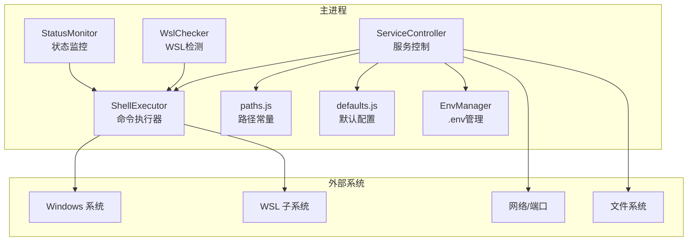
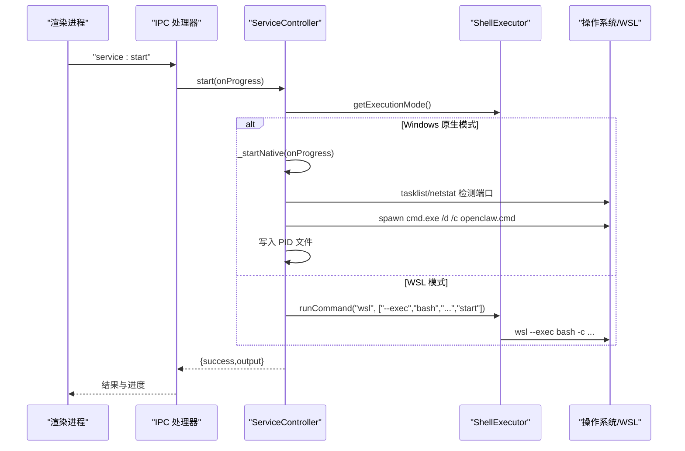
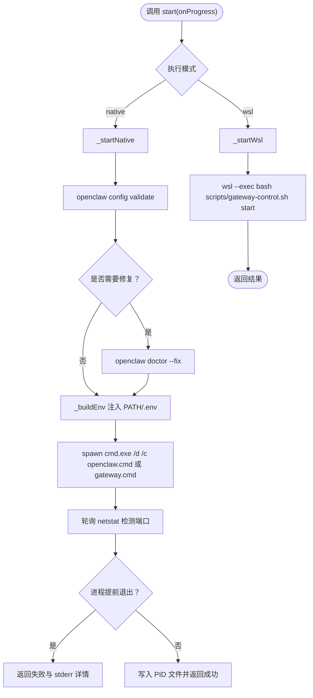
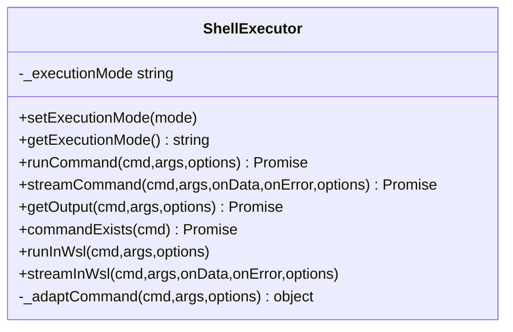
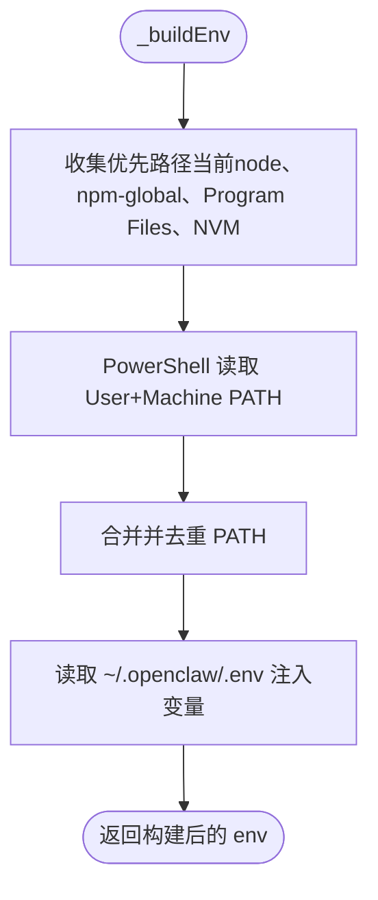
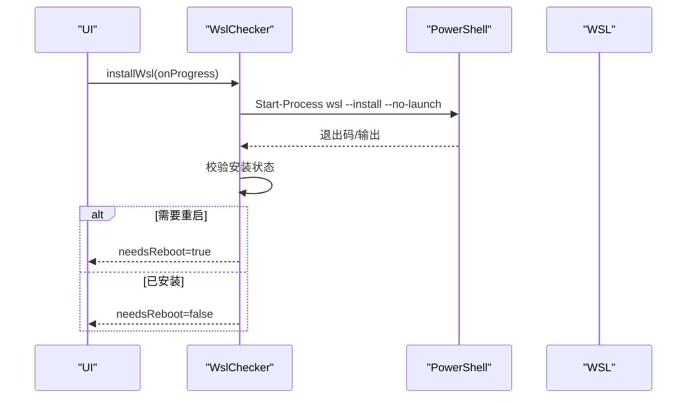
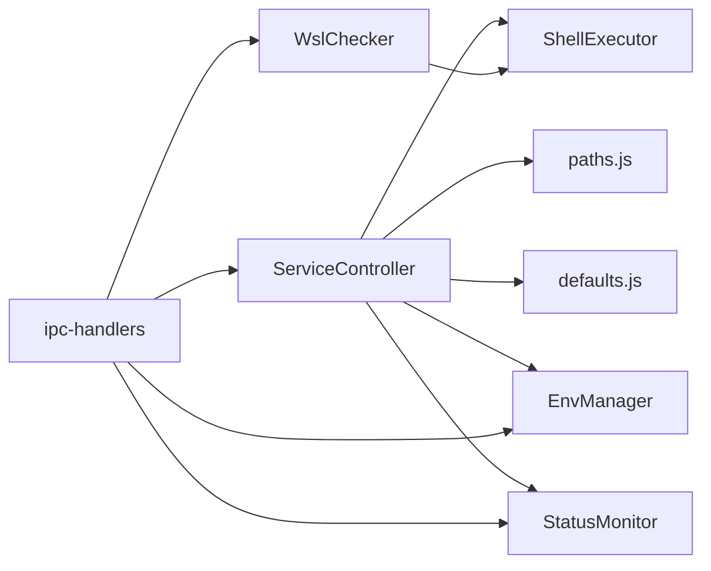

# 服务控制 API

<cite>
**本文档引用的文件**
- [service-controller.js](file://src/main/services/service-controller.js)
- [shell-executor.js](file://src/main/utils/shell-executor.js)
- [paths.js](file://src/main/utils/paths.js)
- [defaults.js](file://src/main/config/defaults.js)
- [gateway-control.sh](file://scripts/gateway-control.sh)
- [wsl-checker.js](file://src/main/services/wsl-checker.js)
- [env-manager.js](file://src/main/services/env-manager.js)
- [status-monitor.js](file://src/main/services/status-monitor.js)
- [ipc-handlers.js](file://src/main/ipc-handlers.js)
</cite>

## 目录
1. [简介](#简介)
2. [项目结构](#项目结构)
3. [核心组件](#核心组件)
4. [架构总览](#架构总览)
5. [详细组件分析](#详细组件分析)
6. [依赖关系分析](#依赖关系分析)
7. [性能考量](#性能考量)
8. [故障排查指南](#故障排查指南)
9. [结论](#结论)
10. [附录](#附录)

## 简介
本文件面向“服务控制 API”，聚焦 Gateway 服务的启动、停止、重启与状态查询能力，覆盖 Windows 原生模式与 WSL 模式两种执行路径，详述环境变量构建机制（PATH 注入、Node.js 路径检测、.env 变量注入）、服务发现与进程管理（taskkill 终止、进程树清理、PID 文件管理）、跨平台兼容性（Windows 命令行工具、PowerShell 路径查询、WSL 交互协议）、以及错误处理策略、超时控制与进度回调机制。文档同时提供可视化图示，帮助开发者与运维人员快速理解系统行为与数据流。

## 项目结构
围绕服务控制的核心模块与脚本如下：
- 主进程服务控制：src/main/services/service-controller.js
- 命令执行器：src/main/utils/shell-executor.js
- 路径与环境常量：src/main/utils/paths.js
- 默认配置（超时等）：src/main/config/defaults.js
- WSL 检测与安装：src/main/services/wsl-checker.js
- 环境变量文件管理：src/main/services/env-manager.js
- 状态监控与诊断：src/main/services/status-monitor.js
- IPC 通道：src/main/ipc-handlers.js
- 服务控制脚本（WSL）：scripts/gateway-control.sh

图表来源
- [service-controller.js:82-90](file://src/main/services/service-controller.js#L82-L90)
- [shell-executor.js:62-108](file://src/main/utils/shell-executor.js#L62-L108)
- [paths.js:7-13](file://src/main/utils/paths.js#L7-L13)
- [defaults.js:34-70](file://src/main/config/defaults.js#L34-L70)
- [wsl-checker.js:4-98](file://src/main/services/wsl-checker.js#L4-L98)
- [env-manager.js:6-21](file://src/main/services/env-manager.js#L6-L21)
- [status-monitor.js:9-24](file://src/main/services/status-monitor.js#L9-L24)

章节来源
- [service-controller.js:82-90](file://src/main/services/service-controller.js#L82-L90)
- [shell-executor.js:62-108](file://src/main/utils/shell-executor.js#L62-L108)
- [paths.js:7-13](file://src/main/utils/paths.js#L7-L13)
- [defaults.js:34-70](file://src/main/config/defaults.js#L34-L70)
- [wsl-checker.js:4-98](file://src/main/services/wsl-checker.js#L4-L98)
- [env-manager.js:6-21](file://src/main/services/env-manager.js#L6-L21)
- [status-monitor.js:9-24](file://src/main/services/status-monitor.js#L9-L24)

## 核心组件
- ServiceController：统一的服务控制入口，负责启动、停止、重启与状态查询，区分 Windows 原生与 WSL 两种模式。
- ShellExecutor：跨平台命令执行器，封装 Windows 与 WSL 的命令适配、编码解码、超时控制与输出流处理。
- paths.js：提供 OPENCLAW_HOME、ENV_PATH 等路径常量，支持 Windows 与 WSL 模式路径映射。
- defaults.js：集中管理超时、端口等默认参数。
- wsl-checker.js：WSL 安装状态检测、WSL 与 Node.js 检测与安装流程。
- env-manager.js：.env 文件读写、API Key 设置与删除。
- status-monitor.js：增强诊断与前台运行诊断，辅助服务控制决策。
- ipc-handlers.js：注册 IPC 通道，将服务控制 API 暴露给渲染进程。

章节来源
- [service-controller.js:82-90](file://src/main/services/service-controller.js#L82-L90)
- [shell-executor.js:62-108](file://src/main/utils/shell-executor.js#L62-L108)
- [paths.js:7-13](file://src/main/utils/paths.js#L7-L13)
- [defaults.js:34-70](file://src/main/config/defaults.js#L34-L70)
- [wsl-checker.js:4-98](file://src/main/services/wsl-checker.js#L4-L98)
- [env-manager.js:6-21](file://src/main/services/env-manager.js#L6-L21)
- [status-monitor.js:9-24](file://src/main/services/status-monitor.js#L9-L24)
- [ipc-handlers.js:350-387](file://src/main/ipc-handlers.js#L350-L387)

## 架构总览
服务控制 API 的总体流程：
- 渲染进程通过 IPC 调用主进程的 service:* 接口。
- 主进程根据当前执行模式（native/WSL）选择具体实现。
- Windows 原生模式通过 Windows 命令行工具（taskkill、netstat、cmd.exe）与 .cmd/.exe 启动脚本协作。
- WSL 模式通过 ShellExecutor 将命令包装为 wsl --exec 或 wsl --，并在 Linux 环境中执行脚本。
- 环境变量构建与 .env 注入确保 Node.js 路径与配置变量可用。
- 超时控制与进度回调贯穿启动/停止/重启流程，提升用户体验与可观测性。

图表来源
- [ipc-handlers.js:350-358](file://src/main/ipc-handlers.js#L350-L358)
- [service-controller.js:123-132](file://src/main/services/service-controller.js#L123-L132)
- [service-controller.js:147-364](file://src/main/services/service-controller.js#L147-L364)
- [service-controller.js:528-552](file://src/main/services/service-controller.js#L528-L552)
- [shell-executor.js:136-197](file://src/main/utils/shell-executor.js#L136-L197)

## 详细组件分析

### ServiceController：服务控制核心
- 启动（start）
  - 模式判定：根据 ShellExecutor.getExecutionMode() 选择 _startNative 或 _startWsl。
  - 原生模式：
    - 优先使用 ~/.openclaw/gateway.cmd（内部已硬编码 node 路径），避免 PATH 问题与 UAC 触发。
    - 若不存在，则回退到 openclaw gateway run，通过 cmd.exe spawn 启动。
    - 启动前执行 openclaw config validate，必要时执行 doctor --fix。
    - 构建精简环境变量（_buildEnv），注入 .env 变量。
    - 轮询 netstat 检测端口，结合 tasklist 监控进程存活，超时控制与进度回调。
  - WSL 模式：
    - 通过 ShellExecutor.runCommand("wsl", ["--exec","bash",script,"start"]) 执行 scripts/gateway-control.sh。
- 停止（stop）
  - 原生模式：使用 taskkill /T 按 PID 终止进程树，清理 PID 文件，二次验证端口关闭。
  - WSL 模式：执行 scripts/gateway-control.sh stop。
- 重启（restart）：stop 后延时 2 秒，再 start。
- 状态查询（getStatus）
  - 原生模式：解析 netstat 输出，提取 PID；读取 ~/.openclaw/gateway.pid 文件。
  - WSL 模式：执行 scripts/gateway-control.sh status。
- 进程管理与 PID 文件
  - 启动成功后写入 PID 文件；停止时删除；状态查询时读取。
- 超时与进度
  - 使用 defaults.timeouts.startTimeout 控制启动超时。
  - onProgress 回调用于 UI 进度展示。

图表来源
- [service-controller.js:123-132](file://src/main/services/service-controller.js#L123-L132)
- [service-controller.js:147-364](file://src/main/services/service-controller.js#L147-L364)
- [service-controller.js:528-552](file://src/main/services/service-controller.js#L528-L552)
- [defaults.js:50-51](file://src/main/config/defaults.js#L50-L51)

章节来源
- [service-controller.js:123-132](file://src/main/services/service-controller.js#L123-L132)
- [service-controller.js:147-364](file://src/main/services/service-controller.js#L147-L364)
- [service-controller.js:528-552](file://src/main/services/service-controller.js#L528-L552)
- [service-controller.js:654-769](file://src/main/services/service-controller.js#L654-L769)
- [defaults.js:50-51](file://src/main/config/defaults.js#L50-L51)

### ShellExecutor：跨平台命令执行器
- 执行模式管理：setExecutionMode/getExecutionMode，持久化到 ~/.openclaw-installer/config.json。
- 命令适配：_adaptCommand 在 WSL 模式下将命令包装为 wsl --exec bash -c，避免 Windows PATH 空格问题。
- 输出解码：decodeBuffer 处理 Windows GBK 编码，避免乱码。
- 超时控制：runCommand/streamCommand 统一设置超时，超时后 SIGTERM 终止子进程。
- 环境变量：WSL 模式下清除 PATH，设置 LANG/ LC_ALL 为 UTF-8。
- 命令存在性检测：commandExists 在 WSL 模式下注入 ~/.npm-global/bin，Windows 模式下扩展 PATH。

图表来源
- [shell-executor.js:62-108](file://src/main/utils/shell-executor.js#L62-L108)
- [shell-executor.js:136-197](file://src/main/utils/shell-executor.js#L136-L197)
- [shell-executor.js:208-281](file://src/main/utils/shell-executor.js#L208-L281)
- [shell-executor.js:286-296](file://src/main/utils/shell-executor.js#L286-L296)
- [shell-executor.js:301-350](file://src/main/utils/shell-executor.js#L301-L350)
- [shell-executor.js:448-467](file://src/main/utils/shell-executor.js#L448-L467)

章节来源
- [shell-executor.js:62-108](file://src/main/utils/shell-executor.js#L62-L108)
- [shell-executor.js:136-197](file://src/main/utils/shell-executor.js#L136-L197)
- [shell-executor.js:208-281](file://src/main/utils/shell-executor.js#L208-L281)
- [shell-executor.js:286-296](file://src/main/utils/shell-executor.js#L286-L296)
- [shell-executor.js:301-350](file://src/main/utils/shell-executor.js#L301-L350)
- [shell-executor.js:448-467](file://src/main/utils/shell-executor.js#L448-L467)

### 环境变量构建与 .env 注入
- PATH 注入优先级：
  - 当前进程 node.exe 目录（非 Electron 打包环境）。
  - ~/.npm-global、AppData/Roaming/npm 等全局安装路径。
  - Program Files/Program Files (x86)/nodejs 标准安装路径。
  - NVM for Windows 当前激活版本目录。
  - 通过 PowerShell 读取 User+Machine PATH，补充到 PATH 前端，去重后拼接。
- .env 变量注入：
  - 读取 ~/.openclaw/.env，解析键值对，注入到子进程环境，使 openclaw.json 中 ${VAR} 可展开。
- Windows 命令行编码：
  - decodeBuffer 处理 GBK 编码输出，避免乱码。

图表来源
- [service-controller.js:370-523](file://src/main/services/service-controller.js#L370-L523)

章节来源
- [service-controller.js:370-523](file://src/main/services/service-controller.js#L370-L523)

### WSL 检测与安装
- WslChecker.checkWslStatus：通过 wsl --status、wsl -l -v 检测 WSL 安装状态与发行版列表，推断 WSL 版本。
- WslChecker.installWsl：使用 PowerShell Start-Process -Verb RunAs -Wait 执行 wsl --install --no-launch，等待退出码并验证安装结果，必要时提示重启。
- WslChecker.checkWslNode/checkWslNpm：在 WSL 内检测 Node.js/npm 可用性。
- WslChecker.installWslNode：在 WSL 中添加 NodeSource 仓库并安装 Node.js，配置 npm 镜像，验证版本。

图表来源
- [wsl-checker.js:113-212](file://src/main/services/wsl-checker.js#L113-L212)
- [wsl-checker.js:217-253](file://src/main/services/wsl-checker.js#L217-L253)
- [wsl-checker.js:258-307](file://src/main/services/wsl-checker.js#L258-L307)

章节来源
- [wsl-checker.js:113-212](file://src/main/services/wsl-checker.js#L113-L212)
- [wsl-checker.js:217-253](file://src/main/services/wsl-checker.js#L217-L253)
- [wsl-checker.js:258-307](file://src/main/services/wsl-checker.js#L258-L307)

### .env 文件管理
- 读取：读取 ~/.openclaw/.env，解析为键值对对象。
- 写入：覆盖写入，带备份；支持合并写（setApiKey/removeApiKey）。
- 用途：为 Gateway 启动提供环境变量，支持 openclaw.json 中 ${VAR} 展开。

章节来源
- [env-manager.js:6-21](file://src/main/services/env-manager.js#L6-L21)
- [env-manager.js:26-88](file://src/main/services/env-manager.js#L26-L88)
- [paths.js:8-10](file://src/main/utils/paths.js#L8-L10)

### 状态监控与诊断
- StatusMonitor.runValidateAndFix：依次执行 openclaw config validate、status、gateway run（前台短跑），必要时执行 doctor --fix。
- StatusMonitor.getStatus：调用 openclaw status 获取整体状态。
- StatusMonitor._runGatewayForeground：前台运行 gateway run，捕获 stdout/stderr，超时后强制结束，用于诊断启动失败原因。

章节来源
- [status-monitor.js:80-130](file://src/main/services/status-monitor.js#L80-L130)
- [status-monitor.js:132-147](file://src/main/services/status-monitor.js#L132-L147)
- [status-monitor.js:169-269](file://src/main/services/status-monitor.js#L169-L269)

### IPC 通道与 API 暴露
- service:start/stop/restart/get-status：通过 ipcMain.handle 暴露，渲染进程可直接调用。
- 进度回调：start/restart 支持 onProgress 回调，主进程通过 service:progress 通道推送进度。
- autostart：支持获取/设置开机自启动与安装任务。

章节来源
- [ipc-handlers.js:350-387](file://src/main/ipc-handlers.js#L350-L387)
- [ipc-handlers.js:351-375](file://src/main/ipc-handlers.js#L351-L375)

## 依赖关系分析
- ServiceController 依赖 ShellExecutor（命令执行）、paths.js（路径常量）、defaults.js（超时）、env-manager.js（.env）、status-monitor.js（诊断）。
- ShellExecutor 依赖 paths.js（getNpmPrefix）、Logger（日志）。
- WslChecker 依赖 ShellExecutor（执行系统命令）。
- IPC 处理器注册 ServiceController、WslChecker、EnvManager、StatusMonitor 等服务。

图表来源
- [service-controller.js:82-90](file://src/main/services/service-controller.js#L82-L90)
- [shell-executor.js:62-108](file://src/main/utils/shell-executor.js#L62-L108)
- [paths.js:7-13](file://src/main/utils/paths.js#L7-L13)
- [defaults.js:34-70](file://src/main/config/defaults.js#L34-L70)
- [wsl-checker.js:4-98](file://src/main/services/wsl-checker.js#L4-L98)
- [env-manager.js:6-21](file://src/main/services/env-manager.js#L6-L21)
- [status-monitor.js:9-24](file://src/main/services/status-monitor.js#L9-L24)
- [ipc-handlers.js:350-387](file://src/main/ipc-handlers.js#L350-L387)

章节来源
- [service-controller.js:82-90](file://src/main/services/service-controller.js#L82-L90)
- [shell-executor.js:62-108](file://src/main/utils/shell-executor.js#L62-L108)
- [paths.js:7-13](file://src/main/utils/paths.js#L7-L13)
- [defaults.js:34-70](file://src/main/config/defaults.js#L34-L70)
- [wsl-checker.js:4-98](file://src/main/services/wsl-checker.js#L4-L98)
- [env-manager.js:6-21](file://src/main/services/env-manager.js#L6-L21)
- [status-monitor.js:9-24](file://src/main/services/status-monitor.js#L9-L24)
- [ipc-handlers.js:350-387](file://src/main/ipc-handlers.js#L350-L387)

## 性能考量
- 启动超时：使用 defaults.timeouts.startTimeout（60 秒），避免长时间阻塞 UI。
- 轮询间隔：statusPollInterval（5 秒）用于状态轮询，平衡响应性与资源消耗。
- 进程树清理：taskkill /T 一次性终止子进程，减少僵尸进程与资源泄漏。
- 输出缓冲：WSL 模式下统一设置 UTF-8 环境变量，避免编码转换开销与乱码。
- 路径去重：PATH 去重避免重复搜索，提升命令查找效率。

章节来源
- [defaults.js:47-48](file://src/main/config/defaults.js#L47-L48)
- [defaults.js:50-51](file://src/main/config/defaults.js#L50-L51)
- [service-controller.js:589-598](file://src/main/services/service-controller.js#L589-L598)
- [shell-executor.js:142-153](file://src/main/utils/shell-executor.js#L142-L153)

## 故障排查指南
- 启动失败
  - 检查 openclaw config validate 与 doctor --fix 结果。
  - 查看 stderr 日志（Windows：临时文件；WSL：脚本日志）。
  - 端口占用：netstat 检查端口监听，必要时调整端口。
- 停止失败
  - 使用 taskkill /T 按 PID 终止进程树；若失败，检查权限与进程状态。
  - 清理 PID 文件后再次验证端口状态。
- WSL 模式
  - 确认 wsl --status 与发行版列表；必要时执行 installWsl。
  - 在 WSL 内检查 Node.js/npm 可用性，必要时执行 installWslNode。
- 编码问题
  - Windows 输出使用 decodeBuffer 统一解码；确保 LANG/ LC_ALL 设置为 UTF-8（WSL）。
- 超时与进度
  - 启动/停止/WSL 安装均有超时控制；通过 onProgress 回调反馈进度，便于用户感知。

章节来源
- [service-controller.js:158-176](file://src/main/services/service-controller.js#L158-L176)
- [service-controller.js:317-338](file://src/main/services/service-controller.js#L317-L338)
- [service-controller.js:589-616](file://src/main/services/service-controller.js#L589-L616)
- [wsl-checker.js:113-212](file://src/main/services/wsl-checker.js#L113-L212)
- [wsl-checker.js:217-253](file://src/main/services/wsl-checker.js#L217-L253)
- [shell-executor.js:34-60](file://src/main/utils/shell-executor.js#L34-L60)
- [shell-executor.js:142-153](file://src/main/utils/shell-executor.js#L142-L153)

## 结论
本服务控制 API 通过统一的 ServiceController 抽象，屏蔽 Windows 原生与 WSL 两种执行模式的差异，提供稳定、可观察、可诊断的服务控制能力。其关键优势包括：
- 精准的环境变量构建与 .env 注入，确保 Node.js 与配置变量可用。
- 完善的进程管理与 PID 文件管理，保障服务状态一致性。
- 跨平台兼容与编码处理，降低部署与运维复杂度。
- 丰富的超时控制与进度回调，提升用户体验与可观测性。

## 附录

### API 定义与调用
- service:start：启动 Gateway 服务，支持 onProgress 回调。
- service:stop：停止 Gateway 服务。
- service:restart：重启 Gateway 服务，包含停启间隔。
- service:get-status：查询服务状态（运行中/未运行、PID、端口）。
- deps:set-execution-mode/deps:get-execution-mode：切换/获取执行模式（native/WSL）。

章节来源
- [ipc-handlers.js:350-387](file://src/main/ipc-handlers.js#L350-L387)
- [ipc-handlers.js:122-130](file://src/main/ipc-handlers.js#L122-L130)

### WSL 交互协议与脚本
- 通过 ShellExecutor.runCommand("wsl", ["--exec","bash",script,"start|stop|restart|status"]) 调用 scripts/gateway-control.sh。
- 脚本在 Linux 环境中执行 openclaw gateway 命令，写入/读取 PID 文件，通过 netstat 检测端口。

章节来源
- [service-controller.js:528-552](file://src/main/services/service-controller.js#L528-L552)
- [gateway-control.sh:12-87](file://scripts/gateway-control.sh#L12-L87)