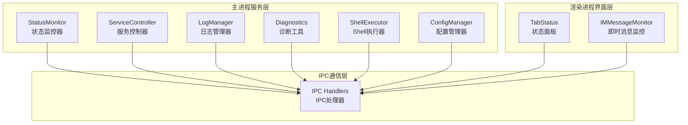
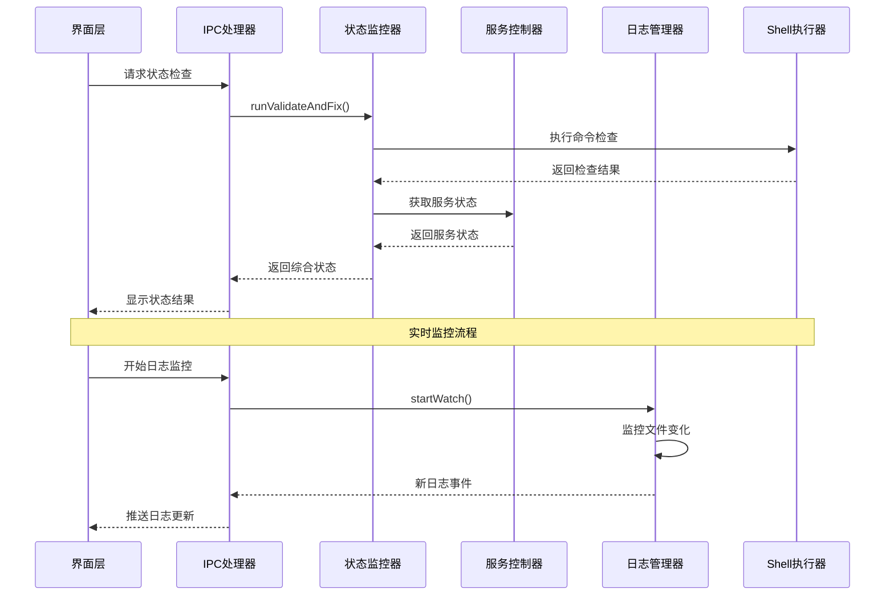
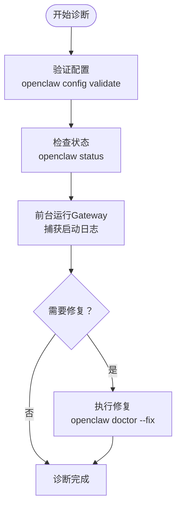
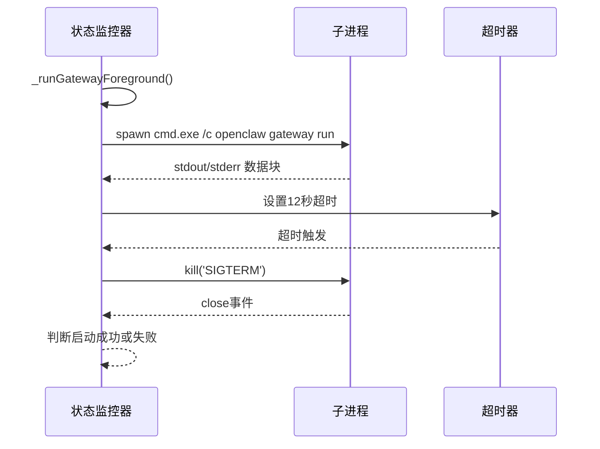
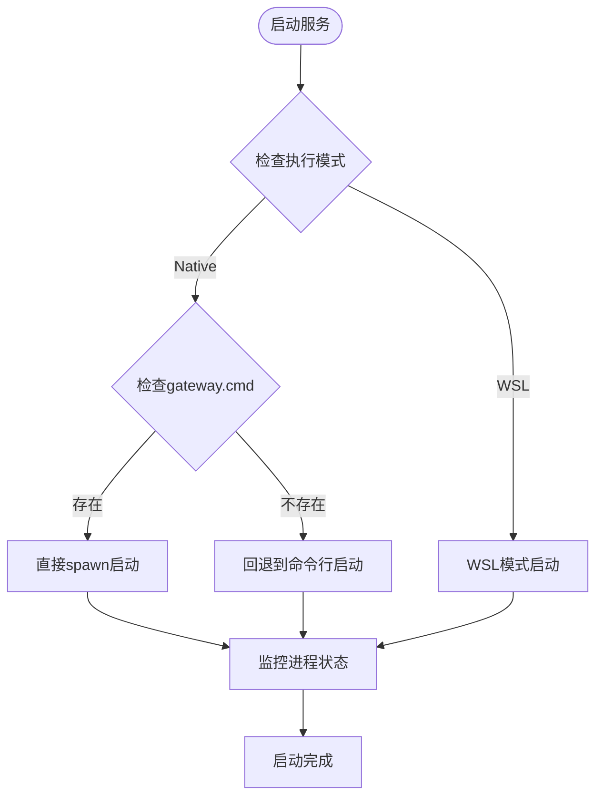
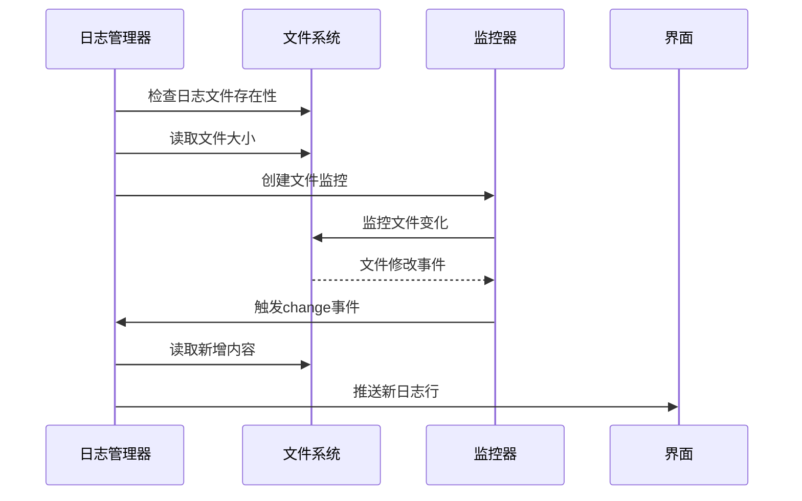
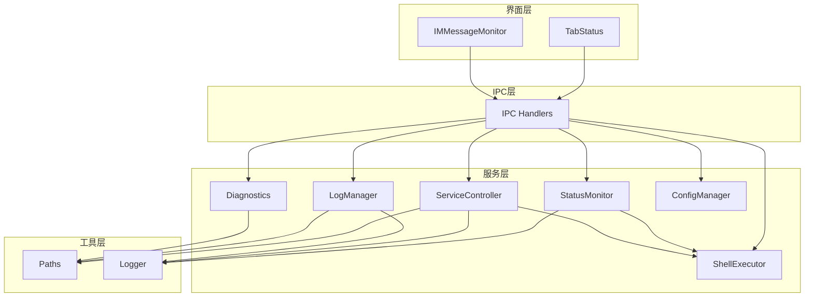

# 状态监控 API

<cite>
**本文档引用的文件**
- [status-monitor.js](file://src/main/services/status-monitor.js)
- [log-manager.js](file://src/main/services/log-manager.js)
- [diagnostics.js](file://src/main/utils/diagnostics.js)
- [tab-status.js](file://src/renderer/js/dashboard/tab-status.js)
- [ipc-handlers.js](file://src/main/ipc-handlers.js)
- [service-controller.js](file://src/main/services/service-controller.js)
- [shell-executor.js](file://src/main/utils/shell-executor.js)
- [paths.js](file://src/main/utils/paths.js)
- [chat-service.js](file://src/main/services/chat-service.js)
- [im-message-monitor.js](file://src/main/services/im-message-monitor.js)
</cite>

## 目录
1. [简介](#简介)
2. [项目结构](#项目结构)
3. [核心组件](#核心组件)
4. [架构概览](#架构概览)
5. [详细组件分析](#详细组件分析)
6. [依赖关系分析](#依赖关系分析)
7. [性能考虑](#性能考虑)
8. [故障排除指南](#故障排除指南)
9. [结论](#结论)

## 简介

状态监控 API 是 OpenClaw 安装管理器的核心功能模块，负责提供全面的系统状态检测和监控能力。该 API 覆盖了硬件资源监控、网络连接状态检查、磁盘空间检测、服务健康检查、进程存活检测、端口可用性验证、响应时间测量、实时状态更新、诊断信息收集、状态缓存和持久化等功能。

该系统采用 Electron 架构，通过 IPC 通信实现前后端分离的状态监控机制，提供了丰富的诊断工具和实时监控功能，能够帮助用户及时了解系统的运行状态并进行相应的维护操作。

## 项目结构

状态监控相关的代码主要分布在以下目录结构中：

**图表来源**
- [status-monitor.js:1-274](file://src/main/services/status-monitor.js#L1-L274)
- [ipc-handlers.js:26-816](file://src/main/ipc-handlers.js#L26-L816)

**章节来源**
- [status-monitor.js:1-274](file://src/main/services/status-monitor.js#L1-L274)
- [ipc-handlers.js:26-816](file://src/main/ipc-handlers.js#L26-L816)

## 核心组件

### 状态监控器 (StatusMonitor)

状态监控器是整个监控系统的核心组件，负责执行各种状态检查和诊断操作。其主要功能包括：

- **增强诊断功能**：执行配置验证、状态检查和自动修复
- **健康检查**：运行 doctor 命令进行系统健康检查
- **状态查询**：获取当前系统状态信息
- **版本管理**：检查最新版本信息

### 服务控制器 (ServiceController)

服务控制器负责管理 Gateway 服务的生命周期，包括启动、停止、重启和状态查询。它实现了智能的进程管理策略：

- **多模式支持**：支持 Windows 原生模式和 WSL 模式
- **进程检测**：通过端口监听和 PID 文件检测服务状态
- **智能启动**：优先使用直接启动方式，失败时回退到命令行启动
- **进程清理**：提供完整的进程终止和清理机制

### 日志管理器 (LogManager)

日志管理器提供完整的日志监控和管理功能：

- **日志读取**：支持读取指定类型的日志文件
- **实时监控**：通过文件系统监控实现日志的实时更新
- **日志信息**：提供日志文件的基本信息和元数据
- **可用日志**：自动发现和列出可用的日志文件

### 诊断工具 (Diagnostics)

诊断工具提供全面的系统诊断能力：

- **系统环境检查**：检测 Node.js、npm、Git 等依赖
- **资源文件检查**：验证必要的资源文件是否存在
- **OpenClaw 状态检查**：检查 OpenClaw 安装和配置状态
- **报告生成**：生成详细的诊断报告

**章节来源**
- [status-monitor.js:9-274](file://src/main/services/status-monitor.js#L9-L274)
- [service-controller.js:82-1101](file://src/main/services/service-controller.js#L82-L1101)
- [log-manager.js:14-169](file://src/main/services/log-manager.js#L14-L169)
- [diagnostics.js:10-196](file://src/main/utils/diagnostics.js#L10-L196)

## 架构概览

状态监控 API 采用分层架构设计，通过 IPC 通信实现前后端分离：

**图表来源**
- [ipc-handlers.js:389-417](file://src/main/ipc-handlers.js#L389-L417)
- [tab-status.js:118-128](file://src/renderer/js/dashboard/tab-status.js#L118-L128)

**章节来源**
- [ipc-handlers.js:26-816](file://src/main/ipc-handlers.js#L26-L816)
- [tab-status.js:1-460](file://src/renderer/js/dashboard/tab-status.js#L1-L460)

## 详细组件分析

### 状态监控器详细分析

状态监控器实现了复杂的诊断和监控功能，主要包括以下几个核心方法：

#### 增强诊断流程

**图表来源**
- [status-monitor.js:80-130](file://src/main/services/status-monitor.js#L80-L130)

#### 前台运行诊断

状态监控器实现了特殊的前台运行机制来捕获 Gateway 启动失败的详细信息：

**图表来源**
- [status-monitor.js:169-269](file://src/main/services/status-monitor.js#L169-L269)

**章节来源**
- [status-monitor.js:48-130](file://src/main/services/status-monitor.js#L48-L130)
- [status-monitor.js:169-269](file://src/main/services/status-monitor.js#L169-L269)

### 服务控制器详细分析

服务控制器实现了智能的服务管理策略：

#### 多模式启动策略

**图表来源**
- [service-controller.js:123-364](file://src/main/services/service-controller.js#L123-L364)

#### 进程状态检测

服务控制器通过多种方式检测服务状态：

1. **端口监听检测**：使用 `netstat` 命令检查端口监听状态
2. **PID 文件检测**：读取 `.openclaw/gateway.pid` 文件获取进程信息
3. **进程存在性检测**：通过系统命令检查进程是否存在

**章节来源**
- [service-controller.js:123-364](file://src/main/services/service-controller.js#L123-L364)
- [service-controller.js:654-770](file://src/main/services/service-controller.js#L654-L770)

### 日志管理器详细分析

日志管理器提供了完整的日志监控功能：

#### 实时日志监控机制

**图表来源**
- [log-manager.js:87-131](file://src/main/services/log-manager.js#L87-L131)

#### 日志文件发现机制

日志管理器自动发现可用的日志文件：

1. **主目录日志**：检查 `~/.openclaw/app.log`、`~/.openclaw/gateway.log`、`~/.openclaw/installer-manager.log`
2. **日志目录扫描**：扫描 `~/.openclaw/logs/` 目录下的所有 `.log` 文件
3. **动态发现**：实时检测新创建的日志文件

**章节来源**
- [log-manager.js:87-165](file://src/main/services/log-manager.js#L87-L165)

### 诊断工具详细分析

诊断工具提供了全面的系统诊断能力：

#### 系统环境检查

诊断工具检查以下系统环境：

- **操作系统信息**：平台、架构、用户目录
- **Node.js 环境**：版本、安装状态
- **npm 环境**：版本、安装状态  
- **Git 环境**：版本、安装状态
- **资源文件**：Node.js 安装包、Git 安装包的存在性

#### OpenClaw 状态检查

诊断工具检查 OpenClaw 的安装和配置状态：

- **安装检测**：检查 `~/.openclaw` 目录是否存在
- **版本信息**：获取当前安装的 OpenClaw 版本
- **配置文件**：读取和验证 `openclaw.json` 配置文件
- **配置目录**：检查配置目录的完整性

**章节来源**
- [diagnostics.js:14-44](file://src/main/utils/diagnostics.js#L14-L44)
- [diagnostics.js:114-146](file://src/main/utils/diagnostics.js#L114-L146)

## 依赖关系分析

状态监控 API 的依赖关系呈现清晰的分层结构：

**图表来源**
- [ipc-handlers.js:26-51](file://src/main/ipc-handlers.js#L26-L51)
- [paths.js:1-124](file://src/main/utils/paths.js#L1-L124)

### 关键依赖关系

1. **ShellExecutor 依赖**：所有命令执行都依赖 ShellExecutor 进行跨平台兼容
2. **路径管理依赖**：所有文件操作都依赖 Paths 工具获取正确的路径
3. **日志依赖**：日志管理依赖 Logger 进行统一的日志记录
4. **配置依赖**：配置管理依赖 ConfigManager 进行配置读写

**章节来源**
- [ipc-handlers.js:1-816](file://src/main/ipc-handlers.js#L1-L816)
- [paths.js:1-124](file://src/main/utils/paths.js#L1-L124)

## 性能考虑

状态监控 API 在设计时充分考虑了性能优化：

### 缓存策略

1. **Gateway 探测缓存**：聊天服务对 Gateway 可用性检测结果缓存 30 秒
2. **执行模式缓存**：ShellExecutor 缓存执行模式配置
3. **配置文件缓存**：避免频繁的文件系统访问

### 超时控制

1. **命令执行超时**：默认 5 分钟超时，防止长时间阻塞
2. **健康检查超时**：Gateway 探测超时 1.5 秒
3. **启动超时**：服务启动超时 30 秒

### 内存管理

1. **日志缓冲区限制**：最多收集 8KB 的启动日志，避免内存溢出
2. **文件监控优化**：使用增量读取方式，只处理新增内容
3. **进程监控优化**：使用端口检测而非进程遍历，提高效率

## 故障排除指南

### 常见问题诊断

#### Gateway 启动失败

当 Gateway 启动失败时，系统会提供详细的诊断信息：

1. **配置错误**：通过 `openclaw config validate` 检测配置问题
2. **端口冲突**：检查端口是否被其他进程占用
3. **版本过旧**：提示更新到最新版本
4. **权限问题**：检查文件权限和执行权限

#### 日志监控问题

如果日志监控功能出现问题：

1. **文件权限**：检查日志文件的读取权限
2. **文件锁定**：某些编辑器可能锁定日志文件
3. **磁盘空间**：检查磁盘空间是否充足
4. **文件系统监控**：某些文件系统不支持实时监控

#### 网络连接问题

对于网络连接问题：

1. **防火墙设置**：检查防火墙是否阻止了连接
2. **代理配置**：检查系统代理设置
3. **DNS 解析**：测试 DNS 解析是否正常
4. **网络路由**：检查网络路由配置

**章节来源**
- [service-controller.js:314-338](file://src/main/services/service-controller.js#L314-L338)
- [log-manager.js:124-130](file://src/main/services/log-manager.js#L124-L130)

## 结论

状态监控 API 提供了全面而强大的系统监控能力，涵盖了从基础的硬件资源监控到高级的诊断分析功能。通过合理的架构设计和优化策略，该系统能够在保证功能完整性的同时，提供良好的用户体验和性能表现。

主要特点包括：

1. **全面的监控范围**：从系统环境到具体服务的全方位监控
2. **智能的诊断能力**：自动检测问题并提供修复建议
3. **实时的状态更新**：通过 IPC 机制实现实时状态推送
4. **完善的日志管理**：提供完整的日志监控和分析功能
5. **跨平台兼容性**：支持 Windows 和 WSL 环境
6. **性能优化**：通过缓存和超时控制确保系统响应性

该状态监控 API 为 OpenClaw 安装管理器提供了坚实的技术基础，能够帮助用户及时发现和解决系统问题，确保 OpenClaw 服务的稳定运行。