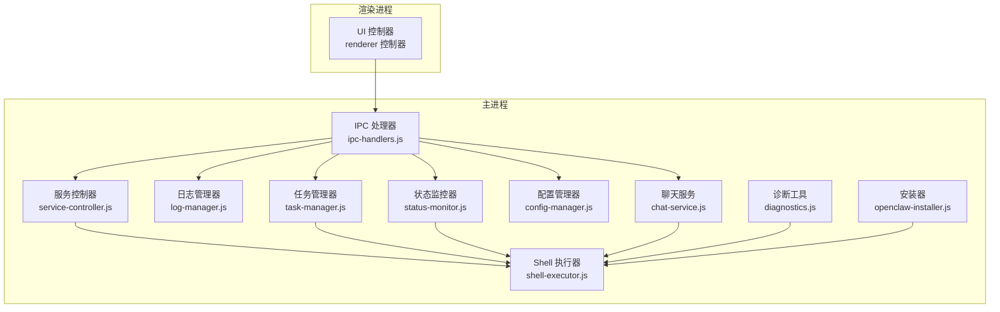
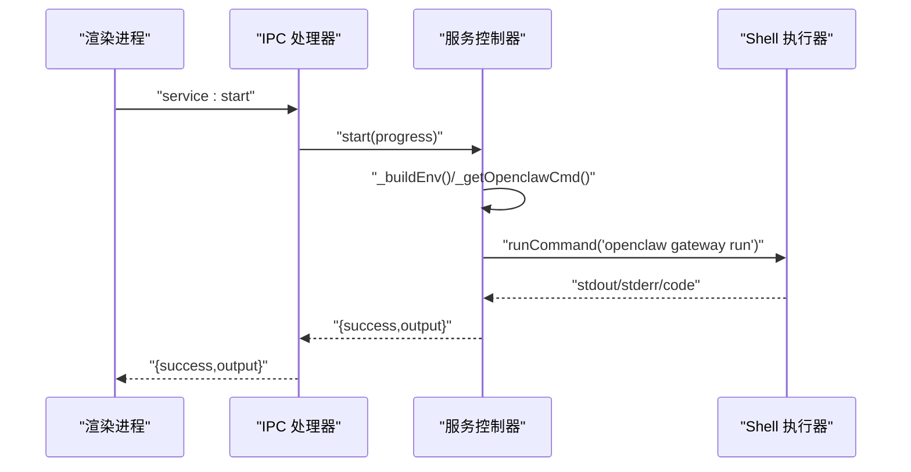
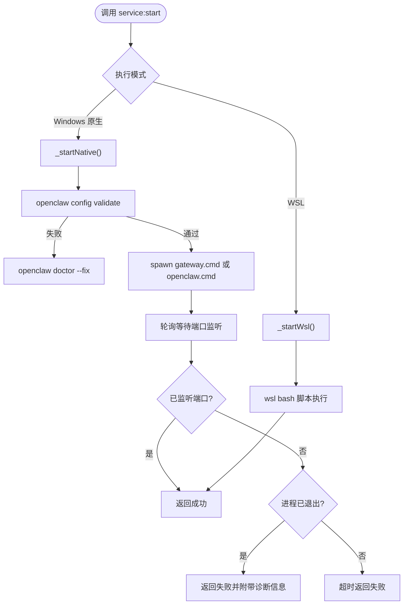
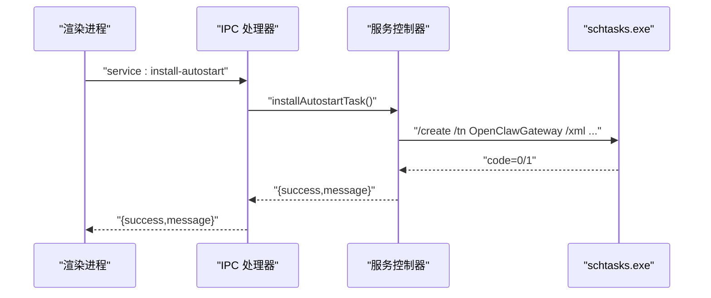
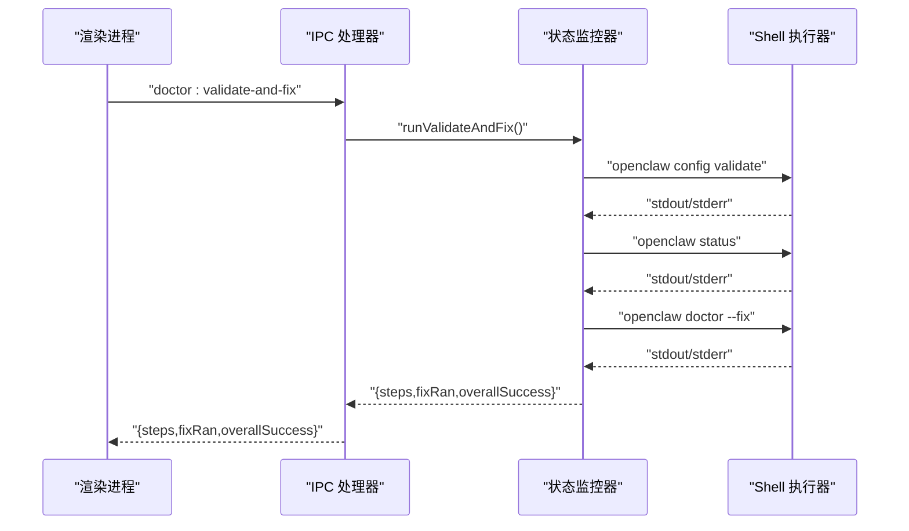
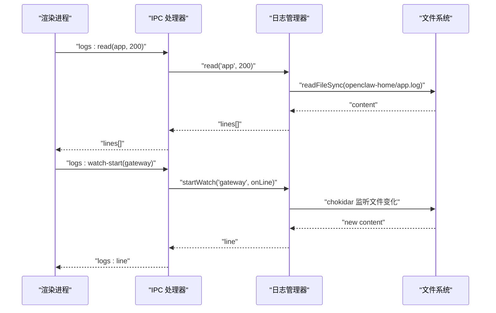
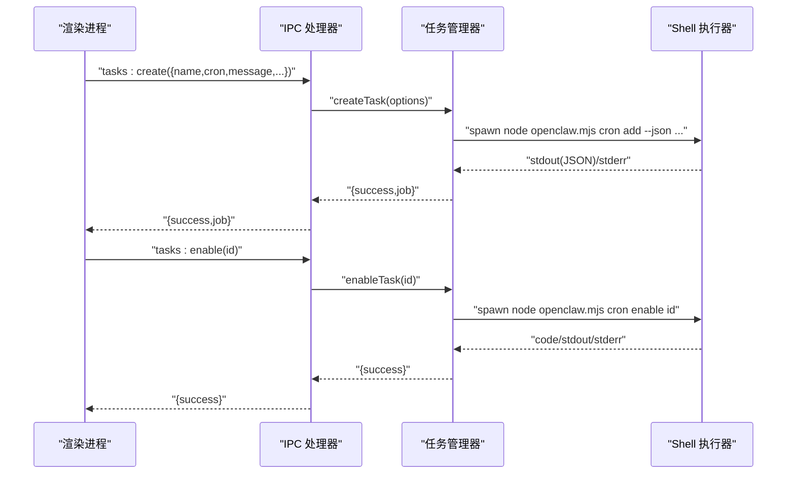
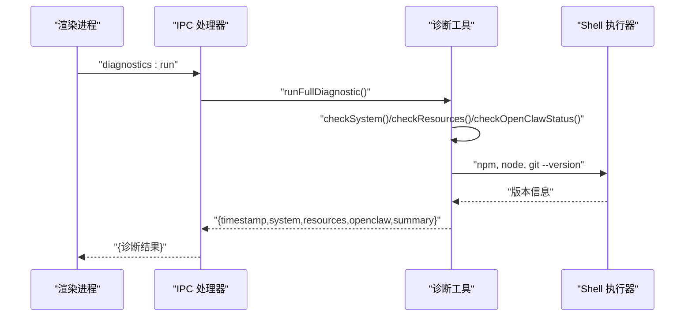
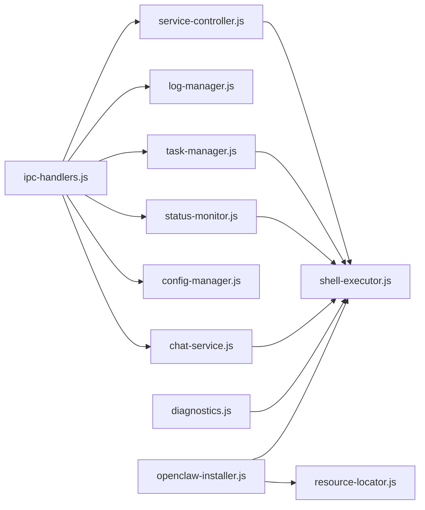

# 系统服务 API

<cite>
**本文档引用的文件**
- [service-controller.js](file://src/main/services/service-controller.js)
- [log-manager.js](file://src/main/services/log-manager.js)
- [task-manager.js](file://src/main/services/task-manager.js)
- [status-monitor.js](file://src/main/services/status-monitor.js)
- [ipc-handlers.js](file://src/main/ipc-handlers.js)
- [config-manager.js](file://src/main/services/config-manager.js)
- [diagnostics.js](file://src/main/utils/diagnostics.js)
- [shell-executor.js](file://src/main/utils/shell-executor.js)
- [openclaw-installer.js](file://src/main/services/openclaw-installer.js)
- [chat-service.js](file://src/main/services/chat-service.js)
</cite>

## 目录
1. [简介](#简介)
2. [项目结构](#项目结构)
3. [核心组件](#核心组件)
4. [架构总览](#架构总览)
5. [详细组件分析](#详细组件分析)
6. [依赖关系分析](#依赖关系分析)
7. [性能考虑](#性能考虑)
8. [故障排除指南](#故障排除指南)
9. [结论](#结论)

## 简介
本文件面向系统服务 API 的使用者与维护者，系统性梳理并文档化以下能力：
- 服务生命周期管理：启动、停止、重启、状态查询
- 自动启动配置：开机自启计划任务的创建、查询与禁用
- 服务监控与健康检查：基于 Gateway 的健康检查与状态探测
- 日志管理 API：日志读取、实时监控与可用日志枚举
- 任务调度接口：定时任务的创建、编辑、启用、禁用、删除、运行与历史查询
- 诊断工具 API：系统检查、错误修复与性能分析
- 服务发现与资源监控：Gateway 探测、配置读取与资源定位

## 项目结构
系统采用主进程-渲染进程分离的架构，主进程通过 IPC 暴露服务 API，渲染进程负责 UI 展示与交互。

**图表来源**
- [ipc-handlers.js:26-816](file://src/main/ipc-handlers.js#L26-L816)
- [service-controller.js:82-1101](file://src/main/services/service-controller.js#L82-L1101)
- [log-manager.js:14-169](file://src/main/services/log-manager.js#L14-L169)
- [task-manager.js:57-735](file://src/main/services/task-manager.js#L57-L735)
- [status-monitor.js:9-274](file://src/main/services/status-monitor.js#L9-L274)
- [config-manager.js:6-264](file://src/main/services/config-manager.js#L6-L264)
- [diagnostics.js:10-196](file://src/main/utils/diagnostics.js#L10-L196)
- [shell-executor.js:62-471](file://src/main/utils/shell-executor.js#L62-L471)
- [openclaw-installer.js:10-780](file://src/main/services/openclaw-installer.js#L10-L780)
- [chat-service.js:92-200](file://src/main/services/chat-service.js#L92-L200)

**章节来源**
- [ipc-handlers.js:26-816](file://src/main/ipc-handlers.js#L26-L816)

## 核心组件
- 服务控制器：封装 Gateway 服务的启动、停止、重启、状态查询与开机自启管理
- 日志管理器：提供日志读取、实时监控与可用日志枚举
- 任务管理器：封装 openclaw cron 命令，提供任务 CRUD、启用禁用、运行与历史查询
- 状态监控器：提供 doctor、validate-and-fix、status 等诊断能力
- 配置管理器：提供 openclaw.json 读写与认证配置管理
- Shell 执行器：统一跨平台命令执行、流式输出与执行模式适配
- 诊断工具：系统环境、资源与 OpenClaw 状态检查
- 安装器：OpenClaw 安装、更新与配置文件预生成
- 聊天服务：Gateway HTTP API 调用与 CLI 降级流式对话

**章节来源**
- [service-controller.js:82-1101](file://src/main/services/service-controller.js#L82-L1101)
- [log-manager.js:14-169](file://src/main/services/log-manager.js#L14-L169)
- [task-manager.js:57-735](file://src/main/services/task-manager.js#L57-L735)
- [status-monitor.js:9-274](file://src/main/services/status-monitor.js#L9-L274)
- [config-manager.js:6-264](file://src/main/services/config-manager.js#L6-L264)
- [diagnostics.js:10-196](file://src/main/utils/diagnostics.js#L10-L196)
- [shell-executor.js:62-471](file://src/main/utils/shell-executor.js#L62-L471)
- [openclaw-installer.js:10-780](file://src/main/services/openclaw-installer.js#L10-L780)
- [chat-service.js:92-200](file://src/main/services/chat-service.js#L92-L200)

## 架构总览
系统通过 IPC 将渲染进程的请求路由到各服务模块，服务模块通过 Shell 执行器与系统命令交互，实现对 Gateway、openclaw CLI 与系统资源的统一管理。

**图表来源**
- [ipc-handlers.js:350-375](file://src/main/ipc-handlers.js#L350-L375)
- [service-controller.js:123-364](file://src/main/services/service-controller.js#L123-L364)
- [shell-executor.js:136-197](file://src/main/utils/shell-executor.js#L136-L197)

## 详细组件分析

### 服务生命周期管理 API
- 启动服务
  - IPC: `service:start`
  - 实现：根据执行模式选择 Windows 原生或 WSL 启动路径，优先使用 gateway.cmd，失败回退 openclaw.cmd；内置配置校验与 doctor --fix；支持进度回调
- 停止服务
  - IPC: `service:stop`
  - 实现：Windows 原生模式使用 taskkill 终止进程树；WSL 模式通过 wsl 执行停止脚本
- 重启服务
  - IPC: `service:restart`
  - 实现：先 stop，延时后 start；触发 Gateway 缓存失效
- 查询状态
  - IPC: `service:get-status`
  - 实现：Windows 原生模式通过 netstat + PID 文件判定；WSL 模式通过 wsl 脚本查询
- 获取/设置开机自启
  - IPC: `service:get-autostart`, `service:set-autostart`, `service:install-autostart`
  - 实现：Windows 平台通过 schtasks.exe 创建/删除计划任务；任务名为 OpenClawGateway；支持注入 autostart_disabled 标志文件

**图表来源**
- [service-controller.js:123-364](file://src/main/services/service-controller.js#L123-L364)
- [service-controller.js:528-552](file://src/main/services/service-controller.js#L528-L552)
- [service-controller.js:834-850](file://src/main/services/service-controller.js#L834-L850)

**章节来源**
- [ipc-handlers.js:350-387](file://src/main/ipc-handlers.js#L350-L387)
- [service-controller.js:123-364](file://src/main/services/service-controller.js#L123-L364)
- [service-controller.js:528-552](file://src/main/services/service-controller.js#L528-L552)
- [service-controller.js:834-1097](file://src/main/services/service-controller.js#L834-L1097)

### 自动启动配置
- 查询状态：返回 `{ enabled, taskExists }`
- 设置自启：创建/删除计划任务，任务名为 OpenClawGateway，登录时以当前用户身份运行
- 安装自启：生成 UTF-16 LE 编码 XML，使用 schtasks /create /xml 导入，避免引号转义问题

**图表来源**
- [service-controller.js:933-997](file://src/main/services/service-controller.js#L933-L997)
- [service-controller.js:1054-1065](file://src/main/services/service-controller.js#L1054-L1065)

**章节来源**
- [service-controller.js:907-1097](file://src/main/services/service-controller.js#L907-L1097)

### 服务监控与健康检查
- 健康检查：调用 openclaw gateway health（Windows 原生或 WSL）
- 增强诊断：config validate → status → doctor --fix（有错时）
- 状态查询：openclaw status

**图表来源**
- [status-monitor.js:80-130](file://src/main/services/status-monitor.js#L80-L130)
- [status-monitor.js:132-147](file://src/main/services/status-monitor.js#L132-L147)
- [status-monitor.js:169-269](file://src/main/services/status-monitor.js#L169-L269)

**章节来源**
- [status-monitor.js:48-147](file://src/main/services/status-monitor.js#L48-L147)
- [status-monitor.js:169-269](file://src/main/services/status-monitor.js#L169-L269)

### 日志管理 API
- 读取日志：`logs:read(logType, lines)` → 返回最近 N 行
- 获取日志信息：`logs:getInfo(logType)` → 返回存在性、大小、修改时间、描述
- 实时监控：`logs:watch-start(logType)` 开始监听，`logs:watch-stop()` 停止监听
- 可用日志枚举：扫描 OPENCLAW_HOME 与 LOGS_DIR 下的 .log 文件

**图表来源**
- [ipc-handlers.js:399-416](file://src/main/ipc-handlers.js#L399-L416)
- [log-manager.js:42-85](file://src/main/services/log-manager.js#L42-L85)
- [log-manager.js:87-140](file://src/main/services/log-manager.js#L87-L140)

**章节来源**
- [ipc-handlers.js:399-416](file://src/main/ipc-handlers.js#L399-L416)
- [log-manager.js:14-169](file://src/main/services/log-manager.js#L14-L169)

### 任务调度接口
- 列表：`tasks:list(includeDisabled)`
- 创建：`tasks:create(options)` 支持 name/message/cron/every/at/tz/model/session/description/timeout/disabled/announce/channel/to
- 编辑：`tasks:edit(taskId, options)` 支持 name/message/cron/every/tz/model/description/timeout/投递选项
- 启用/禁用：`tasks:enable(taskId)`, `tasks:disable(taskId)`
- 删除：`tasks:delete(taskId)`（内部二次验证）
- 立即运行：`tasks:run(taskId)`
- 历史查询：`tasks:history(taskId, limit)`
- 调度器状态：`tasks:status`

**图表来源**
- [ipc-handlers.js:672-707](file://src/main/ipc-handlers.js#L672-L707)
- [task-manager.js:332-401](file://src/main/services/task-manager.js#L332-L401)
- [task-manager.js:479-504](file://src/main/services/task-manager.js#L479-L504)

**章节来源**
- [ipc-handlers.js:672-707](file://src/main/ipc-handlers.js#L672-L707)
- [task-manager.js:57-735](file://src/main/services/task-manager.js#L57-L735)

### 诊断工具 API
- 运行完整诊断：`diagnostics:run` → 返回系统、资源、OpenClaw 状态与总结
- 保存诊断报告：`diagnostics:save-report` → 生成并保存到用户目录
- doctor：`doctor:run` → openclaw doctor
- validate-and-fix：`doctor:validate-and-fix` → config validate → status → doctor --fix

**图表来源**
- [diagnostics.js:14-44](file://src/main/utils/diagnostics.js#L14-L44)
- [diagnostics.js:114-146](file://src/main/utils/diagnostics.js#L114-L146)

**章节来源**
- [diagnostics.js:10-196](file://src/main/utils/diagnostics.js#L10-L196)
- [ipc-handlers.js:663-671](file://src/main/ipc-handlers.js#L663-L671)

### 配置与安装
- 配置读写：`config:read`, `config:write`, `config:get-path`
- 认证配置：`config:read-auth-profiles`, `config:write-auth-profiles`, `config:set-provider-apikey`, `config:remove-provider-apikey`
- 模型配置：`config:read-models`, `config:write-models`, `config:set-provider-models`
- 安装/更新：`install:get-version`, `install:run`, `install:update`
- 安装器会预创建必要配置文件与目录结构

**章节来源**
- [ipc-handlers.js:208-264](file://src/main/ipc-handlers.js#L208-L264)
- [config-manager.js:6-264](file://src/main/services/config-manager.js#L6-L264)
- [openclaw-installer.js:24-115](file://src/main/services/openclaw-installer.js#L24-L115)
- [openclaw-installer.js:117-438](file://src/main/services/openclaw-installer.js#L117-L438)
- [openclaw-installer.js:440-532](file://src/main/services/openclaw-installer.js#L440-L532)

### 聊天服务与资源监控
- 聊天服务：优先使用 Gateway HTTP SSE API，失败时降级到 CLI 模式
- 资源监控：Shell 执行器提供统一的命令执行、流式输出与执行模式适配
- 资源定位：ResourceLocator 统一开发/打包环境下的资源路径

**章节来源**
- [chat-service.js:92-200](file://src/main/services/chat-service.js#L92-L200)
- [shell-executor.js:62-471](file://src/main/utils/shell-executor.js#L62-L471)
- [resource-locator.js:10-146](file://src/main/utils/resource-locator.js#L10-L146)

## 依赖关系分析
- IPC 处理器集中注册所有 API，向下委托具体服务模块
- 服务控制器依赖 Shell 执行器执行 openclaw 命令
- 任务管理器通过 Shell 执行器调用 openclaw.mjs 的 cron 子命令
- 状态监控器与诊断工具同样依赖 Shell 执行器
- 安装器在安装/更新过程中大量使用 Shell 执行器与资源定位器

**图表来源**
- [ipc-handlers.js:26-816](file://src/main/ipc-handlers.js#L26-L816)
- [service-controller.js:82-1101](file://src/main/services/service-controller.js#L82-L1101)
- [log-manager.js:14-169](file://src/main/services/log-manager.js#L14-L169)
- [task-manager.js:57-735](file://src/main/services/task-manager.js#L57-L735)
- [status-monitor.js:9-274](file://src/main/services/status-monitor.js#L9-L274)
- [config-manager.js:6-264](file://src/main/services/config-manager.js#L6-L264)
- [diagnostics.js:10-196](file://src/main/utils/diagnostics.js#L10-L196)
- [shell-executor.js:62-471](file://src/main/utils/shell-executor.js#L62-L471)
- [openclaw-installer.js:10-780](file://src/main/services/openclaw-installer.js#L10-L780)
- [resource-locator.js:10-146](file://src/main/utils/resource-locator.js#L10-L146)

**章节来源**
- [ipc-handlers.js:26-816](file://src/main/ipc-handlers.js#L26-L816)

## 性能考虑
- 启动阶段：内置超时与轮询，避免长时间阻塞；失败时收集 stderr 便于诊断
- 任务管理：对任务列表设置缓存 TTL，减少频繁调用 openclaw CLI 的开销
- 日志监控：使用 chokidar + 增量读取，避免全量扫描
- Shell 执行：统一编码解码与超时控制，避免长时间挂起
- Gateway 探测：缓存可用性与 404 结果，降低网络请求频率

[本节为通用指导，无需具体文件分析]

## 故障排除指南
- 启动失败排查
  - 检查 openclaw config validate 与 doctor --fix
  - 查看 stderr 日志与端口占用情况
  - 确认 gateway.cmd 是否存在以及 PATH 是否包含 node.exe
- 停止失败排查
  - 使用 taskkill /F /T /PID 强制终止进程树
  - 清理 PID 文件并验证端口已释放
- 任务调度异常
  - 检查 Gateway 连接瞬时错误（如连接被拒绝）是否导致失败
  - 使用缓存数据回退，避免 UI 报错
- 日志监控异常
  - 确认日志文件存在且可读
  - 检查 chokidar 监听是否正常
- 诊断与修复
  - 使用 doctor:validate-and-fix 自动修复配置与状态问题
  - 保存诊断报告至用户目录进行问题复现与分析

**章节来源**
- [service-controller.js:158-338](file://src/main/services/service-controller.js#L158-L338)
- [service-controller.js:569-617](file://src/main/services/service-controller.js#L569-L617)
- [task-manager.js:262-327](file://src/main/services/task-manager.js#L262-L327)
- [log-manager.js:87-140](file://src/main/services/log-manager.js#L87-L140)
- [status-monitor.js:80-130](file://src/main/services/status-monitor.js#L80-L130)
- [diagnostics.js:148-192](file://src/main/utils/diagnostics.js#L148-L192)

## 结论
本系统通过统一的 IPC 接口与模块化设计，提供了从服务生命周期管理、日志监控、任务调度到诊断修复的完整能力。服务控制器与 Shell 执行器承担了跨平台命令执行的关键职责，任务管理器与状态监控器进一步增强了自动化与可观测性。建议在生产环境中结合健康检查与缓存策略，提升用户体验与系统稳定性。