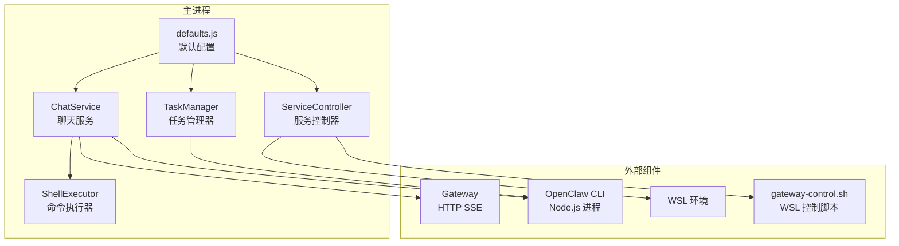
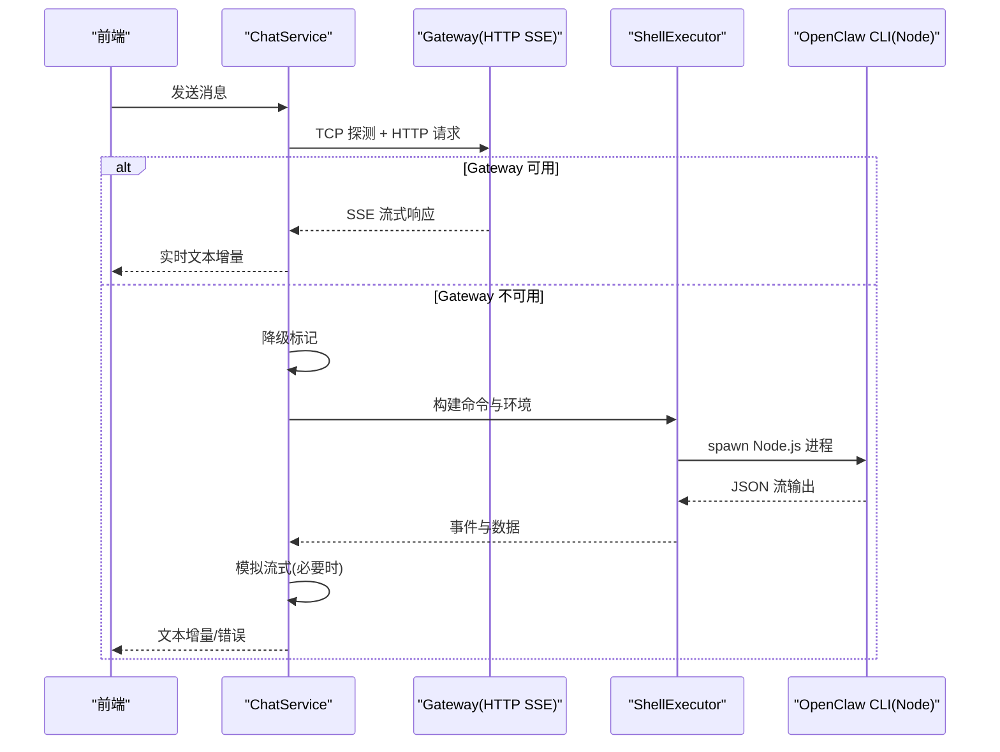
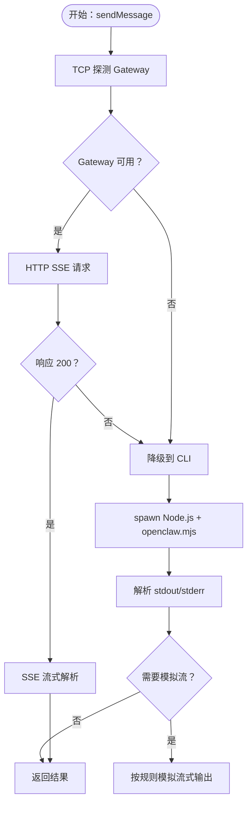
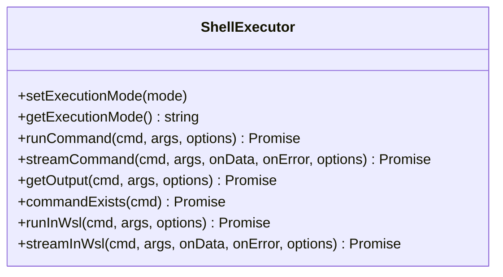
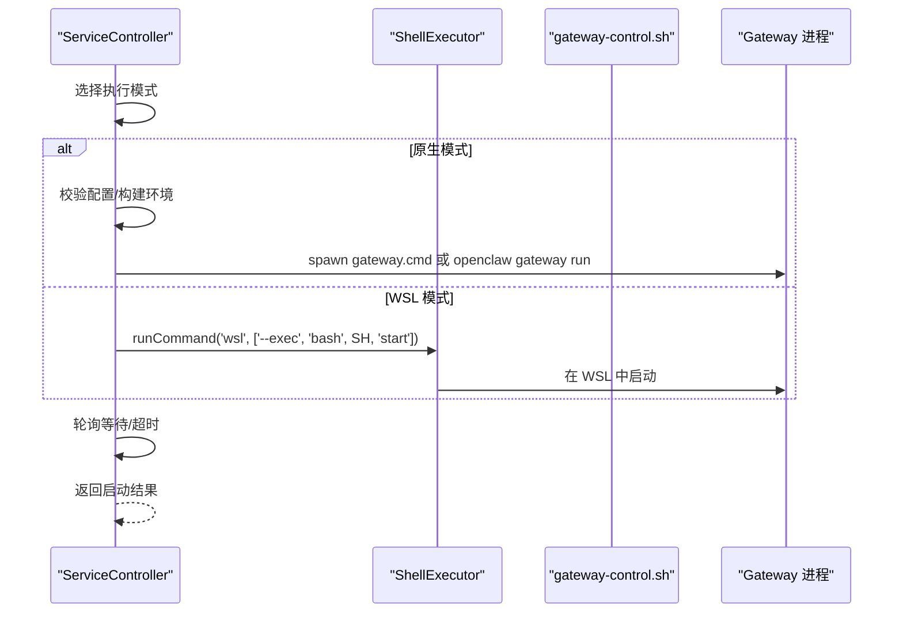
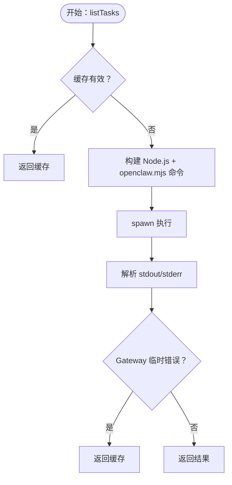
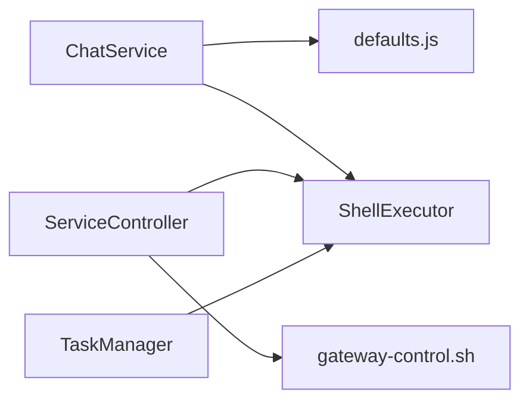

# CLI 降级处理

<cite>
**本文档引用的文件**
- [chat-service.js](file://src/main/services/chat-service.js)
- [shell-executor.js](file://src/main/utils/shell-executor.js)
- [defaults.js](file://src/main/config/defaults.js)
- [service-controller.js](file://src/main/services/service-controller.js)
- [task-manager.js](file://src/main/services/task-manager.js)
- [gateway-control.sh](file://scripts/gateway-control.sh)
</cite>

## 目录
1. [简介](#简介)
2. [项目结构](#项目结构)
3. [核心组件](#核心组件)
4. [架构总览](#架构总览)
5. [详细组件分析](#详细组件分析)
6. [依赖关系分析](#依赖关系分析)
7. [性能考虑](#性能考虑)
8. [故障排除指南](#故障排除指南)
9. [结论](#结论)

## 简介
本文件系统性记录了 CLI 降级处理功能的设计与实现，涵盖触发条件、降级机制、命令构建与执行流程、参数传递与环境变量配置、模拟流式响应实现、超时与错误恢复策略，以及与 Gateway 模式的差异对比与性能影响分析。目标是帮助开发者与运维人员快速理解并高效排障。

## 项目结构
与 CLI 降级处理直接相关的模块主要分布在以下文件：
- 聊天服务：负责 Gateway 优先的真流式对话与 CLI 降级处理
- Shell 执行器：封装命令执行、流式输出与环境变量处理
- 配置默认值：集中管理超时、网络等参数
- 服务控制器：Gateway 启停与状态查询，支持原生与 WSL 两种执行模式
- 任务管理器：定时任务通过 CLI 方式执行，体现降级策略的通用性
- 网关控制脚本：WSL 模式下的 Gateway 启停

**图表来源**
- [chat-service.js:92-116](file://src/main/services/chat-service.js#L92-L116)
- [shell-executor.js:62-108](file://src/main/utils/shell-executor.js#L62-L108)
- [service-controller.js:82-90](file://src/main/services/service-controller.js#L82-L90)
- [task-manager.js:57-63](file://src/main/services/task-manager.js#L57-L63)
- [defaults.js:14-70](file://src/main/config/defaults.js#L14-L70)

**章节来源**
- [chat-service.js:1-116](file://src/main/services/chat-service.js#L1-L116)
- [shell-executor.js:1-108](file://src/main/utils/shell-executor.js#L1-L108)
- [defaults.js:14-70](file://src/main/config/defaults.js#L14-L70)
- [service-controller.js:82-90](file://src/main/services/service-controller.js#L82-L90)
- [task-manager.js:57-63](file://src/main/services/task-manager.js#L57-L63)

## 核心组件
- ChatService：实现 Gateway 优先的真流式对话，失败时自动降级到 CLI 模式；支持模拟流式输出与会话锁清理。
- ShellExecutor：统一命令执行入口，支持原生与 WSL 双模式，处理编码、超时、流式输出与环境变量注入。
- ServiceController：Gateway 启停与状态查询，支持原生与 WSL 模式，内置超时与诊断逻辑。
- TaskManager：通过 CLI 执行定时任务，体现降级策略在不同场景的一致性。
- defaults.js：集中管理超时、网络等参数，确保各组件行为一致。

**章节来源**
- [chat-service.js:92-116](file://src/main/services/chat-service.js#L92-L116)
- [shell-executor.js:62-108](file://src/main/utils/shell-executor.js#L62-L108)
- [service-controller.js:82-90](file://src/main/services/service-controller.js#L82-L90)
- [task-manager.js:57-63](file://src/main/services/task-manager.js#L57-L63)
- [defaults.js:14-70](file://src/main/config/defaults.js#L14-L70)

## 架构总览
Gateway 优先的对话流程：ChatService 先尝试通过 HTTP SSE 连接 Gateway；若探测失败、404、连接错误或超时，则降级到 CLI 模式。CLI 模式通过 Node.js 直接调用 openclaw.mjs，支持 --local 模式绕过 Gateway 路由，同时提供模拟流式体验与完备的错误恢复。

**图表来源**
- [chat-service.js:347-536](file://src/main/services/chat-service.js#L347-L536)
- [chat-service.js:968-1000](file://src/main/services/chat-service.js#L968-L1000)
- [shell-executor.js:136-197](file://src/main/utils/shell-executor.js#L136-L197)

**章节来源**
- [chat-service.js:347-536](file://src/main/services/chat-service.js#L347-L536)
- [chat-service.js:968-1000](file://src/main/services/chat-service.js#L968-L1000)
- [shell-executor.js:136-197](file://src/main/utils/shell-executor.js#L136-L197)

## 详细组件分析

### ChatService：Gateway 优先与 CLI 降级
- Gateway 探测：使用 TCP connect 快速探测端口可达性，1.5 秒超时，结果缓存 30 秒，避免频繁探测带来的延迟。
- SSE 流式处理：收到 200 响应头即通知前端“连接阶段结束”，随后逐块解析 SSE 数据帧，过滤角色帧，仅推送内容增量。
- 降级触发条件：
  - TCP 探测失败
  - 404 端点
  - HTTP 非 200（401/403/5xx）
  - 连接错误或超时
- CLI 降级流程：构造 Node.js + openclaw.mjs 命令，注入 API Key 等环境变量，spawn 子进程，解析 stdout/stderr，必要时模拟流式输出。
- 会话锁清理：在 CLI 调用前清理过期 session lock，避免因进程崩溃遗留锁导致超时。
- 会话大小控制：当 session 文件超过 50KB 时主动删除，防止上下文过多导致推理超时。

**图表来源**
- [chat-service.js:154-182](file://src/main/services/chat-service.js#L154-L182)
- [chat-service.js:347-536](file://src/main/services/chat-service.js#L347-L536)
- [chat-service.js:968-1000](file://src/main/services/chat-service.js#L968-L1000)
- [chat-service.js:1005-1280](file://src/main/services/chat-service.js#L1005-L1280)

**章节来源**
- [chat-service.js:154-182](file://src/main/services/chat-service.js#L154-L182)
- [chat-service.js:347-536](file://src/main/services/chat-service.js#L347-L536)
- [chat-service.js:968-1000](file://src/main/services/chat-service.js#L968-L1000)
- [chat-service.js:1005-1280](file://src/main/services/chat-service.js#L1005-L1280)

### ShellExecutor：命令执行与环境管理
- 执行模式：支持原生与 WSL 双模式，WSL 模式通过 `wsl --exec bash -c` 包装命令，避免 PATH 问题。
- 编码处理：针对 Windows GBK 编码进行识别与清洗，避免乱码影响输出解析。
- 超时控制：runCommand/streamCommand 支持自定义超时，默认 5 分钟；WSL 模式下同样生效。
- 环境变量：自动注入 LANG/LC_ALL 为 UTF-8，WSL 模式下清理 PATH 避免空格导致的导出错误。
- 命令存在性检测：在 WSL 模式下通过 `which` 检测命令，在原生模式下通过 `where` 与 PATH 组合检测。

**图表来源**
- [shell-executor.js:62-108](file://src/main/utils/shell-executor.js#L62-L108)
- [shell-executor.js:136-197](file://src/main/utils/shell-executor.js#L136-L197)
- [shell-executor.js:208-281](file://src/main/utils/shell-executor.js#L208-L281)
- [shell-executor.js:301-350](file://src/main/utils/shell-executor.js#L301-L350)

**章节来源**
- [shell-executor.js:62-108](file://src/main/utils/shell-executor.js#L62-L108)
- [shell-executor.js:136-197](file://src/main/utils/shell-executor.js#L136-L197)
- [shell-executor.js:208-281](file://src/main/utils/shell-executor.js#L208-L281)
- [shell-executor.js:301-350](file://src/main/utils/shell-executor.js#L301-L350)

### ServiceController：Gateway 启停与状态
- 模式适配：根据执行模式选择原生或 WSL 启停策略；WSL 模式通过 gateway-control.sh 脚本控制。
- 启动流程：先校验配置，再尝试直接 spawn gateway.cmd（无 UAC），失败则回退到 openclaw gateway run；内置超时与诊断日志。
- 停止流程：原生模式使用 taskkill 终止进程树，WSL 模式通过脚本停止；清理 PID 文件并二次验证端口状态。
- 状态查询：原生模式通过 netstat 查询端口监听与 PID，WSL 模式通过脚本查询。

**图表来源**
- [service-controller.js:123-364](file://src/main/services/service-controller.js#L123-L364)
- [service-controller.js:528-552](file://src/main/services/service-controller.js#L528-L552)
- [gateway-control.sh:12-30](file://scripts/gateway-control.sh#L12-L30)

**章节来源**
- [service-controller.js:123-364](file://src/main/services/service-controller.js#L123-L364)
- [service-controller.js:528-552](file://src/main/services/service-controller.js#L528-L552)
- [gateway-control.sh:12-30](file://scripts/gateway-control.sh#L12-L30)

### TaskManager：CLI 执行定时任务
- 通过 Node.js 直接调用 openclaw.mjs，支持 cron/list/run 等子命令。
- 参数格式化：使用 "=" 分隔符处理带空格的参数值，避免 CMD 解析问题。
- 错误恢复：对 Gateway 临时性连接错误（如重启中）采用缓存数据兜底，提升稳定性。

**图表来源**
- [task-manager.js:276-327](file://src/main/services/task-manager.js#L276-L327)
- [task-manager.js:161-256](file://src/main/services/task-manager.js#L161-L256)

**章节来源**
- [task-manager.js:276-327](file://src/main/services/task-manager.js#L276-L327)
- [task-manager.js:161-256](file://src/main/services/task-manager.js#L161-L256)

## 依赖关系分析
- ChatService 依赖 defaults.js 的超时与网络配置，依赖 ShellExecutor 进行命令执行与环境注入。
- ServiceController 依赖 ShellExecutor 进行跨模式命令执行，并依赖 gateway-control.sh 在 WSL 模式下启停 Gateway。
- TaskManager 与 ChatService 类似，均通过 Node.js 直接调用 openclaw.mjs，体现降级策略的统一性。

**图表来源**
- [chat-service.js:21-21](file://src/main/services/chat-service.js#L21-L21)
- [defaults.js:14-70](file://src/main/config/defaults.js#L14-L70)
- [service-controller.js:1-9](file://src/main/services/service-controller.js#L1-L9)
- [task-manager.js:9-16](file://src/main/services/task-manager.js#L9-L16)

**章节来源**
- [chat-service.js:21-21](file://src/main/services/chat-service.js#L21-L21)
- [defaults.js:14-70](file://src/main/config/defaults.js#L14-L70)
- [service-controller.js:1-9](file://src/main/services/service-controller.js#L1-L9)
- [task-manager.js:9-16](file://src/main/services/task-manager.js#L9-L16)

## 性能考虑
- Gateway 优先策略显著降低延迟：TCP 探测 1.5 秒，避免“Gateway 未运行”时的长时间等待；SSE 真流式响应优于 CLI 的冷启动与无流式反馈。
- CLI 模式超时：默认 5 分钟，适用于复杂推理场景；若 UI 需要更短等待，可结合 defaults.js 中的 cliChatTimeout 进行调整。
- 会话大小控制：CLI 调用前清理过期 session 锁并限制 session 文件大小，避免上下文膨胀导致超时。
- WSL 模式：通过 `wsl --exec` 包装命令，避免 PATH 问题与编码异常，但存在 WSL 启动与同步开销。

[本节为通用性能讨论，无需具体文件引用]

## 故障排除指南
- Gateway 启动失败
  - 检查配置：运行 `openclaw config validate`；必要时执行 `openclaw doctor --fix`。
  - 端口占用：确认端口未被其他进程占用；查看启动日志定位具体错误。
  - 超时诊断：ServiceController 在 60 秒超时后返回详细提示，建议按提示手动运行 `openclaw gateway run` 查看错误。
- CLI 无法启动
  - Node.js 版本：确保系统安装 Node.js v22.12+，并正确添加到 PATH。
  - openclaw.mjs：确认 openclaw.mjs 模块存在；若缺失，ChatService 会在降级时返回明确错误。
  - 会话锁：CLI 调用前会清理过期锁；若仍超时，检查 session 文件大小并清理。
- WSL 模式问题
  - 使用 gateway-control.sh 在 WSL 中启停 Gateway；确认 WSL 已正确安装并可访问。
  - ShellExecutor 在 WSL 模式下会清理 PATH 并注入 UTF-8 环境变量，避免编码与路径问题。
- 临时性连接错误
  - TaskManager 对 Gateway 临时性错误（如重启中）采用缓存兜底，避免频繁失败影响体验。

**章节来源**
- [service-controller.js:332-363](file://src/main/services/service-controller.js#L332-L363)
- [chat-service.js:1025-1032](file://src/main/services/chat-service.js#L1025-L1032)
- [chat-service.js:1066-1074](file://src/main/services/chat-service.js#L1066-L1074)
- [task-manager.js:258-271](file://src/main/services/task-manager.js#L258-L271)

## 结论
CLI 降级处理通过“Gateway 优先 + 快速探测 + 完备回退”的设计，在保证用户体验的同时兼顾了稳定性与可维护性。Gateway 模式提供真流式响应与低延迟，CLI 模式则在 Gateway 不可用时提供可靠的替代路径，并通过模拟流式输出与错误恢复策略提升可用性。配合 defaults.js 的统一参数管理与 ShellExecutor 的跨模式执行能力，整体系统具备良好的扩展性与可诊断性。