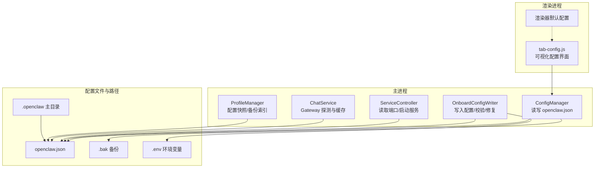
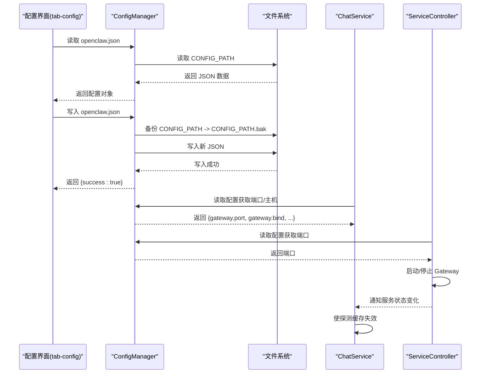
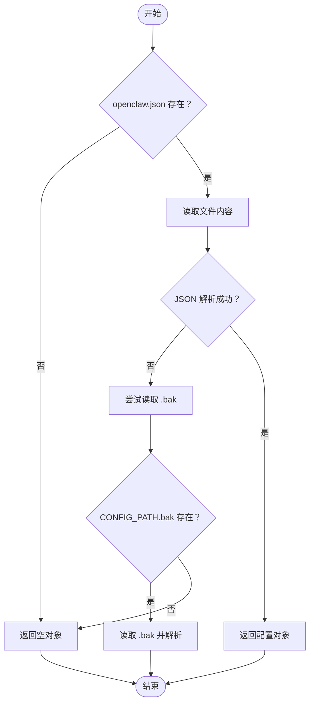
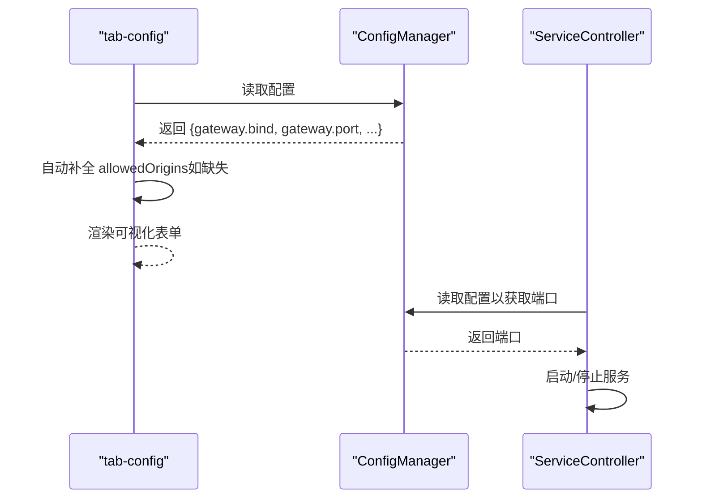
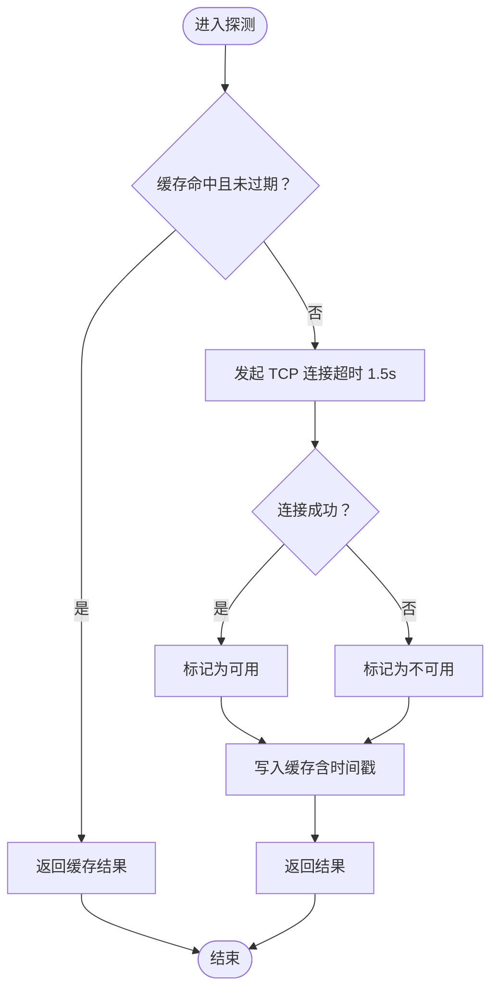
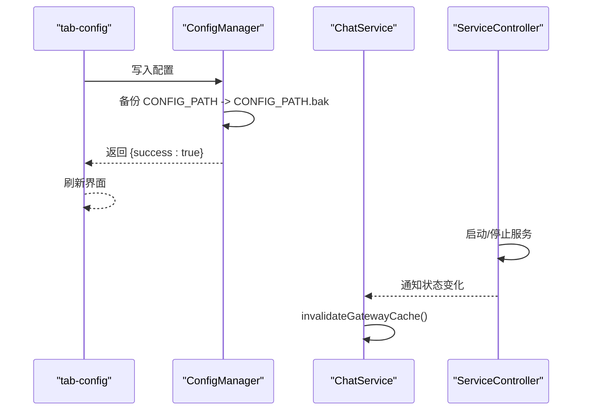
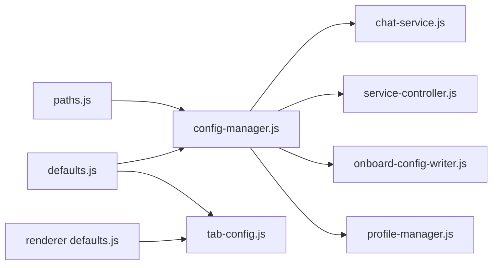

# Gateway 配置管理

<cite>
**本文档引用的文件**
- [src/main/services/config-manager.js](file://src/main/services/config-manager.js)
- [src/main/config/defaults.js](file://src/main/config/defaults.js)
- [src/main/utils/paths.js](file://src/main/utils/paths.js)
- [src/renderer/js/config/defaults.js](file://src/renderer/js/config/defaults.js)
- [src/main/services/chat-service.js](file://src/main/services/chat-service.js)
- [src/main/services/onboard-config-writer.js](file://src/main/services/onboard-config-writer.js)
- [src/main/services/service-controller.js](file://src/main/services/service-controller.js)
- [src/main/services/profile-manager.js](file://src/main/services/profile-manager.js)
- [scripts/gateway-control.sh](file://scripts/gateway-control.sh)
- [src/renderer/js/dashboard/tab-config.js](file://src/renderer/js/dashboard/tab-config.js)
</cite>

## 目录
1. [简介](#简介)
2. [项目结构](#项目结构)
3. [核心组件](#核心组件)
4. [架构总览](#架构总览)
5. [详细组件分析](#详细组件分析)
6. [依赖关系分析](#依赖关系分析)
7. [性能考虑](#性能考虑)
8. [故障排查指南](#故障排查指南)
9. [结论](#结论)
10. [附录](#附录)

## 简介
本文件系统性记录 OpenClaw Gateway 配置管理功能，覆盖以下主题：
- 配置文件 openclaw.json 的结构与字段说明
- Gateway 连接配置（主机地址、端口、认证令牌）
- 配置缓存策略（可用性检测与 TTL 管理）
- 配置变更的热更新与失效处理
- 配置验证与错误处理流程
- 配置文件的备份与恢复策略

## 项目结构
围绕配置管理的关键文件分布如下：
- 主进程配置读写与缓存：src/main/services/config-manager.js
- 默认配置与常量：src/main/config/defaults.js
- 路径与环境变量：src/main/utils/paths.js
- 渲染进程默认网络参数：src/renderer/js/config/defaults.js
- Gateway 探测与缓存：src/main/services/chat-service.js
- 首次引导写入与 doctor 校验：src/main/services/onboard-config-writer.js
- 服务控制与端口读取：src/main/services/service-controller.js
- 配置快照与备份索引：src/main/services/profile-manager.js
- Gateway 控制脚本：scripts/gateway-control.sh
- 配置界面读取与可视化编辑：src/renderer/js/dashboard/tab-config.js

图表来源
- [src/main/services/config-manager.js:1-264](file://src/main/services/config-manager.js#L1-L264)
- [src/main/services/chat-service.js:140-339](file://src/main/services/chat-service.js#L140-L339)
- [src/main/services/onboard-config-writer.js:349-376](file://src/main/services/onboard-config-writer.js#L349-L376)
- [src/main/services/service-controller.js:95-105](file://src/main/services/service-controller.js#L95-L105)
- [src/main/services/profile-manager.js:1-54](file://src/main/services/profile-manager.js#L1-L54)
- [src/renderer/js/dashboard/tab-config.js:34-73](file://src/renderer/js/dashboard/tab-config.js#L34-L73)

章节来源
- [src/main/services/config-manager.js:1-264](file://src/main/services/config-manager.js#L1-L264)
- [src/main/config/defaults.js:1-180](file://src/main/config/defaults.js#L1-L180)
- [src/main/utils/paths.js:1-124](file://src/main/utils/paths.js#L1-L124)
- [src/renderer/js/config/defaults.js:1-51](file://src/renderer/js/config/defaults.js#L1-L51)

## 核心组件
- ConfigManager：负责 openclaw.json 的读取、写入、备份与结构校验；提供认证凭据与模型配置的子文件读写。
- ChatService：负责 Gateway 可用性探测与缓存，支持 TTL 管理与缓存失效。
- OnboardConfigWriter：负责首次引导写入 openclaw.json，并在写入后执行配置校验与修复。
- ServiceController：负责读取配置中的端口并启动/停止 Gateway 服务。
- ProfileManager：负责对 openclaw.json 进行快照备份与索引管理。
- 渲染进程 tab-config：负责可视化展示与编辑配置，必要时自动补全控制台跨域配置。

章节来源
- [src/main/services/config-manager.js:212-260](file://src/main/services/config-manager.js#L212-L260)
- [src/main/services/chat-service.js:140-190](file://src/main/services/chat-service.js#L140-L190)
- [src/main/services/onboard-config-writer.js:476-495](file://src/main/services/onboard-config-writer.js#L476-L495)
- [src/main/services/service-controller.js:95-105](file://src/main/services/service-controller.js#L95-L105)
- [src/main/services/profile-manager.js:41-54](file://src/main/services/profile-manager.js#L41-L54)
- [src/renderer/js/dashboard/tab-config.js:34-73](file://src/renderer/js/dashboard/tab-config.js#L34-L73)

## 架构总览
下图展示了配置管理在系统中的交互关系与数据流向：

图表来源
- [src/renderer/js/dashboard/tab-config.js:34-73](file://src/renderer/js/dashboard/tab-config.js#L34-L73)
- [src/main/services/config-manager.js:212-260](file://src/main/services/config-manager.js#L212-L260)
- [src/main/services/chat-service.js:140-190](file://src/main/services/chat-service.js#L140-L190)
- [src/main/services/service-controller.js:95-105](file://src/main/services/service-controller.js#L95-L105)

## 详细组件分析

### openclaw.json 结构与字段说明
- 顶层结构
  - gateway：Gateway 连接与运行配置
    - bind：绑定地址，默认 127.0.0.1
    - port：端口，默认 18789
    - mode：运行模式，默认 local
    - auth.token：认证令牌（可选）
    - controlUi.allowedOrigins：控制台跨域来源（可选）
  - env.vars：环境变量键值对（用于注入 API Key 等）
  - agents.defaults.model.primary：默认模型字符串（provider/model）
  - 其他扩展字段：由业务模块按需扩展

- 字段来源与默认值
  - 默认绑定地址与端口来自默认配置文件
  - 默认运行模式与认证模式来自功能开关
  - 渲染进程默认配置与主进程默认配置保持一致

章节来源
- [src/main/config/defaults.js:14-29](file://src/main/config/defaults.js#L14-L29)
- [src/main/config/defaults.js:129-138](file://src/main/config/defaults.js#L129-L138)
- [src/renderer/js/config/defaults.js:16-21](file://src/renderer/js/config/defaults.js#L16-L21)
- [src/renderer/js/dashboard/tab-config.js:153-179](file://src/renderer/js/dashboard/tab-config.js#L153-L179)

### 配置文件读取与解析机制
- 读取流程
  - 若 openclaw.json 存在，直接读取并解析为对象
  - 若不存在，返回空对象
  - 写入前会先备份当前文件至 CONFIG_PATH.bak
  - 写入时进行 JSON 校验，确保写入内容合法
- 备份策略
  - 写入 openclaw.json 前自动备份为 CONFIG_PATH.bak
  - 读取失败时尝试读取 CONFIG_PATH.bak 作为降级方案
- 错误处理
  - 读取/写入异常会被捕获并记录日志，返回明确的成功/失败标志

图表来源
- [src/main/services/config-manager.js:212-233](file://src/main/services/config-manager.js#L212-L233)

章节来源
- [src/main/services/config-manager.js:212-233](file://src/main/services/config-manager.js#L212-L233)

### Gateway 连接配置
- 主机地址与端口
  - 从配置对象读取 gateway.bind 与 gateway.port，未配置时使用默认值
  - ServiceController 从配置读取端口用于启动/停止服务
- 认证令牌
  - 从配置对象读取 gateway.auth.token，用于请求鉴权
  - 渲染界面提供令牌输入与重新生成按钮
- 控制台跨域
  - 若未配置 gateway.controlUi.allowedOrigins，则在读取配置时自动补全为允许所有来源

图表来源
- [src/renderer/js/dashboard/tab-config.js:34-48](file://src/renderer/js/dashboard/tab-config.js#L34-L48)
- [src/renderer/js/dashboard/tab-config.js:153-179](file://src/renderer/js/dashboard/tab-config.js#L153-L179)
- [src/main/services/service-controller.js:95-105](file://src/main/services/service-controller.js#L95-L105)

章节来源
- [src/renderer/js/dashboard/tab-config.js:34-48](file://src/renderer/js/dashboard/tab-config.js#L34-L48)
- [src/renderer/js/dashboard/tab-config.js:153-179](file://src/renderer/js/dashboard/tab-config.js#L153-L179)
- [src/main/services/service-controller.js:95-105](file://src/main/services/service-controller.js#L95-L105)

### 配置缓存策略（可用性检测与 TTL 管理）
- Gateway 探测缓存
  - ChatService 对 TCP 探测结果进行缓存，命中缓存时直接返回
  - 缓存 TTL 为 30 秒，避免频繁探测导致延迟
- 缓存失效
  - 在服务启动/停止后主动使探测缓存失效
  - 同时清除 404 缓存，以便 Gateway 重启后支持新端点
- 探测实现
  - 使用 Socket 连接目标主机与端口，超时时间为 1.5 秒
  - 成功连接标记为可用，失败标记为不可用

图表来源
- [src/main/services/chat-service.js:154-182](file://src/main/services/chat-service.js#L154-L182)

章节来源
- [src/main/services/chat-service.js:140-190](file://src/main/services/chat-service.js#L140-L190)

### 配置变更的热更新机制与失效处理
- 写入流程
  - 写入 openclaw.json 前自动备份为 .bak
  - 写入后返回成功标志，渲染界面可即时刷新
- 生效时机
  - 新配置在后续读取时生效（如服务启动、聊天请求等）
- 失效处理
  - 服务启动/停止后，ChatService 使探测缓存失效，确保下次探测反映最新状态
- 首次引导与修复
  - OnboardConfigWriter 写入配置后执行配置校验与修复，提升稳定性

图表来源
- [src/renderer/js/dashboard/tab-config.js:66-73](file://src/renderer/js/dashboard/tab-config.js#L66-L73)
- [src/main/services/config-manager.js:235-260](file://src/main/services/config-manager.js#L235-L260)
- [src/main/services/chat-service.js:184-190](file://src/main/services/chat-service.js#L184-L190)
- [src/main/services/onboard-config-writer.js:476-495](file://src/main/services/onboard-config-writer.js#L476-L495)

章节来源
- [src/renderer/js/dashboard/tab-config.js:66-73](file://src/renderer/js/dashboard/tab-config.js#L66-L73)
- [src/main/services/config-manager.js:235-260](file://src/main/services/config-manager.js#L235-L260)
- [src/main/services/chat-service.js:184-190](file://src/main/services/chat-service.js#L184-L190)
- [src/main/services/onboard-config-writer.js:476-495](file://src/main/services/onboard-config-writer.js#L476-L495)

### 配置验证与错误处理流程
- 写入前验证
  - ConfigManager 在写入前对 JSON 进行校验，确保内容合法
- 读取降级
  - 若主配置损坏，尝试读取 .bak 作为降级方案
- 非阻塞性修复
  - OnboardConfigWriter 在写入后执行 doctor --fix，失败不中断流程
- 日志记录
  - 所有读写异常均记录日志，便于定位问题

章节来源
- [src/main/services/config-manager.js:249-251](file://src/main/services/config-manager.js#L249-L251)
- [src/main/services/config-manager.js:221-230](file://src/main/services/config-manager.js#L221-L230)
- [src/main/services/onboard-config-writer.js:476-492](file://src/main/services/onboard-config-writer.js#L476-L492)

### 配置文件的备份与恢复策略
- 自动备份
  - 写入 openclaw.json 前自动复制为 CONFIG_PATH.bak
  - 写入 auth-profiles.json 与 models.json 时同样进行备份
- 快照与索引
  - ProfileManager 支持对 openclaw.json 进行快照备份，并维护索引文件
- 恢复建议
  - 若主配置损坏，可直接使用 CONFIG_PATH.bak 恢复
  - 快照备份可用于历史版本恢复

章节来源
- [src/main/services/config-manager.js:243-247](file://src/main/services/config-manager.js#L243-L247)
- [src/main/services/config-manager.js:55-59](file://src/main/services/config-manager.js#L55-L59)
- [src/main/services/config-manager.js:166-170](file://src/main/services/config-manager.js#L166-L170)
- [src/main/services/profile-manager.js:41-54](file://src/main/services/profile-manager.js#L41-L54)

## 依赖关系分析
- ConfigManager 依赖路径工具与日志工具，负责 openclaw.json 与子配置文件的读写
- ChatService 依赖 ConfigManager 读取端口，依赖网络探测实现可用性缓存
- ServiceController 依赖 ConfigManager 读取端口，负责服务生命周期管理
- OnboardConfigWriter 依赖路径工具与 ShellExecutor，负责首次引导写入与修复
- ProfileManager 依赖路径工具，负责配置快照与索引
- 渲染进程 tab-config 依赖 ConfigManager 读取/写入配置，并自动补全控制台跨域配置

图表来源
- [src/main/utils/paths.js:1-124](file://src/main/utils/paths.js#L1-L124)
- [src/main/config/defaults.js:1-180](file://src/main/config/defaults.js#L1-L180)
- [src/main/services/config-manager.js:1-264](file://src/main/services/config-manager.js#L1-L264)
- [src/main/services/chat-service.js:140-190](file://src/main/services/chat-service.js#L140-L190)
- [src/main/services/service-controller.js:95-105](file://src/main/services/service-controller.js#L95-L105)
- [src/main/services/onboard-config-writer.js:349-376](file://src/main/services/onboard-config-writer.js#L349-L376)
- [src/main/services/profile-manager.js:1-54](file://src/main/services/profile-manager.js#L1-L54)
- [src/renderer/js/dashboard/tab-config.js:34-73](file://src/renderer/js/dashboard/tab-config.js#L34-L73)
- [src/renderer/js/config/defaults.js:1-51](file://src/renderer/js/config/defaults.js#L1-L51)

章节来源
- [src/main/utils/paths.js:1-124](file://src/main/utils/paths.js#L1-L124)
- [src/main/services/config-manager.js:1-264](file://src/main/services/config-manager.js#L1-L264)

## 性能考虑
- 探测缓存：Gateway 可用性探测缓存 TTL 为 30 秒，显著降低频繁探测带来的网络开销与延迟
- 写入优化：写入前仅进行一次 JSON 校验，避免重复解析
- 首次引导修复：在写入后执行非阻塞修复，不影响用户体验

## 故障排查指南
- 配置读取失败
  - 检查 openclaw.json 是否存在，若不存在，确认默认路径是否正确
  - 若主配置损坏，检查 CONFIG_PATH.bak 是否存在并可读
- 写入失败
  - 检查磁盘权限与空间，确认目标目录可写
  - 查看日志输出，定位具体错误原因
- Gateway 不可用
  - 使用脚本查看服务状态，确认端口占用情况
  - 触发服务启动后，等待探测缓存失效并重新探测
- 跨域问题
  - 确认 gateway.controlUi.allowedOrigins 已正确配置
  - 渲染界面会在读取配置时自动补全该字段

章节来源
- [src/main/services/config-manager.js:221-230](file://src/main/services/config-manager.js#L221-L230)
- [scripts/gateway-control.sh:63-81](file://scripts/gateway-control.sh#L63-L81)
- [src/renderer/js/dashboard/tab-config.js:34-48](file://src/renderer/js/dashboard/tab-config.js#L34-L48)

## 结论
本配置管理体系通过统一的 ConfigManager 实现 openclaw.json 的安全读写与备份，结合 ChatService 的探测缓存与 ServiceController 的端口读取，形成闭环的配置管理链路。配合渲染界面的可视化编辑与自动补全，以及首次引导的校验修复，整体具备良好的可用性、稳定性与可观测性。

## 附录
- 路径与环境变量
  - OPENCLAW_HOME：默认位于用户主目录下的 .openclaw
  - CONFIG_PATH：默认位于 OPENCLAW_HOME/openclaw.json
  - PROFILES_DIR：默认位于 OPENCLAW_HOME/config-backups
- 默认端口与绑定地址
  - 默认端口：18789
  - 默认绑定地址：127.0.0.1
- 探测与缓存 TTL
  - 探测超时：1.5 秒
  - 探测缓存 TTL：30 秒

章节来源
- [src/main/utils/paths.js:8-12](file://src/main/utils/paths.js#L8-L12)
- [src/main/config/defaults.js:14-29](file://src/main/config/defaults.js#L14-L29)
- [src/main/config/defaults.js:41-42](file://src/main/config/defaults.js#L41-L42)
- [src/main/services/chat-service.js:177-178](file://src/main/services/chat-service.js#L177-L178)