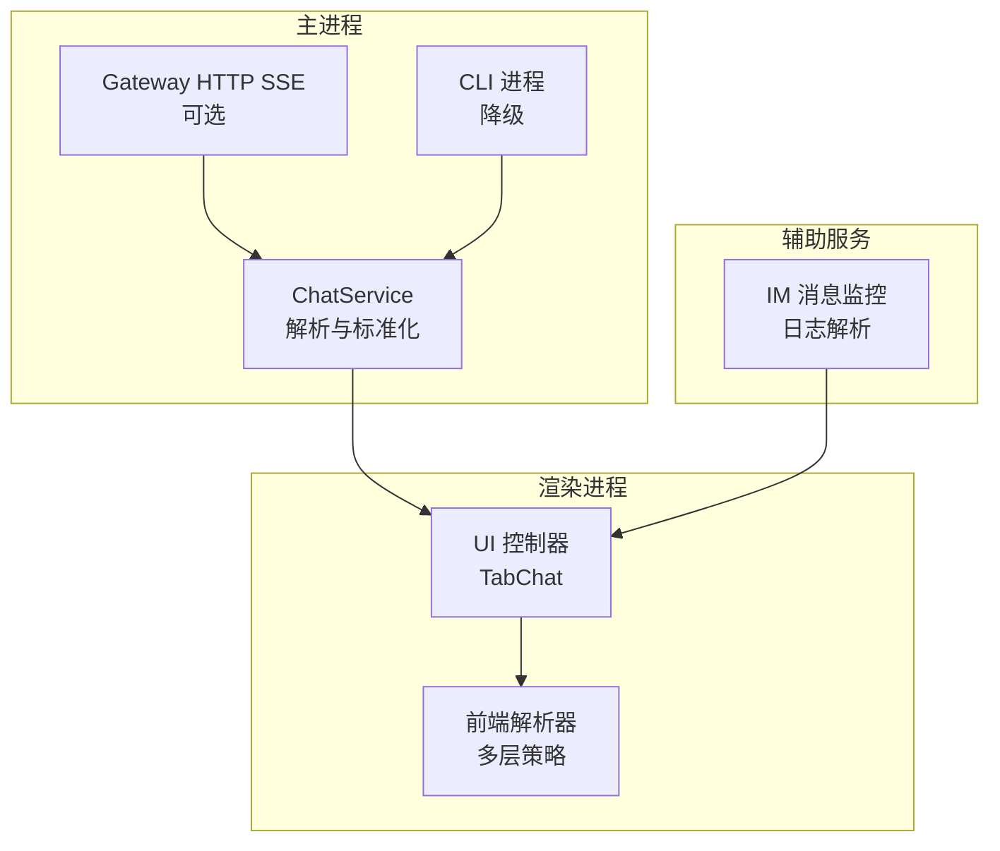
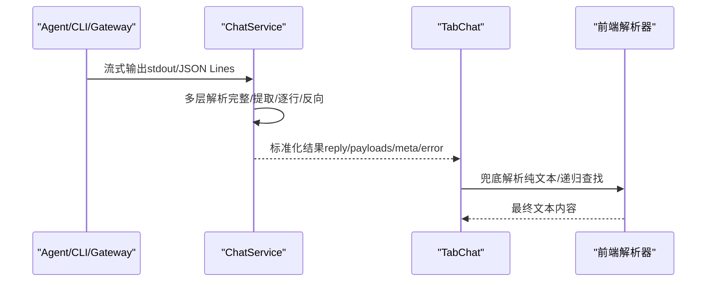
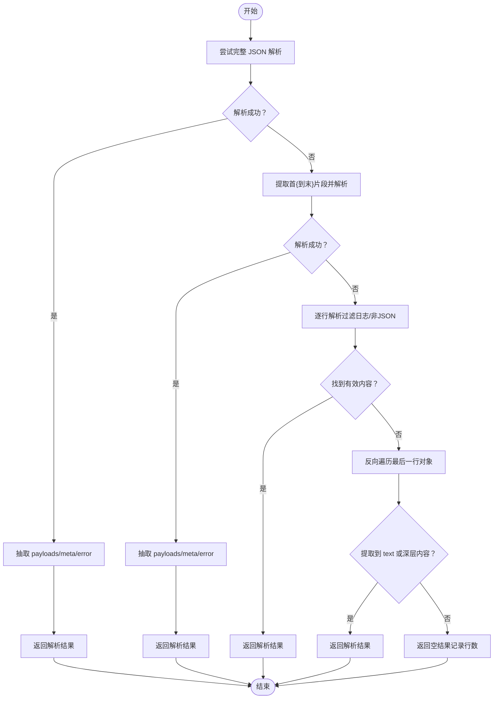
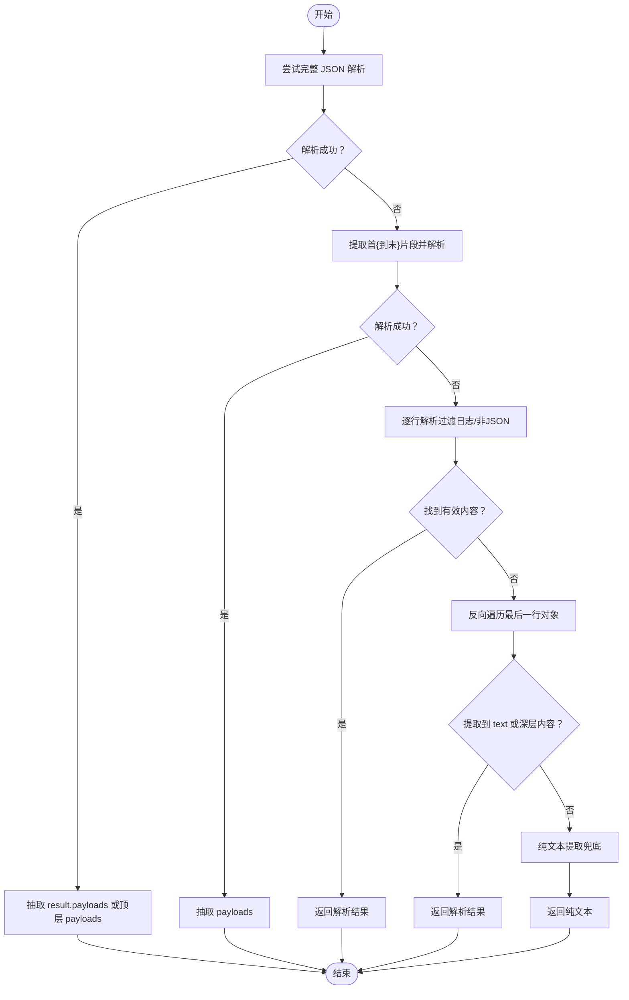
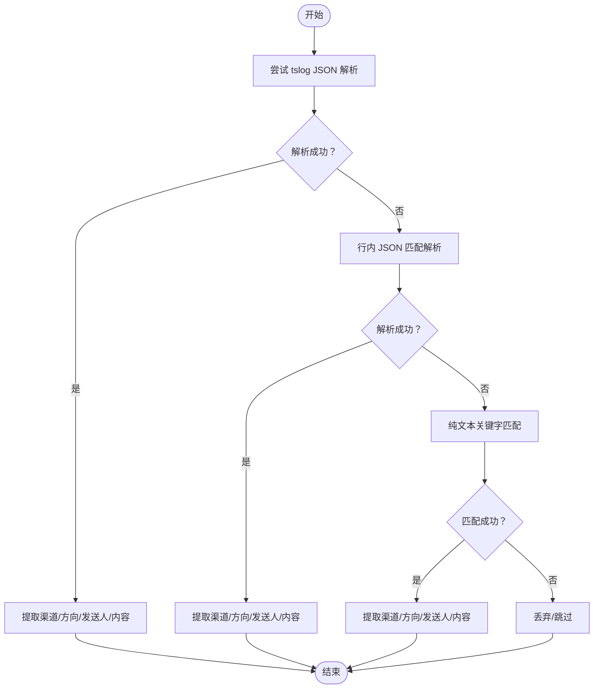
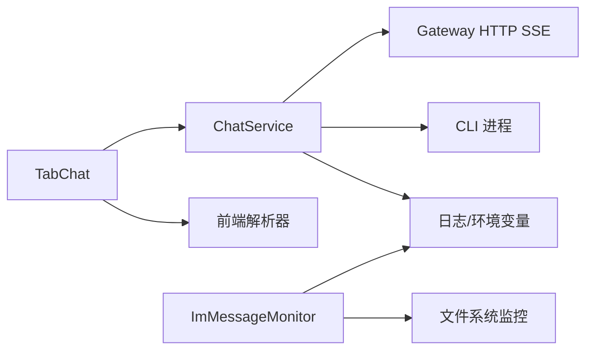

# 代理输出解析

<cite>
**本文档引用的文件**
- [chat-service.js](file://src/main/services/chat-service.js)
- [tab-chat.js](file://src/renderer/js/dashboard/tab-chat.js)
- [im-message-monitor.js](file://src/main/services/im-message-monitor.js)
- [web_utils.js](file://resources/skills/technology-news-search/scripts/shared/web_utils.js)
</cite>

## 目录
1. [简介](#简介)
2. [项目结构](#项目结构)
3. [核心组件](#核心组件)
4. [架构总览](#架构总览)
5. [详细组件分析](#详细组件分析)
6. [依赖关系分析](#依赖关系分析)
7. [性能考量](#性能考量)
8. [故障排查指南](#故障排查指南)
9. [结论](#结论)

## 简介
本文件系统化梳理代理输出解析功能，覆盖多层解析策略（完整 JSON 解析、提取解析、逐行解析）、输出格式兼容性处理、payload 提取与元数据解析、错误信息提取、容错与回退策略、解析结果标准化与数据转换，以及性能优化与内存使用分析。目标是帮助开发者与使用者理解并高效使用代理输出解析能力。

## 项目结构
代理输出解析涉及主进程服务与渲染进程 UI 的协同：
- 主进程服务负责与 Gateway/CLI 交互，接收流式输出并进行多层解析与标准化。
- 渲染进程负责 UI 展示与二次兜底解析，确保在极端情况下也能提取有效文本。
- IM 消息监控服务对日志进行解析，体现相似的多层解析与容错策略。

图表来源
- [chat-service.js:334-536](file://src/main/services/chat-service.js#L334-L536)
- [chat-service.js:968-1000](file://src/main/services/chat-service.js#L968-L1000)
- [tab-chat.js:1463-1493](file://src/renderer/js/dashboard/tab-chat.js#L1463-L1493)
- [im-message-monitor.js:246-286](file://src/main/services/im-message-monitor.js#L246-L286)

章节来源
- [chat-service.js:334-536](file://src/main/services/chat-service.js#L334-L536)
- [tab-chat.js:1463-1493](file://src/renderer/js/dashboard/tab-chat.js#L1463-L1493)
- [im-message-monitor.js:246-286](file://src/main/services/im-message-monitor.js#L246-L286)

## 核心组件
- 多层解析策略（主进程）
  - 完整 JSON 解析：将整个 stdout 作为单一 JSON 对象解析。
  - 提取解析：从 stdout 中定位首个 '{' 到最后一个 '}' 的片段，再解析。
  - 逐行解析：过滤掉非 JSON 行（如日志），逐行尝试解析 JSON。
  - 反向遍历解析：从最后一行向前查找有效 JSON 对象，优先提取 text 字段。
- 兼容性处理
  - 支持 result.payloads 与顶层 payloads 两种结构。
  - 支持 type=text 的简单文本结构。
  - 支持 meta 字段与 stopReason/error 等状态字段。
- 元数据与错误提取
  - 从 meta 字段提取元信息。
  - 从 status/summary/error 字段识别错误状态。
  - 从 Unknown error 文本标记错误。
- 容错与回退
  - Gateway 失败时自动降级到 CLI --local 模式。
  - CLI 无 stdout 时从会话文件回读最后一条 assistant 消息。
  - 前端二次兜底：纯文本提取与递归对象查找。
- 标准化与数据转换
  - 将多种结构统一为 reply/payloads/meta/error 的标准结构。
  - 对 text 字段进行流式推送与拼接。
- 性能与内存
  - SSE 流式解析，避免一次性加载大量数据。
  - CLI 使用 JSON 行缓冲，减少不完整行解析失败。
  - 前端按行解析与反向遍历，降低内存峰值。

章节来源
- [chat-service.js:590-733](file://src/main/services/chat-service.js#L590-L733)
- [chat-service.js:1005-1280](file://src/main/services/chat-service.js#L1005-L1280)
- [tab-chat.js:2285-2398](file://src/renderer/js/dashboard/tab-chat.js#L2285-L2398)
- [im-message-monitor.js:263-286](file://src/main/services/im-message-monitor.js#L263-L286)

## 架构总览
代理输出解析贯穿“上游输出 → 多层解析 → 标准化 → UI 展示”的链路，主进程优先使用 Gateway SSE，失败时降级到 CLI，并在 UI 层提供二次兜底。

图表来源
- [chat-service.js:590-733](file://src/main/services/chat-service.js#L590-L733)
- [chat-service.js:1005-1280](file://src/main/services/chat-service.js#L1005-L1280)
- [tab-chat.js:2285-2398](file://src/renderer/js/dashboard/tab-chat.js#L2285-L2398)

## 详细组件分析

### 主进程解析器（ChatService）
- 多层解析策略
  - 完整 JSON：对整个 stdout 进行 JSON.parse，若成功则进入抽取流程。
  - 提取 JSON：定位首个 '{' 与最后一个 '}'，截取片段再解析。
  - 逐行解析：过滤日志行与非 JSON 行，逐行尝试解析，遇到有效内容立即返回。
  - 反向遍历：从最后一行向前查找 JSON 对象，优先提取 text 字段，其次递归抽取。
- 抽取与标准化
  - 支持 result.payloads 与顶层 payloads 两种结构，分别遍历并拼接 text。
  - 支持 type=text 的简单结构。
  - 提取 meta 字段与 stopReason/error 状态。
  - 对 Unknown error 进行错误标记。
- CLI 降级与回退
  - Gateway 失败时触发 CLI --local 模式。
  - CLI 无 stdout 时从会话文件读取最后一条 assistant 消息作为回退。
  - CLI 退出码非 0 时，尝试从 stderr/stdout 提取错误信息。
- 流式处理
  - SSE：按行解析，遇到 data: 块解析 JSON，过滤 delta.role 帧，仅推送 content。
  - CLI：使用 JSON 行缓冲，避免不完整行导致解析失败；在 close 事件处理残留缓冲。

图表来源
- [chat-service.js:590-733](file://src/main/services/chat-service.js#L590-L733)

章节来源
- [chat-service.js:590-733](file://src/main/services/chat-service.js#L590-L733)
- [chat-service.js:1005-1280](file://src/main/services/chat-service.js#L1005-L1280)

### 渲染进程解析器（TabChat）
- 多层解析策略（与主进程一致）
  - 完整 JSON：解析 stdout 顶层 JSON，优先 result.payloads，其次顶层 payloads。
  - 提取 JSON：定位首{到末}片段，解析并抽取。
  - 逐行解析：过滤日志行，逐行解析，抽取 text。
  - 反向遍历：从最后一行向前查找，优先 text，其次递归查找嵌套 text。
- 兜底策略
  - 纯文本提取：跳过 JSON 行、日志行与错误堆栈，合并有意义文本。
- 流式处理
  - 对 thinking/data/stdout/stderr 进行分类处理，确保 UI 体验流畅。

图表来源
- [tab-chat.js:2285-2398](file://src/renderer/js/dashboard/tab-chat.js#L2285-L2398)
- [tab-chat.js:2431-2462](file://src/renderer/js/dashboard/tab-chat.js#L2431-L2462)

章节来源
- [tab-chat.js:2285-2398](file://src/renderer/js/dashboard/tab-chat.js#L2285-L2398)
- [tab-chat.js:2431-2462](file://src/renderer/js/dashboard/tab-chat.js#L2431-L2462)

### IM 消息监控解析器（ImMessageMonitor）
- 多层解析策略
  - 完整 JSON：tslog 格式 JSON Lines。
  - 行内 JSON：正则匹配行内首个 JSON 片段。
  - 纯文本：基于关键字匹配的最终兜底。
- 元数据提取
  - 从 _meta.subsystem、meta 参数与对象递归扫描中提取渠道名。
  - 从 meta 与文本特征判断消息方向（inbound/outbound）。
  - 从 meta 提取发送人信息与时间戳。

图表来源
- [im-message-monitor.js:263-286](file://src/main/services/im-message-monitor.js#L263-L286)
- [im-message-monitor.js:299-343](file://src/main/services/im-message-monitor.js#L299-L343)

章节来源
- [im-message-monitor.js:263-286](file://src/main/services/im-message-monitor.js#L263-L286)
- [im-message-monitor.js:299-343](file://src/main/services/im-message-monitor.js#L299-L343)

## 依赖关系分析
- 主进程依赖
  - Gateway HTTP API（SSE）与 CLI 进程，二者之一成功即可返回结果。
  - 日志与环境变量，用于诊断与回退。
- 渲染进程依赖
  - 主进程标准化后的结果；同时具备前端兜底解析能力。
- 辅助服务依赖
  - 日志文件与文件系统监控，实现增量读取与跨日滚动。

图表来源
- [chat-service.js:334-536](file://src/main/services/chat-service.js#L334-L536)
- [chat-service.js:968-1000](file://src/main/services/chat-service.js#L968-L1000)
- [tab-chat.js:1463-1493](file://src/renderer/js/dashboard/tab-chat.js#L1463-L1493)
- [im-message-monitor.js:138-214](file://src/main/services/im-message-monitor.js#L138-L214)

章节来源
- [chat-service.js:334-536](file://src/main/services/chat-service.js#L334-L536)
- [tab-chat.js:1463-1493](file://src/renderer/js/dashboard/tab-chat.js#L1463-L1493)
- [im-message-monitor.js:138-214](file://src/main/services/im-message-monitor.js#L138-L214)

## 性能考量
- 流式处理
  - SSE：按块解析，避免一次性加载大量数据；过滤 delta.role 帧，仅推送 content。
  - CLI：使用 JSON 行缓冲，减少不完整行解析失败；在 close 事件处理残留缓冲。
- 内存优化
  - 逐层解析采用短路策略，一旦找到有效内容立即返回，避免全量解析。
  - 前端逐行与反向遍历，限制最大深度，降低内存峰值。
- 超时与降级
  - Gateway 探测与超时控制，避免长时间阻塞。
  - CLI 超时与错误兜底，保证 UI 可用性。
- 编码与解码
  - decodeBuffer 移除无效 UTF-8 替换字符与控制字符，减少后续解析负担。

章节来源
- [chat-service.js:455-522](file://src/main/services/chat-service.js#L455-L522)
- [chat-service.js:1005-1280](file://src/main/services/chat-service.js#L1005-L1280)
- [tab-chat.js:1463-1493](file://src/renderer/js/dashboard/tab-chat.js#L1463-L1493)

## 故障排查指南
- Gateway 失败
  - 现象：返回 404、401/403、5xx 或连接失败。
  - 处理：触发 CLI --local 降级；必要时清理 Gateway 缓存。
- CLI 无 stdout
  - 现象：CLI 成功退出但 stdout 为空。
  - 处理：从会话文件读取最后一条 assistant 消息作为回退。
- JSON 解析失败
  - 现象：stdout 包含日志与非 JSON 行。
  - 处理：使用多层解析策略；前端进行纯文本提取与递归查找。
- 错误信息提取
  - 现象：Agent 返回 error/status/summary。
  - 处理：从 meta/stopReason/status/summary/error 字段识别错误；Unknown error 标记为错误。
- 编码问题
  - 现象：输出包含无效 UTF-8 字符。
  - 处理：decodeBuffer 过滤替换字符与控制字符。

章节来源
- [chat-service.js:418-449](file://src/main/services/chat-service.js#L418-L449)
- [chat-service.js:1218-1264](file://src/main/services/chat-service.js#L1218-L1264)
- [tab-chat.js:2431-2462](file://src/renderer/js/dashboard/tab-chat.js#L2431-L2462)

## 结论
代理输出解析通过“多层解析 + 容错回退 + 标准化输出”的设计，在不同代理与输出格式之间实现了高兼容性与稳定性。主进程侧重于结构化解析与标准化，渲染进程提供二次兜底与 UI 体验优化。结合流式处理与内存优化策略，整体在性能与可靠性上达到平衡。建议在集成时遵循统一的 payload/meta/error 标准，以便于前端与后端协同工作。