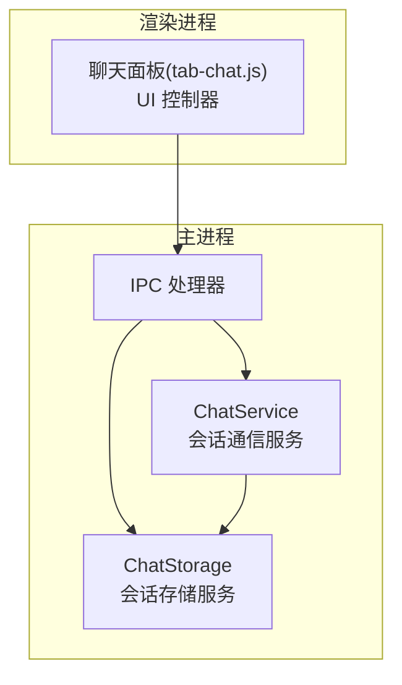
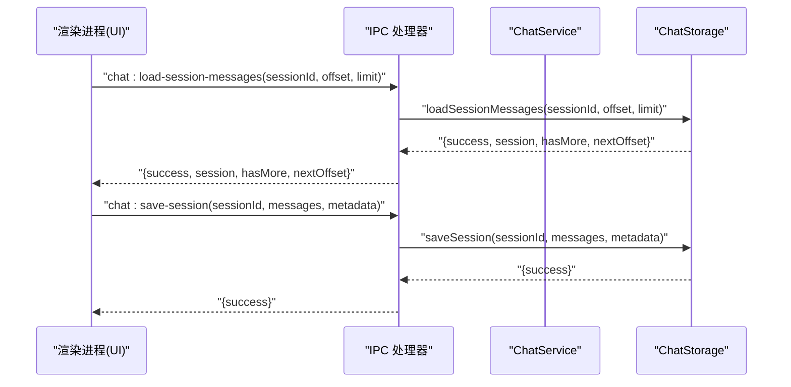
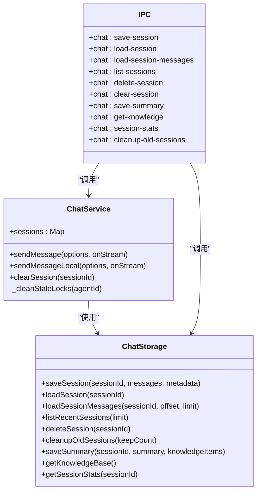

# 会话管理

<cite>
**本文引用的文件**
- [chat-storage.js](file://src/main/services/chat-storage.js)
- [chat-service.js](file://src/main/services/chat-service.js)
- [ipc-handlers.js](file://src/main/ipc-handlers.js)
- [tab-chat.js](file://src/renderer/js/dashboard/tab-chat.js)
</cite>

## 目录
1. [简介](#简介)
2. [项目结构](#项目结构)
3. [核心组件](#核心组件)
4. [架构总览](#架构总览)
5. [详细组件分析](#详细组件分析)
6. [依赖关系分析](#依赖关系分析)
7. [性能考量](#性能考量)
8. [故障排查指南](#故障排查指南)
9. [结论](#结论)
10. [附录](#附录)

## 简介
本文件系统化梳理并文档化会话管理功能，覆盖会话生命周期（创建、状态维护、清理）、会话标识符生成规则、会话数据结构、缓存策略（内存与持久化）、状态跟踪（活跃、超时、异常恢复）、API 接口规范以及并发与线程安全考虑。目标是帮助开发者与使用者全面理解会话管理的设计与实现，并提供可操作的排障与优化建议。

## 项目结构
会话管理涉及主进程服务层与渲染进程 UI 层的协作：
- 主进程服务层
  - 会话存储服务：负责会话的持久化、分页加载、列表与清理
  - 会话通信服务：负责与网关/CLI 的交互、流式响应、并发锁清理
  - IPC 处理器：暴露会话相关 IPC 接口，供渲染进程调用
- 渲染进程 UI 层
  - 聊天面板：负责会话列表展示、分页加载历史消息、创建/删除/切换会话、自动保存

图表来源
- [chat-service.js](file://src/main/services/chat-service.js)
- [chat-storage.js](file://src/main/services/chat-storage.js)
- [ipc-handlers.js](file://src/main/ipc-handlers.js)
- [tab-chat.js](file://src/renderer/js/dashboard/tab-chat.js)

章节来源
- [chat-storage.js](file://src/main/services/chat-storage.js)
- [chat-service.js](file://src/main/services/chat-service.js)
- [ipc-handlers.js](file://src/main/ipc-handlers.js)
- [tab-chat.js](file://src/renderer/js/dashboard/tab-chat.js)

## 核心组件
- 会话存储服务（ChatStorage）
  - 负责会话的保存、加载、分页加载、会话列表、删除、清理过期会话、保存总结与知识库管理
  - 采用 JSON 文件持久化，目录位于用户主目录下的特定子路径
- 会话通信服务（ChatService）
  - 负责与网关 HTTP SSE 或 CLI 的交互，提供流式响应；内置并发锁清理机制，保障会话文件一致性
  - 维护内存中的会话 Map，用于短期状态管理
- IPC 处理器（ipc-handlers.js）
  - 注册并实现 chat 相关的 IPC 接口，桥接渲染进程与主进程服务
- 聊天面板（tab-chat.js）
  - 负责 UI 交互、会话列表展示、分页加载历史消息、创建/删除/切换会话、自动保存

章节来源
- [chat-storage.js](file://src/main/services/chat-storage.js)
- [chat-service.js](file://src/main/services/chat-service.js)
- [ipc-handlers.js](file://src/main/ipc-handlers.js)
- [tab-chat.js](file://src/renderer/js/dashboard/tab-chat.js)

## 架构总览
会话管理的端到端流程如下：
- 渲染进程发起会话相关操作（创建、切换、分页加载、删除、保存）
- IPC 处理器接收请求并转发至对应服务
- 会话存储服务负责文件系统层面的持久化与检索
- 会话通信服务负责与网关/CLI 的交互与并发控制
- UI 层根据服务返回结果更新界面状态

图表来源
- [ipc-handlers.js](file://src/main/ipc-handlers.js)
- [chat-storage.js](file://src/main/services/chat-storage.js)
- [tab-chat.js](file://src/renderer/js/dashboard/tab-chat.js)

## 详细组件分析

### 会话生命周期管理
- 创建
  - 渲染进程在需要时生成新的会话标识符并创建空会话
  - 会话标识符生成规则：基于时间戳与随机字符串拼接，保证唯一性
- 状态维护
  - 内存状态：ChatService 维护 sessions Map，用于短期状态管理
  - 持久化状态：ChatStorage 以 JSON 文件形式保存会话，包含消息列表与元数据
- 清理
  - 会话存储服务支持删除单个会话与清理过期会话（按最近 N 个保留）
  - 会话通信服务在 CLI 场景下清理过期 session lock 文件，避免并发阻塞

章节来源
- [tab-chat.js](file://src/renderer/js/dashboard/tab-chat.js)
- [chat-service.js](file://src/main/services/chat-service.js)
- [chat-storage.js](file://src/main/services/chat-storage.js)

### 会话标识符生成规则
- 生成方式：时间戳 + 随机字符串片段，确保全局唯一
- 使用场景：新会话创建、面板内临时会话标识

章节来源
- [tab-chat.js](file://src/renderer/js/dashboard/tab-chat.js)

### 会话数据结构
- 会话对象
  - id：会话标识符
  - messages：消息数组，每条消息包含角色与内容等字段
  - metadata：元数据，包含标题、创建/更新时间、消息总数等
- 会话文件
  - 以 JSON 文件形式存储，文件名为会话标识符 + .json
  - 存储位置：用户主目录下的特定子路径
- 会话统计
  - 提供消息数、用户/助手消息数、字符总数、平均每条消息字符数等统计

章节来源
- [chat-storage.js](file://src/main/services/chat-storage.js)

### 会话缓存策略
- 内存缓存
  - ChatService 维护 sessions Map，用于短期状态管理（如清理会话）
- 持久化存储
  - ChatStorage 以 JSON 文件持久化会话，支持完整加载与分页加载
  - 分页加载：按偏移与限制分批读取历史消息，降低内存占用
- 知识库缓存
  - ChatStorage 提供知识库文件，聚合沉淀的知识项，避免重复

章节来源
- [chat-service.js](file://src/main/services/chat-service.js)
- [chat-storage.js](file://src/main/services/chat-storage.js)

### 会话状态跟踪与异常恢复
- 活跃状态
  - 通过内存 Map 维护短期状态；通过文件系统持久化实现长期状态
- 超时处理
  - 网关 HTTP 请求设置默认超时；CLI 模式设置独立超时
- 异常恢复
  - 网关探测缓存与 404 缓存，避免重复探测与错误路径
  - CLI 场景下清理过期 session lock 文件，防止并发阻塞
  - 会话文件过大时主动清理，避免模型推理超时

章节来源
- [chat-service.js](file://src/main/services/chat-service.js)

### API 接口规范（IPC）
- 会话查询
  - chat:list-sessions(limit)：获取最近会话列表
  - chat:load-session(sessionId)：完整加载会话
  - chat:load-session-messages(sessionId, offset, limit)：分页加载消息
  - chat:session-stats(sessionId)：获取会话统计
- 会话更新
  - chat:save-session(sessionId, messages, metadata)：保存会话
  - chat:save-summary(sessionId, summary, knowledgeItems)：保存总结与知识
- 会话删除
  - chat:delete-session(sessionId)：删除会话
  - chat:clear-session(sessionId)：清理内存中的会话
- 会话清理
  - chat:cleanup-old-sessions(keepCount)：清理过期会话，保留最近 N 个

章节来源
- [ipc-handlers.js](file://src/main/ipc-handlers.js)
- [chat-storage.js](file://src/main/services/chat-storage.js)
- [chat-service.js](file://src/main/services/chat-service.js)

### 并发处理与线程安全
- CLI 并发锁清理
  - ChatService 在 CLI 调用前扫描并清理过期 session lock 文件，避免僵尸锁导致阻塞
  - 判断依据：进程是否存在、锁文件创建时间是否过期、Windows 下进程启动时间对比、是否被网关进程持有
- 内存 Map 并发
  - ChatService 的 sessions Map 为内存态，适合短期状态管理；与文件系统持久化解耦
- UI 并发
  - 渲染进程通过 IPC 异步调用，避免阻塞主线程；流式响应通过回调逐步更新 UI

章节来源
- [chat-service.js](file://src/main/services/chat-service.js)
- [ipc-handlers.js](file://src/main/ipc-handlers.js)
- [tab-chat.js](file://src/renderer/js/dashboard/tab-chat.js)

## 依赖关系分析
- ChatService 依赖 ChatStorage 进行会话持久化
- IPC 处理器注册并转发 chat 相关请求至 ChatService/ChatStorage
- 渲染进程通过 window.openclawAPI.chat.* 调用 IPC 接口

图表来源
- [chat-service.js](file://src/main/services/chat-service.js)
- [chat-storage.js](file://src/main/services/chat-storage.js)
- [ipc-handlers.js](file://src/main/ipc-handlers.js)

章节来源
- [chat-service.js](file://src/main/services/chat-service.js)
- [chat-storage.js](file://src/main/services/chat-storage.js)
- [ipc-handlers.js](file://src/main/ipc-handlers.js)

## 性能考量
- 分页加载
  - 通过分页加载减少一次性读取大量历史消息带来的内存压力
- 缓存策略
  - 网关探测与 404 缓存减少不必要的网络探测与错误路径
  - CLI 超时与会话文件大小限制避免长时间阻塞与模型推理超时
- 存储优化
  - 定期清理过期会话，控制文件数量与体积
  - 知识库聚合避免重复存储

章节来源
- [chat-storage.js](file://src/main/services/chat-storage.js)
- [chat-service.js](file://src/main/services/chat-service.js)

## 故障排查指南
- 会话无法加载
  - 检查会话文件是否存在与可读
  - 确认分页参数（offset/limit）是否合理
- 会话列表为空
  - 确认存储目录是否存在与权限正确
  - 检查最近会话筛选逻辑与排序
- CLI 调用超时或阻塞
  - 检查 session lock 文件是否过期，触发清理逻辑
  - 检查会话文件大小是否过大，必要时清理
- 网关不可用
  - 检查网关探测缓存与 404 缓存状态
  - 观察降级到 CLI 的行为是否符合预期

章节来源
- [chat-storage.js](file://src/main/services/chat-storage.js)
- [chat-service.js](file://src/main/services/chat-service.js)

## 结论
本会话管理方案通过“内存状态 + 文件持久化”的双轨设计，结合分页加载、缓存与并发锁清理机制，在保证用户体验的同时兼顾了稳定性与性能。API 设计清晰，覆盖会话全生命周期管理；并发与异常恢复策略有效降低了阻塞与错误风险。建议在生产环境中定期清理过期会话，并监控会话文件大小与网关可用性，以维持最佳性能。

## 附录
- 会话文件命名规则：sessionId.json
- 会话存储目录：用户主目录下的特定子路径
- 会话统计字段：消息数、用户/助手消息数、字符总数、平均每条消息字符数

章节来源
- [chat-storage.js](file://src/main/services/chat-storage.js)