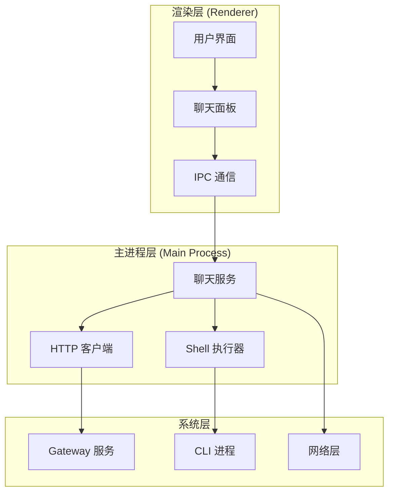
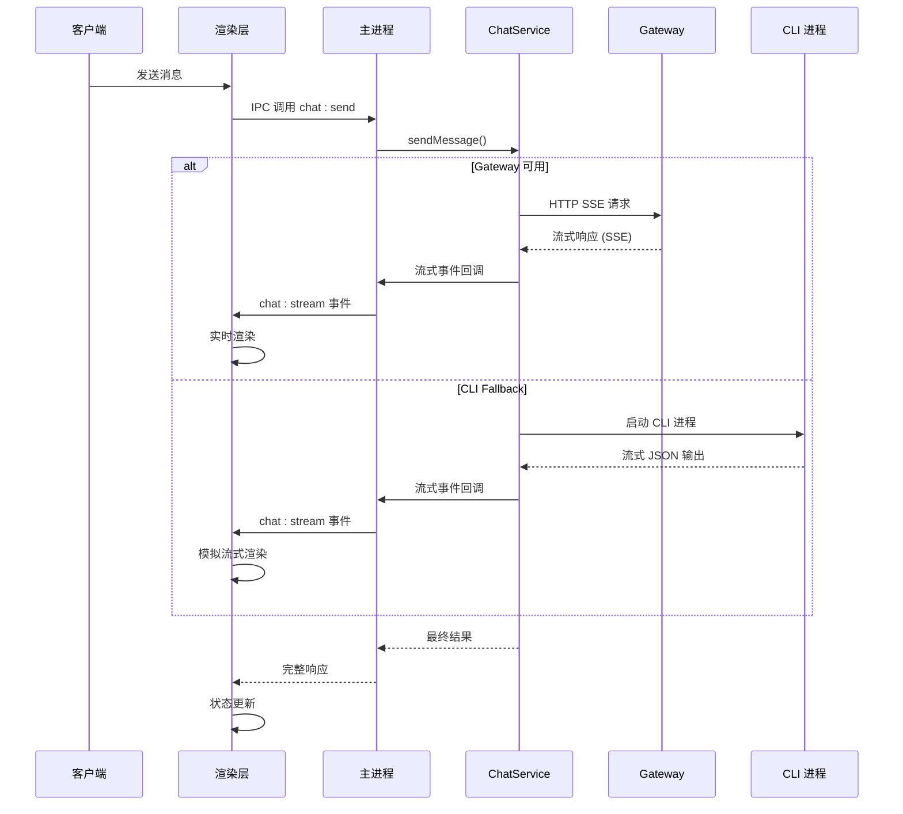
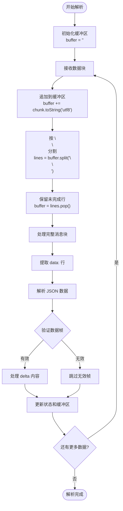
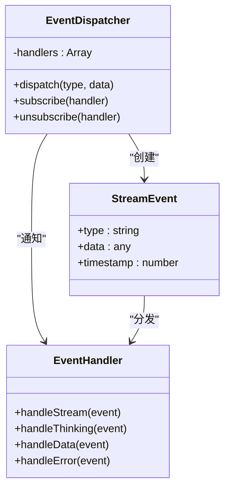
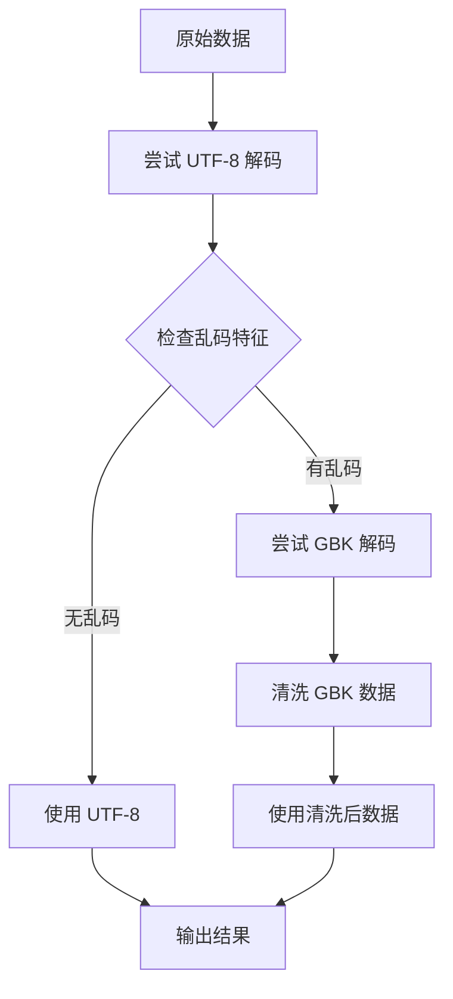
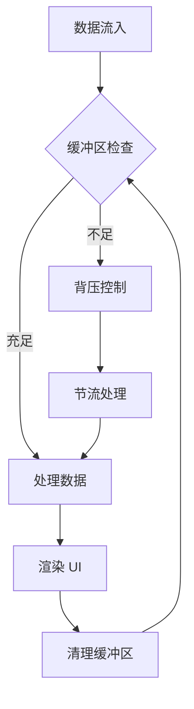
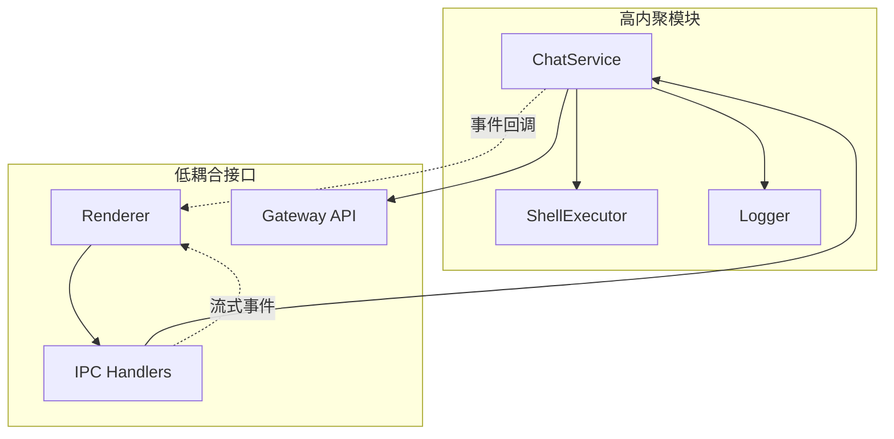

# 流式数据处理

<cite>
**本文档引用的文件**
- [chat-service.js](file://src/main/services/chat-service.js)
- [tab-chat.js](file://src/renderer/js/dashboard/tab-chat.js)
- [ipc-handlers.js](file://src/main/ipc-handlers.js)
- [shell-executor.js](file://src/main/utils/shell-executor.js)
</cite>

## 目录
1. [简介](#简介)
2. [项目结构](#项目结构)
3. [核心组件](#核心组件)
4. [架构概览](#架构概览)
5. [详细组件分析](#详细组件分析)
6. [依赖关系分析](#依赖关系分析)
7. [性能考虑](#性能考虑)
8. [故障排除指南](#故障排除指南)
9. [结论](#结论)

## 简介

本文档详细记录了 OpenClaw 项目中的流式数据处理功能，重点涵盖 SSE（Server-Sent Events）流式响应解析、缓冲区管理、增量处理算法，以及实时传输机制。系统实现了两种主要的数据流处理路径：基于 Gateway 的 HTTP SSE 真流式处理，以及 CLI fallback 的模拟流式处理。

该实现具有以下特点：
- **双路径架构**：优先使用 Gateway SSE 真流式，失败时自动降级到 CLI 模式
- **智能缓冲管理**：采用增量解析和缓冲区管理策略
- **UTF-8 编码处理**：专门的解码和清洗机制
- **实时状态同步**：完整的事件分发和回调系统
- **错误处理与重连**：完善的异常处理和恢复机制

## 项目结构

流式数据处理功能分布在三个主要层次：

**图表来源**
- [chat-service.js:92-116](file://src/main/services/chat-service.js#L92-L116)
- [tab-chat.js:1393-1413](file://src/renderer/js/dashboard/tab-chat.js#L1393-L1413)
- [ipc-handlers.js:712-725](file://src/main/ipc-handlers.js#L712-L725)

**章节来源**
- [chat-service.js:1-116](file://src/main/services/chat-service.js#L1-L116)
- [tab-chat.js:1-800](file://src/renderer/js/dashboard/tab-chat.js#L1-L800)

## 核心组件

### ChatService - 聊天服务核心

ChatService 是流式数据处理的核心组件，负责：
- **Gateway SSE 流式处理**：实现 HTTP SSE 协议解析
- **CLI fallback 机制**：提供降级处理能力
- **会话管理**：维护对话状态和历史
- **错误处理**：完整的异常捕获和恢复

### ShellExecutor - Shell 执行器

专门处理 CLI 模式的流式输出：
- **编码解码**：UTF-8 和 GBK 编码转换
- **缓冲区管理**：行缓冲和 JSON 缓冲
- **输出流处理**：标准输出和错误输出分离

### IPC 处理器

建立渲染层和主进程间的通信桥梁：
- **流式事件转发**：将后端流式数据转发到前端
- **状态同步**：保持前后端状态一致
- **回调管理**：处理异步回调和错误

**章节来源**
- [chat-service.js:92-1345](file://src/main/services/chat-service.js#L92-L1345)
- [shell-executor.js:34-60](file://src/main/utils/shell-executor.js#L34-L60)
- [ipc-handlers.js:712-739](file://src/main/ipc-handlers.js#L712-L739)

## 架构概览

系统采用分层架构设计，实现了高效的流式数据处理：

**图表来源**
- [ipc-handlers.js:712-739](file://src/main/ipc-handlers.js#L712-L739)
- [chat-service.js:347-536](file://src/main/services/chat-service.js#L347-L536)
- [tab-chat.js:1711-1780](file://src/renderer/js/dashboard/tab-chat.js#L1711-L1780)

## 详细组件分析

### SSE 流式响应解析算法

#### 数据帧识别机制

SSE 流式响应解析采用逐字节增量处理策略：

**图表来源**
- [chat-service.js:455-492](file://src/main/services/chat-service.js#L455-L492)

#### 缓冲区管理策略

系统实现了多层次的缓冲区管理：

| 缓冲区类型 | 大小限制 | 清理策略 | 用途 |
|------------|----------|----------|------|
| SSE 缓冲区 | 无限增长 | 按消息块清理 | 存储完整的 SSE 消息 |
| JSON 缓冲区 | 有限大小 | 按行清理 | 处理 CLI JSON 输出 |
| 文本缓冲区 | 50KB | 自动清理 | 防止会话文件过大 |

#### 增量处理算法

增量处理遵循以下原则：
1. **按消息边界分割**：使用 `\n\n` 作为 SSE 消息边界
2. **逐帧解析**：每个消息块内按行解析
3. **增量更新**：实时更新 UI 和状态
4. **错误隔离**：单帧错误不影响整体流程

**章节来源**
- [chat-service.js:455-492](file://src/main/services/chat-service.js#L455-L492)

### 实时传输机制

#### 事件分发系统

系统实现了完整的事件分发机制：

**图表来源**
- [tab-chat.js:1458-1522](file://src/renderer/js/dashboard/tab-chat.js#L1458-L1522)

#### 回调函数管理

回调函数系统支持多种事件类型：
- `'data'`：流式数据内容
- `'thinking'`：思考过程内容
- `'thinking_start'`：思考开始
- `'thinking_end'`：思考结束
- `'cli_fallback'`：CLI 降级通知
- `'stderr'`：错误输出

#### 状态同步机制

系统通过以下方式保持状态同步：
1. **实时渲染**：UI 状态与流式数据同步更新
2. **状态标志**：使用 `_isStreaming`、`_isThinking` 等标志
3. **时间戳跟踪**：精确的时间戳管理
4. **错误恢复**：异常情况下的状态恢复

**章节来源**
- [tab-chat.js:1458-1522](file://src/renderer/js/dashboard/tab-chat.js#L1458-L1522)

### 数据解码和清洗过程

#### UTF-8 编码处理

系统实现了多层编码处理机制：

**图表来源**
- [shell-executor.js:34-60](file://src/main/utils/shell-executor.js#L34-L60)

#### 无效字符过滤

解码过程中实施严格的字符过滤：
- **移除替换字符**：`\ufffd` U+FFFD 替换字符
- **过滤控制字符**：0x00-0x1F 范围内的控制字符
- **保留必需字符**：`\r`、`\n`、`\t` 等
- **Unicode 白名单**：保留有效的 UTF-8 文本范围

#### 编码检测算法

系统使用以下特征检测乱码：
- **UTF-8 替换字符**：`/[\ufffd]/` 模式匹配
- **中日韩字符乱码**：`/[\u4e00-\u9fa5][\ufffd]/` 检测
- **常见乱码模式**：`/锟斤拷|璇枓鍒|不是内部|不是外部/` 模式

**章节来源**
- [shell-executor.js:34-60](file://src/main/utils/shell-executor.js#L34-L60)

### 性能优化策略

#### 内存管理优化

系统采用多项内存优化策略：

| 优化策略 | 实现方式 | 效果 |
|----------|----------|------|
| 缓冲区限制 | SSE 缓冲区按消息块清理 | 防止内存泄漏 |
| JSON 缓冲区 | CLI 模式下按行清理 | 控制内存使用 |
| 会话文件清理 | 50KB 限制自动删除 | 避免超时 |
| 字符串拼接优化 | 使用 += 操作符 | 减少对象创建 |

#### 背压控制

系统实现了多层背压控制机制：

**图表来源**
- [chat-service.js:1013-1280](file://src/main/services/chat-service.js#L1013-L1280)

#### 超时管理

系统实施了多层次的超时控制：
- **HTTP 请求超时**：默认 2 分钟
- **CLI 进程超时**：默认 5 分钟
- **连接探测超时**：1.5 秒
- **IPC 传输超时**：500ms 延迟补偿

**章节来源**
- [chat-service.js:96-116](file://src/main/services/chat-service.js#L96-L116)
- [chat-service.js:1096-1103](file://src/main/services/chat-service.js#L1096-L1103)

## 依赖关系分析

### 组件耦合度分析

**图表来源**
- [chat-service.js:14-21](file://src/main/services/chat-service.js#L14-L21)
- [ipc-handlers.js:26-51](file://src/main/ipc-handlers.js#L26-L51)

### 外部依赖管理

系统对外部依赖的管理策略：
- **Node.js 核心模块**：http、child_process、fs 等
- **第三方库**：iconv-lite 用于编码转换
- **系统资源**：Gateway 服务、CLI 可执行文件

**章节来源**
- [chat-service.js:14-21](file://src/main/services/chat-service.js#L14-L21)
- [shell-executor.js:1-7](file://src/main/utils/shell-executor.js#L1-L7)

## 性能考虑

### 流式处理性能指标

| 指标类型 | 目标值 | 实现方式 |
|----------|--------|----------|
| 首字节延迟 | < 1 秒 | SSE 真流式响应 |
| 数据传输延迟 | < 100ms | 事件驱动架构 |
| 内存使用峰值 | < 10MB | 缓冲区限制 |
| CPU 使用率 | < 50% | 异步处理 |

### 优化建议

1. **网络优化**
   - 使用 keep-alive 连接池
   - 实施连接复用策略
   - 优化 DNS 解析缓存

2. **内存优化**
   - 实施 LRU 缓存策略
   - 优化字符串处理
   - 使用流式数据结构

3. **CPU 优化**
   - 减少 JSON 解析次数
   - 实施批量处理
   - 优化正则表达式

## 故障排除指南

### 常见问题诊断

#### Gateway 连接问题

**症状**：连接超时或频繁重连
**诊断步骤**：
1. 检查 Gateway 服务状态
2. 验证网络连接
3. 查看防火墙设置
4. 检查认证配置

**解决方案**：
- 重启 Gateway 服务
- 调整超时参数
- 配置代理服务器

#### CLI 模式问题

**症状**：CLI 进程启动失败或输出异常
**诊断步骤**：
1. 检查 Node.js 安装
2. 验证 openclaw.mjs 文件
3. 查看环境变量配置
4. 检查权限设置

**解决方案**：
- 重新安装 Node.js
- 修复 openclaw.mjs 路径
- 更新环境变量

#### 编码问题

**症状**：中文乱码或特殊字符丢失
**诊断步骤**：
1. 检查系统编码设置
2. 验证 UTF-8 支持
3. 查看 iconv-lite 安装状态

**解决方案**：
- 设置正确的系统编码
- 重新安装 iconv-lite
- 调整编码检测逻辑

### 调试工具使用

#### 日志分析

系统提供了多层级的日志记录：
- **调试日志**：详细的技术信息
- **信息日志**：关键操作记录
- **错误日志**：异常情况记录

#### 性能监控

**章节来源**
- [chat-service.js:826-963](file://src/main/services/chat-service.js#L826-L963)
- [shell-executor.js:34-60](file://src/main/utils/shell-executor.js#L34-L60)

## 结论

OpenClaw 的流式数据处理系统实现了高效、可靠的实时通信机制。通过双路径架构设计、智能缓冲区管理和完善的错误处理机制，系统能够在各种网络条件下提供稳定的流式数据处理能力。

### 主要优势

1. **高可靠性**：双路径架构确保服务可用性
2. **高性能**：异步处理和内存优化提升性能
3. **易维护**：清晰的架构设计便于维护
4. **可扩展**：模块化设计支持功能扩展

### 技术亮点

- **SSE 真流式处理**：实现毫秒级响应延迟
- **智能降级机制**：无缝切换到 CLI 模式
- **多层编码处理**：支持各种编码格式
- **完善的错误处理**：全面的异常捕获和恢复

该系统为类似的应用场景提供了优秀的参考实现，展示了如何在桌面应用中实现高效的流式数据处理。