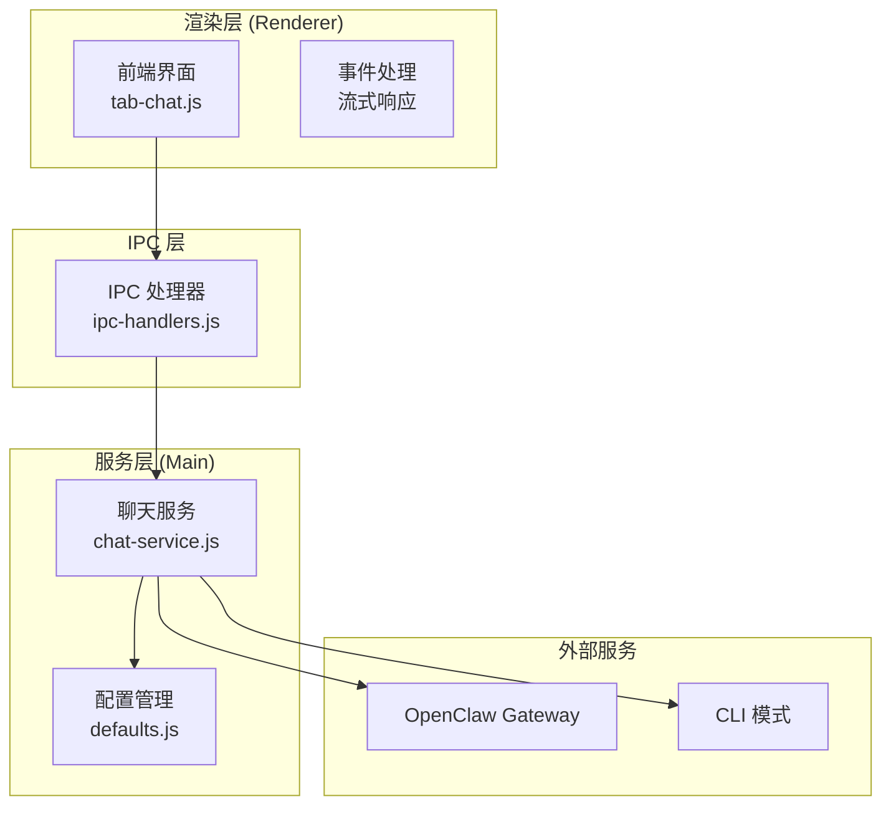
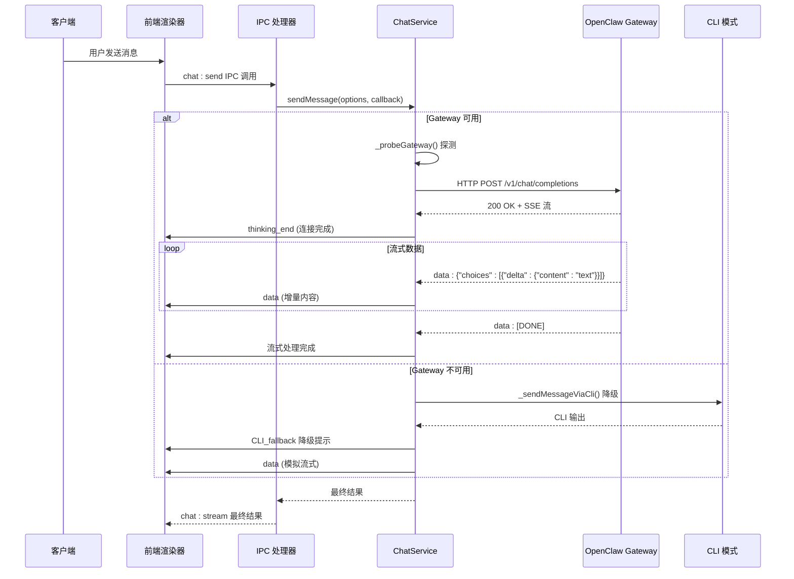
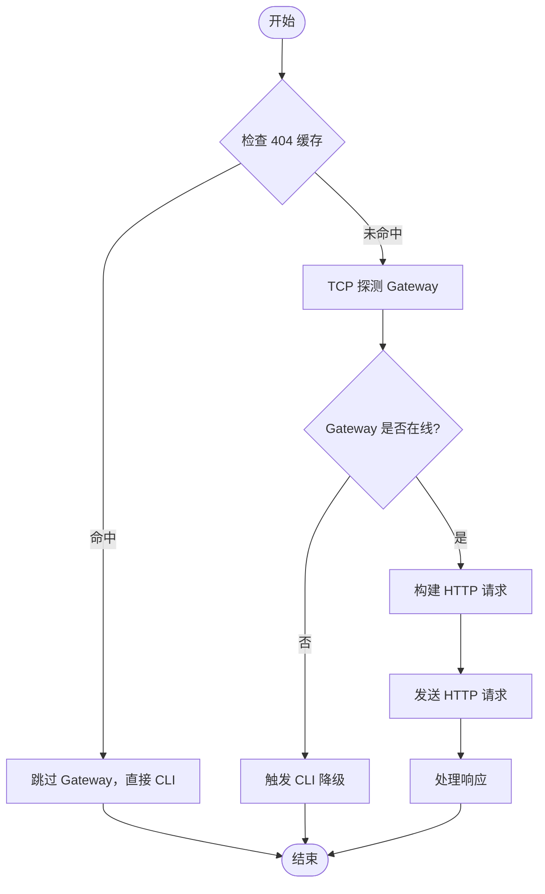
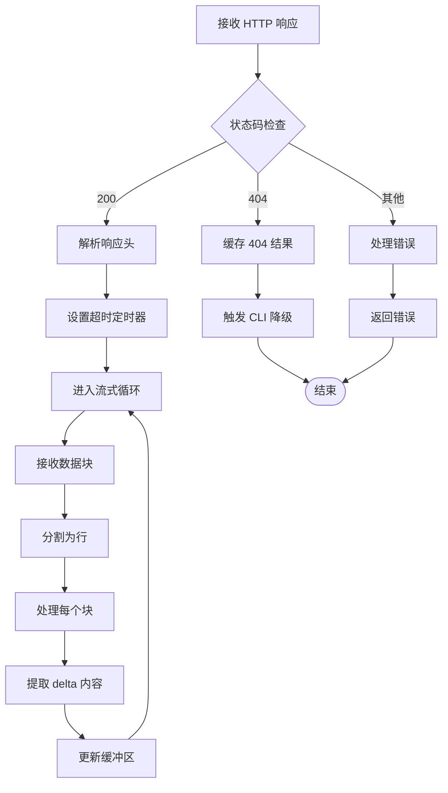
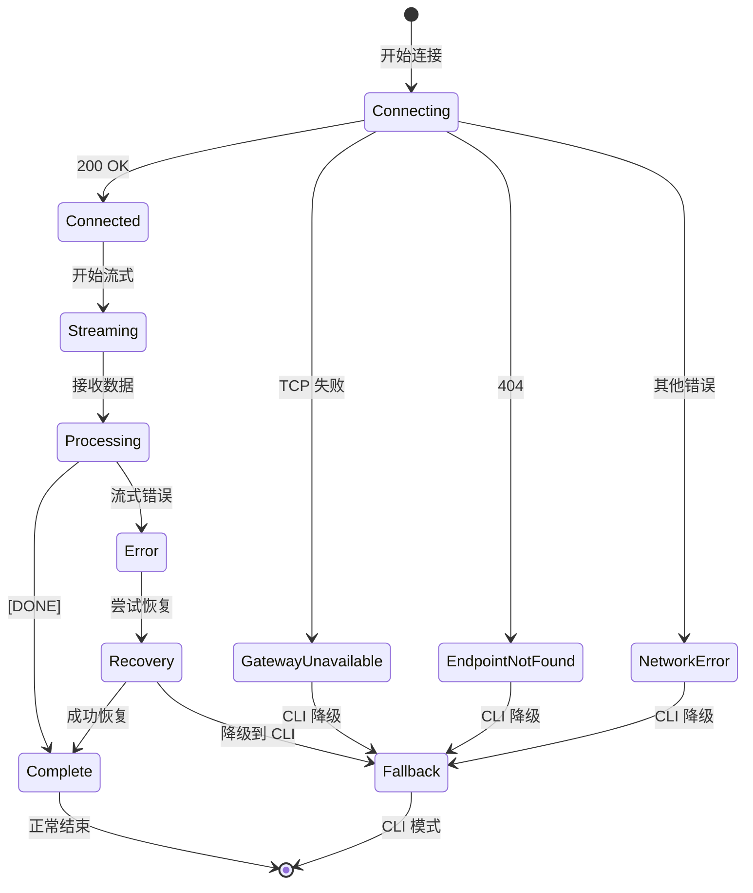
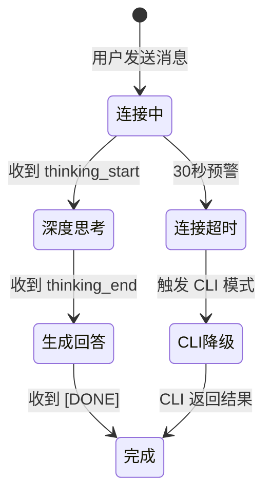
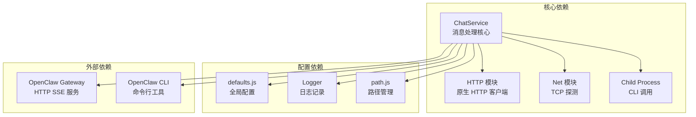

# 消息发送与处理

<cite>
**本文档引用的文件**
- [chat-service.js](file://src/main/services/chat-service.js)
- [defaults.js](file://src/main/config/defaults.js)
- [ipc-handlers.js](file://src/main/ipc-handlers.js)
- [tab-chat.js](file://src/renderer/js/dashboard/tab-chat.js)
- [check-chat.js](file://scripts/temp/check-chat.js)
</cite>

## 目录
1. [简介](#简介)
2. [项目结构](#项目结构)
3. [核心组件](#核心组件)
4. [架构概览](#架构概览)
5. [详细组件分析](#详细组件分析)
6. [依赖关系分析](#依赖关系分析)
7. [性能考虑](#性能考虑)
8. [故障排除指南](#故障排除指南)
9. [结论](#结论)

## 简介

本文档详细记录了消息发送与处理功能，重点分析 `sendMessageViaGateway` 方法的完整实现。该功能实现了通过 OpenClaw Gateway 的 HTTP SSE API 发送消息，支持真正的流式响应处理，并提供 OpenAI 兼容格式解析。

系统采用双路径架构：优先使用 Gateway HTTP SSE API（真流式），当 Gateway 不可用时自动降级到 CLI spawn 模式。这种设计确保了最佳的用户体验和可靠性。

## 项目结构

消息发送功能分布在三个主要层次：



**图表来源**
- [chat-service.js:92-116](file://src/main/services/chat-service.js#L92-L116)
- [ipc-handlers.js:26-51](file://src/main/ipc-handlers.js#L26-L51)

**章节来源**
- [chat-service.js:1-120](file://src/main/services/chat-service.js#L1-L120)
- [ipc-handlers.js:26-51](file://src/main/ipc-handlers.js#L26-L51)

## 核心组件

### ChatService 类

ChatService 是消息发送的核心服务类，负责：

- **Gateway 探测与连接管理**
- **HTTP SSE 流式响应处理**
- **CLI 模式降级处理**
- **会话管理和状态跟踪**

主要特性：
- 智能 Gateway 可用性缓存（30秒 TTL）
- 404 端点缓存（5分钟 TTL）
- 超时控制和错误恢复
- OpenAI 兼容的 SSE 格式解析

**章节来源**
- [chat-service.js:92-1345](file://src/main/services/chat-service.js#L92-L1345)

### 配置管理系统

系统配置集中在 defaults.js 中，包括：

- **网络配置**：Gateway 默认端口 18789，绑定地址 127.0.0.1
- **超时设置**：默认 2分钟，CLI 模式 5分钟
- **缓存策略**：Gateway 探测缓存 30秒，404 缓存 5分钟

**章节来源**
- [defaults.js:14-70](file://src/main/config/defaults.js#L14-L70)

## 架构概览

消息发送系统采用分层架构，确保高可用性和良好的用户体验：



**图表来源**
- [chat-service.js:968-984](file://src/main/services/chat-service.js#L968-L984)
- [ipc-handlers.js:712-725](file://src/main/ipc-handlers.js#L712-L725)

## 详细组件分析

### sendMessageViaGateway 方法详解

sendMessageViaGateway 是消息发送的核心方法，实现了完整的 HTTP SSE 流式处理：

#### 方法签名与参数

```javascript
async sendMessageViaGateway(options, onStream) {
    const { message, agent, onStream } = options;
    const agentId = agent || 'main';
}
```

**参数说明**：
- `options.message`: 用户发送的消息内容
- `options.agent`: 代理 ID，默认 'main'
- `options.onStream`: 流式回调函数，接收 (type, data) 参数

#### Gateway 探测与缓存机制



**图表来源**
- [chat-service.js:351-363](file://src/main/services/chat-service.js#L351-L363)

#### HTTP 请求构建

请求构建过程包含以下关键步骤：

1. **配置构建**：
   - Host: 127.0.0.1（默认）
   - Port: 18789（默认）
   - Path: `/v1/chat/completions`
   - Method: `POST`

2. **请求头设置**：
   - `Content-Type: application/json`
   - `Content-Length: Buffer.byteLength(body)`
   - `Authorization: Bearer ${token}`（如果配置）

3. **请求体结构**：
   ```json
   {
     "model": "openclaw:main",
     "stream": true,
     "messages": [
       {
         "role": "user",
         "content": "用户消息"
       }
     ]
   }
   ```

#### SSE 流式响应处理

系统支持 OpenAI 兼容的 SSE 格式：



**图表来源**
- [chat-service.js:411-535](file://src/main/services/chat-service.js#L411-L535)

#### OpenAI 兼容格式解析

系统能够解析标准的 OpenAI SSE 格式：

```
data: {"choices":[{"delta":{"content":"文本内容"}}]}

data: [DONE]
```

解析逻辑：
1. **行级处理**：按 `\n\n` 分割每个 SSE 帧
2. **JSON 解析**：提取 `data:` 后的 JSON 内容
3. **内容提取**：从 `choices[0].delta.content` 获取增量文本
4. **错误处理**：忽略解析失败的行

#### 错误处理与恢复策略

系统实现了多层次的错误处理：



**图表来源**
- [chat-service.js:412-447](file://src/main/services/chat-service.js#L412-L447)

**章节来源**
- [chat-service.js:347-535](file://src/main/services/chat-service.js#L347-L535)

### 前端流式响应处理

前端通过 tab-chat.js 实现了完整的流式响应处理：

#### 流式事件类型

前端识别以下流式事件类型：

| 事件类型 | 用途 | 触发时机 |
|---------|------|----------|
| `thinking_start` | 思考开始 | 收到思考阶段开始信号 |
| `thinking` | 思考内容 | 流式传输思考过程 |
| `thinking_end` | 思考结束 | 思考阶段完成 |
| `data` | 正文内容 | 流式传输回答内容 |
| `stderr` | 错误输出 | CLI 模式下的错误信息 |
| `cli_fallback` | CLI 降级 | Gateway 不可用时 |

#### 等待状态管理

前端实现了智能的等待状态指示：



**图表来源**
- [tab-chat.js:1458-1522](file://src/renderer/js/dashboard/tab-chat.js#L1458-L1522)

**章节来源**
- [tab-chat.js:1393-1522](file://src/renderer/js/dashboard/tab-chat.js#L1393-L1522)

### CLI 模式降级处理

当 Gateway 不可用时，系统自动降级到 CLI 模式：

#### 降级触发条件

1. **TCP 探测失败**：Gateway 端口不可达
2. **404 错误**：`/v1/chat/completions` 端点不存在
3. **连接错误**：HTTP 连接失败
4. **超时错误**：请求超时

#### CLI 模式特点

- **模拟流式输出**：将完整文本分块推送给前端
- **超时控制**：默认 5分钟超时
- **错误处理**：详细的错误诊断和提示
- **会话管理**：支持会话持久化和恢复

**章节来源**
- [chat-service.js:986-1280](file://src/main/services/chat-service.js#L986-L1280)

## 依赖关系分析

消息发送功能涉及多个组件间的复杂交互：



**图表来源**
- [chat-service.js:14-24](file://src/main/services/chat-service.js#L14-L24)

**章节来源**
- [chat-service.js:14-24](file://src/main/services/chat-service.js#L14-L24)

## 性能考虑

### 缓存策略

系统实现了多层缓存机制以提升性能：

1. **Gateway 可用性缓存**：30秒 TTL，避免频繁探测
2. **404 端点缓存**：5分钟 TTL，减少不必要的 HTTP 请求
3. **配置缓存**：避免频繁读取配置文件

### 超时管理

- **默认超时**：2分钟（适用于 Gateway 模式）
- **CLI 超时**：5分钟（考虑模型推理时间）
- **TCP 探测超时**：1.5秒（快速失败）

### 内存管理

- **流式处理**：避免将整个响应加载到内存
- **缓冲区管理**：合理管理 SSE 数据缓冲区
- **定时器清理**：及时清理超时和错误场景的定时器

## 故障排除指南

### 常见问题及解决方案

#### Gateway 无法连接

**症状**：前端显示连接超时或错误

**诊断步骤**：
1. 检查 Gateway 服务状态
2. 验证端口 18789 是否开放
3. 确认防火墙设置

**解决方案**：
- 启动 OpenClaw Gateway 服务
- 检查网络连接
- 验证配置文件

#### SSE 流式响应中断

**症状**：消息发送成功但无流式反馈

**诊断步骤**：
1. 检查网络稳定性
2. 验证 Gateway SSE 功能
3. 查看浏览器控制台错误

**解决方案**：
- 重试连接
- 检查代理设置
- 更新浏览器版本

#### CLI 模式失败

**症状**：降级到 CLI 后仍然失败

**诊断步骤**：
1. 检查 Node.js 安装
2. 验证 openclaw.mjs 文件存在
3. 确认 API Key 配置

**解决方案**：
- 重新安装 Node.js
- 重新安装 OpenClaw
- 检查 API 配置

**章节来源**
- [chat-service.js:412-447](file://src/main/services/chat-service.js#L412-L447)

## 结论

消息发送与处理功能通过精心设计的架构实现了高性能、高可靠性的消息通信。核心优势包括：

1. **真流式体验**：通过 HTTP SSE 提供实时响应
2. **智能降级**：Gateway 不可用时自动切换到 CLI 模式
3. **完善的错误处理**：多层次的错误检测和恢复机制
4. **性能优化**：缓存策略和超时管理确保系统稳定性

该实现为用户提供了流畅的对话体验，同时保证了在各种网络和配置条件下的可靠性。通过 OpenAI 兼容的格式支持，系统具有良好的扩展性和互操作性。