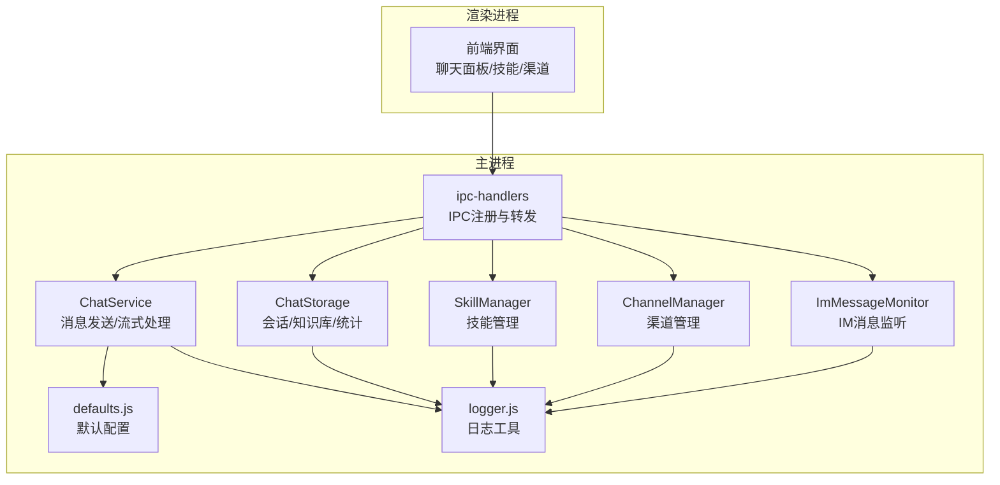
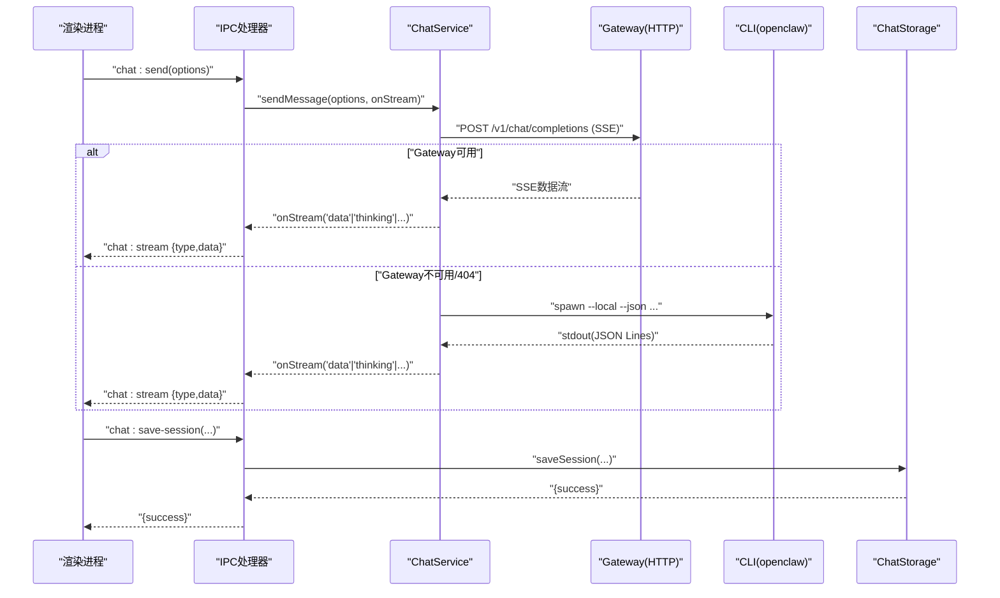
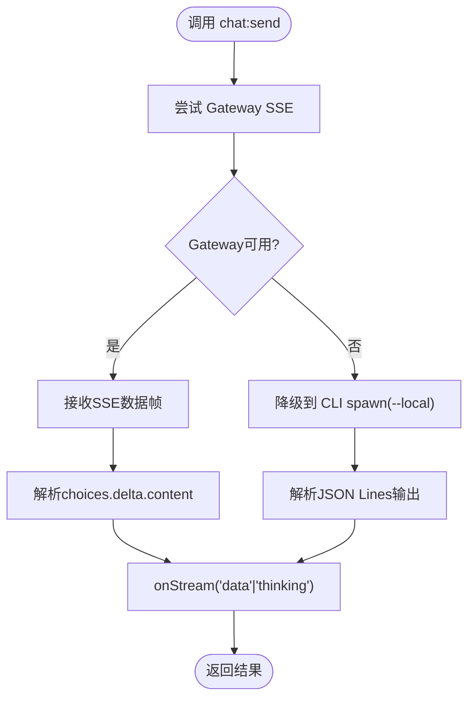
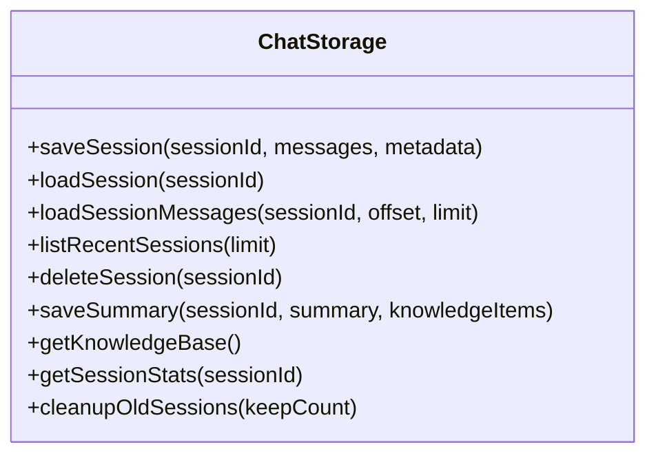
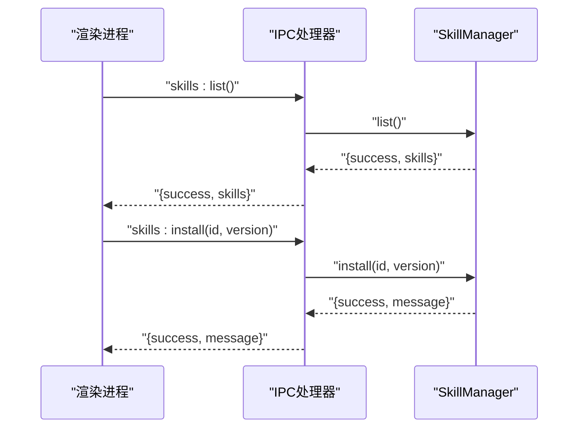
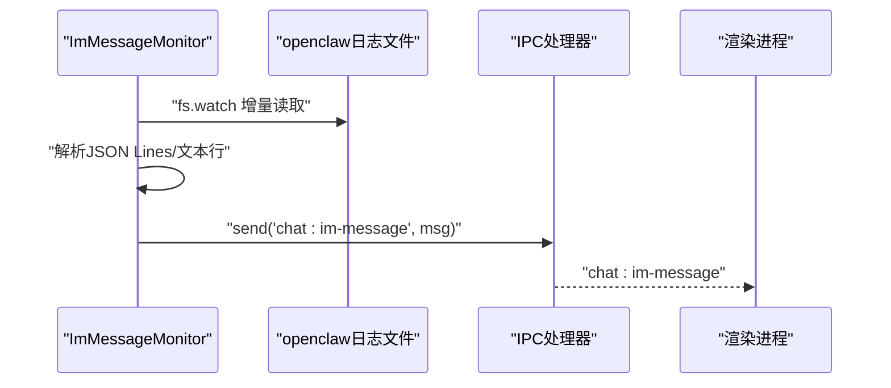
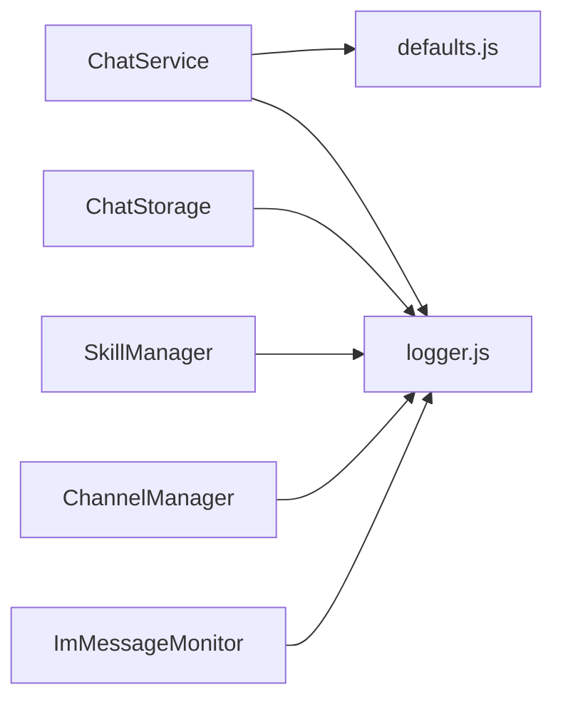

# 聊天服务 API

<cite>
**本文档引用的文件**
- [chat-service.js](file://src/main/services/chat-service.js)
- [chat-storage.js](file://src/main/services/chat-storage.js)
- [ipc-handlers.js](file://src/main/ipc-handlers.js)
- [skill-manager.js](file://src/main/services/skill-manager.js)
- [channel-manager.js](file://src/main/services/channel-manager.js)
- [im-message-monitor.js](file://src/main/services/im-message-monitor.js)
- [defaults.js](file://src/main/config/defaults.js)
- [logger.js](file://src/main/utils/logger.js)
- [package.json](file://package.json)
- [README.md](file://README.md)
</cite>

## 目录
1. [简介](#简介)
2. [项目结构](#项目结构)
3. [核心组件](#核心组件)
4. [架构总览](#架构总览)
5. [详细组件分析](#详细组件分析)
6. [依赖关系分析](#依赖关系分析)
7. [性能考虑](#性能考虑)
8. [故障排除指南](#故障排除指南)
9. [结论](#结论)
10. [附录](#附录)

## 简介
本文件面向聊天服务 API 的使用者与维护者，系统化梳理消息发送接口（含流式响应与实时传输）、会话管理、聊天存储、代理与技能集成、知识库管理、附件处理与文件上传、以及 IM 渠道消息监听等能力。文档同时提供架构设计说明与性能优化建议，并给出集成示例与最佳实践。

## 项目结构
聊天服务相关的核心代码位于主进程的 services 目录，通过 IPC 通道向渲染进程提供能力。主要模块包括：
- 聊天服务：消息发送、流式回调、代理与技能列表、会话清理
- 聊天存储：会话保存/加载/分页/统计、知识库管理
- 技能管理：技能列表、安装/卸载/启用/禁用、搜索与信息获取
- 渠道管理：飞书/钉钉/企业微信/QQ 等渠道配置与连接测试
- IM 消息监听：基于日志的实时消息捕获与推送
- IPC 处理器：统一注册聊天、存储、技能、渠道等 API

**图表来源**
- [ipc-handlers.js:26-816](file://src/main/ipc-handlers.js#L26-L816)
- [chat-service.js:92-1345](file://src/main/services/chat-service.js#L92-L1345)
- [chat-storage.js:15-333](file://src/main/services/chat-storage.js#L15-L333)
- [skill-manager.js:9-1096](file://src/main/services/skill-manager.js#L9-L1096)
- [channel-manager.js:8-747](file://src/main/services/channel-manager.js#L8-L747)
- [im-message-monitor.js:95-498](file://src/main/services/im-message-monitor.js#L95-L498)
- [defaults.js:14-180](file://src/main/config/defaults.js#L14-L180)
- [logger.js:7-75](file://src/main/utils/logger.js#L7-L75)

**章节来源**
- [README.md:36-90](file://README.md#L36-L90)
- [package.json:1-75](file://package.json#L1-L75)

## 核心组件
- ChatService：消息发送（Gateway SSE 优先，CLI 降级）、流式回调、代理与技能列表、会话清理、锁文件清理
- ChatStorage：会话持久化、分页加载、统计、知识库、清理过期会话
- SkillManager：技能列表、安装/卸载/启用/禁用、搜索、信息、更新、导入内置技能
- ChannelManager：渠道定义、插件检测与安装、配置读写、连接测试、配对码验证
- ImMessageMonitor：基于日志的 IM 消息监听与推送
- IPC 处理器：统一注册聊天、存储、技能、渠道等 API，桥接主/渲染进程

**章节来源**
- [chat-service.js:92-1345](file://src/main/services/chat-service.js#L92-L1345)
- [chat-storage.js:15-333](file://src/main/services/chat-storage.js#L15-L333)
- [skill-manager.js:9-1096](file://src/main/services/skill-manager.js#L9-L1096)
- [channel-manager.js:8-747](file://src/main/services/channel-manager.js#L8-L747)
- [im-message-monitor.js:95-498](file://src/main/services/im-message-monitor.js#L95-L498)
- [ipc-handlers.js:26-816](file://src/main/ipc-handlers.js#L26-L816)

## 架构总览
聊天服务采用“主进程服务 + IPC 通道”的架构：
- 渲染进程通过 IPC 调用主进程服务，主进程服务执行具体逻辑（HTTP 请求、文件系统、子进程等）
- 聊天消息发送优先使用 Gateway HTTP SSE，失败时自动降级到 CLI 模式
- 流式响应通过 onStream 回调实时推送到渲染进程
- 会话与知识库持久化到用户目录，遵循约定的 JSON 结构
- 技能与渠道管理通过 openclaw CLI 与文件系统协同

**图表来源**
- [ipc-handlers.js:712-754](file://src/main/ipc-handlers.js#L712-L754)
- [chat-service.js:968-1000](file://src/main/services/chat-service.js#L968-L1000)
- [chat-service.js:347-536](file://src/main/services/chat-service.js#L347-L536)
- [chat-service.js:1005-1280](file://src/main/services/chat-service.js#L1005-L1280)
- [chat-storage.js:51-71](file://src/main/services/chat-storage.js#L51-L71)

**章节来源**
- [ipc-handlers.js:712-754](file://src/main/ipc-handlers.js#L712-L754)
- [chat-service.js:968-1000](file://src/main/services/chat-service.js#L968-L1000)
- [chat-service.js:347-536](file://src/main/services/chat-service.js#L347-L536)
- [chat-service.js:1005-1280](file://src/main/services/chat-service.js#L1005-L1280)

## 详细组件分析

### 消息发送接口与流式响应
- 接口：`chat:send`（优先 Gateway SSE，失败降级 CLI）
- 流式回调类型：
  - `data`：增量文本片段
  - `thinking`：推理阶段文本
  - `thinking_start/thinking_end`：推理阶段开始/结束
  - `cli_fallback`：Gateway 不可用时的降级提示
  - `stderr`：CLI 标准错误
- Gateway SSE 支持：
  - OpenAI 兼容的 SSE 数据帧
  - 自动解析 choices.delta.content
  - 404/401/403/5xx 错误的降级策略
- CLI 降级：
  - 使用 Node.js 直接调用 openclaw.mjs
  - 支持 --local 模式绕过 Gateway
  - JSON Lines 输出解析与首包延迟记录
- 会话锁清理：
  - 清理过期/异常的 session.lock 文件，避免并发阻塞

**图表来源**
- [ipc-handlers.js:712-754](file://src/main/ipc-handlers.js#L712-L754)
- [chat-service.js:347-536](file://src/main/services/chat-service.js#L347-L536)
- [chat-service.js:1005-1280](file://src/main/services/chat-service.js#L1005-L1280)

**章节来源**
- [ipc-handlers.js:712-754](file://src/main/ipc-handlers.js#L712-L754)
- [chat-service.js:347-536](file://src/main/services/chat-service.js#L347-L536)
- [chat-service.js:1005-1280](file://src/main/services/chat-service.js#L1005-L1280)

### 会话管理与存储
- 保存会话：`chat:save-session(sessionId, messages, metadata)`
- 加载会话：`chat:load-session(sessionId)`
- 分页加载：`chat:load-session-messages(sessionId, offset, limit)`
- 最近会话：`chat:list-sessions(limit)`
- 删除会话：`chat:delete-session(sessionId)`
- 保存总结与知识库：`chat:save-summary(sessionId, summary, knowledgeItems)`、`chat:get-knowledge()`
- 会话统计：`chat:session-stats(sessionId)`
- 清理过期会话：`cleanupOldSessions(keepCount)`

**图表来源**
- [chat-storage.js:15-333](file://src/main/services/chat-storage.js#L15-L333)

**章节来源**
- [ipc-handlers.js:758-796](file://src/main/ipc-handlers.js#L758-L796)
- [chat-storage.js:51-333](file://src/main/services/chat-storage.js#L51-L333)

### 代理列表与技能集成
- 代理列表：`chat:agents`（当前返回默认代理）
- 技能列表：`chat:skills`（通过 CLI 获取）
- 技能管理：安装/卸载/启用/禁用/搜索/信息/更新/导入内置技能
- 技能市场：支持 clawhub 搜索与探索（受速率限制）

**图表来源**
- [ipc-handlers.js:543-591](file://src/main/ipc-handlers.js#L543-L591)
- [skill-manager.js:133-326](file://src/main/services/skill-manager.js#L133-L326)
- [skill-manager.js:373-398](file://src/main/services/skill-manager.js#L373-L398)

**章节来源**
- [ipc-handlers.js:543-591](file://src/main/ipc-handlers.js#L543-L591)
- [chat-service.js:1285-1333](file://src/main/services/chat-service.js#L1285-L1333)
- [skill-manager.js:133-326](file://src/main/services/skill-manager.js#L133-L326)

### 知识库管理
- 保存会话总结时，同时追加知识项到知识库文件
- 知识库去重（基于项 id）
- 提供获取知识库与清空过期会话的能力

**章节来源**
- [chat-storage.js:199-270](file://src/main/services/chat-storage.js#L199-L270)

### 附件处理与文件上传
- 文件选择对话框：支持多选、过滤常见扩展名
- 文件大小限制：单文件最大 500KB
- Office/PDF 类型提示：不支持直接读取内容
- 返回结构：包含文件名、路径、内容、大小与错误信息

**章节来源**
- [ipc-handlers.js:472-522](file://src/main/ipc-handlers.js#L472-L522)

### IM 渠道消息监听
- 基于 openclaw 日志文件（JSON Lines）的实时监听
- 支持渠道：飞书、钉钉、企业微信、Slack、Telegram、Discord、WhatsApp 等
- 消息方向识别：inbound/outbound
- 推送格式：channel、role、content、sender、timestamp 等

**图表来源**
- [im-message-monitor.js:110-134](file://src/main/services/im-message-monitor.js#L110-L134)
- [im-message-monitor.js:217-244](file://src/main/services/im-message-monitor.js#L217-L244)
- [im-message-monitor.js:263-286](file://src/main/services/im-message-monitor.js#L263-L286)
- [ipc-handlers.js:800-812](file://src/main/ipc-handlers.js#L800-L812)

**章节来源**
- [im-message-monitor.js:95-498](file://src/main/services/im-message-monitor.js#L95-L498)
- [ipc-handlers.js:800-812](file://src/main/ipc-handlers.js#L800-L812)

### 聊天机器人集成示例与最佳实践
- 集成步骤
  - 通过 `chat:send` 发送消息，订阅 `chat:stream` 实时接收流式数据
  - 使用 `chat:save-session` 保存会话，`chat:load-session` 加载历史
  - 使用 `chat:skills` 获取可用技能，结合技能执行扩展能力
  - 使用 `chat:get-knowledge` 获取知识库，辅助上下文增强
- 最佳实践
  - 优先使用 Gateway SSE，确保低延迟与真实流式体验
  - 在 Gateway 不可用时，利用 CLI 降级保证可用性
  - 合理设置超时（默认 2 分钟，CLI 聊天最长 5 分钟）
  - 对于长对话，定期清理过期会话，避免上下文过长导致超时
  - 使用 `thinking_start/thinking_end` 与 `thinking` 提示用户推理阶段

**章节来源**
- [defaults.js:34-70](file://src/main/config/defaults.js#L34-L70)
- [chat-service.js:968-1000](file://src/main/services/chat-service.js#L968-L1000)
- [chat-storage.js:305-329](file://src/main/services/chat-storage.js#L305-L329)

## 依赖关系分析
- ChatService 依赖：
  - defaults.js（网络与超时配置）
  - logger.js（日志）
  - 文件系统与子进程（Node spawn）
- ChatStorage 依赖：
  - 文件系统（JSON 持久化）
  - logger.js
- SkillManager/ChannelManager/ImMessageMonitor 依赖：
  - ShellExecutor（命令执行）
  - logger.js
  - 文件系统

**图表来源**
- [chat-service.js:14-21](file://src/main/services/chat-service.js#L14-L21)
- [chat-storage.js:10-13](file://src/main/services/chat-storage.js#L10-L13)
- [skill-manager.js:1-7](file://src/main/services/skill-manager.js#L1-L7)
- [channel-manager.js:1-7](file://src/main/services/channel-manager.js#L1-L7)
- [im-message-monitor.js:28-32](file://src/main/services/im-message-monitor.js#L28-L32)

**章节来源**
- [chat-service.js:14-21](file://src/main/services/chat-service.js#L14-L21)
- [chat-storage.js:10-13](file://src/main/services/chat-storage.js#L10-L13)
- [skill-manager.js:1-7](file://src/main/services/skill-manager.js#L1-L7)
- [channel-manager.js:1-7](file://src/main/services/channel-manager.js#L1-L7)
- [im-message-monitor.js:28-32](file://src/main/services/im-message-monitor.js#L28-L32)

## 性能考虑
- 超时与缓存
  - Gateway 探测缓存（30 秒）与 404 缓存（5 分钟），降低重复探测成本
  - 技能列表缓存（60 秒），减少 CLI 调用频率
- 流式传输
  - SSE 真流式响应，避免等待完整响应
  - CLI 模式下模拟流式，按行与分段输出，提升感知速度
- 会话与上下文
  - CLI 会话文件超过 50KB 时自动清理，避免推理超时
  - 会话清理策略（保留最近 N 个），控制存储增长
- 日志与诊断
  - 详细的首包延迟与 stdout/stderr 记录，便于定位性能瓶颈

**章节来源**
- [defaults.js:34-70](file://src/main/config/defaults.js#L34-L70)
- [chat-service.js:154-182](file://src/main/services/chat-service.js#L154-L182)
- [chat-service.js:1038-1048](file://src/main/services/chat-service.js#L1038-L1048)
- [chat-storage.js:305-329](file://src/main/services/chat-storage.js#L305-L329)

## 故障排除指南
- Gateway 不可用
  - 现象：SSE 连接失败或 404/401/403/5xx
  - 处理：自动降级到 CLI --local 模式；检查 Gateway 端口与鉴权
- CLI 进程启动失败
  - 现象：找不到 Node.js、openclaw.mjs 不存在、spawn 失败
  - 处理：确认 Node.js 安装与 PATH；检查 openclaw 安装路径
- 会话锁阻塞
  - 现象：CLI 调用长时间等待
  - 处理：自动清理过期/异常锁文件；检查 gateway.pid 是否持有 session 锁
- IM 消息未显示
  - 现象：未收到 chat:im-message
  - 处理：确认 openclaw 日志文件存在且可读；检查渠道配置与日志级别

**章节来源**
- [chat-service.js:347-536](file://src/main/services/chat-service.js#L347-L536)
- [chat-service.js:1005-1280](file://src/main/services/chat-service.js#L1005-L1280)
- [chat-service.js:826-963](file://src/main/services/chat-service.js#L826-L963)
- [im-message-monitor.js:139-200](file://src/main/services/im-message-monitor.js#L139-L200)

## 结论
本聊天服务 API 通过 Gateway SSE 与 CLI 降级相结合，提供了稳定、低延迟的流式对话能力；配合完善的会话存储、知识库、技能与渠道管理，能够满足桌面应用中智能对话的多种场景需求。建议在生产环境中充分利用流式回调、会话清理与缓存策略，以获得最佳的用户体验与性能表现。

## 附录
- API 总览（IPC）
  - 聊天：`chat:send`、`chat:send-local`、`chat:agents`、`chat:skills`、`chat:clear-session`
  - 存储：`chat:save-session`、`chat:load-session`、`chat:load-session-messages`、`chat:list-sessions`、`chat:delete-session`、`chat:save-summary`、`chat:get-knowledge`、`chat:session-stats`
  - 技能：`skills:list`、`skills:install`、`skills:remove`、`skills:enable`、`skills:disable`、`skills:search`、`skills:explore`、`skills:list-installed`、`skills:inspect`、`skills:info`、`skills:import-bundled`、`skills:get-bundled-list`、`skills:create-custom`
  - 渠道：`channels:list`、`channels:get`、`channels:update`、`channels:set-enabled`、`channels:test`、`channels:verify-pairing`、`channels:definitions`
  - IM：`chat:im-watch-start`、`chat:im-watch-stop`
- 附件：`dialog:selectFiles`（多选、过滤、大小限制、Office/PDF 提示）

**章节来源**
- [ipc-handlers.js:543-812](file://src/main/ipc-handlers.js#L543-L812)