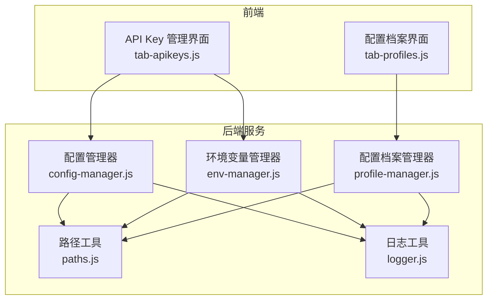
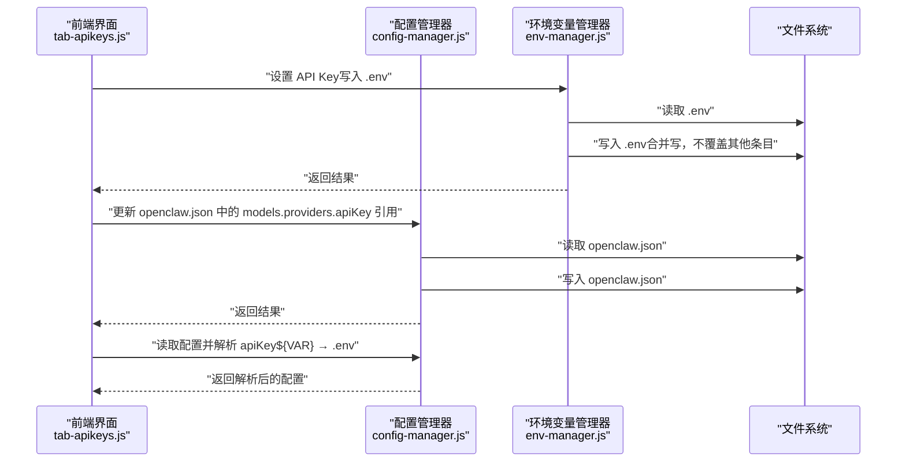
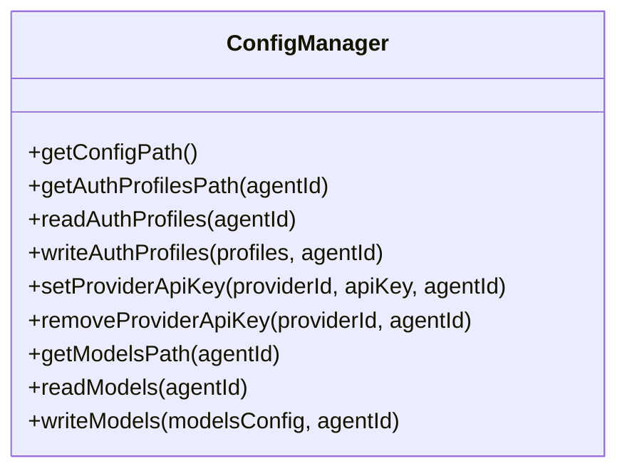
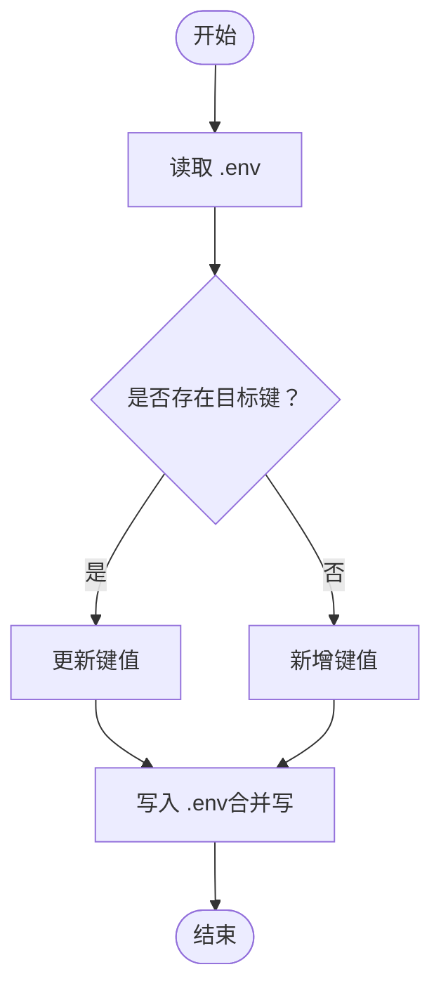
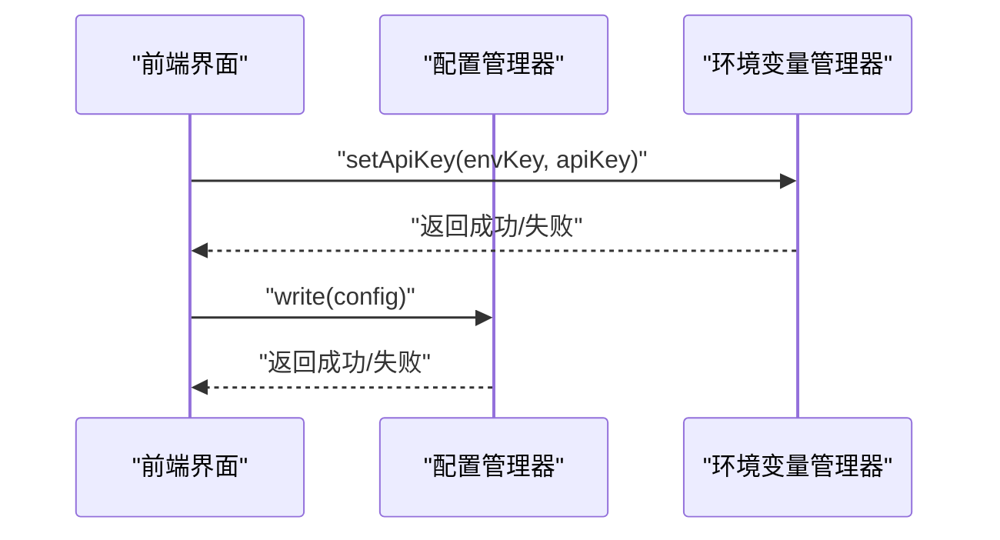
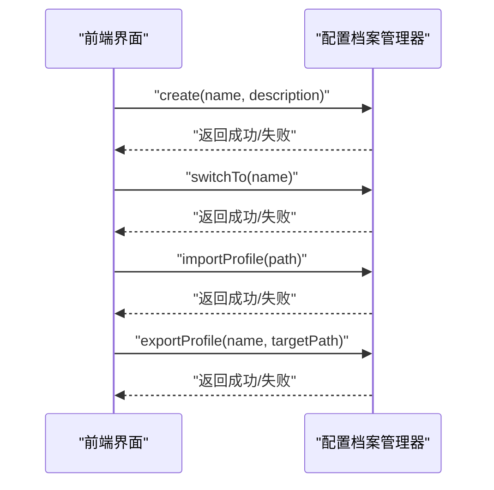
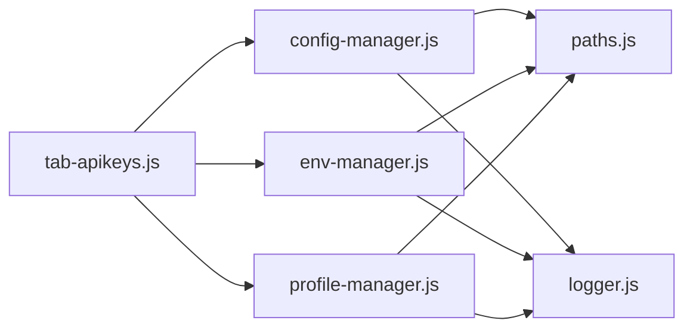

# API Key 管理 API

<cite>
**本文档引用的文件**
- [config-manager.js](file://src/main/services/config-manager.js)
- [tab-apikeys.js](file://src/renderer/js/dashboard/tabs/tab-apikeys.js)
- [paths.js](file://src/main/utils/paths.js)
- [logger.js](file://src/main/utils/logger.js)
- [env-manager.js](file://src/main/services/env-manager.js)
- [tab-profiles.js](file://src/renderer/js/dashboard/tabs/tab-profiles.js)
- [profile-manager.js](file://src/main/services/profile-manager.js)
</cite>

## 目录
1. [简介](#简介)
2. [项目结构](#项目结构)
3. [核心组件](#核心组件)
4. [架构总览](#架构总览)
5. [详细组件分析](#详细组件分析)
6. [依赖分析](#依赖分析)
7. [性能考虑](#性能考虑)
8. [故障排除指南](#故障排除指南)
9. [结论](#结论)

## 简介
本文件系统性地记录了 API Key 管理 API 的设计与实现，重点涵盖以下方面：
- auth-profiles.json 的读写接口与认证配置管理
- 单个 API Key 的设置、更新与删除流程
- 提供商标识符与密钥值的管理策略
- 多代理（agent）环境下的 API Key 分离机制与权限控制
- API Key 的加密存储、轮换与失效处理最佳实践
- 认证失败处理、密钥验证与安全审计日志记录机制
- API Key 的作用域、继承关系与优先级规则

## 项目结构
围绕 API Key 管理的关键文件与职责如下：
- 后端服务层
  - 配置管理器：负责读写 openclaw.json、auth-profiles.json、models.json 等配置文件
  - 环境变量管理器：负责 .env 文件的读写与 API Key 的安全存储
  - 路径工具：提供 OPENCLAW_HOME、CONFIG_PATH、ENV_PATH 等路径常量
  - 日志工具：提供统一的日志记录能力
- 前端渲染层
  - API Key 管理标签页：提供 UI 交互、密钥展示/隐藏、新增/编辑/删除、默认厂商设置、连接测试等功能
  - 配置档案标签页：提供配置快照、导入/导出、切换等能力

**图表来源**
- [tab-apikeys.js:15-52](file://src/renderer/js/dashboard/tabs/tab-apikeys.js#L15-L52)
- [config-manager.js:6-18](file://src/main/services/config-manager.js#L6-L18)
- [env-manager.js:61-88](file://src/main/services/env-manager.js#L61-L88)
- [profile-manager.js:41-98](file://src/main/services/profile-manager.js#L41-L98)
- [paths.js:8-12](file://src/main/utils/paths.js#L8-L12)
- [logger.js:7-25](file://src/main/utils/logger.js#L7-L25)

**章节来源**
- [tab-apikeys.js:15-52](file://src/renderer/js/dashboard/tabs/tab-apikeys.js#L15-L52)
- [config-manager.js:6-18](file://src/main/services/config-manager.js#L6-L18)
- [env-manager.js:61-88](file://src/main/services/env-manager.js#L61-L88)
- [profile-manager.js:41-98](file://src/main/services/profile-manager.js#L41-L98)
- [paths.js:8-12](file://src/main/utils/paths.js#L8-L12)
- [logger.js:7-25](file://src/main/utils/logger.js#L7-L25)

## 核心组件
- 配置管理器（ConfigManager）
  - 提供 auth-profiles.json 的读写接口，支持按 agentId 分离
  - 提供 models.json 的读写接口（用于模型配置）
  - 提供 setProviderApiKey/removeProviderApiKey 接口，用于更新或删除特定提供商的 API Key
- 环境变量管理器（EnvManager）
  - 提供 .env 文件的读写接口，确保 API Key 以明文形式安全存储
  - 提供 setApiKey/removeApiKey 接口，用于设置或删除单个 API Key
- 路径工具（paths.js）
  - 定义 OPENCLAW_HOME、CONFIG_PATH、ENV_PATH、PROFILES_DIR 等关键路径
  - 支持 Windows 与 WSL 的路径转换
- 日志工具（logger.js）
  - 统一记录 INFO/WARN/ERROR/DEBUG 级别日志，便于审计与排障
- 前端 API Key 管理标签页（tab-apikeys.js）
  - 负责 UI 展示、交互、密钥展示/隐藏、新增/编辑/删除、默认厂商设置、连接测试
  - 与后端通过 window.openclawAPI.config/env/profiles 等 IPC 接口通信
- 配置档案管理器（profile-manager.js）与前端配置档案标签页（tab-profiles.js）
  - 提供配置快照、导入/导出、切换等能力，支持多环境隔离

**章节来源**
- [config-manager.js:25-121](file://src/main/services/config-manager.js#L25-L121)
- [env-manager.js:61-88](file://src/main/services/env-manager.js#L61-L88)
- [paths.js:8-12](file://src/main/utils/paths.js#L8-L12)
- [logger.js:57-71](file://src/main/utils/logger.js#L57-L71)
- [tab-apikeys.js:54-162](file://src/renderer/js/dashboard/tabs/tab-apikeys.js#L54-L162)
- [profile-manager.js:37-98](file://src/main/services/profile-manager.js#L37-L98)
- [tab-profiles.js:25-71](file://src/renderer/js/dashboard/tabs/tab-profiles.js#L25-L71)

## 架构总览
API Key 管理的整体流程如下：
- 新增/编辑 API Key：前端将真实密钥写入 .env，openclaw.json 中仅保存对 .env 的引用（${VAR}）
- 读取 API Key：前端从 openclaw.json 的 models.providers 中解析 apiKey 字段，若为 ${VAR} 引用，则从 .env 读取真实值
- 删除 API Key：同时从 .env 与 openclaw.json 中清理
- 默认厂商设置：更新 agents.defaults.model.primary，兼容旧配置字段
- 多代理隔离：auth-profiles.json 位于 agents/<agentId>/agent/ 目录，按 agentId 分离
- 安全审计：所有文件读写与关键操作均通过日志记录

**图表来源**
- [tab-apikeys.js:580-637](file://src/renderer/js/dashboard/tabs/tab-apikeys.js#L580-L637)
- [env-manager.js:61-70](file://src/main/services/env-manager.js#L61-L70)
- [config-manager.js:25-37](file://src/main/services/config-manager.js#L25-L37)

**章节来源**
- [tab-apikeys.js:580-637](file://src/renderer/js/dashboard/tabs/tab-apikeys.js#L580-L637)
- [env-manager.js:61-70](file://src/main/services/env-manager.js#L61-L70)
- [config-manager.js:25-37](file://src/main/services/config-manager.js#L25-L37)

## 详细组件分析

### 配置管理器（ConfigManager）
- 功能要点
  - auth-profiles.json 读写：按 agentId 定位路径，读取失败返回空结构，写入前备份原文件
  - models.json 读写：提供读取与写入接口，用于模型配置管理
  - API Key 管理：setProviderApiKey 与 removeProviderApiKey，直接更新 auth-profiles.json
  - 错误处理：捕获异常并记录日志，返回标准化结果对象
- 关键接口
  - readAuthProfiles(agentId)
  - writeAuthProfiles(profiles, agentId)
  - setProviderApiKey(providerId, apiKey, agentId)
  - removeProviderApiKey(providerId, agentId)
  - readModels(agentId)
  - writeModels(modelsConfig, agentId)

**图表来源**
- [config-manager.js:6-159](file://src/main/services/config-manager.js#L6-L159)

**章节来源**
- [config-manager.js:25-121](file://src/main/services/config-manager.js#L25-L121)

### 环境变量管理器（EnvManager）
- 功能要点
  - .env 文件读写：合并写入，不覆盖其他条目；删除时仅移除目标键
  - API Key 存储：唯一真实存储位置，确保明文密钥的安全性
- 关键接口
  - read()
  - write(vars)
  - setApiKey(envKey, apiKey)
  - removeApiKey(envKey)

**图表来源**
- [env-manager.js:61-88](file://src/main/services/env-manager.js#L61-L88)

**章节来源**
- [env-manager.js:61-88](file://src/main/services/env-manager.js#L61-L88)

### 前端 API Key 管理标签页（tab-apikeys.js）
- 功能要点
  - 列表展示：显示服务商、Base URL、API Key（支持遮罩/显示）、默认状态与操作按钮
  - 新增/编辑：弹窗输入 Base URL、API Key、模型；测试连接；保存至 openclaw.json 与 .env
  - 删除：从 .env 与 openclaw.json 中清理；必要时更新默认厂商
  - 默认厂商：解析 agents.defaults.model.primary，兼容旧字段；支持设置默认
  - 静默迁移：将 env.vars 中的明文 Key 迁移至 .env，并补全 models.providers.api 字段
- 关键流程
  - 新增流程：写入 .env → 更新 openclaw.json → 清理 env.vars → 设置默认模型
  - 编辑流程：写入 .env → 更新 openclaw.json → 清理 env.vars → 必要时更新默认模型
  - 删除流程：删除 .env 中的 Key → 清理 openclaw.json 与 env.vars → 必要时更新默认厂商

**图表来源**
- [tab-apikeys.js:580-637](file://src/renderer/js/dashboard/tabs/tab-apikeys.js#L580-L637)
- [env-manager.js:61-70](file://src/main/services/env-manager.js#L61-L70)
- [config-manager.js:45-75](file://src/main/services/config-manager.js#L45-L75)

**章节来源**
- [tab-apikeys.js:54-162](file://src/renderer/js/dashboard/tabs/tab-apikeys.js#L54-L162)
- [tab-apikeys.js:580-637](file://src/renderer/js/dashboard/tabs/tab-apikeys.js#L580-L637)
- [tab-apikeys.js:873-937](file://src/renderer/js/dashboard/tabs/tab-apikeys.js#L873-L937)

### 配置档案管理器与前端档案标签页
- 功能要点
  - 创建快照：基于当前 openclaw.json 生成 profile-*.json
  - 切换档案：备份当前 openclaw.json，复制目标档案到 openclaw.json
  - 导入/导出：校验 JSON 合法性，导入时生成新档案并写入索引
- 关键流程
  - 切换档案：备份当前配置 → 复制目标档案 → 记录日志

**图表来源**
- [tab-profiles.js:25-71](file://src/renderer/js/dashboard/tabs/tab-profiles.js#L25-L71)
- [profile-manager.js:41-98](file://src/main/services/profile-manager.js#L41-L98)

**章节来源**
- [tab-profiles.js:25-71](file://src/renderer/js/dashboard/tabs/tab-profiles.js#L25-L71)
- [profile-manager.js:41-98](file://src/main/services/profile-manager.js#L41-L98)

## 依赖分析
- 组件耦合
  - tab-apikeys.js 依赖 window.openclawAPI.config/env/profiles，间接依赖 ConfigManager/EnvManager/ProfileManager
  - ConfigManager/EnvManager/ProfileManager 依赖 paths.js 提供的路径常量
  - 所有写操作均通过 logger.js 记录日志，便于审计
- 外部依赖
  - 文件系统：用于读写 openclaw.json、auth-profiles.json、models.json、.env、配置档案
  - 进程环境变量：用于路径解析与日志目录定位

**图表来源**
- [tab-apikeys.js:54-162](file://src/renderer/js/dashboard/tabs/tab-apikeys.js#L54-L162)
- [config-manager.js:6-18](file://src/main/services/config-manager.js#L6-L18)
- [env-manager.js:61-88](file://src/main/services/env-manager.js#L61-L88)
- [profile-manager.js:41-98](file://src/main/services/profile-manager.js#L41-L98)
- [paths.js:8-12](file://src/main/utils/paths.js#L8-L12)
- [logger.js:57-71](file://src/main/utils/logger.js#L57-L71)

**章节来源**
- [tab-apikeys.js:54-162](file://src/renderer/js/dashboard/tabs/tab-apikeys.js#L54-L162)
- [config-manager.js:6-18](file://src/main/services/config-manager.js#L6-L18)
- [env-manager.js:61-88](file://src/main/services/env-manager.js#L61-L88)
- [profile-manager.js:41-98](file://src/main/services/profile-manager.js#L41-L98)
- [paths.js:8-12](file://src/main/utils/paths.js#L8-L12)
- [logger.js:57-71](file://src/main/utils/logger.js#L57-L71)

## 性能考虑
- 文件读写优化
  - 写入前进行目录存在性检查与备份，避免频繁 IO 与异常
  - 合并写入 .env，减少重复写入次数
- 前端渲染优化
  - 列表加载时使用占位符与分步渲染，提升用户体验
- 日志开销
  - 日志文件采用追加写入，建议定期清理与归档，避免日志过大影响性能

## 故障排除指南
- 常见问题与处理
  - 读取 auth-profiles.json 失败：返回空结构并记录错误日志，确认文件是否存在与权限是否正确
  - 写入 .env 失败：检查磁盘空间与权限，确认 .env 文件可写
  - 切换配置档案失败：检查目标档案是否存在与 JSON 是否合法
  - 默认厂商设置失败：确认 agents.defaults.model.primary 格式是否正确
- 审计与排查
  - 查看日志文件：使用日志工具记录 INFO/WARN/ERROR/DEBUG 级别日志，定位问题
  - 核对路径：确认 OPENCLAW_HOME、CONFIG_PATH、ENV_PATH 等路径是否正确

**章节来源**
- [config-manager.js:34-36](file://src/main/services/config-manager.js#L34-L36)
- [env-manager.js:50-53](file://src/main/services/env-manager.js#L50-L53)
- [profile-manager.js:94-97](file://src/main/services/profile-manager.js#L94-L97)
- [logger.js:57-71](file://src/main/utils/logger.js#L57-L71)

## 结论
本 API Key 管理 API 通过“openclaw.json 引用 + .env 明文”的双层存储策略，实现了密钥的安全管理与便捷维护。结合多代理隔离、默认厂商设置、静默迁移与安全审计日志，满足了多场景下的 API Key 生命周期管理需求。建议在生产环境中遵循最小暴露原则与定期轮换策略，进一步强化安全性。