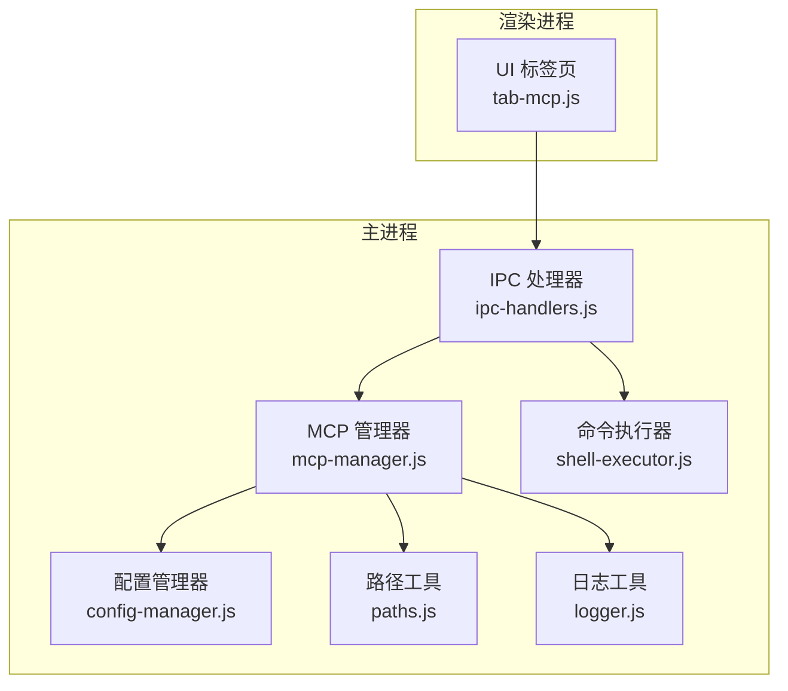
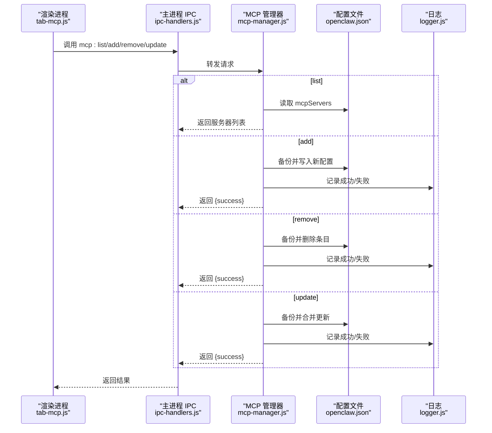
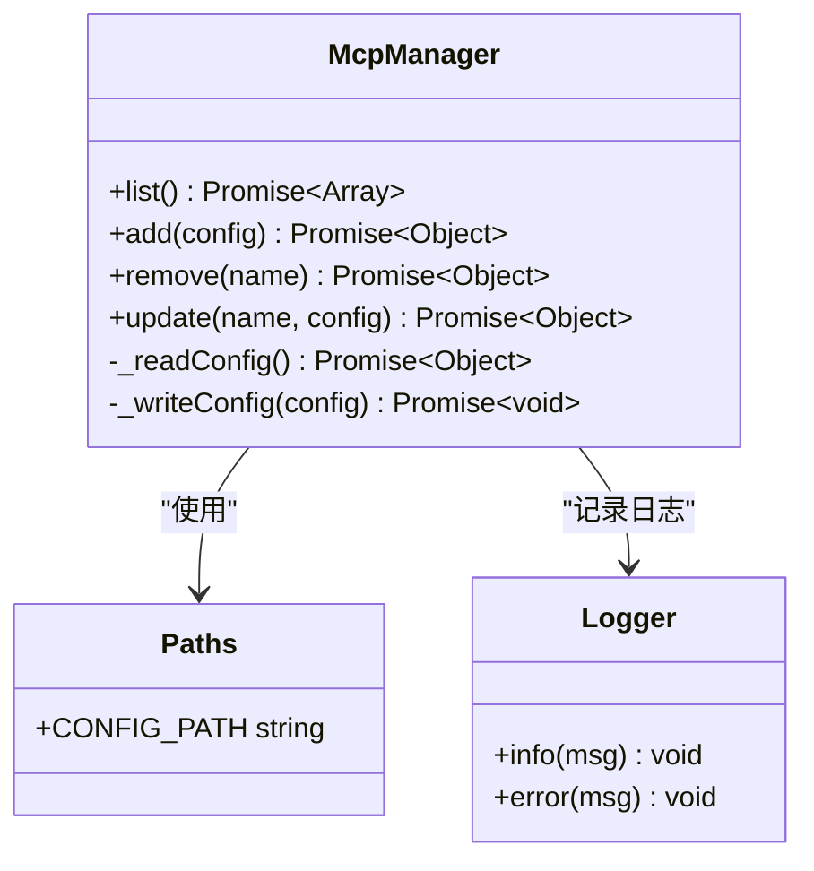
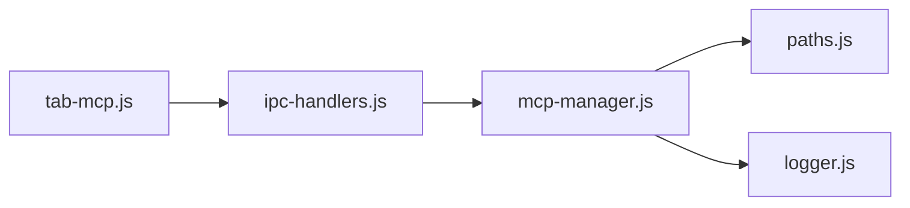
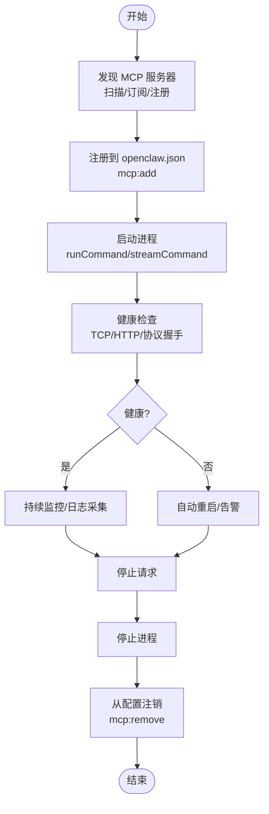

# MCP 服务器管理 API

<cite>
**本文引用的文件**
- [mcp-manager.js](file://src/main/services/mcp-manager.js)
- [ipc-handlers.js](file://src/main/ipc-handlers.js)
- [tab-mcp.js](file://src/renderer/js/dashboard/tab-mcp.js)
- [paths.js](file://src/main/utils/paths.js)
- [config-manager.js](file://src/main/services/config-manager.js)
- [logger.js](file://src/main/utils/logger.js)
- [shell-executor.js](file://src/main/utils/shell-executor.js)
- [package.json](file://package.json)
- [README.md](file://README.md)
- [mcp-call.sh](file://resources/skills/xiaohongshu/scripts/mcp-call.sh)
</cite>

## 目录
1. [简介](#简介)
2. [项目结构](#项目结构)
3. [核心组件](#核心组件)
4. [架构总览](#架构总览)
5. [详细组件分析](#详细组件分析)
6. [依赖关系分析](#依赖关系分析)
7. [性能考量](#性能考量)
8. [故障排查指南](#故障排查指南)
9. [结论](#结论)
10. [附录](#附录)

## 简介
本文件面向 MCP（Model Context Protocol）服务器管理 API 的使用者与维护者，系统性梳理该应用中 MCP 服务器的注册、配置、列表查询与变更能力，并结合现有实现说明其与 Electron 主进程、渲染进程、配置文件系统以及命令执行模块之间的协作关系。文档同时给出基于现有代码的“启动/停止/健康检查/发现/注销”流程图示与最佳实践建议，帮助在多服务器环境下进行部署与运维。

## 项目结构
围绕 MCP 服务器管理的相关文件主要分布在以下位置：
- 主进程服务层：MCP 管理器负责读写配置文件，提供列表、新增、删除、更新等接口
- IPC 层：将渲染进程的调用转发至主进程服务层
- 渲染进程 UI：提供 MCP 服务器的增删改查界面
- 配置与路径：统一管理 openclaw.json 的路径与备份策略
- 日志与命令执行：用于记录操作日志与执行外部命令（如启动 MCP 服务器）

图表来源
- [ipc-handlers.js:525-541](file://src/main/ipc-handlers.js#L525-L541)
- [mcp-manager.js:1-101](file://src/main/services/mcp-manager.js#L1-L101)
- [paths.js:1-124](file://src/main/utils/paths.js#L1-L124)
- [config-manager.js:212-260](file://src/main/services/config-manager.js#L212-L260)
- [logger.js:1-75](file://src/main/utils/logger.js#L1-L75)
- [shell-executor.js:62-471](file://src/main/utils/shell-executor.js#L62-L471)

章节来源
- [README.md:36-90](file://README.md#L36-L90)
- [package.json:1-75](file://package.json#L1-L75)

## 核心组件
- MCP 管理器（McpManager）
  - 负责读取与写入 openclaw.json 中的 mcpServers 字段
  - 提供 list/add/remove/update 四项核心能力
  - 写入时自动备份旧配置，保证可恢复性
- IPC 处理器（ipc-handlers.js）
  - 注册 mcp:list、mcp:add、mcp:remove、mcp:update 等 IPC 接口
  - 将渲染进程调用委托给 McpManager
- 渲染进程标签页（tab-mcp.js）
  - 提供 MCP 服务器的列表展示与增删改 UI
  - 通过 window.openclawAPI.mcp.* 调用 IPC 接口
- 路径与配置（paths.js、config-manager.js）
  - 统一 openclaw.json 路径与备份策略
  - 提供通用配置读写能力（用于对比理解）
- 日志与命令执行（logger.js、shell-executor.js）
  - 记录 MCP 操作日志
  - 提供命令执行与输出解析能力（用于启动/停止外部 MCP 服务器）

章节来源
- [mcp-manager.js:27-98](file://src/main/services/mcp-manager.js#L27-L98)
- [ipc-handlers.js:525-541](file://src/main/ipc-handlers.js#L525-L541)
- [tab-mcp.js:1-199](file://src/renderer/js/dashboard/tab-mcp.js#L1-L199)
- [paths.js:7-122](file://src/main/utils/paths.js#L7-L122)
- [config-manager.js:212-260](file://src/main/services/config-manager.js#L212-L260)
- [logger.js:45-71](file://src/main/utils/logger.js#L45-L71)
- [shell-executor.js:136-296](file://src/main/utils/shell-executor.js#L136-L296)

## 架构总览
MCP 服务器管理 API 的调用链路如下：
- 渲染进程通过 window.openclawAPI.mcp.* 触发 IPC 请求
- 主进程 ipc-handlers.js 将请求路由到 McpManager
- McpManager 读写 openclaw.json 并返回结果
- 日志工具记录关键事件，便于审计与排障

图表来源
- [ipc-handlers.js:525-541](file://src/main/ipc-handlers.js#L525-L541)
- [mcp-manager.js:27-98](file://src/main/services/mcp-manager.js#L27-L98)
- [logger.js:45-71](file://src/main/utils/logger.js#L45-L71)

## 详细组件分析

### MCP 管理器（McpManager）
- 能力清单
  - list：读取 openclaw.json 的 mcpServers，返回名称、命令、参数、环境变量与启用状态
  - add：新增一条 MCP 服务器配置，默认启用
  - remove：按名称删除配置
  - update：按名称更新命令、参数、环境变量与启用状态
- 配置持久化
  - 写入前自动备份原配置（.bak）
  - 采用缩进格式化写入，提升可读性
- 错误处理
  - 异常捕获并返回 {success:false, message:...}
  - 关键操作通过日志记录

图表来源
- [mcp-manager.js:5-99](file://src/main/services/mcp-manager.js#L5-L99)
- [paths.js:7-9](file://src/main/utils/paths.js#L7-L9)
- [logger.js:57-71](file://src/main/utils/logger.js#L57-L71)

章节来源
- [mcp-manager.js:27-98](file://src/main/services/mcp-manager.js#L27-L98)
- [paths.js:7-9](file://src/main/utils/paths.js#L7-L9)
- [logger.js:45-71](file://src/main/utils/logger.js#L45-L71)

### IPC 处理器（mcp:*）
- 注册的 IPC 接口
  - mcp:list、mcp:add、mcp:remove、mcp:update
- 调用关系
  - 直接调用 McpManager 对应方法并将结果返回给渲染进程
- 作用
  - 作为渲染进程与主进程服务层之间的桥梁，确保安全与隔离

章节来源
- [ipc-handlers.js:525-541](file://src/main/ipc-handlers.js#L525-L541)

### 渲染进程标签页（tab-mcp.js）
- 功能
  - 展示 MCP 服务器列表，支持刷新
  - 新增/编辑/删除服务器配置
  - 参数与环境变量以文本形式输入，编辑时支持 JSON 校验
- 交互
  - 通过 window.openclawAPI.mcp.* 调用 IPC 接口
  - 成功/失败通过 Toast 提示

章节来源
- [tab-mcp.js:1-199](file://src/renderer/js/dashboard/tab-mcp.js#L1-L199)

### 配置与路径（paths.js、config-manager.js）
- 路径
  - CONFIG_PATH 指向 openclaw.json 的绝对路径
  - 提供 .bak 备份策略与读写保护
- 配置管理器
  - 提供通用配置读写与备份逻辑，可作为理解 MCP 配置写入策略的参考

章节来源
- [paths.js:7-9](file://src/main/utils/paths.js#L7-L9)
- [config-manager.js:212-260](file://src/main/services/config-manager.js#L212-L260)

### 日志与命令执行（logger.js、shell-executor.js）
- 日志
  - 统一格式化输出，包含时间戳与级别
- 命令执行
  - 提供 runCommand/streamCommand 等能力，支持超时、编码处理与 WSL 模式适配
  - 可用于启动/停止外部 MCP 服务器（当前仓库未直接集成，但具备扩展能力）

章节来源
- [logger.js:45-71](file://src/main/utils/logger.js#L45-L71)
- [shell-executor.js:136-296](file://src/main/utils/shell-executor.js#L136-L296)

## 依赖关系分析
- 组件耦合
  - tab-mcp.js 仅依赖 window.openclawAPI.mcp.*，耦合度低
  - ipc-handlers.js 仅在注册阶段依赖 McpManager，职责清晰
  - McpManager 依赖 paths.js 与 logger.js，保持配置与日志的独立性
- 外部依赖
  - Electron IPC 通道用于前后端通信
  - openclaw.json 作为配置中心，承载 MCP 服务器元数据

图表来源
- [tab-mcp.js:1-199](file://src/renderer/js/dashboard/tab-mcp.js#L1-L199)
- [ipc-handlers.js:525-541](file://src/main/ipc-handlers.js#L525-L541)
- [mcp-manager.js:1-101](file://src/main/services/mcp-manager.js#L1-L101)
- [paths.js:7-9](file://src/main/utils/paths.js#L7-L9)
- [logger.js:45-71](file://src/main/utils/logger.js#L45-L71)

## 性能考量
- 配置读写
  - 采用一次性 JSON 解析与序列化，I/O 次数较少，适合小规模配置管理
- 备份策略
  - 写入前复制 .bak，避免配置损坏导致的不可恢复
- 日志输出
  - 文本追加写入，性能开销可控；建议在高频操作场景下降低日志级别

[本节为通用指导，不直接分析具体文件]

## 故障排查指南
- 常见问题定位
  - IPC 调用失败：检查渲染进程是否正确调用 window.openclawAPI.mcp.*
  - 配置写入失败：确认 openclaw.json 是否被占用或权限不足
  - 备份未生成：检查 CONFIG_PATH 所在目录写权限
- 日志定位
  - 查看日志工具输出，关注 INFO/WARN/ERROR 级别信息
- 建议
  - 在执行 add/remove/update 前先调用 list 确认当前状态
  - 更新配置后重新加载界面以确保 UI 与配置一致

章节来源
- [logger.js:45-71](file://src/main/utils/logger.js#L45-L71)
- [mcp-manager.js:27-98](file://src/main/services/mcp-manager.js#L27-L98)

## 结论
当前实现提供了 MCP 服务器的最小可行配置管理能力：注册（新增）、查询（列表）、修改（更新）与注销（删除）。配置持久化采用 openclaw.json 并带 .bak 备份，日志记录贯穿关键操作，满足日常运维需求。对于“启动/停止/健康检查/发现/注销”的完整生命周期管理，可在现有 IPC 与命令执行模块基础上扩展，以实现对真实 MCP 服务器进程的托管与监控。

[本节为总结性内容，不直接分析具体文件]

## 附录

### API 定义（基于现有实现）
- mcp:list
  - 输入：无
  - 输出：服务器数组，包含 name、command、args、env、enabled
- mcp:add
  - 输入：{ name, command, args[], env{} }
  - 输出：{ success: boolean }
- mcp:remove
  - 输入：name
  - 输出：{ success: boolean }
- mcp:update
  - 输入：name, { command?, args?, env?, enabled? }
  - 输出：{ success: boolean }

章节来源
- [ipc-handlers.js:525-541](file://src/main/ipc-handlers.js#L525-L541)
- [mcp-manager.js:27-98](file://src/main/services/mcp-manager.js#L27-L98)

### 流程图：MCP 服务器生命周期（概念性）
以下流程图展示“发现/注册/启动/停止/健康检查/注销”的完整生命周期，用于指导扩展实现。该图为概念性示意，不直接映射到现有代码文件。

[本图为概念性流程，不附带图表来源]

### 安全与访问控制建议
- 认证与授权
  - 当前实现未包含 MCP 协议层面的认证/授权逻辑，建议在外部 MCP 服务器侧实现
- 配置访问
  - openclaw.json 由主进程读写，渲染进程仅通过 IPC 访问，符合安全隔离原则
- 环境变量注入
  - tab-mcp.js 支持 env JSON 输入，建议在生产环境限制敏感字段与长度

[本节为通用指导，不直接分析具体文件]

### 多服务器与高可用策略（建议）
- 负载均衡
  - 在外部 MCP 服务器集群中实现请求分发与会话亲和
- 故障转移
  - 健康检查失败时自动切换到备用节点
- 配置一致性
  - 通过集中式配置中心同步 mcpServers，避免各节点配置漂移

[本节为通用指导，不直接分析具体文件]

### MCP 协议版本兼容性与升级策略（现状与建议）
- 现状
  - 代码中未体现 MCP 协议版本字段，配置项聚焦于进程启动参数与环境变量
- 建议
  - 在 openclaw.json 的 mcpServers 条目中增加 protocolVersion 字段
  - 升级策略：平滑迁移（保留旧版本兼容）与强制升级（配合版本校验）

[本节为通用指导，不直接分析具体文件]

### 与外部 MCP 服务器的集成示例（脚本参考）
- 示例脚本展示了如何通过环境变量与 jq 工具调用 MCP 服务，可作为外部 MCP 服务器集成的参考

章节来源
- [mcp-call.sh:1-15](file://resources/skills/xiaohongshu/scripts/mcp-call.sh#L1-L15)