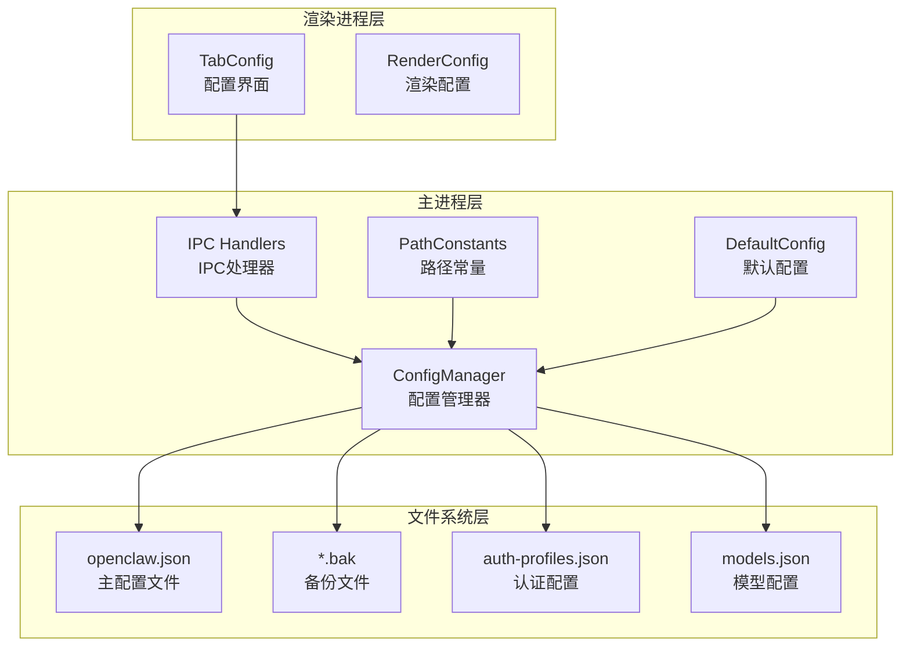
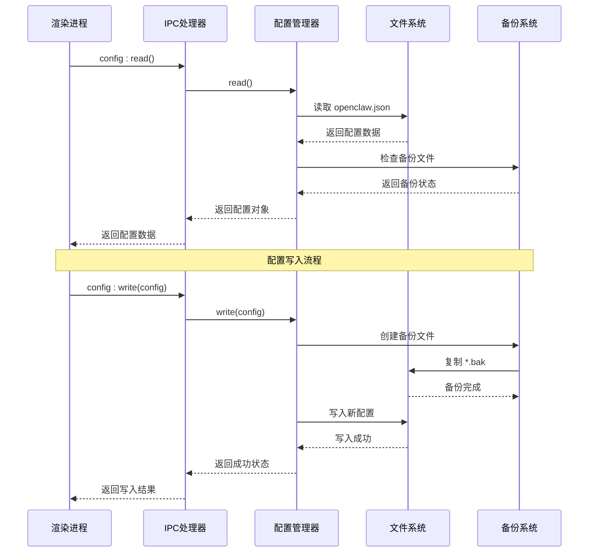
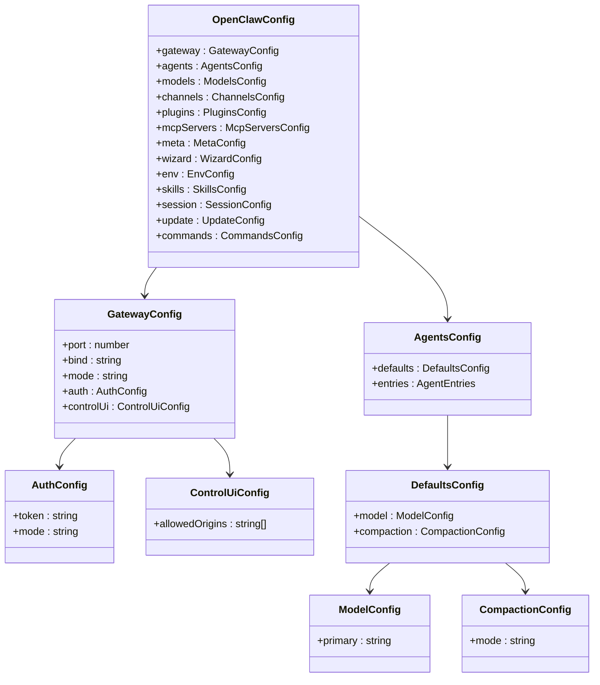
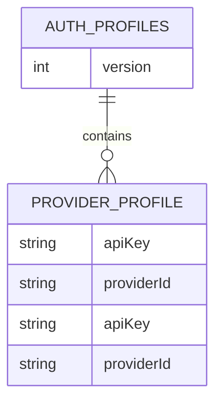
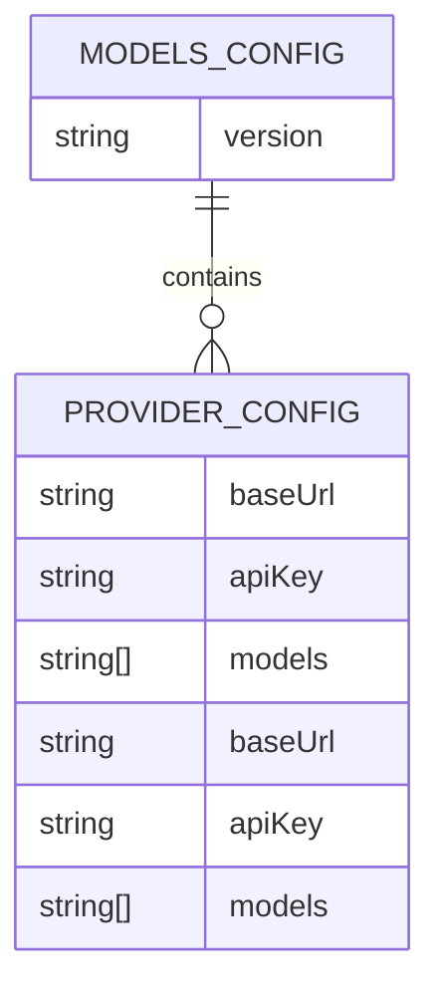
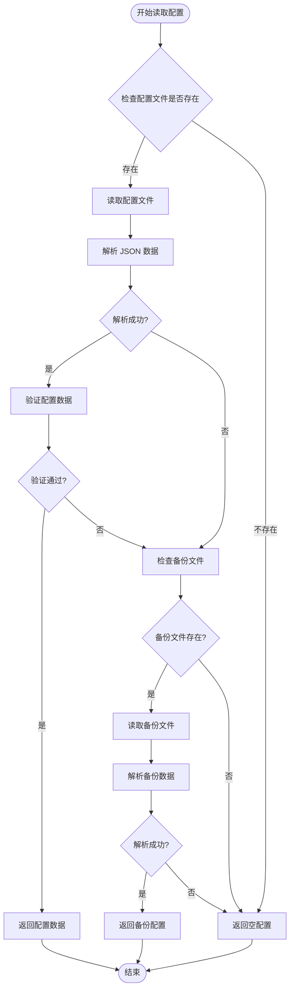
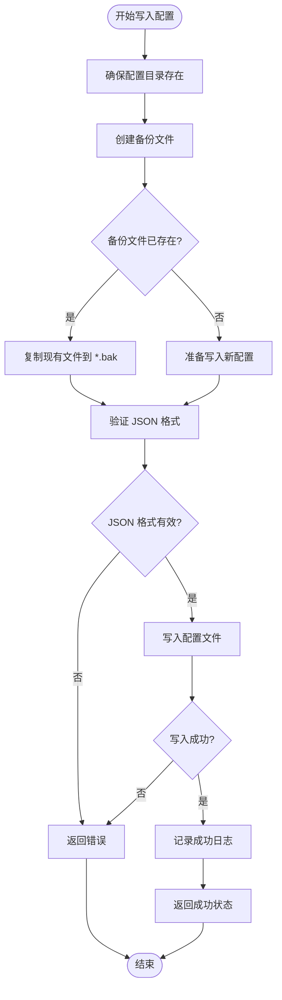
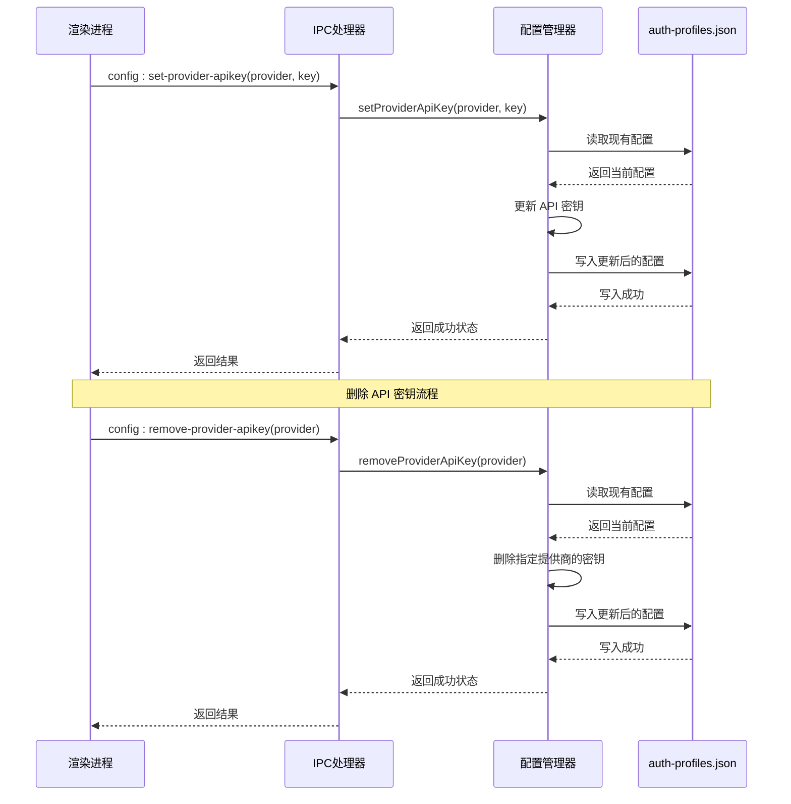
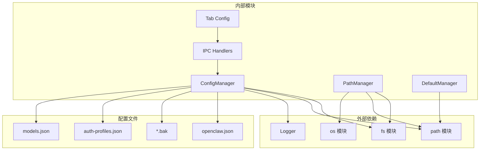

# OpenClaw 配置 API

<cite>
**本文档引用的文件**
- [config-manager.js](file://src/main/services/config-manager.js)
- [paths.js](file://src/main/utils/paths.js)
- [defaults.js](file://src/main/config/defaults.js)
- [ipc-handlers.js](file://src/main/ipc-handlers.js)
- [tab-config.js](file://src/renderer/js/dashboard/tab-config.js)
- [onboard-config-writer.js](file://src/main/services/onboard-config-writer.js)
</cite>

## 目录
1. [简介](#简介)
2. [项目结构](#项目结构)
3. [核心组件](#核心组件)
4. [架构概览](#架构概览)
5. [详细组件分析](#详细组件分析)
6. [依赖关系分析](#依赖关系分析)
7. [性能考虑](#性能考虑)
8. [故障排除指南](#故障排除指南)
9. [结论](#结论)

## 简介

OpenClaw 配置 API 是一个完整的配置文件管理系统，负责管理 OpenClaw 应用程序的核心配置文件 openclaw.json。该系统提供了配置文件的读取、写入、备份和恢复机制，支持多种配置场景和复杂的配置结构。

该配置管理系统采用分层架构设计，包含主进程配置管理器、路径管理器、默认配置定义和渲染进程配置界面。系统支持配置文件的自动备份、版本管理和错误恢复，确保配置数据的安全性和可靠性。

## 项目结构

OpenClaw 配置 API 的项目结构遵循模块化设计原则，主要分为以下几个层次：

**图表来源**
- [config-manager.js:1-264](file://src/main/services/config-manager.js#L1-L264)
- [paths.js:1-124](file://src/main/utils/paths.js#L1-L124)

**章节来源**
- [config-manager.js:1-264](file://src/main/services/config-manager.js#L1-L264)
- [paths.js:1-124](file://src/main/utils/paths.js#L1-L124)
- [defaults.js:1-180](file://src/main/config/defaults.js#L1-L180)

## 核心组件

### ConfigManager 配置管理器

ConfigManager 是配置系统的核心组件，负责所有配置文件的读取、写入和管理操作。它提供了完整的配置生命周期管理，包括文件读取、数据验证、备份创建和错误处理。

主要功能特性：
- **配置文件读取**：支持 openclaw.json、auth-profiles.json 和 models.json 的读取
- **配置文件写入**：提供安全的写入机制，包含自动备份和数据验证
- **配置文件备份**：每次写入前自动创建备份文件，支持错误恢复
- **API 密钥管理**：专门的 API 密钥存储和管理功能
- **模型配置管理**：支持多提供商的模型配置管理

### 路径管理器

路径管理器负责确定配置文件的存储位置和相关文件的路径。它支持多种执行模式，包括本地 Windows 模式和 WSL 模式。

关键特性：
- **环境变量支持**：支持 OPENCLAW_HOME 和 OPENCLAW_CONFIG_PATH 环境变量
- **模式检测**：自动检测执行模式（本地或 WSL）
- **路径解析**：提供统一的路径解析和转换功能

### 默认配置系统

默认配置系统提供了应用程序的默认参数和配置模板。这些默认值可以被用户配置覆盖，确保应用程序在首次运行时具有合理的配置。

**章节来源**
- [config-manager.js:6-264](file://src/main/services/config-manager.js#L6-L264)
- [paths.js:7-122](file://src/main/utils/paths.js#L7-L122)
- [defaults.js:8-180](file://src/main/config/defaults.js#L8-L180)

## 架构概览

OpenClaw 配置 API 采用分层架构设计，实现了清晰的职责分离和模块化组织：

**图表来源**
- [ipc-handlers.js:208-218](file://src/main/ipc-handlers.js#L208-L218)
- [config-manager.js:212-260](file://src/main/services/config-manager.js#L212-L260)

该架构实现了以下关键特性：
- **异步处理**：所有文件操作都是异步的，避免阻塞主线程
- **错误隔离**：每个组件都有独立的错误处理机制
- **数据验证**：写入操作包含 JSON 数据验证
- **自动备份**：每次写入都自动创建备份文件

**章节来源**
- [ipc-handlers.js:208-264](file://src/main/ipc-handlers.js#L208-L264)
- [config-manager.js:212-264](file://src/main/services/config-manager.js#L212-L264)

## 详细组件分析

### 配置文件结构分析

OpenClaw 配置文件采用 JSON 格式，支持复杂的嵌套结构。主要配置文件包括：

#### 主配置文件 (openclaw.json)

主配置文件包含应用程序的核心配置信息，支持以下顶级配置段：

**图表来源**
- [tab-config.js:153-219](file://src/renderer/js/dashboard/tab-config.js#L153-L219)
- [tab-config.js:188-219](file://src/renderer/js/dashboard/tab-config.js#L188-L219)

#### 认证配置文件 (auth-profiles.json)

认证配置文件专门用于存储 API 密钥和认证信息：

**图表来源**
- [config-manager.js:25-75](file://src/main/services/config-manager.js#L25-L75)

#### 模型配置文件 (models.json)

模型配置文件管理各个 AI 提供商的模型设置：

**图表来源**
- [config-manager.js:136-185](file://src/main/services/config-manager.js#L136-L185)

### 配置读取流程

配置读取流程确保了数据的完整性和系统的稳定性：

**图表来源**
- [config-manager.js:212-233](file://src/main/services/config-manager.js#L212-L233)

### 配置写入流程

配置写入流程包含了完整的数据验证和备份机制：

**图表来源**
- [config-manager.js:235-260](file://src/main/services/config-manager.js#L235-L260)

**章节来源**
- [config-manager.js:212-260](file://src/main/services/config-manager.js#L212-L260)
- [tab-config.js:412-461](file://src/renderer/js/dashboard/tab-config.js#L412-L461)

### API 密钥管理

API 密钥管理是配置系统的重要组成部分，提供了安全的密钥存储和管理功能：

**图表来源**
- [config-manager.js:84-120](file://src/main/services/config-manager.js#L84-L120)

**章节来源**
- [config-manager.js:84-120](file://src/main/services/config-manager.js#L84-L120)

### 配置验证和错误处理

配置系统实现了多层次的数据验证和错误处理机制：

#### 数据验证规则

1. **JSON 格式验证**：所有写入操作都会验证 JSON 格式的有效性
2. **字段完整性检查**：确保必需字段的存在和正确性
3. **数据类型验证**：验证配置值的数据类型是否正确
4. **范围和约束检查**：检查数值范围和字符串长度限制

#### 错误处理策略

1. **文件系统错误**：捕获文件读写异常并提供有意义的错误信息
2. **JSON 解析错误**：处理损坏的配置文件并尝试从备份恢复
3. **权限错误**：处理文件权限问题并提供解决方案
4. **磁盘空间不足**：检测磁盘空间并给出相应提示

**章节来源**
- [config-manager.js:249-251](file://src/main/services/config-manager.js#L249-L251)
- [config-manager.js:33-36](file://src/main/services/config-manager.js#L33-L36)

## 依赖关系分析

OpenClaw 配置 API 的依赖关系体现了清晰的模块化设计：

**图表来源**
- [config-manager.js:1-5](file://src/main/services/config-manager.js#L1-L5)
- [paths.js:1-4](file://src/main/utils/paths.js#L1-L4)

### 关键依赖关系

1. **ConfigManager 依赖**：
   - 文件系统模块：用于文件读写操作
   - 路径模块：用于路径解析和构建
   - 日志模块：用于错误记录和调试信息

2. **路径管理依赖**：
   - 操作系统模块：获取用户主目录和平台信息
   - 文件系统模块：检查目录存在性和创建目录

3. **IPC 处理器依赖**：
   - 配置管理器：实际的配置操作
   - 渲染进程：用户界面交互

**章节来源**
- [config-manager.js:1-5](file://src/main/services/config-manager.js#L1-L5)
- [paths.js:1-4](file://src/main/utils/paths.js#L1-L4)
- [ipc-handlers.js:10-25](file://src/main/ipc-handlers.js#L10-L25)

## 性能考虑

OpenClaw 配置 API 在设计时充分考虑了性能优化：

### 文件操作优化

1. **异步文件操作**：所有文件读写操作都是异步的，避免阻塞主线程
2. **批量操作**：支持批量配置更新，减少文件系统调用次数
3. **缓存机制**：对频繁访问的配置数据进行内存缓存

### 内存管理

1. **流式处理**：对于大型配置文件，采用流式处理避免内存溢出
2. **垃圾回收**：及时释放不再使用的配置对象
3. **内存监控**：监控内存使用情况，防止内存泄漏

### 并发处理

1. **锁机制**：在多线程环境下提供文件锁定机制
2. **队列管理**：配置操作排队处理，避免竞态条件
3. **超时控制**：设置合理的操作超时时间

## 故障排除指南

### 常见问题和解决方案

#### 配置文件损坏

**问题症状**：
- 应用程序启动时出现配置错误
- 配置界面无法正常加载
- 配置更改无法保存

**解决步骤**：
1. 检查备份文件是否存在
2. 手动恢复备份配置
3. 重新生成配置文件

#### 权限问题

**问题症状**：
- 配置文件无法写入
- 权限被拒绝错误
- 配置更改无效

**解决步骤**：
1. 检查配置文件权限
2. 修改文件所有权
3. 以管理员权限运行应用程序

#### 路径问题

**问题症状**：
- 配置文件找不到
- 路径解析错误
- 相对路径问题

**解决步骤**：
1. 检查 OPENCLAW_HOME 环境变量
2. 验证配置文件路径
3. 使用绝对路径

**章节来源**
- [config-manager.js:221-232](file://src/main/services/config-manager.js#L221-L232)
- [paths.js:26-55](file://src/main/utils/paths.js#L26-L55)

### 调试和诊断

#### 日志记录

配置系统提供了详细的日志记录功能：

1. **操作日志**：记录所有配置操作的时间和结果
2. **错误日志**：记录配置过程中的所有错误
3. **调试日志**：提供详细的调试信息

#### 诊断工具

1. **配置验证器**：检查配置文件的完整性和有效性
2. **路径检查器**：验证配置文件路径的正确性
3. **权限检查器**：检查文件权限设置

## 结论

OpenClaw 配置 API 提供了一个完整、可靠且高效的配置管理系统。该系统通过分层架构设计、完善的错误处理机制和安全的备份策略，确保了配置数据的安全性和应用程序的稳定性。

主要优势包括：

1. **模块化设计**：清晰的职责分离和模块化组织
2. **安全性保障**：自动备份、数据验证和权限控制
3. **用户友好**：提供可视化配置界面和丰富的配置选项
4. **可扩展性**：支持新的配置类型和自定义配置项
5. **可靠性**：完善的错误处理和故障恢复机制

该配置系统为 OpenClaw 应用程序提供了坚实的基础，支持复杂的配置需求和多样的使用场景。通过持续的优化和改进，该系统将继续为用户提供更好的配置管理体验。