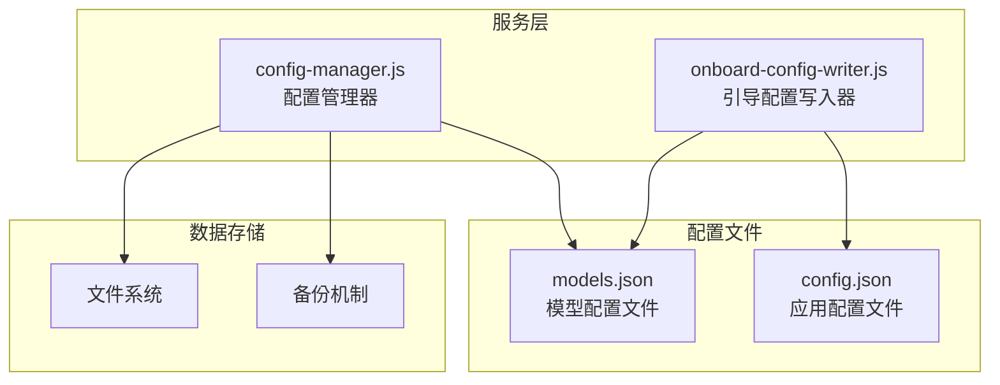
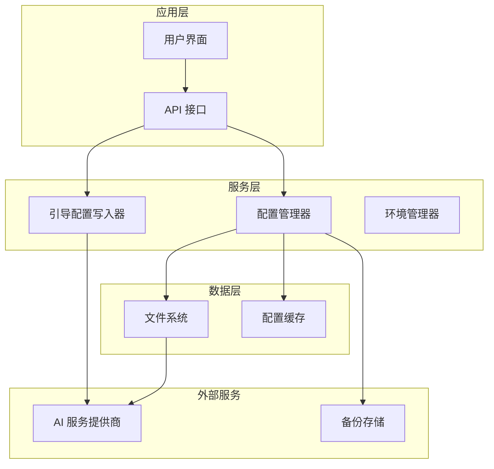
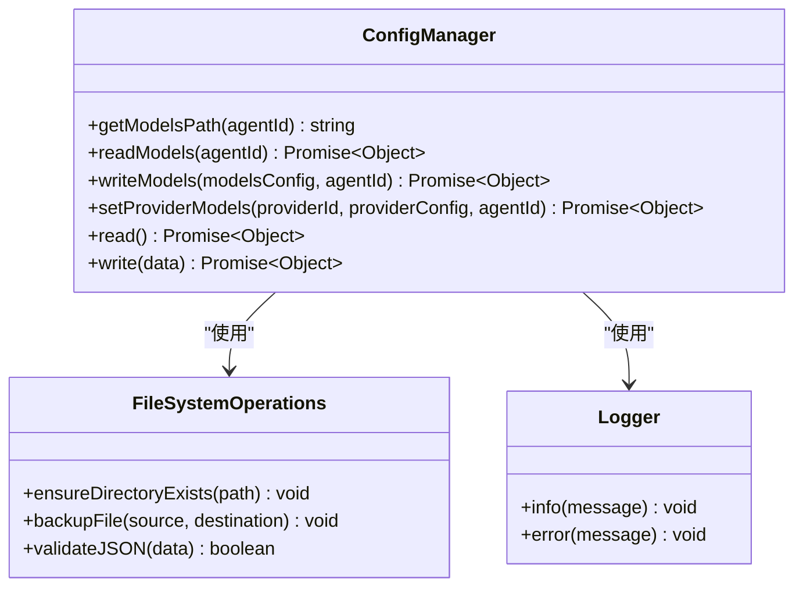
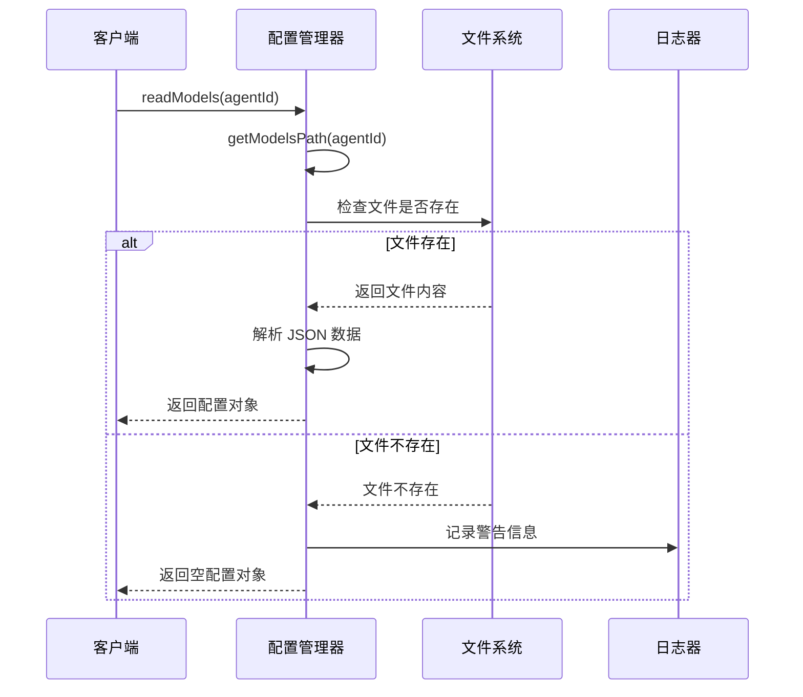
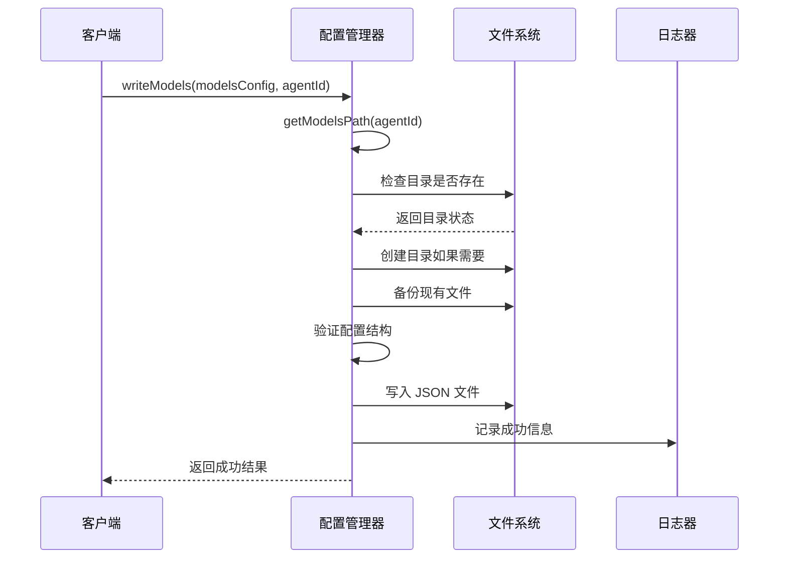
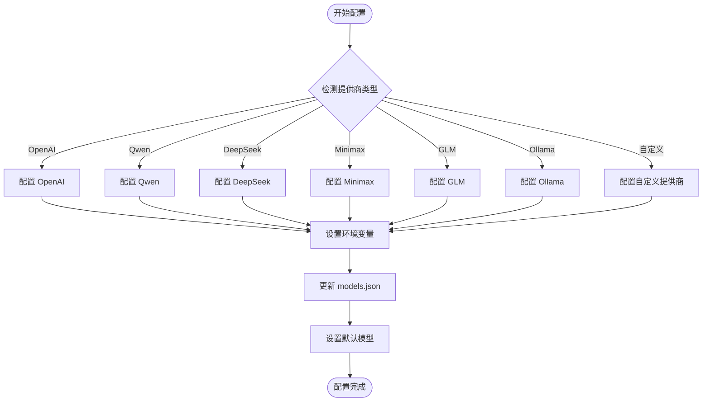
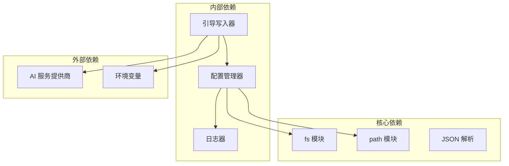

# 模型配置 API

<cite>
**本文档引用的文件**
- [config-manager.js](file://src/main/services/config-manager.js)
- [onboard-config-writer.js](file://src/main/services/onboard-config-writer.js)
</cite>

## 目录
1. [简介](#简介)
2. [项目结构](#项目结构)
3. [核心组件](#核心组件)
4. [架构概览](#架构概览)
5. [详细组件分析](#详细组件分析)
6. [依赖关系分析](#依赖关系分析)
7. [性能考虑](#性能考虑)
8. [故障排除指南](#故障排除指南)
9. [结论](#结论)

## 简介

模型配置 API 是一个用于管理 AI 模型配置的核心系统，负责读取、写入和管理 models.json 文件。该系统支持多种 AI 服务提供商（如 OpenAI、Qwen、DeepSeek、Minimax、GLM、Ollama 等），提供统一的配置接口来管理提供商的基础 URL、API 密钥和可用模型列表。

该 API 提供了完整的配置生命周期管理，包括配置验证、默认值设置、错误处理和备份机制。系统采用模块化设计，支持动态添加新的 AI 服务提供商，并提供了灵活的配置继承和覆盖机制。

## 项目结构

模型配置 API 主要位于项目的 `src/main/services` 目录下，包含以下关键文件：

**图表来源**
- [config-manager.js:117-185](file://src/main/services/config-manager.js#L117-L185)
- [onboard-config-writer.js:105-251](file://src/main/services/onboard-config-writer.js#L105-L251)

**章节来源**
- [config-manager.js:117-185](file://src/main/services/config-manager.js#L117-L185)
- [onboard-config-writer.js:105-251](file://src/main/services/onboard-config-writer.js#L105-L251)

## 核心组件

### 配置管理器 (ConfigManager)

配置管理器是模型配置 API 的核心组件，负责管理所有与配置相关的操作。它提供了以下主要功能：

- **读取配置**: 从 models.json 文件中读取模型配置
- **写入配置**: 将配置数据写入 models.json 文件
- **更新提供商**: 添加或更新特定提供商的配置
- **备份机制**: 自动备份现有配置文件
- **错误处理**: 统一的错误处理和日志记录

### 引导配置写入器 (OnboardConfigWriter)

引导配置写入器专门负责处理新用户首次配置 AI 服务提供商的过程。它支持多种主流 AI 服务提供商：

- **OpenAI**: 支持 GPT 系列模型
- **Qwen**: 支持通义千问系列模型
- **DeepSeek**: 支持 DeepSeek 系列模型
- **Minimax**: 支持 MiniMax 系列模型
- **GLM**: 通过 Z.AI 平台支持 GLM 系列模型
- **Ollama**: 支持本地运行的 Ollama 服务

**章节来源**
- [config-manager.js:136-185](file://src/main/services/config-manager.js#L136-L185)
- [onboard-config-writer.js:105-251](file://src/main/services/onboard-config-writer.js#L105-L251)

## 架构概览

模型配置 API 采用分层架构设计，确保了良好的可维护性和扩展性：

**图表来源**
- [config-manager.js:117-263](file://src/main/services/config-manager.js#L117-L263)
- [onboard-config-writer.js:105-251](file://src/main/services/onboard-config-writer.js#L105-L251)

## 详细组件分析

### 配置管理器类分析

配置管理器实现了完整的配置生命周期管理：

**图表来源**
- [config-manager.js:117-263](file://src/main/services/config-manager.js#L117-L263)

#### 配置读取流程

**图表来源**
- [config-manager.js:136-148](file://src/main/services/config-manager.js#L136-L148)

#### 配置写入流程

**图表来源**
- [config-manager.js:156-185](file://src/main/services/config-manager.js#L156-L185)

**章节来源**
- [config-manager.js:117-263](file://src/main/services/config-manager.js#L117-L263)

### 引导配置写入器分析

引导配置写入器提供了针对不同 AI 服务提供商的专用配置逻辑：

**图表来源**
- [onboard-config-writer.js:105-251](file://src/main/services/onboard-config-writer.js#L105-L251)

#### OpenAI 配置示例

OpenAI 配置包含了完整的模型列表和成本信息：

| 模型名称 | 模型 ID | 输入类型 | 上下文窗口 | 最大令牌数 | 成本 (输入/输出) |
|---------|---------|----------|------------|------------|------------------|
| GPT-4o | gpt-4o | 文本/图像 | 128,000 | 8,192 | 0/0 |
| GPT-4o Mini | gpt-4o-mini | 文本/图像 | 128,000 | 16,384 | 0/0 |

#### Qwen 配置示例

Qwen 提供了多种专用模型：

| 模型名称 | 模型 ID | 输入类型 | 上下文窗口 | 最大令牌数 | 成本 (输入/输出) |
|---------|---------|----------|------------|------------|------------------|
| Qwen Portal Coder | qwen-portal/coder-model | 文本 | 128,000 | 8,192 | 0/0 |
| Qwen Portal Vision | qwen-portal/vision-model | 文本/图像 | 128,000 | 8,192 | 0/0 |

**章节来源**
- [onboard-config-writer.js:105-251](file://src/main/services/onboard-config-writer.js#L105-L251)

## 依赖关系分析

模型配置 API 的依赖关系相对简单且清晰：

**图表来源**
- [config-manager.js:117-263](file://src/main/services/config-manager.js#L117-L263)
- [onboard-config-writer.js:105-251](file://src/main/services/onboard-config-writer.js#L105-L251)

**章节来源**
- [config-manager.js:117-263](file://src/main/services/config-manager.js#L117-L263)
- [onboard-config-writer.js:105-251](file://src/main/services/onboard-config-writer.js#L105-L251)

## 性能考虑

### 文件系统操作优化

配置管理器采用了多项性能优化措施：

- **异步操作**: 所有文件系统操作都是异步的，避免阻塞主线程
- **目录预创建**: 在写入前检查并创建必要的目录结构
- **增量备份**: 只在必要时进行文件备份，减少不必要的磁盘 I/O

### 内存使用优化

- **流式处理**: 对于大型配置文件，采用流式处理方式
- **对象复用**: 避免创建不必要的中间对象
- **及时释放**: 确保文件句柄和内存资源及时释放

### 缓存策略

虽然当前实现没有显式的缓存机制，但可以通过以下方式优化：

- **配置缓存**: 缓存最近使用的配置文件
- **元数据缓存**: 缓存文件系统的元数据信息
- **错误重试**: 实现智能的错误重试机制

## 故障排除指南

### 常见问题及解决方案

#### 配置文件读取失败

**症状**: 应用启动时报错，无法读取 models.json 文件

**可能原因**:
- 文件权限不足
- 文件路径错误
- JSON 格式不正确
- 文件被其他进程占用

**解决步骤**:
1. 检查文件路径是否正确
2. 验证文件权限设置
3. 使用在线 JSON 验证工具检查格式
4. 关闭可能占用文件的其他程序

#### 配置写入失败

**症状**: 修改配置后重启应用发现更改未生效

**可能原因**:
- 磁盘空间不足
- 目录权限问题
- 文件锁定
- JSON 验证失败

**解决步骤**:
1. 检查磁盘空间
2. 验证目标目录写权限
3. 确认文件未被锁定
4. 查看应用日志获取详细错误信息

#### 备份文件损坏

**症状**: 应用启动时提示备份文件损坏

**解决步骤**:
1. 检查备份文件完整性
2. 从版本控制系统恢复配置
3. 手动重建配置文件
4. 联系技术支持

**章节来源**
- [config-manager.js:136-185](file://src/main/services/config-manager.js#L136-L185)
- [config-manager.js:212-263](file://src/main/services/config-manager.js#L212-L263)

## 结论

模型配置 API 提供了一个完整、可靠且易于扩展的配置管理系统。其设计特点包括：

**可靠性**: 通过备份机制、错误处理和日志记录确保系统的稳定性

**可扩展性**: 支持动态添加新的 AI 服务提供商，具有良好的向后兼容性

**易用性**: 提供简洁的 API 接口，支持多种配置场景

**性能**: 采用异步操作和优化的文件系统访问模式

该系统为 AI 应用程序提供了强大的配置管理能力，支持多提供商、多模型的复杂配置需求。通过合理的架构设计和完善的错误处理机制，确保了系统的稳定性和可靠性。

未来可以考虑的功能增强包括：
- 配置模板系统
- 远程配置同步
- 配置版本控制
- 实时配置热更新
- 更丰富的验证规则