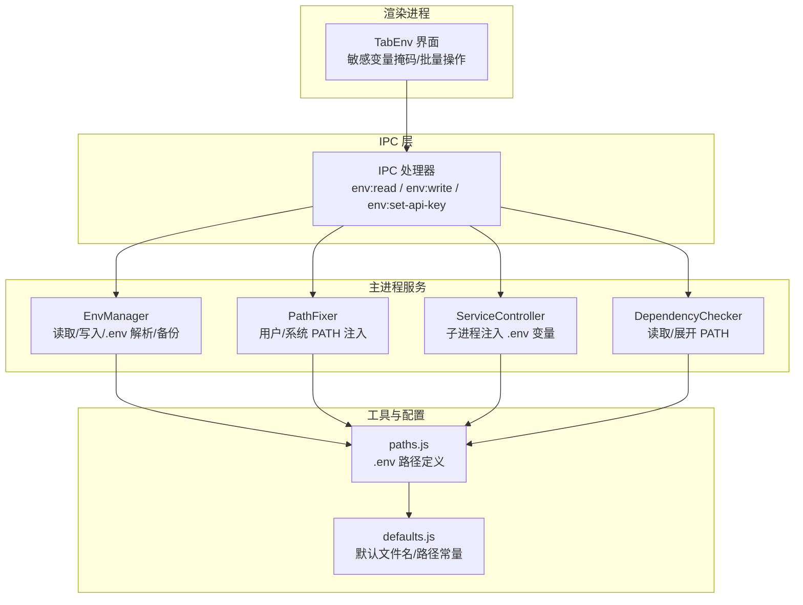
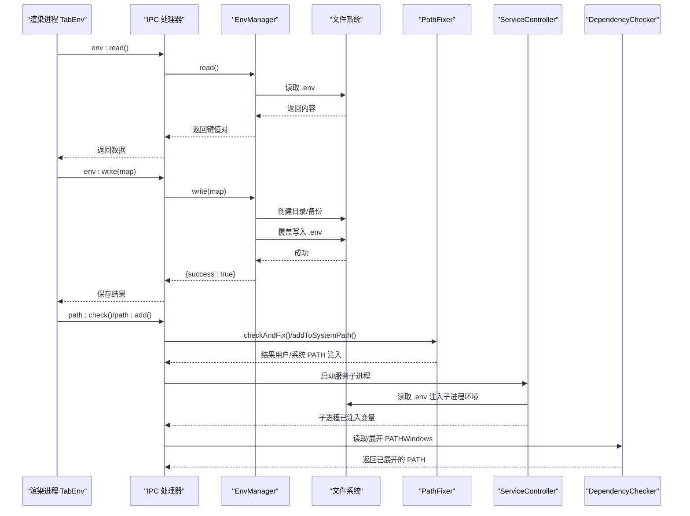
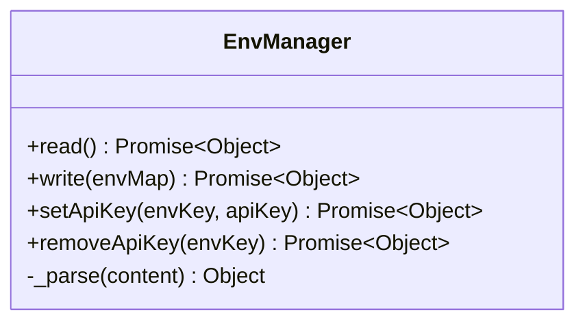
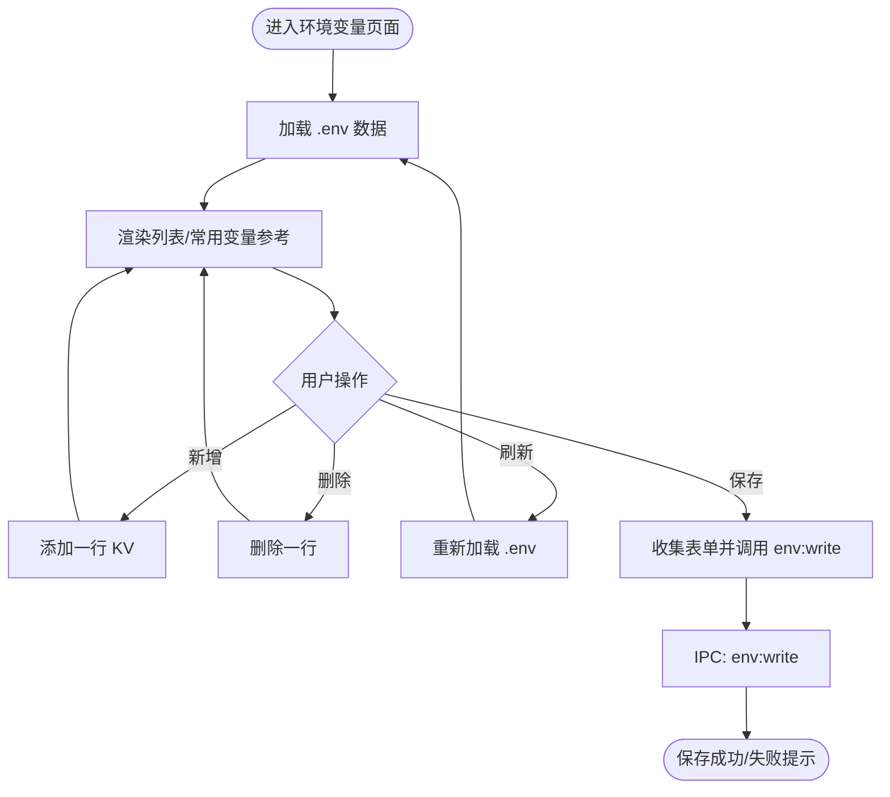
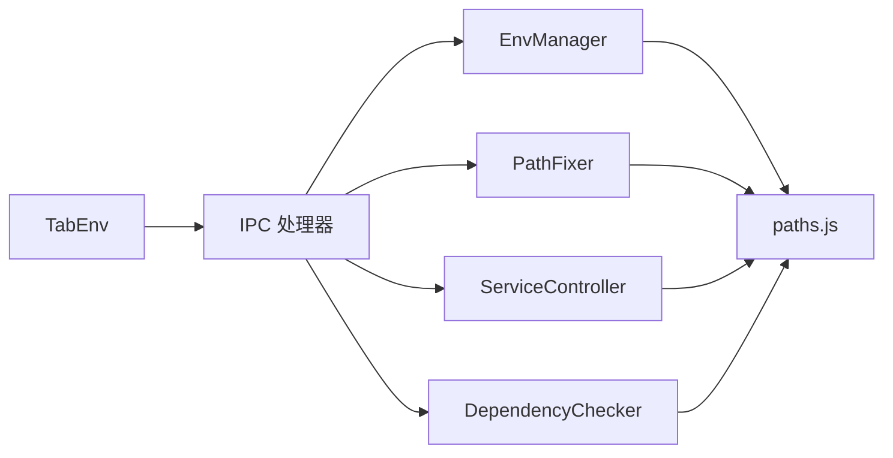

# 环境变量管理 API

<cite>
**本文档引用的文件**
- [env-manager.js](file://src/main/services/env-manager.js)
- [tab-env.js](file://src/renderer/js/dashboard/tab-env.js)
- [ipc-handlers.js](file://src/main/ipc-handlers.js)
- [paths.js](file://src/main/utils/paths.js)
- [path-fixer.js](file://src/main/services/path-fixer.js)
- [service-controller.js](file://src/main/services/service-controller.js)
- [dependency-checker.js](file://src/main/services/dependency-checker.js)
- [onboard-config-writer.js](file://src/main/services/onboard-config-writer.js)
- [defaults.js](file://src/main/config/defaults.js)
</cite>

## 目录
1. [简介](#简介)
2. [项目结构](#项目结构)
3. [核心组件](#核心组件)
4. [架构总览](#架构总览)
5. [详细组件分析](#详细组件分析)
6. [依赖关系分析](#依赖关系分析)
7. [性能考虑](#性能考虑)
8. [故障排除指南](#故障排除指南)
9. [结论](#结论)

## 简介
本文件系统性地记录了系统环境变量的读取、设置与持久化接口，涵盖以下关键能力：
- 环境变量的分类管理：系统级与用户级变量的区分与处理
- 敏感信息的安全存储与加密处理机制
- 环境变量的批量操作、条件设置与动态更新
- 环境变量的继承关系、作用域控制与优先级计算
- 不同操作系统下的兼容性与特殊处理

## 项目结构
围绕环境变量管理的关键文件与职责如下：
- 主进程服务层：负责 .env 文件的读写、解析与备份
- 渲染进程界面层：提供可视化编辑、敏感变量掩码与批量操作
- IPC 层：桥接主进程与渲染进程的 API 调用
- 路径工具层：定义 .env 文件位置与跨平台路径策略
- PATH 修复器：处理系统 PATH 的用户级与系统级注入
- 子进程构建器：在子进程中注入 .env 变量，实现占位符展开
- 依赖检查器：在 Windows 下通过注册表与 PowerShell 读取 PATH 并展开变量

**图表来源**
- [tab-env.js:1-250](file://src/renderer/js/dashboard/tab-env.js#L1-L250)
- [ipc-handlers.js:322-339](file://src/main/ipc-handlers.js#L322-L339)
- [env-manager.js:1-116](file://src/main/services/env-manager.js#L1-L116)
- [path-fixer.js:1-139](file://src/main/services/path-fixer.js#L1-L139)
- [service-controller.js:440-493](file://src/main/services/service-controller.js#L440-L493)
- [dependency-checker.js:1108-1133](file://src/main/services/dependency-checker.js#L1108-L1133)
- [paths.js:1-124](file://src/main/utils/paths.js#L1-L124)
- [defaults.js:94-124](file://src/main/config/defaults.js#L94-L124)

**章节来源**
- [env-manager.js:1-116](file://src/main/services/env-manager.js#L1-L116)
- [tab-env.js:1-250](file://src/renderer/js/dashboard/tab-env.js#L1-L250)
- [ipc-handlers.js:322-339](file://src/main/ipc-handlers.js#L322-L339)
- [paths.js:1-124](file://src/main/utils/paths.js#L1-L124)
- [defaults.js:94-124](file://src/main/config/defaults.js#L94-L124)

## 核心组件
- 环境变量管理器（EnvManager）
  - 提供 .env 文件的读取、写入、解析与备份
  - 支持按键设置/移除单个 API Key
- 环境变量界面（TabEnv）
  - 提供可视化 KV 表单、敏感变量掩码、批量增删改
  - 支持常用变量参考与刷新/保存操作
- IPC 处理器（ipc-handlers.js）
  - 暴露 env:read、env:write、env:set-api-key、env:remove-api-key 等 API
- 路径工具（paths.js）
  - 定义 .env 文件路径、WSL 路径映射与 Windows/WSL 模式切换
- PATH 修复器（path-fixer.js）
  - 用户级与系统级 PATH 注入，无需管理员权限的降级策略
- 子进程构建器（service-controller.js）
  - 在子进程环境中注入 .env 变量，支持 openclaw.json 中的 ${VAR} 占位符展开
- 依赖检查器（dependency-checker.js）
  - 通过注册表与 PowerShell 读取并展开 PATH，确保命令查找正确

**章节来源**
- [env-manager.js:6-116](file://src/main/services/env-manager.js#L6-L116)
- [tab-env.js:2-250](file://src/renderer/js/dashboard/tab-env.js#L2-L250)
- [ipc-handlers.js:322-339](file://src/main/ipc-handlers.js#L322-L339)
- [paths.js:1-124](file://src/main/utils/paths.js#L1-L124)
- [path-fixer.js:1-139](file://src/main/services/path-fixer.js#L1-L139)
- [service-controller.js:440-493](file://src/main/services/service-controller.js#L440-L493)
- [dependency-checker.js:1108-1133](file://src/main/services/dependency-checker.js#L1108-L1133)

## 架构总览
环境变量管理的端到端流程如下：
- 渲染进程通过 IPC 调用主进程的 EnvManager 读取/写入 .env
- 写入时进行目录创建、备份与覆盖写入
- PATH 修复器在用户级或系统级注入 npm 全局路径
- 子进程构建器在启动外部进程时注入 .env 变量，实现配置占位符展开
- 依赖检查器在 Windows 下读取并展开 PATH，保证命令可用性

**图表来源**
- [tab-env.js:62-72](file://src/renderer/js/dashboard/tab-env.js#L62-L72)
- [ipc-handlers.js:322-339](file://src/main/ipc-handlers.js#L322-L339)
- [env-manager.js:10-54](file://src/main/services/env-manager.js#L10-L54)
- [path-fixer.js:113-135](file://src/main/services/path-fixer.js#L113-L135)
- [service-controller.js:440-493](file://src/main/services/service-controller.js#L440-L493)
- [dependency-checker.js:1108-1133](file://src/main/services/dependency-checker.js#L1108-L1133)

## 详细组件分析

### 组件一：环境变量管理器（EnvManager）
- 职责
  - 读取 .env 文件并解析为键值对（明文）
  - 覆盖写入 .env 文件（整包写，保留注释行）
  - 单个 API Key 的设置与删除（合并写，不覆盖其他条目）
  - 解析 .env 内容：忽略空行与注释，去除首尾空白与引号
  - 写入前自动备份 .env.bak
- 数据结构与复杂度
  - 解析：按行扫描，时间复杂度 O(N)，空间复杂度 O(N)
  - 写入：遍历键值对，时间复杂度 O(N)，空间复杂度 O(N)
- 错误处理
  - 文件不存在返回空对象
  - 写入异常返回 {success: false, message}

**图表来源**
- [env-manager.js:6-116](file://src/main/services/env-manager.js#L6-L116)

**章节来源**
- [env-manager.js:10-112](file://src/main/services/env-manager.js#L10-L112)

### 组件二：环境变量界面（TabEnv）
- 职责
  - 渲染环境变量列表，支持新增、删除、刷新、保存
  - 敏感变量检测与掩码显示/隐藏
  - 常用变量参考表格
  - PATH 修复：检查并修复 openclaw 命令可用性
- 批量操作
  - 通过 UI 表单收集多行键值，保存时一次性写入
- 敏感信息处理
  - 基于变量名关键词自动识别敏感项，输入框默认密码模式
  - 支持切换显示/隐藏

**图表来源**
- [tab-env.js:10-248](file://src/renderer/js/dashboard/tab-env.js#L10-L248)

**章节来源**
- [tab-env.js:5-248](file://src/renderer/js/dashboard/tab-env.js#L5-L248)

### 组件三：IPC 处理器（env:* API）
- 暴露的 API
  - env:read → 读取 .env
  - env:write → 覆盖写入 .env
  - env:set-api-key → 单个 API Key 设置（合并写）
  - env:remove-api-key → 单个 API Key 删除
- 与主进程服务交互
  - 通过 EnvManager 实现具体逻辑
  - 返回统一的成功/失败结构

**章节来源**
- [ipc-handlers.js:322-339](file://src/main/ipc-handlers.js#L322-L339)

### 组件四：路径工具（paths.js）
- .env 文件路径
  - 默认位于用户主目录下的 .openclaw/.env
  - 支持 WSL 模式下的 Linux 路径映射
- npm 全局前缀优先级
  - 进程环境变量 > .env 中条目 > 默认值 ~/.npm-global
- 日志目录与文件命名
  - 日志目录：Windows 临时目录下 openclaw
  - 按日滚动：openclaw-YYYY-MM-DD.log

**章节来源**
- [paths.js:8-124](file://src/main/utils/paths.js#L8-L124)
- [defaults.js:94-124](file://src/main/config/defaults.js#L94-L124)

### 组件五：PATH 修复器（path-fixer.js）
- 用户级 PATH 注入
  - 无需管理员权限，直接写入用户环境变量
- 系统级 PATH 注入
  - 需要管理员权限；失败时回退到用户级注入
- 检查与修复
  - 获取 npm 全局目录，判断是否已在系统 PATH 中
  - 返回状态与建议

**章节来源**
- [path-fixer.js:19-135](file://src/main/services/path-fixer.js#L19-L135)

### 组件六：子进程构建器（service-controller.js）
- 注入 .env 变量到子进程环境
  - 读取 ~/.openclaw/.env 并注入到子进程环境
  - 使 openclaw.json 中的 ${VAR} 占位符能够被正确展开
- PATH 优先级
  - 将常见安装路径置于 PATH 前部，去重并保持顺序

**章节来源**
- [service-controller.js:440-493](file://src/main/services/service-controller.js#L440-L493)

### 组件七：依赖检查器（dependency-checker.js）
- Windows 下读取 PATH
  - 通过 reg.exe 读取注册表中的 Machine 与 User PATH
  - 使用 PowerShell 展开 %VAR% 引用，避免未展开路径导致命令不可用
- 执行命令时使用最新 PATH
  - 合并常见路径与当前 PATH，去重并设置到子进程环境

**章节来源**
- [dependency-checker.js:1108-1133](file://src/main/services/dependency-checker.js#L1108-L1133)

## 依赖关系分析
- 组件耦合
  - TabEnv 仅通过 IPC 与主进程交互，耦合度低
  - EnvManager 依赖文件系统与路径工具，职责单一
  - PathFixer 依赖 PowerShell 与系统注册表（Windows）
  - ServiceController 与 DependencyChecker 在子进程构建时共同影响 PATH 与变量注入
- 外部依赖
  - Windows 注册表与 PowerShell
  - 文件系统读写与备份
  - Electron IPC

**图表来源**
- [tab-env.js:62-72](file://src/renderer/js/dashboard/tab-env.js#L62-L72)
- [ipc-handlers.js:322-339](file://src/main/ipc-handlers.js#L322-L339)
- [env-manager.js:1-116](file://src/main/services/env-manager.js#L1-L116)
- [path-fixer.js:1-139](file://src/main/services/path-fixer.js#L1-L139)
- [service-controller.js:440-493](file://src/main/services/service-controller.js#L440-L493)
- [dependency-checker.js:1108-1133](file://src/main/services/dependency-checker.js#L1108-L1133)
- [paths.js:1-124](file://src/main/utils/paths.js#L1-L124)

**章节来源**
- [ipc-handlers.js:322-339](file://src/main/ipc-handlers.js#L322-L339)

## 性能考虑
- .env 文件解析与写入
  - 时间复杂度 O(N)，N 为行数；建议 .env 文件规模较小，性能影响有限
- 写入前备份
  - .env.bak 降低风险，但增加一次文件复制；建议在批量写入时合并为一次写入
- PATH 构建与去重
  - 合并与去重操作为线性复杂度；在 PATH 很长时注意内存占用
- 子进程变量注入
  - 仅在启动外部进程时发生，对 UI 响应影响小

[本节为通用性能讨论，不直接分析具体文件]

## 故障排除指南
- 无法读取 .env
  - 检查 .env 文件是否存在与权限
  - 查看日志输出，确认读取异常原因
- 写入失败
  - 确认目标目录存在或可创建
  - 检查磁盘空间与文件锁定
- PATH 修复失败
  - 系统级注入需管理员权限；若失败，系统会回退到用户级注入
  - 检查 PowerShell 可用性与输出编码
- 子进程无法识别 .env 变量
  - 确认 ServiceController 已注入 .env 变量
  - 检查 openclaw.json 中的 ${VAR} 占位符是否正确
- Windows 下命令不可用
  - 使用 DependencyChecker 的 PATH 读取与展开逻辑，确保 PATH 已包含命令所在目录

**章节来源**
- [env-manager.js:10-54](file://src/main/services/env-manager.js#L10-L54)
- [path-fixer.js:69-108](file://src/main/services/path-fixer.js#L69-L108)
- [service-controller.js:440-493](file://src/main/services/service-controller.js#L440-L493)
- [dependency-checker.js:1108-1133](file://src/main/services/dependency-checker.js#L1108-L1133)

## 结论
本系统提供了完整的环境变量管理能力：
- 明确的 .env 文件读写与备份机制
- 渲染层的可视化与敏感信息掩码
- 用户级与系统级 PATH 的智能注入策略
- 子进程环境变量注入与占位符展开
- Windows 下 PATH 的注册表与 PowerShell 读取与展开
- 通过 IPC 将 UI 与主进程解耦，便于扩展与维护

未来可考虑的方向：
- 增加敏感变量的加密存储选项
- 支持条件设置与动态更新的更细粒度控制
- 提供环境变量的版本化与变更审计