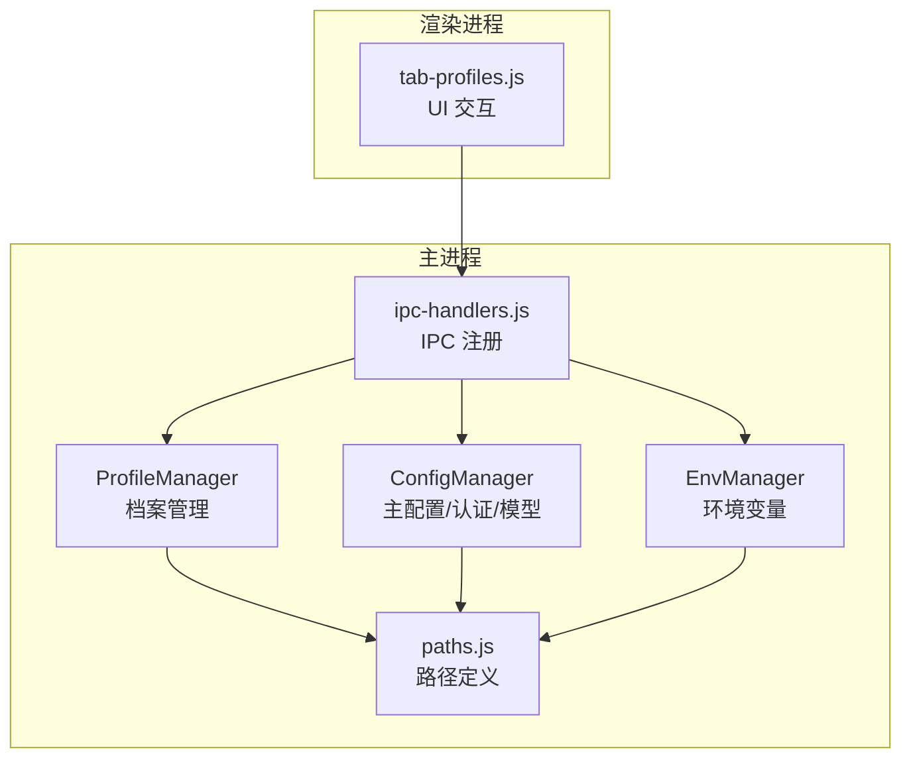
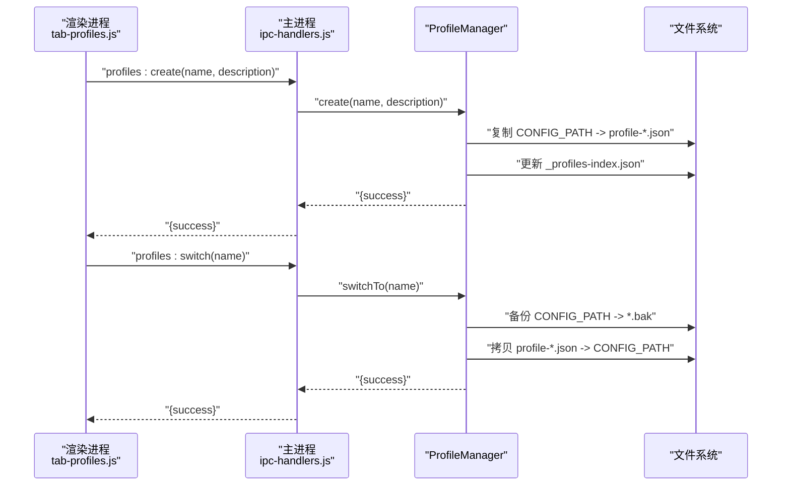
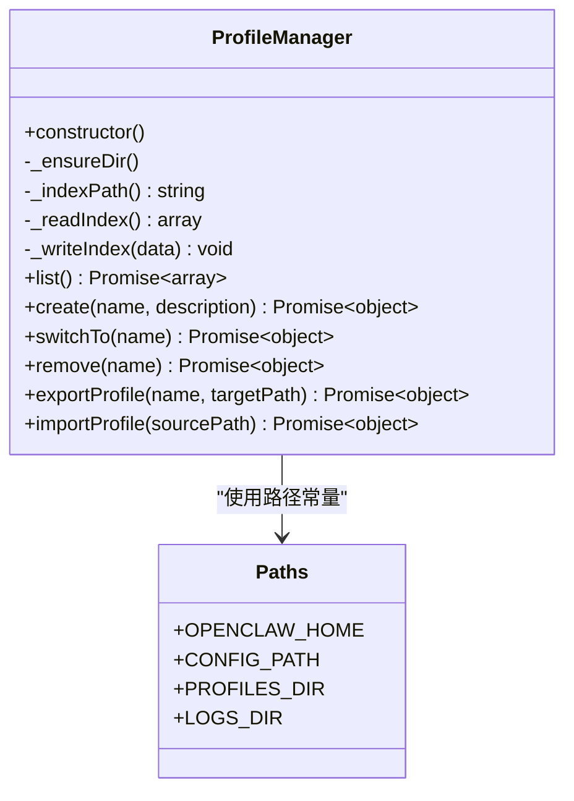
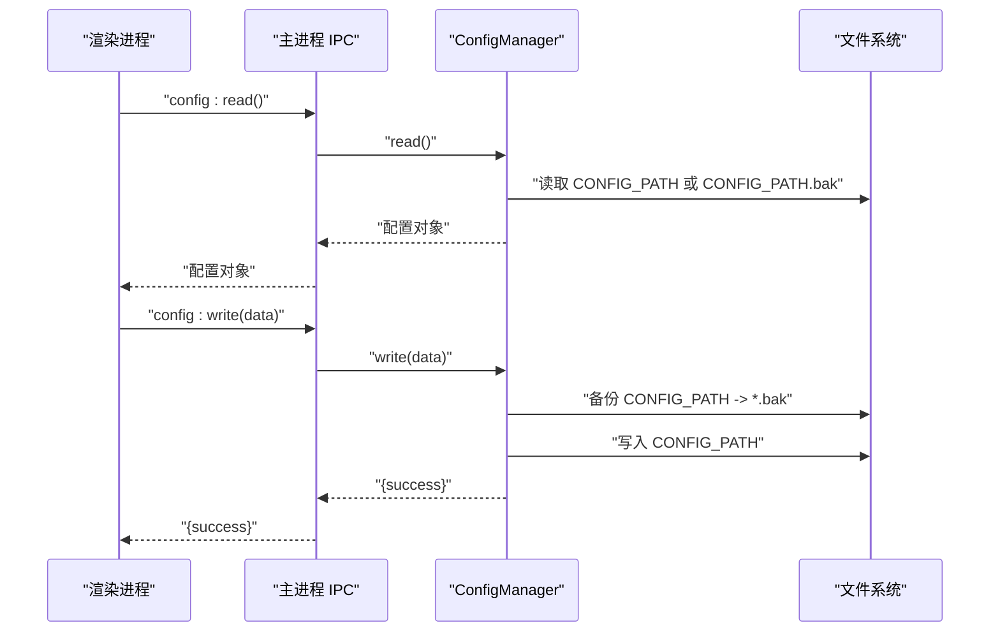
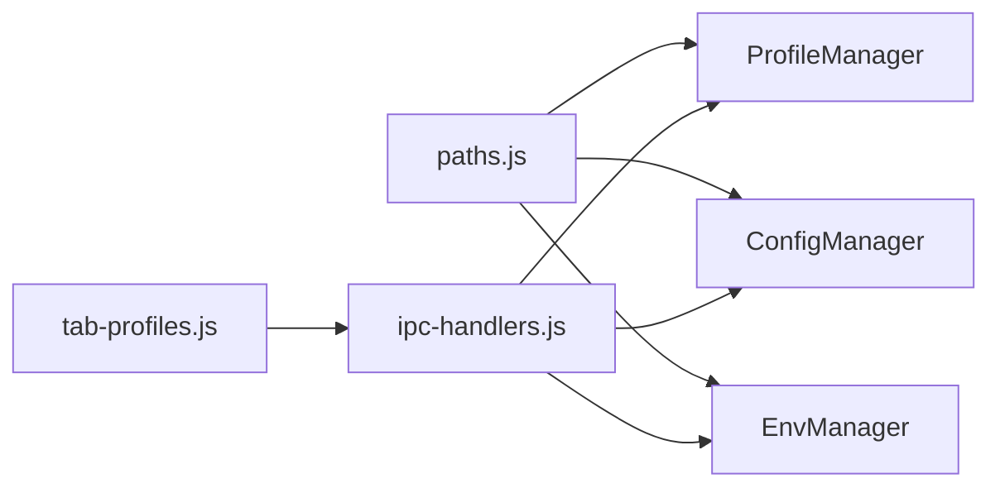

# 配置档案管理 API

<cite>
**本文档引用的文件**
- [src/main/services/profile-manager.js](file://src/main/services/profile-manager.js)
- [src/main/ipc-handlers.js](file://src/main/ipc-handlers.js)
- [src/main/utils/paths.js](file://src/main/utils/paths.js)
- [src/renderer/js/dashboard/tab-profiles.js](file://src/renderer/js/dashboard/tab-profiles.js)
- [src/main/services/config-manager.js](file://src/main/services/config-manager.js)
- [src/main/services/env-manager.js](file://src/main/services/env-manager.js)
- [src/main/services/openclaw-installer.js](file://src/main/services/openclaw-installer.js)
- [src/main/config/defaults.js](file://src/main/config/defaults.js)
- [src/renderer/js/dashboard/tab-config.js](file://src/renderer/js/dashboard/tab-config.js)
</cite>

## 目录
1. [简介](#简介)
2. [项目结构](#项目结构)
3. [核心组件](#核心组件)
4. [架构总览](#架构总览)
5. [详细组件分析](#详细组件分析)
6. [依赖关系分析](#依赖关系分析)
7. [性能考虑](#性能考虑)
8. [故障排除指南](#故障排除指南)
9. [结论](#结论)

## 简介
本文件系统性地文档化“配置档案管理 API”，涵盖配置档案的创建、切换、导入导出、删除与版本备份恢复能力；解释多配置环境的隔离机制与档案间切换策略；说明命名规范、描述信息与标签管理；并提供比较、合并与冲突解决的机制建议。同时阐述配置档案的作用域、继承关系以及环境特定配置的处理方式。

## 项目结构
配置档案管理涉及主进程服务、IPC 层、路径与存储定义、渲染进程 UI 交互等模块协同工作：
- 主进程服务层：ProfileManager 负责档案索引与文件管理；ConfigManager 负责主配置与认证/模型配置；EnvManager 负责环境变量管理。
- IPC 层：注册 profiles:* 与 config:* 等通道，桥接渲染进程与主进程服务。
- 路径与存储：统一定义 OPENCLAW_HOME、CONFIG_PATH、PROFILES_DIR 等关键路径。
- 渲染进程：tab-profiles.js 提供档案列表、创建、切换、导入导出、删除等 UI 交互。

图表来源
- [src/renderer/js/dashboard/tab-profiles.js:1-158](file://src/renderer/js/dashboard/tab-profiles.js#L1-L158)
- [src/main/ipc-handlers.js:418-457](file://src/main/ipc-handlers.js#L418-L457)
- [src/main/services/profile-manager.js:1-179](file://src/main/services/profile-manager.js#L1-L179)
- [src/main/services/config-manager.js:1-264](file://src/main/services/config-manager.js#L1-L264)
- [src/main/services/env-manager.js:1-116](file://src/main/services/env-manager.js#L1-L116)
- [src/main/utils/paths.js:1-124](file://src/main/utils/paths.js#L1-L124)

章节来源
- [src/renderer/js/dashboard/tab-profiles.js:1-158](file://src/renderer/js/dashboard/tab-profiles.js#L1-L158)
- [src/main/ipc-handlers.js:418-457](file://src/main/ipc-handlers.js#L418-L457)
- [src/main/services/profile-manager.js:1-179](file://src/main/services/profile-manager.js#L1-L179)
- [src/main/services/config-manager.js:1-264](file://src/main/services/config-manager.js#L1-L264)
- [src/main/services/env-manager.js:1-116](file://src/main/services/env-manager.js#L1-L116)
- [src/main/utils/paths.js:1-124](file://src/main/utils/paths.js#L1-L124)

## 核心组件
- ProfileManager：负责档案索引文件（_profiles-index.json）与具体档案文件（profile-*.json）的增删查改、导入导出、切换与备份。
- ConfigManager：负责主配置 openclaw.json 的读写、备份恢复、以及 agent 的认证配置 auth-profiles.json 与模型配置 models.json 的读写。
- EnvManager：负责 .env 文件的读写、API Key 的设置与删除。
- IPC 层：注册 profiles:list、profiles:create、profiles:switch、profiles:export、profiles:import、config:read、config:write 等通道。
- 路径定义：统一管理 OPENCLAW_HOME、CONFIG_PATH、PROFILES_DIR、LOGS_DIR 等路径。

章节来源
- [src/main/services/profile-manager.js:1-179](file://src/main/services/profile-manager.js#L1-L179)
- [src/main/services/config-manager.js:1-264](file://src/main/services/config-manager.js#L1-L264)
- [src/main/services/env-manager.js:1-116](file://src/main/services/env-manager.js#L1-L116)
- [src/main/ipc-handlers.js:418-457](file://src/main/ipc-handlers.js#L418-L457)
- [src/main/utils/paths.js:1-124](file://src/main/utils/paths.js#L1-L124)

## 架构总览
配置档案管理采用“渲染进程 UI -> IPC -> 主进程服务”的分层设计。渲染进程通过 window.openclawAPI 调用 profiles.* 与 config.* 方法；主进程通过 ProfileManager、ConfigManager 等服务执行实际文件操作，并进行备份与错误处理。

图表来源
- [src/renderer/js/dashboard/tab-profiles.js:100-126](file://src/renderer/js/dashboard/tab-profiles.js#L100-L126)
- [src/main/ipc-handlers.js:427-429](file://src/main/ipc-handlers.js#L427-L429)
- [src/main/services/profile-manager.js:41-98](file://src/main/services/profile-manager.js#L41-L98)

章节来源
- [src/renderer/js/dashboard/tab-profiles.js:100-126](file://src/renderer/js/dashboard/tab-profiles.js#L100-L126)
- [src/main/ipc-handlers.js:427-429](file://src/main/ipc-handlers.js#L427-L429)
- [src/main/services/profile-manager.js:41-98](file://src/main/services/profile-manager.js#L41-L98)

## 详细组件分析

### ProfileManager 组件分析
- 档案索引与文件组织
  - 索引文件：_profiles-index.json，记录每个档案的 name、description、fileName、createdAt。
  - 档案文件：profile-<safeName>-<timestamp>.json，按时间戳命名，确保唯一性。
- 关键方法
  - list()：读取索引文件，返回档案列表。
  - create(name, description)：校验当前是否存在 CONFIG_PATH，存在则复制到档案目录并写入索引。
  - switchTo(name)：备份当前 CONFIG_PATH，再将目标档案文件复制回 CONFIG_PATH，实现“切换”。
  - remove(name)：删除档案文件并从索引中移除。
  - exportProfile(name, targetPath)：将指定档案导出到目标路径。
  - importProfile(sourcePath)：校验 JSON 合法性，复制到档案目录并写入索引。
- 备份与恢复
  - 切换前对 CONFIG_PATH 进行 .bak 备份，便于回滚。
  - ConfigManager 在读取失败时尝试读取 CONFIG_PATH.bak，实现自动恢复。
- 命名规范与描述
  - name 中的非法字符会被替换为下划线，确保文件系统安全。
  - description 可选，用于 UI 展示与归档说明。

图表来源
- [src/main/services/profile-manager.js:1-179](file://src/main/services/profile-manager.js#L1-L179)
- [src/main/utils/paths.js:1-124](file://src/main/utils/paths.js#L1-L124)

章节来源
- [src/main/services/profile-manager.js:1-179](file://src/main/services/profile-manager.js#L1-L179)
- [src/main/utils/paths.js:1-124](file://src/main/utils/paths.js#L1-L124)

### ConfigManager 组件分析
- 主配置 openclaw.json
  - read()：读取 CONFIG_PATH，若不存在返回空对象；若读取异常尝试读取 CONFIG_PATH.bak。
  - write(data)：写入前确保目录存在，备份现有文件，校验 JSON 合法性后再写入。
- 认证配置 auth-profiles.json（按 agent 维度）
  - readAuthProfiles(agentId)：读取 agents/<agentId>/agent/auth-profiles.json。
  - writeAuthProfiles(profiles, agentId)：写入并备份。
  - setProviderApiKey/providerId, apiKey, agentId)：为指定 provider 更新 apiKey。
  - removeProviderApiKey(providerId, agentId)：删除指定 provider 的 apiKey。
- 模型配置 models.json（按 agent 维度）
  - readModels(agentId)/writeModels(modelsConfig, agentId)：读写 agents/<agentId>/agent/models.json。
  - setProviderModels(providerId, providerConfig, agentId)：更新 provider 的 baseUrl、apiKey、models。

图表来源
- [src/main/ipc-handlers.js:208-214](file://src/main/ipc-handlers.js#L208-L214)
- [src/main/services/config-manager.js:212-260](file://src/main/services/config-manager.js#L212-L260)

章节来源
- [src/main/services/config-manager.js:1-264](file://src/main/services/config-manager.js#L1-L264)
- [src/main/ipc-handlers.js:208-248](file://src/main/ipc-handlers.js#L208-L248)

### EnvManager 组件分析
- 读取 .env：解析键值对，忽略注释行与空行。
- 写入 .env：覆盖写入，先备份原文件。
- 设置/删除 API Key：以合并写的方式更新指定键值，不影响其他键。

章节来源
- [src/main/services/env-manager.js:1-116](file://src/main/services/env-manager.js#L1-L116)

### IPC 通道与 UI 交互
- profiles:* 通道
  - profiles:list：列出所有档案。
  - profiles:create：创建当前配置快照。
  - profiles:switch：切换到指定档案。
  - profiles:delete：删除指定档案。
  - profiles:export：弹出保存对话框并导出。
  - profiles:import：弹出打开对话框并导入。
- config:* 通道
  - config:read/config:write：读写主配置。
  - config:get-path：获取 CONFIG_PATH。
  - config:read-auth-profiles/config:write-auth-profiles：读写认证配置。
  - config:read-models/config:write-models：读写模型配置。
  - config:set-provider-apikey/config:remove-provider-apikey：管理 provider API Key。
  - config:set-provider-models：设置 provider 模型配置。
- 渲染进程 tab-profiles.js
  - 提供创建、导入、刷新、切换、导出、删除等 UI 操作与确认提示。

章节来源
- [src/main/ipc-handlers.js:418-457](file://src/main/ipc-handlers.js#L418-L457)
- [src/main/ipc-handlers.js:208-248](file://src/main/ipc-handlers.js#L208-L248)
- [src/renderer/js/dashboard/tab-profiles.js:1-158](file://src/renderer/js/dashboard/tab-profiles.js#L1-L158)

## 依赖关系分析
- ProfileManager 依赖路径模块提供的 PROFILES_DIR 与 CONFIG_PATH。
- ConfigManager 依赖路径模块提供的 CONFIG_PATH、OPENCLAW_HOME，以及日志模块进行错误记录。
- IPC 层聚合多个服务实例，统一注册通道。
- 渲染进程 tab-profiles.js 通过 window.openclawAPI 调用 IPC 通道。

图表来源
- [src/main/utils/paths.js:1-124](file://src/main/utils/paths.js#L1-L124)
- [src/main/services/profile-manager.js:1-179](file://src/main/services/profile-manager.js#L1-L179)
- [src/main/services/config-manager.js:1-264](file://src/main/services/config-manager.js#L1-L264)
- [src/main/services/env-manager.js:1-116](file://src/main/services/env-manager.js#L1-L116)
- [src/main/ipc-handlers.js:26-51](file://src/main/ipc-handlers.js#L26-L51)
- [src/renderer/js/dashboard/tab-profiles.js:1-158](file://src/renderer/js/dashboard/tab-profiles.js#L1-L158)

章节来源
- [src/main/utils/paths.js:1-124](file://src/main/utils/paths.js#L1-L124)
- [src/main/services/profile-manager.js:1-179](file://src/main/services/profile-manager.js#L1-L179)
- [src/main/services/config-manager.js:1-264](file://src/main/services/config-manager.js#L1-L264)
- [src/main/services/env-manager.js:1-116](file://src/main/services/env-manager.js#L1-L116)
- [src/main/ipc-handlers.js:26-51](file://src/main/ipc-handlers.js#L26-L51)
- [src/renderer/js/dashboard/tab-profiles.js:1-158](file://src/renderer/js/dashboard/tab-profiles.js#L1-L158)

## 性能考虑
- 档案文件采用按时间戳命名，避免同名冲突且便于排序与检索。
- 切换操作仅进行文件复制，开销较小；建议在 UI 层提供“确认切换”提示，避免误操作。
- 导入/导出使用系统对话框，避免在渲染进程直接处理大文件导致阻塞。
- 备份策略在写入前进行，减少数据损坏风险。

## 故障排除指南
- 档案不存在或文件丢失
  - 现象：switchTo/exportProfile/remove 返回失败。
  - 处理：检查 PROFILES_DIR 下对应档案是否存在；必要时重新导入或创建。
- 当前无配置可快照
  - 现象：create 返回“当前无配置文件可快照”。
  - 处理：先确保 CONFIG_PATH 存在并有效，再创建档案。
- JSON 校验失败
  - 现象：importProfile/write 报错。
  - 处理：检查导入文件是否为合法 JSON；必要时修复或重新导出。
- 备份文件损坏
  - 现象：readConfig 读取失败且 CONFIG_PATH.bak 也损坏。
  - 处理：检查磁盘空间与权限；必要时从其他备份恢复。
- 权限问题
  - 现象：写入失败或无法创建目录。
  - 处理：确认 OPENCLAW_HOME 及子目录的写权限。

章节来源
- [src/main/services/profile-manager.js:44-68](file://src/main/services/profile-manager.js#L44-L68)
- [src/main/services/profile-manager.js:74-97](file://src/main/services/profile-manager.js#L74-L97)
- [src/main/services/profile-manager.js:148-175](file://src/main/services/profile-manager.js#L148-L175)
- [src/main/services/config-manager.js:220-232](file://src/main/services/config-manager.js#L220-L232)
- [src/main/services/config-manager.js:249-259](file://src/main/services/config-manager.js#L249-L259)

## 结论
配置档案管理 API 通过 ProfileManager 实现了对配置快照的全生命周期管理，结合 ConfigManager 与 EnvManager 提供了主配置、认证与模型配置、环境变量的统一读写能力。IPC 层将渲染进程与主进程解耦，UI 提供直观的操作入口。现有实现具备完善的备份与恢复机制，满足多配置环境的隔离与切换需求。后续可在 UI 层增加比较与合并工具、冲突解决指引，以及标签与分类管理，进一步提升用户体验与可维护性。