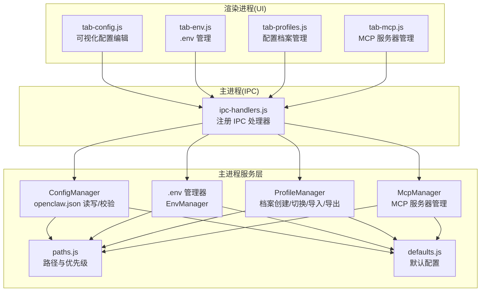
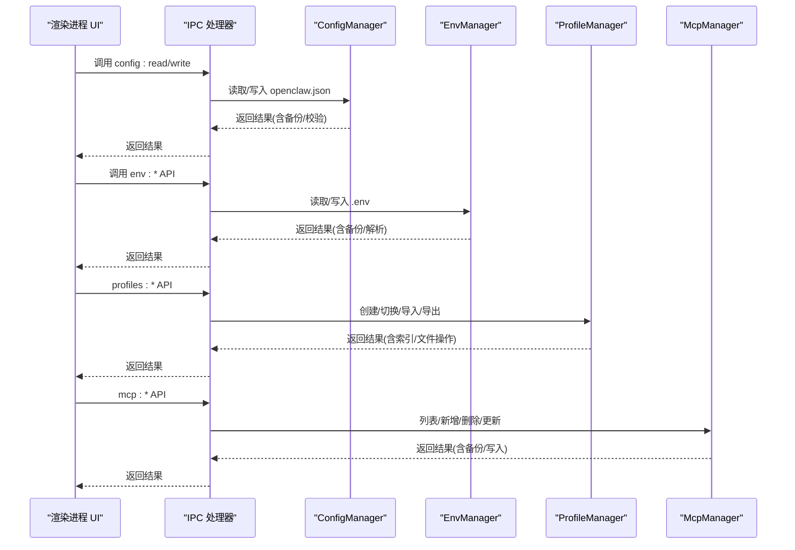
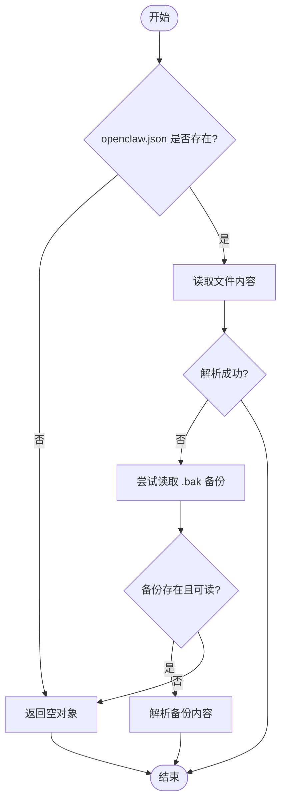
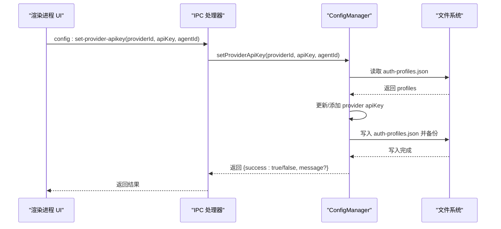
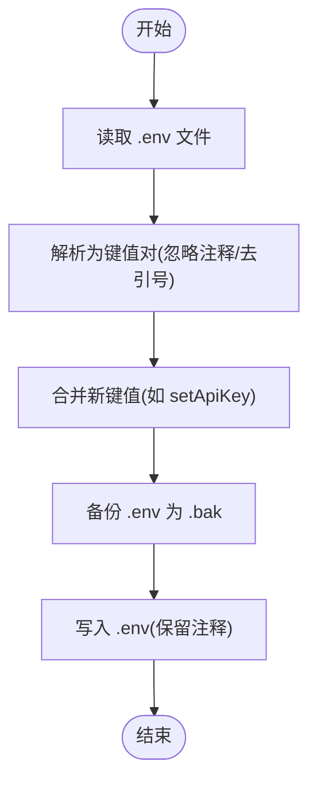
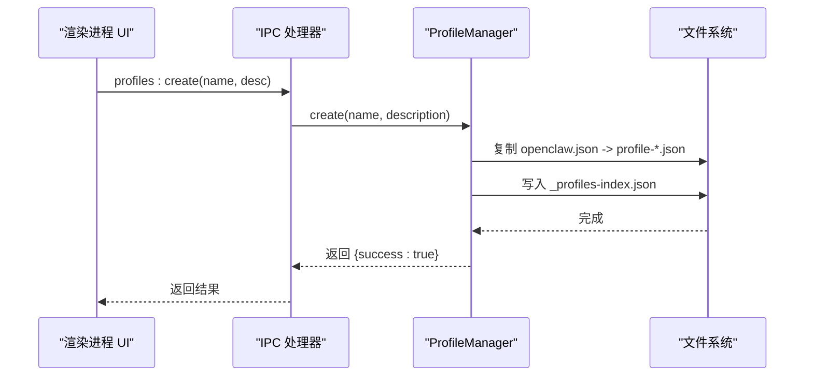
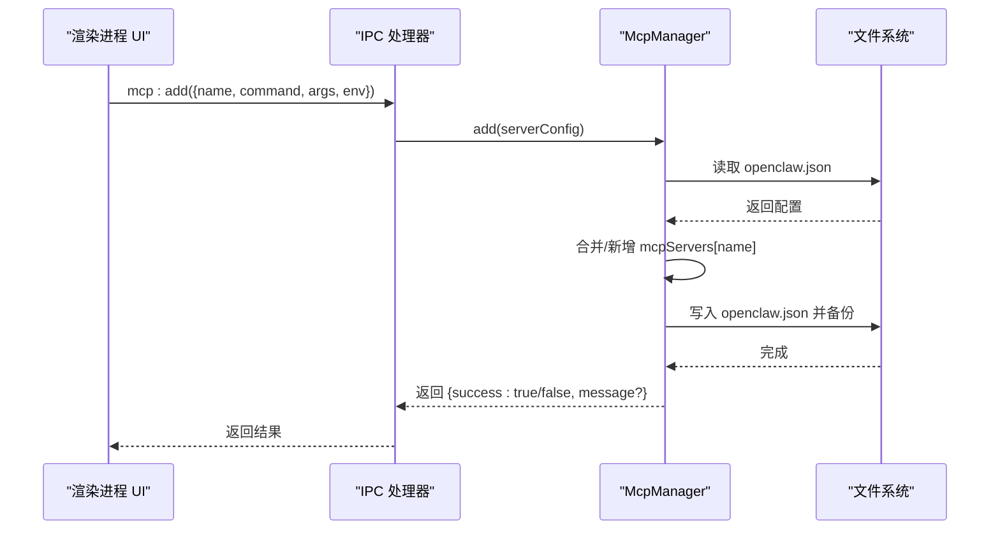
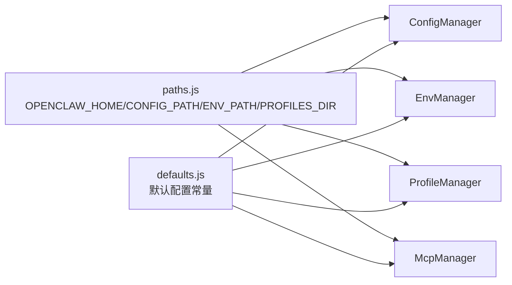

# 配置管理 API

<cite>
**本文档引用的文件**
- [config-manager.js](file://src/main/services/config-manager.js)
- [env-manager.js](file://src/main/services/env-manager.js)
- [profile-manager.js](file://src/main/services/profile-manager.js)
- [mcp-manager.js](file://src/main/services/mcp-manager.js)
- [paths.js](file://src/main/utils/paths.js)
- [defaults.js](file://src/main/config/defaults.js)
- [ipc-handlers.js](file://src/main/ipc-handlers.js)
- [tab-config.js](file://src/renderer/js/dashboard/tab-config.js)
- [tab-env.js](file://src/renderer/js/dashboard/tab-env.js)
- [tab-profiles.js](file://src/renderer/js/dashboard/tab-profiles.js)
- [tab-mcp.js](file://src/renderer/js/dashboard/tab-mcp.js)
</cite>

## 目录
1. [简介](#简介)
2. [项目结构](#项目结构)
3. [核心组件](#核心组件)
4. [架构总览](#架构总览)
5. [详细组件分析](#详细组件分析)
6. [依赖关系分析](#依赖关系分析)
7. [性能考量](#性能考量)
8. [故障排查指南](#故障排查指南)
9. [结论](#结论)
10. [附录](#附录)

## 简介
本文件系统性梳理并文档化“配置管理 API”，涵盖以下能力：
- openclaw.json 的读写与配置验证
- 环境变量管理 API（.env）
- 配置文件的导入/导出、配置档案的创建/切换
- MCP 服务器的增删改查
- 认证配置、模型配置、代理配置的管理
- 配置迁移、备份恢复与批量操作
- 配置优先级、继承关系与冲突解决策略
- 安全考虑与最佳实践

## 项目结构
配置管理涉及主进程服务层与渲染进程 UI 层的协作：
- 主进程服务层负责实际文件读写、备份与校验
- 渲染进程 UI 层负责可视化编辑与交互
- IPC 层桥接前后端调用

图表来源
- [ipc-handlers.js:26-816](file://src/main/ipc-handlers.js#L26-L816)
- [config-manager.js:1-264](file://src/main/services/config-manager.js#L1-L264)
- [env-manager.js:1-116](file://src/main/services/env-manager.js#L1-L116)
- [profile-manager.js:1-180](file://src/main/services/profile-manager.js#L1-L180)
- [mcp-manager.js:1-102](file://src/main/services/mcp-manager.js#L1-L102)
- [paths.js:1-124](file://src/main/utils/paths.js#L1-L124)
- [defaults.js:1-180](file://src/main/config/defaults.js#L1-L180)

章节来源
- [ipc-handlers.js:26-816](file://src/main/ipc-handlers.js#L26-L816)
- [paths.js:1-124](file://src/main/utils/paths.js#L1-L124)

## 核心组件
- ConfigManager：负责 openclaw.json 的读取、写入、备份与 JSON 结构校验；提供认证配置与模型配置的子功能入口。
- EnvManager：负责 .env 的读取、写入、备份与解析；提供单个 API Key 的设置与删除。
- ProfileManager：负责配置档案索引与文件管理，提供创建、切换、删除、导入、导出。
- McpManager：负责 MCP 服务器配置的读取、新增、删除、更新。
- 路径与默认配置：统一管理 openclaw.json、.env、档案目录等路径；提供默认配置常量。

章节来源
- [config-manager.js:1-264](file://src/main/services/config-manager.js#L1-L264)
- [env-manager.js:1-116](file://src/main/services/env-manager.js#L1-L116)
- [profile-manager.js:1-180](file://src/main/services/profile-manager.js#L1-L180)
- [mcp-manager.js:1-102](file://src/main/services/mcp-manager.js#L1-L102)
- [paths.js:1-124](file://src/main/utils/paths.js#L1-L124)
- [defaults.js:1-180](file://src/main/config/defaults.js#L1-L180)

## 架构总览
下图展示 IPC 调用链路与数据流向：

图表来源
- [ipc-handlers.js:207-541](file://src/main/ipc-handlers.js#L207-L541)
- [config-manager.js:212-260](file://src/main/services/config-manager.js#L212-L260)
- [env-manager.js:10-116](file://src/main/services/env-manager.js#L10-L116)
- [profile-manager.js:41-176](file://src/main/services/profile-manager.js#L41-L176)
- [mcp-manager.js:27-98](file://src/main/services/mcp-manager.js#L27-L98)

## 详细组件分析

### openclaw.json 读写与配置验证
- 读取：若目标文件不存在返回空对象；若读取异常尝试读取同目录 .bak 备份文件。
- 写入：确保目录存在；若原文件存在则先复制为 .bak；写入前进行 JSON 校验；成功后记录日志。
- 备份策略：每次写入均生成 .bak，便于回滚。
- 结构校验：写入前对字符串或对象进行 JSON.parse 校验，防止损坏配置。

图表来源
- [config-manager.js:212-233](file://src/main/services/config-manager.js#L212-L233)

章节来源
- [config-manager.js:212-260](file://src/main/services/config-manager.js#L212-L260)

### 认证配置（auth-profiles.json）与模型配置（models.json）
- 认证配置（auth-profiles.json）：
  - 读取：按 agentId 定位目录，若文件不存在返回版本化空结构。
  - 写入：确保目录存在；若原文件存在则复制为 .bak；写入前保证 version 与 profiles 结构；成功后记录日志。
  - 单个 Provider API Key：setProviderApiKey 与 removeProviderApiKey 支持按 providerId 更新或删除。
- 模型配置（models.json）：
  - 读取：按 agentId 定位目录，若文件不存在返回空 providers 结构。
  - 写入：确保目录存在；若原文件存在则复制为 .bak；写入前保证 providers 结构；成功后记录日志。
  - Provider 模型配置：setProviderModels 支持设置 baseUrl、apiKey、models 数组。

图表来源
- [ipc-handlers.js:229-235](file://src/main/ipc-handlers.js#L229-L235)
- [config-manager.js:84-120](file://src/main/services/config-manager.js#L84-L120)

章节来源
- [config-manager.js:25-185](file://src/main/services/config-manager.js#L25-L185)

### 环境变量管理 API（.env）
- 读取：若文件不存在返回空对象；解析时忽略注释行，去除首尾空白与引号。
- 写入：确保目录存在；若原文件存在则复制为 .bak；逐行输出 key=value，保留注释行；成功后记录日志。
- 单个 API Key 设置：setApiKey 合并写入，不影响其他键值。
- 单个 API Key 删除：removeApiKey 存在即删除并覆盖写入。

图表来源
- [env-manager.js:10-116](file://src/main/services/env-manager.js#L10-L116)

章节来源
- [env-manager.js:10-116](file://src/main/services/env-manager.js#L10-L116)
- [ipc-handlers.js:331-339](file://src/main/ipc-handlers.js#L331-L339)

### 配置档案（Profiles）：创建/切换/导入/导出/删除
- 创建：基于当前 openclaw.json 快照生成 profile-*.json，并写入索引文件 _profiles-index.json。
- 切换：将指定档案复制回 openclaw.json，并备份当前配置。
- 删除：删除索引条目与对应档案文件。
- 导入：校验 JSON 后复制到档案目录并写入索引。
- 导出：将指定档案复制到目标路径。

图表来源
- [ipc-handlers.js:427-429](file://src/main/ipc-handlers.js#L427-L429)
- [profile-manager.js:41-69](file://src/main/services/profile-manager.js#L41-L69)

章节来源
- [profile-manager.js:37-176](file://src/main/services/profile-manager.js#L37-L176)
- [ipc-handlers.js:418-457](file://src/main/ipc-handlers.js#L418-L457)

### MCP 服务器管理：添加/移除/更新/列出
- 列表：读取 openclaw.json 中的 mcpServers，映射为统一结构（command/args/env/enabled）。
- 新增：若不存在 mcpServers 则初始化；默认 enabled=true。
- 更新：支持仅更新 command/args/env/enabled，未提供的字段保持不变。
- 删除：若存在则删除并写回。

图表来源
- [ipc-handlers.js:530-532](file://src/main/ipc-handlers.js#L530-L532)
- [mcp-manager.js:39-58](file://src/main/services/mcp-manager.js#L39-L58)

章节来源
- [mcp-manager.js:27-98](file://src/main/services/mcp-manager.js#L27-L98)
- [ipc-handlers.js:525-541](file://src/main/ipc-handlers.js#L525-L541)

### 渲染进程 UI 与配置交互
- 配置页面（tab-config.js）：支持可视化与 JSON 两种模式；自动补全 gateway.controlUi.allowedOrigins；保存时进行 JSON 校验。
- 环境变量页面（tab-env.js）：支持添加/删除键值、密码可见性切换、PATH 修复流程。
- 档案页面（tab-profiles.js）：创建/切换/导入/导出/删除配置档案。
- MCP 页面（tab-mcp.js）：新增/编辑/删除 MCP 服务器，支持 JSON 格式的 env 输入。

章节来源
- [tab-config.js:1-478](file://src/renderer/js/dashboard/tab-config.js#L1-L478)
- [tab-env.js:1-250](file://src/renderer/js/dashboard/tab-env.js#L1-L250)
- [tab-profiles.js:1-159](file://src/renderer/js/dashboard/tab-profiles.js#L1-L159)
- [tab-mcp.js:1-199](file://src/renderer/js/dashboard/tab-mcp.js#L1-L199)

## 依赖关系分析
- 路径优先级与解析：
  - OPENCLAW_HOME：主目录，默认 ~/.openclaw，可通过环境变量覆盖。
  - CONFIG_PATH：openclaw.json 路径，默认在 OPENCLAW_HOME 下。
  - ENV_PATH：.env 路径，默认在 OPENCLAW_HOME 下。
  - PROFILES_DIR：配置档案目录，默认在 OPENCLAW_HOME 下。
  - OPENCLAW_NPM_PREFIX：优先从进程环境变量读取，其次从 .env 中读取，最后回退默认值。
- 默认配置：
  - 默认网络、超时、样式、路径、功能开关等集中定义，便于统一维护。

图表来源
- [paths.js:1-124](file://src/main/utils/paths.js#L1-L124)
- [defaults.js:1-180](file://src/main/config/defaults.js#L1-L180)

章节来源
- [paths.js:1-124](file://src/main/utils/paths.js#L1-L124)
- [defaults.js:1-180](file://src/main/config/defaults.js#L1-L180)

## 性能考量
- 文件 I/O：所有写入均进行目录存在性检查与 .bak 备份，建议在批量操作时合并多次写入，减少磁盘写入次数。
- JSON 校验：写入前进行 parse 校验，避免损坏配置；建议 UI 层在保存前进行轻量校验，降低主进程错误率。
- 大文件处理：Profile 导入/导出与 MCP 列表渲染建议异步执行，避免阻塞 UI。
- 超时控制：IPC 层已对部分外部请求设置超时，内部文件操作建议保持同步短小逻辑，避免阻塞事件循环。

## 故障排查指南
- 配置读取失败：
  - 若 openclaw.json 不存在，返回空对象；若读取异常，尝试读取 .bak 备份。
  - 检查路径权限与磁盘空间。
- 写入失败：
  - 检查 JSON 格式；确认目录可写；查看日志定位具体错误。
- .env 解析异常：
  - 确认键值对格式；注意引号去除规则；注释行以 # 开头。
- 档案切换失败：
  - 确认档案文件存在；检查 openclaw.json 写入权限；必要时手动恢复 .bak。
- MCP 更新失败：
  - 确认 name 存在；检查 JSON 格式的 env 字段；确认命令可执行。

章节来源
- [config-manager.js:212-233](file://src/main/services/config-manager.js#L212-L233)
- [env-manager.js:93-112](file://src/main/services/env-manager.js#L93-L112)
- [profile-manager.js:71-98](file://src/main/services/profile-manager.js#L71-L98)
- [mcp-manager.js:76-98](file://src/main/services/mcp-manager.js#L76-L98)

## 结论
本配置管理 API 通过主进程服务层与渲染进程 UI 的清晰分工，提供了稳定、可回滚、可验证的配置管理能力。结合路径优先级与默认配置，能够满足多场景部署需求。建议在生产环境中配合定期备份与变更审计，确保配置安全可控。

## 附录

### API 一览（IPC 通道）
- 配置管理
  - config:read → 读取 openclaw.json
  - config:write → 写入 openclaw.json（含 JSON 校验与备份）
  - config:get-path → 获取 openclaw.json 绝对路径
  - config:read-auth-profiles → 读取 auth-profiles.json（按 agentId）
  - config:write-auth-profiles → 写入 auth-profiles.json（按 agentId）
  - config:set-provider-apikey → 设置单个 Provider API Key（按 agentId）
  - config:remove-provider-apikey → 删除单个 Provider API Key（按 agentId）
  - config:read-models → 读取 models.json（按 agentId）
  - config:write-models → 写入 models.json（按 agentId）
  - config:set-provider-models → 设置 Provider 模型配置（按 agentId）
- 环境变量管理
  - env:read → 读取 .env
  - env:write → 写入 .env（覆盖写）
  - env:set-api-key → 设置单个 API Key（合并写）
  - env:remove-api-key → 删除单个 API Key
- 配置档案管理
  - profiles:list → 列出档案
  - profiles:switch → 切换到指定档案（备份当前配置）
  - profiles:create → 基于当前配置创建档案
  - profiles:delete → 删除指定档案
  - profiles:export → 导出指定档案到目标路径
  - profiles:import → 从文件导入档案
- MCP 服务器管理
  - mcp:list → 列出 MCP 服务器
  - mcp:add → 新增 MCP 服务器
  - mcp:remove → 删除 MCP 服务器
  - mcp:update → 更新 MCP 服务器（支持增量更新）

章节来源
- [ipc-handlers.js:207-541](file://src/main/ipc-handlers.js#L207-L541)