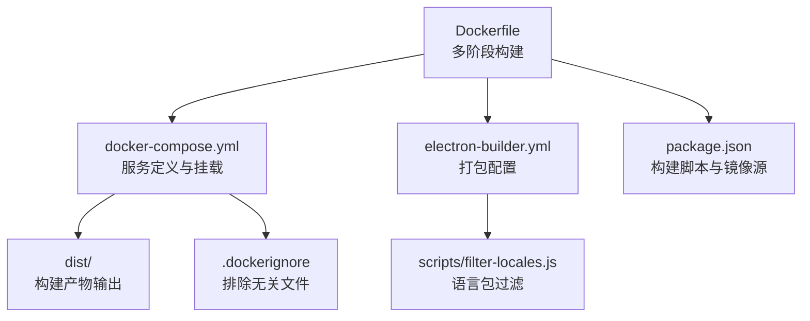
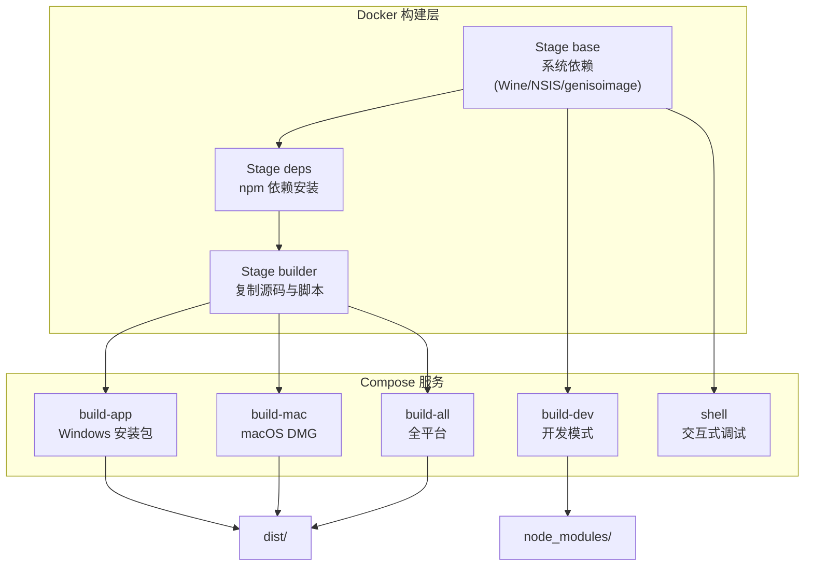
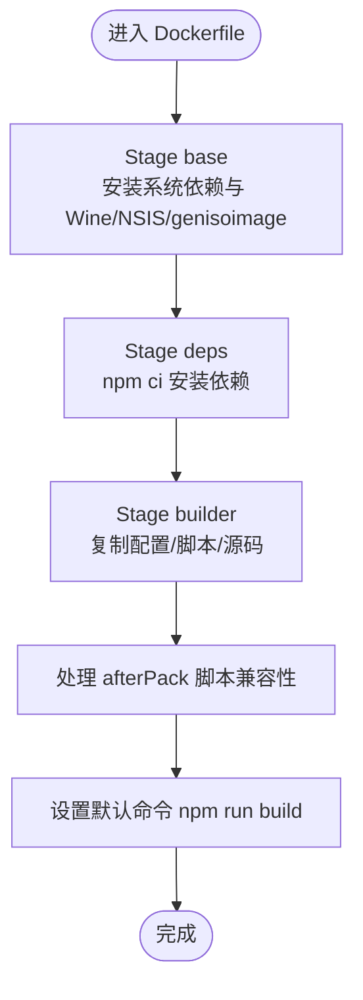
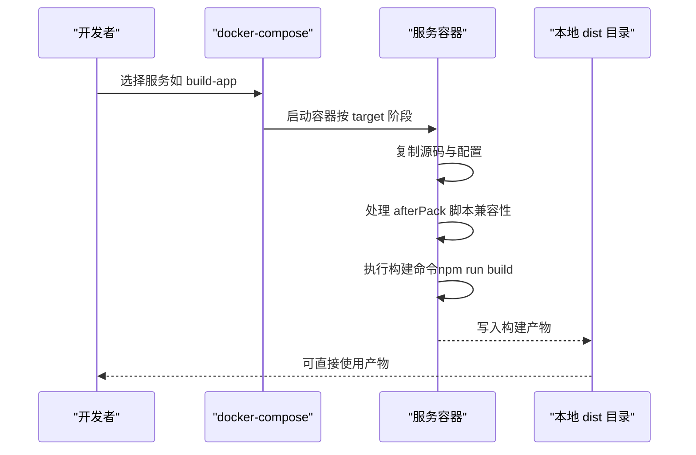
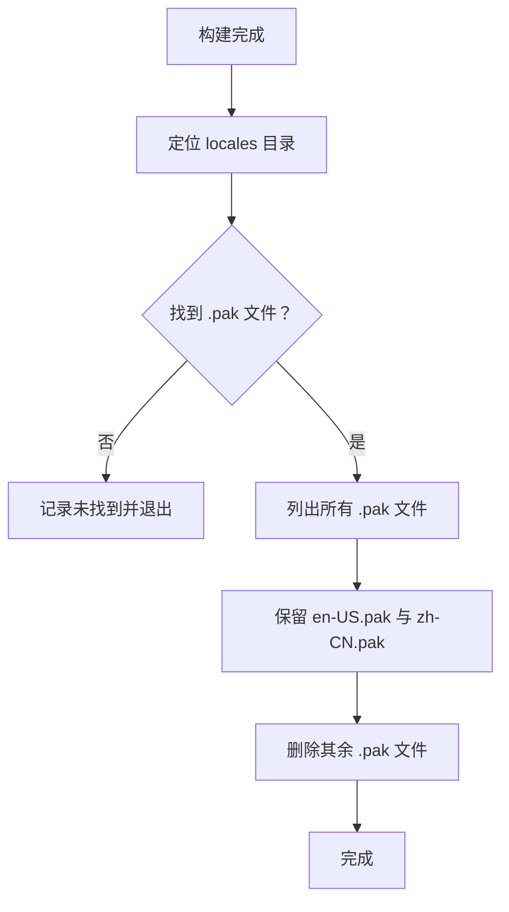
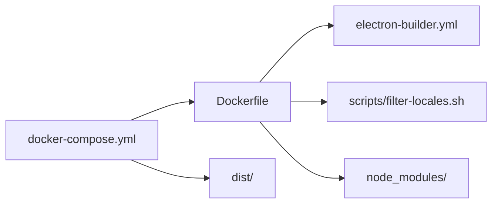

# Docker 构建

<cite>
**本文引用的文件**
- [Dockerfile](file://Dockerfile)
- [docker-compose.yml](file://docker-compose.yml)
- [.dockerignore](file://.dockerignore)
- [package.json](file://package.json)
- [README.md](file://README.md)
- [electron-builder.yml](file://electron-builder.yml)
- [scripts/filter-locales.sh](file://scripts/filter-locales.sh)
- [scripts/filter-locales.js](file://scripts/filter-locales.js)
- [scripts/build-fix.sh](file://scripts/build-fix.sh)
</cite>

## 目录
1. [简介](#简介)
2. [项目结构](#项目结构)
3. [核心组件](#核心组件)
4. [架构总览](#架构总览)
5. [详细组件分析](#详细组件分析)
6. [依赖关系分析](#依赖关系分析)
7. [性能考量](#性能考量)
8. [故障排除指南](#故障排除指南)
9. [结论](#结论)
10. [附录](#附录)

## 简介
本项目提供完整的 Docker 构建方案，用于在 Linux 环境下交叉编译 Windows 安装包（NSIS）与 macOS 安装包（DMG）。通过 Docker 镜像内置 Node.js、Wine、NSIS、genisoimage 等工具，实现无需本地配置、跨平台构建、CI/CD 集成等优势。镜像基于 Debian Bookworm，针对 amd64 与 arm64 架构分别进行适配，并配置了国内镜像源以提升 Electron 下载速度与稳定性。

## 项目结构
与 Docker 构建相关的核心文件与职责如下：
- Dockerfile：定义多阶段构建流程，包含基础系统依赖、npm 依赖安装、源码复制与默认构建命令。
- docker-compose.yml：定义多种构建服务（Windows、macOS、全平台、开发模式、交互式 Shell），并挂载输出目录与本地源码。
- .dockerignore：排除不必要的构建上下文文件，减少镜像体积与构建时间。
- package.json：定义构建脚本与 electron-builder 配置，包括输出目录、目标平台与语言包设置。
- electron-builder.yml：定义 Windows 与 macOS 平台的打包细节、图标、快捷方式、语言包过滤钩子等。
- scripts/filter-locales.*：在构建后过滤 Electron 语言包，仅保留指定语言，减小产物体积。
- scripts/build-fix.sh：本地构建辅助脚本，便于快速验证构建流程。

图表来源
- [Dockerfile:1-109](file://Dockerfile#L1-L109)
- [docker-compose.yml:1-105](file://docker-compose.yml#L1-L105)
- [.dockerignore:1-35](file://.dockerignore#L1-L35)
- [package.json:1-75](file://package.json#L1-L75)
- [electron-builder.yml:1-53](file://electron-builder.yml#L1-L53)
- [scripts/filter-locales.js:1-66](file://scripts/filter-locales.js#L1-L66)

章节来源
- [Dockerfile:1-109](file://Dockerfile#L1-L109)
- [docker-compose.yml:1-105](file://docker-compose.yml#L1-L105)
- [.dockerignore:1-35](file://.dockerignore#L1-L35)
- [package.json:1-75](file://package.json#L1-L75)
- [electron-builder.yml:1-53](file://electron-builder.yml#L1-L53)
- [scripts/filter-locales.js:1-66](file://scripts/filter-locales.js#L1-L66)

## 核心组件
- 多阶段 Dockerfile
  - base 阶段：安装系统依赖（Wine、NSIS、genisoimage、构建工具），配置环境变量（国内镜像源、npm yes、USE_SYSTEM_GENISOIMAGE）。
  - deps 阶段：复制 package.json/package-lock.json，使用 npm ci 与国内镜像加速安装依赖。
  - builder 阶段：复制构建配置、脚本与源码，处理 afterPack 脚本兼容性（.bat → .sh），设置默认构建命令。
- docker-compose 服务
  - build-app：构建 Windows 安装包，输出到本地 dist。
  - build-mac：在 Linux 容器中交叉编译 macOS DMG，注意首次打开需右键“打开”。
  - build-all：同时构建 Windows 与 macOS。
  - build-dev：开发模式，挂载本地源码与命名卷存储 node_modules。
  - shell：交互式 Shell，便于容器内调试。
- 排除策略
  - .dockerignore 排除 node_modules、dist、版本控制、IDE/系统文件、文档与测试文件，减少上下文大小。
- 构建配置
  - package.json 定义构建脚本（build、build:mac、build:all 等）与 electron-builder 输出目录。
  - electron-builder.yml 定义 Windows（NSIS）与 macOS（DMG）目标、图标、快捷方式、语言包过滤钩子与镜像源。

章节来源
- [Dockerfile:7-109](file://Dockerfile#L7-L109)
- [docker-compose.yml:5-105](file://docker-compose.yml#L5-L105)
- [.dockerignore:1-35](file://.dockerignore#L1-L35)
- [package.json:7-17](file://package.json#L7-L17)
- [electron-builder.yml:1-53](file://electron-builder.yml#L1-L53)

## 架构总览
Docker 构建采用多阶段镜像与多服务组合，实现从系统依赖到应用打包的完整流水线。Compose 服务通过卷挂载将构建产物映射到宿主机，开发模式通过命名卷隔离 node_modules，避免宿主机污染。

图表来源
- [Dockerfile:10-109](file://Dockerfile#L10-L109)
- [docker-compose.yml:11-99](file://docker-compose.yml#L11-L99)

章节来源
- [Dockerfile:10-109](file://Dockerfile#L10-L109)
- [docker-compose.yml:11-99](file://docker-compose.yml#L11-L99)

## 详细组件分析

### Dockerfile 组件分析
- 基础镜像与环境变量
  - 基于 node:22-bookworm，设置 DEBIAN_FRONTEND、WINEDEBUG、WINEPREFIX、npm 与 Electron 镜像源、npm_config_yes、USE_SYSTEM_GENISOIMAGE。
- 架构适配与系统依赖
  - 检测架构并按需安装 Wine（amd64：wine64+wine32；arm64：仅 wine64），安装 NSIS、genisoimage、构建工具与压缩工具，最后清理 apt 缓存。
- 多阶段依赖安装
  - deps 阶段使用 npm ci 与国内镜像加速安装依赖，并清理 npm 缓存。
- 源码与脚本准备
  - builder 阶段复制 electron-builder.yml、脚本与源码，替换 afterPack 脚本扩展名（.bat → .sh），确保 .sh 可执行，设置默认构建命令为 npm run build。
- 默认命令
  - CMD 指定 npm run build，便于直接运行容器执行构建。

图表来源
- [Dockerfile:10-109](file://Dockerfile#L10-L109)

章节来源
- [Dockerfile:10-109](file://Dockerfile#L10-L109)

### docker-compose 服务组件分析
- build-app
  - 目标：builder，挂载 dist 到宿主机，执行 npm run build。
- build-mac
  - 目标：builder，挂载 dist，执行 npm run build:mac，设置 USE_SYSTEM_GENISOIMAGE=true。
- build-all
  - 目标：builder，挂载 dist，执行 npm run build:all，设置 USE_SYSTEM_GENISOIMAGE=true。
- build-dev
  - 目标：base，挂载 . 到 /app，使用命名卷 openclaw-builder-node-modules 存储 node_modules，执行 npm install 与 npm run build。
- shell
  - 目标：base，挂载 . 到 /app，交互式进入容器 Bash。

图表来源
- [docker-compose.yml:11-99](file://docker-compose.yml#L11-L99)

章节来源
- [docker-compose.yml:11-99](file://docker-compose.yml#L11-L99)

### 语言包过滤组件分析
- 过滤逻辑
  - 在 dist 目录中查找包含 .pak 文件的 locales 目录，仅保留 en-US.pak 与 zh-CN.pak，删除其余语言包。
- 触发时机
  - electron-builder.yml 中 afterPack 指向 scripts/filter-locales.bat（Windows），在 Docker 中通过 sed 将其替换为 scripts/filter-locales.sh 并赋予执行权限。
- 脚本差异
  - filter-locales.js 为 Node.js 实现，filter-locales.sh 为 Bash 包装，确保 Linux 环境可用。

图表来源
- [electron-builder.yml:51](file://electron-builder.yml#L51)
- [scripts/filter-locales.js:1-66](file://scripts/filter-locales.js#L1-L66)
- [scripts/filter-locales.sh:1-8](file://scripts/filter-locales.sh#L1-L8)

章节来源
- [electron-builder.yml:51](file://electron-builder.yml#L51)
- [scripts/filter-locales.js:1-66](file://scripts/filter-locales.js#L1-L66)
- [scripts/filter-locales.sh:1-8](file://scripts/filter-locales.sh#L1-L8)

### 多架构支持与 macOS 构建
- 多架构支持
  - Dockerfile 在 base 阶段根据架构检测安装 Wine（amd64：wine64+wine32；arm64：仅 wine64），确保交叉编译能力。
  - README 提供使用 docker buildx 构建多平台镜像的示例命令。
- macOS 构建注意事项
  - README 指出在 Linux 容器中生成的 macOS DMG 为未签名版本，首次打开需右键“打开”，属于正常现象。
  - electron-builder.yml 中 mac.target 支持 x64 与 arm64，确保多架构 DMG 生成。

章节来源
- [Dockerfile:28-65](file://Dockerfile#L28-L65)
- [README.md:236-248](file://README.md#L236-L248)
- [electron-builder.yml:34-41](file://electron-builder.yml#L34-L41)

## 依赖关系分析
- 组件耦合
  - Dockerfile 的 builder 阶段依赖 electron-builder.yml 与 scripts/filter-locales.sh；compose 服务依赖 Dockerfile 的多阶段目标。
- 外部依赖
  - electron-builder 依赖 Electron 预编译包与 NSIS/DMG 工具，镜像通过 npm 与 ELECTRON_MIRROR 配置加速下载。
- 排除策略
  - .dockerignore 排除 node_modules、dist、版本控制与 IDE 文件，减少构建上下文，提升构建效率。

图表来源
- [Dockerfile:77-109](file://Dockerfile#L77-L109)
- [docker-compose.yml:11-99](file://docker-compose.yml#L11-L99)
- [.dockerignore:5-35](file://.dockerignore#L5-L35)

章节来源
- [Dockerfile:77-109](file://Dockerfile#L77-L109)
- [docker-compose.yml:11-99](file://docker-compose.yml#L11-L99)
- [.dockerignore:5-35](file://.dockerignore#L5-L35)

## 性能考量
- 构建缓存优化
  - Dockerfile 使用多阶段构建，deps 阶段仅在依赖变更时重建，减少重复安装依赖的时间。
  - .dockerignore 排除 node_modules、dist、文档与测试文件，缩小构建上下文，提升构建速度。
- 镜像大小优化
  - base 阶段安装系统依赖后清理 apt 缓存与临时文件，降低镜像体积。
  - electron-builder.yml 中 afterPack 过滤语言包，减少 dist 产物体积。
- 国内镜像源
  - Dockerfile 与 package.json 配置 npm 与 Electron 镜像源，避免网络超时导致的构建失败。
- 开发模式优化
  - docker-compose 的 build-dev 使用命名卷存储 node_modules，避免宿主机覆盖容器内依赖，提高迭代效率。

章节来源
- [Dockerfile:67-69](file://Dockerfile#L67-L69)
- [.dockerignore:5-35](file://.dockerignore#L5-L35)
- [package.json:57-59](file://package.json#L57-L59)
- [electron-builder.yml:51](file://electron-builder.yml#L51)
- [docker-compose.yml:66-83](file://docker-compose.yml#L66-L83)

## 故障排除指南
- 首次构建缓慢
  - electron-builder 需要下载 Electron 二进制包与 NSIS 工具，建议使用国内镜像源或离线缓存。
- 下载超时失败
  - 确认 npm 与 ELECTRON_MIRROR 配置正确，必要时手动设置镜像源环境变量。
- 缺少图标文件
  - 确保 build/icon.png（Windows）与 build/icon.png（macOS）存在，尺寸建议 256x256 以上。
- macOS DMG 首次打开被阻止
  - README 指出这是未签名 DMG 的正常行为，用户需右键“打开”以允许运行。
- 语言包体积过大
  - 确认 afterPack 钩子已正确替换为 .sh 并执行过滤脚本，仅保留 en-US.pak 与 zh-CN.pak。
- 开发模式依赖冲突
  - 使用 docker-compose 的 build-dev 服务，挂载 . 到 /app 并使用命名卷 openclaw-builder-node-modules 存储 node_modules，避免宿主机覆盖。

章节来源
- [README.md:206-215](file://README.md#L206-L215)
- [README.md:247](file://README.md#L247)
- [electron-builder.yml:51](file://electron-builder.yml#L51)
- [docker-compose.yml:66-83](file://docker-compose.yml#L66-L83)

## 结论
本项目的 Docker 构建方案通过多阶段镜像与多服务组合，实现了无需本地配置、跨平台构建与 CI/CD 集成的完整流程。镜像内置 Wine、NSIS、genisoimage 等工具，配合国内镜像源与语言包过滤，显著提升了构建效率与产物质量。开发模式下的命名卷与挂载机制进一步优化了迭代体验。

## 附录

### Docker 构建命令参考
- 构建镜像
  - 使用 docker compose 构建镜像：docker compose build
- 运行构建
  - Windows 安装包：docker compose run --rm build-app
  - macOS 安装包：docker compose run --rm build-mac
  - 全平台构建：docker compose run --rm build-all
  - 开发模式（挂载源码）：docker compose run --rm build-dev
  - 交互式调试：docker compose run --rm shell
- 多架构镜像构建
  - 使用 docker buildx 构建多平台镜像：docker buildx build --platform linux/amd64,linux/arm64 -t openclaw-builder .

章节来源
- [README.md:220-240](file://README.md#L220-L240)
- [docker-compose.yml:11-99](file://docker-compose.yml#L11-L99)

### Dockerfile 与 docker-compose.yml 关键配置说明
- 基础镜像与环境变量
  - 基于 node:22-bookworm，设置 npm 与 Electron 镜像源、npm_config_yes、USE_SYSTEM_GENISOIMAGE。
- 系统依赖与架构适配
  - 安装 NSIS、genisoimage、构建工具；amd64 安装 wine32/wine64，arm64 仅安装 wine64。
- 多阶段依赖安装
  - 使用 npm ci 与国内镜像加速安装依赖。
- 源码与脚本准备
  - 复制 electron-builder.yml、脚本与源码，处理 afterPack 脚本兼容性。
- 服务定义
  - build-app/build-mac/build-all 挂载 dist；build-dev 挂载 . 与命名卷 node_modules；shell 提供交互式调试。

章节来源
- [Dockerfile:10-109](file://Dockerfile#L10-L109)
- [docker-compose.yml:11-99](file://docker-compose.yml#L11-L99)