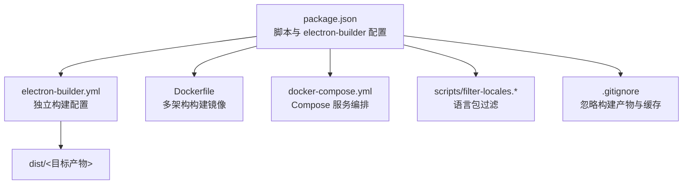
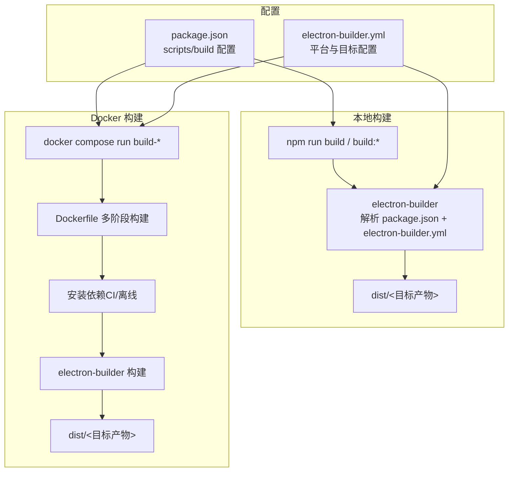
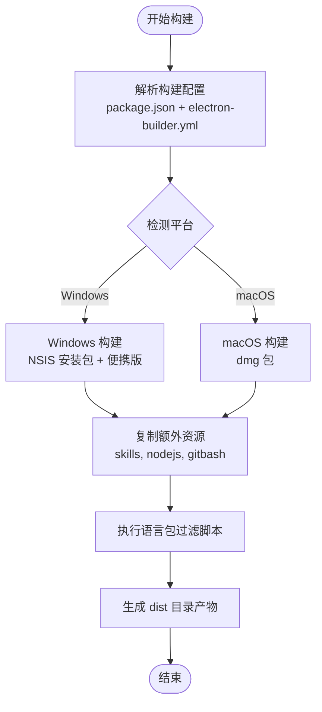
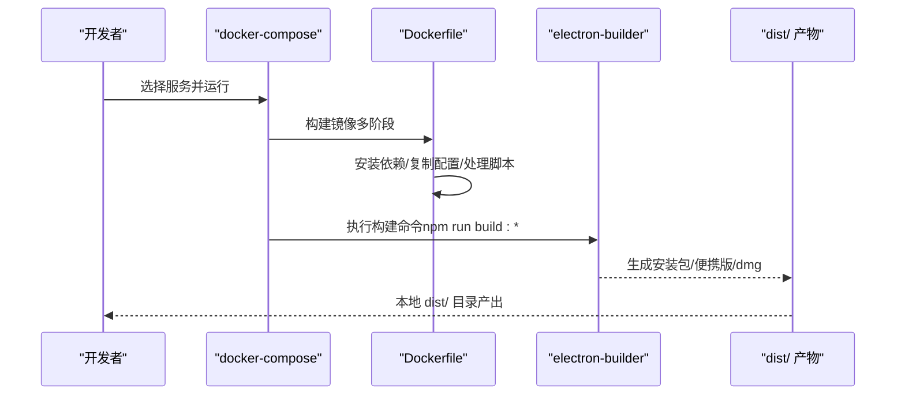
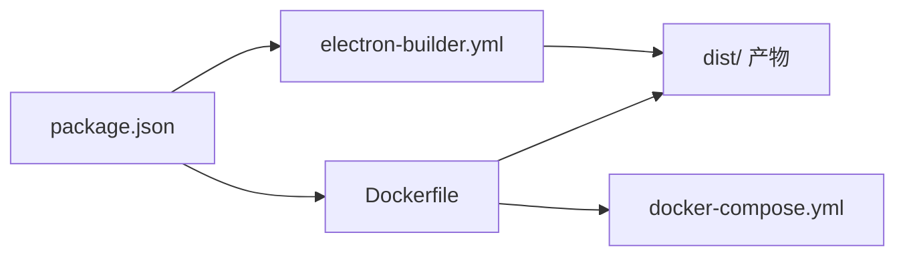

# 安装与部署

<cite>
**本文引用的文件**
- [package.json](file://package.json)
- [electron-builder.yml](file://electron-builder.yml)
- [Dockerfile](file://Dockerfile)
- [docker-compose.yml](file://docker-compose.yml)
- [README.md](file://README.md)
- [scripts/filter-locales.sh](file://scripts/filter-locales.sh)
- [scripts/filter-locales.bat](file://scripts/filter-locales.bat)
- [scripts/build-fix.sh](file://scripts/build-fix.sh)
- [.gitignore](file://.gitignore)
- [src/main/config/defaults.js](file://src/main/config/defaults.js)
- [src/renderer/js/config/defaults.js](file://src/renderer/js/config/defaults.js)
- [docs/INSTALLATION_FIX_GUIDE.md](file://docs/INSTALLATION_FIX_GUIDE.md)
- [docs/TROUBLESHOOTING.md](file://docs/TROUBLESHOOTING.md)
</cite>

## 目录
1. [简介](#简介)
2. [项目结构](#项目结构)
3. [核心组件](#核心组件)
4. [架构总览](#架构总览)
5. [详细组件分析](#详细组件分析)
6. [依赖关系分析](#依赖关系分析)
7. [性能考虑](#性能考虑)
8. [故障排查指南](#故障排查指南)
9. [结论](#结论)
10. [附录](#附录)

## 简介
本文件面向开发者与运维人员，提供从零搭建本地开发环境、运行 Electron 应用、以及在本地与 Docker 环境中完成打包构建的完整指南。内容覆盖：
- 本地开发环境要求与运行命令
- 生产构建流程与 electron-builder 配置详解
- 多平台构建目标（Windows 安装包、便携版、macOS 安装包）
- Docker 构建环境与 CI/CD 集成实践
- 构建配置文件说明、常见问题排查与性能优化建议
- 实际构建命令示例与产物说明

## 项目结构
该项目采用 Electron + 原生前端技术栈，主进程与渲染进程分离，资源与脚本组织清晰。关键目录与文件：
- src/main：主进程代码（IPC、服务层、工具）
- src/renderer：渲染进程代码（HTML/CSS/JS、组件与标签页）
- resources：构建期注入的额外资源（如技能包、Node.js/Git 安装包）
- scripts：构建辅助脚本（语言包过滤、安装脚本等）
- 配置文件：package.json（脚本与 electron-builder 配置）、electron-builder.yml（独立配置）

图表来源
- [package.json:1-75](file://package.json#L1-L75)
- [electron-builder.yml:1-53](file://electron-builder.yml#L1-L53)
- [Dockerfile:1-109](file://Dockerfile#L1-L109)
- [docker-compose.yml:1-105](file://docker-compose.yml#L1-L105)

章节来源
- [README.md:36-90](file://README.md#L36-L90)
- [package.json:1-75](file://package.json#L1-L75)
- [electron-builder.yml:1-53](file://electron-builder.yml#L1-L53)
- [.gitignore:1-53](file://.gitignore#L1-L53)

## 核心组件
- 本地开发与运行
  - Node.js 与 npm：满足版本要求后执行依赖安装与开发运行
  - 开发运行命令：启动 Electron 开发模式
  - 生产运行命令：启动打包后的应用
- 构建与打包
  - electron-builder：统一的打包工具，支持 Windows（NSIS）、macOS（dmg）与便携版
  - 配置来源：package.json 与 electron-builder.yml（优先级与合并规则以 electron-builder 文档为准）
- Docker 构建
  - Dockerfile：多阶段构建，内置 Wine、NSIS、genisoimage 等工具，支持 amd64/arm64
  - docker-compose.yml：提供 build-app、build-mac、build-all、build-dev、shell 等服务

章节来源
- [README.md:92-141](file://README.md#L92-L141)
- [package.json:7-17](file://package.json#L7-L17)
- [electron-builder.yml:1-53](file://electron-builder.yml#L1-L53)
- [Dockerfile:1-109](file://Dockerfile#L1-L109)
- [docker-compose.yml:1-105](file://docker-compose.yml#L1-L105)

## 架构总览
下图展示从源码到最终产物的构建路径，以及 Docker 与本地两种构建方式的差异。

图表来源
- [package.json:7-60](file://package.json#L7-L60)
- [electron-builder.yml:1-53](file://electron-builder.yml#L1-L53)
- [Dockerfile:70-109](file://Dockerfile#L70-L109)
- [docker-compose.yml:11-57](file://docker-compose.yml#L11-L57)

## 详细组件分析

### 本地开发环境搭建
- 环境要求
  - Node.js 版本：满足项目要求（详见 README 的环境要求）
- 依赖安装
  - 执行依赖安装命令
- 开发运行
  - 启动开发模式
- 生产运行
  - 启动已打包的应用

章节来源
- [README.md:94-115](file://README.md#L94-L115)
- [package.json:7-8](file://package.json#L7-L8)

### 生产构建与 electron-builder 配置
- 构建目标与命令
  - Windows 安装包
  - 便携版（绿色免安装）
  - macOS 安装包
  - 全平台构建
- 关键配置项
  - 应用标识与产品名
  - 输出目录与构建资源目录
  - 打包文件清单与额外资源
  - Windows 平台目标（NSIS）与 NSIS 选项
  - macOS 平台目标（dmg）与架构
  - Electron 语言包与下载镜像
  - Windows 平台额外资源（Node.js、Git 安装包）
  - Windows 打包后语言包过滤脚本（afterPack）

图表来源
- [package.json:18-60](file://package.json#L18-L60)
- [electron-builder.yml:10-53](file://electron-builder.yml#L10-L53)
- [scripts/filter-locales.sh:1-8](file://scripts/filter-locales.sh#L1-L8)
- [scripts/filter-locales.bat:1-4](file://scripts/filter-locales.bat#L1-L4)

章节来源
- [README.md:117-215](file://README.md#L117-L215)
- [package.json:10-16](file://package.json#L10-L16)
- [package.json:18-60](file://package.json#L18-L60)
- [electron-builder.yml:15-53](file://electron-builder.yml#L15-L53)

### Docker 构建环境与多平台支持
- 镜像与阶段
  - base：安装系统依赖（Wine、NSIS、genisoimage 等），设置国内镜像环境变量
  - deps：安装 npm 依赖（CI/离线友好）
  - builder：复制配置与脚本、处理 afterPack 脚本兼容性、复制源码与资源、默认构建命令
- Compose 服务
  - build-app：构建 Windows 安装包
  - build-mac：构建 macOS dmg（未签名）
  - build-all：同时构建 Windows 与 macOS
  - build-dev：挂载源码，适合频繁修改与调试
  - shell：交互式 Shell，便于调试
- 多架构支持
  - 支持 amd64 与 arm64，可通过 buildx 构建多平台镜像

图表来源
- [Dockerfile:10-109](file://Dockerfile#L10-L109)
- [docker-compose.yml:11-57](file://docker-compose.yml#L11-L57)
- [package.json:10-16](file://package.json#L10-L16)

章节来源
- [README.md:216-249](file://README.md#L216-L249)
- [Dockerfile:10-109](file://Dockerfile#L10-L109)
- [docker-compose.yml:1-105](file://docker-compose.yml#L1-L105)

### 构建目标与产物说明
- Windows 安装包（NSIS）
  - 产物：安装程序与便携版目录
  - 特点：可定制安装路径、创建桌面/开始菜单快捷方式
- 便携版（绿色免安装）
  - 产物：解压即用的可执行文件与资源
- macOS 安装包（dmg）
  - 产物：.dmg 安装镜像（未签名，首次打开需右键“打开”）
  - 架构：x64 与 arm64

章节来源
- [README.md:164-177](file://README.md#L164-L177)
- [electron-builder.yml:20-41](file://electron-builder.yml#L20-L41)
- [package.json:35-56](file://package.json#L35-L56)

### 构建配置文件详解
- package.json
  - scripts：定义构建命令别名
  - build：electron-builder 主配置（appId、productName、directories、files、extraResources、win/mac、electronLanguages、nsis、electronDownload 等）
- electron-builder.yml
  - 独立配置文件，覆盖与补充 package.json 中的 build 字段
  - Windows：target 为 nsis；extraResources 注入 nodejs 与 gitbash
  - macOS：target 为 dmg；category 指定应用分类
  - nsis：安装向导选项
  - afterPack：打包后语言包过滤脚本（Windows）
  - electronDownload：镜像加速

章节来源
- [package.json:18-60](file://package.json#L18-L60)
- [electron-builder.yml:1-53](file://electron-builder.yml#L1-L53)

### 构建命令与示例
- 本地构建
  - Windows 安装包
  - 便携版
  - macOS 安装包
  - 全平台
- Docker 构建
  - 构建镜像
  - 构建 Windows 安装包
  - 构建 macOS 安装包
  - 同时构建
  - 开发模式（挂载源码）
  - 交互式 Shell

章节来源
- [README.md:121-141](file://README.md#L121-L141)
- [package.json:10-16](file://package.json#L10-L16)
- [docker-compose.yml:11-57](file://docker-compose.yml#L11-L57)

## 依赖关系分析
- 组件耦合
  - package.json 的 scripts 与 electron-builder 配置紧密耦合
  - electron-builder.yml 作为独立配置，与 package.json 的 build 字段共同决定最终构建行为
  - Dockerfile 与 docker-compose.yml 将构建流程标准化，降低本地环境差异带来的影响
- 外部依赖
  - electron-builder、electron、NSIS、Wine、genisoimage 等
- 潜在循环依赖
  - 未发现直接循环依赖；配置文件间为单向依赖（Dockerfile/Compose -> 配置文件）

图表来源
- [package.json:18-60](file://package.json#L18-L60)
- [electron-builder.yml:1-53](file://electron-builder.yml#L1-53)
- [Dockerfile:70-109](file://Dockerfile#L70-L109)
- [docker-compose.yml:11-57](file://docker-compose.yml#L11-L57)

章节来源
- [package.json:18-60](file://package.json#L18-L60)
- [electron-builder.yml:1-53](file://electron-builder.yml#L1-L53)
- [Dockerfile:10-109](file://Dockerfile#L10-L109)
- [docker-compose.yml:1-105](file://docker-compose.yml#L1-L105)

## 性能考虑
- 构建性能
  - 首次构建会下载 Electron 与 NSIS 工具，建议使用国内镜像以减少等待
  - Docker 构建通过多阶段与 CI/离线策略提升稳定性与速度
- 产物体积
  - 使用语言包过滤脚本减少不必要的语言资源
  - 合理配置 files 与 extraResources，避免打包无关文件
- 运行性能
  - 渲染进程与主进程配置（超时、轮询间隔等）已在默认配置中给出参考值，可根据实际需求调整

章节来源
- [README.md:206-215](file://README.md#L206-L215)
- [electron-builder.yml:51-53](file://electron-builder.yml#L51-L53)
- [src/main/config/defaults.js:34-70](file://src/main/config/defaults.js#L34-L70)
- [src/renderer/js/config/defaults.js:24-30](file://src/renderer/js/config/defaults.js#L24-L30)

## 故障排查指南
- 打包后无法检测已安装的 OpenClaw
  - 使用开发者工具运行诊断，检查 openclaw.installed、configPath、version 等字段
  - 若配置目录存在但未检测到，手动检查配置内容
- 资源文件缺失
  - 检查诊断报告中的 resources 部分，确认 Node.js/Git 安装包是否存在
  - 若打包后缺失，检查 package.json 的 extraResources 配置
- Git 安装失败
  - 手动下载 Git for Windows 安装包并放入 resources/gitbash 目录，重新打包
- OpenClaw 安装失败
  - 检查网络与镜像源，必要时手动执行安装命令
- 依赖检测问题修复
  - 参考安装修复指南，增强依赖检测器对不同安装路径与环境变量的兼容性

章节来源
- [docs/TROUBLESHOOTING.md:1-219](file://docs/TROUBLESHOOTING.md#L1-L219)
- [docs/INSTALLATION_FIX_GUIDE.md:1-418](file://docs/INSTALLATION_FIX_GUIDE.md#L1-L418)

## 结论
通过统一的构建配置与 Docker 化流程，本项目实现了跨平台、可重复、可集成的打包与发布能力。建议在团队中统一使用 Docker 构建，以规避本地环境差异；在 CI/CD 中结合多架构镜像与 afterPack 脚本，进一步提升交付效率与质量。

## 附录
- 本地开发命令
  - 依赖安装
  - 开发运行
  - 生产运行
- 构建命令参考
  - 本地构建（Windows/macOS/全平台）
  - Docker 构建（镜像构建与服务运行）
- 产物说明
  - Windows 安装包与便携版
  - macOS dmg 安装包
- 常见问题与解决方案
  - 首次构建缓慢、下载超时、图标缺失、杀毒软件误报、生成便携版等

章节来源
- [README.md:99-141](file://README.md#L99-L141)
- [README.md:145-249](file://README.md#L145-L249)
- [package.json:10-16](file://package.json#L10-L16)
- [docker-compose.yml:220-240](file://README.md#L220-L240)