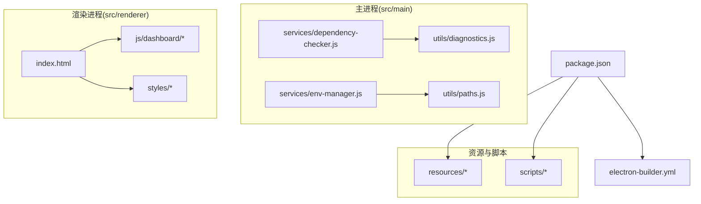
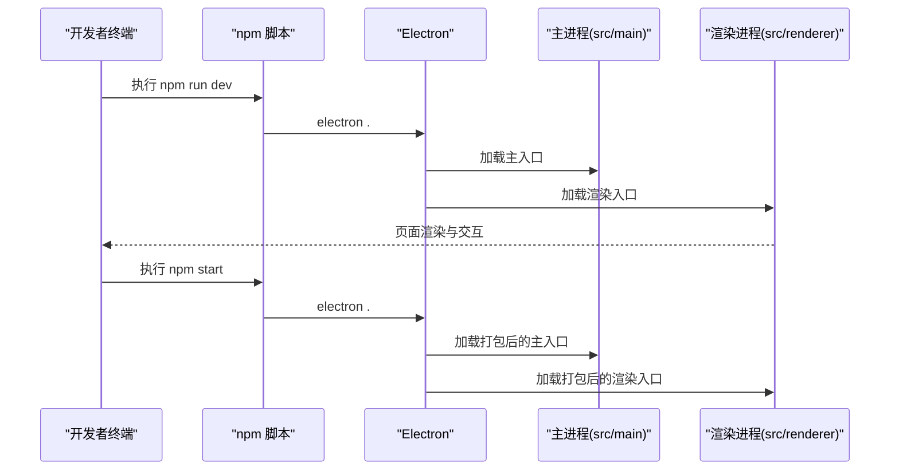
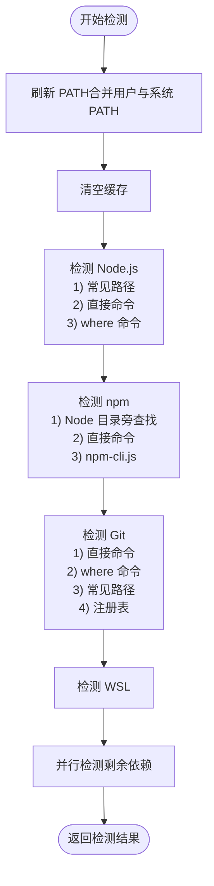
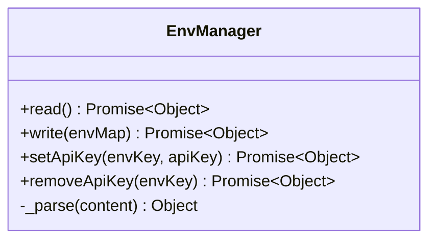
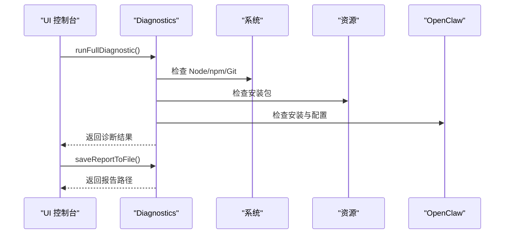
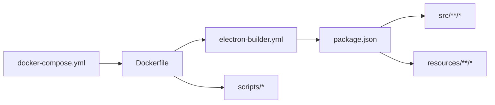

# 开发环境搭建

<cite>
**本文引用的文件**
- [package.json](file://package.json)
- [README.md](file://README.md)
- [INSTALLATION_FIX_GUIDE.md](file://docs/INSTALLATION_FIX_GUIDE.md)
- [TROUBLESHOOTING.md](file://docs/TROUBLESHOOTING.md)
- [dependency-checker.js](file://src/main/services/dependency-checker.js)
- [env-manager.js](file://src/main/services/env-manager.js)
- [diagnostics.js](file://src/main/utils/diagnostics.js)
- [docker-compose.yml](file://docker-compose.yml)
- [Dockerfile](file://Dockerfile)
- [electron-builder.yml](file://electron-builder.yml)
- [paths.js](file://src/main/utils/paths.js)
</cite>

## 目录
1. [简介](#简介)
2. [项目结构](#项目结构)
3. [核心组件](#核心组件)
4. [架构总览](#架构总览)
5. [详细组件分析](#详细组件分析)
6. [依赖关系分析](#依赖关系分析)
7. [性能考虑](#性能考虑)
8. [故障排查指南](#故障排查指南)
9. [结论](#结论)
10. [附录](#附录)

## 简介
本文件面向开发者，提供该 Electron 桌面应用的完整开发环境搭建指南。内容涵盖：
- Node.js 18+ 与 npm 的安装要求
- 项目依赖安装步骤
- 开发运行命令与生产运行命令的区别与使用场景
- 环境验证方法
- 常见问题排查（Node.js 版本不兼容、网络代理、权限问题等）

## 项目结构
该项目采用 Electron + 原生前端技术栈，主进程负责系统集成与依赖检测，渲染进程提供图形化界面。关键目录与职责如下：
- src/main：主进程代码，包含服务层（依赖检测、环境管理、日志等）与工具层（路径、诊断、日志等）
- src/renderer：渲染进程代码，包含页面与组件
- resources：安装包资源（Node.js、Git 安装包等）
- scripts：构建与过滤本地化资源的脚本
- docs：安装与故障排查文档
- 根目录：构建配置与包管理配置

图表来源
- [package.json](file://package.json)
- [dependency-checker.js](file://src/main/services/dependency-checker.js)
- [env-manager.js](file://src/main/services/env-manager.js)
- [diagnostics.js](file://src/main/utils/diagnostics.js)
- [paths.js](file://src/main/utils/paths.js)
- [electron-builder.yml](file://electron-builder.yml)

章节来源
- [package.json](file://package.json)
- [README.md](file://README.md)

## 核心组件
- 依赖检测器：负责检测 Node.js、npm、Git、WSL 等依赖，并在必要时提供安装流程
- 环境变量管理器：读写 .env 文件，支持设置/删除 API Key
- 诊断工具：收集系统、资源与 OpenClaw 状态信息，生成诊断报告
- 路径工具：提供 Windows 与 WSL 下的路径映射与日志目录定位

章节来源
- [dependency-checker.js](file://src/main/services/dependency-checker.js)
- [env-manager.js](file://src/main/services/env-manager.js)
- [diagnostics.js](file://src/main/utils/diagnostics.js)
- [paths.js](file://src/main/utils/paths.js)

## 架构总览
开发与运行流程分为两类：
- 开发模式：通过 npm run dev 启动 Electron，主进程加载 src/main，渲染进程加载 src/renderer
- 生产模式：通过 npm start 启动 Electron，应用以打包产物运行

图表来源
- [package.json](file://package.json)

章节来源
- [package.json](file://package.json)
- [README.md](file://README.md)

## 详细组件分析

### 依赖检测器（DependencyChecker）
职责与能力：
- 检测 Node.js、npm、Git、WSL 等依赖
- 在打包环境中通过刷新 PATH 与多策略探测提升检测成功率
- 并行检测多项依赖，减少等待时间
- 提供安装流程（如 Git 安装）

关键点：
- 打包后 Electron 继承的 PATH 很精简，需先从注册表读取完整 PATH 并合并进 process.env.PATH
- Node.js 检测优先检查常见安装路径，再尝试直接命令与 where 命令
- npm 检测优先从 Node.js 目录旁查找 npm.cmd/npm，再尝试直接命令
- Git 检测包含直接命令、where 命令、常见路径与注册表查找

图表来源
- [dependency-checker.js](file://src/main/services/dependency-checker.js)

章节来源
- [dependency-checker.js](file://src/main/services/dependency-checker.js)
- [INSTALLATION_FIX_GUIDE.md](file://docs/INSTALLATION_FIX_GUIDE.md)

### 环境变量管理器（EnvManager）
职责与能力：
- 读取 .env 文件，解析 key=value（支持注释与引号）
- 写入 .env 文件（带备份与覆盖写）
- 设置/删除单个 API Key，实现增量更新

图表来源
- [env-manager.js](file://src/main/services/env-manager.js)

章节来源
- [env-manager.js](file://src/main/services/env-manager.js)
- [paths.js](file://src/main/utils/paths.js)

### 诊断工具（Diagnostics）
职责与能力：
- 收集系统信息（平台、架构、Node/npm/Git 版本）
- 检查资源文件（Node.js/Git 安装包是否存在）
- 检查 OpenClaw 安装状态与配置目录
- 生成诊断报告并可保存到文件

图表来源
- [diagnostics.js](file://src/main/utils/diagnostics.js)

章节来源
- [diagnostics.js](file://src/main/utils/diagnostics.js)
- [TROUBLESHOOTING.md](file://docs/TROUBLESHOOTING.md)

## 依赖关系分析
- 构建与打包
  - electron-builder.yml 定义了 Windows/macOS 目标、图标、语言与额外资源
  - docker-compose.yml 提供多种构建模式（Windows/macOS/全平台/开发模式）
  - Dockerfile 基于 node:22-bookworm，预装 Wine、NSIS、genisoimage 等工具，并配置国内镜像
- 依赖检测与安装
  - dependency-checker.js 通过多策略检测与安装，解决打包后 PATH 不完整的问题
  - docs/INSTALLATION_FIX_GUIDE.md 提供了增强检测逻辑的实现要点

图表来源
- [electron-builder.yml](file://electron-builder.yml)
- [docker-compose.yml](file://docker-compose.yml)
- [Dockerfile](file://Dockerfile)
- [package.json](file://package.json)

章节来源
- [electron-builder.yml](file://electron-builder.yml)
- [docker-compose.yml](file://docker-compose.yml)
- [Dockerfile](file://Dockerfile)
- [package.json](file://package.json)

## 性能考虑
- 依赖检测采用并行策略，缩短等待时间
- 打包镜像配置国内镜像，减少下载超时
- Docker 多阶段构建，减少最终镜像体积与构建时间

## 故障排查指南
常见问题与解决思路：
- Node.js 版本不兼容
  - 症状：依赖检测显示 Node.js 版本过低
  - 排查：使用诊断工具查看系统 Node 版本；确认 Node.js 18+ 已安装
- 网络代理与镜像
  - 症状：首次构建下载缓慢或失败
  - 解决：使用 Docker 构建；或设置国内镜像（Electron、npm）
- 权限问题
  - 症状：添加 PATH 需要管理员权限
  - 解决：应用支持用户级 PATH 添加；如需系统级 PATH，以管理员身份运行
- 资源文件缺失
  - 症状：安装 Node.js/Git 时提示找不到安装包
  - 解决：确认 resources/nodejs 与 resources/gitbash 下的安装包存在；或手动添加安装包后重新打包
- 打包后无法检测已安装
  - 症状：开发模式可检测，打包后不可检测
  - 解决：使用诊断工具运行诊断，检查资源与 PATH；必要时重启应用

章节来源
- [TROUBLESHOOTING.md](file://docs/TROUBLESHOOTING.md)
- [INSTALLATION_FIX_GUIDE.md](file://docs/INSTALLATION_FIX_GUIDE.md)

## 结论
通过本指南，开发者可快速完成本地开发环境搭建与验证，理解开发与生产运行命令的差异，并掌握常见问题的排查方法。推荐优先使用 Docker 构建以规避本地环境差异带来的问题。

## 附录

### 环境要求与安装步骤
- 环境要求
  - Node.js >= 18
  - npm
- 安装依赖
  - 在项目根目录执行安装命令，安装所有依赖
- 开发运行
  - 使用开发命令启动 Electron，进入开发模式
- 生产运行
  - 使用生产命令启动 Electron，以打包产物运行

章节来源
- [README.md](file://README.md)
- [package.json](file://package.json)

### 开发运行命令与生产运行命令
- 开发命令
  - 用途：本地开发调试
  - 示例：执行开发命令
- 生产命令
  - 用途：以打包产物运行应用
  - 示例：执行生产命令

章节来源
- [package.json](file://package.json)
- [README.md](file://README.md)

### 环境验证方法
- 使用诊断工具运行完整诊断，检查系统、资源与 OpenClaw 状态
- 保存诊断报告以便提交问题时提供详细信息

章节来源
- [diagnostics.js](file://src/main/utils/diagnostics.js)
- [TROUBLESHOOTING.md](file://docs/TROUBLESHOOTING.md)

### 常见环境问题与解决方案
- Node.js 版本不兼容
  - 使用诊断工具查看 Node 版本；升级到 Node.js 18+
- 网络代理设置
  - 使用 Docker 构建；或设置 npm/Electron 国内镜像
- 权限问题
  - 用户级 PATH 更安全；如需系统级 PATH，以管理员身份运行
- 资源文件缺失
  - 确认 resources/nodejs 与 resources/gitbash 下的安装包存在

章节来源
- [TROUBLESHOOTING.md](file://docs/TROUBLESHOOTING.md)
- [INSTALLATION_FIX_GUIDE.md](file://docs/INSTALLATION_FIX_GUIDE.md)