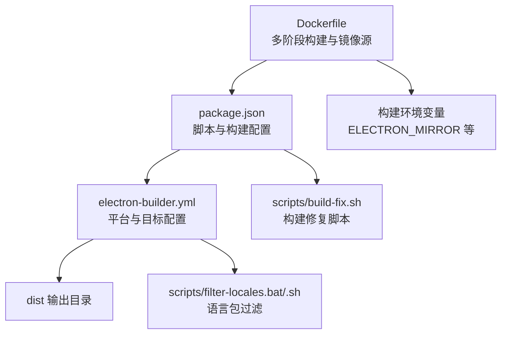
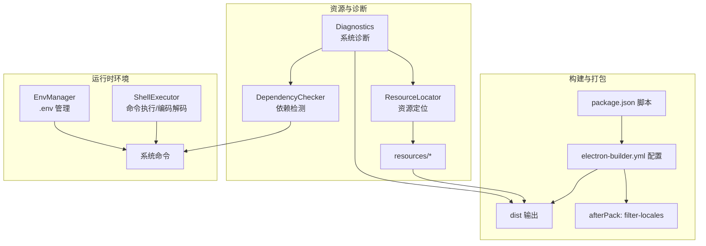
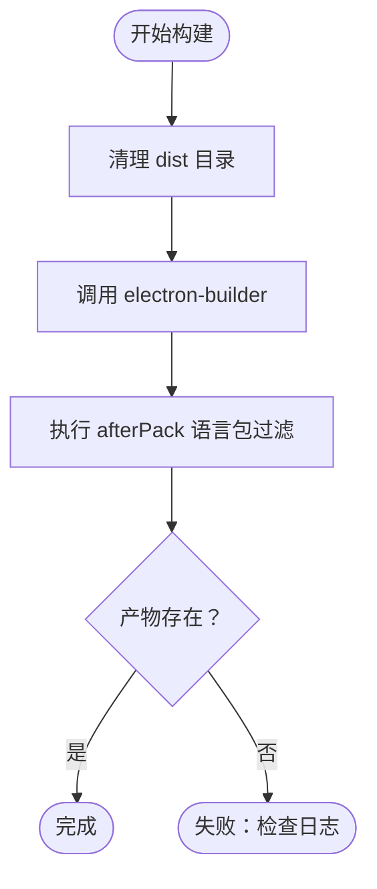
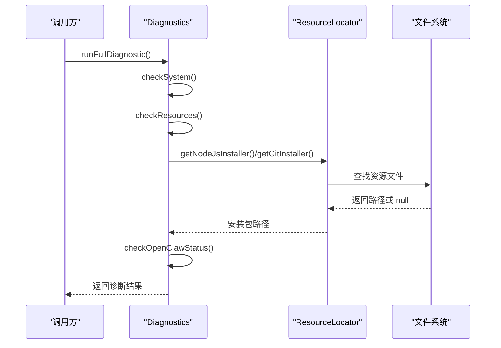
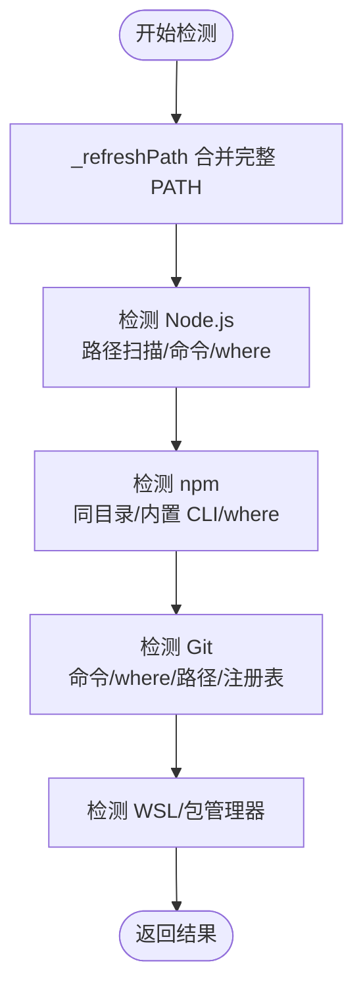
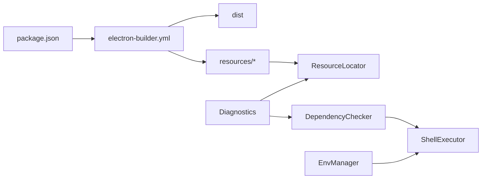

# 构建问题排查

<cite>
**本文引用的文件**   
- [package.json](file://package.json)
- [electron-builder.yml](file://electron-builder.yml)
- [Dockerfile](file://Dockerfile)
- [scripts/build-fix.sh](file://scripts/build-fix.sh)
- [scripts/filter-locales.bat](file://scripts/filter-locales.bat)
- [scripts/filter-locales.sh](file://scripts/filter-locales.sh)
- [docs/TROUBLESHOOTING.md](file://docs/TROUBLESHOOTING.md)
- [docs/INSTALLATION_FIX_GUIDE.md](file://docs/INSTALLATION_FIX_GUIDE.md)
- [src/main/services/dependency-checker.js](file://src/main/services/dependency-checker.js)
- [src/main/utils/diagnostics.js](file://src/main/utils/diagnostics.js)
- [src/main/utils/resource-locator.js](file://src/main/utils/resource-locator.js)
- [src/main/utils/shell-executor.js](file://src/main/utils/shell-executor.js)
- [src/main/services/env-manager.js](file://src/main/services/env-manager.js)
</cite>

## 目录
1. [简介](#简介)
2. [项目结构](#项目结构)
3. [核心组件](#核心组件)
4. [架构总览](#架构总览)
5. [详细组件分析](#详细组件分析)
6. [依赖关系分析](#依赖关系分析)
7. [性能考虑](#性能考虑)
8. [故障排查指南](#故障排查指南)
9. [结论](#结论)
10. [附录](#附录)

## 简介
本文件面向开发者与运维人员，系统性梳理本项目的构建与发布流程中常见问题及排查方法，涵盖首次构建缓慢、下载超时失败、缺少图标/资源文件、杀毒软件误报、网络代理与镜像源配置、以及构建性能优化策略。文档基于仓库内的构建配置、诊断工具与相关实现进行归纳总结，并提供可操作的排障步骤与图示。

## 项目结构
本项目采用 Electron + electron-builder 进行桌面应用打包，Dockerfile 提供跨平台交叉编译环境。资源文件通过 electron-builder 的 extraResources 机制打包，构建脚本与过滤脚本负责语言包裁剪与构建修复。

**图表来源**
- [package.json:1-75](file://package.json#L1-L75)
- [electron-builder.yml:1-53](file://electron-builder.yml#L1-L53)
- [Dockerfile:1-109](file://Dockerfile#L1-L109)

**章节来源**
- [package.json:1-75](file://package.json#L1-L75)
- [electron-builder.yml:1-53](file://electron-builder.yml#L1-L53)
- [Dockerfile:1-109](file://Dockerfile#L1-L109)

## 核心组件
- 构建配置与脚本
  - package.json 定义了构建脚本与 electron-builder 配置（输出目录、extraResources、NSIS 参数、镜像源等）。
  - electron-builder.yml 提供跨平台目标、语言包过滤钩子与镜像源。
  - scripts/build-fix.sh 用于清理 dist 并触发构建。
  - scripts/filter-locales.* 用于在 afterPack 阶段过滤语言包，减少体积。
- 资源定位与诊断
  - src/main/utils/resource-locator.js 统一处理开发/打包环境下的资源路径解析。
  - src/main/utils/diagnostics.js 提供系统诊断、资源检查与报告生成。
- 依赖检测与安装
  - src/main/services/dependency-checker.js 实现 Node.js/Git/npm/WSL 等依赖检测与安装流程。
  - src/main/utils/shell-executor.js 提供跨平台命令执行、编码解码与超时控制。
- 环境管理
  - src/main/services/env-manager.js 管理 .env 文件的读写与 API Key 设置。

**章节来源**
- [package.json:1-75](file://package.json#L1-L75)
- [electron-builder.yml:1-53](file://electron-builder.yml#L1-L53)
- [scripts/build-fix.sh:1-19](file://scripts/build-fix.sh#L1-L19)
- [scripts/filter-locales.bat:1-4](file://scripts/filter-locales.bat#L1-L4)
- [scripts/filter-locales.sh:1-8](file://scripts/filter-locales.sh#L1-L8)
- [src/main/utils/resource-locator.js:1-146](file://src/main/utils/resource-locator.js#L1-L146)
- [src/main/utils/diagnostics.js:1-196](file://src/main/utils/diagnostics.js#L1-L196)
- [src/main/services/dependency-checker.js:1-800](file://src/main/services/dependency-checker.js#L1-L800)
- [src/main/utils/shell-executor.js:1-471](file://src/main/utils/shell-executor.js#L1-L471)
- [src/main/services/env-manager.js:1-116](file://src/main/services/env-manager.js#L1-L116)

## 架构总览
下图展示了从构建到产物产出的关键路径，以及资源与诊断工具的协作关系。

**图表来源**
- [package.json:1-75](file://package.json#L1-L75)
- [electron-builder.yml:1-53](file://electron-builder.yml#L1-L53)
- [src/main/utils/resource-locator.js:1-146](file://src/main/utils/resource-locator.js#L1-L146)
- [src/main/utils/diagnostics.js:1-196](file://src/main/utils/diagnostics.js#L1-L196)
- [src/main/services/dependency-checker.js:1-800](file://src/main/services/dependency-checker.js#L1-L800)
- [src/main/utils/shell-executor.js:1-471](file://src/main/utils/shell-executor.js#L1-L471)
- [src/main/services/env-manager.js:1-116](file://src/main/services/env-manager.js#L1-L116)

## 详细组件分析

### 构建配置与脚本
- electron-builder 配置要点
  - 输出目录与构建资源目录分离，便于隔离。
  - extraResources 将 resources/skills 打包到最终产物中。
  - win/mac 平台目标与 NSIS 参数（快捷方式、图标等）。
  - electronDownload 指定镜像源，降低下载失败概率。
- 构建脚本
  - package.json 中的 build:* 脚本覆盖 Windows/macOS 多平台构建。
  - scripts/build-fix.sh 清理 dist 后强制重建，便于快速复现问题。
- 语言包过滤
  - afterPack 钩子在 Windows 平台执行 filter-locales.bat，Linux/Docker 环境对应 .sh。
  - 该步骤显著减小安装包体积，需确保脚本可执行且路径正确。

**图表来源**
- [scripts/build-fix.sh:1-19](file://scripts/build-fix.sh#L1-L19)
- [electron-builder.yml:51](file://electron-builder.yml#L51)
- [scripts/filter-locales.bat:1-4](file://scripts/filter-locales.bat#L1-L4)
- [scripts/filter-locales.sh:1-8](file://scripts/filter-locales.sh#L1-L8)

**章节来源**
- [package.json:1-75](file://package.json#L1-L75)
- [electron-builder.yml:1-53](file://electron-builder.yml#L1-L53)
- [scripts/build-fix.sh:1-19](file://scripts/build-fix.sh#L1-L19)
- [scripts/filter-locales.bat:1-4](file://scripts/filter-locales.bat#L1-L4)
- [scripts/filter-locales.sh:1-8](file://scripts/filter-locales.sh#L1-L8)

### 资源定位与诊断
- ResourceLocator
  - isPackaged 用于区分开发/打包环境，自动调整资源根路径。
  - findResource 支持多候选路径，兼顾打包后 resources/resources 两层目录。
  - getNodeJsInstaller/getGitInstaller 返回安装包绝对路径或 null。
- Diagnostics
  - runFullDiagnostic 汇总系统、资源、OpenClaw 状态与总结。
  - checkResources 检查 Node/Git 安装包是否存在。
  - generateReport/saveReportToFile 生成并保存诊断报告，便于问题追踪。

**图表来源**
- [src/main/utils/diagnostics.js:1-196](file://src/main/utils/diagnostics.js#L1-L196)
- [src/main/utils/resource-locator.js:1-146](file://src/main/utils/resource-locator.js#L1-L146)

**章节来源**
- [src/main/utils/resource-locator.js:1-146](file://src/main/utils/resource-locator.js#L1-L146)
- [src/main/utils/diagnostics.js:1-196](file://src/main/utils/diagnostics.js#L1-L196)

### 依赖检测与安装
- DependencyChecker
  - 通过多策略检测 Node.js/Git/npm/WSL，优先扫描常见安装路径，其次使用 where/which 与注册表查询。
  - _refreshPath 合并完整 PATH，解决打包后 PATH 精简导致的检测失败。
  - 并行检测提升效率，安装流程提供 onProgress 回调。
- ShellExecutor
  - 统一命令执行入口，处理 Windows cmd 完整路径、GBK 输出解码、WSL 模式适配与超时控制。
  - commandExists/commandExists 适配 WSL/native 模式，确保 npm 等命令可用性。

**图表来源**
- [src/main/services/dependency-checker.js:144-229](file://src/main/services/dependency-checker.js#L144-L229)
- [src/main/utils/shell-executor.js:115-127](file://src/main/utils/shell-executor.js#L115-L127)

**章节来源**
- [src/main/services/dependency-checker.js:1-800](file://src/main/services/dependency-checker.js#L1-L800)
- [src/main/utils/shell-executor.js:1-471](file://src/main/utils/shell-executor.js#L1-L471)

### 环境管理
- EnvManager
  - 读取/写入 .env 文件，支持备份与合并写入，便于管理 API Key 等敏感配置。
  - 与 ShellExecutor 协作，确保命令执行时环境变量正确。

**章节来源**
- [src/main/services/env-manager.js:1-116](file://src/main/services/env-manager.js#L1-L116)
- [src/main/utils/shell-executor.js:1-471](file://src/main/utils/shell-executor.js#L1-L471)

## 依赖关系分析
- 构建期依赖
  - electron-builder 依赖 electron 下载镜像源与构建工具链。
  - Dockerfile 设置 npm registry 与 ELECTRON_* 镜像源，减少网络失败率。
- 运行期依赖
  - ResourceLocator 与 Diagnostics 依赖 Electron 打包后的资源路径。
  - DependencyChecker 依赖 ShellExecutor 的命令执行能力与 PATH 刷新。

**图表来源**
- [package.json:1-75](file://package.json#L1-L75)
- [electron-builder.yml:1-53](file://electron-builder.yml#L1-L53)
- [src/main/utils/resource-locator.js:1-146](file://src/main/utils/resource-locator.js#L1-L146)
- [src/main/utils/diagnostics.js:1-196](file://src/main/utils/diagnostics.js#L1-L196)
- [src/main/services/dependency-checker.js:1-800](file://src/main/services/dependency-checker.js#L1-L800)
- [src/main/utils/shell-executor.js:1-471](file://src/main/utils/shell-executor.js#L1-L471)
- [src/main/services/env-manager.js:1-116](file://src/main/services/env-manager.js#L1-L116)

**章节来源**
- [package.json:1-75](file://package.json#L1-L75)
- [electron-builder.yml:1-53](file://electron-builder.yml#L1-L53)
- [Dockerfile:1-109](file://Dockerfile#L1-L109)

## 性能考虑
- 构建性能优化
  - 使用镜像源：electron-builder.yml 与 Dockerfile 均配置镜像源，减少下载耗时。
  - 语言包过滤：afterPack 阶段过滤语言包，显著缩小安装包体积，缩短下载与安装时间。
  - 并行检测：DependencyChecker 对 npm/Git/WSL 使用 Promise.all 并行，缩短检测时间。
- 运行时性能
  - ShellExecutor 统一命令执行与编码解码，避免乱码与超时。
  - ResourceLocator 多路径查找去重，减少 IO 查询次数。

**章节来源**
- [electron-builder.yml:51-53](file://electron-builder.yml#L51-L53)
- [Dockerfile:16-23](file://Dockerfile#L16-L23)
- [scripts/filter-locales.bat:1-4](file://scripts/filter-locales.bat#L1-L4)
- [scripts/filter-locales.sh:1-8](file://scripts/filter-locales.sh#L1-L8)
- [src/main/services/dependency-checker.js:171-176](file://src/main/services/dependency-checker.js#L171-L176)
- [src/main/utils/shell-executor.js:136-197](file://src/main/utils/shell-executor.js#L136-L197)

## 故障排查指南

### 一、首次构建缓慢
- 可能原因
  - 未使用镜像源，下载 Electron/依赖缓慢。
  - 语言包未过滤，产物体积大。
  - 依赖检测失败导致重复尝试与超时。
- 排查步骤
  - 确认镜像源配置：检查 electron-builder.yml 与 Dockerfile 的镜像源设置。
  - 确认语言包过滤：确认 afterPack 钩子已执行，脚本可执行权限正常。
  - 观察依赖检测日志：关注 DependencyChecker 的多策略检测与 PATH 合并过程。
- 优化建议
  - 使用缓存：npm ci 与 Docker 层缓存，避免重复安装。
  - 并行构建：确保 CI 环境具备足够 CPU/内存资源。
  - 增量构建：仅在必要时清理 dist，使用 scripts/build-fix.sh 快速复现。

**章节来源**
- [electron-builder.yml:51-53](file://electron-builder.yml#L51-L53)
- [Dockerfile:16-23](file://Dockerfile#L16-L23)
- [scripts/filter-locales.bat:1-4](file://scripts/filter-locales.bat#L1-L4)
- [scripts/filter-locales.sh:1-8](file://scripts/filter-locales.sh#L1-L8)
- [src/main/services/dependency-checker.js:144-229](file://src/main/services/dependency-checker.js#L144-L229)
- [scripts/build-fix.sh:1-19](file://scripts/build-fix.sh#L1-L19)

### 二、下载超时失败
- 可能原因
  - 网络不稳定或受限，无法访问默认镜像源。
  - 代理未配置或配置错误。
- 排查步骤
  - 在 Docker 环境中确认 npm registry 与 ELECTRON_* 环境变量。
  - 在本地环境检查系统代理与 npm/yarn/pnpm 的代理配置。
  - 使用 docs/TROUBLESHOOTING.md 的诊断工具导出报告，定位资源缺失与网络问题。
- 解决方案
  - 切换国内镜像源（npm registry、ELECTRON_MIRROR 等）。
  - 配置系统/应用代理，确保 HTTPS 请求可达。
  - 使用 docs/INSTALLATION_FIX_GUIDE.md 的增强检测策略，提升检测成功率。

**章节来源**
- [Dockerfile:16-23](file://Dockerfile#L16-L23)
- [docs/TROUBLESHOOTING.md:1-219](file://docs/TROUBLESHOOTING.md#L1-L219)
- [docs/INSTALLATION_FIX_GUIDE.md:1-418](file://docs/INSTALLATION_FIX_GUIDE.md#L1-L418)

### 三、缺少图标/资源文件
- 可能原因
  - 打包时 extraResources 配置不正确或资源路径不存在。
  - 开发/打包环境路径差异导致资源定位失败。
- 排查步骤
  - 使用 Diagnostics 的 checkResources 输出资源根目录与安装包存在性。
  - 使用 ResourceLocator 的 getNodeJsInstaller/getGitInstaller 验证路径解析。
  - 检查 electron-builder.yml 的 extraResources 与 files 配置。
- 解决方案
  - 确保 resources/gitbash 与 resources/nodejs 目录存在且包含对应安装包。
  - 在 Docker 构建中确认 COPY 资源路径与权限。
  - 使用 docs/TROUBLESHOOTING.md 的诊断报告保存与分享流程协助定位。

**章节来源**
- [electron-builder.yml:11-13](file://electron-builder.yml#L11-L13)
- [src/main/utils/diagnostics.js:94-109](file://src/main/utils/diagnostics.js#L94-L109)
- [src/main/utils/resource-locator.js:84-119](file://src/main/utils/resource-locator.js#L84-L119)
- [docs/TROUBLESHOOTING.md:32-50](file://docs/TROUBLESHOOTING.md#L32-L50)

### 四、杀毒软件误报
- 可能原因
  - 安装包体积大、包含第三方安装器（如 NSIS），易被误判。
  - 语言包过滤后仍可能触发误报。
- 排查步骤
  - 使用 Diagnostics 生成完整报告，包含系统、资源与 OpenClaw 状态。
  - 检查安装包签名与哈希，确保来源可信。
- 解决方案
  - 与安全厂商合作申请白名单。
  - 在发布渠道提供数字签名与校验信息。
  - 优化安装包体积（语言包过滤、压缩）。

**章节来源**
- [src/main/utils/diagnostics.js:148-196](file://src/main/utils/diagnostics.js#L148-L196)
- [electron-builder.yml:43-50](file://electron-builder.yml#L43-L50)
- [scripts/filter-locales.bat:1-4](file://scripts/filter-locales.bat#L1-L4)

### 五、网络问题处理（代理与镜像源）
- 代理设置
  - 在 CI/Docker 环境设置 http_proxy/https_proxy。
  - 在 npm/yarn/pnpm 中配置 proxy/https-proxy。
- 镜像源配置
  - npm registry：registry.npmmirror.com。
  - Electron 镜像：npmmirror.com/mirrors/electron/。
  - electron-builder 二进制镜像：npmmirror.com/mirrors/electron-builder-binaries/。
- 验证方法
  - 使用 Diagnostics 的系统检查与资源检查，确认网络可达性与资源存在。

**章节来源**
- [Dockerfile:16-23](file://Dockerfile#L16-L23)
- [package.json:57-59](file://package.json#L57-L59)
- [electron-builder.yml:52-53](file://electron-builder.yml#L52-L53)
- [src/main/utils/diagnostics.js:46-92](file://src/main/utils/diagnostics.js#L46-L92)

### 六、构建性能优化建议
- 缓存利用
  - npm ci 与 Docker 层缓存，避免重复安装依赖。
  - electron-builder 缓存 electron 二进制。
- 并行构建
  - 依赖检测并行化，减少等待时间。
  - CI 并行任务拆分，缩短整体耗时。
- 增量构建
  - 仅在变更时清理 dist，使用 scripts/build-fix.sh。
  - 语言包过滤减少安装包体积。

**章节来源**
- [scripts/build-fix.sh:1-19](file://scripts/build-fix.sh#L1-L19)
- [src/main/services/dependency-checker.js:171-176](file://src/main/services/dependency-checker.js#L171-L176)
- [scripts/filter-locales.bat:1-4](file://scripts/filter-locales.bat#L1-L4)
- [scripts/filter-locales.sh:1-8](file://scripts/filter-locales.sh#L1-L8)

### 七、实际错误案例与解决过程
- 案例：打包后无法检测已安装的 OpenClaw
  - 现象：开发环境可检测，打包后检测失败。
  - 排查：使用 Diagnostics 的 runDiagnostics 输出，检查 openclaw.installed 与 configPath。
  - 解决：根据 docs/TROUBLESHOOTING.md 的诊断步骤，检查配置目录与 openclaw.json。
- 案例：资源文件缺失（Node.js/Git 安装包）
  - 现象：诊断报告 resources.nodeInstaller/gitInstaller 为 false。
  - 排查：使用 ResourceLocator 的 getNodeJsInstaller/getGitInstaller 检查路径。
  - 解决：补齐 resources/nodejs 与 resources/gitbash 对应安装包，重新打包。

**章节来源**
- [docs/TROUBLESHOOTING.md:1-219](file://docs/TROUBLESHOOTING.md#L1-L219)
- [src/main/utils/diagnostics.js:14-44](file://src/main/utils/diagnostics.js#L14-L44)
- [src/main/utils/resource-locator.js:84-119](file://src/main/utils/resource-locator.js#L84-L119)

## 结论
本项目的构建与发布流程通过镜像源、语言包过滤与诊断工具实现了较好的稳定性与可观测性。针对首次构建缓慢、下载超时、资源缺失与误报等问题，建议优先检查镜像源与网络代理配置、确认资源路径与打包配置、并结合 Diagnostics 报告进行定位。同时，通过缓存、并行与增量构建策略持续优化构建性能。

## 附录
- 常用命令与路径
  - 构建脚本：npm run build/build:win/build:mac 等。
  - 诊断工具：Diagnostics.runFullDiagnostic/saveReportToFile。
  - 资源定位：ResourceLocator.getResourcesRoot/findResource。
- 参考文件
  - docs/TROUBLESHOOTING.md：系统性故障排查与诊断报告。
  - docs/INSTALLATION_FIX_GUIDE.md：依赖检测增强策略与部署说明。