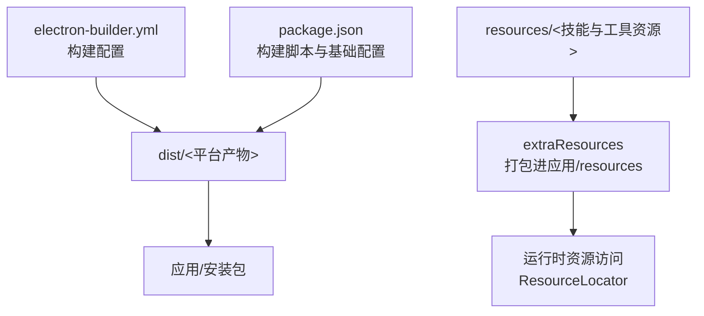
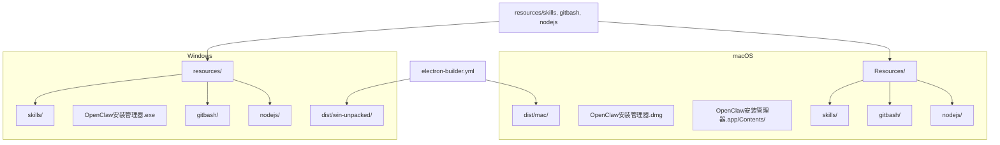
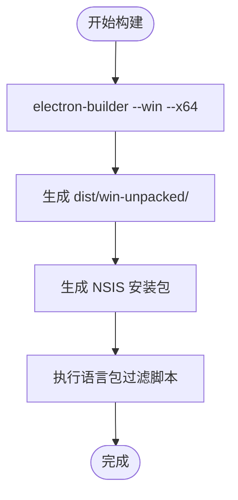
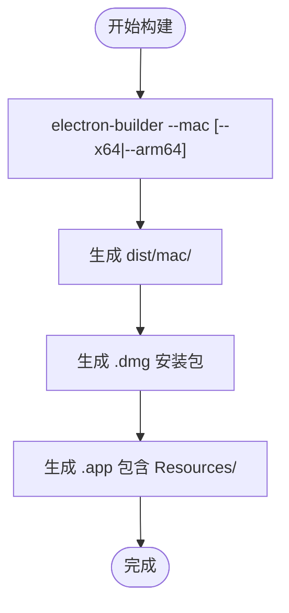
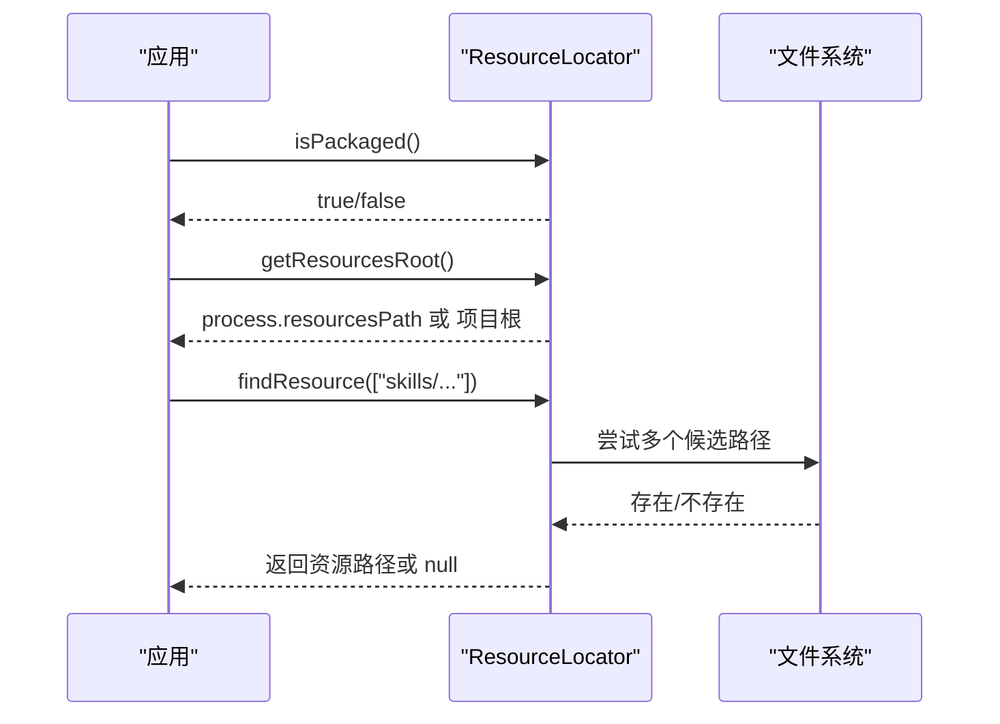
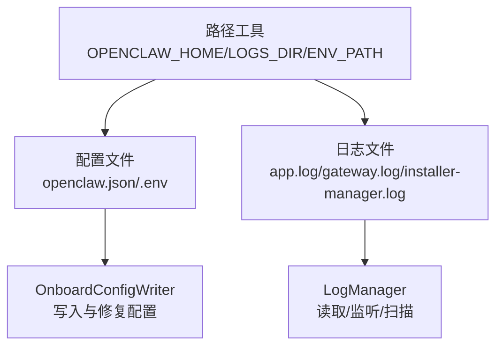
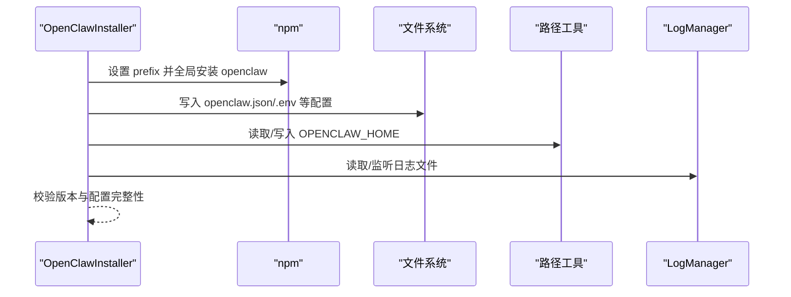
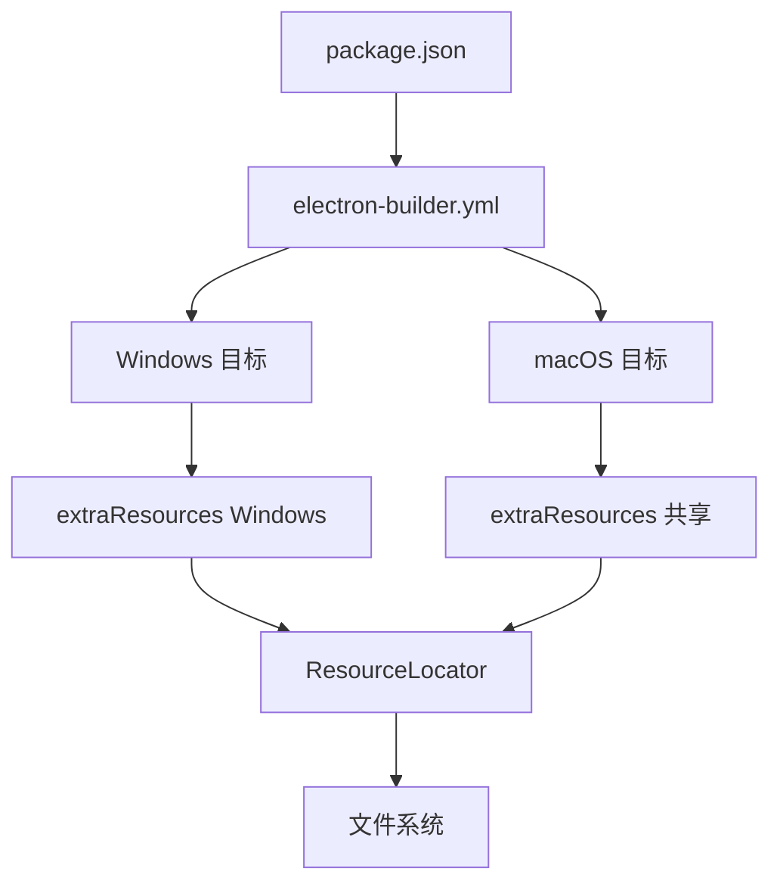

# 构建产物

<cite>
**本文引用的文件**
- [electron-builder.yml](file://electron-builder.yml)
- [package.json](file://package.json)
- [scripts/filter-locales.bat](file://scripts/filter-locales.bat)
- [scripts/filter-locales.js](file://scripts/filter-locales.js)
- [scripts/filter-locales.sh](file://scripts/filter-locales.sh)
- [src/main/utils/resource-locator.js](file://src/main/utils/resource-locator.js)
- [src/main/services/log-manager.js](file://src/main/services/log-manager.js)
- [src/main/utils/paths.js](file://src/main/utils/paths.js)
- [src/main/services/onboard-config-writer.js](file://src/main/services/onboard-config-writer.js)
- [src/main/services/openclaw-installer.js](file://src/main/services/openclaw-installer.js)
</cite>

## 目录
1. [简介](#简介)
2. [项目结构](#项目结构)
3. [核心组件](#核心组件)
4. [架构总览](#架构总览)
5. [详细组件分析](#详细组件分析)
6. [依赖分析](#依赖分析)
7. [性能考虑](#性能考虑)
8. [故障排查指南](#故障排查指南)
9. [结论](#结论)
10. [附录](#附录)

## 简介
本文件面向构建产物的使用者与维护者，系统性说明构建输出目录结构、各产物文件的作用、跨平台差异、extraResources 资源打包规则与运行时访问方式，并提供产物验证与完整性检查方法，帮助确保构建质量与交付一致性。

## 项目结构
本项目采用 Electron + electron-builder 进行跨平台构建，构建配置集中在配置文件中，主要产物位于 dist 目录。以下图示展示关键配置与产物的关系：

图表来源
- [electron-builder.yml:1-53](file://electron-builder.yml#L1-L53)
- [package.json:18-60](file://package.json#L18-L60)

章节来源
- [electron-builder.yml:1-53](file://electron-builder.yml#L1-L53)
- [package.json:18-60](file://package.json#L18-L60)

## 核心组件
- 构建配置与目标
  - Windows 安装包（NSIS，x64）
  - macOS 安装包（DMG，x64/arm64）
  - 输出目录与构建资源目录由配置统一管理
- extraResources 规则
  - 全平台共享：resources/skills → resources/skills
  - Windows 特有：resources/gitbash、resources/nodejs → 对应子目录
- 语言包裁剪
  - 构建后通过脚本仅保留 en-US.pak 与 zh-CN.pak，减少体积
- 运行时资源定位
  - ResourceLocator 提供开发/打包两种模式下的资源根路径与查找策略
- 日志与配置
  - 日志管理器负责日志文件读取、监听与可用性检测
  - 路径工具定义 OpenClaw 配置与日志目录位置
  - 首次配置写入器负责生成必要配置文件与环境变量

章节来源
- [electron-builder.yml:11-31](file://electron-builder.yml#L11-L31)
- [electron-builder.yml:43-51](file://electron-builder.yml#L43-L51)
- [scripts/filter-locales.js:1-66](file://scripts/filter-locales.js#L1-L66)
- [src/main/utils/resource-locator.js:10-82](file://src/main/utils/resource-locator.js#L10-L82)
- [src/main/services/log-manager.js:14-165](file://src/main/services/log-manager.js#L14-L165)
- [src/main/utils/paths.js:7-122](file://src/main/utils/paths.js#L7-L122)
- [src/main/services/onboard-config-writer.js:333-376](file://src/main/services/onboard-config-writer.js#L333-L376)

## 架构总览
下图展示构建产物在不同平台上的目录组织与资源打包关系，以及运行时如何通过 ResourceLocator 访问资源：

图表来源
- [electron-builder.yml:3-31](file://electron-builder.yml#L3-L31)
- [electron-builder.yml:11-31](file://electron-builder.yml#L11-L31)
- [electron-builder.yml:20-31](file://electron-builder.yml#L20-L31)
- [electron-builder.yml:34-41](file://electron-builder.yml#L34-L41)

## 详细组件分析

### Windows 安装包产物结构
- 目录层次
  - dist/win-unpacked/：解包状态的应用目录，包含可执行文件与资源
  - dist/OpenClaw安装管理器 Setup.exe：NSIS 安装程序
- 资源组织
  - resources/skills：技能与工具资源（随应用一起打包）
  - resources/gitbash、resources/nodejs：Windows 特有资源，按配置打包至对应子目录
- 安装行为
  - NSIS 配置允许用户更改安装目录、创建桌面/开始菜单快捷方式
- 语言包裁剪
  - 构建后通过 filter-locales.js 仅保留 en-US.pak 与 zh-CN.pak

图表来源
- [package.json:10-16](file://package.json#L10-L16)
- [electron-builder.yml:20-31](file://electron-builder.yml#L20-L31)
- [electron-builder.yml:43-51](file://electron-builder.yml#L43-L51)
- [scripts/filter-locales.bat:1-4](file://scripts/filter-locales.bat#L1-L4)
- [scripts/filter-locales.js:7-64](file://scripts/filter-locales.js#L7-L64)

章节来源
- [electron-builder.yml:20-31](file://electron-builder.yml#L20-L31)
- [electron-builder.yml:43-51](file://electron-builder.yml#L43-L51)
- [scripts/filter-locales.js:7-64](file://scripts/filter-locales.js#L7-L64)

### macOS 安装包产物结构
- 目录层次
  - dist/mac/：包含 .dmg 与 .app
  - OpenClaw安装管理器.dmg：磁盘映像安装包
  - OpenClaw安装管理器.app/Contents/Resources：应用资源目录
- 资源组织
  - Resources/skills、Resources/gitbash、Resources/nodejs：与 Windows 类似，但位于 .app 包内
- 平台特性
  - 支持 x64 与 arm64 架构
  - 应用分类为 utilities

图表来源
- [package.json:13-15](file://package.json#L13-L15)
- [electron-builder.yml:34-41](file://electron-builder.yml#L34-L41)

章节来源
- [electron-builder.yml:34-41](file://electron-builder.yml#L34-L41)

### extraResources 资源打包规则与运行时访问
- 打包规则
  - 全平台共享资源：resources/skills → resources/skills
  - Windows 特有资源：resources/gitbash → gitbash；resources/nodejs → nodejs
- 运行时访问
  - ResourceLocator.isPackaged() 判断打包状态
  - getResourcesRoot() 在打包模式下指向 process.resourcesPath，在开发模式下指向项目根
  - findResource() 支持多路径尝试，优先命中 resources 子目录，兼容开发与打包环境
  - getNodeJsInstaller()、getGitInstaller() 用于定位安装包路径

图表来源
- [src/main/utils/resource-locator.js:14-82](file://src/main/utils/resource-locator.js#L14-L82)
- [src/main/utils/resource-locator.js:87-119](file://src/main/utils/resource-locator.js#L87-L119)

章节来源
- [electron-builder.yml:11-31](file://electron-builder.yml#L11-L31)
- [src/main/utils/resource-locator.js:14-82](file://src/main/utils/resource-locator.js#L14-L82)

### 日志文件与配置文件
- 日志文件
  - app.log、gateway.log、installer-manager.log 位于 OPENCLAW_HOME（默认 ~/.openclaw）
  - LogManager 提供读取、监听与可用性检测
- 配置文件
  - openclaw.json：主配置
  - .env：环境变量（API Key 等）
  - agents/<id>/agent/auth-profiles.json、models.json 等：代理与模型配置
- 路径与环境
  - OPENCLAW_HOME、LOGS_DIR、ENV_PATH 等由路径工具统一管理
  - OPENCLAW_NPM_PREFIX 可通过 .env 或进程环境覆盖 npm 安装根目录

图表来源
- [src/main/utils/paths.js:8-12](file://src/main/utils/paths.js#L8-L12)
- [src/main/services/log-manager.js:21-85](file://src/main/services/log-manager.js#L21-L85)
- [src/main/services/onboard-config-writer.js:349-376](file://src/main/services/onboard-config-writer.js#L349-L376)

章节来源
- [src/main/services/log-manager.js:21-85](file://src/main/services/log-manager.js#L21-L85)
- [src/main/utils/paths.js:8-12](file://src/main/utils/paths.js#L8-L12)
- [src/main/services/onboard-config-writer.js:349-376](file://src/main/services/onboard-config-writer.js#L349-L376)

### 安装流程与产物验证
- 安装流程要点
  - 设置 npm prefix（可选用户自定义目录）
  - 写入默认配置与必要文件（避免首次运行缺文件）
  - 启动 Gateway 服务并进行版本与配置校验
- 产物验证建议
  - 校验安装包内 resources/skills 是否完整
  - 校验 Windows 安装包是否包含 gitbash 与 nodejs 子目录
  - 校验 macOS 安装包 .app 的 Resources 下是否存在对应资源
  - 运行后检查日志文件与配置文件是否存在且可读

图表来源
- [src/main/services/openclaw-installer.js:117-438](file://src/main/services/openclaw-installer.js#L117-L438)
- [src/main/utils/paths.js:26-55](file://src/main/utils/paths.js#L26-L55)
- [src/main/services/log-manager.js:42-85](file://src/main/services/log-manager.js#L42-L85)

章节来源
- [src/main/services/openclaw-installer.js:117-438](file://src/main/services/openclaw-installer.js#L117-L438)
- [src/main/utils/paths.js:26-55](file://src/main/utils/paths.js#L26-L55)
- [src/main/services/log-manager.js:42-85](file://src/main/services/log-manager.js#L42-L85)

## 依赖分析
- 构建配置依赖
  - electron-builder.yml 与 package.json 的 build 字段相互补充，共同决定产物类型与输出目录
- 运行时依赖
  - ResourceLocator 依赖 process.resourcesPath 与文件系统 API
  - LogManager 依赖 chokidar 与文件系统
  - OnboardConfigWriter 依赖 ShellExecutor 与路径工具
- 平台差异
  - Windows 与 macOS 的安装包目标不同，资源打包路径一致但存放于不同容器（NSIS vs DMG/.app）

图表来源
- [package.json:18-60](file://package.json#L18-L60)
- [electron-builder.yml:3-31](file://electron-builder.yml#L3-L31)
- [electron-builder.yml:11-31](file://electron-builder.yml#L11-L31)

章节来源
- [package.json:18-60](file://package.json#L18-L60)
- [electron-builder.yml:3-31](file://electron-builder.yml#L3-L31)

## 性能考虑
- 语言包裁剪
  - 仅保留 en-US.pak 与 zh-CN.pak，显著降低体积，提升下载与安装效率
- 资源访问优化
  - ResourceLocator 的多路径尝试与去重逻辑减少 IO 失败与重复搜索
- 日志监听
  - 使用 chokidar 并基于文件大小增量读取，避免全量扫描

章节来源
- [scripts/filter-locales.js:7-64](file://scripts/filter-locales.js#L7-L64)
- [src/main/utils/resource-locator.js:67-82](file://src/main/utils/resource-locator.js#L67-L82)
- [src/main/services/log-manager.js:87-131](file://src/main/services/log-manager.js#L87-L131)

## 故障排查指南
- 安装包体积异常
  - 检查是否执行了语言包过滤脚本
  - 确认 extraResources 是否包含不必要的大文件
- 资源缺失
  - 使用 ResourceLocator.checkAllResources() 检查 Node.js 与 Git 安装包是否存在
  - 核对 dist/win-unpacked 或 .app/Contents/Resources 下的资源目录
- 日志无法读取
  - 使用 LogManager.getLogInfo() 检查日志文件是否存在与可读
  - 确认 OPENCLAW_HOME 是否被正确设置（可通过 .env 或进程环境覆盖）
- 配置文件不完整
  - 运行 verifyInstallation() 检查关键配置文件是否存在
  - 必要时通过 OnboardConfigWriter 重新写入默认配置

章节来源
- [scripts/filter-locales.bat:1-4](file://scripts/filter-locales.bat#L1-L4)
- [src/main/utils/resource-locator.js:124-142](file://src/main/utils/resource-locator.js#L124-L142)
- [src/main/services/log-manager.js:61-85](file://src/main/services/log-manager.js#L61-L85)
- [src/main/utils/paths.js:26-55](file://src/main/utils/paths.js#L26-L55)
- [src/main/services/openclaw-installer.js:729-776](file://src/main/services/openclaw-installer.js#L729-L776)
- [src/main/services/onboard-config-writer.js:349-376](file://src/main/services/onboard-config-writer.js#L349-L376)

## 结论
通过统一的构建配置与资源打包策略，本项目实现了跨平台的一致性交付。extraResources 保证了技能与工具资源的完整分发，ResourceLocator 提供了稳定的运行时访问机制，配合日志与配置管理工具，能够有效保障构建质量与用户体验。建议在持续集成中加入产物完整性检查步骤，确保每一份安装包均符合预期。

## 附录
- 产物验证清单
  - Windows：NSIS 安装包、win-unpacked 资源完整、语言包仅剩 en-US.pak 与 zh-CN.pak
  - macOS：.dmg/.app、Resources/skills/gitbash/nodejs 存在
  - 运行后：日志文件存在、配置文件齐全、Gateway 可启动