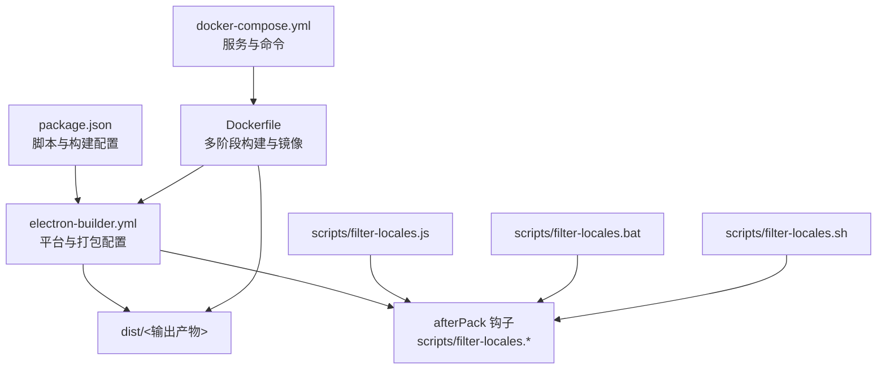
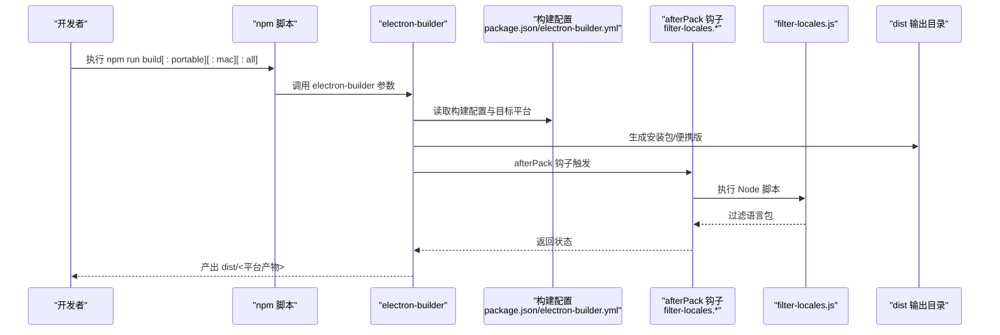
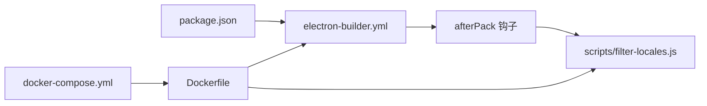

# 构建命令

<cite>
**本文引用的文件**
- [package.json](file://package.json)
- [electron-builder.yml](file://electron-builder.yml)
- [README.md](file://README.md)
- [scripts/filter-locales.js](file://scripts/filter-locales.js)
- [scripts/filter-locales.bat](file://scripts/filter-locales.bat)
- [scripts/filter-locales.sh](file://scripts/filter-locales.sh)
- [docker-compose.yml](file://docker-compose.yml)
- [Dockerfile](file://Dockerfile)
- [docs/LOCALES_OPTIMIZATION.md](file://docs/LOCALES_OPTIMIZATION.md)
- [docs/TROUBLESHOOTING.md](file://docs/TROUBLESHOOTING.md)
</cite>

## 目录
1. [简介](#简介)
2. [项目结构](#项目结构)
3. [核心组件](#核心组件)
4. [架构总览](#架构总览)
5. [详细组件分析](#详细组件分析)
6. [依赖分析](#依赖分析)
7. [性能考虑](#性能考虑)
8. [故障排查指南](#故障排查指南)
9. [结论](#结论)
10. [附录](#附录)

## 简介
本指南面向需要构建“OpenClaw 安装管理器”的工程师与运维人员，系统讲解以下构建命令的使用方法、执行流程、依赖检查与输出产物位置，并给出资源过滤（filter-locales）、版本号处理、签名配置等关键步骤说明，以及常见失败原因与解决方法。  
- npm run build：通用 Windows 安装包构建
- npm run build:portable：Windows 便携版构建
- npm run build:mac：macOS 安装包构建
- npm run build:all：全平台（Windows + macOS）构建

## 项目结构
本项目采用 Electron + electron-builder 进行桌面应用打包，构建配置集中在 package.json 与 electron-builder.yml 中；语言包过滤通过 afterPack 钩子脚本实现；Docker 构建通过 docker-compose.yml 与 Dockerfile 提供跨平台与 CI/CD 场景支持。

图示来源
- [package.json:1-75](file://package.json#L1-L75)
- [electron-builder.yml:1-53](file://electron-builder.yml#L1-L53)
- [scripts/filter-locales.js:1-66](file://scripts/filter-locales.js#L1-L66)
- [scripts/filter-locales.bat:1-4](file://scripts/filter-locales.bat#L1-L4)
- [scripts/filter-locales.sh:1-8](file://scripts/filter-locales.sh#L1-L8)
- [docker-compose.yml:1-105](file://docker-compose.yml#L1-L105)
- [Dockerfile:1-109](file://Dockerfile#L1-L109)

章节来源
- [package.json:1-75](file://package.json#L1-L75)
- [electron-builder.yml:1-53](file://electron-builder.yml#L1-L53)
- [README.md:117-215](file://README.md#L117-L215)

## 核心组件
- 构建脚本与目标
  - npm run build：Windows 安装包（NSIS）
  - npm run build:portable：Windows 便携版（portable）
  - npm run build:mac：macOS 安装包（dmg）
  - npm run build:all：全平台（Windows + macOS）
- 构建配置
  - 输出目录：dist
  - 包含文件：src/**/* 与 package.json
  - 额外资源：resources/skills
  - Windows：NSIS 安装包，支持自定义安装目录、桌面/开始菜单快捷方式
  - macOS：dmg 安装包，支持 x64 与 arm64
- 语言包优化
  - electronLanguages 限定 en-US 与 zh-CN
  - afterPack 钩子执行 filter-locales 脚本，删除多余 .pak 文件
- Docker 构建
  - 通过 docker-compose.yml 的服务封装构建流程
  - Dockerfile 多阶段构建，内置 Wine/NSIS/genisoimage，支持 amd64/arm64

章节来源
- [package.json:7-17](file://package.json#L7-L17)
- [package.json:18-60](file://package.json#L18-L60)
- [electron-builder.yml:3-53](file://electron-builder.yml#L3-L53)
- [docs/LOCALES_OPTIMIZATION.md:1-26](file://docs/LOCALES_OPTIMIZATION.md#L1-L26)

## 架构总览
下图展示从命令到产物的端到端流程，涵盖本地与 Docker 两种构建路径。

图示来源
- [package.json:7-17](file://package.json#L7-L17)
- [electron-builder.yml:51](file://electron-builder.yml#L51)
- [scripts/filter-locales.js:1-66](file://scripts/filter-locales.js#L1-L66)
- [scripts/filter-locales.bat:1-4](file://scripts/filter-locales.bat#L1-L4)
- [scripts/filter-locales.sh:1-8](file://scripts/filter-locales.sh#L1-L8)

## 详细组件分析

### npm run build（通用 Windows 安装包）
- 执行流程
  - 通过 npm run build 调用 electron-builder --win --x64
  - 读取 package.json 与 electron-builder.yml 的 win/mac/target 配置
  - 生成 NSIS 安装包与 win-unpacked 目录
- 依赖检查
  - 已执行 npm install
  - 构建图标 build/icon.ico 存在
- 输出产物
  - dist/OpenClaw安装管理器 Setup 1.0.0.exe（NSIS 安装程序）
  - dist/win-unpacked/（免安装版）
  - dist/builder-effective-config.yaml（实际生效配置）
- 关键步骤
  - 语言包过滤：afterPack 钩子执行 scripts/filter-locales.bat -> scripts/filter-locales.js
  - Electron 下载镜像：electronDownload.mirror 指向国内镜像
- 常见问题
  - 首次构建慢：首次下载 Electron 与 NSIS 工具
  - 下载超时：设置 ELECTRON_MIRROR 环境变量
  - 缺少图标：确保 build/icon.ico 存在
  - 杀毒软件误报：建议使用代码签名证书

章节来源
- [package.json:10](file://package.json#L10)
- [package.json:18-60](file://package.json#L18-L60)
- [electron-builder.yml:51](file://electron-builder.yml#L51)
- [scripts/filter-locales.bat:1-4](file://scripts/filter-locales.bat#L1-L4)
- [scripts/filter-locales.js:1-66](file://scripts/filter-locales.js#L1-L66)
- [README.md:149-215](file://README.md#L149-L215)

### npm run build:portable（Windows 便携版）
- 执行流程
  - 通过 npm run build:portable 调用 electron-builder --win portable
  - 生成 portable 目标产物（通常为 PortableApps 结构）
- 依赖检查
  - 同 build 命令
- 输出产物
  - dist/PortableApps/...（便携版目录结构）
- 关键步骤
  - 语言包过滤：afterPack 钩子同样生效
- 常见问题
  - 便携版缺少 zip 目标：可在 electron-builder.yml 中添加 zip 目标

章节来源
- [package.json:12](file://package.json#L12)
- [README.md:206-215](file://README.md#L206-L215)

### npm run build:mac（macOS 安装包）
- 执行流程
  - 通过 npm run build:mac 调用 electron-builder --mac
  - 生成 dmg 安装包，支持 x64 与 arm64
- 依赖检查
  - Docker 构建：Linux 环境下交叉编译 macOS，需安装 genisoimage
  - 本地构建：需满足 macOS 打包前置条件
- 输出产物
  - dist/*.dmg（macOS 安装包）
- 关键步骤
  - 语言包过滤：afterPack 钩子执行 scripts/filter-locales.sh
  - Docker 环境：USE_SYSTEM_GENISOIMAGE=true，使用系统 genisoimage
- 常见问题
  - 首次打开需右键 → 打开：未签名 dmg 的系统策略
  - 构建失败：确认 genisoimage 与签名配置

章节来源
- [package.json:13](file://package.json#L13)
- [electron-builder.yml:34-42](file://electron-builder.yml#L34-L42)
- [docker-compose.yml:26-37](file://docker-compose.yml#L26-L37)
- [Dockerfile:48](file://Dockerfile#L48)
- [scripts/filter-locales.sh:1-8](file://scripts/filter-locales.sh#L1-L8)

### npm run build:all（全平台构建）
- 执行流程
  - 通过 npm run build:all 调用 electron-builder --win --x64 --mac
  - 同时生成 Windows 安装包与 macOS dmg
- 依赖检查
  - Docker 构建：统一替换 afterPack 脚本为 .sh 并赋予可执行权限
- 输出产物
  - dist/OpenClaw安装管理器 Setup 1.0.0.exe（Windows）
  - dist/*.dmg（macOS）
- 关键步骤
  - Docker 内部自动处理 afterPack 脚本兼容性与权限
- 常见问题
  - Docker 环境变量：USE_SYSTEM_GENISOIMAGE=true
  - 多架构镜像：docker buildx build 支持 linux/amd64, linux/arm64

章节来源
- [package.json:16](file://package.json#L16)
- [docker-compose.yml:46-57](file://docker-compose.yml#L46-L57)
- [Dockerfile:96-100](file://Dockerfile#L96-L100)

### 资源过滤（filter-locales）与版本号处理
- 资源过滤（afterPack 钩子）
  - Windows：afterPack 指向 scripts/filter-locales.bat
  - macOS：afterPack 指向 scripts/filter-locales.sh
  - 脚本逻辑：定位 dist 下的语言包目录，仅保留 en-US.pak 与 zh-CN.pak
- 版本号处理
  - package.json 中 version 字段决定安装包版本（如 1.0.0）
  - 输出产物命名包含版本号（例如 Setup 1.0.0.exe）

章节来源
- [electron-builder.yml:51](file://electron-builder.yml#L51)
- [scripts/filter-locales.js:1-66](file://scripts/filter-locales.js#L1-L66)
- [package.json:3](file://package.json#L3)
- [README.md:164-177](file://README.md#L164-L177)

### 签名配置（概述）
- Windows：NSIS 安装包可配置图标与快捷方式，未在仓库中提供代码签名配置
- macOS：生成未签名 dmg，首次打开需右键 → 打开；若需签名可在 electron-builder.yml 中配置签名参数
- 建议
  - Windows：使用代码签名证书提升可信度
  - macOS：配置 sign 与 hardenedRuntime 等参数以满足系统策略

章节来源
- [electron-builder.yml:43-50](file://electron-builder.yml#L43-L50)
- [README.md:213](file://README.md#L213)
- [docker-compose.yml:39](file://docker-compose.yml#L39)

## 依赖分析
- 组件耦合
  - npm 脚本与 electron-builder 配置强耦合（package.json 与 electron-builder.yml）
  - afterPack 钩子与 Node 脚本弱耦合（scripts/filter-locales.*）
  - Docker 构建通过 docker-compose.yml 与 Dockerfile 解耦本地环境差异
- 外部依赖
  - Electron 与 electron-builder 由 package.json 管理
  - 国内镜像加速：ELECTRON_MIRROR、ELECTRON_BUILDER_BINARIES_MIRROR
- 潜在循环依赖
  - 无直接循环依赖；钩子脚本独立于主构建流程

图示来源
- [package.json:1-75](file://package.json#L1-L75)
- [electron-builder.yml:1-53](file://electron-builder.yml#L1-L53)
- [scripts/filter-locales.js:1-66](file://scripts/filter-locales.js#L1-L66)
- [docker-compose.yml:1-105](file://docker-compose.yml#L1-L105)
- [Dockerfile:1-109](file://Dockerfile#L1-L109)

章节来源
- [package.json:61-71](file://package.json#L61-L71)
- [Dockerfile:12-23](file://Dockerfile#L12-L23)

## 性能考虑
- 首次构建时间长：electron-builder 需要下载 Electron 与 NSIS 工具，建议使用国内镜像
- 语言包体积：通过 electronLanguages 与 afterPack 过滤显著减小安装包体积
- Docker 构建：避免本地环境差异，CI/CD 场景更稳定

章节来源
- [README.md:206-215](file://README.md#L206-L215)
- [docs/LOCALES_OPTIMIZATION.md:16-19](file://docs/LOCALES_OPTIMIZATION.md#L16-L19)
- [Dockerfile:16-23](file://Dockerfile#L16-L23)

## 故障排查指南
- 首次打包很慢
  - 原因：下载 Electron 与 NSIS 工具
  - 解决：使用国内镜像，或等待缓存复用
- 下载超时失败
  - 原因：网络受限
  - 解决：设置 ELECTRON_MIRROR 环境变量
- 缺少图标
  - 原因：build/icon.ico 不存在
  - 解决：准备符合尺寸的 PNG 图标
- 杀毒软件误报
  - 原因：打包产物被误判
  - 解决：使用代码签名证书
- 便携版缺少 zip 目标
  - 原因：未在配置中添加 zip
  - 解决：在 electron-builder.yml 中添加 zip 目标
- macOS 未签名 dmg 首次打开受限
  - 原因：系统安全策略
  - 解决：右键 → 打开；或配置签名参数
- 构建后语言包未过滤
  - 原因：afterPack 脚本未执行或权限不足
  - 解决：确认脚本路径与权限；Docker 环境已自动处理兼容性

章节来源
- [README.md:206-215](file://README.md#L206-L215)
- [electron-builder.yml:51](file://electron-builder.yml#L51)
- [scripts/filter-locales.js:1-66](file://scripts/filter-locales.js#L1-L66)
- [docker-compose.yml:34-37](file://docker-compose.yml#L34-L37)

## 结论
本指南梳理了四种构建命令的执行路径、依赖检查与输出产物，并重点说明了语言包过滤与 Docker 构建的要点。遵循本文流程与故障排查建议，可在本地或 CI/CD 环境稳定产出 Windows 与 macOS 安装包，并通过签名与镜像优化进一步提升体验与效率。

## 附录
- 命令对照表
  - npm run build：Windows 安装包
  - npm run build:portable：Windows 便携版
  - npm run build:mac：macOS 安装包
  - npm run build:all：全平台构建
- 输出产物位置
  - dist/ 目录下包含安装包与解包产物
- Docker 构建
  - docker compose build
  - docker compose run --rm build-app/build-mac/build-all/build-dev/shell

章节来源
- [README.md:117-141](file://README.md#L117-L141)
- [docker-compose.yml:11-105](file://docker-compose.yml#L11-L105)
- [Dockerfile:108](file://Dockerfile#L108)