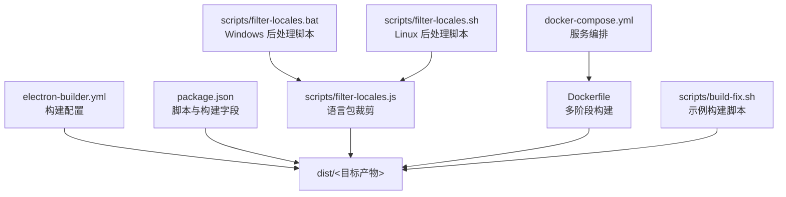
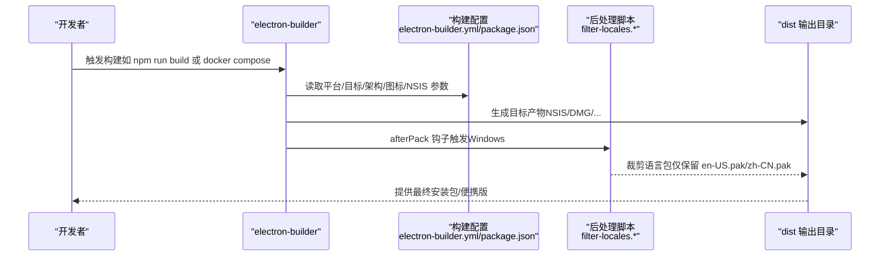
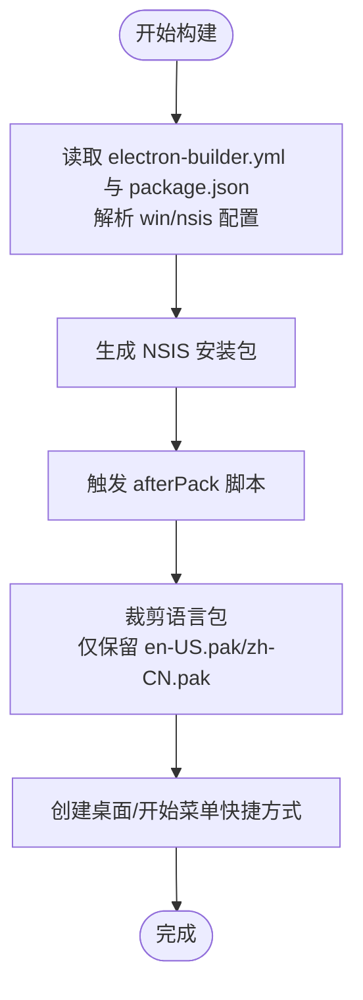
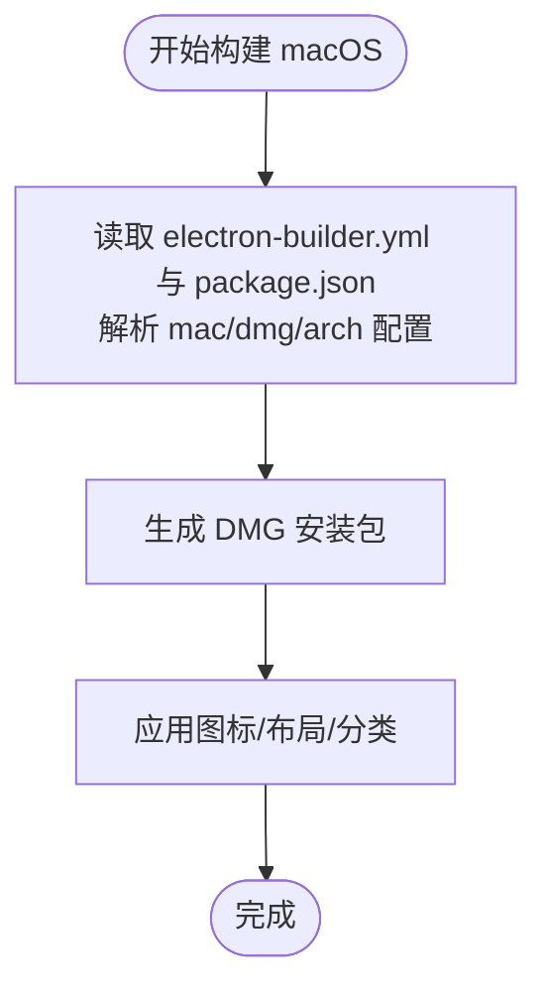
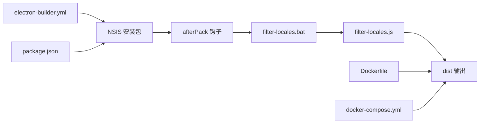

# 构建目标

<cite>
**本文引用的文件**
- [electron-builder.yml](file://electron-builder.yml)
- [package.json](file://package.json)
- [scripts/filter-locales.bat](file://scripts/filter-locales.bat)
- [scripts/filter-locales.js](file://scripts/filter-locales.js)
- [scripts/filter-locales.sh](file://scripts/filter-locales.sh)
- [scripts/build-fix.sh](file://scripts/build-fix.sh)
- [docker-compose.yml](file://docker-compose.yml)
- [Dockerfile](file://Dockerfile)
</cite>

## 目录
1. [简介](#简介)
2. [项目结构](#项目结构)
3. [核心组件](#核心组件)
4. [架构总览](#架构总览)
5. [详细组件分析](#详细组件分析)
6. [依赖关系分析](#依赖关系分析)
7. [性能考量](#性能考量)
8. [故障排查指南](#故障排查指南)
9. [结论](#结论)
10. [附录](#附录)

## 简介
本文件聚焦于本项目的“构建目标”，系统阐述三类发行形态及其配置要点、产物结构、安装体验差异，并给出优化建议与适用场景分析，帮助开发者基于目标平台与用户群体做出合理选择。

- Windows NSIS 安装包：提供传统安装体验，支持自定义安装目录、桌面/开始菜单快捷方式、安装后语言包裁剪等。
- 便携版（portable）：无需安装，直接运行，适合快速试用与临时使用。
- macOS DMG 安装包：支持多架构（x64/arm64），符合应用商店分类，便于分发与归档。

## 项目结构
围绕构建目标的关键文件与职责如下：
- 构建配置
  - electron-builder.yml：集中定义跨平台构建目标、目标架构、图标、NSIS 参数、macOS 分类等。
  - package.json：提供 npm 脚本与构建字段，补充 win/mac/nsis 等平台配置。
- 构建后处理
  - scripts/filter-locales.*：在打包完成后按需裁剪 Electron 语言包，减小体积。
- 构建执行与容器化
  - scripts/build-fix.sh：示例构建脚本，演示如何调用 electron-builder。
  - docker-compose.yml 与 Dockerfile：提供在 Linux 上交叉编译 Windows/全平台构建的容器化方案；macOS 构建通过系统 genisoimage 生成 DMG。

**图示来源**
- [electron-builder.yml](file://electron-builder.yml)
- [package.json](file://package.json)
- [scripts/filter-locales.js](file://scripts/filter-locales.js)
- [scripts/filter-locales.bat](file://scripts/filter-locales.bat)
- [scripts/filter-locales.sh](file://scripts/filter-locales.sh)
- [docker-compose.yml](file://docker-compose.yml)
- [Dockerfile](file://Dockerfile)
- [scripts/build-fix.sh](file://scripts/build-fix.sh)

**章节来源**
- [electron-builder.yml](file://electron-builder.yml)
- [package.json](file://package.json)
- [scripts/filter-locales.js](file://scripts/filter-locales.js)
- [scripts/filter-locales.bat](file://scripts/filter-locales.bat)
- [scripts/filter-locales.sh](file://scripts/filter-locales.sh)
- [docker-compose.yml](file://docker-compose.yml)
- [Dockerfile](file://Dockerfile)
- [scripts/build-fix.sh](file://scripts/build-fix.sh)

## 核心组件
- Windows NSIS 安装包
  - 目标与架构：nsis，x64。
  - 图标与资源：win.icon 指定安装包图标；win.extraResources 注入 gitbash 与 nodejs 安装包资源。
  - NSIS 行为：允许用户更改安装目录、创建桌面/开始菜单快捷方式、设置快捷方式名称、安装后语言包裁剪。
- 便携版（portable）
  - 当前仓库未显式声明 portable 目标；可通过 npm 脚本或 electron-builder 命令行传参启用。
  - 便携版通常免安装、可直接运行，适合临时使用与快速试用。
- macOS DMG 安装包
  - 目标与架构：dmg，x64/arm64。
  - 图标与分类：mac.icon 指定 DMG 图标；mac.category 指定应用商店分类为工具类。

**章节来源**
- [electron-builder.yml](file://electron-builder.yml)
- [package.json](file://package.json)

## 架构总览
下图展示从配置到产物的总体流程，包括容器化构建与语言包裁剪后处理。

**图示来源**
- [electron-builder.yml](file://electron-builder.yml)
- [package.json](file://package.json)
- [scripts/filter-locales.js](file://scripts/filter-locales.js)
- [scripts/filter-locales.bat](file://scripts/filter-locales.bat)
- [scripts/filter-locales.sh](file://scripts/filter-locales.sh)

## 详细组件分析

### Windows NSIS 安装包
- 配置要点
  - 目标与架构：nsis，x64。
  - 图标：win.icon 指定安装包图标。
  - 资源注入：win.extraResources 注入 gitbash 与 nodejs 安装包，便于集成安装。
  - NSIS 行为：允许更改安装目录、创建桌面/开始菜单快捷方式、设置快捷方式名称、安装后语言包裁剪。
- 产物结构
  - 生成 NSIS 安装包，包含应用二进制、资源与注入的辅助安装包（gitbash/nodejs）。
  - 安装后会在桌面/开始菜单创建快捷方式。
- 安装体验
  - 传统安装流程，适合首次安装与长期使用。
  - 用户可选择安装路径，便于与系统其他组件共存。
- 优化建议
  - 保持 NSIS oneClick 关闭，允许用户选择安装目录，提升可控性。
  - 使用 afterPack 脚本裁剪语言包，显著降低体积。
  - 保持快捷方式名称一致，便于识别。
- 适用场景
  - 面向普通用户的首次安装与长期使用。
  - 需要与系统集成（桌面/开始菜单）的场景。

**图示来源**
- [electron-builder.yml](file://electron-builder.yml)
- [package.json](file://package.json)
- [scripts/filter-locales.js](file://scripts/filter-locales.js)
- [scripts/filter-locales.bat](file://scripts/filter-locales.bat)

**章节来源**
- [electron-builder.yml](file://electron-builder.yml)
- [package.json](file://package.json)
- [scripts/filter-locales.js](file://scripts/filter-locales.js)
- [scripts/filter-locales.bat](file://scripts/filter-locales.bat)

### 便携版（portable）
- 配置要点
  - 当前仓库未在配置中显式声明 portable 目标；可通过 npm 脚本或命令行参数启用。
  - 便携版通常免安装、可直接运行，适合临时使用与快速试用。
- 产物结构
  - 便携版通常包含应用二进制与必要资源，解压即用。
- 安装体验
  - 无需管理员权限，可放置于任意目录运行。
  - 适合测试、演示与临时使用。
- 优化建议
  - 保持便携版体积适中，避免冗余资源。
  - 提供清晰的运行说明与目录结构指引。
- 适用场景
  - 测试、演示、临时使用、无管理员权限环境。

**章节来源**
- [package.json](file://package.json)

### macOS DMG 安装包
- 配置要点
  - 目标与架构：dmg，x64/arm64。
  - 图标：mac.icon 指定 DMG 图标。
  - 分类：mac.category 指定应用商店分类为工具类。
- 产物结构
  - 生成 DMG 安装镜像，包含应用包与可选的背景图、布局信息。
- 安装体验
  - 双击打开 DMG，将应用拖拽至“应用程序”即可使用。
  - 支持多架构，兼顾 Intel 与 Apple Silicon 用户。
- 优化建议
  - 使用系统 genisoimage 生成 DMG，确保兼容性。
  - 保持图标与分类符合应用商店规范，便于分发。
- 适用场景
  - 面向 macOS 用户的正式发布与分发。

**图示来源**
- [electron-builder.yml](file://electron-builder.yml)
- [package.json](file://package.json)
- [docker-compose.yml](file://docker-compose.yml)
- [Dockerfile](file://Dockerfile)

**章节来源**
- [electron-builder.yml](file://electron-builder.yml)
- [package.json](file://package.json)
- [docker-compose.yml](file://docker-compose.yml)
- [Dockerfile](file://Dockerfile)

## 依赖关系分析
- 配置耦合
  - electron-builder.yml 与 package.json 的配置相互补充，前者侧重平台特定目标，后者提供 npm 脚本与通用构建字段。
- 后处理链路
  - Windows 平台通过 nsis.afterPack 钩子调用 scripts/filter-locales.bat，再由该脚本执行 scripts/filter-locales.js，实现语言包裁剪。
  - Linux/macOS 平台通过 scripts/filter-locales.sh 调用同一逻辑，保证跨平台一致性。
- 容器化构建
  - Dockerfile 与 docker-compose.yml 提供在 Linux 上交叉编译 Windows/全平台构建的环境，macOS 构建使用系统 genisoimage。

**图示来源**
- [electron-builder.yml](file://electron-builder.yml)
- [package.json](file://package.json)
- [scripts/filter-locales.bat](file://scripts/filter-locales.bat)
- [scripts/filter-locales.js](file://scripts/filter-locales.js)
- [scripts/filter-locales.sh](file://scripts/filter-locales.sh)
- [Dockerfile](file://Dockerfile)
- [docker-compose.yml](file://docker-compose.yml)

**章节来源**
- [electron-builder.yml](file://electron-builder.yml)
- [package.json](file://package.json)
- [scripts/filter-locales.js](file://scripts/filter-locales.js)
- [scripts/filter-locales.bat](file://scripts/filter-locales.bat)
- [scripts/filter-locales.sh](file://scripts/filter-locales.sh)
- [docker-compose.yml](file://docker-compose.yml)
- [Dockerfile](file://Dockerfile)

## 性能考量
- 体积优化
  - 通过 afterPack 阶段裁剪语言包，减少安装包体积，缩短下载与安装时间。
- 构建效率
  - 容器化构建可在 CI/CD 中复用缓存层，加速依赖安装与构建过程。
- 并行与缓存
  - Docker 多阶段构建与命名卷（node_modules）可减少重复安装与网络请求。

## 故障排查指南
- 构建失败
  - 检查 electron-builder.yml 与 package.json 的配置一致性，确认目标与架构设置正确。
  - 使用 scripts/build-fix.sh 示例脚本验证本地构建流程。
- 语言包问题
  - 确认 afterPack 脚本在 Windows 平台被正确调用；Linux/macOS 平台请确认 scripts/filter-locales.sh 可执行且与配置匹配。
  - 若裁剪后出现语言异常，检查 scripts/filter-locales.js 是否正确识别语言包目录。
- 容器化构建
  - 确认 docker-compose.yml 中 sed 命令已将 .bat 替换为 .sh，且 scripts/filter-locales.sh 可执行。
  - macOS 构建时确保系统已安装 genisoimage，或设置 USE_SYSTEM_GENISOIMAGE=true。

**章节来源**
- [scripts/build-fix.sh](file://scripts/build-fix.sh)
- [scripts/filter-locales.js](file://scripts/filter-locales.js)
- [scripts/filter-locales.bat](file://scripts/filter-locales.bat)
- [scripts/filter-locales.sh](file://scripts/filter-locales.sh)
- [docker-compose.yml](file://docker-compose.yml)
- [Dockerfile](file://Dockerfile)

## 结论
- Windows NSIS 安装包适合首次安装与长期使用，结合语言包裁剪与快捷方式创建，可获得良好的用户体验。
- 便携版适合临时使用与快速试用，建议保持体积与运行说明简洁清晰。
- macOS DMG 安装包支持多架构，配合系统 genisoimage 与应用商店分类，便于发布与分发。
- 建议在 CI/CD 中采用容器化构建，统一环境并提升效率；同时在安装包生成后执行语言包裁剪，优化体积与加载速度。

## 附录
- 常用 npm 脚本与命令
  - npm run build：构建 Windows x64 安装包。
  - npm run build:portable：构建便携版（需确保配置或命令行参数启用）。
  - npm run build:mac / build:mac:x64 / build:mac:arm64：分别构建 macOS 全架构或指定架构。
  - npm run build:all：同时构建 Windows 与 macOS。
- 容器化构建
  - docker compose run --rm build-app：在容器内执行完整 Windows 构建。
  - docker compose run --rm build-mac：在 Linux 上交叉编译 macOS DMG。
  - docker compose run --rm build-all：同时构建 Windows 与 macOS。

**章节来源**
- [package.json](file://package.json)
- [docker-compose.yml](file://docker-compose.yml)
- [Dockerfile](file://Dockerfile)