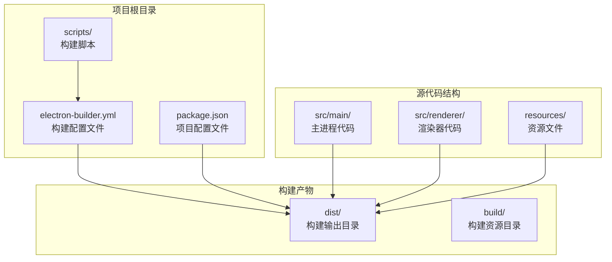
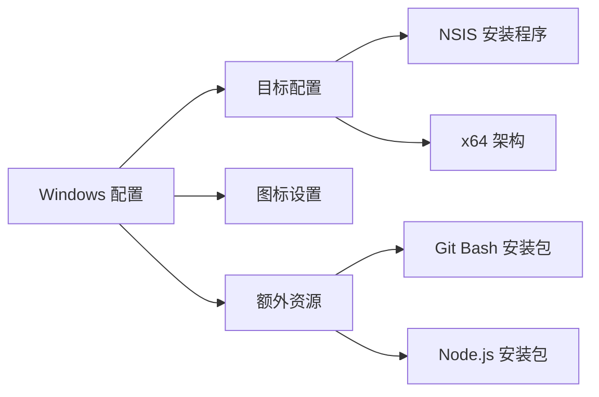
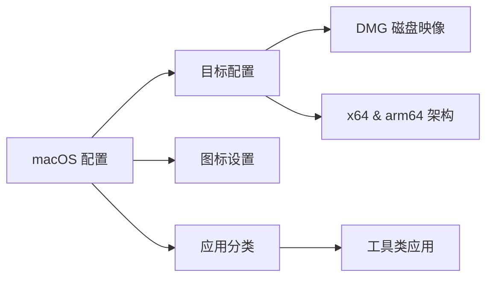
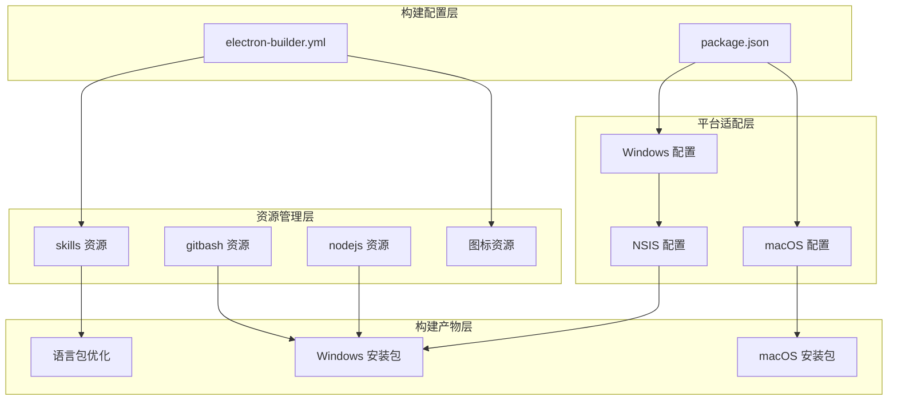
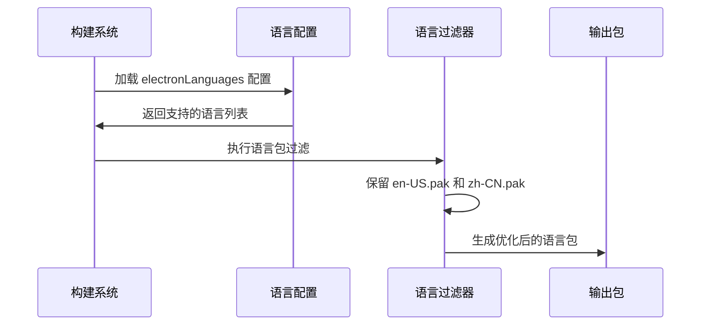
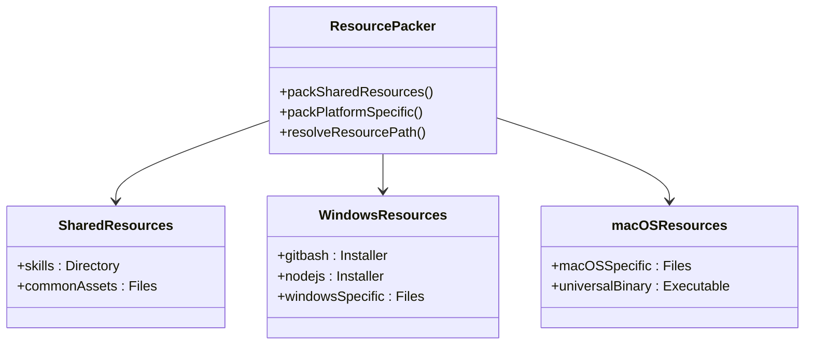
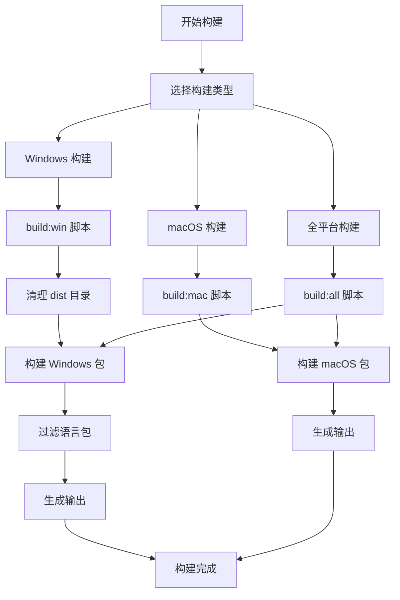
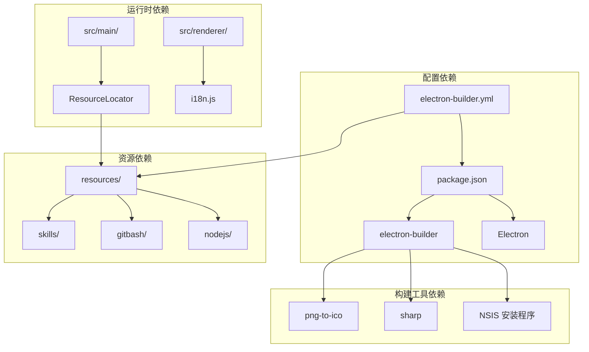

# 构建配置

<cite>
**本文档引用的文件**
- [electron-builder.yml](file://electron-builder.yml)
- [package.json](file://package.json)
- [scripts/filter-locales.bat](file://scripts/filter-locales.bat)
- [scripts/filter-locales.js](file://scripts/filter-locales.js)
- [scripts/build-fix.sh](file://scripts/build-fix.sh)
- [src/main/main.js](file://src/main/main.js)
- [src/main/utils/resource-locator.js](file://src/main/utils/resource-locator.js)
- [src/renderer/js/utils/i18n.js](file://src/renderer/js/utils/i18n.js)
</cite>

## 目录
1. [简介](#简介)
2. [项目结构](#项目结构)
3. [核心组件](#核心组件)
4. [架构概览](#架构概览)
5. [详细组件分析](#详细组件分析)
6. [依赖关系分析](#依赖关系分析)
7. [性能考虑](#性能考虑)
8. [故障排除指南](#故障排除指南)
9. [结论](#结论)

## 简介

本文档详细解析了 OpenClaw 安装管理器项目的构建配置系统，重点分析了 electron-builder.yml 配置文件的完整结构和各项参数含义。该项目是一个基于 Electron 的桌面应用程序，提供了 Windows 和 macOS 平台的安装包构建功能，支持多语言本地化和丰富的资源打包机制。

## 项目结构

OpenClaw 项目采用标准的 Electron 应用程序结构，包含主进程、渲染器进程、构建配置和资源管理等核心组件。

**图表来源**
- [electron-builder.yml:1-53](file://electron-builder.yml#L1-L53)
- [package.json:1-75](file://package.json#L1-L75)

**章节来源**
- [electron-builder.yml:1-53](file://electron-builder.yml#L1-L53)
- [package.json:1-75](file://package.json#L1-L75)

## 核心组件

### 基础配置参数

项目的基础构建配置通过 electron-builder.yml 文件定义，包含以下关键参数：

#### 应用标识和产品信息
- **appId**: `com.openclaw.installer` - 应用程序的唯一标识符，用于签名和系统识别
- **productName**: `OpenClaw安装管理器` - 应用程序显示名称

#### 目录结构配置
- **directories.output**: `dist` - 构建输出目录，存放最终的安装包
- **directories.buildResources**: `build` - 构建时使用的资源目录

#### 文件包含规则
- **files**: 包含 `src/**/*` 和 `package.json`，确保主进程代码和依赖正确打包

#### 共享资源配置
- **extraResources**: 将 `resources/skills` 目录打包到应用程序中，供运行时使用

**章节来源**
- [electron-builder.yml:1-18](file://electron-builder.yml#L1-L18)
- [package.json:18-34](file://package.json#L18-L34)

### 平台特定配置

#### Windows 平台配置

Windows 平台使用 NSIS 安装程序目标，支持 x64 架构：

**图表来源**
- [electron-builder.yml:19-32](file://electron-builder.yml#L19-L32)

#### macOS 平台配置

macOS 平台使用 DMG 磁盘映像目标，支持 x64 和 arm64 架构：

**图表来源**
- [electron-builder.yml:33-42](file://electron-builder.yml#L33-L42)

**章节来源**
- [electron-builder.yml:19-42](file://electron-builder.yml#L19-L42)

## 架构概览

构建系统采用分层架构设计，实现了跨平台构建、资源管理和本地化支持的有机结合。

**图表来源**
- [electron-builder.yml:1-53](file://electron-builder.yml#L1-L53)
- [package.json:18-59](file://package.json#L18-L59)

## 详细组件分析

### electronLanguages 语言配置

项目实现了双语支持，通过 `electronLanguages` 参数指定支持的语言包：

**图表来源**
- [electron-builder.yml:15-17](file://electron-builder.yml#L15-L17)
- [scripts/filter-locales.js:4-66](file://scripts/filter-locales.js#L4-L66)

语言配置特点：
- 支持 `en-US` 和 `zh-CN` 两种语言
- 通过 `afterPack` 钩子在构建完成后自动过滤语言包
- 使用 `scripts/filter-locales.js` 脚本进行精确的语言包管理

**章节来源**
- [electron-builder.yml:15-17](file://electron-builder.yml#L15-L17)
- [scripts/filter-locales.js:4-66](file://scripts/filter-locales.js#L4-L66)

### extraResources 资源打包机制

资源打包系统采用分层设计，支持平台特定和共享资源的灵活管理：

**图表来源**
- [electron-builder.yml:11-17](file://electron-builder.yml#L11-L17)
- [electron-builder.yml:27-31](file://electron-builder.yml#L27-L31)

资源打包策略：
- **共享资源**: `resources/skills` 目录在所有平台上都可用
- **平台特定资源**: Windows 平台额外包含 Git Bash 和 Node.js 安装包
- **动态路径解析**: 运行时通过 ResourceLocator 工具解析资源路径

**章节来源**
- [electron-builder.yml:11-31](file://electron-builder.yml#L11-L31)
- [src/main/utils/resource-locator.js:10-146](file://src/main/utils/resource-locator.js#L10-L146)

### 构建流程和脚本

构建系统提供了多种构建方式和自动化脚本：

**图表来源**
- [package.json:7-16](file://package.json#L7-L16)
- [scripts/build-fix.sh:1-19](file://scripts/build-fix.sh#L1-L19)

**章节来源**
- [package.json:7-16](file://package.json#L7-L16)
- [scripts/build-fix.sh:1-19](file://scripts/build-fix.sh#L1-L19)

## 依赖关系分析

构建系统的依赖关系体现了模块化的设计理念：

**图表来源**
- [package.json:65-71](file://package.json#L65-L71)
- [src/main/utils/resource-locator.js:1-5](file://src/main/utils/resource-locator.js#L1-L5)

**章节来源**
- [package.json:65-71](file://package.json#L65-L71)
- [src/main/utils/resource-locator.js:1-5](file://src/main/utils/resource-locator.js#L1-L5)

## 性能考虑

### 语言包优化策略

项目采用了智能的语言包优化机制，显著减少了安装包大小：

- **初始语言包数量**: Electron 默认包含大量语言包（约 100+ 个 .pak 文件）
- **优化后数量**: 仅保留 `en-US.pak` 和 `zh-CN.pak` 两个核心语言包
- **节省空间**: 大约减少 80% 的语言包体积
- **自动化处理**: 通过 `afterPack` 钩子在构建完成后自动执行优化

### 资源加载优化

资源管理系统通过以下方式优化运行时性能：

- **路径缓存**: ResourceLocator 工具缓存已解析的资源路径
- **多路径查找**: 支持开发和生产环境的不同资源路径
- **异步加载**: 资源文件按需加载，避免启动时的性能开销

## 故障排除指南

### 常见构建问题及解决方案

#### 1. 语言包过滤失败
**问题症状**: 构建过程中出现语言包过滤错误
**解决方法**: 
- 检查 `scripts/filter-locales.js` 脚本的路径解析逻辑
- 确认 `dist` 目录结构符合预期
- 验证 `.pak` 文件的存在性和权限

#### 2. 资源文件找不到
**问题症状**: 应用程序启动时报错，提示资源文件缺失
**解决方法**:
- 检查 `ResourceLocator` 类的路径解析逻辑
- 验证 `resources/` 目录结构和文件权限
- 确认 `extraResources` 配置正确

#### 3. 图标文件格式问题
**问题症状**: 应用程序图标显示异常或不显示
**解决方法**:
- Windows 平台使用 `.ico` 格式图标文件
- macOS 平台使用 `.png` 格式图标文件
- 确保图标文件尺寸符合平台要求（Windows: 256x256, macOS: 1024x1024）

#### 4. 平台特定构建失败
**问题症状**: 在某个特定平台构建时出现错误
**解决方法**:
- 检查对应平台的配置参数
- 验证平台特定的资源文件存在性
- 确认平台工具链的正确安装

**章节来源**
- [scripts/filter-locales.js:33-36](file://scripts/filter-locales.js#L33-L36)
- [src/main/utils/resource-locator.js:14-34](file://src/main/utils/resource-locator.js#L14-L34)

## 结论

OpenClaw 安装管理器的构建配置系统展现了现代 Electron 应用程序的最佳实践。通过精心设计的配置文件、智能的资源管理机制和完善的本地化支持，该系统实现了跨平台构建的一致性和高效性。

### 主要优势

1. **模块化设计**: 清晰的配置分离，便于维护和扩展
2. **智能优化**: 自动化的语言包过滤和资源管理
3. **跨平台支持**: 统一的配置语法，针对不同平台的特定优化
4. **开发友好**: 提供多种构建脚本，适应不同的开发需求

### 最佳实践建议

1. **配置维护**: 定期审查和更新构建配置，确保与项目需求保持同步
2. **资源管理**: 建立标准化的资源命名和组织规范
3. **测试验证**: 在多平台环境下进行全面的构建测试
4. **文档更新**: 保持构建文档与实际配置的一致性

该构建配置系统为类似 Electron 应用程序的开发提供了优秀的参考模板，特别是在跨平台构建、资源管理和本地化支持方面展现了成熟的解决方案。