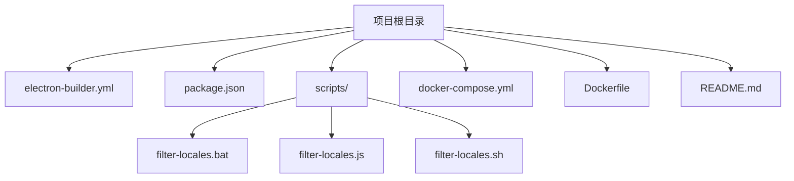
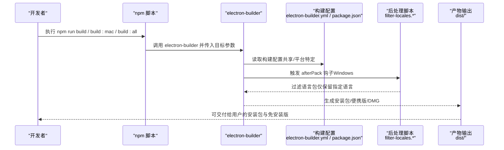
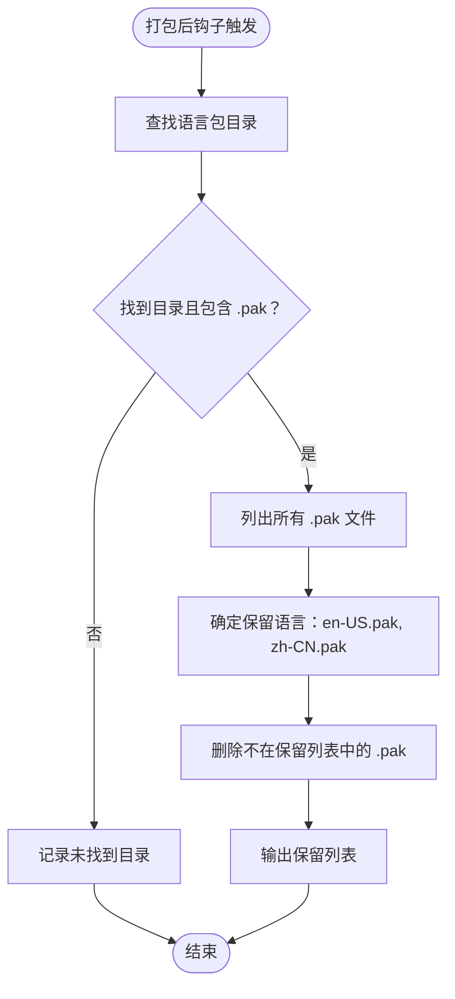
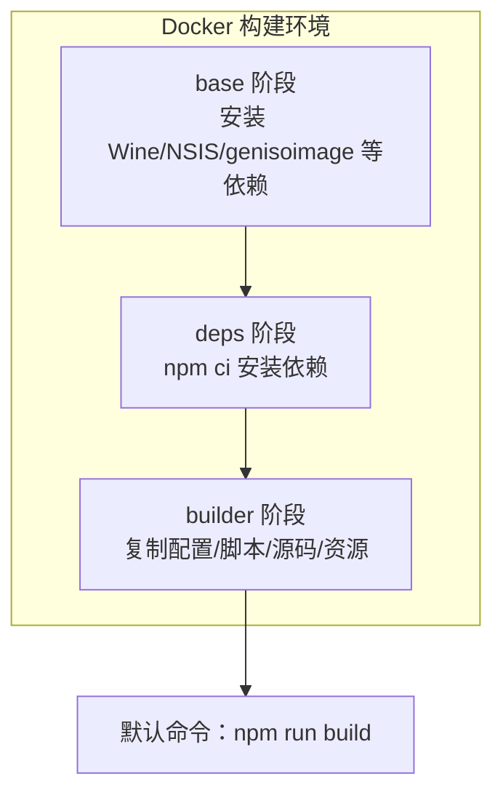
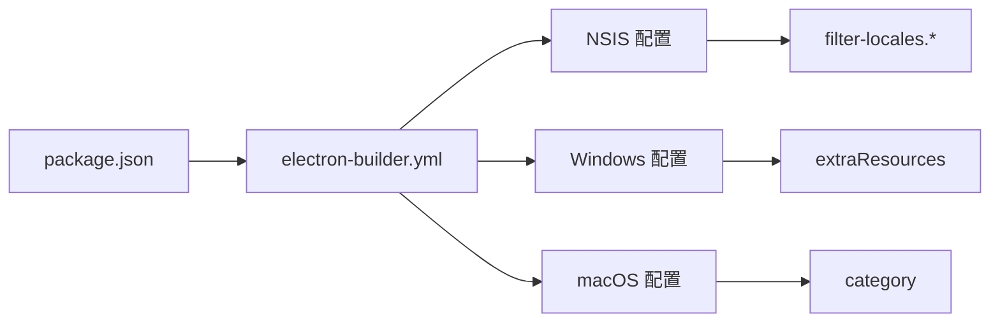

# 生产构建

<cite>
**本文引用的文件**
- [electron-builder.yml](file://electron-builder.yml)
- [package.json](file://package.json)
- [scripts/filter-locales.bat](file://scripts/filter-locales.bat)
- [scripts/filter-locales.js](file://scripts/filter-locales.js)
- [scripts/filter-locales.sh](file://scripts/filter-locales.sh)
- [docker-compose.yml](file://docker-compose.yml)
- [Dockerfile](file://Dockerfile)
- [README.md](file://README.md)
- [docs/TROUBLESHOOTING.md](file://docs/TROUBLESHOOTING.md)
</cite>

## 目录
1. [简介](#简介)
2. [项目结构](#项目结构)
3. [核心组件](#核心组件)
4. [架构总览](#架构总览)
5. [详细组件分析](#详细组件分析)
6. [依赖关系分析](#依赖关系分析)
7. [性能考虑](#性能考虑)
8. [故障排查指南](#故障排查指南)
9. [结论](#结论)
10. [附录](#附录)

## 简介
本文件面向生产构建场景，系统性讲解如何使用 electron-builder 对本项目进行打包与发布。重点覆盖：
- electron-builder.yml 配置项详解
- 不同构建目标（Windows 安装包、便携版、macOS 安装包）的特点与差异
- 构建命令参考与最佳实践
- 构建产物结构与用途说明
- 构建配置细节（图标、快捷方式、语言等）
- 常见问题排查与性能优化建议

## 项目结构
本项目的构建相关文件主要集中在根目录，核心包括：
- electron-builder.yml：构建配置（YAML）
- package.json：构建脚本与构建配置（JSON）
- scripts/：构建后处理脚本（过滤语言包）
- docker-compose.yml / Dockerfile：Docker 构建环境与命令封装
- README.md：构建与发布说明

图表来源
- [electron-builder.yml](file://electron-builder.yml)
- [package.json](file://package.json)
- [scripts/filter-locales.js](file://scripts/filter-locales.js)
- [docker-compose.yml](file://docker-compose.yml)
- [Dockerfile](file://Dockerfile)
- [README.md](file://README.md)

章节来源
- [README.md:117-176](file://README.md#L117-L176)

## 核心组件
- 构建配置文件：electron-builder.yml 与 package.json 的 build 字段共同构成最终生效的构建配置
- 构建脚本：package.json 中的 scripts 定义了多种构建目标
- 后处理脚本：filter-locales.* 用于在打包后精简语言包，减小体积
- Docker 构建：docker-compose.yml 与 Dockerfile 提供跨平台、稳定的构建环境

章节来源
- [electron-builder.yml:1-53](file://electron-builder.yml#L1-L53)
- [package.json:7-16](file://package.json#L7-L16)
- [scripts/filter-locales.js:1-66](file://scripts/filter-locales.js#L1-L66)
- [docker-compose.yml:1-105](file://docker-compose.yml#L1-L105)
- [Dockerfile:1-109](file://Dockerfile#L1-L109)

## 架构总览
下图展示从命令到产物的端到端流程，涵盖本地构建与 Docker 构建两条路径，并标注关键配置点与后处理步骤。

图表来源
- [package.json:10-16](file://package.json#L10-L16)
- [electron-builder.yml:43-51](file://electron-builder.yml#L43-L51)
- [scripts/filter-locales.js:1-66](file://scripts/filter-locales.js#L1-L66)
- [README.md:164-176](file://README.md#L164-L176)

## 详细组件分析

### electron-builder.yml 配置详解
该文件定义了应用元数据、输出目录、打包文件列表、平台特定配置以及 NSIS 安装器选项等。

- 应用元数据与目录
  - appId：应用唯一标识
  - productName：安装程序中显示的应用名
  - directories.output：构建产物输出目录
  - directories.buildResources：构建期资源目录
  - files：打包包含的文件模式
  - extraResources：额外资源复制规则（例如将 resources/skills 复制到应用资源根目录）

- 语言与下载镜像
  - electronLanguages：构建时保留的语言包集合
  - electronDownload.mirror：Electron 预编译包镜像地址

- Windows 平台配置
  - win.target：目标类型与架构（NSIS + x64）
  - win.icon：Windows 应用图标
  - win.extraResources：Windows 专属资源（resources/gitbash、resources/nodejs）

- macOS 平台配置
  - mac.target：目标类型与架构（DMG + x64/arm64）
  - mac.icon：macOS 应用图标
  - mac.category：应用分类

- NSIS 安装器配置
  - oneClick：是否一键安装（false 表示显示安装向导）
  - allowToChangeInstallationDirectory：允许用户选择安装目录
  - installerIcon/uninstallerIcon：安装/卸载程序图标
  - createDesktopShortcut/createStartMenuShortcut：创建桌面/开始菜单快捷方式
  - shortcutName：快捷方式名称
  - afterPack：打包后钩子脚本（Windows）
  - electronDownload.mirror：镜像地址

章节来源
- [electron-builder.yml:1-53](file://electron-builder.yml#L1-L53)

### package.json 构建脚本与配置
- scripts
  - build：构建 Windows 安装包（x64）
  - build:dir：构建为目录（便于开发调试）
  - build:portable：构建 Windows 便携版
  - build:mac / build:mac:x64 / build:mac:arm64：构建 macOS 安装包（DMG）
  - build:all：同时构建 Windows 与 macOS
- build 字段
  - appId/productName/directories/files/extraResources：与 electron-builder.yml 的共享配置
  - win/mac/nsis：平台特定配置
  - electronDownload：镜像配置

章节来源
- [package.json:7-16](file://package.json#L7-L16)
- [package.json:18-59](file://package.json#L18-L59)

### 后处理脚本：语言包过滤
- Windows 平台通过 nsis.afterPack 指定打包后脚本
- 脚本逻辑：定位 dist 中的语言包目录，删除除指定语言外的 .pak 文件，仅保留所需语言包
- 跨平台兼容：Docker 构建时将 .bat 替换为 .sh 并赋予可执行权限

图表来源
- [scripts/filter-locales.js:7-63](file://scripts/filter-locales.js#L7-L63)
- [scripts/filter-locales.bat:1-4](file://scripts/filter-locales.bat#L1-L4)
- [scripts/filter-locales.sh:1-8](file://scripts/filter-locales.sh#L1-L8)

章节来源
- [scripts/filter-locales.js:1-66](file://scripts/filter-locales.js#L1-L66)
- [scripts/filter-locales.bat:1-4](file://scripts/filter-locales.bat#L1-L4)
- [scripts/filter-locales.sh:1-8](file://scripts/filter-locales.sh#L1-L8)
- [docker-compose.yml:32-37](file://docker-compose.yml#L32-L37)
- [docker-compose.yml:52-57](file://docker-compose.yml#L52-L57)

### Docker 构建环境
- 多阶段构建：base（系统依赖）、deps（安装依赖）、builder（复制源码与配置）
- 环境变量：设置 npm/Electron 镜像、避免交互式确认、启用系统 genisoimage
- 服务定义：
  - build-app：构建 Windows 安装包
  - build-mac：在 Linux 中交叉编译 macOS DMG（未签名）
  - build-all：同时构建 Windows 与 macOS
  - build-dev：开发模式，挂载源码并自动安装依赖
  - shell：交互式 Shell 调试

图表来源
- [Dockerfile:10-109](file://Dockerfile#L10-L109)
- [docker-compose.yml:11-18](file://docker-compose.yml#L11-L18)
- [docker-compose.yml:26-37](file://docker-compose.yml#L26-L37)
- [docker-compose.yml:46-57](file://docker-compose.yml#L46-L57)
- [docker-compose.yml:66-83](file://docker-compose.yml#L66-L83)
- [docker-compose.yml:90-99](file://docker-compose.yml#L90-L99)

章节来源
- [Dockerfile:1-109](file://Dockerfile#L1-L109)
- [docker-compose.yml:1-105](file://docker-compose.yml#L1-L105)

### 构建目标与特点
- Windows 安装包（NSIS）
  - 通过 win.target 指定 nsis + x64
  - 支持自定义安装路径、创建桌面/开始菜单快捷方式
  - 打包后通过 afterPack 过滤语言包，减小体积
- 便携版（zip）
  - 通过 build:portable 脚本触发 portable 目标
  - 产物为免安装版目录，可直接运行主程序
- macOS 安装包（DMG）
  - 通过 mac.target 指定 dmg + x64/arm64
  - 产物为 .dmg，用户首次打开需右键“打开”（未签名）

章节来源
- [electron-builder.yml:20-31](file://electron-builder.yml#L20-L31)
- [electron-builder.yml:33-41](file://electron-builder.yml#L33-L41)
- [package.json:12-16](file://package.json#L12-L16)
- [README.md:164-176](file://README.md#L164-L176)

### 构建命令参考
- 本地构建
  - npm run build：Windows 安装包（x64）
  - npm run build:portable：Windows 便携版
  - npm run build:mac / build:mac:x64 / build:mac:arm64：macOS 安装包
  - npm run build:all：全平台（Windows + macOS）
- Docker 构建（推荐）
  - docker compose build：构建镜像
  - docker compose run --rm build-app：Windows 安装包
  - docker compose run --rm build-mac：macOS 安装包
  - docker compose run --rm build-all：全平台构建
  - docker compose run --rm build-dev：开发模式（挂载源码）
  - docker compose run --rm shell：进入容器调试

章节来源
- [package.json:10-16](file://package.json#L10-L16)
- [README.md:117-141](file://README.md#L117-L141)
- [docker-compose.yml:11-18](file://docker-compose.yml#L11-L18)
- [docker-compose.yml:26-37](file://docker-compose.yml#L26-L37)
- [docker-compose.yml:46-57](file://docker-compose.yml#L46-L57)
- [docker-compose.yml:66-83](file://docker-compose.yml#L66-L83)
- [docker-compose.yml:90-99](file://docker-compose.yml#L90-L99)

### 构建产物结构与用途
- dist/ 目录
  - Windows 安装包：OpenClaw安装管理器 Setup 1.0.0.exe（交由用户安装）
  - 免安装版：win-unpacked/（解压即用，可直接运行主程序）
  - 有效配置：builder-effective-config.yaml（实际生效的构建配置快照）
- macOS 产物
  - DMG 文件（未签名，首次打开需右键“打开”）

章节来源
- [README.md:164-176](file://README.md#L164-L176)

### 构建配置细节
- 图标设置
  - Windows：win.icon 指定 ICO 图标
  - macOS：mac.icon 指定 PNG 图标
- 快捷方式
  - Windows：nsis.createDesktopShortcut、nsis.createStartMenuShortcut、nsis.shortcutName
- 语言配置
  - electronLanguages：构建时保留的语言包集合
  - nsis：通过语言包过滤脚本进一步精简
- 资源复制
  - extraResources：将 resources/skills 复制到应用资源根目录
  - Windows 专属资源：resources/gitbash、resources/nodejs

章节来源
- [electron-builder.yml:15-17](file://electron-builder.yml#L15-L17)
- [electron-builder.yml:25](file://electron-builder.yml#L25)
- [electron-builder.yml:40](file://electron-builder.yml#L40)
- [electron-builder.yml:27-31](file://electron-builder.yml#L27-L31)
- [electron-builder.yml:11-13](file://electron-builder.yml#L11-L13)

## 依赖关系分析
- 配置耦合
  - electron-builder.yml 与 package.json 的 build 字段共同决定最终构建行为
  - nsis.afterPack 与 scripts/filter-locales.* 强耦合，确保语言包精简
- 平台差异
  - Windows 与 macOS 的目标类型、架构、图标格式不同
- Docker 适配
  - docker-compose.yml 在 macOS 构建前替换 .bat 为 .sh，并赋予可执行权限

图表来源
- [package.json:18-59](file://package.json#L18-L59)
- [electron-builder.yml:19-51](file://electron-builder.yml#L19-L51)
- [scripts/filter-locales.js:1-66](file://scripts/filter-locales.js#L1-L66)

章节来源
- [package.json:18-59](file://package.json#L18-L59)
- [electron-builder.yml:19-51](file://electron-builder.yml#L19-L51)
- [scripts/filter-locales.js:1-66](file://scripts/filter-locales.js#L1-L66)

## 性能考虑
- 镜像加速
  - electronDownload.mirror 指向国内镜像，显著降低首次构建下载耗时
- 语言包精简
  - 通过 afterPack + filter-locales.* 仅保留 en-US.pak 与 zh-CN.pak，减少体积
- Docker 缓存
  - 多阶段构建与命名卷（node_modules）提升重复构建效率
- 平台交叉编译
  - 在 Linux 中构建 Windows（Wine）与 macOS（genisoimage），避免本地环境差异

章节来源
- [electron-builder.yml:52-53](file://electron-builder.yml#L52-L53)
- [scripts/filter-locales.js:46-60](file://scripts/filter-locales.js#L46-L60)
- [Dockerfile:16-23](file://Dockerfile#L16-L23)
- [Dockerfile:77-85](file://Dockerfile#L77-L85)
- [docker-compose.yml:102-105](file://docker-compose.yml#L102-L105)

## 故障排查指南
- 首次打包缓慢
  - electron-builder 首次会下载 Electron 预编译包与 NSIS 工具，后续复用缓存
- 下载超时
  - 设置镜像：通过环境变量或脚本参数指定镜像源
- 缺少图标
  - 确保 build/icon.png（macOS）与 build/icon.ico（Windows）存在
- 杀毒软件误报
  - Electron 打包的 exe 可能触发误报，建议添加白名单或使用代码签名
- 生成便携版
  - 使用 npm run build:portable；若需在 YAML 中直接声明，可在 win.target 中添加 zip 目标
- Docker 构建
  - macOS 生成的是未签名 .dmg，首次打开需右键“打开”
  - 多架构镜像构建：docker buildx build --platform linux/amd64,linux/arm64 -t openclaw-builder .

章节来源
- [README.md:206-215](file://README.md#L206-L215)
- [README.md:216-248](file://README.md#L216-L248)
- [package.json:12](file://package.json#L12)
- [docker-compose.yml:22-24](file://docker-compose.yml#L22-L24)
- [docker-compose.yml:38-39](file://docker-compose.yml#L38-L39)
- [docker-compose.yml:58-59](file://docker-compose.yml#L58-L59)

## 结论
本项目采用 electron-builder 作为统一的打包工具，结合 YAML 与 JSON 配置实现跨平台构建。通过镜像加速、语言包精简与 Docker 交叉编译，既保证了构建稳定性，也兼顾了性能与可维护性。建议在生产环境中优先使用 Docker 构建，以规避本地环境差异带来的不确定性。

## 附录
- 相关文档与指南
  - 故障排查指南：[docs/TROUBLESHOOTING.md](file://docs/TROUBLESHOOTING.md)
  - 依赖检测问题修复指南：[docs/INSTALLATION_FIX_GUIDE.md](file://docs/INSTALLATION_FIX_GUIDE.md)