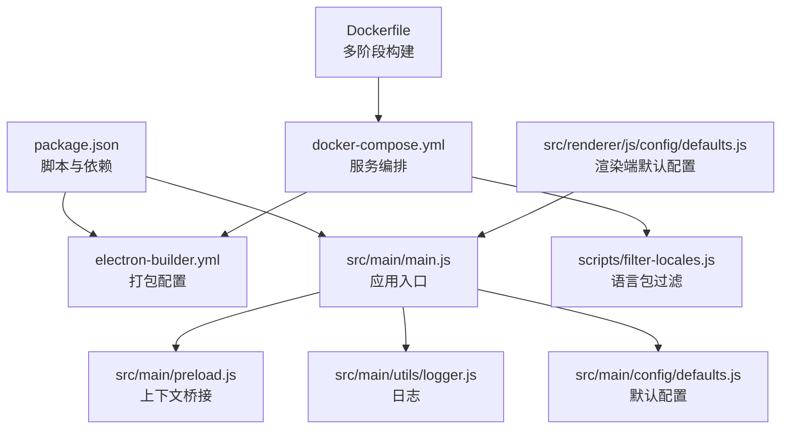
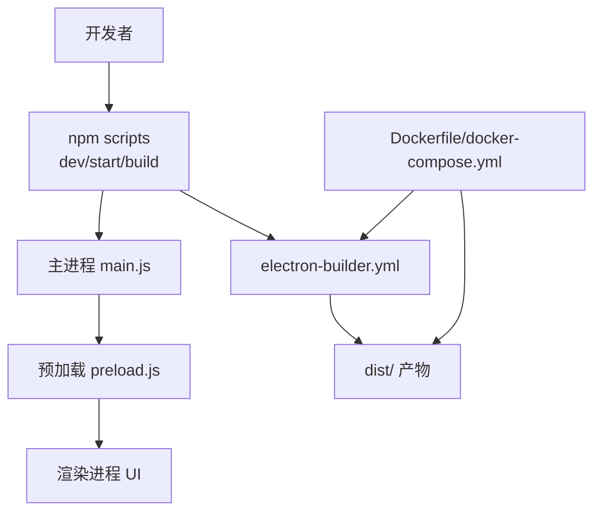
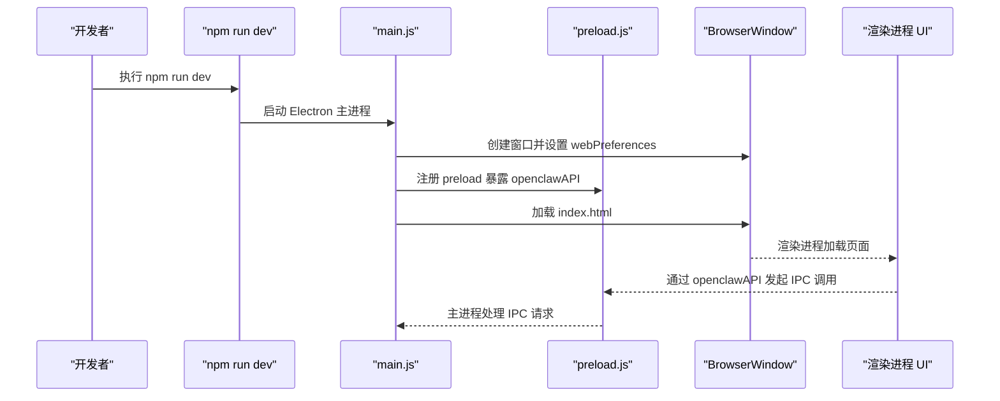
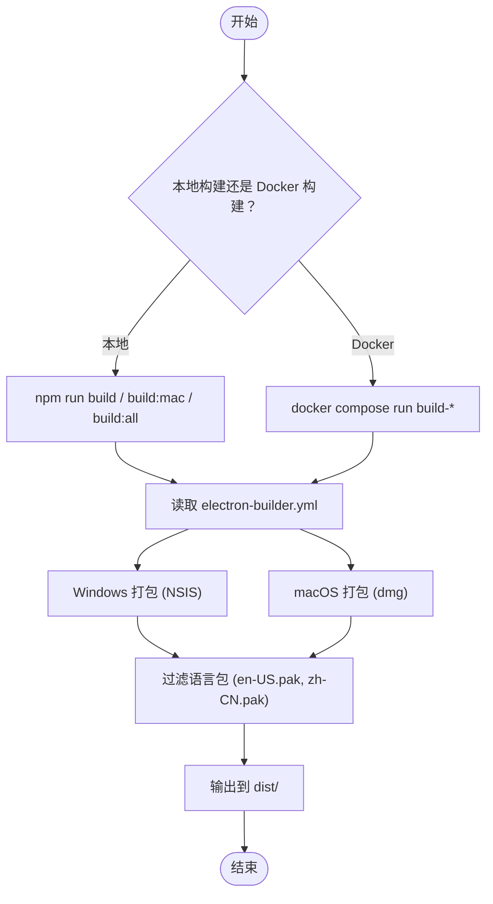
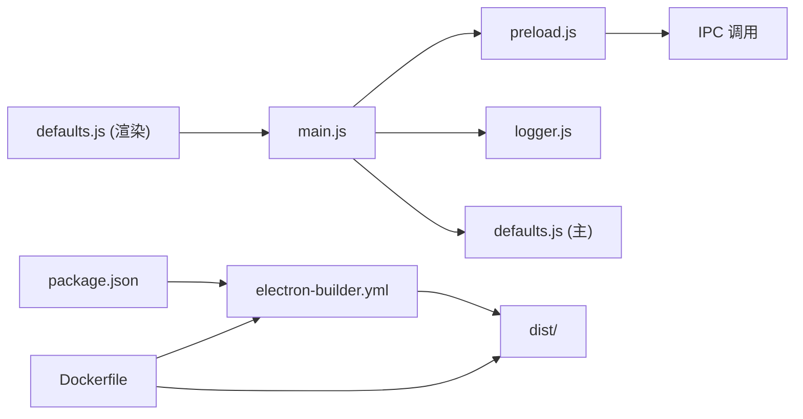

# 开发环境

<cite>
**本文引用的文件**
- [package.json](file://package.json)
- [electron-builder.yml](file://electron-builder.yml)
- [Dockerfile](file://Dockerfile)
- [docker-compose.yml](file://docker-compose.yml)
- [README.md](file://README.md)
- [src/main/main.js](file://src/main/main.js)
- [src/main/preload.js](file://src/main/preload.js)
- [src/main/config/defaults.js](file://src/main/config/defaults.js)
- [src/renderer/js/config/defaults.js](file://src/renderer/js/config/defaults.js)
- [src/main/utils/logger.js](file://src/main/utils/logger.js)
- [scripts/filter-locales.js](file://scripts/filter-locales.js)
- [docs/TROUBLESHOOTING.md](file://docs/TROUBLESHOOTING.md)
- [docs/INSTALLATION_FIX_GUIDE.md](file://docs/INSTALLATION_FIX_GUIDE.md)
</cite>

## 目录
1. [简介](#简介)
2. [项目结构](#项目结构)
3. [核心组件](#核心组件)
4. [架构总览](#架构总览)
5. [详细组件分析](#详细组件分析)
6. [依赖关系分析](#依赖关系分析)
7. [性能考虑](#性能考虑)
8. [故障排除指南](#故障排除指南)
9. [结论](#结论)
10. [附录](#附录)

## 简介
本指南面向新加入的开发者，帮助你在本地快速搭建可用的开发环境，并掌握依赖管理、开发服务器启动、构建与打包、Docker 环境使用、调试技巧与最佳实践。项目基于 Electron 34，采用原生 HTML/CSS/JS，使用 electron-builder 进行多平台打包；同时提供 Docker 多阶段构建镜像，确保跨平台构建的一致性。

## 项目结构
- 根目录包含应用主进程、渲染进程、打包配置、Docker 构建与编排配置、以及文档与资源脚本。
- 主进程负责窗口创建、IPC 注册、资源检查与日志记录；渲染进程提供安装向导与管理面板的 UI。
- electron-builder.yml 与 package.json 中的 scripts/build 字段共同定义了构建与打包策略。
- Dockerfile 与 docker-compose.yml 提供容器化构建与开发模式，屏蔽本地环境差异。

图表来源
- [package.json:1-75](file://package.json#L1-L75)
- [electron-builder.yml:1-53](file://electron-builder.yml#L1-L53)
- [src/main/main.js:1-121](file://src/main/main.js#L1-L121)
- [src/main/preload.js:1-239](file://src/main/preload.js#L1-L239)
- [src/main/utils/logger.js:1-75](file://src/main/utils/logger.js#L1-L75)
- [src/main/config/defaults.js:1-180](file://src/main/config/defaults.js#L1-L180)
- [src/renderer/js/config/defaults.js:1-51](file://src/renderer/js/config/defaults.js#L1-L51)
- [Dockerfile:1-109](file://Dockerfile#L1-L109)
- [docker-compose.yml:1-105](file://docker-compose.yml#L1-L105)
- [scripts/filter-locales.js:1-66](file://scripts/filter-locales.js#L1-L66)

章节来源
- [README.md:36-90](file://README.md#L36-L90)
- [package.json:1-75](file://package.json#L1-L75)
- [electron-builder.yml:1-53](file://electron-builder.yml#L1-L53)
- [Dockerfile:1-109](file://Dockerfile#L1-L109)
- [docker-compose.yml:1-105](file://docker-compose.yml#L1-L105)

## 核心组件
- 应用入口与窗口：主进程入口负责创建 BrowserWindow、注册菜单、注册 IPC 处理器，并在启动时输出调试信息与资源检查结果。
- 预加载桥接：通过 contextBridge 暴露受控 API 至渲染进程，统一管理依赖检测、安装、配置、服务控制、日志、任务、聊天、通道、技能等 IPC 调用。
- 默认配置：集中管理网络、超时、样式、路径与功能开关等默认参数，便于维护与修改。
- 日志系统：在用户主目录下写入日志文件，支持清理控制字符与格式化时间戳。
- 构建与打包：通过 electron-builder.yml 与 package.json 的 scripts 定义 Windows 与 macOS 平台的安装包与便携版目标。
- Docker 构建：提供多阶段镜像，内置 Wine/NSIS 与 Electron 下载镜像，支持 amd64/arm64 架构，输出到本地 dist 目录。

章节来源
- [src/main/main.js:1-121](file://src/main/main.js#L1-L121)
- [src/main/preload.js:1-239](file://src/main/preload.js#L1-L239)
- [src/main/config/defaults.js:1-180](file://src/main/config/defaults.js#L1-L180)
- [src/renderer/js/config/defaults.js:1-51](file://src/renderer/js/config/defaults.js#L1-L51)
- [src/main/utils/logger.js:1-75](file://src/main/utils/logger.js#L1-L75)
- [package.json:7-16](file://package.json#L7-L16)
- [electron-builder.yml:1-53](file://electron-builder.yml#L1-L53)
- [Dockerfile:1-109](file://Dockerfile#L1-L109)
- [docker-compose.yml:1-105](file://docker-compose.yml#L1-L105)

## 架构总览
下图展示了开发与构建的关键流程：本地开发通过 npm scripts 启动 Electron；打包通过 electron-builder 生成 Windows/macOS 安装包；Docker 构建在容器内完成跨平台构建，确保一致性。

图表来源
- [README.md:92-141](file://README.md#L92-L141)
- [package.json:7-16](file://package.json#L7-L16)
- [electron-builder.yml:1-53](file://electron-builder.yml#L1-L53)
- [Dockerfile:1-109](file://Dockerfile#L1-L109)
- [docker-compose.yml:1-105](file://docker-compose.yml#L1-L105)

## 详细组件分析

### 依赖管理与环境要求
- Node.js 版本：根据 README 的“环境要求”，最低版本为 18；Dockerfile 使用 node:22-bookworm，满足更高版本需求。
- 依赖分类：
  - 生产依赖：electron-store、chokidar（用于持久化与日志监控）。
  - 开发依赖：electron、electron-builder、electron-rebuild、png-to-ico、sharp（用于打包、图标转换与图像处理）。
- 依赖安装：使用 npm ci 或 npm install 安装；Docker 构建阶段使用 npm ci 并启用离线优先策略，提升稳定性与速度。

章节来源
- [README.md:94-103](file://README.md#L94-L103)
- [package.json:61-71](file://package.json#L61-L71)
- [Dockerfile:82-85](file://Dockerfile#L82-L85)

### 开发服务器启动流程
- 本地开发：
  - 启动命令：npm run dev（带 --dev 参数，便于调试）。
  - 应用入口：main.js 创建 BrowserWindow，加载渲染进程 index.html。
  - 预加载：preload.js 暴露 openclawAPI，渲染进程通过该 API 与主进程通信。
  - 菜单与开发者工具：内置“开发者工具”菜单项，支持 F12 打开调试。
- 调试模式：
  - 启动时输出调试信息（如用户目录、资源路径、平台架构等）。
  - 日志写入用户主目录下的日志文件，便于定位问题。
  - 渲染端默认配置与主端默认配置分别集中管理网络、超时、样式等参数。

图表来源
- [README.md:105-115](file://README.md#L105-L115)
- [src/main/main.js:48-101](file://src/main/main.js#L48-L101)
- [src/main/preload.js:1-239](file://src/main/preload.js#L1-L239)

章节来源
- [README.md:92-115](file://README.md#L92-L115)
- [src/main/main.js:1-121](file://src/main/main.js#L1-L121)
- [src/main/preload.js:1-239](file://src/main/preload.js#L1-L239)
- [src/main/config/defaults.js:1-180](file://src/main/config/defaults.js#L1-L180)
- [src/renderer/js/config/defaults.js:1-51](file://src/renderer/js/config/defaults.js#L1-L51)

### 构建与打包流程
- 本地构建：
  - 使用 npm run build（Windows 安装包）、npm run build:mac（macOS 安装包）、npm run build:all（全平台）等脚本。
  - electron-builder.yml 定义 appId、productName、输出目录、打包文件、额外资源、语言包、NSIS 选项与 Electron 下载镜像。
- Docker 构建：
  - 多阶段镜像：base（系统依赖与 Wine/NSIS）、deps（安装依赖）、builder（复制源码与构建配置）。
  - docker-compose.yml 提供 build-app、build-mac、build-all、build-dev、shell 等服务，挂载 dist 目录到宿主机，确保产物可见。
  - afterPack 阶段通过脚本替换 .bat 为 .sh 并赋予执行权限，适配 Linux 容器环境。
- 语言包优化：
  - scripts/filter-locales.js 仅保留 en-US.pak 与 zh-CN.pak，减少安装包体积。

图表来源
- [README.md:117-141](file://README.md#L117-L141)
- [package.json:7-16](file://package.json#L7-L16)
- [electron-builder.yml:1-53](file://electron-builder.yml#L1-L53)
- [Dockerfile:77-108](file://Dockerfile#L77-L108)
- [docker-compose.yml:11-57](file://docker-compose.yml#L11-L57)
- [scripts/filter-locales.js:1-66](file://scripts/filter-locales.js#L1-L66)

章节来源
- [README.md:117-177](file://README.md#L117-L177)
- [electron-builder.yml:1-53](file://electron-builder.yml#L1-L53)
- [package.json:7-16](file://package.json#L7-L16)
- [Dockerfile:77-108](file://Dockerfile#L77-L108)
- [docker-compose.yml:11-57](file://docker-compose.yml#L11-L57)
- [scripts/filter-locales.js:1-66](file://scripts/filter-locales.js#L1-L66)

### Docker 环境使用
- 多阶段构建：
  - base 阶段安装 Wine、NSIS、genisoimage 等工具，设置 npm/Electron 镜像与系统变量。
  - deps 阶段复制 package.json 并执行 npm ci，清理缓存。
  - builder 阶段复制构建配置与脚本，处理 afterPack 脚本兼容性，复制源码与资源，最终执行 npm run build。
- 服务编排：
  - build-app：完整构建 Windows 安装包。
  - build-mac：在 Linux 容器中交叉编译 macOS dmg。
  - build-all：同时构建 Windows 与 macOS。
  - build-dev：挂载本地源码，适合频繁修改与调试。
  - shell：交互式 Shell，便于容器内调试。
- 产物输出：默认将 dist 挂载到宿主机，确保构建产物可访问。

章节来源
- [Dockerfile:1-109](file://Dockerfile#L1-L109)
- [docker-compose.yml:1-105](file://docker-compose.yml#L1-L105)

### 调试技巧与最佳实践
- 断点与开发者工具：
  - 渲染进程：通过菜单“视图 -> 开发者工具”或 F12 打开 DevTools。
  - 主进程：启动时输出调试信息与资源检查结果，便于定位路径与权限问题。
- 日志分析：
  - 主进程日志写入用户主目录下的日志文件，支持 INFO/WARN/ERROR/DEBUG 等级别。
  - 渲染端默认配置集中管理网络、超时与样式参数，便于对比与验证。
- 性能监控：
  - 使用 DevTools 的 Network/Application 标签查看网络请求与本地存储。
  - 结合日志与诊断报告定位性能瓶颈。

章节来源
- [src/main/main.js:9-44](file://src/main/main.js#L9-L44)
- [src/main/utils/logger.js:1-75](file://src/main/utils/logger.js#L1-L75)
- [src/renderer/js/config/defaults.js:1-51](file://src/renderer/js/config/defaults.js#L1-L51)
- [docs/TROUBLESHOOTING.md:210-219](file://docs/TROUBLESHOOTING.md#L210-L219)

## 依赖关系分析
- 组件耦合：
  - main.js 依赖 preload.js 暴露的 API，preload.js 再依赖主进程的服务模块（通过 IPC）。
  - 默认配置文件在主/渲染两端分别提供网络、超时、样式等参数，降低耦合度。
- 外部依赖：
  - electron-store 用于持久化；chokidar 用于日志文件监控；electron、electron-builder 用于打包。
- 构建依赖：
  - electron-builder.yml 与 package.json scripts 协作，定义打包目标与产物路径。
- Docker 依赖：
  - Dockerfile 通过多阶段构建隔离依赖安装与构建过程，docker-compose.yml 提供服务编排与卷挂载。

图表来源
- [src/main/main.js:1-121](file://src/main/main.js#L1-L121)
- [src/main/preload.js:1-239](file://src/main/preload.js#L1-L239)
- [src/main/utils/logger.js:1-75](file://src/main/utils/logger.js#L1-L75)
- [src/main/config/defaults.js:1-180](file://src/main/config/defaults.js#L1-L180)
- [src/renderer/js/config/defaults.js:1-51](file://src/renderer/js/config/defaults.js#L1-L51)
- [package.json:1-75](file://package.json#L1-L75)
- [electron-builder.yml:1-53](file://electron-builder.yml#L1-L53)
- [Dockerfile:1-109](file://Dockerfile#L1-L109)

章节来源
- [package.json:1-75](file://package.json#L1-L75)
- [electron-builder.yml:1-53](file://electron-builder.yml#L1-L53)
- [Dockerfile:1-109](file://Dockerfile#L1-L109)

## 性能考虑
- 构建性能：
  - 使用 npm ci 与离线优先策略，减少网络波动影响。
  - electron-builder 首次构建会下载 Electron 与 NSIS 工具，建议使用镜像加速。
  - 语言包过滤仅保留必要语言，减小安装包体积。
- 运行性能：
  - 主进程禁用 nodeIntegration，启用 contextIsolation，提高安全性与稳定性。
  - 渲染端默认配置集中管理超时与轮询间隔，避免硬编码带来的性能问题。

## 故障排除指南
- 依赖检测问题：
  - 若开发环境可检测而打包后不可检测，可通过开发者工具运行诊断命令，检查 openclaw.configPath 与版本信息。
  - 若资源文件缺失（如 Node.js 安装包），确认 resources/nodejs 与 resources/gitbash 是否被打包到安装包中。
- 打包缓慢或下载失败：
  - 设置 Electron 镜像与 electron-builder 二进制镜像，减少下载耗时。
- macOS dmg 未签名：
  - 首次打开需右键“打开”，属于正常现象。
- 诊断与日志：
  - 使用诊断工具保存报告，包含系统信息、资源文件、OpenClaw 状态与总结。
  - 主进程日志写入用户主目录，便于定位异常。

章节来源
- [docs/TROUBLESHOOTING.md:1-219](file://docs/TROUBLESHOOTING.md#L1-L219)
- [README.md:206-215](file://README.md#L206-L215)
- [src/main/utils/logger.js:1-75](file://src/main/utils/logger.js#L1-L75)

## 结论
通过本指南，你可以：
- 明确 Node.js 版本与依赖分类，正确安装与管理依赖；
- 使用 npm scripts 启动开发服务器并启用调试模式；
- 掌握本地与 Docker 两种构建方式，实现跨平台打包；
- 利用日志与诊断工具快速定位问题；
- 借助语言包过滤与镜像配置优化构建效率与产物体积。

## 附录
- 快速命令参考（来自 README）：
  - 本地开发：npm run dev
  - 生产运行：npm start
  - 打包构建：npm run build、npm run build:mac、npm run build:all
  - Docker 构建：docker compose run --rm build-app / build-mac / build-all / build-dev / shell

章节来源
- [README.md:105-141](file://README.md#L105-L141)