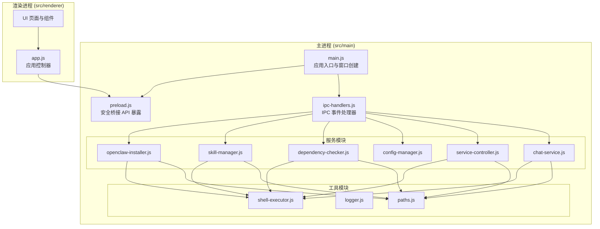
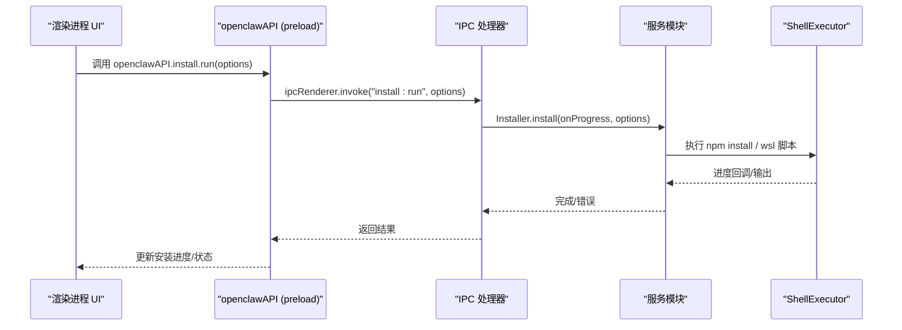
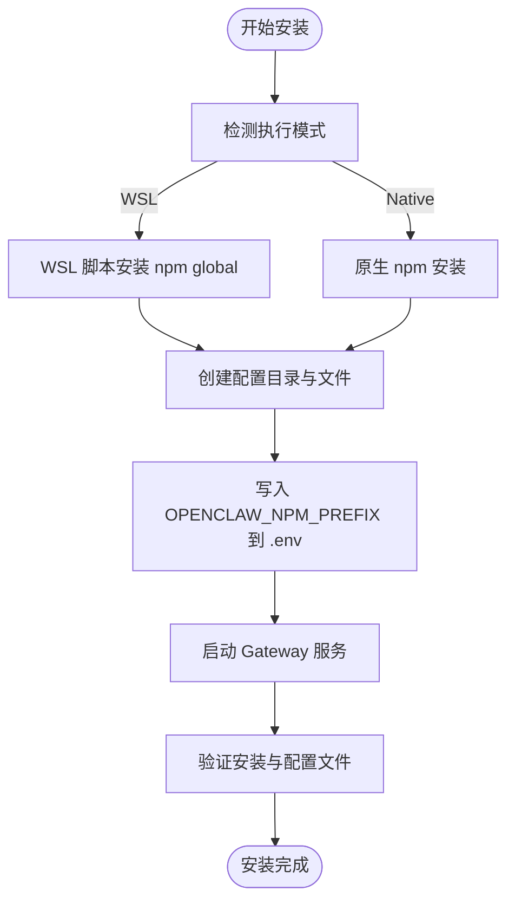
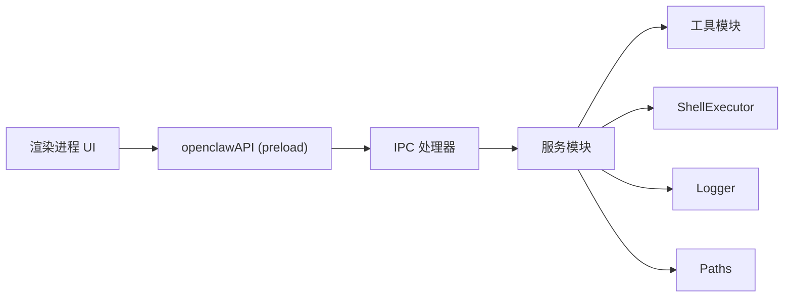

# 开发者指南

<cite>
**本文档引用的文件**
- [package.json](file://package.json)
- [main.js](file://src/main/main.js)
- [preload.js](file://src/main/preload.js)
- [ipc-handlers.js](file://src/main/ipc-handlers.js)
- [app.js](file://src/renderer/js/app.js)
- [openclaw-installer.js](file://src/main/services/openclaw-installer.js)
- [skill-manager.js](file://src/main/services/skill-manager.js)
- [shell-executor.js](file://src/main/utils/shell-executor.js)
- [dependency-checker.js](file://src/main/services/dependency-checker.js)
- [config-manager.js](file://src/main/services/config-manager.js)
- [service-controller.js](file://src/main/services/service-controller.js)
- [chat-service.js](file://src/main/services/chat-service.js)
- [logger.js](file://src/main/utils/logger.js)
- [paths.js](file://src/main/utils/paths.js)
</cite>

## 目录
1. [简介](#简介)
2. [项目结构](#项目结构)
3. [核心组件](#核心组件)
4. [架构总览](#架构总览)
5. [详细组件分析](#详细组件分析)
6. [依赖关系分析](#依赖关系分析)
7. [性能考虑](#性能考虑)
8. [故障排除指南](#故障排除指南)
9. [结论](#结论)
10. [附录](#附录)

## 简介
本项目是一个基于 Electron 的桌面应用，提供 OpenClaw 安装、配置、服务管理与技能生态的图形化管理界面。其核心架构采用主进程与渲染进程分离设计，通过 IPC 通道进行安全通信，结合多种服务模块实现依赖检测、安装器、聊天服务、技能管理等功能。文档将深入解析架构设计、IPC 通信机制、安全策略、核心服务模块实现原理与扩展开发最佳实践。

## 项目结构
项目采用典型的 Electron 应用布局，主要分为主进程（src/main）、渲染进程（src/renderer）与共享工具（src/main/utils）。主进程负责系统级操作与服务编排，渲染进程负责用户交互与可视化展示。

**图表来源**
- [main.js:1-121](file://src/main/main.js#L1-L121)
- [preload.js:1-239](file://src/main/preload.js#L1-L239)
- [ipc-handlers.js:1-816](file://src/main/ipc-handlers.js#L1-L816)
- [openclaw-installer.js:1-780](file://src/main/services/openclaw-installer.js#L1-L780)
- [skill-manager.js:1-1096](file://src/main/services/skill-manager.js#L1-L1096)
- [shell-executor.js:1-471](file://src/main/utils/shell-executor.js#L1-L471)
- [paths.js:1-124](file://src/main/utils/paths.js#L1-L124)

**章节来源**
- [package.json:1-75](file://package.json#L1-L75)
- [main.js:1-121](file://src/main/main.js#L1-L121)
- [preload.js:1-239](file://src/main/preload.js#L1-L239)
- [ipc-handlers.js:1-816](file://src/main/ipc-handlers.js#L1-L816)

## 核心组件
- Electron 主进程与窗口管理：负责应用生命周期、菜单、窗口创建与安全桥接。
- 预加载脚本（preload）：通过 contextBridge 暴露受限 API，实现安全的 IPC 通道。
- IPC 事件处理器：集中注册与路由各类 IPC 请求，协调各服务模块。
- 核心服务模块：安装器、依赖检测、配置管理、服务控制、聊天服务、技能管理等。
- 工具模块：Shell 执行器、日志记录、路径解析等。

**章节来源**
- [main.js:1-121](file://src/main/main.js#L1-L121)
- [preload.js:1-239](file://src/main/preload.js#L1-L239)
- [ipc-handlers.js:1-816](file://src/main/ipc-handlers.js#L1-L816)

## 架构总览
应用采用“主进程服务编排 + 渲染进程 UI”的分层架构。主进程通过 preload 暴露受控 API，渲染进程通过 openclawAPI 调用主进程能力，主进程通过 IPC handlers 调用具体服务模块，实现安装、配置、服务启停、聊天与技能管理等核心功能。

**图表来源**
- [preload.js:33-49](file://src/main/preload.js#L33-L49)
- [ipc-handlers.js:177-195](file://src/main/ipc-handlers.js#L177-L195)
- [openclaw-installer.js:117-438](file://src/main/services/openclaw-installer.js#L117-L438)
- [shell-executor.js:136-197](file://src/main/utils/shell-executor.js#L136-L197)

## 详细组件分析

### 1) Electron 主进程与窗口管理
- 应用入口负责创建 BrowserWindow，启用上下文隔离与禁用 Node 集成，设置 webPreferences 与菜单。
- 单实例锁保证应用唯一运行，窗口事件处理与菜单项绑定。
- 资源检查与调试信息写入，便于定位安装与路径问题。

**章节来源**
- [main.js:1-121](file://src/main/main.js#L1-L121)

### 2) 预加载脚本与安全桥接
- 通过 contextBridge.exposeInMainWorld 暴露 openclawAPI，封装 IPC 调用与事件监听。
- API 按功能域划分（deps、install、config、env、service、skills、channels、tasks、chat、utils 等），统一返回 Promise 或事件回调。
- 事件监听返回解绑函数，避免内存泄漏。

**章节来源**
- [preload.js:1-239](file://src/main/preload.js#L1-L239)

### 3) IPC 事件处理器与服务编排
- registerAllHandlers 集中注册所有 IPC 通道，创建各服务实例并转发请求。
- handle/on 双模式：handle 用于请求-响应，on 用于事件推送（进度、日志、流式输出）。
- 统一错误处理与日志记录，保证异常可追踪。

**章节来源**
- [ipc-handlers.js:26-51](file://src/main/ipc-handlers.js#L26-L51)

### 4) OpenClaw 安装器（OpenClawInstaller）
- 支持原生与 WSL 两种执行模式，自动检测与切换。
- 安装流程：镜像源设置、npm prefix 配置、安装、配置目录与文件创建、Gateway 启动与验证。
- 安装后补全扩展 README，避免运行时报错。
- 提供 getVersion、update、setMirror 等能力。

**图表来源**
- [openclaw-installer.js:117-438](file://src/main/services/openclaw-installer.js#L117-L438)

**章节来源**
- [openclaw-installer.js:1-780](file://src/main/services/openclaw-installer.js#L1-L780)

### 5) 依赖检测器（DependencyChecker）
- 检测 Node.js、npm、Git、WSL 状态，支持模式化检测（native/wsl）。
- 通过多路径扫描与注册表查询提升检测准确性。
- 提供安装 Git、Node 的自动化流程，支持进度回调与错误处理。

**章节来源**
- [dependency-checker.js:1-800](file://src/main/services/dependency-checker.js#L1-L800)

### 6) Shell 执行器（ShellExecutor）
- 统一封装 spawn 与流式执行，适配 Windows 与 WSL。
- 处理编码问题（GBK→UTF-8）、PATH 注入、超时控制与错误恢复。
- 提供 runCommand/streamCommand/getOutput/commandExists 等能力。

**章节来源**
- [shell-executor.js:1-471](file://src/main/utils/shell-executor.js#L1-L471)

### 7) 技能管理器（SkillManager）
- 通过 Gateway HTTP API 与 openclaw CLI 双通道管理技能。
- 支持安装、卸载、启用/禁用、搜索、探索、信息查询等。
- 内置缓存与目录扫描，确保自定义技能可见。

**章节来源**
- [skill-manager.js:1-1096](file://src/main/services/skill-manager.js#L1-L1096)

### 8) 配置管理器（ConfigManager）
- 读写 openclaw.json、auth-profiles.json、models.json 等配置文件。
- 支持备份与回滚，提供 API Key 与模型配置管理。

**章节来源**
- [config-manager.js:1-264](file://src/main/services/config-manager.js#L1-L264)

### 9) 服务控制器（ServiceController）
- 管理 Gateway 服务启停与状态查询，支持原生与 WSL 模式。
- 构建环境变量（PATH 注入、.env 注入），避免 UAC 与路径问题。
- 轮询等待启动完成，失败时输出诊断信息。

**章节来源**
- [service-controller.js:1-1101](file://src/main/services/service-controller.js#L1-L1101)

### 10) 聊天服务（ChatService）
- 优先使用 Gateway HTTP SSE API 实现真流式对话。
- Gateway 不可用时降级为 CLI 模式，模拟流式输出。
- 支持会话解析、错误提取与缓存探测，提升响应速度。

**章节来源**
- [chat-service.js:1-1345](file://src/main/services/chat-service.js#L1-L1345)

### 11) 工具模块
- Logger：统一日志格式与落盘，支持 INFO/WARN/ERROR/DEBUG。
- Paths：跨平台路径解析，支持 WSL 路径转换与 npm prefix 读取。

**章节来源**
- [logger.js:1-75](file://src/main/utils/logger.js#L1-L75)
- [paths.js:1-124](file://src/main/utils/paths.js#L1-L124)

## 依赖关系分析
主进程通过 preload 暴露 API，渲染进程通过 openclawAPI 调用主进程；主进程的 IPC handlers 调用具体服务模块；服务模块依赖工具模块（ShellExecutor、Logger、Paths）完成系统交互与路径处理。

**图表来源**
- [preload.js:1-239](file://src/main/preload.js#L1-L239)
- [ipc-handlers.js:1-816](file://src/main/ipc-handlers.js#L1-L816)
- [shell-executor.js:1-471](file://src/main/utils/shell-executor.js#L1-L471)
- [logger.js:1-75](file://src/main/utils/logger.js#L1-L75)
- [paths.js:1-124](file://src/main/utils/paths.js#L1-L124)

**章节来源**
- [ipc-handlers.js:1-816](file://src/main/ipc-handlers.js#L1-L816)

## 性能考虑
- IPC 事件处理采用 handle/on 双模式，避免阻塞主线程。
- ShellExecutor 统一编码处理与超时控制，减少乱码与卡顿。
- ChatService 使用 TCP 探测与缓存，降低 Gateway 不可用时的等待时间。
- ServiceController 构建精简 PATH 与 .env 注入，减少 CLI 冷启动开销。
- Installer 与 SkillManager 使用缓存与并行检测，缩短等待时间。

[本节为通用指导，无需列出具体文件来源]

## 故障排除指南
- 安装失败：检查 openclaw-installer.log 与 Gateway 端口占用；确认 npm prefix 与 .env 配置。
- 依赖检测异常：使用 DependencyChecker 的并行检测与路径刷新；必要时手动安装 Git/Node。
- 聊天无响应：确认 Gateway 是否启动；查看 SSE 探测与 404 缓存；必要时降级 CLI 模式。
- Shell 执行乱码：检查编码解码与 PATH 注入；确保 UTF-8 环境变量设置。
- 日志定位：查看 OPENCLAW_HOME 下的日志文件与安装器日志。

**章节来源**
- [logger.js:1-75](file://src/main/utils/logger.js#L1-L75)
- [service-controller.js:1-1101](file://src/main/services/service-controller.js#L1-L1101)
- [chat-service.js:1-1345](file://src/main/services/chat-service.js#L1-L1345)

## 结论
本项目通过 Electron 的主/渲染分离架构与严格的 IPC 安全策略，构建了稳定、可扩展的桌面应用。核心服务模块围绕安装、配置、服务、聊天与技能管理形成闭环，配合工具模块实现跨平台与多模式执行。开发者可基于现有架构快速扩展新功能与插件，同时遵循日志、缓存与错误处理的最佳实践，确保系统的可靠性与可维护性。

[本节为总结性内容，无需列出具体文件来源]

## 附录

### A. 开发环境搭建
- 安装 Node.js 与 npm，确保 npm prefix 配置正确。
- 克隆仓库后执行安装与构建脚本，参考 package.json 中的 scripts。
- 使用 Electron 开发模式启动应用，打开开发者工具进行调试。

**章节来源**
- [package.json:7-16](file://package.json#L7-L16)

### B. 调试技巧
- 主进程日志：通过 Logger 写入日志文件，定位安装与服务问题。
- 渲染进程调试：打开开发者工具，检查 openclawAPI 调用与 IPC 事件。
- Shell 执行：使用 ShellExecutor 的 getOutput 与 streamCommand 进行命令验证。

**章节来源**
- [logger.js:1-75](file://src/main/utils/logger.js#L1-L75)
- [shell-executor.js:1-471](file://src/main/utils/shell-executor.js#L1-L471)

### C. 扩展开发最佳实践
- 新增 IPC 接口：在 preload 中暴露 API，在 ipc-handlers 中注册处理函数。
- 新增服务模块：遵循单一职责，复用 ShellExecutor、Logger、Paths。
- 观察者模式：对进度与状态变化使用事件回调，避免轮询。
- 工厂模式：对可变依赖（如执行器、路径解析）抽象为工厂方法，便于测试与替换。

[本节为通用指导，无需列出具体文件来源]