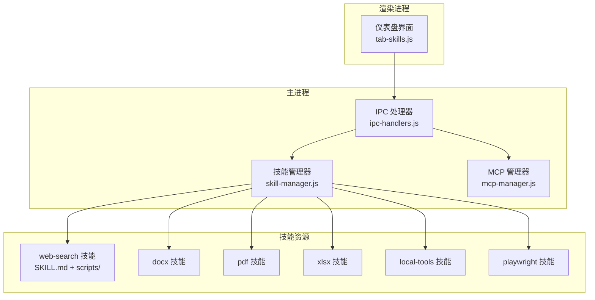
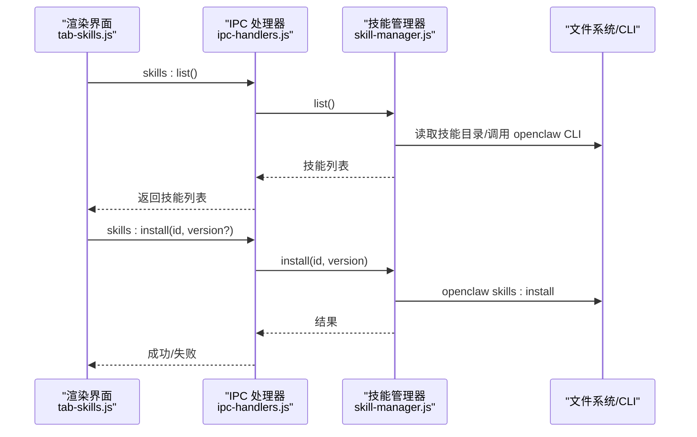
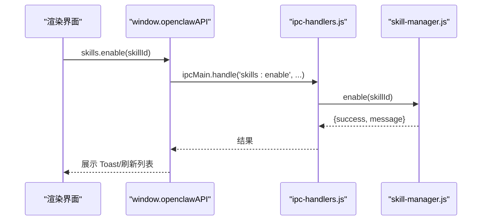
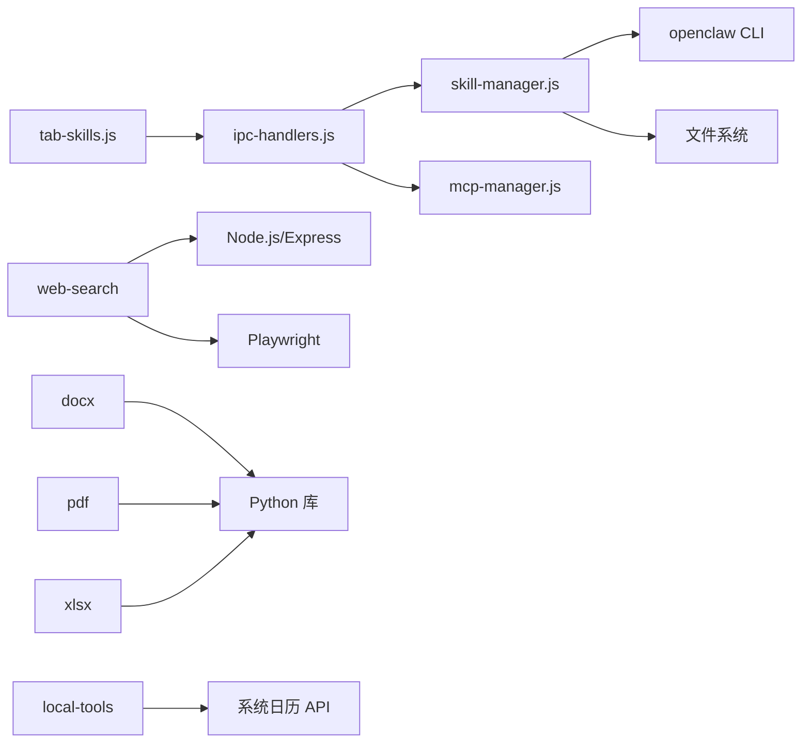

# 扩展开发

<cite>
**本文引用的文件**
- [src/main/services/skill-manager.js](file://src/main/services/skill-manager.js)
- [src/renderer/js/dashboard/tab-skills.js](file://src/renderer/js/dashboard/tab-skills.js)
- [src/main/ipc-handlers.js](file://src/main/ipc-handlers.js)
- [resources/skills/web-search/SKILL.md](file://resources/skills/web-search/SKILL.md)
- [resources/skills/web-search/package.json](file://resources/skills/web-search/package.json)
- [resources/skills/web-search/tsconfig.json](file://resources/skills/web-search/tsconfig.json)
- [resources/skills/web-search/IMPLEMENTATION.md](file://resources/skills/web-search/IMPLEMENTATION.md)
- [resources/skills/web-search/scripts/search.sh](file://resources/skills/web-search/scripts/search.sh)
- [resources/skills/web-search/scripts/start-server.sh](file://resources/skills/web-search/scripts/start-server.sh)
- [resources/skills/web-search/scripts/stop-server.sh](file://resources/skills/web-search/scripts/stop-server.sh)
- [resources/skills/docx/SKILL.md](file://resources/skills/docx/SKILL.md)
- [resources/skills/pdf/SKILL.md](file://resources/skills/pdf/SKILL.md)
- [resources/skills/xlsx/SKILL.md](file://resources/skills/xlsx/SKILL.md)
- [resources/skills/local-tools/SKILL.md](file://resources/skills/local-tools/SKILL.md)
- [resources/skills/playwright/SKILL.md](file://resources/skills/playwright/SKILL.md)
- [resources/skills/skill-vetter/SKILL.md](file://resources/skills/skill-vetter/SKILL.md)
- [src/main/services/mcp-manager.js](file://src/main/services/mcp-manager.js)
</cite>

## 目录
1. [简介](#简介)
2. [项目结构](#项目结构)
3. [核心组件](#核心组件)
4. [架构总览](#架构总览)
5. [详细组件分析](#详细组件分析)
6. [依赖关系分析](#依赖关系分析)
7. [性能考量](#性能考量)
8. [故障排查指南](#故障排查指南)
9. [结论](#结论)
10. [附录](#附录)

## 简介
本指南面向希望在 LobsterAI 平台上开发“技能”（Skill）的扩展开发者，系统讲解如何从零构建、调试、发布与维护一个技能模块。文档基于仓库内现有技能与平台服务的实现，提供可复用的模板、接口规范、最佳实践与端到端流程，涵盖以下主题：
- 技能模板与元数据配置（SKILL.md）
- 标准接口与 IPC 集成
- 元数据字段（名称、版本、描述、许可证、官方标识等）
- 错误处理、异步操作与资源管理
- 与主应用的集成（IPC、事件、状态同步）
- 打包与分发（目录结构、依赖声明、版本管理）
- 开发示例（文本处理到复杂文件操作）
- 测试方法与工具
- 生命周期管理（安装、更新、卸载、故障恢复）
- 常见问题与解决方案

## 项目结构
平台采用“Electron 主进程 + 渲染进程 + 技能资源”的三层架构：
- 主进程负责服务编排、IPC 注册、系统服务与技能管理
- 渲染进程提供仪表盘界面，管理技能列表、启用/禁用、安装/卸载
- 技能资源位于 resources/skills 下，每个技能包含文档、脚本、依赖与入口

图表来源
- [src/renderer/js/dashboard/tab-skills.js:1-862](file://src/renderer/js/dashboard/tab-skills.js#L1-L862)
- [src/main/ipc-handlers.js:542-596](file://src/main/ipc-handlers.js#L542-L596)
- [src/main/services/skill-manager.js:1-1096](file://src/main/services/skill-manager.js#L1-L1096)
- [src/main/services/mcp-manager.js:1-102](file://src/main/services/mcp-manager.js#L1-L102)

章节来源
- [src/renderer/js/dashboard/tab-skills.js:1-862](file://src/renderer/js/dashboard/tab-skills.js#L1-L862)
- [src/main/ipc-handlers.js:542-596](file://src/main/ipc-handlers.js#L542-L596)
- [src/main/services/skill-manager.js:1-1096](file://src/main/services/skill-manager.js#L1-L1096)

## 核心组件
- 技能管理器（SkillManager）
  - 负责技能列表、安装、卸载、启用/禁用、搜索、信息查询、更新等
  - 支持自定义技能与系统技能的差异化处理
- IPC 处理器（ipc-handlers.js）
  - 暴露统一的 IPC 接口给渲染进程调用
  - 包含 skills:*、mcp:* 等命名空间
- 渲染侧技能面板（tab-skills.js）
  - 展示系统技能与自定义技能，支持启用/禁用、删除、创建自定义技能
  - 提供技能市场搜索与导入能力
- MCP 管理器（mcp-manager.js）
  - 管理 MCP 服务器配置（命令、参数、环境变量、启用状态）

章节来源
- [src/main/services/skill-manager.js:1-1096](file://src/main/services/skill-manager.js#L1-L1096)
- [src/main/ipc-handlers.js:542-596](file://src/main/ipc-handlers.js#L542-L596)
- [src/renderer/js/dashboard/tab-skills.js:1-862](file://src/renderer/js/dashboard/tab-skills.js#L1-L862)
- [src/main/services/mcp-manager.js:1-102](file://src/main/services/mcp-manager.js#L1-L102)

## 架构总览
技能开发与运行的关键流程如下：
- 开发者在 resources/skills 下创建技能目录，编写 SKILL.md 元数据与实现脚本
- 渲染进程通过 IPC 调用主进程技能管理器
- 主进程根据策略调用 openclaw CLI 或直接文件系统操作
- 对于需要外部服务的技能（如 web-search），由脚本启动本地服务并通过 HTTP 交互

图表来源
- [src/renderer/js/dashboard/tab-skills.js:105-158](file://src/renderer/js/dashboard/tab-skills.js#L105-L158)
- [src/main/ipc-handlers.js:542-561](file://src/main/ipc-handlers.js#L542-L561)
- [src/main/services/skill-manager.js:368-398](file://src/main/services/skill-manager.js#L368-L398)

## 详细组件分析

### 技能模板与元数据（SKILL.md）
- 必备字段
  - name：技能唯一标识（推荐小写、连字符/下划线）
  - description：简短描述
  - license/official：许可证与官方标识（可选）
  - version：版本号（可选）
- 文档结构建议
  - 使用 YAML Front Matter 声明元数据
  - 包含“何时使用”、“如何工作”、“基本用法/高级用法”、“最佳实践”、“故障排查”、“技术细节”等章节
- 示例参考
  - web-search：完整文档与实现说明
  - docx/pdf/xlsx/local-tools/playwright：简洁实用的技能文档

章节来源
- [resources/skills/web-search/SKILL.md:1-562](file://resources/skills/web-search/SKILL.md#L1-L562)
- [resources/skills/docx/SKILL.md:1-198](file://resources/skills/docx/SKILL.md#L1-L198)
- [resources/skills/pdf/SKILL.md:1-296](file://resources/skills/pdf/SKILL.md#L1-L296)
- [resources/skills/xlsx/SKILL.md:1-290](file://resources/skills/xlsx/SKILL.md#L1-L290)
- [resources/skills/local-tools/SKILL.md:1-474](file://resources/skills/local-tools/SKILL.md#L1-L474)
- [resources/skills/playwright/SKILL.md:1-149](file://resources/skills/playwright/SKILL.md#L1-L149)

### 标准接口与 IPC 集成
- 渲染进程通过 window.openclawAPI.* 调用 IPC
- 主进程在 ipc-handlers.js 中注册 skills:* 命名空间
- 技能管理器封装具体逻辑（CLI 调用、文件系统操作、缓存与错误处理）

图表来源
- [src/renderer/js/dashboard/tab-skills.js:270-320](file://src/renderer/js/dashboard/tab-skills.js#L270-L320)
- [src/main/ipc-handlers.js:555-561](file://src/main/ipc-handlers.js#L555-L561)
- [src/main/services/skill-manager.js:487-536](file://src/main/services/skill-manager.js#L487-L536)

章节来源
- [src/renderer/js/dashboard/tab-skills.js:270-320](file://src/renderer/js/dashboard/tab-skills.js#L270-L320)
- [src/main/ipc-handlers.js:542-596](file://src/main/ipc-handlers.js#L542-L596)
- [src/main/services/skill-manager.js:487-536](file://src/main/services/skill-manager.js#L487-L536)

### 错误处理、异步操作与资源管理
- 异步操作
  - ShellExecutor.runCommand 返回 Promise，支持超时控制
  - IPC 使用 handle/on 区分同步/异步
- 错误处理
  - 统一捕获异常并返回 {success, message}
  - 对 CLI 输出进行清洗（剥离 ANSI、提取 JSON）
- 资源管理
  - web-search：服务进程 PID 管理、连接缓存、健康检查、自动修复
  - 通过 start-server.sh/stop-server.sh 控制服务生命周期

章节来源
- [src/main/services/skill-manager.js:147-210](file://src/main/services/skill-manager.js#L147-L210)
- [src/main/services/skill-manager.js:373-398](file://src/main/services/skill-manager.js#L373-L398)
- [resources/skills/web-search/scripts/start-server.sh:1-318](file://resources/skills/web-search/scripts/start-server.sh#L1-L318)
- [resources/skills/web-search/scripts/stop-server.sh:1-53](file://resources/skills/web-search/scripts/stop-server.sh#L1-L53)

### 与主应用的集成（IPC、事件、状态同步）
- IPC 命名空间
  - skills:list/install/remove/enable/disable/search/explore/list-installed/inspect/info/import-bundled/get-bundled-list/create-custom
- 状态同步
  - 列表缓存（TTL）、操作后主动失效缓存
  - 服务启停后即时刷新网关探测缓存

章节来源
- [src/main/ipc-handlers.js:542-596](file://src/main/ipc-handlers.js#L542-L596)
- [src/main/services/skill-manager.js:10-23](file://src/main/services/skill-manager.js#L10-L23)
- [src/main/services/skill-manager.js:356-357](file://src/main/services/skill-manager.js#L356-L357)

### 打包与分发（目录结构、依赖声明、版本管理）
- 目录结构
  - resources/skills/<技能名>/SKILL.md（元数据与文档）
  - scripts/（脚本与工具）
  - 可选：server/（服务端）、dist/（编译产物）
- 依赖声明
  - web-search 使用 package.json 声明依赖（express、playwright-core 等）
  - TypeScript 项目使用 tsconfig.json 配置编译选项
- 版本管理
  - SKILL.md 中 version 字段用于 UI 展示
  - openclaw CLI 支持按版本安装与更新

章节来源
- [resources/skills/web-search/package.json:1-32](file://resources/skills/web-search/package.json#L1-L32)
- [resources/skills/web-search/tsconfig.json:1-27](file://resources/skills/web-search/tsconfig.json#L1-L27)
- [resources/skills/web-search/IMPLEMENTATION.md:72-106](file://resources/skills/web-search/IMPLEMENTATION.md#L72-L106)

### 开发示例

#### 示例一：简单文本处理（类 local-tools）
- 思路：提供跨平台脚本（Bash/PowerShell），输出 JSON，供上层解析
- 关键点：权限声明、日期格式、错误码、输出一致性
- 参考：local-tools 的 SKILL.md 与脚本

章节来源
- [resources/skills/local-tools/SKILL.md:1-474](file://resources/skills/local-tools/SKILL.md#L1-L474)

#### 示例二：复杂文件操作（类 docx/pdf/xlsx）
- 思路：使用专业库（pypdf、reportlab、openpyxl 等）或浏览器自动化（playwright）
- 关键点：库选择、格式兼容、公式计算、错误处理、性能优化
- 参考：
  - docx：OOXML 解析与编辑、红lining 工作流
  - pdf：文本/表格提取、命令行工具、OCR
  - xlsx：公式与格式、Recalc、颜色与数值规范
  - playwright：CLI 包装与调试

章节来源
- [resources/skills/docx/SKILL.md:1-198](file://resources/skills/docx/SKILL.md#L1-L198)
- [resources/skills/pdf/SKILL.md:1-296](file://resources/skills/pdf/SKILL.md#L1-L296)
- [resources/skills/xlsx/SKILL.md:1-290](file://resources/skills/xlsx/SKILL.md#L1-L290)
- [resources/skills/playwright/SKILL.md:1-149](file://resources/skills/playwright/SKILL.md#L1-L149)

#### 示例三：实时检索（web-search）
- 思路：本地 Bridge Server + Playwright + CDP，提供 HTTP API
- 关键点：服务自动启动/停止、连接缓存、健康检查、自动修复
- 参考：web-search 的 SKILL.md、脚本与实现说明

章节来源
- [resources/skills/web-search/SKILL.md:1-562](file://resources/skills/web-search/SKILL.md#L1-L562)
- [resources/skills/web-search/scripts/search.sh:1-572](file://resources/skills/web-search/scripts/search.sh#L1-L572)
- [resources/skills/web-search/scripts/start-server.sh:1-318](file://resources/skills/web-search/scripts/start-server.sh#L1-L318)
- [resources/skills/web-search/scripts/stop-server.sh:1-53](file://resources/skills/web-search/scripts/stop-server.sh#L1-L53)
- [resources/skills/web-search/IMPLEMENTATION.md:1-404](file://resources/skills/web-search/IMPLEMENTATION.md#L1-L404)

### 测试方法与工具
- 单元/集成测试
  - web-search 提供 test-basic.js、test-search.js
- 端到端测试
  - IMPLEMENTATION.md 提供 E2E 测试指南
- 仪表盘测试
  - tab-skills.js 内置创建自定义技能的安全审计（内容长度、危险命令、敏感信息、可疑 URL、代码块）

章节来源
- [resources/skills/web-search/IMPLEMENTATION.md:229-241](file://resources/skills/web-search/IMPLEMENTATION.md#L229-L241)
- [resources/skills/web-search/scripts/search.sh:1-572](file://resources/skills/web-search/scripts/search.sh#L1-L572)
- [src/renderer/js/dashboard/tab-skills.js:565-683](file://src/renderer/js/dashboard/tab-skills.js#L565-L683)

### 生命周期管理（安装、更新、卸载、故障恢复）
- 安装/更新
  - openclaw skills:install / skills:update
- 卸载
  - 优先使用 Gateway API；失败时回退到文件系统删除
- 故障恢复
  - web-search：自动修复 iconv-lite、强制停止端口占用、重建连接缓存
  - 列表缓存 TTL 与失效策略

章节来源
- [src/main/services/skill-manager.js:373-448](file://src/main/services/skill-manager.js#L373-L448)
- [resources/skills/web-search/scripts/start-server.sh:93-147](file://resources/skills/web-search/scripts/start-server.sh#L93-L147)
- [resources/skills/web-search/scripts/search.sh:303-319](file://resources/skills/web-search/scripts/search.sh#L303-L319)

### 常见问题与解决方案
- 权限与依赖
  - web-search：Chrome/Chromium 安装、端口冲突、网络访问
  - local-tools：macOS 日历权限、Windows Outlook 可用性
- 输出与格式
  - web-search：Markdown 输出结构、结果解析
  - docx/pdf/xlsx：格式与兼容性、公式计算与验证
- 安全与合规
  - skill-vetter：安全审查清单、信任层级、快速检查命令

章节来源
- [resources/skills/web-search/SKILL.md:248-443](file://resources/skills/web-search/SKILL.md#L248-L443)
- [resources/skills/local-tools/SKILL.md:403-474](file://resources/skills/local-tools/SKILL.md#L403-L474)
- [resources/skills/skill-vetter/SKILL.md:1-138](file://resources/skills/skill-vetter/SKILL.md#L1-L138)

## 依赖关系分析
- 技能与主进程
  - 渲染进程依赖 IPC 接口；主进程依赖 SkillManager/McpManager；SkillManager 依赖 ShellExecutor 与文件系统
- 技能内部
  - web-search：依赖 Node.js、Express、Playwright；通过脚本管理服务生命周期
  - docx/pdf/xlsx：依赖 Python/Node 库与命令行工具
  - local-tools：依赖系统日历 API（JXA/COM）

图表来源
- [src/renderer/js/dashboard/tab-skills.js:1-862](file://src/renderer/js/dashboard/tab-skills.js#L1-L862)
- [src/main/ipc-handlers.js:542-596](file://src/main/ipc-handlers.js#L542-L596)
- [src/main/services/skill-manager.js:1-1096](file://src/main/services/skill-manager.js#L1-L1096)
- [resources/skills/web-search/package.json:20-30](file://resources/skills/web-search/package.json#L20-L30)

章节来源
- [src/main/services/skill-manager.js:1-1096](file://src/main/services/skill-manager.js#L1-L1096)
- [resources/skills/web-search/package.json:1-32](file://resources/skills/web-search/package.json#L1-L32)

## 性能考量
- 连接复用与缓存
  - web-search：连接缓存、浏览器持久化、批量搜索复用连接
- 启动与编译
  - 自动编译（TypeScript）、健康检查、最小化等待时间
- 资源占用
  - 服务进程 PID 管理、优雅关闭、强制清理

章节来源
- [resources/skills/web-search/IMPLEMENTATION.md:54-63](file://resources/skills/web-search/IMPLEMENTATION.md#L54-L63)
- [resources/skills/web-search/scripts/search.sh:502-516](file://resources/skills/web-search/scripts/search.sh#L502-L516)
- [resources/skills/web-search/scripts/start-server.sh:289-317](file://resources/skills/web-search/scripts/start-server.sh#L289-L317)

## 故障排查指南
- web-search
  - 服务未启动：检查日志、端口占用、Chrome 安装
  - 连接失效：清理 .connection、重启服务
  - 自动修复：iconv-lite 修复、强制停止端口监听
- local-tools
  - macOS：Calendar 权限缺失
  - Windows：Outlook 未安装或执行策略限制
- 通用
  - 列表缓存：操作后刷新或等待 TTL 过期
  - CLI 输出清洗：剥离 ANSI、提取 JSON

章节来源
- [resources/skills/web-search/SKILL.md:394-443](file://resources/skills/web-search/SKILL.md#L394-L443)
- [resources/skills/web-search/scripts/start-server.sh:124-147](file://resources/skills/web-search/scripts/start-server.sh#L124-L147)
- [resources/skills/local-tools/SKILL.md:403-474](file://resources/skills/local-tools/SKILL.md#L403-L474)
- [src/main/services/skill-manager.js:153-194](file://src/main/services/skill-manager.js#L153-L194)

## 结论
通过本指南，开发者可以基于现有技能模板与平台服务，快速构建高质量的技能模块。建议遵循：
- 以 SKILL.md 为中心的元数据与文档规范
- 以 IPC 为桥梁的解耦设计
- 以缓存与健康检查为核心的性能与可靠性策略
- 以安全审计与测试驱动的质量保障

## 附录
- 最佳实践清单
  - 元数据完整、文档清晰、示例丰富
  - 输出格式标准化（JSON/Markdown），错误码明确
  - 资源管理与生命周期可控（进程、端口、缓存）
  - 安全优先（权限最小化、输入校验、审计）
  - 可测试性（单元/集成/E2E）