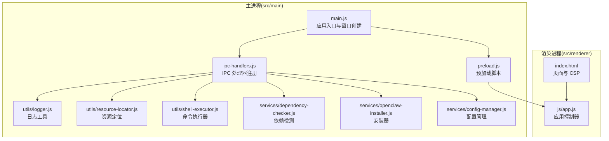
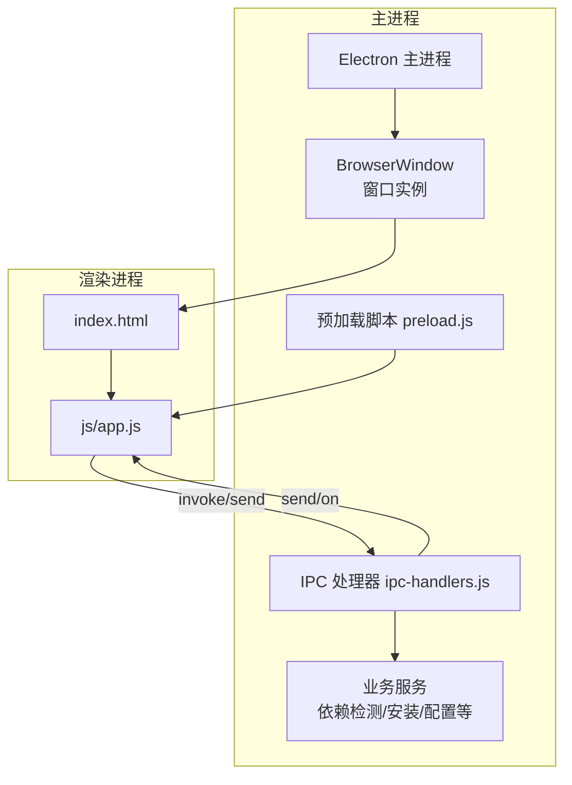
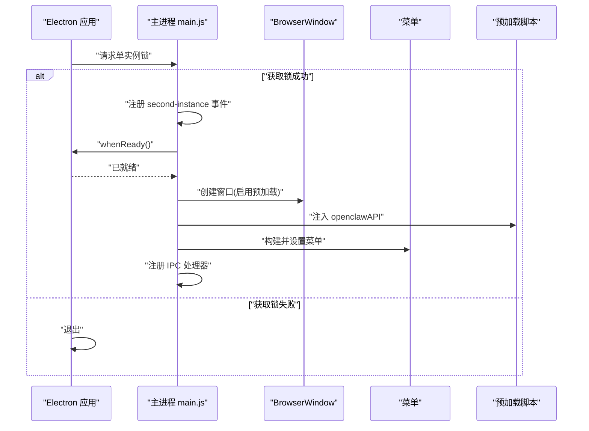
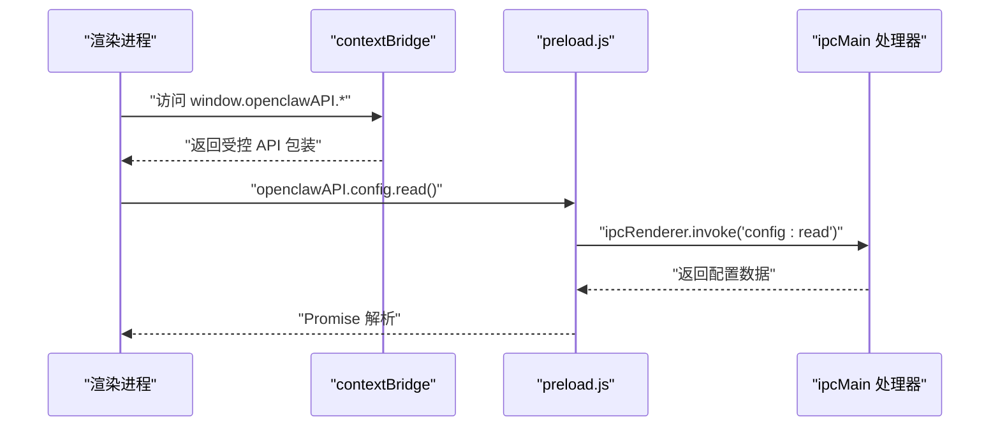
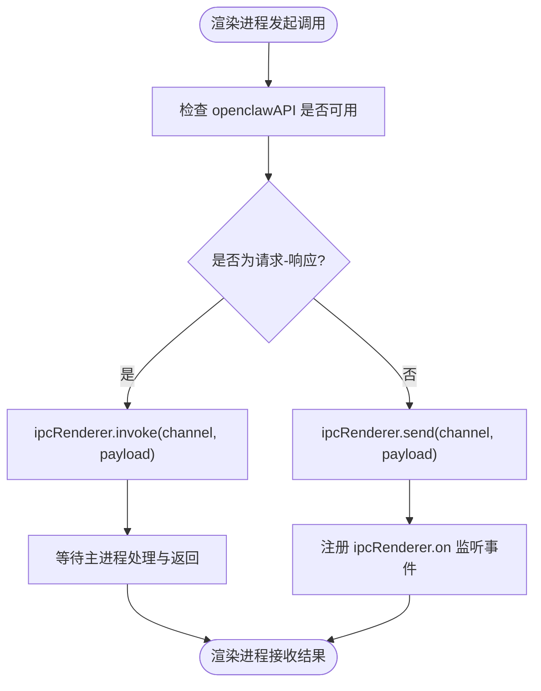
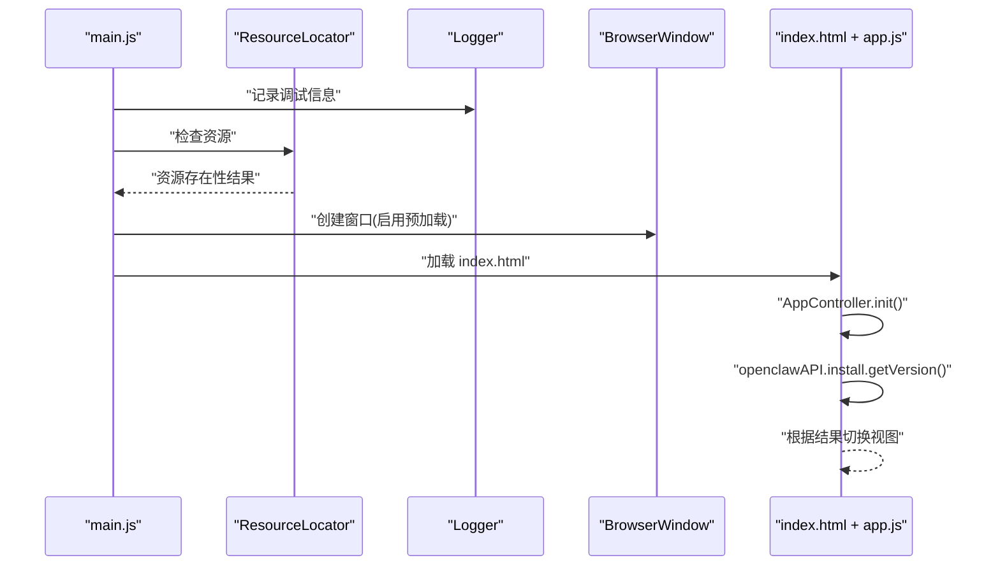
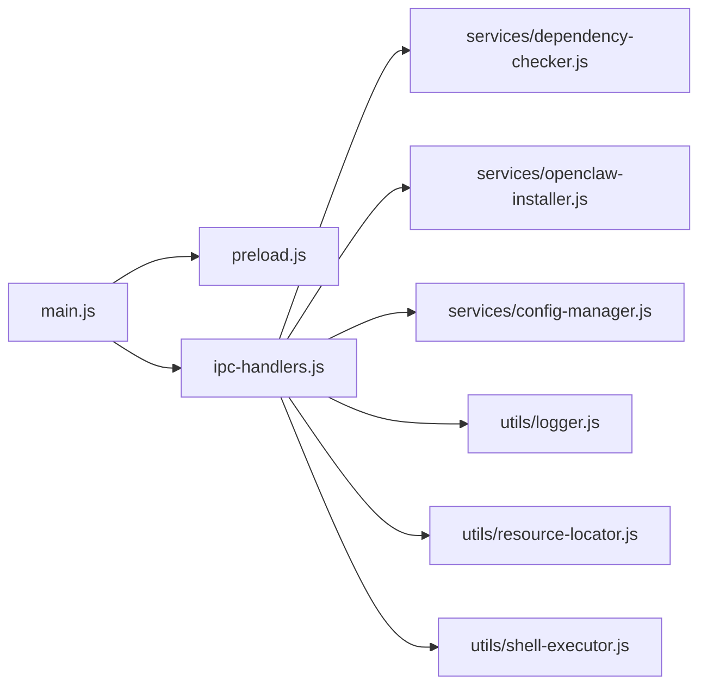

# 架构概览

<cite>
**本文引用的文件**
- [src/main/main.js](file://src/main/main.js)
- [src/main/preload.js](file://src/main/preload.js)
- [src/main/ipc-handlers.js](file://src/main/ipc-handlers.js)
- [src/renderer/index.html](file://src/renderer/index.html)
- [src/renderer/js/app.js](file://src/renderer/js/app.js)
- [src/main/utils/logger.js](file://src/main/utils/logger.js)
- [src/main/utils/resource-locator.js](file://src/main/utils/resource-locator.js)
- [src/main/utils/shell-executor.js](file://src/main/utils/shell-executor.js)
- [src/main/services/dependency-checker.js](file://src/main/services/dependency-checker.js)
- [src/main/services/openclaw-installer.js](file://src/main/services/openclaw-installer.js)
- [src/main/services/config-manager.js](file://src/main/services/config-manager.js)
- [package.json](file://package.json)
- [electron-builder.yml](file://electron-builder.yml)
</cite>

## 目录
1. [简介](#简介)
2. [项目结构](#项目结构)
3. [核心组件](#核心组件)
4. [架构总览](#架构总览)
5. [详细组件分析](#详细组件分析)
6. [依赖关系分析](#依赖关系分析)
7. [性能考量](#性能考量)
8. [故障排查指南](#故障排查指南)
9. [结论](#结论)
10. [附录](#附录)

## 简介
本项目是一个基于 Electron 的桌面应用，提供 OpenClaw 的安装、配置、服务管理、聊天与技能管理等功能。应用采用主进程与渲染进程分离的架构，通过预加载脚本与 IPC 实现安全可控的跨进程通信。本文档从整体架构、组件职责、数据与控制流、安全策略与沙箱机制、启动流程、菜单与窗口管理、生命周期处理等方面进行系统化阐述，并给出架构决策的技术考量与优化建议。

## 项目结构
项目采用按职责分层的组织方式：
- 主进程相关：src/main 下包含入口、预加载、IPC 注册、工具与服务模块
- 渲染进程相关：src/renderer 下包含 HTML 页面与前端逻辑
- 构建与打包：package.json 与 electron-builder.yml 配置构建产物与资源

**图表来源**
- [src/main/main.js:1-121](file://src/main/main.js#L1-L121)
- [src/main/preload.js:1-239](file://src/main/preload.js#L1-L239)
- [src/main/ipc-handlers.js:1-800](file://src/main/ipc-handlers.js#L1-L800)
- [src/renderer/index.html:1-127](file://src/renderer/index.html#L1-L127)
- [src/renderer/js/app.js:1-72](file://src/renderer/js/app.js#L1-L72)

**章节来源**
- [src/main/main.js:1-121](file://src/main/main.js#L1-L121)
- [src/renderer/index.html:1-127](file://src/renderer/index.html#L1-L127)
- [package.json:1-75](file://package.json#L1-L75)
- [electron-builder.yml:1-53](file://electron-builder.yml#L1-L53)

## 核心组件
- 主进程入口与窗口管理：负责应用生命周期、单实例锁、菜单、窗口创建与事件绑定
- 预加载脚本：通过 contextBridge 暴露受控 API 至渲染进程，实现上下文隔离与安全桥接
- IPC 处理器：集中注册各类 IPC 通道，封装业务服务调用与事件广播
- 日志工具：统一日志格式与落盘，便于排障
- 资源定位：适配开发与打包环境的资源路径差异
- 命令执行器：统一处理跨平台命令执行、编码解码与超时控制
- 服务模块：依赖检测、安装器、配置管理等业务能力

**章节来源**
- [src/main/main.js:48-101](file://src/main/main.js#L48-L101)
- [src/main/preload.js:3-238](file://src/main/preload.js#L3-L238)
- [src/main/ipc-handlers.js:26-51](file://src/main/ipc-handlers.js#L26-L51)
- [src/main/utils/logger.js:1-75](file://src/main/utils/logger.js#L1-L75)
- [src/main/utils/resource-locator.js:1-146](file://src/main/utils/resource-locator.js#L1-L146)
- [src/main/utils/shell-executor.js:62-200](file://src/main/utils/shell-executor.js#L62-L200)
- [src/main/services/dependency-checker.js:133-191](file://src/main/services/dependency-checker.js#L133-L191)
- [src/main/services/openclaw-installer.js:10-115](file://src/main/services/openclaw-installer.js#L10-L115)
- [src/main/services/config-manager.js:6-75](file://src/main/services/config-manager.js#L6-L75)

## 架构总览
应用采用“主进程 + 渲染进程”的经典 Electron 架构，辅以预加载脚本与 IPC 通道实现安全的数据与控制流。

**图表来源**
- [src/main/main.js:48-101](file://src/main/main.js#L48-L101)
- [src/main/preload.js:3-238](file://src/main/preload.js#L3-L238)
- [src/main/ipc-handlers.js:26-51](file://src/main/ipc-handlers.js#L26-L51)
- [src/renderer/index.html:1-127](file://src/renderer/index.html#L1-L127)
- [src/renderer/js/app.js:1-72](file://src/renderer/js/app.js#L1-L72)

## 详细组件分析

### 主进程与窗口管理
- 单实例锁：防止重复启动，第二实例聚焦已有窗口
- 窗口创建：启用最小尺寸、背景色、图标、预加载脚本与上下文隔离
- 菜单系统：基础菜单项（文件、视图、帮助），开发者工具与刷新快捷键
- 生命周期：ready、window-all-closed、second-instance 等事件处理

**图表来源**
- [src/main/main.js:103-121](file://src/main/main.js#L103-L121)
- [src/main/main.js:48-101](file://src/main/main.js#L48-L101)

**章节来源**
- [src/main/main.js:103-121](file://src/main/main.js#L103-L121)
- [src/main/main.js:48-101](file://src/main/main.js#L48-L101)

### 预加载脚本与上下文隔离
- 通过 contextBridge.exposeInMainWorld 暴露受限 API 对象 openclawAPI
- 将 IPC 调用封装为 Promise 或事件监听接口，供渲染进程调用
- 支持 invoke/send 双向通信，分别用于请求-响应与事件推送

**图表来源**
- [src/main/preload.js:3-238](file://src/main/preload.js#L3-L238)
- [src/main/ipc-handlers.js:208-210](file://src/main/ipc-handlers.js#L208-L210)

**章节来源**
- [src/main/preload.js:3-238](file://src/main/preload.js#L3-L238)

### IPC 通信机制与安全策略
- 预加载脚本提供统一 API，渲染进程通过 openclawAPI 调用
- 主进程集中注册 ipcMain.handle 与 ipcMain.on，实现请求-响应与事件订阅
- 上下文隔离开启，禁用 nodeIntegration，预加载脚本作为可信桥接层
- Content-Security-Policy 限制脚本与样式来源，降低 XSS 风险

**图表来源**
- [src/main/preload.js:3-238](file://src/main/preload.js#L3-L238)
- [src/main/ipc-handlers.js:26-51](file://src/main/ipc-handlers.js#L26-L51)
- [src/renderer/index.html](file://src/renderer/index.html#L6)

**章节来源**
- [src/main/ipc-handlers.js:26-51](file://src/main/ipc-handlers.js#L26-L51)
- [src/renderer/index.html](file://src/renderer/index.html#L6)

### 应用启动流程
- 主进程启动：单实例锁校验、资源检查、调试信息写入
- 窗口创建：设置 webPreferences（预加载、上下文隔离）、加载 index.html
- 菜单与 IPC：构建菜单、注册 IPC 处理器
- 渲染进程初始化：根据是否已安装 OpenClaw 决定显示向导或仪表盘

**图表来源**
- [src/main/main.js:9-44](file://src/main/main.js#L9-L44)
- [src/main/main.js:48-101](file://src/main/main.js#L48-L101)
- [src/main/utils/resource-locator.js:124-142](file://src/main/utils/resource-locator.js#L124-L142)
- [src/main/utils/logger.js:45-71](file://src/main/utils/logger.js#L45-L71)
- [src/renderer/js/app.js:6-27](file://src/renderer/js/app.js#L6-L27)

**章节来源**
- [src/main/main.js:9-44](file://src/main/main.js#L9-L44)
- [src/main/main.js:48-101](file://src/main/main.js#L48-L101)
- [src/renderer/js/app.js:6-27](file://src/renderer/js/app.js#L6-L27)

### 菜单系统与窗口管理
- 菜单模板定义：文件（退出）、视图（开发者工具、刷新）、帮助（打开官网）
- 窗口事件：ready-to-show 控制显示时机，closed 清理引用
- 单实例聚焦：第二实例触发时恢复并聚焦主窗口

**章节来源**
- [src/main/main.js:76-98](file://src/main/main.js#L76-L98)
- [src/main/main.js:68-75](file://src/main/main.js#L68-L75)
- [src/main/main.js:108-113](file://src/main/main.js#L108-L113)

### 应用生命周期处理
- whenReady：应用就绪后创建窗口
- window-all-closed：关闭最后一个窗口时退出应用
- single-instance：第二实例启动时聚焦已有窗口

**章节来源**
- [src/main/main.js:115-120](file://src/main/main.js#L115-L120)
- [src/main/main.js:103-113](file://src/main/main.js#L103-L113)

### 架构决策与技术考量
- 主/渲染分离：职责清晰，渲染进程专注 UI，主进程负责系统交互与安全
- 预加载 + contextBridge：在保持上下文隔离的同时提供受控 API，兼顾易用性与安全性
- IPC 分层：将业务服务封装在主进程，渲染进程只通过 API 调用，降低 XSS 与注入风险
- 资源定位与打包适配：统一资源路径解析，兼容开发与打包环境
- 命令执行器：统一处理跨平台命令、编码解码与超时，提升稳定性
- 日志系统：统一格式与清理策略，便于问题定位

**章节来源**
- [src/main/preload.js:3-238](file://src/main/preload.js#L3-L238)
- [src/main/ipc-handlers.js:26-51](file://src/main/ipc-handlers.js#L26-L51)
- [src/main/utils/resource-locator.js:10-34](file://src/main/utils/resource-locator.js#L10-L34)
- [src/main/utils/shell-executor.js:62-127](file://src/main/utils/shell-executor.js#L62-L127)
- [src/main/utils/logger.js:27-43](file://src/main/utils/logger.js#L27-L43)

## 依赖关系分析
主进程各模块之间的依赖关系如下：

**图表来源**
- [src/main/main.js:1-7](file://src/main/main.js#L1-L7)
- [src/main/ipc-handlers.js:1-25](file://src/main/ipc-handlers.js#L1-L25)

**章节来源**
- [src/main/main.js:1-7](file://src/main/main.js#L1-L7)
- [src/main/ipc-handlers.js:1-25](file://src/main/ipc-handlers.js#L1-L25)

## 性能考量
- 预加载脚本最小化：仅暴露必要 API，减少渲染进程与主进程的耦合
- IPC 调用批量化：对高频操作（如日志、进度）采用事件聚合，避免过多小消息
- 资源路径缓存：依赖检测与安装器使用缓存与并行检测，缩短等待时间
- 命令执行超时与编码处理：避免长时间阻塞与乱码导致的解析成本
- 窗口延迟显示：ready-to-show 后再显示，提升首屏体验

[本节为通用性能建议，无需具体文件引用]

## 故障排查指南
- 日志定位：通过日志工具记录 INFO/WARN/ERROR 级别信息，结合时间戳与清理策略定位问题
- 资源检查：确认资源定位工具在打包与开发环境下的路径解析正确
- 命令执行：关注编码解码与超时处理，必要时调整超时阈值
- IPC 调用：核对通道命名与参数类型，确保渲染进程与主进程约定一致

**章节来源**
- [src/main/utils/logger.js:45-71](file://src/main/utils/logger.js#L45-L71)
- [src/main/utils/resource-locator.js:124-142](file://src/main/utils/resource-locator.js#L124-L142)
- [src/main/utils/shell-executor.js:34-60](file://src/main/utils/shell-executor.js#L34-L60)
- [src/main/ipc-handlers.js:26-51](file://src/main/ipc-handlers.js#L26-L51)

## 结论
该 Electron 应用通过明确的主/渲染分离、预加载脚本与 IPC 通道，实现了安全、可维护且功能丰富的桌面应用。架构在保证上下文隔离与 CSP 限制的前提下，提供了完善的安装、配置、服务与聊天管理能力。未来可在 IPC 事件聚合、依赖检测缓存策略与命令执行器超时配置方面进一步优化，以获得更佳的用户体验与稳定性。

## 附录
- 构建配置：package.json 与 electron-builder.yml 定义了打包目标、输出目录、额外资源与语言包
- 资源清单：resources 目录下的技能与安装包资源在构建时被复制到应用资源中

**章节来源**
- [package.json:18-60](file://package.json#L18-L60)
- [electron-builder.yml:10-17](file://electron-builder.yml#L10-L17)
- [electron-builder.yml:26-31](file://electron-builder.yml#L26-L31)