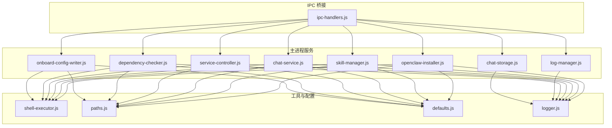
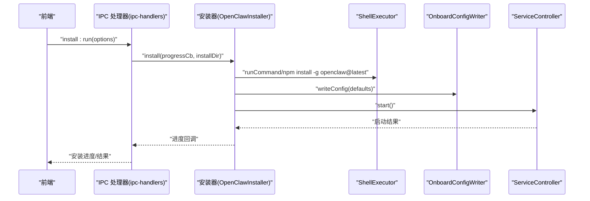
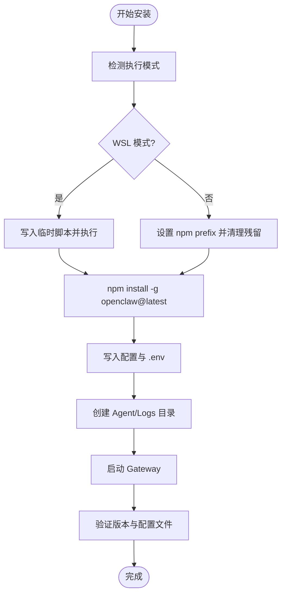
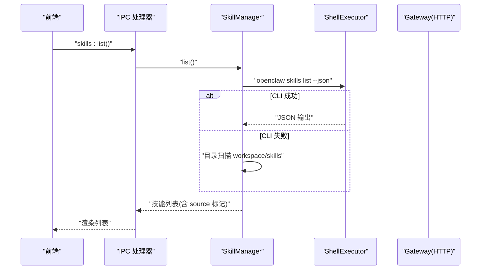
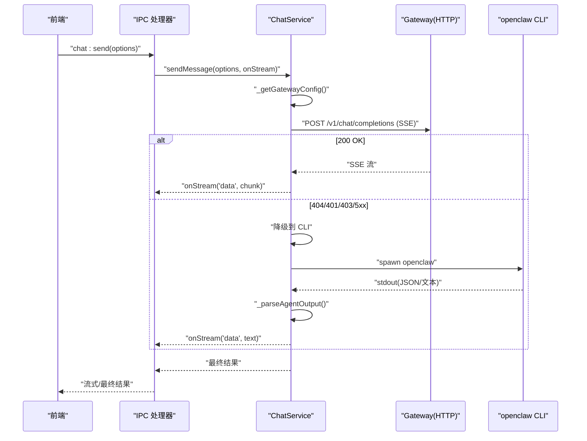
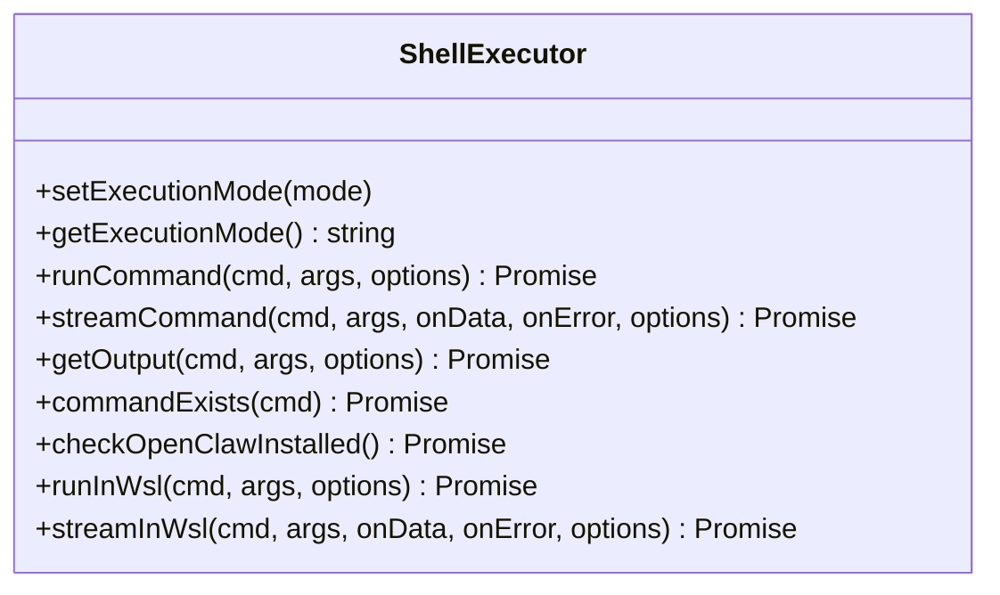
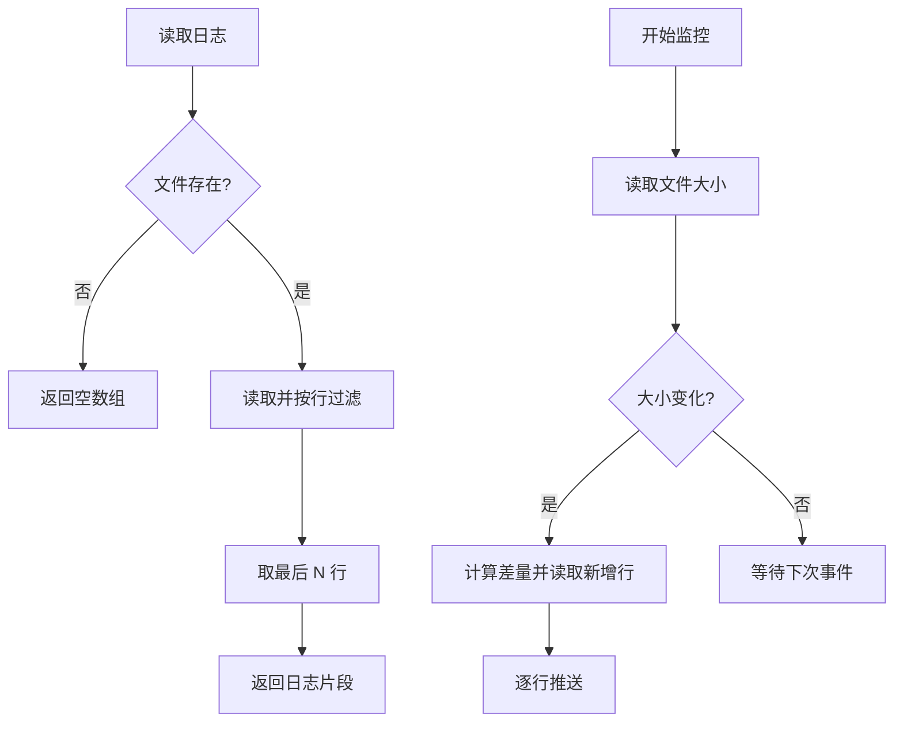
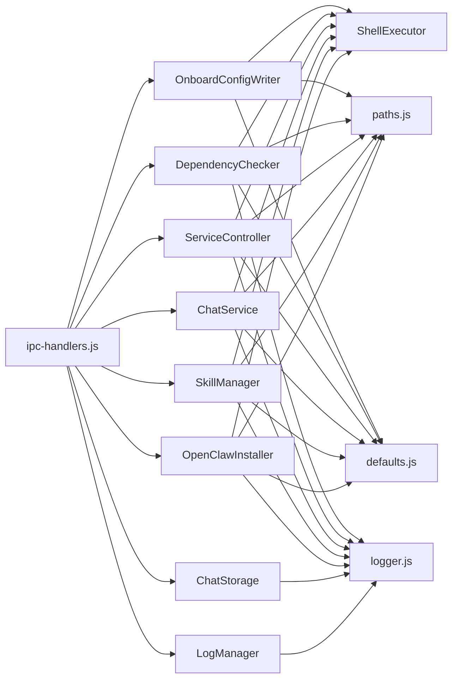

# 核心模块

<cite>
**本文档引用的文件**
- [openclaw-installer.js](file://src/main/services/openclaw-installer.js)
- [skill-manager.js](file://src/main/services/skill-manager.js)
- [chat-service.js](file://src/main/services/chat-service.js)
- [shell-executor.js](file://src/main/utils/shell-executor.js)
- [log-manager.js](file://src/main/services/log-manager.js)
- [chat-storage.js](file://src/main/services/chat-storage.js)
- [dependency-checker.js](file://src/main/services/dependency-checker.js)
- [service-controller.js](file://src/main/services/service-controller.js)
- [onboard-config-writer.js](file://src/main/services/onboard-config-writer.js)
- [paths.js](file://src/main/utils/paths.js)
- [defaults.js](file://src/main/config/defaults.js)
- [ipc-handlers.js](file://src/main/ipc-handlers.js)
- [logger.js](file://src/main/utils/logger.js)
</cite>

## 目录
1. [简介](#简介)
2. [项目结构](#项目结构)
3. [核心组件](#核心组件)
4. [架构总览](#架构总览)
5. [详细组件分析](#详细组件分析)
6. [依赖分析](#依赖分析)
7. [性能考虑](#性能考虑)
8. [故障排查指南](#故障排查指南)
9. [结论](#结论)
10. [附录](#附录)

## 简介
本文件面向 OpenClaw 安装器与核心服务模块，系统性解析以下方面：
- 安装器的服务架构：安装流程控制、依赖检测与错误处理
- 技能管理器：技能发现、安装、配置与卸载的完整生命周期
- 聊天服务：消息处理、会话管理与流式响应机制
- Shell 执行器：跨平台命令执行、路径处理、权限管理与输出捕获
- 日志系统：日志级别、格式化与持久化策略
- 模块间依赖关系与数据流

## 项目结构
核心模块主要分布在 src/main/services 与 src/main/utils 目录，配合 src/main/config 与 src/main/ipc-handlers.js 提供 IPC 接口桥接。

图表来源
- [ipc-handlers.js:26-816](file://src/main/ipc-handlers.js#L26-L816)
- [openclaw-installer.js:1-780](file://src/main/services/openclaw-installer.js#L1-L780)
- [skill-manager.js:1-1096](file://src/main/services/skill-manager.js#L1-L1096)
- [chat-service.js:1-1345](file://src/main/services/chat-service.js#L1-L1345)
- [service-controller.js:1-1101](file://src/main/services/service-controller.js#L1-L1101)
- [dependency-checker.js:1-1526](file://src/main/services/dependency-checker.js#L1-L1526)
- [log-manager.js:1-169](file://src/main/services/log-manager.js#L1-L169)
- [chat-storage.js:1-333](file://src/main/services/chat-storage.js#L1-L333)
- [onboard-config-writer.js:1-521](file://src/main/services/onboard-config-writer.js#L1-L521)
- [shell-executor.js:1-471](file://src/main/utils/shell-executor.js#L1-L471)
- [paths.js:1-124](file://src/main/utils/paths.js#L1-L124)
- [defaults.js:1-180](file://src/main/config/defaults.js#L1-L180)
- [logger.js:1-75](file://src/main/utils/logger.js#L1-L75)

章节来源
- [ipc-handlers.js:26-816](file://src/main/ipc-handlers.js#L26-L816)
- [openclaw-installer.js:1-780](file://src/main/services/openclaw-installer.js#L1-L780)
- [skill-manager.js:1-1096](file://src/main/services/skill-manager.js#L1-L1096)
- [chat-service.js:1-1345](file://src/main/services/chat-service.js#L1-L1345)
- [service-controller.js:1-1101](file://src/main/services/service-controller.js#L1-L1101)
- [dependency-checker.js:1-1526](file://src/main/services/dependency-checker.js#L1-L1526)
- [log-manager.js:1-169](file://src/main/services/log-manager.js#L1-L169)
- [chat-storage.js:1-333](file://src/main/services/chat-storage.js#L1-L333)
- [onboard-config-writer.js:1-521](file://src/main/services/onboard-config-writer.js#L1-L521)
- [shell-executor.js:1-471](file://src/main/utils/shell-executor.js#L1-L471)
- [paths.js:1-124](file://src/main/utils/paths.js#L1-L124)
- [defaults.js:1-180](file://src/main/config/defaults.js#L1-L180)
- [logger.js:1-75](file://src/main/utils/logger.js#L1-L75)

## 核心组件
- 安装器（OpenClawInstaller）：负责版本检测、安装/更新、配置写入、Gateway 启动与验证
- 技能管理器（SkillManager）：封装 openclaw CLI 与 Gateway API，提供技能的增删改查与搜索
- 聊天服务（ChatService）：优先使用 Gateway HTTP SSE，降级到 CLI 模式，支持会话与流式输出
- Shell 执行器（ShellExecutor）：跨平台命令执行、编码解码、WSL/wsl 包装、命令存在性检测
- 日志管理（LogManager）：日志读取、实时监控与可用日志枚举
- 会话存储（ChatStorage）：会话持久化、分页加载、知识库与统计
- 依赖检测（DependencyChecker）：Node/npm/Git/WSL 检测与安装
- 服务控制器（ServiceController）：Gateway 启停、状态查询、环境构建
- 引导配置写入（OnboardConfigWriter）：GUI 表单到 openclaw.json/.env 的转换与写入
- 路径与默认配置（paths.js、defaults.js）：统一路径与超时/网络参数
- 日志工具（logger.js）：统一日志格式与落盘

章节来源
- [openclaw-installer.js:10-780](file://src/main/services/openclaw-installer.js#L10-L780)
- [skill-manager.js:9-1096](file://src/main/services/skill-manager.js#L9-L1096)
- [chat-service.js:92-1345](file://src/main/services/chat-service.js#L92-L1345)
- [shell-executor.js:62-471](file://src/main/utils/shell-executor.js#L62-L471)
- [log-manager.js:14-169](file://src/main/services/log-manager.js#L14-L169)
- [chat-storage.js:15-333](file://src/main/services/chat-storage.js#L15-L333)
- [dependency-checker.js:133-1526](file://src/main/services/dependency-checker.js#L133-L1526)
- [service-controller.js:82-1101](file://src/main/services/service-controller.js#L82-L1101)
- [onboard-config-writer.js:8-521](file://src/main/services/onboard-config-writer.js#L8-L521)
- [paths.js:1-124](file://src/main/utils/paths.js#L1-L124)
- [defaults.js:1-180](file://src/main/config/defaults.js#L1-L180)
- [logger.js:7-75](file://src/main/utils/logger.js#L7-L75)

## 架构总览
OpenClaw 安装器通过 ShellExecutor 在 Windows 原生或 WSL 模式下执行 npm 安装与命令，随后使用 OnboardConfigWriter 写入 openclaw.json 与 .env，ServiceController 启动 Gateway，OpenClawInstaller 验证安装并补齐缺失的 README.md。技能管理器通过 openclaw CLI 与 Gateway API 管理技能；聊天服务优先走 Gateway HTTP SSE，失败时降级到 CLI 模式；LogManager 与 ChatStorage 提供日志与会话持久化；DependencyChecker 负责依赖检测与安装；IPC 桥接将前端交互映射到各服务。

图表来源
- [ipc-handlers.js:177-195](file://src/main/ipc-handlers.js#L177-L195)
- [openclaw-installer.js:117-438](file://src/main/services/openclaw-installer.js#L117-L438)
- [shell-executor.js:136-197](file://src/main/utils/shell-executor.js#L136-L197)
- [onboard-config-writer.js:349-376](file://src/main/services/onboard-config-writer.js#L349-L376)
- [service-controller.js:123-132](file://src/main/services/service-controller.js#L123-L132)

## 详细组件分析

### 安装器（OpenClawInstaller）
- 版本检测：优先通过 ShellExecutor.checkOpenClawInstalled 判断配置目录存在性，其次尝试 openclaw --version，最后回退读取 ~/.openclaw/openclaw.json
- 安装流程：WSL 模式下写入临时脚本并通过 wsl 执行；原生模式下设置 npm prefix、清理残留、执行 npm install，并写入配置与 .env
- 配置写入：使用 OnboardConfigWriter.createConfigDir 与 writeConfig 写入 openclaw.json 与 .env，同时创建 agent 目录与必要文件
- Gateway 启动：通过 ServiceController.start 并设置较长超时，验证安装与配置文件完整性
- 更新与镜像：支持 npm registry 切换镜像源；更新后补齐 extensions 目录缺失的 README.md

图表来源
- [openclaw-installer.js:117-438](file://src/main/services/openclaw-installer.js#L117-L438)
- [onboard-config-writer.js:333-376](file://src/main/services/onboard-config-writer.js#L333-L376)
- [service-controller.js:123-364](file://src/main/services/service-controller.js#L123-L364)

章节来源
- [openclaw-installer.js:24-115](file://src/main/services/openclaw-installer.js#L24-L115)
- [openclaw-installer.js:117-438](file://src/main/services/openclaw-installer.js#L117-L438)
- [openclaw-installer.js:440-532](file://src/main/services/openclaw-installer.js#L440-L532)
- [openclaw-installer.js:534-777](file://src/main/services/openclaw-installer.js#L534-L777)

### 技能管理器（SkillManager）
- 列表与缓存：优先使用 openclaw skills list --json，解析 CLI 输出或回退目录扫描；缓存 60 秒
- 安装/卸载/启用/禁用：调用 openclaw CLI 或直接操作文件系统；对自定义技能在 workspace/skills 与 skills-disabled 目录间移动
- 搜索与探索：使用 npx clawhub 搜索与浏览，处理速率限制
- Gateway API：对某些操作（如删除）优先尝试 Gateway API，失败再回退文件系统

图表来源
- [ipc-handlers.js:542-545](file://src/main/ipc-handlers.js#L542-L545)
- [skill-manager.js:133-326](file://src/main/services/skill-manager.js#L133-L326)
- [skill-manager.js:373-398](file://src/main/services/skill-manager.js#L373-L398)
- [skill-manager.js:404-448](file://src/main/services/skill-manager.js#L404-L448)

章节来源
- [skill-manager.js:133-326](file://src/main/services/skill-manager.js#L133-L326)
- [skill-manager.js:373-398](file://src/main/services/skill-manager.js#L373-L398)
- [skill-manager.js:404-448](file://src/main/services/skill-manager.js#L404-L448)
- [skill-manager.js:599-648](file://src/main/services/skill-manager.js#L599-L648)
- [skill-manager.js:654-681](file://src/main/services/skill-manager.js#L654-L681)
- [skill-manager.js:687-706](file://src/main/services/skill-manager.js#L687-L706)
- [skill-manager.js:711-737](file://src/main/services/skill-manager.js#L711-L737)
- [skill-manager.js:742-768](file://src/main/services/skill-manager.js#L742-L768)
- [skill-manager.js:774-799](file://src/main/services/skill-manager.js#L774-L799)

### 聊天服务（ChatService）
- Gateway 优先：通过 HTTP POST /v1/chat/completions 获取 SSE 流式响应；失败时探测 404/401/403/5xx 并降级
- CLI 降级：解析 openclaw Agent 输出 JSON，提取 payloads/text/meta/error；支持模拟流式输出
- 会话管理：读取 openclaw.json 获取 Gateway 配置；维护 sessions Map；支持从 .openclaw 会话文件回溯最后一条 assistant 消息
- 环境构建：从 .env 与配置注入 API Key；构建 PATH 包含 npm/global 与 nvm 等路径；支持 Windows 系统命令完整路径

图表来源
- [ipc-handlers.js:712-725](file://src/main/ipc-handlers.js#L712-L725)
- [chat-service.js:347-536](file://src/main/services/chat-service.js#L347-L536)
- [chat-service.js:542-588](file://src/main/services/chat-service.js#L542-L588)
- [chat-service.js:593-733](file://src/main/services/chat-service.js#L593-L733)
- [chat-service.js:743-799](file://src/main/services/chat-service.js#L743-L799)

章节来源
- [chat-service.js:92-182](file://src/main/services/chat-service.js#L92-L182)
- [chat-service.js:347-536](file://src/main/services/chat-service.js#L347-L536)
- [chat-service.js:542-588](file://src/main/services/chat-service.js#L542-L588)
- [chat-service.js:593-733](file://src/main/services/chat-service.js#L593-L733)
- [chat-service.js:743-799](file://src/main/services/chat-service.js#L743-L799)

### Shell 执行器（ShellExecutor）
- 执行模式：支持 'native' 与 'wsl'，通过配置文件持久化；WSL 模式下使用 wsl --exec 避免 PATH 问题
- 命令执行：runCommand/streamCommand 统一超时、缓冲区处理与编码解码；支持 forceNative 强制原生命令包装
- 命令存在性：commandExists 在 WSL 模式下通过 which，在原生模式下通过 PATH 合并检测
- 安装检测：checkOpenClawInstalled 通过 ~/.openclaw 目录存在性与内容校验判断安装状态

图表来源
- [shell-executor.js:62-471](file://src/main/utils/shell-executor.js#L62-L471)

章节来源
- [shell-executor.js:62-197](file://src/main/utils/shell-executor.js#L62-L197)
- [shell-executor.js:208-281](file://src/main/utils/shell-executor.js#L208-L281)
- [shell-executor.js:286-296](file://src/main/utils/shell-executor.js#L286-L296)
- [shell-executor.js:301-350](file://src/main/utils/shell-executor.js#L301-L350)
- [shell-executor.js:356-404](file://src/main/utils/shell-executor.js#L356-L404)
- [shell-executor.js:448-467](file://src/main/utils/shell-executor.js#L448-L467)

### 日志管理（LogManager）
- 读取：按行读取指定日志类型（app/gateway/installer），过滤空行
- 实时监控：基于 chokidar 监控日志文件变化，增量推送新行
- 可用日志：扫描 OPENCLAW_HOME 与 LOGS_DIR 下的 .log 文件

图表来源
- [log-manager.js:42-85](file://src/main/services/log-manager.js#L42-L85)
- [log-manager.js:87-131](file://src/main/services/log-manager.js#L87-L131)
- [log-manager.js:142-165](file://src/main/services/log-manager.js#L142-L165)

章节来源
- [log-manager.js:14-169](file://src/main/services/log-manager.js#L14-L169)

### 会话存储（ChatStorage）
- 目录：~/.openclaw/chat-sessions 与 chat-summaries
- 会话：保存/加载/分页加载/删除；自动生成标题；统计消息数与字符数
- 总结与知识库：保存会话总结，追加到知识库并去重

章节来源
- [chat-storage.js:15-333](file://src/main/services/chat-storage.js#L15-L333)

### 依赖检测（DependencyChecker）
- 检测：Node.js、npm、Git、WSL；并行检测 npm/git（依赖 Node 检测结果）
- 安装：Git 支持内置安装包或下载安装；Node 在 WSL 模式下支持安装
- 路径刷新：通过 PowerShell 读取 User/Machine PATH，注入进程环境

章节来源
- [dependency-checker.js:149-191](file://src/main/services/dependency-checker.js#L149-L191)
- [dependency-checker.js:196-229](file://src/main/services/dependency-checker.js#L196-L229)
- [dependency-checker.js:244-382](file://src/main/services/dependency-checker.js#L244-L382)
- [dependency-checker.js:390-524](file://src/main/services/dependency-checker.js#L390-L524)
- [dependency-checker.js:529-664](file://src/main/services/dependency-checker.js#L529-L664)
- [dependency-checker.js:702-781](file://src/main/services/dependency-checker.js#L702-L781)
- [dependency-checker.js:786-850](file://src/main/services/dependency-checker.js#L786-L850)

### 服务控制器（ServiceController）
- 启动：原生模式优先使用 ~/.openclaw/gateway.cmd；否则通过 openclaw gateway run；支持 detached 与环境变量注入
- 停止：taskkill /T 终止进程树；清理 PID 文件
- 状态：netstat 查询端口；读取 PID 文件；WSL 模式通过脚本查询
- 环境构建：优先包含 node.exe 目录与 nvm/fnm 等版本管理器路径；注入 .env 变量

章节来源
- [service-controller.js:123-364](file://src/main/services/service-controller.js#L123-L364)
- [service-controller.js:554-636](file://src/main/services/service-controller.js#L554-L636)
- [service-controller.js:654-732](file://src/main/services/service-controller.js#L654-L732)
- [service-controller.js:737-769](file://src/main/services/service-controller.js#L737-L769)
- [service-controller.js:786-800](file://src/main/services/service-controller.js#L786-L800)

### 引导配置写入（OnboardConfigWriter）
- 表单到配置：根据 provider/apiKey/baseUrl/model 等构建 models.env.gateway 等字段
- 写入：createConfigDir/writeConfig 写入 openclaw.json；writeEnvFile 写入 .env；writeAuthProfiles 写入认证配置
- 启动：installDaemon 通过 ServiceController 启动 Gateway

章节来源
- [onboard-config-writer.js:13-328](file://src/main/services/onboard-config-writer.js#L13-L328)
- [onboard-config-writer.js:333-376](file://src/main/services/onboard-config-writer.js#L333-L376)
- [onboard-config-writer.js:381-410](file://src/main/services/onboard-config-writer.js#L381-L410)
- [onboard-config-writer.js:415-456](file://src/main/services/onboard-config-writer.js#L415-L456)
- [onboard-config-writer.js:461-495](file://src/main/services/onboard-config-writer.js#L461-L495)
- [onboard-config-writer.js:500-517](file://src/main/services/onboard-config-writer.js#L500-L517)

### 路径与默认配置（paths.js、defaults.js）
- 路径：OPENCLAW_HOME、CONFIG_PATH、ENV_PATH、LOGS_DIR；支持 getNpmPrefix 优先级（进程变量 > .env > 默认）
- 默认配置：网络端口、超时、样式、路径与功能开关

章节来源
- [paths.js:26-55](file://src/main/utils/paths.js#L26-L55)
- [paths.js:84-107](file://src/main/utils/paths.js#L84-L107)
- [defaults.js:14-70](file://src/main/config/defaults.js#L14-L70)
- [defaults.js:94-124](file://src/main/config/defaults.js#L94-L124)

### 日志工具（logger.js）
- 统一日志格式：时间戳、级别、清理控制字符与 ANSI；写入 installer-manager.log

章节来源
- [logger.js:15-71](file://src/main/utils/logger.js#L15-L71)

## 依赖分析
- IPC 桥接：ipc-handlers.js 统一注册各服务的 handle/on 处理器，作为前端与后端服务的唯一入口
- 服务耦合：OpenClawInstaller 依赖 ShellExecutor、OnboardConfigWriter、ServiceController；SkillManager 依赖 ShellExecutor 与 Gateway；ChatService 依赖 ShellExecutor 与 Gateway；ServiceController 依赖 ShellExecutor 与 ConfigManager；DependencyChecker 依赖 ShellExecutor 与 WslChecker
- 外部依赖：npm、node、git、WSL、Windows 系统命令（tasklist/taskkill/netstat）

图表来源
- [ipc-handlers.js:26-816](file://src/main/ipc-handlers.js#L26-L816)
- [openclaw-installer.js:1-13](file://src/main/services/openclaw-installer.js#L1-L13)
- [skill-manager.js:1-8](file://src/main/services/skill-manager.js#L1-L8)
- [chat-service.js:14-21](file://src/main/services/chat-service.js#L14-L21)
- [service-controller.js:1-8](file://src/main/services/service-controller.js#L1-L8)
- [dependency-checker.js:14-24](file://src/main/services/dependency-checker.js#L14-L24)
- [log-manager.js:1-5](file://src/main/services/log-manager.js#L1-L5)
- [chat-storage.js:10-14](file://src/main/services/chat-storage.js#L10-L14)
- [onboard-config-writer.js:1-7](file://src/main/services/onboard-config-writer.js#L1-L7)
- [shell-executor.js:1-7](file://src/main/utils/shell-executor.js#L1-L7)
- [paths.js:1-4](file://src/main/utils/paths.js#L1-L4)
- [defaults.js:1-10](file://src/main/config/defaults.js#L1-L10)
- [logger.js:1-4](file://src/main/utils/logger.js#L1-L4)

章节来源
- [ipc-handlers.js:26-816](file://src/main/ipc-handlers.js#L26-L816)

## 性能考虑
- 超时与并发：依赖检测并行化；Gateway 探测缓存（30 秒）；技能列表缓存（30 秒）；安装/更新超时（30 分钟）
- I/O 优化：LogManager 增量监控；ChatStorage 分页加载；ShellExecutor 缓冲区按行处理
- 启动优化：ServiceController 先 validate/fix 配置，再启动；Gateway 启动超时 60 秒；WSL 模式通过脚本启动

## 故障排查指南
- 安装失败：检查 npm registry 设置、安装目录权限、PATH 是否包含 npm/global；查看 installer-manager.log
- Gateway 启动失败：检查 openclaw.json 配置、端口占用、doctor --fix；查看 gateway.log
- 聊天无响应：确认 Gateway 可达；若 404/401/403/5xx，服务会降级到 CLI；查看 app.log
- 技能安装失败：检查 clawhub 可用性与速率限制；查看技能管理器日志
- 依赖缺失：使用 DependencyChecker.checkAll 与 install-* 接口修复

章节来源
- [service-controller.js:287-359](file://src/main/services/service-controller.js#L287-L359)
- [chat-service.js:412-447](file://src/main/services/chat-service.js#L412-L447)
- [dependency-checker.js:149-191](file://src/main/services/dependency-checker.js#L149-L191)
- [log-manager.js:42-85](file://src/main/services/log-manager.js#L42-L85)

## 结论
OpenClaw 安装器与核心服务模块采用清晰的职责分离与稳健的错误处理策略：安装器负责安装与配置；技能管理器统一 CLI 与 Gateway API；聊天服务兼顾性能与兼容性；ShellExecutor 提供跨平台命令执行能力；日志与会话管理保障可观测性与可恢复性。通过 IPC 桥接，前端可无缝调用后端能力。

## 附录

### API 接口文档（节选）
- 安装器
  - getVersion(): 获取已安装版本（字符串或 null）
  - install(onProgress, installDir?): 安装 OpenClaw，支持镜像源切换与进度回调
  - update(onProgress): 更新 OpenClaw
  - setMirror(useMirror): 设置 npm registry 为镜像源
  - verifyInstallation(): 验证配置文件完整性
- 技能管理器
  - list(): 获取技能列表（含缓存）
  - listEligible(): 获取满足依赖的技能
  - install(skillId, version?): 安装技能
  - remove(skillId): 删除技能（优先 Gateway API，失败回退文件系统）
  - enable/disable(skillId): 启用/禁用技能（自定义技能移动目录，系统技能通过 CLI 配置）
  - search/query: 搜索与浏览技能市场
  - getInfo(skillId): 获取技能信息
  - update(skillId): 更新技能
  - listInstalled()/inspect(skillId): 已安装技能与详情
- 聊天服务
  - sendMessage(options, onStream): 通过 Gateway/SSE 发送消息，流式回调
  - sendMessageLocal(options, onStream): 本地模式（CLI）发送消息
  - listAgents()/listSkills(): 获取可用代理与技能
  - clearSession(sessionId): 清理会话
- Shell 执行器
  - setExecutionMode(mode)/getExecutionMode(): 设置/获取执行模式
  - runCommand/cmd/streamCommand(): 执行命令并返回输出/流式输出
  - commandExists(cmd): 检查命令是否存在
  - checkOpenClawInstalled(): 检查 OpenClaw 安装状态
- 日志管理
  - read(logType, lines): 读取日志片段
  - getLogInfo(logType): 获取日志信息
  - startWatch/logMgr.stopWatch(): 实时监控日志
  - getAvailableLogs(): 获取可用日志列表
- 会话存储
  - saveSession/loadSession/loadSessionMessages(): 保存/加载/分页加载会话
  - listRecentSessions()/deleteSession(): 最近会话与删除
  - saveSummary/getKnowledgeBase()/getSessionStats(): 总结、知识库与统计
- 依赖检测
  - checkAll()/checkForMode(mode): 检测所有依赖/按模式检测
  - installNode(method, onProgress)/installGit(onProgress): 安装 Node/Git
  - installWsl()/installNodeInWsl(): 安装 WSL 与 Node（WSL）
- 服务控制器
  - start/stop/restart(onProgress): 启动/停止/重启 Gateway
  - getStatus(): 获取状态
  - setAutostart()/getAutostart()/installAutostartTask(): 自启动管理
- 引导配置写入
  - buildConfigJson(formData): 表单转配置
  - writeConfig(config)/writeEnvFile(envVars)/writeAuthProfiles(formData): 写入配置与 .env
  - writeOnboard(formData): 写入并 doctor --fix
  - installDaemon(onProgress): 启动 Gateway

章节来源
- [openclaw-installer.js:24-115](file://src/main/services/openclaw-installer.js#L24-L115)
- [openclaw-installer.js:117-438](file://src/main/services/openclaw-installer.js#L117-L438)
- [openclaw-installer.js:440-532](file://src/main/services/openclaw-installer.js#L440-L532)
- [openclaw-installer.js:600-618](file://src/main/services/openclaw-installer.js#L600-L618)
- [openclaw-installer.js:729-776](file://src/main/services/openclaw-installer.js#L729-L776)
- [skill-manager.js:133-326](file://src/main/services/skill-manager.js#L133-L326)
- [skill-manager.js:373-398](file://src/main/services/skill-manager.js#L373-L398)
- [skill-manager.js:404-448](file://src/main/services/skill-manager.js#L404-L448)
- [skill-manager.js:599-648](file://src/main/services/skill-manager.js#L599-L648)
- [skill-manager.js:654-681](file://src/main/services/skill-manager.js#L654-L681)
- [skill-manager.js:687-706](file://src/main/services/skill-manager.js#L687-L706)
- [skill-manager.js:711-737](file://src/main/services/skill-manager.js#L711-L737)
- [skill-manager.js:742-768](file://src/main/services/skill-manager.js#L742-L768)
- [skill-manager.js:774-799](file://src/main/services/skill-manager.js#L774-L799)
- [chat-service.js:347-536](file://src/main/services/chat-service.js#L347-L536)
- [chat-service.js:542-588](file://src/main/services/chat-service.js#L542-L588)
- [chat-service.js:712-725](file://src/main/services/chat-service.js#L712-L725)
- [chat-service.js:728-739](file://src/main/services/chat-service.js#L728-L739)
- [chat-service.js:742-744](file://src/main/services/chat-service.js#L742-L744)
- [chat-service.js:746-749](file://src/main/services/chat-service.js#L746-L749)
- [chat-service.js:752-754](file://src/main/services/chat-service.js#L752-L754)
- [shell-executor.js:96-108](file://src/main/utils/shell-executor.js#L96-L108)
- [shell-executor.js:103-108](file://src/main/utils/shell-executor.js#L103-L108)
- [shell-executor.js:136-197](file://src/main/utils/shell-executor.js#L136-L197)
- [shell-executor.js:208-281](file://src/main/utils/shell-executor.js#L208-L281)
- [shell-executor.js:301-350](file://src/main/utils/shell-executor.js#L301-L350)
- [shell-executor.js:356-404](file://src/main/utils/shell-executor.js#L356-L404)
- [log-manager.js:42-85](file://src/main/services/log-manager.js#L42-L85)
- [log-manager.js:87-131](file://src/main/services/log-manager.js#L87-L131)
- [log-manager.js:142-165](file://src/main/services/log-manager.js#L142-L165)
- [chat-storage.js:51-90](file://src/main/services/chat-storage.js#L51-L90)
- [chat-storage.js:98-128](file://src/main/services/chat-storage.js#L98-L128)
- [chat-storage.js:133-166](file://src/main/services/chat-storage.js#L133-L166)
- [chat-storage.js:183-194](file://src/main/services/chat-storage.js#L183-L194)
- [chat-storage.js:199-222](file://src/main/services/chat-storage.js#L199-L222)
- [chat-storage.js:257-270](file://src/main/services/chat-storage.js#L257-L270)
- [chat-storage.js:275-300](file://src/main/services/chat-storage.js#L275-L300)
- [dependency-checker.js:149-191](file://src/main/services/dependency-checker.js#L149-L191)
- [dependency-checker.js:196-229](file://src/main/services/dependency-checker.js#L196-L229)
- [dependency-checker.js:702-781](file://src/main/services/dependency-checker.js#L702-L781)
- [dependency-checker.js:786-850](file://src/main/services/dependency-checker.js#L786-L850)
- [service-controller.js:123-364](file://src/main/services/service-controller.js#L123-L364)
- [service-controller.js:554-636](file://src/main/services/service-controller.js#L554-L636)
- [service-controller.js:654-732](file://src/main/services/service-controller.js#L654-L732)
- [service-controller.js:737-769](file://src/main/services/service-controller.js#L737-L769)
- [service-controller.js:786-800](file://src/main/services/service-controller.js#L786-L800)
- [onboard-config-writer.js:461-495](file://src/main/services/onboard-config-writer.js#L461-L495)
- [onboard-config-writer.js:500-517](file://src/main/services/onboard-config-writer.js#L500-L517)