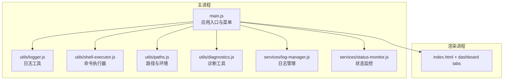
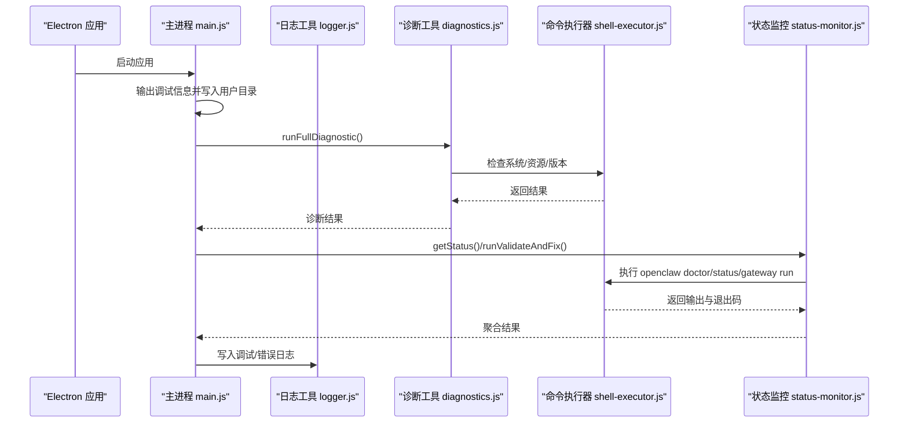
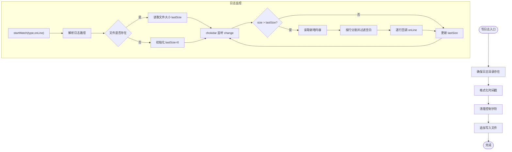
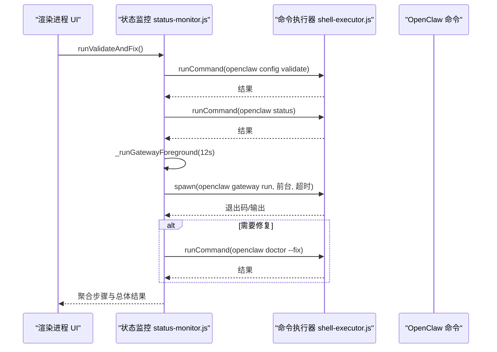
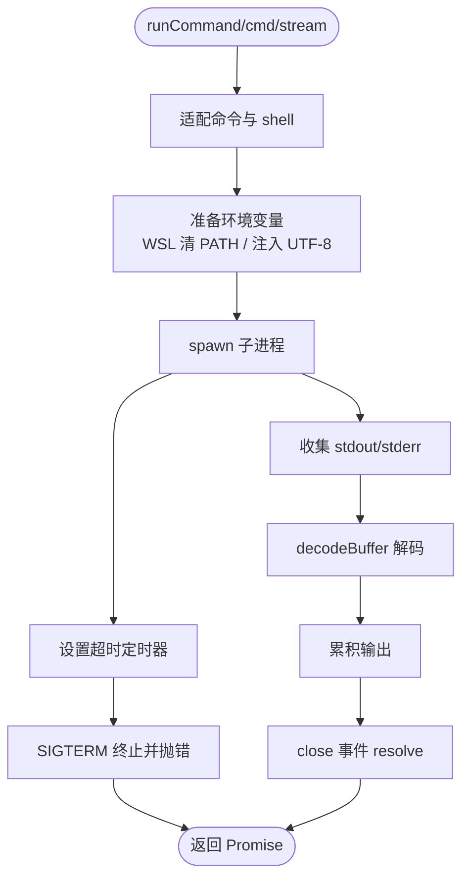
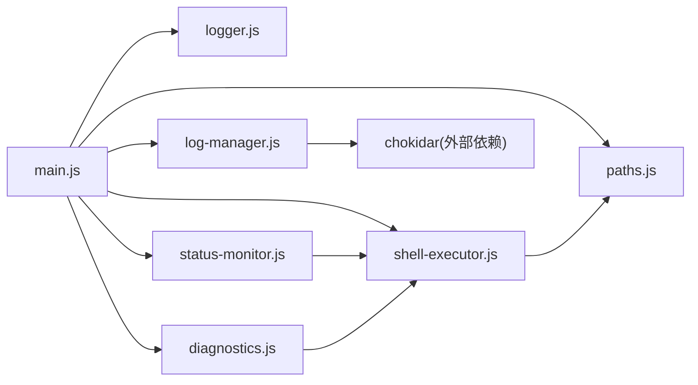

# 调试与测试

<cite>
**本文引用的文件**
- [src/main/main.js](file://src/main/main.js)
- [src/main/utils/logger.js](file://src/main/utils/logger.js)
- [src/main/services/log-manager.js](file://src/main/services/log-manager.js)
- [src/main/utils/diagnostics.js](file://src/main/utils/diagnostics.js)
- [src/main/services/status-monitor.js](file://src/main/services/status-monitor.js)
- [src/main/utils/shell-executor.js](file://src/main/utils/shell-executor.js)
- [src/main/utils/paths.js](file://src/main/utils/paths.js)
- [docs/TROUBLESHOOTING.md](file://docs/TROUBLESHOOTING.md)
- [package.json](file://package.json)
- [README.md](file://README.md)
</cite>

## 目录
1. [简介](#简介)
2. [项目结构](#项目结构)
3. [核心组件](#核心组件)
4. [架构总览](#架构总览)
5. [详细组件分析](#详细组件分析)
6. [依赖关系分析](#依赖关系分析)
7. [性能考虑](#性能考虑)
8. [故障排除指南](#故障排除指南)
9. [结论](#结论)
10. [附录](#附录)

## 简介
本文件面向开发者与运维人员，系统化阐述本项目的调试与测试策略与实践，覆盖以下主题：
- Electron 开发者工具与日志系统配置
- 错误追踪与诊断流程
- 单元测试与集成测试的编写思路与落地建议
- 性能分析与优化（内存、CPU、I/O）
- 故障排除的系统性方法
- 状态监控与健康检查
- 测试环境搭建与隔离
- 调试技巧与最佳实践

## 项目结构
本项目采用 Electron 主进程 + 渲染进程架构，核心调试与测试能力集中在主进程的工具模块与服务模块中：
- 主进程入口负责窗口创建、菜单与开发者工具开关、资源检查与调试信息落盘
- 工具模块提供日志、命令执行、路径与诊断能力
- 服务模块提供日志监控、状态监控与诊断执行

**图表来源**
- [src/main/main.js:1-121](file://src/main/main.js#L1-L121)
- [src/main/utils/logger.js:1-75](file://src/main/utils/logger.js#L1-L75)
- [src/main/utils/shell-executor.js:1-471](file://src/main/utils/shell-executor.js#L1-L471)
- [src/main/utils/paths.js:1-124](file://src/main/utils/paths.js#L1-L124)
- [src/main/utils/diagnostics.js:1-196](file://src/main/utils/diagnostics.js#L1-L196)
- [src/main/services/log-manager.js:1-169](file://src/main/services/log-manager.js#L1-L169)
- [src/main/services/status-monitor.js:1-274](file://src/main/services/status-monitor.js#L1-L274)

**章节来源**
- [README.md:36-90](file://README.md#L36-L90)
- [src/main/main.js:46-101](file://src/main/main.js#L46-L101)

## 核心组件
- 日志系统：统一写入本地日志文件，带时间戳与级别，具备清理控制字符能力
- 命令执行器：封装 spawn、编码解码、超时控制、WSL/原生模式切换、流式输出
- 诊断工具：系统环境、资源文件、OpenClaw 状态三段式诊断，生成报告
- 日志管理：读取、监听日志文件变更，支持前端实时展示
- 状态监控：运行 doctor/status/gateway run 等命令，聚合诊断与修复流程
- 路径工具：统一 HOME/配置/日志目录，支持 WSL 路径转换

**章节来源**
- [src/main/utils/logger.js:7-72](file://src/main/utils/logger.js#L7-L72)
- [src/main/utils/shell-executor.js:62-197](file://src/main/utils/shell-executor.js#L62-L197)
- [src/main/utils/diagnostics.js:14-44](file://src/main/utils/diagnostics.js#L14-L44)
- [src/main/services/log-manager.js:14-165](file://src/main/services/log-manager.js#L14-L165)
- [src/main/services/status-monitor.js:9-130](file://src/main/services/status-monitor.js#L9-L130)
- [src/main/utils/paths.js:7-122](file://src/main/utils/paths.js#L7-L122)

## 架构总览
主进程在启动时输出调试信息并在用户目录写入调试文件，随后加载渲染进程。IPC 通道由主进程注册，渲染进程通过安全的 API 调用主进程能力（如诊断、日志读取、状态查询）。日志与诊断均通过工具模块实现，命令执行器贯穿状态监控与安装流程。

**图表来源**
- [src/main/main.js:9-44](file://src/main/main.js#L9-L44)
- [src/main/utils/diagnostics.js:14-44](file://src/main/utils/diagnostics.js#L14-L44)
- [src/main/utils/shell-executor.js:136-197](file://src/main/utils/shell-executor.js#L136-L197)
- [src/main/services/status-monitor.js:48-130](file://src/main/services/status-monitor.js#L48-L130)
- [src/main/utils/logger.js:45-71](file://src/main/utils/logger.js#L45-L71)

## 详细组件分析

### 日志系统与日志管理
- 日志工具负责：
  - 创建日志目录、格式化时间戳、清理 ANSI 控制字符
  - 统一写入 INFO/WARN/ERROR/DEBUG 级别日志
- 日志管理负责：
  - 读取指定类型日志（app/gateway/installer）最后 N 行
  - 获取日志文件存在性、大小、修改时间
  - 基于 chokidar 监听日志文件变化，增量推送新行给前端
  - 扫描主目录与 logs 目录下的可用日志文件

**图表来源**
- [src/main/utils/logger.js:45-71](file://src/main/utils/logger.js#L45-L71)
- [src/main/services/log-manager.js:87-140](file://src/main/services/log-manager.js#L87-L140)

**章节来源**
- [src/main/utils/logger.js:7-72](file://src/main/utils/logger.js#L7-L72)
- [src/main/services/log-manager.js:14-165](file://src/main/services/log-manager.js#L14-L165)

### 诊断工具与状态监控
- 诊断工具：
  - 系统环境：Node/npm/Git 版本检测
  - 资源文件：Node.js/Git 安装包存在性与资源根目录
  - OpenClaw 状态：安装存在性、版本、配置目录与内容
  - 生成文本报告并可保存到用户目录
- 状态监控：
  - doctor/status/gateway run 串联执行，必要时自动执行 doctor --fix
  - 前台运行 gateway 并限制超时，捕获 stdout/stderr 用于诊断
  - 支持 WSL/原生双模式命令适配与编码处理

**图表来源**
- [src/main/services/status-monitor.js:80-130](file://src/main/services/status-monitor.js#L80-L130)
- [src/main/utils/shell-executor.js:136-197](file://src/main/utils/shell-executor.js#L136-L197)

**章节来源**
- [src/main/utils/diagnostics.js:14-44](file://src/main/utils/diagnostics.js#L14-L44)
- [src/main/services/status-monitor.js:48-130](file://src/main/services/status-monitor.js#L48-L130)

### 命令执行器与编码处理
- 统一封装 spawn，支持：
  - 超时控制与主动终止
  - WSL/原生模式自动适配（避免 PATH 空格问题）
  - UTF-8 与 Windows GBK 编码解码回退
  - 流式输出（逐行回调）与缓冲区处理
- 关键点：
  - Windows 下优先使用完整 cmd.exe 路径
  - WSL 模式下清空 PATH 并注入 UTF-8 环境
  - 对乱码特征进行识别与清洗

**图表来源**
- [src/main/utils/shell-executor.js:136-197](file://src/main/utils/shell-executor.js#L136-L197)
- [src/main/utils/shell-executor.js:34-60](file://src/main/utils/shell-executor.js#L34-L60)

**章节来源**
- [src/main/utils/shell-executor.js:62-197](file://src/main/utils/shell-executor.js#L62-L197)

### 路径与环境工具
- 统一 HOME/配置/日志目录，支持从进程环境或 .env 读取 npm prefix
- 提供 WSL 路径映射与 Windows 访问路径转换
- 为日志滚动与 openclaw 进程日志目录提供辅助函数

**章节来源**
- [src/main/utils/paths.js:26-82](file://src/main/utils/paths.js#L26-L82)

## 依赖关系分析
- 主进程入口依赖日志、资源定位与 IPC 注册
- 诊断与状态监控依赖命令执行器
- 日志管理依赖路径工具与 chokidar
- 命令执行器依赖路径工具与编码处理

**图表来源**
- [src/main/main.js:5-7](file://src/main/main.js#L5-L7)
- [src/main/services/log-manager.js:1-12](file://src/main/services/log-manager.js#L1-L12)
- [package.json:62-63](file://package.json#L62-L63)

**章节来源**
- [package.json:61-71](file://package.json#L61-L71)

## 性能考虑
- I/O 优化
  - 日志写入采用追加写，避免频繁打开/关闭
  - 日志监控使用文件大小差值判断增量，减少全量读取
  - 前台运行 gateway 限制超时，避免长时间阻塞
- CPU 与内存
  - 流式输出按行处理，避免大块缓冲
  - 编码解码仅在必要时进行，优先 UTF-8，遇到乱码回退
- 资源与并发
  - 诊断与状态监控命令设置合理超时，防止卡死
  - WSL 模式下清理 PATH，避免子进程启动失败带来的重试成本

[本节为通用性能指导，不直接分析具体文件]

## 故障排除指南
- 启用开发者工具
  - 通过菜单“视图 -> 开发者工具”打开 DevTools
  - 在 Console 标签查看日志与诊断输出
- 运行诊断
  - 在 Console 执行诊断并保存报告，便于提交 Issue
- 常见问题定位
  - 打包后无法检测已安装：通过诊断输出检查 openclaw.installed、configPath、version
  - 资源缺失：检查 resources 目录与 electron-builder 配置
  - Git 安装失败：手动下载或补齐安装包
- 手动检查步骤
  - 检查 ~/.openclaw 目录存在性与内容
  - 检查 openclaw.json 版本字段
  - 检查 openclaw 可执行文件候选路径

**章节来源**
- [docs/TROUBLESHOOTING.md:1-219](file://docs/TROUBLESHOOTING.md#L1-L219)
- [src/main/main.js:87-88](file://src/main/main.js#L87-L88)

## 结论
本项目在主进程侧提供了完善的日志、诊断、状态监控与命令执行能力，配合 Electron 开发者工具与诊断报告，能够高效定位安装与运行期问题。建议在日常开发中：
- 优先使用诊断工具与日志监控
- 在关键流程埋点并记录上下文信息
- 对外部命令调用统一经由命令执行器
- 在 CI/CD 中加入诊断报告生成与归档

[本节为总结性内容，不直接分析具体文件]

## 附录

### 调试与测试最佳实践
- 开发者工具
  - 使用 F12 打开 DevTools，结合 Console/Network/Application 标签
  - 在主进程入口查看启动时的调试信息与资源检查结果
- 日志策略
  - 使用统一 Logger 写入 INFO/WARN/ERROR/DEBUG
  - 对关键路径增加上下文信息（如命令、参数、时间戳）
- 诊断与状态
  - 在安装/更新/启动失败时运行诊断并保存报告
  - 对状态监控结果进行聚合与告警
- 性能分析
  - 使用 DevTools Performance 面板分析 UI 卡顿
  - 使用 Node 隐式 inspector（如可用）分析主进程 CPU
- 测试建议
  - 单元测试：围绕日志清理、路径解析、编码解码等纯函数
  - 集成测试：围绕命令执行器的超时、编码、WSL/原生模式切换
  - 端到端测试：通过渲染进程触发诊断与状态监控，验证 UI 与主进程交互

**章节来源**
- [src/main/main.js:9-44](file://src/main/main.js#L9-L44)
- [src/main/utils/logger.js:45-71](file://src/main/utils/logger.js#L45-L71)
- [src/main/utils/shell-executor.js:136-197](file://src/main/utils/shell-executor.js#L136-L197)