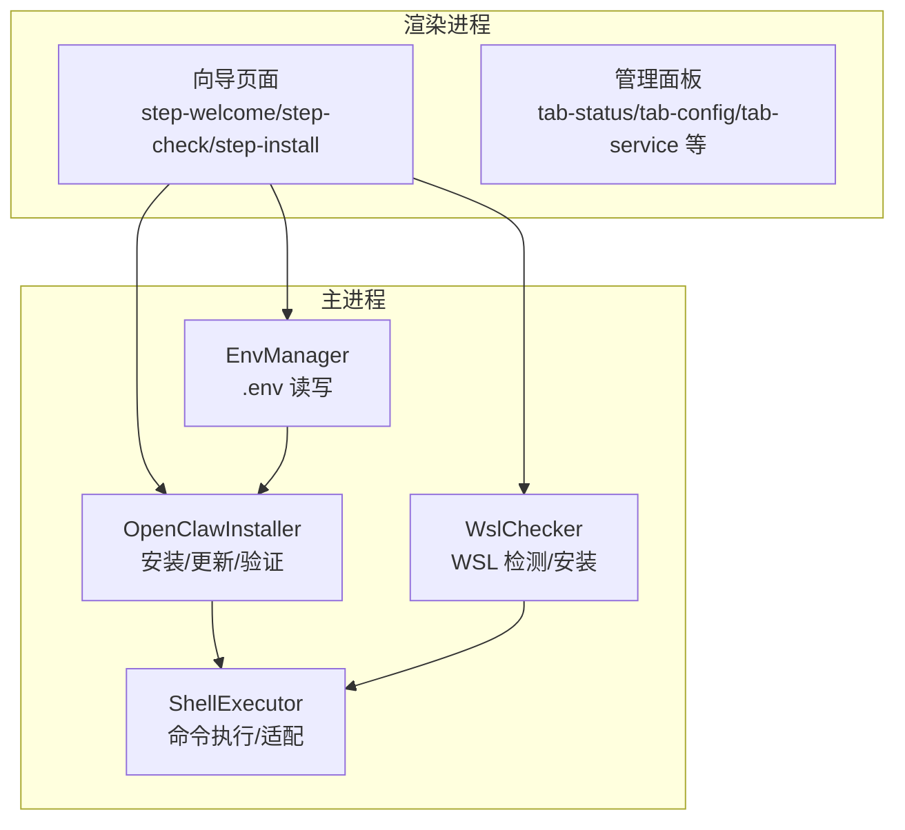
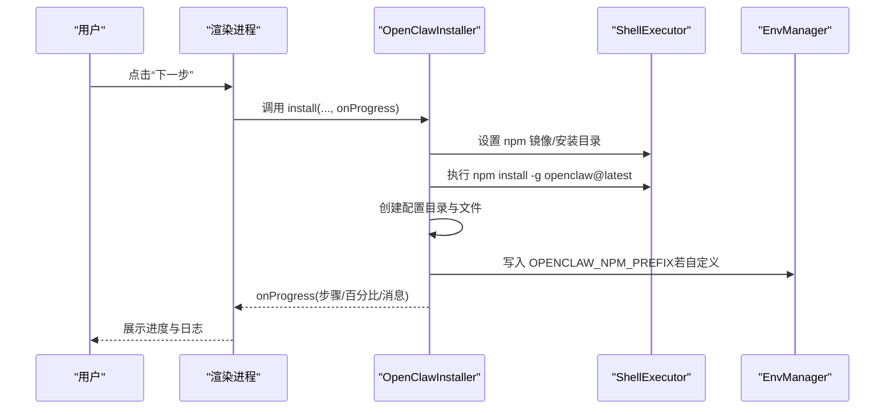
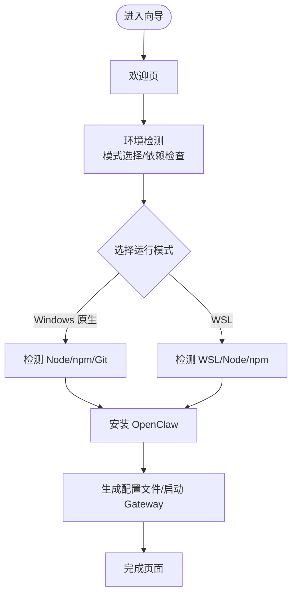
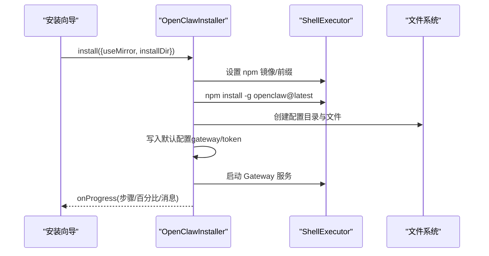
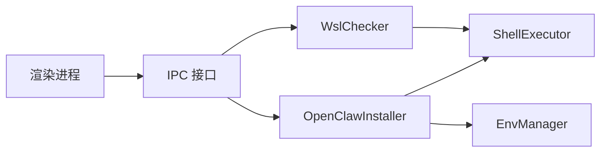

# 快速开始

<cite>
**本文引用的文件**
- [README.md](file://README.md)
- [package.json](file://package.json)
- [scripts/install-openclaw.sh](file://scripts/install-openclaw.sh)
- [src/main/services/openclaw-installer.js](file://src/main/services/openclaw-installer.js)
- [src/main/utils/shell-executor.js](file://src/main/utils/shell-executor.js)
- [src/main/services/wsl-checker.js](file://src/main/services/wsl-checker.js)
- [src/main/services/env-manager.js](file://src/main/services/env-manager.js)
- [src/renderer/js/wizard/wizard-controller.js](file://src/renderer/js/wizard/wizard-controller.js)
- [src/renderer/js/wizard/step-welcome.js](file://src/renderer/js/wizard/step-welcome.js)
- [src/renderer/js/wizard/step-check.js](file://src/renderer/js/wizard/step-check.js)
- [src/renderer/js/wizard/step-install.js](file://src/renderer/js/wizard/step-install.js)
</cite>

## 目录
1. [简介](#简介)
2. [项目结构](#项目结构)
3. [核心组件](#核心组件)
4. [架构总览](#架构总览)
5. [详细组件分析](#详细组件分析)
6. [依赖关系分析](#依赖关系分析)
7. [性能考虑](#性能考虑)
8. [故障排除指南](#故障排除指南)
9. [结论](#结论)
10. [附录](#附录)

## 简介
本指南面向首次接触 OpenClaw 安装管理器的用户，提供从系统要求验证、依赖检查到一键安装与初始配置的完整流程说明。安装管理器基于 Electron，提供全中文图形化界面，支持 Windows 10/11 与 WSL 双运行模式，覆盖“欢迎页—环境检测—OpenClaw 安装—配置设置—完成”五步向导。

- 支持国内 npm 镜像加速，一键切换
- 自动检测并安装缺失依赖（Node.js、npm、Git、WSL）
- 一键安装 OpenClaw 并预生成必要配置文件
- 提供图形化配置面板，替代命令行 onboard

章节来源
- [README.md: 1-35:1-35](file://README.md#L1-L35)

## 项目结构
安装管理器采用主进程（Electron 主进程）+ 渲染进程（向导与面板 UI）的分层设计，核心安装逻辑集中在主进程的服务模块中，渲染进程负责引导用户完成各步骤。

图表来源
- [README.md: 36-90:36-90](file://README.md#L36-L90)
- [src/main/services/openclaw-installer.js: 1-15:1-15](file://src/main/services/openclaw-installer.js#L1-L15)
- [src/main/utils/shell-executor.js: 62-108:62-108](file://src/main/utils/shell-executor.js#L62-L108)
- [src/main/services/wsl-checker.js: 4-98:4-98](file://src/main/services/wsl-checker.js#L4-L98)
- [src/main/services/env-manager.js: 6-21:6-21](file://src/main/services/env-manager.js#L6-L21)

章节来源
- [README.md: 36-90:36-90](file://README.md#L36-L90)

## 核心组件
- OpenClawInstaller：负责安装、更新、版本检测、配置文件生成与 Gateway 启动
- WslChecker：检测 WSL 安装状态、安装 WSL、在 WSL 中安装 Node.js/npm
- EnvManager：读写 .env 文件，管理 API Key 等环境变量
- ShellExecutor：统一命令执行、编码处理、WSL/native 模式适配
- 向导控制器与步骤：step-welcome、step-check、step-install 等

章节来源
- [src/main/services/openclaw-installer.js: 10-13:10-13](file://src/main/services/openclaw-installer.js#L10-L13)
- [src/main/services/wsl-checker.js: 4-98:4-98](file://src/main/services/wsl-checker.js#L4-L98)
- [src/main/services/env-manager.js: 6-21:6-21](file://src/main/services/env-manager.js#L6-L21)
- [src/main/utils/shell-executor.js: 62-108:62-108](file://src/main/utils/shell-executor.js#L62-L108)
- [src/renderer/js/wizard/wizard-controller.js: 2-7:2-7](file://src/renderer/js/wizard/wizard-controller.js#L2-L7)

## 架构总览
安装管理器通过 IPC 与主进程交互，渲染进程负责用户引导，主进程负责系统检测、依赖安装、OpenClaw 安装与配置生成。

图表来源
- [src/main/services/openclaw-installer.js: 117-438:117-438](file://src/main/services/openclaw-installer.js#L117-L438)
- [src/main/utils/shell-executor.js: 136-197:136-197](file://src/main/utils/shell-executor.js#L136-L197)
- [src/renderer/js/wizard/step-install.js: 105-149:105-149](file://src/renderer/js/wizard/step-install.js#L105-L149)

## 详细组件分析

### 安装向导五步流程
- 步骤 1：欢迎页
  - 展示功能列表与操作指引，点击“开始”进入下一步
- 步骤 2：环境检测
  - 选择运行模式（Windows 原生/WSL），检测 Node.js、npm、Git、WSL 状态
  - 可一键安装缺失依赖（WSL、Node.js、Git）
- 步骤 3：OpenClaw 安装
  - 可选启用国内镜像，执行 npm install -g openclaw@latest
  - 实时显示安装进度与日志
- 步骤 4：配置设置
  - 生成默认配置文件，启动 Gateway 服务
  - 可在管理面板中进一步编辑 openclaw.json、API Key、环境变量等
- 步骤 5：完成
  - 显示安装结果与常用命令，进入管理面板

图表来源
- [src/renderer/js/wizard/step-welcome.js: 15-32:15-32](file://src/renderer/js/wizard/step-welcome.js#L15-L32)
- [src/renderer/js/wizard/step-check.js: 18-92:18-92](file://src/renderer/js/wizard/step-check.js#L18-L92)
- [src/renderer/js/wizard/step-install.js: 5-49:5-49](file://src/renderer/js/wizard/step-install.js#L5-L49)
- [src/renderer/js/wizard/wizard-controller.js: 47-89:47-89](file://src/renderer/js/wizard/wizard-controller.js#L47-L89)

章节来源
- [src/renderer/js/wizard/step-welcome.js: 1-49:1-49](file://src/renderer/js/wizard/step-welcome.js#L1-L49)
- [src/renderer/js/wizard/step-check.js: 1-506:1-506](file://src/renderer/js/wizard/step-check.js#L1-L506)
- [src/renderer/js/wizard/step-install.js: 1-180:1-180](file://src/renderer/js/wizard/step-install.js#L1-L180)
- [src/renderer/js/wizard/wizard-controller.js: 1-91:1-91](file://src/renderer/js/wizard/wizard-controller.js#L1-L91)

### 系统要求与依赖检查
- 环境要求
  - Node.js >= 18（推荐 22+）
  - npm
- 依赖检查
  - Windows 原生：检测 Node.js、npm、Git；若缺失可自动安装
  - WSL：检测 WSL 状态与发行版；可一键安装 WSL；在 WSL 中安装 Node.js/npm
- 国内镜像
  - 可一键切换至 npmmirror.com 镜像源，提升安装速度

章节来源
- [README.md: 94-98:94-98](file://README.md#L94-L98)
- [src/renderer/js/wizard/step-check.js: 243-351:243-351](file://src/renderer/js/wizard/step-check.js#L243-L351)
- [src/main/services/wsl-checker.js: 9-98:9-98](file://src/main/services/wsl-checker.js#L9-L98)

### OpenClaw 一键安装流程
- 执行模式
  - Windows 原生：设置 npm prefix，执行 npm install -g openclaw@latest
  - WSL：在 WSL 会话中执行相同流程，确保 PATH 与编码正确
- 配置生成
  - 创建 ~/.openclaw 目录与必要配置文件（openclaw.json、.env、auth-profiles.json、models.json、agent.json）
  - 写入默认 Gateway 参数与认证令牌
- 验证与启动
  - 通过命令获取版本号进行验证
  - 启动 Gateway 服务（由 ServiceController 管理）

图表来源
- [src/main/services/openclaw-installer.js: 117-438:117-438](file://src/main/services/openclaw-installer.js#L117-L438)
- [src/main/utils/shell-executor.js: 136-197:136-197](file://src/main/utils/shell-executor.js#L136-L197)

章节来源
- [src/main/services/openclaw-installer.js: 117-438:117-438](file://src/main/services/openclaw-installer.js#L117-L438)
- [src/main/utils/shell-executor.js: 136-197:136-197](file://src/main/utils/shell-executor.js#L136-L197)

### 配置设置与管理面板
- 环境变量
  - 通过 EnvManager 读写 .env，支持添加/删除 API Key
- 配置文件
  - openclaw.json 可可视化与 JSON 双模式编辑
- 管理面板标签页
  - 状态监控、API 密钥、环境变量、配置编辑、服务管理、日志查看、MCP 服务器、配置档案

章节来源
- [src/main/services/env-manager.js: 6-116:6-116](file://src/main/services/env-manager.js#L6-L116)
- [README.md: 15-27:15-27](file://README.md#L15-L27)

### 开发环境搭建
- 环境要求
  - Node.js >= 18，npm
- 安装依赖
  - 执行 npm install
- 开发运行
  - npm run dev
- 生产运行
  - npm start
- 打包构建
  - 本地构建：npm run build（Windows 安装包/便携版/macOS）
  - Docker 构建：docker compose run --rm build-app/build-mac/build-all

章节来源
- [README.md: 92-141:92-141](file://README.md#L92-L141)
- [package.json: 7-17:7-17](file://package.json#L7-L17)

## 依赖关系分析
- 组件耦合
  - OpenClawInstaller 依赖 ShellExecutor（命令执行/编码处理）、EnvManager（环境变量）、OnboardConfigWriter（配置生成）
  - WslChecker 依赖 ShellExecutor（WSL 命令执行）
  - 渲染进程通过 window.openclawAPI 与主进程通信
- 外部依赖
  - Electron、electron-builder、chokidar、electron-store

图表来源
- [src/main/services/openclaw-installer.js: 1-9:1-9](file://src/main/services/openclaw-installer.js#L1-L9)
- [src/main/services/wsl-checker.js: 1-2:1-2](file://src/main/services/wsl-checker.js#L1-L2)
- [src/main/utils/shell-executor.js: 1-6:1-6](file://src/main/utils/shell-executor.js#L1-L6)
- [src/main/services/env-manager.js: 1-4:1-4](file://src/main/services/env-manager.js#L1-L4)

章节来源
- [src/main/services/openclaw-installer.js: 1-13:1-13](file://src/main/services/openclaw-installer.js#L1-L13)
- [src/main/services/wsl-checker.js: 1-3:1-3](file://src/main/services/wsl-checker.js#L1-L3)
- [src/main/utils/shell-executor.js: 1-7:1-7](file://src/main/utils/shell-executor.js#L1-L7)
- [src/main/services/env-manager.js: 1-5:1-5](file://src/main/services/env-manager.js#L1-L5)

## 性能考虑
- 安装超时与重试
  - npm 安装默认超时较长（30 分钟），网络不佳时可切换国内镜像
- 日志与进度
  - 通过流式输出实时反馈安装进度，便于定位问题
- WSL 模式
  - 使用 wsl --exec 包装命令，避免 PATH 空格导致的环境变量错误

章节来源
- [src/main/utils/shell-executor.js: 208-281:208-281](file://src/main/utils/shell-executor.js#L208-L281)
- [src/main/services/openclaw-installer.js: 183-196:183-196](file://src/main/services/openclaw-installer.js#L183-L196)

## 故障排除指南
- PATH 环境变量配置
  - 症状：命令行提示 openclaw 不是内部或外部命令
  - 解决：在“环境变量”标签页点击“检查 PATH”，选择“添加到 PATH”，重启终端
- 权限问题
  - 症状：添加 PATH 时提示需要管理员权限
  - 解决：应用会自动尝试添加到用户 PATH（不需要管理员权限）；如需系统 PATH，请以管理员身份运行应用
- 资源文件缺失
  - 症状：提示找不到 Node.js 或 Git 安装包
  - 解决：确保 resources/nodejs/ 与 resources/gitbash/ 目录存在对应安装包
- WSL 安装失败
  - 症状：WSL 安装命令执行失败或需要重启
  - 解决：按提示重启后重新运行安装向导；必要时手动安装 Linux 发行版

章节来源
- [README.md: 260-288:260-288](file://README.md#L260-L288)
- [src/main/services/wsl-checker.js: 113-212:113-212](file://src/main/services/wsl-checker.js#L113-L212)

## 结论
OpenClaw 安装管理器通过图形化向导简化了复杂的安装与配置流程，支持 Windows 原生与 WSL 双模式，自动处理依赖与配置，适合不同技术背景的用户快速上手。遇到问题时，可依据故障排除指南与日志信息定位并解决。

## 附录

### 安装向导五步详解
- 欢迎页
  - 展示功能列表与操作指引
- 环境检测
  - 选择运行模式（Windows 原生/WSL）
  - 检测 Node.js、npm、Git、WSL 状态；一键安装缺失依赖
- OpenClaw 安装
  - 可选启用国内镜像；执行 npm install -g openclaw@latest
  - 实时显示安装进度与日志
- 配置设置
  - 自动生成默认配置文件，启动 Gateway 服务
- 完成
  - 显示安装结果与常用命令，进入管理面板

章节来源
- [src/renderer/js/wizard/step-welcome.js: 15-32:15-32](file://src/renderer/js/wizard/step-welcome.js#L15-L32)
- [src/renderer/js/wizard/step-check.js: 18-92:18-92](file://src/renderer/js/wizard/step-check.js#L18-L92)
- [src/renderer/js/wizard/step-install.js: 5-49:5-49](file://src/renderer/js/wizard/step-install.js#L5-L49)

### 开发运行命令参考
- 安装依赖：npm install
- 开发运行：npm run dev
- 生产运行：npm start
- 打包构建：npm run build / build:portable / build:mac / build:all

章节来源
- [README.md: 99-115:99-115](file://README.md#L99-L115)
- [package.json: 7-17:7-17](file://package.json#L7-L17)